# System Design: Designing Chess.com

## Real-Time Online Chess Platform — An Evolutionary Architecture from Two Players to Millions of Concurrent Games

---

## Table of Contents

1. [Requirements & Scope](#1-requirements--scope)
2. [Stage 1: Single Server — "Two Friends Playing Chess"](#2-stage-1-single-server--two-friends-playing-chess)
3. [Stage 2: Shared State — "Surviving Server Crashes"](#3-stage-2-shared-state--surviving-server-crashes)
4. [Stage 3: Separation of Concerns — "Real-Time at Scale"](#4-stage-3-separation-of-concerns--real-time-at-scale)
5. [Stage 4: Distributed Matchmaking & Event-Driven Architecture](#5-stage-4-distributed-matchmaking--event-driven-architecture)
6. [Stage 5: Global Scale — "Chess.com Level"](#6-stage-5-global-scale--chesscom-level)
7. [Failure Modes & Resilience](#7-failure-modes--resilience)
8. [Design Trade-offs & Alternative Choices](#8-design-trade-offs--alternative-choices)
9. [Data Model & Storage Architecture](#9-data-model--storage-architecture)
10. [Key Design Principles](#10-key-design-principles)

---

## 1. Requirements & Scope

### Functional Requirements

- **Matchmaking**: Match players of similar skill (Glicko-2 rating) within seconds
- **Game Play**: Real-time, turn-based chess with full rule enforcement (castling, en passant, promotion, check, checkmate, stalemate, draw conditions)
- **Time Controls**: Bullet (1+0), Blitz (3+0, 5+0), Rapid (10+0, 15+10), Classical — each player has independent countdown clocks with optional increment
- **Reconnection**: Players can rejoin a game after temporary disconnection
- **Game History**: All games persisted in PGN format for replay and analysis
- **Spectating**: Any game can be watched in real-time by thousands of spectators
- **Leaderboard**: Global and time-control-specific rankings

### Non-Functional Requirements

| Requirement | Target | Rationale |
|---|---|---|
| Move latency | < 200ms p99 | Competitive players notice > 300ms |
| Clock accuracy | ± 50ms server-side | Bullet games have 1-second decisions |
| Concurrent games | 500K+ simultaneous | Chess.com peak during major events |
| Connected users | 1M+ WebSocket connections | 2x games (2 players + spectators) |
| Availability | 99.95% (< 26 min downtime/month) | Games in progress cannot be interrupted |
| Consistency | Strong consistency per game | Both players MUST see same board state |
| Partition tolerance | Graceful degradation | Prefer availability with per-game consistency |

### Scale Estimation (Back-of-Envelope)

```
Daily Active Users:     10M
Peak concurrent users:  1M
Peak concurrent games:  500K
Avg moves per game:     ~40 (80 half-moves)
Avg game duration:      ~7 minutes (blitz)
Move message size:      ~200 bytes
Moves per second peak:  500K games × (80 moves / 420s) ≈ 95K moves/sec
WS messages/sec:        95K × 2 (both players) + spectators ≈ 250K msg/sec
Storage per game:       ~2KB (metadata) + ~3KB (moves) = ~5KB
Daily new games:        ~15M games → ~75GB/day raw
```

These numbers frame our entire scaling journey. We won't need to handle 500K concurrent games on day one — but every architectural choice we make should have a path toward it. Let's start from the very beginning.

---

## 2. Stage 1: Single Server — "Two Friends Playing Chess"

**Target: ~10 concurrent games, proof of concept**

At this stage, we're building the simplest thing that could possibly work. One server, one process, everything in memory.

### Architecture

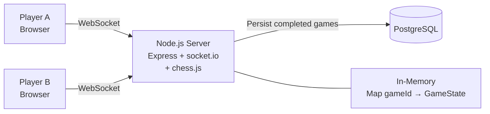

**Stack:**
- Single Node.js/Express server
- `socket.io` for WebSocket connections
- `chess.js` for move validation
- PostgreSQL for persisting completed games
- `Map<gameId, GameState>` in-memory for active games

### Game State Data Structure (in-memory)

```json
{
  "gameId": "g-abc123",
  "fen": "rnbqkbnr/pppppppp/8/8/4P3/8/PPPP1PPP/RNBQKBNR b KQkq e3 0 1",
  "moves": ["e2e4"],
  "moveCount": 1,
  "turn": "black",
  "whitePlayerId": "u-111",
  "blackPlayerId": "u-222",
  "whiteClock_ms": 284100,
  "blackClock_ms": 300000,
  "lastMoveTimestamp_ms": 1708123456789,
  "timeControl": {"base_ms": 300000, "increment_ms": 0},
  "status": "in_progress",
  "result": null,
  "createdAt": 1708123400000
}
```

**Why FEN + Move List (not just FEN)?**
- FEN alone captures current position but not history
- Move list enables: threefold repetition detection, 50-move rule, game replay
- This is essentially **event sourcing** — the move list IS the event log, FEN is the materialized view

### Chess Move Validation Engine

The server-side chess engine must handle **all** rules:

- **Basic moves**: Each piece type has specific movement patterns
- **Captures**: Including en passant (requires knowing the previous move)
- **Castling**: Requires tracking whether king/rooks have moved (FEN castling flags)
- **Pawn promotion**: Must specify promotion piece
- **Check/Checkmate/Stalemate detection**: After each move, compute all legal moves for the opponent. Zero legal moves + in check = checkmate. Zero legal moves + not in check = stalemate.
- **Draw conditions**:
  - Threefold repetition (same position 3 times — requires full move history)
  - 50-move rule (50 moves without pawn move or capture — tracked in FEN halfmove clock)
  - Insufficient material (K vs K, K+B vs K, K+N vs K)
  - Draw by agreement (both players agree)

**Implementation Choice: Library vs. Custom**

| Approach | Pros | Cons |
|---|---|---|
| Use `chess.js` (Node) or `python-chess` | Battle-tested, handles all edge cases | Language-locked, dependency risk |
| Custom engine in Go/Rust | Full control, optimized for server | Months of work, bug-prone |
| **Recommended**: Wrap proven library | Best of both: correctness + performance tuning | Slight abstraction overhead |

For production: wrap `chess.js` or `python-chess` in a service, with bitboard optimizations for hot paths (legal move generation).

### Move Validation Pipeline

```
1. Deserialize move: {from: "e2", to: "e4", promotion?: "q"}
2. Load game state from in-memory Map
3. Verify it's this player's turn
4. Verify player clock > 0 (compute elapsed since lastMoveTimestamp)
5. Validate move legality against current FEN (chess engine)
6. Apply move → generate new FEN
7. Check: is this checkmate? stalemate? draw?
8. Update clocks: deduct elapsed time, add increment
9. Update in-memory Map
10. Broadcast move to both players via WebSocket
```

### Server-Authoritative Clocks (Even at Stage 1)

Even at this stage, the clock must be **server-authoritative**. Clients cannot be trusted.

**Why Server-Authoritative (not client clocks)?**
- Clients can be manipulated (hacked clocks, artificial lag)
- Network latency varies between players — one player shouldn't be penalized
- A tampered client could claim "I still had 5 seconds"

**How Server-Authoritative Clocks Work:**

```
State stored per game:
  white_clock_ms: 284100       # Time remaining when clock was LAST STOPPED
  black_clock_ms: 300000       # Time remaining when clock was LAST STOPPED
  last_move_timestamp_ms: T    # Server timestamp when last move was processed
  active_clock: "white"        # Whose clock is currently ticking

On move received from White:
  1. elapsed = server_now() - last_move_timestamp_ms
  2. white_clock_ms -= elapsed
  3. if white_clock_ms <= 0:
       → White loses on time (end game)
  4. white_clock_ms += increment_ms (if time control has increment)
  5. active_clock = "black"
  6. last_move_timestamp_ms = server_now()
  7. Broadcast to both clients: {white_clock: X, black_clock: Y}
```

**Clock is NEVER "running" on the server.** It's a "last snapshot + elapsed" calculation. This is the **lazy evaluation pattern** — and it's critical even at small scale because it means we never need background timers per game.

### What Works at Stage 1

- Simple, fast to build
- In-memory state = lowest possible latency
- Single process = no coordination needed
- Perfect for prototyping and validating game logic

### What Breaks — Why We Need Stage 2

- **Server crash = all games lost** (in-memory state is gone)
- **Single machine limits**: ~10K WebSocket connections
- **No redundancy**: one server goes down, the entire platform is offline
- **No horizontal scaling**: can't add more servers to handle more players

Once you have more than a handful of concurrent players, you need to survive a server restart without losing everyone's games. That leads us to Stage 2.

---

## 3. Stage 2: Shared State — "Surviving Server Crashes"

**Target: ~1K concurrent games**

### The Problem

In Stage 1, game state lives in a Node.js process's memory. If that process crashes — or you need to deploy a new version — every active game is destroyed. You also can't run multiple servers because two players in the same game might connect to different servers, and neither server has the other's game state.

### The Solution: Redis as External State Store

Move game state out of server memory and into **Redis**. Servers become stateless processors that read from and write to Redis. Multiple servers can now share the same game state.

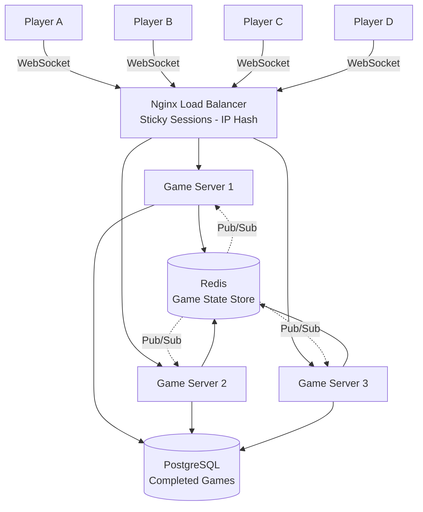

### What Changed from Stage 1

| Component | Stage 1 | Stage 2 |
|---|---|---|
| Game state | In-memory `Map` | Redis (external) |
| Server count | 1 | 2-3 behind load balancer |
| Load balancing | None | Nginx with sticky sessions (IP hash) |
| Cross-server messaging | N/A | Redis Pub/Sub |
| Crash recovery | Games lost | Games survive (state in Redis) |

### Why Redis?

When two players are on different servers, both servers need access to the same game state. Redis gives us:
- **Sub-millisecond reads**: Game state access in < 1ms
- **Atomic operations**: `MULTI/EXEC` for safe concurrent updates
- **Pub/Sub**: Cross-server message routing for broadcasting moves

### Move Validation Pipeline (Updated for Redis)

```
1. Deserialize move: {from: "e2", to: "e4", promotion?: "q"}
2. Load game state from Redis (with optimistic lock via WATCH)
3. Verify it's this player's turn
4. Verify player clock > 0 (compute elapsed since lastMoveTimestamp)
5. Validate move legality against current FEN (chess engine)
6. Apply move → generate new FEN
7. Check: is this checkmate? stalemate? draw?
8. Update clocks: deduct elapsed time, add increment
9. Persist to Redis atomically (MULTI/EXEC)
10. Publish move event via Redis Pub/Sub → all servers forward to connected clients
```

### Event Sourcing: A Natural Fit for Chess

Chess is **inherently event-sourced**. The sequence of moves IS the complete history. The current board position (FEN) is a **derived materialized view** of the move list.

```
Event Log (Source of Truth):
  Move 1: e2→e4  (timestamp, clock_state)
  Move 2: e7→e5  (timestamp, clock_state)
  Move 3: Ng1→f3 (timestamp, clock_state)
  ...

Materialized View (derived):
  FEN: "rnbqkb1r/pppp1ppp/5n2/4p3/4P3/5N2/PPPP1PPP/RNBQKB1R w KQkq - 2 3"
```

**Benefits of event sourcing at this stage:**
1. **Complete audit trail**: Every move with timestamps — essential for anti-cheat
2. **Game replay**: Play back any game move by move
3. **Crash recovery**: Replay events to reconstruct state on any server
4. **Spectator catch-up**: New spectator can receive the event log to sync up
5. **Analysis**: Post-game engine analysis per move

**Performance Optimization: Snapshots**

For long games (60+ moves), replaying from scratch is expensive. Use periodic snapshots:

```
Every N moves (e.g., every 20):
  Snapshot = {fen, clocks, moveCount, castling_flags, ...}

Recovery:
  1. Load latest snapshot
  2. Replay only moves since snapshot
```

### Redis Data Model

```
Active game state (hot):
  game:{gameId}:state → JSON blob (FEN, clocks, status)
  game:{gameId}:moves → List of move strings (event log)

Session mapping:
  player:{userId}:game → current gameId

TTL policy:
  Active game keys: no TTL (explicit cleanup on game end)
  Completed game keys: 1 hour TTL (async archival to PostgreSQL)
```

### Sticky Sessions for WebSocket

WebSocket is a persistent connection. If Player A's WebSocket connects to Server 1, that connection MUST stay on Server 1 for the lifetime of the game. IP hash ensures this:

```
Nginx config:
  upstream game_servers {
    ip_hash;
    server game1:3000;
    server game2:3000;
    server game3:3000;
  }
```

### Cross-Server Message Routing via Redis Pub/Sub

When White (on Server 1) makes a move, Black (on Server 2) must receive it:

```
1. Server 1 processes White's move, writes to Redis
2. Server 1 publishes to Redis channel: "game:{gameId}"
3. Server 2 is subscribed to "game:{gameId}" (because Black is connected there)
4. Server 2 receives the message and forwards to Black's WebSocket
```

### What Works at Stage 2

- **Crash resilience**: Server crashes don't lose game state
- **Horizontal scaling**: 2-3 servers behind a load balancer
- **~1K concurrent games**: Comfortably handled
- **Event sourcing**: Full game history for replay and recovery

### What Breaks — Why We Need Stage 3

- **Single Redis instance**: One Redis server is a single point of failure and a scaling bottleneck
- **Monolith coupling**: The game server handles everything — WebSocket connections, move validation, matchmaking, spectating. These have very different scaling characteristics:
  - WebSocket connections are **memory-bound** (~20-50KB per connection)
  - Move validation is **CPU-bound**
  - Matchmaking is **I/O-bound**
- **Clock fairness at scale**: With thousands of games, we need a systematic approach to timeout detection — not per-game timers
- **Deployment friction**: Updating matchmaking logic requires redeploying the entire server

---

## 4. Stage 3: Separation of Concerns — "Real-Time at Scale"

**Target: ~50K concurrent games**

### The Problem

The monolith server does everything: WebSocket management, move validation, matchmaking, spectator broadcasting, and timer management. At 50K concurrent games with 100K+ WebSocket connections, these responsibilities have fundamentally different scaling needs:

| Responsibility | Scaling Dimension | Bottleneck |
|---|---|---|
| WebSocket connections | Memory (20-50KB each) | RAM |
| Move validation | CPU (chess engine) | Compute |
| Matchmaking | I/O (Redis queries) | Queue throughput |
| Spectator broadcast | Bandwidth (fan-out) | Network |

You can't efficiently scale a monolith when one part needs more memory while another needs more CPU.

### The Solution: Microservices Decomposition

Split the monolith into specialized services, each scaled independently.

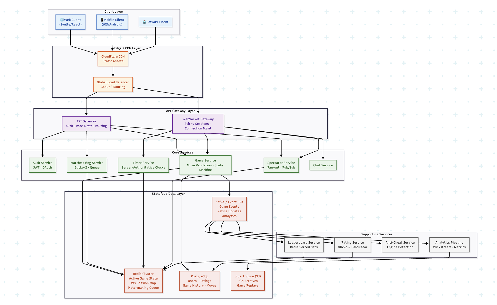

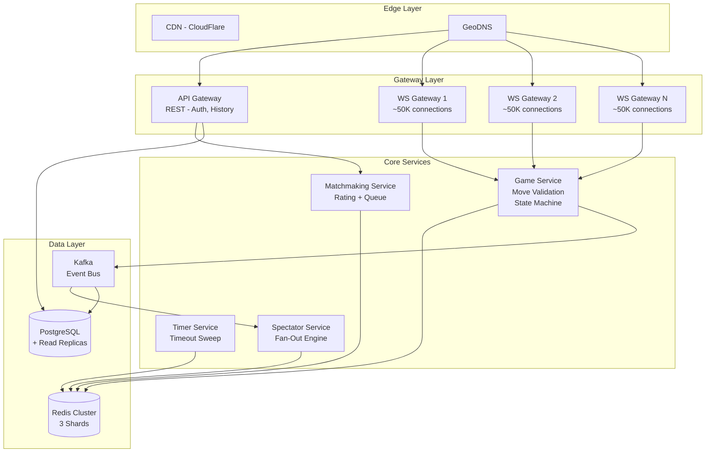

### Layer Breakdown

**Edge Layer** — CDN (CloudFlare) for static assets (board images, piece sprites, JS bundles). GeoDNS routes players to the nearest regional cluster.

**Gateway Layer** — Two distinct gateways:
- **API Gateway**: Handles REST requests (auth, matchmaking initiation, game history queries). Stateless, horizontally scalable.
- **WebSocket Gateway**: Maintains persistent connections. Stateful by nature (holds TCP connections), so requires sticky sessions and special scaling patterns.

**Core Services Layer** — Each service owns a single domain:
- **Game Service**: The brain — validates moves, manages game state machine, enforces rules
- **Matchmaking Service**: Pairs players by rating, time control, and fairness criteria
- **Timer Service**: Server-authoritative clock countdown (critical for fairness)
- **Spectator Service**: Fan-out engine for broadcasting to watchers

**Data Layer** — Polyglot persistence:
- **Redis Cluster**: Active game state (hot path), WebSocket session registry, matchmaking queues, leaderboard sorted sets
- **PostgreSQL**: Users, ratings, completed game records (cold path, durable)
- **Kafka**: Event bus for decoupled communication — rating updates, analytics, anti-cheat signals

### Why This Layering?

The key architectural insight for chess (vs. FPS games) is that each game is **independently stateful but low-throughput**. A chess game produces ~0.2 moves/second on average. The challenge isn't per-game throughput — it's the **sheer number of simultaneous independent games** with strong per-game consistency requirements.

This means:
- Games can be **trivially sharded** by `gameId` — no cross-game state dependencies
- Each game server can manage hundreds of concurrent games
- Horizontal scaling is straightforward: more game servers = more games

### Deep Dive: WebSocket Gateway Separation

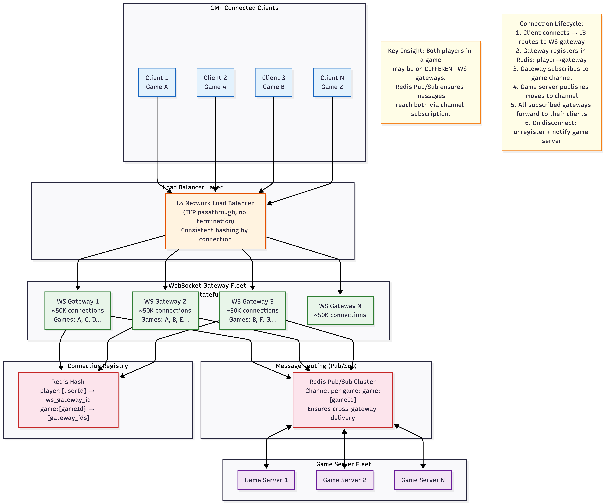

Each WebSocket connection consumes **~20-50KB** of memory (TCP buffers, TLS state, application-level session data). At 1M connections:

```
1M connections × 30KB avg = ~30GB RAM
Split across 20 WS gateway pods = ~50K connections per pod (~1.5GB RAM each)
```

**Why WebSockets (not HTTP polling / SSE)?**

| Protocol | Direction | Overhead | Latency | Use Case |
|---|---|---|---|---|
| HTTP Polling | Client→Server | High (headers per request) | 1-5s (poll interval) | Too slow for chess |
| Long Polling | Client→Server (held open) | Moderate | ~500ms | Acceptable but wasteful |
| SSE | Server→Client only | Low | Real-time | Can't send moves upstream |
| **WebSocket** | **Bidirectional** | **Minimal (2-byte frame header)** | **Real-time** | **Perfect for chess** |

Chess requires **bidirectional real-time** — both players send moves AND receive opponent's moves. WebSocket is the clear winner.

**Key design: Separate WS Gateways from Game Servers**

```
WS Gateway (stateful):
  - Maintains TCP connections
  - Routes messages to/from game servers
  - Does NOT contain game logic
  - Scaled based on connection count

Game Server (stateless):
  - Contains all game logic
  - Reads/writes game state from Redis
  - Scaled based on CPU (move validation)
  - Any game server can handle any game
```

This separation means:
- A WS gateway crash only drops connections (clients reconnect)
- A game server crash doesn't drop any connections
- Can scale each independently

### Deep Dive: Cross-Gateway Message Routing (Redis Pub/Sub)

Both players in a game might be on DIFFERENT WS gateways. When White moves, the message must reach Black on a different gateway.

**Solution: Redis Pub/Sub per game**

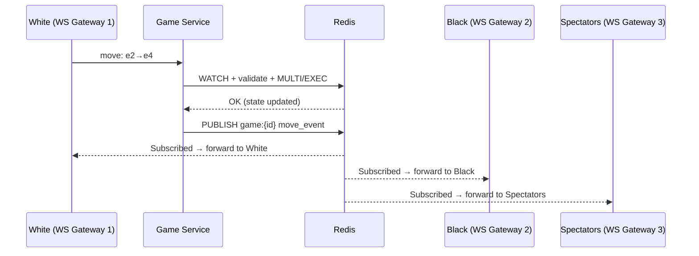

```
1. When a client connects to a game:
   - WS gateway subscribes to Redis channel: "game:{gameId}"

2. When game server processes a move:
   - PUBLISH to "game:{gameId}" → {type: "move", data: ...}

3. All WS gateways subscribed to that channel receive the message:
   - Forward to the client connected to them
```

**At 500K games, that's 500K Redis channels.** Redis handles this well — each channel is a linked list of subscribers. Memory cost is ~100 bytes per subscription.

### Connection Lifecycle

```
1. CONNECT:
   - Client establishes WS connection to gateway
   - Gateway authenticates JWT token
   - Register: HSET player:{userId} gateway_id, game_id
   - Subscribe to game channel

2. MESSAGE (move):
   - Gateway forwards to game server (via internal RPC or direct Redis queue)
   - Game server validates, updates state, publishes result
   - All subscribed gateways receive and forward to clients

3. HEARTBEAT:
   - Client sends ping every 15s
   - Gateway responds with pong
   - If no ping for 30s → consider disconnected

4. DISCONNECT:
   - Gateway detects closed connection
   - Unregister from Redis
   - Notify game server → start disconnect grace period
   - Unsubscribe from game channel
```

### Deep Dive: Server-Authoritative Clocks at Scale

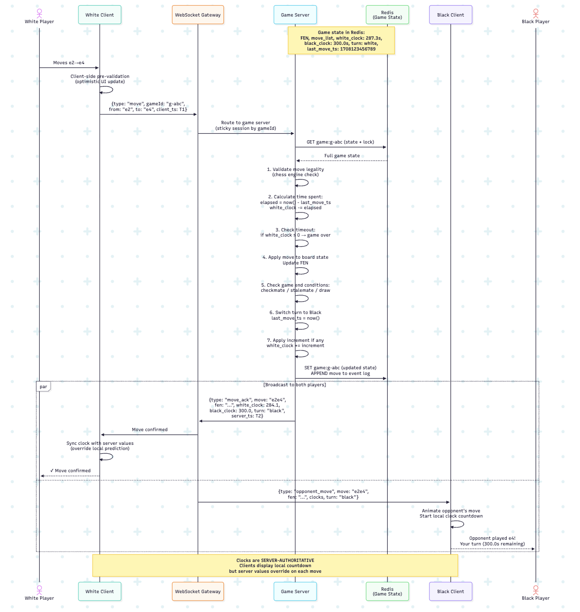

At 50K concurrent games, the "lazy evaluation" pattern from Stage 1 becomes essential — and we add a **timeout sweep** for detecting time-outs without running individual timers.

**Why Not Individual Timers?**

At 500K concurrent games, if each game has an active timer, that's 500K `setTimeout()` calls. Even if each fires only when time expires:

- JavaScript's event loop handles timers in a min-heap, but 500K entries cause GC pressure
- Timer resolution in Node.js is ~1ms, but accuracy degrades under load
- Each game server might handle 5K-10K games — still manageable with careful design

**The "Lazy Evaluation" Pattern:**

Instead of running a timer for every game, **compute time remaining on-demand**:

```python
def get_remaining_time(game):
    if game.active_clock == game.turn:
        elapsed = current_time_ms() - game.last_move_timestamp_ms
        return game.clock_ms[game.turn] - elapsed
    else:
        return game.clock_ms[game.turn]  # Not ticking

def is_timed_out(game):
    return get_remaining_time(game) <= 0
```

**But how do we detect timeouts if no one moves?**

If a player's clock runs out and they simply don't move, the server must still end the game. This requires the **Timeout Sweep**:

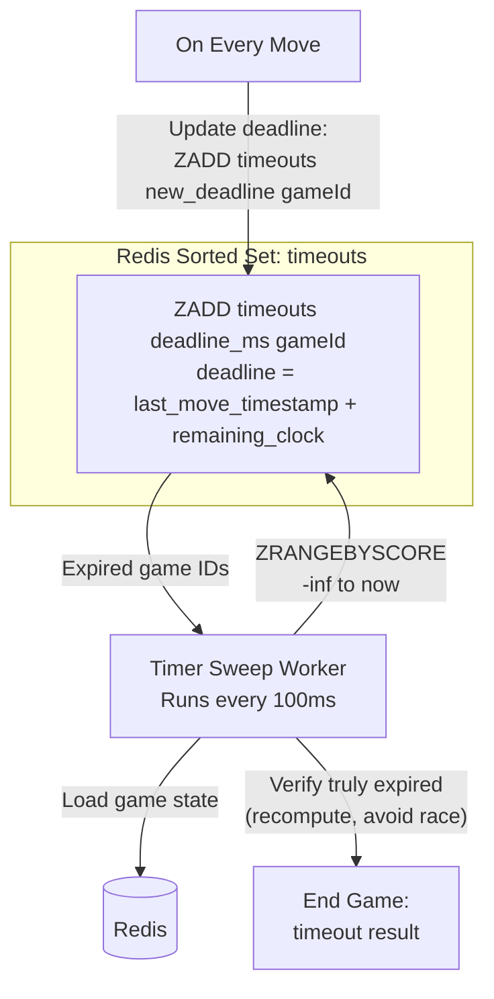

```python
# Redis sorted set: ZADD timeouts <deadline_ms> <gameId>
# Deadline = last_move_timestamp + remaining_clock

# Sweep worker (runs every 100ms):
expired_games = redis.zrangebyscore("timeouts", "-inf", current_time_ms())
for gameId in expired_games:
    game = load_game(gameId)
    if is_timed_out(game):  # Re-verify (avoid stale data race)
        end_game(game, reason="timeout", loser=game.turn)
    redis.zrem("timeouts", gameId)
```

**On every move**, update the sorted set:

```python
def after_move(game):
    next_player_clock = game.clock_ms[game.turn]
    deadline = game.last_move_timestamp_ms + next_player_clock
    redis.zadd("timeouts", {game.gameId: deadline})
```

### Time Control Variants

| Control | Base | Increment | Example | Design Implication |
|---|---|---|---|---|
| Bullet | 1-2 min | 0-1s | 1+0 | Extremely time-sensitive, < 50ms accuracy needed |
| Blitz | 3-5 min | 0-2s | 5+0 | Most popular, moderate time pressure |
| Rapid | 10-15 min | 0-10s | 15+10 | Longer, increment adds complexity |
| Classical | 30+ min | varies | 30+30 | Less latency-sensitive, but longer server resource hold |

Increment handling:

```
After a valid move:
  player_clock += increment_ms
  # E.g., in 3+2 (3 min + 2s increment):
  # Player uses 1.5s to move, then gets 2s back
  # Net: gained 0.5s
```

### Handling Network Latency Compensation

When a player's move arrives at the server, some time was spent in transit. Should this transit time count against the player?

| Policy | How | Chess.com Approach |
|---|---|---|
| Count transit time | Simple — just use server timestamps | Penalizes players with bad connections |
| Subtract estimated RTT | Server tracks avg RTT per player, deducts half | Fairer, but gameable |
| **Hybrid** (recommended) | Cap compensation at e.g., 200ms, based on measured RTT | Balance between fairness and anti-cheat |

Chess.com uses a **server-timestamp approach with some compensation** — they don't penalize obvious network delays but also don't allow clients to claim arbitrary timestamps.

### Client-Side Clock Display

Even though the server is authoritative, the client must show a smooth countdown:
1. After receiving a server clock update, set local clock to server value
2. Run a local `setInterval(100ms)` decrementing the active clock
3. When the next move arrives from server, **override** local values with server values
4. Visual discrepancy is typically < 100ms — imperceptible

### What Works at Stage 3

- **Independent scaling**: WS gateways scale by memory, game servers by CPU
- **~50K concurrent games**: Redis Cluster with 3 shards handles the throughput
- **Fault isolation**: A game server crash doesn't drop WebSocket connections
- **Independent deployment**: Update matchmaking without touching game logic
- **Kafka event bus**: Decoupled downstream processing (archival, analytics, ratings)

### What Breaks — Why We Need Stage 4

- **Single matchmaking queue bottleneck**: One matchmaker processing all players becomes a bottleneck at peak load
- **Tight coupling in matchmaking**: The matchmaker directly writes to Redis and creates games — no async pipeline
- **No game archival pipeline**: Completed games need to flow from Redis → PostgreSQL → S3 reliably
- **Matchmaking fairness**: Simple rating range ± 25 doesn't account for rating uncertainty (Glicko-2 RD)

---

## 5. Stage 4: Distributed Matchmaking & Event-Driven Architecture

**Target: ~200K concurrent games**

### The Problem

At 200K concurrent games, matchmaking is processing thousands of match requests per second. A single matchmaking process scanning a Redis sorted set becomes a bottleneck — especially during peak hours when thousands of players queue simultaneously for popular time controls like blitz 5+0.

Additionally, completed games need a reliable pipeline to flow from Redis (hot storage) → PostgreSQL (warm) → S3 (cold archive), and rating updates need to happen asynchronously without blocking game flow.

### The Solution: Kafka Event Bus + Sharded Matchmaking + Glicko-2

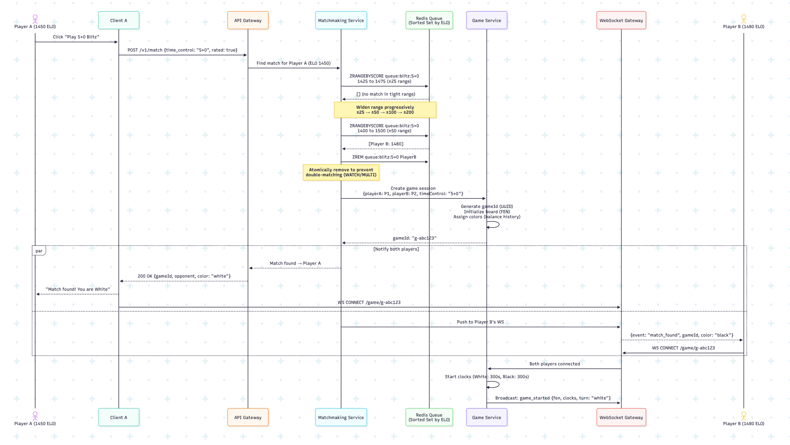

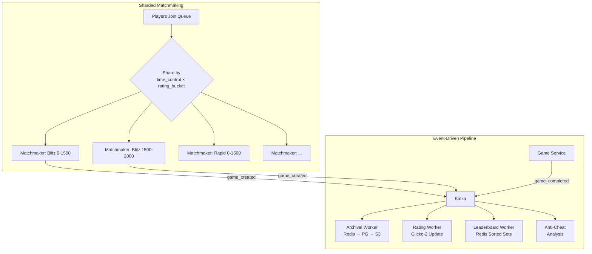

### Deep Dive: Matchmaking Queue Architecture

**Rating System: Glicko-2**

Chess.com transitioned from Elo to **Glicko-2** (developed by Mark Glickman). Glicko-2 adds two dimensions beyond a single number:

- **Rating (r)**: The skill estimate (e.g., 1500)
- **Rating Deviation (RD)**: Uncertainty — new/inactive players have high RD (system is unsure about their true rating); active players have low RD
- **Volatility (σ)**: How consistently the player performs

**Why Glicko-2 over Elo?**
- Elo treats a player who plays 1000 games the same as someone who played 10 — their rating has equal "confidence"
- Glicko-2's RD means inactive players' ratings are "less certain," so matchmaking can account for this
- Elo can create rating inflation/deflation pools; Glicko-2 self-corrects

**Matchmaking Queue Data Structure:**

```
Data structure: Redis Sorted Set per (time_control, rated/unrated)
  Key:   "mm:queue:blitz:5+0:rated"
  Score: player_rating (Glicko-2 r)
  Value: {playerId, rating, rd, joinedAt, minOpponentRating, maxOpponentRating}

Algorithm:
  1. Player joins queue: ZADD with their rating as score
  2. Search for match:
     a. Start with tight range: rating ± 25
     b. ZRANGEBYSCORE to find candidates in range
     c. Filter by: mutual rating acceptance, recent opponent history, color balance
     d. If no match: widen range by 25 every 2 seconds
     e. Maximum range: ± 200 (configurable by rating tier)
  3. On match found:
     a. MULTI: ZREM both players atomically (prevent double-match)
     b. Create game session
     c. Notify both players via WebSocket

Race condition prevention:
  - Use Redis WATCH/MULTI/EXEC for optimistic locking
  - If another matchmaker already removed a player, the MULTI fails → retry
  - Alternative: Lua script for atomic find-and-remove
```

**Distributed Matchmakers — Sharding Strategy:**

With 500K concurrent seekers, a single matchmaker becomes a bottleneck. Solutions:

| Approach | How | Pros | Cons |
|---|---|---|---|
| **Single queue, sharded by time control** | Each time control has its own queue + dedicated matchmaker | Simple, no coordination | Popular controls (blitz 5+0) still hot |
| **Partitioned by rating range** | Shard queue by rating buckets (0-1000, 1000-1500, etc.) | Parallelizes well | Boundary players might miss cross-shard matches |
| **Regional + global** | Match within region first, escalate to cross-region after timeout | Low latency matches | Cross-region adds complexity |
| **Recommended: Hybrid** | Shard by time_control × rating_bucket, with a "boundary overlap" of ± 50 | Best parallelism | Slightly complex boundary handling |

### Color Assignment

Chess.com doesn't randomly assign colors. It tracks your recent color history and balances:
- If you played White last 3 games, you get Black
- If both players have same imbalance, random assignment

### Deep Dive: Game State Archival Pipeline (Redis → PostgreSQL → S3)

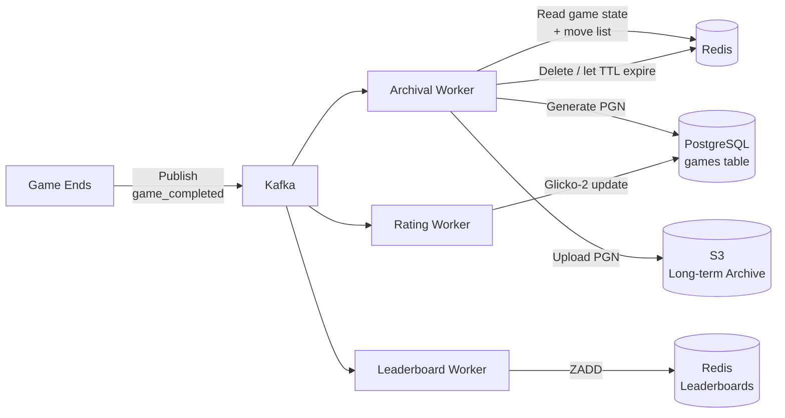

```
1. Game ends → publish "game_completed" event to Kafka
2. Archival worker consumes event:
   a. Read full game state + move list from Redis
   b. Generate PGN (standard chess notation)
   c. INSERT into PostgreSQL games table
   d. Upload PGN to S3 for long-term storage
3. Delete Redis keys (or let TTL expire)
4. Update player ratings (separate consumer)
5. Update leaderboard (separate consumer)
```

### What Works at Stage 4

- **Parallel matchmaking**: Sharded by time_control × rating_bucket
- **Reliable event pipeline**: Kafka ensures no game data is lost between Redis and PostgreSQL
- **Decoupled services**: Rating updates, analytics, anti-cheat all consume events independently
- **~200K concurrent games**: Infrastructure scales horizontally

### What Breaks — Why We Need Stage 5

- **Single region**: All servers are in one data center. Players in Asia connecting to US servers experience 200ms+ latency
- **Global latency**: For competitive bullet chess, even 150ms cross-continent latency is noticeable
- **Regional failure**: If the one data center goes down, the entire platform is offline

---

## 6. Stage 5: Global Scale — "Chess.com Level"

**Target: ~500K+ concurrent games**

### The Problem

With a single-region deployment, players on the other side of the world suffer from high latency. A bullet chess player in Tokyo connecting to US-East servers faces ~150ms round-trip time — that's 150ms of their 60-second clock consumed just by network transit on every move. And if that single region goes down, the entire platform disappears.

### The Solution: Multi-Region Deployment

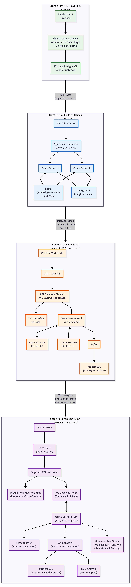

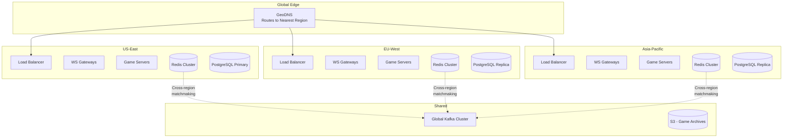

### Infrastructure at Global Scale

```
Multi-region deployment (US-East, US-West, EU-West, Asia-Pacific):
  + GeoDNS routing players to nearest region
  + Regional Redis clusters (game state stays in the region where the game was created)
  + Cross-region matchmaking coordination
  + Database sharding by userId for users table, by gameId for games
  + Kafka cluster with partitioning by gameId
  + Full observability stack (Prometheus, Grafana, PagerDuty)
```

### Deep Dive: Where Does the Game Live?

This is the most critical design decision for a multi-region chess platform:

```
Critical design decision: WHERE does the game live?
  - Game is created in the region of the first-matched player
  - Both players connect to that region's game server
  - If Player A is in US-East and Player B is in EU-West,
    the game runs in one region, and the remote player has higher latency
  - This is acceptable for chess (turn-based, sub-200ms is fine)
  - Alternative: run game in the region closest to both (median latency optimization)
```

**Why not replicate game state across regions?** Because chess requires **strong per-game consistency** — both players must see the exact same board. Cross-region replication introduces latency that's worse than just having one player with slightly higher latency to a single region.

### Deep Dive: Database Sharding Strategy

```
Users + Ratings: Shard by user_id (consistent hash)
  - ~150M registered users
  - Each shard handles ~10M users
  - Cross-shard queries (e.g., leaderboard) use pre-computed Redis sorted sets

Games: Shard by game_id (range-based by date)
  - Older games are cold data → moved to cheaper storage / archived partitions
  - Recent games (last 30 days) in hot shards
  - Partition by month naturally segments data

Why user_id sharding for users?
  - User profiles are read-heavy (every matchmaking request, every game start)
  - Access pattern is almost always by userId → perfect for hash sharding
  - Avoids hotspots (userId is UUID, uniform distribution)
```

### Deep Dive: Observability at Scale

**Key Metrics to Monitor**

*Game Health:*
- Active games count (should match expected from matchmaking rate)
- Average move processing time (target: < 50ms p99)
- Clock accuracy (server time vs. measured elapsed)
- Games ended by timeout vs. checkmate vs. resignation (shifts in ratio = possible issues)

*Infrastructure Health:*
- WebSocket connection count per gateway
- Redis memory usage and command latency
- Kafka consumer lag (if growing → archival is falling behind)
- Game server CPU utilization

*Player Experience:*
- Matchmaking wait time (p50, p95, p99 by rating tier)
- Move round-trip latency (client → server → opponent client)
- Reconnection rate (high rate = network issues or bugs)
- Game abandonment rate

**Alerting Thresholds**

| Metric | Warning | Critical |
|---|---|---|
| Move processing p99 | > 100ms | > 500ms |
| WS connections per pod | > 40K | > 55K |
| Redis memory | > 70% | > 85% |
| Kafka consumer lag | > 10K messages | > 100K messages |
| Matchmaking wait p95 | > 15s | > 30s |
| Game server error rate | > 0.1% | > 1% |

---

## 7. Failure Modes & Resilience

These failure modes apply primarily to Stage 3+ architectures, where the system is distributed enough for partial failures to be meaningful.

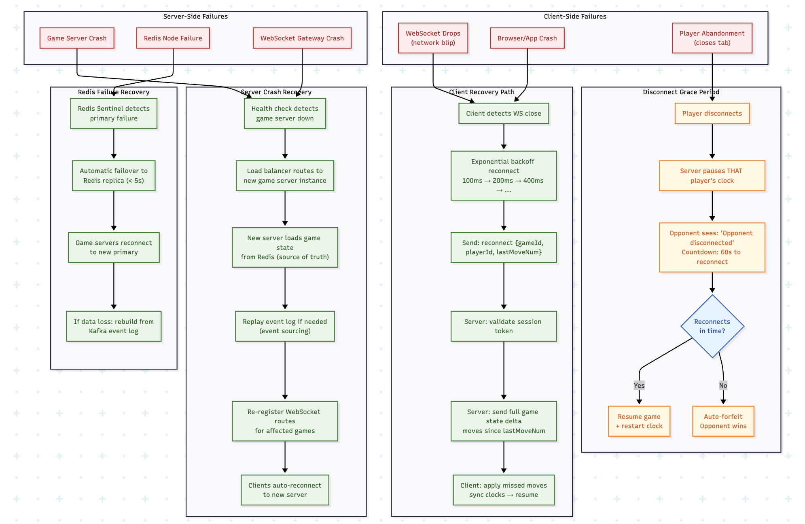

### Failure Matrix

| Failure | Impact | Detection | Recovery | RTO |
|---|---|---|---|---|
| Client network blip | 1 player disconnected | WS heartbeat timeout (30s) | Auto-reconnect with backoff | < 5s typical |
| Client crash | 1 player gone | WS close event | Grace period → forfeit | 60s grace |
| WS Gateway crash | ~50K connections dropped | K8s liveness probe | Clients reconnect to other gateways | < 10s |
| Game Server crash | Games on that server affected | Health checks | New server loads state from Redis | < 5s |
| Redis primary failure | Active games at risk | Redis Sentinel | Auto-failover to replica (< 5s) | < 5s |
| Redis cluster partition | Some shards unavailable | Cluster health monitoring | Repair partition or failover | Variable |
| PostgreSQL failure | No new game archival, no auth | PG replication | Failover to replica | < 30s |
| Kafka broker failure | Event processing delayed | Consumer lag monitoring | Kafka replication handles it | < 10s |
| Full region failure | All games in region lost | Cross-region health checks | Players reconnect to other region | Minutes |

### Game Server Crash Recovery (Why Stateless Servers + Redis Works)

This is the most interesting failure mode. When a game server crashes mid-game:

```
1. The game server was processing moves for games G1, G2, ..., G500
2. It crashes. But game state was in REDIS, not in server memory.
3. All game state survives the crash.

Recovery:
4. Clients' WebSocket connections are to the WS GATEWAY, not the game server.
   So clients don't even notice the game server crash.
5. The WS gateway routes the next move for game G1 to a DIFFERENT game server.
6. That new game server loads G1's state from Redis and continues.
7. Zero downtime for the game.

THIS is why stateless game servers + external state (Redis) is critical.
```

**What if a move was "in-flight" during the crash?**

```
Scenario: Game server received White's move, validated it, but crashed
         BEFORE writing to Redis and broadcasting.

Result: White's move is lost. White's client showed the move (optimistic UI).

Recovery:
  - White's client doesn't receive move_ack within timeout (2s)
  - Client retries the move
  - New game server receives it, validates against current Redis state
  - If Redis still has the old state → move succeeds normally
  - If somehow Redis was updated → move may be rejected (client re-syncs from server state)

Key invariant: Redis state is always consistent. At worst, a move is retried.
```

### Redis Failure + Kafka as Backup Event Log

**Redis Sentinel (for single-node Redis):**
- Sentinel monitors Redis primary
- On failure, promotes a replica to primary
- Clients get notified of the new primary endpoint
- **Data loss risk**: Async replication means the last few writes might be lost
- **Mitigation**: `WAIT 1 0` command can force sync replication (adds latency)

**Redis Cluster (for sharded deployment):**
- Data sharded across multiple primaries by hash slot
- Each primary has 1+ replicas
- If a primary fails, its replica takes over automatically
- **Partial failure**: Only games on the failed shard are affected

**What if Redis loses a game's state?**

```
Fallback: Kafka event log
  - Every move event was published to Kafka
  - Kafka retains events for 7 days
  - Reconstruction worker can replay events from Kafka
    to rebuild game state
  - This is event sourcing's recovery guarantee
```

### Client Reconnection Protocol

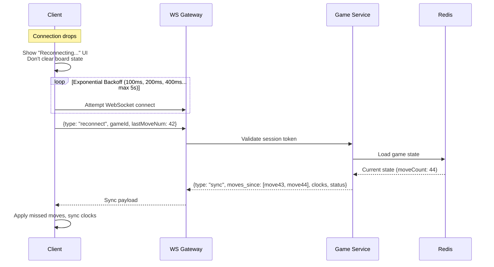

```
Client detects disconnect:
  1. Show "Reconnecting..." UI (don't clear board state)
  2. Exponential backoff: 100ms, 200ms, 400ms, 800ms, ... (max 5s)
  3. On reconnect:
     a. Send: {type: "reconnect", gameId, lastMoveNum: 42}
     b. Server validates session token
     c. Server sends: {type: "sync", moves_since: [move43, move44], clocks, status}
     d. Client applies missed moves and syncs clocks
  4. If game ended during disconnect:
     a. Server sends: {type: "game_over", result, reason}
     b. Client shows result screen

Grace period (server-side):
  - On disconnect, start 60-second timer for that player
  - Pause that player's clock (don't penalize for disconnect)
  - Notify opponent: "Your opponent disconnected. They have 60s to reconnect."
  - If reconnect within 60s: resume game, restart clock
  - If not: auto-forfeit, opponent wins
```

---

## 8. Design Trade-offs & Alternative Choices

### Trade-off 1: Game State Storage

| Approach | How | Pros | Cons | Verdict |
|---|---|---|---|---|
| **In-memory (per game server)** | Each server holds game state in a HashMap | Fastest reads/writes | Lost on crash, can't share across servers | Stage 1 only |
| **Redis (external)** | Game state in Redis, servers are stateless | Survives crashes, shareable, fast | Network hop per operation (~0.5ms) | **Recommended** (Stage 2+) |
| **Database (PostgreSQL)** | Game state directly in relational DB | Durable, transactional | Too slow for hot path (~5-20ms per query) | For archival only |
| **Actor model (Akka/Orleans)** | Each game is an actor with persistent state | Natural model, built-in recovery | Complex infrastructure, vendor lock-in | Valid alternative |

### Trade-off 2: Event Sourcing vs. State Snapshotting

| Approach | How | Pros | Cons |
|---|---|---|---|
| **Pure Event Sourcing** | Store only move events, derive state by replay | Perfect audit trail, replay, crash recovery | Slow state reconstruction for long games |
| **Pure State Snapshot** | Store only current FEN + clocks | Fastest reads | No history, no replay, no audit |
| **Hybrid (recommended)** | Store both: event log (moves) + latest state snapshot (FEN+clocks) | Fast reads + full history | Slightly more storage (~3KB extra per game) |

The hybrid approach is overwhelmingly the right choice. Storage is cheap. The move list IS the event log; it's what chess players have always recorded.

### Trade-off 3: WebSocket vs. gRPC Streaming

| Protocol | Bidirectional | Browser Support | Overhead | Load Balancing |
|---|---|---|---|---|
| **WebSocket** | Yes | Native | Very low | Sticky sessions (L4) |
| **gRPC streaming** | Yes | Needs grpc-web proxy | Low | Complex (HTTP/2 streams) |
| **Socket.IO** | Yes (wraps WS) | Yes | Moderate (extra protocol layer) | Adapter needed (Redis) |

**Verdict: Raw WebSocket** for the game protocol (minimal overhead), with Socket.IO as a fallback for environments where WebSocket doesn't work. gRPC is better for server-to-server communication (e.g., game server ↔ timer service).

### Trade-off 4: Centralized vs. Distributed Game Servers

| Approach | How | Pros | Cons |
|---|---|---|---|
| **Centralized game server** | Single service handles all game logic | Simple, consistent | Single point of failure, scaling limit |
| **Distributed, partitioned by gameId** | Any server can handle any game (state in Redis) | Horizontally scalable, fault-tolerant | Need Redis as coordination layer |
| **Distributed with locality** | Assign games to servers, with failover | Better cache locality | Complex routing, rebalancing needed |

**Recommended: Distributed, partitioned by gameId.** Since game state lives in Redis, any game server can process any game's moves. This gives maximum flexibility and simplest failover.

### Trade-off 5: Push vs. Pull Clock Synchronization

| Approach | How | Pros | Cons |
|---|---|---|---|
| **Push on every move** | Server sends authoritative clocks with each move event | Simple, syncs on natural cadence | Between moves, client clock drifts |
| **Periodic push** | Server broadcasts clock sync every 1s | More accurate between moves | 500K games × 1 msg/sec = high bandwidth |
| **Pull (client requests)** | Client polls server for clock values | Client-controlled | Adds load, introduces latency |
| **Hybrid (recommended)** | Push with moves + client local countdown | Accurate at move boundaries, smooth display | Minor drift between moves (acceptable) |

---

## 9. Data Model & Storage Architecture

### PostgreSQL Schema (Simplified)

```sql
-- Users table
CREATE TABLE users (
    id              UUID PRIMARY KEY DEFAULT gen_random_uuid(),
    username        VARCHAR(32) UNIQUE NOT NULL,
    email           VARCHAR(256) UNIQUE NOT NULL,
    password_hash   VARCHAR(256) NOT NULL,
    created_at      TIMESTAMP DEFAULT NOW(),
    is_premium      BOOLEAN DEFAULT FALSE
);

-- Ratings table (separate from users for write isolation)
CREATE TABLE ratings (
    user_id         UUID REFERENCES users(id),
    time_control    VARCHAR(16) NOT NULL, -- 'bullet', 'blitz', 'rapid', 'classical'
    rating          INTEGER DEFAULT 1500,
    rd              FLOAT DEFAULT 350.0,   -- Glicko-2 rating deviation
    volatility      FLOAT DEFAULT 0.06,    -- Glicko-2 volatility
    games_played    INTEGER DEFAULT 0,
    updated_at      TIMESTAMP DEFAULT NOW(),
    PRIMARY KEY (user_id, time_control)
);

-- Games table (archived completed games)
CREATE TABLE games (
    id              UUID PRIMARY KEY,
    white_id        UUID REFERENCES users(id),
    black_id        UUID REFERENCES users(id),
    time_control    VARCHAR(16) NOT NULL,
    result          VARCHAR(16) NOT NULL, -- 'white_wins', 'black_wins', 'draw'
    termination     VARCHAR(32) NOT NULL, -- 'checkmate', 'timeout', 'resignation', 'stalemate', etc.
    pgn             TEXT NOT NULL,         -- Full PGN notation
    fen_final       VARCHAR(128),          -- Final position
    move_count      INTEGER NOT NULL,
    white_rating    INTEGER NOT NULL,      -- Rating at game start
    black_rating    INTEGER NOT NULL,
    white_rating_change INTEGER,
    black_rating_change INTEGER,
    started_at      TIMESTAMP NOT NULL,
    ended_at        TIMESTAMP NOT NULL,
    duration_ms     INTEGER NOT NULL
);

-- Indexes for common queries
CREATE INDEX idx_games_white ON games(white_id, started_at DESC);
CREATE INDEX idx_games_black ON games(black_id, started_at DESC);
CREATE INDEX idx_games_started ON games(started_at DESC);

-- Partitioning by month for massive tables
-- At 15M games/day = ~450M games/month
CREATE TABLE games_2024_01 PARTITION OF games
    FOR VALUES FROM ('2024-01-01') TO ('2024-02-01');
```

### Sharding Strategy (at Chess.com Scale)

```
Users + Ratings: Shard by user_id (consistent hash)
  - ~150M registered users
  - Each shard handles ~10M users
  - Cross-shard queries (e.g., leaderboard) use pre-computed Redis sorted sets

Games: Shard by game_id (range-based by date)
  - Older games are cold data → moved to cheaper storage / archived partitions
  - Recent games (last 30 days) in hot shards
  - Partition by month naturally segments data

Why user_id sharding for users?
  - User profiles are read-heavy (every matchmaking request, every game start)
  - Access pattern is almost always by userId → perfect for hash sharding
  - Avoids hotspots (userId is UUID, uniform distribution)
```

---

## 10. Key Design Principles

1. **Server is the single source of truth** — Clients are untrusted. All game state, move validation, and clock management is server-authoritative.

2. **Stateless compute, external state** — Game servers hold no in-memory state. Redis is the state store. Any server can handle any game.

3. **Event sourcing is natural** — The move list is the event log. FEN is the materialized view. This gives you replay, recovery, and audit for free.

4. **Games are independent** — No cross-game state means trivial horizontal scaling via sharding by gameId.

5. **Lazy clock evaluation** — Don't run 500K timers. Compute remaining time on-demand when moves arrive, with a sweep for timeout detection.

6. **Separate WebSocket from game logic** — WS gateways are memory-bound; game servers are CPU-bound. Scale independently.

7. **Design for failure** — Every component can crash. Redis survives game server crashes. Kafka survives Redis failures. Clients reconnect gracefully.

8. **Start simple, scale when needed** — Chess.com itself ran on a single MySQL database for years. Don't over-engineer day one. Add Redis, then sharding, then multi-region as traffic demands.

---
