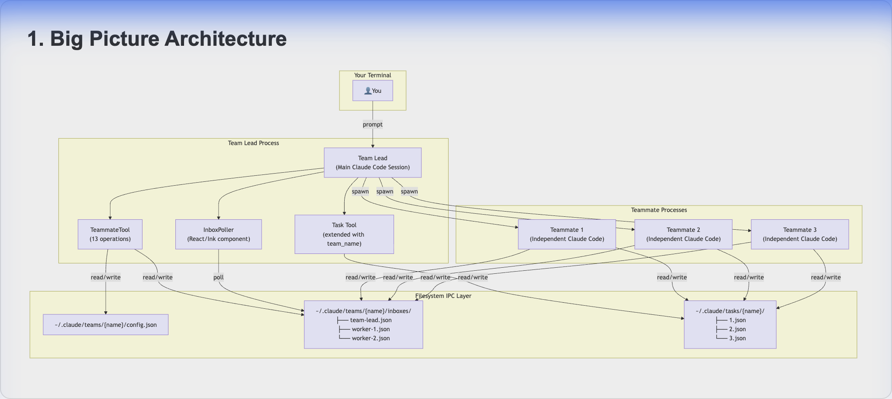
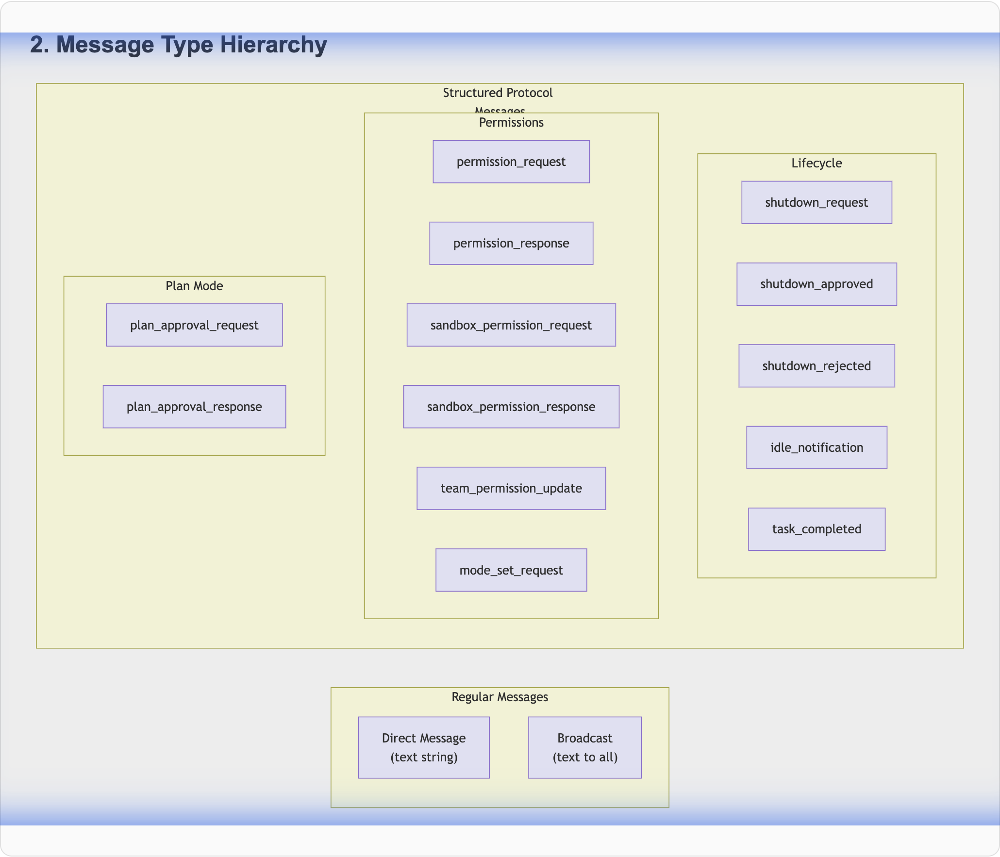
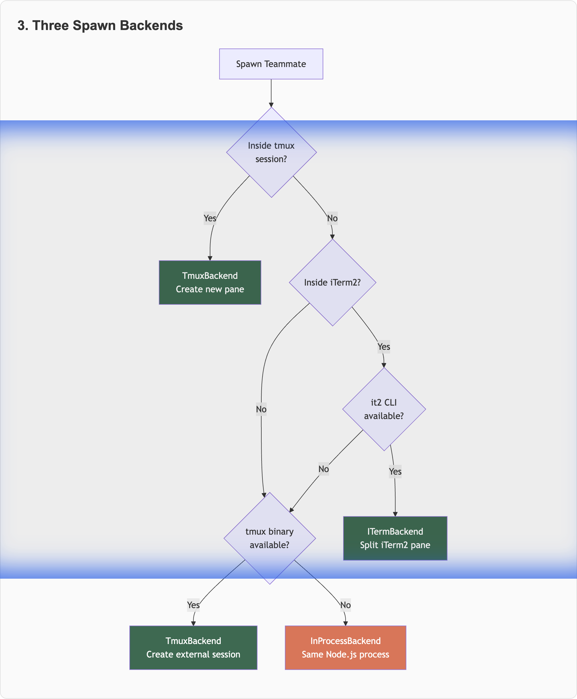
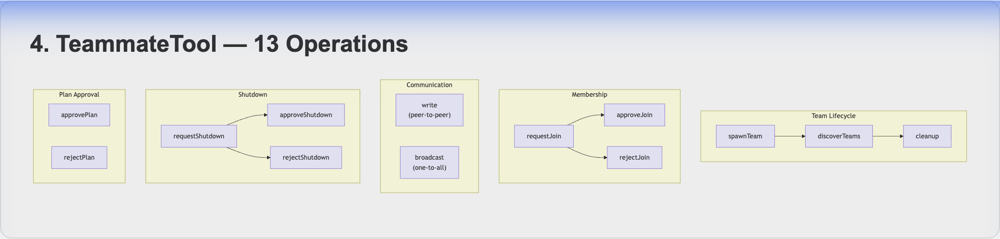
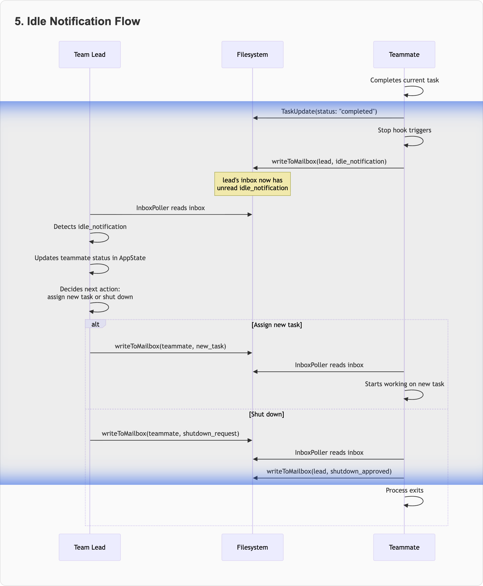
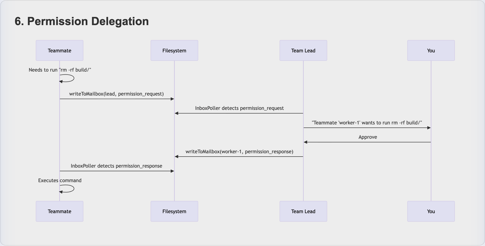

# How Claude Code Agent Teams Actually Works - reverse Claude Code Agent Teams use CC

## Metadata
- **Created:** 2026-02-13
- **Source:** [Claude Code Docs](https://code.claude.com/docs/en/agent-teams), reverse engineering of `cli.js` (v1.0.34+)
- **Status:** Experimental Feature
- **Date:** February 2026

## TL;DR

Claude Code Agent Teams lets you spin up **multiple Claude Code sessions** that work together as a coordinated team — with a lead agent, teammate agents, shared task lists, and inter-agent messaging. But what's really going on under the hood? This post goes beyond the docs: we reverse-engineered the compiled source to understand the **filesystem-based IPC**, **React/Ink polling architecture**, **three spawn backends**, and the **13-operation TeammateTool** that makes it all work.


---

## Why This Post Exists

The official docs tell you *what* Agent Teams does. This post tells you *how* it does it — by reading the actual compiled source code (`cli.js`), tracing function calls, and mapping out the internal architecture. If you want to build on top of Agent Teams, extend it with hooks, or just understand the engineering decisions behind multi-agent coordination, this is for you.

---

## The Big Picture Architecture

At its core, Agent Teams is a **filesystem-coordinated, polling-based, multi-process orchestration system** built on top of Claude Code's existing Task/subagent infrastructure.




**The critical design decision:** All coordination happens through the **local filesystem**, not sockets, pipes, or HTTP. Every message, task update, and team config change is a JSON file read/write with file locking. This is simple, debuggable, and works across all spawn backends without protocol negotiation.

---

## Enabling the Feature Gate

Agent Teams is guarded by a feature flag function (`lA()` in the compiled source) that checks:

```json
{
  "env": {
    "CLAUDE_CODE_EXPERIMENTAL_AGENT_TEAMS": "1"
  }
}
```

Both `lA()` (feature enabled) and team membership detection (`Mz()`, which checks if the current process is a teammate) must pass before any team functionality activates. The gate controls everything: tool registration, inbox polling, team context injection, and teammate spawning.

---

## The Seven Core Primitives

The entire system is built on seven primitives that the lead agent uses as tools:

| Primitive | What It Does | File System Effect |
|-----------|-------------|-------------------|
| **TeamCreate** | Initializes team namespace | Creates `~/.claude/teams/{name}/config.json` |
| **Task** (with `team_name`) | Spawns an independent teammate | Starts new process + writes to `config.json` members |
| **TaskCreate** | Creates a work item | Writes `{id}.json` to `~/.claude/tasks/{name}/` |
| **TaskUpdate** | Changes task state | Updates JSON file with locking |
| **TaskList** | Discovers available work | Reads all task JSON files |
| **SendMessage** (`write`) | Direct message to one teammate | Appends to recipient's inbox JSON |
| **SendMessage** (`broadcast`) | Message all teammates | Appends to every teammate's inbox JSON |

---

## The Mailbox System — Reverse Engineering IPC

This is the most interesting part of the architecture. Let's trace exactly how Agent A sends a message to Agent B.

### Inbox File Structure

Each agent gets a personal inbox file:

```
~/.claude/teams/my-project/inboxes/
├── team-lead.json     # Lead's inbox
├── researcher.json    # Teammate "researcher"'s inbox
└── implementer.json   # Teammate "implementer"'s inbox
```

Each inbox is a JSON array of messages:

```json
[
  {
    "from": "team-lead",
    "text": "Please investigate the auth module for SQL injection vulnerabilities.",
    "timestamp": "2026-02-13T09:15:00.000Z",
    "color": "#4A90D9",
    "read": false
  },
  {
    "from": "implementer",
    "text": "{\"type\":\"idle_notification\",\"from\":\"implementer\",\"idleReason\":\"available\"}",
    "timestamp": "2026-02-13T09:20:00.000Z",
    "read": true
  }
]
```

### The Write Path — `writeToMailbox()`

From the compiled source, the write path works like this:

```
writeToMailbox(recipientName, message, teamName)
  1. Ensure inbox directory exists (mkdirSync recursive)
  2. Compute inbox path: ~/.claude/teams/{team}/inboxes/{recipient}.json
  3. Acquire file lock: lockSync(path, { lockfilePath: path + ".lock" })
  4. Read current inbox contents
  5. Append new message with read: false
  6. Write back entire JSON array
  7. Release lock
```

The file locking uses `lockSync()` from a lock library (likely `proper-lockfile`), creating a `.lock` companion file. This prevents race conditions when multiple teammates try to write to the same inbox simultaneously.

### The Read Path — InboxPoller

The `InboxPoller` is a **React/Ink component** (Claude Code's TUI is built with Ink) that runs inside each agent's render loop. On each poll cycle:

```
InboxPoller.poll()
  1. Get current agent name from AppState
  2. Read unread messages: filter(msg => !msg.read)
  3. If no unread messages, return
  4. Categorize each message by type:
     - Permission requests → route to permission handler
     - Permission responses → resolve pending permission
     - Shutdown requests → prompt agent to shut down
     - Shutdown approved → remove teammate from team
     - Plan approval → exit/stay in plan mode
     - Idle notifications → update teammate status
     - Regular messages → inject into conversation
  5. Mark all messages as read (with file locking)
```

The message routing is the key insight: the inbox is a **multiplexed channel** carrying both human-readable messages and structured protocol messages (serialized as JSON strings inside the `text` field).

### Message Type Hierarchy




The `text` field does double duty: for regular messages, it's plain text. For protocol messages, it's a JSON string that gets parsed by type-checking functions (`isShutdownRequest()`, `isPlanApprovalResponse()`, etc.) — each implemented as a `safeParse()` call against a Zod schema.

---

## Three Spawn Backends

When the lead spawns a teammate, the system picks one of three backends based on runtime detection:




### InProcessBackend (Default)

The in-process backend runs teammates within the **same Node.js process** as the lead. Each teammate is tracked as an `InProcessTeammateTask` in the React/Ink AppState:

```javascript
// Reconstructed from compiled source (hW1 function)
InProcessTeammateTask = {
  id: taskId,
  type: "in_process_teammate",
  status: "running",
  identity: {
    agentId: "worker-1@my-project",  // name@team format
    agentName: "worker-1",
    teamName: "my-project",
    color: "#4A90D9",
    planModeRequired: false,
    parentSessionId: "abc123"
  },
  prompt: "Investigate the auth module...",
  model: "opus",
  abortController: new AbortController(),
  awaitingPlanApproval: false,
  isIdle: false,
  shutdownRequested: false,
  pendingUserMessages: [],
  messages: []
}
```

Switching between teammates uses `Shift+Up/Down` keyboard shortcuts, which cycle through the `selectedIPAgentIndex` in AppState. Each teammate gets its own conversation context within the shared process.

### PaneBackendExecutor (tmux/iTerm2)

For split-pane mode, the `PaneBackendExecutor` creates a real terminal pane and sends a CLI command to it:

```bash
# Reconstructed from compiled source
cd /path/to/project && \
  CLAUDECODE=1 \
  claude \
    --agent-id "worker-1@my-project" \
    --agent-name "worker-1" \
    --team-name "my-project" \
    --agent-color "#4A90D9" \
    --parent-session-id "abc123" \
    --plan-mode-required
```

The teammate process starts as a completely independent Claude Code session. It discovers it's a teammate by checking the `--agent-id` flag, reads the team config to find the lead, and registers a "Stop" hook to send an `idle_notification` when it finishes.

### Backend Detection Priority

```
1. $TMUX env var set        → TmuxBackend (inside existing tmux)
2. $TERM_PROGRAM == iTerm2  → ITermBackend (if it2 CLI present)
3. iTerm2 without it2       → TmuxBackend (fallback, suggests it2 install)
4. tmux binary available    → TmuxBackend (new external session)
5. Nothing available        → InProcessBackend (all in one terminal)
```

The `"auto"` teammate mode setting follows this cascade. You can override with `"in-process"` to force single-terminal mode regardless of available backends.

---

## The Task System — Shared Work Queue

### Task File Format

Each task is an individual JSON file:

```
~/.claude/tasks/my-project/
├── 1.json
├── 2.json
└── 3.json
```

```json
{
  "id": "1",
  "subject": "Refactor auth module",
  "description": "Extract token validation into separate middleware...",
  "status": "in_progress",
  "owner": "worker-1",
  "activeForm": "Refactoring auth module",
  "blocks": ["3"],
  "blockedBy": [],
  "metadata": {},
  "createdAt": "2026-02-13T09:10:00.000Z",
  "updatedAt": "2026-02-13T09:15:00.000Z"
}
```

### Self-Claiming Mechanism

When a teammate finishes its current task:

1. It calls `TaskList` to read all task files
2. Filters for tasks where `status === "pending"` and `blockedBy` is empty (all resolved)
3. Attempts to claim by writing `status: "in_progress"` and `owner: agentName` with file locking
4. If the lock fails (another teammate claimed it first), tries the next task

The file locking prevents double-claiming, but the system relies on **eventual consistency** — teammates poll the task list rather than receiving push notifications when tasks unblock.

### Dependency Resolution

Dependencies are expressed as arrays of task IDs:

```
Task 1: { blocks: ["3"], blockedBy: [] }       ← can start immediately
Task 2: { blocks: ["3"], blockedBy: [] }       ← can start immediately
Task 3: { blocks: [], blockedBy: ["1", "2"] }  ← waits for 1 AND 2
```

When a teammate marks task 1 as `completed`, task 3 checks if all entries in its `blockedBy` list are completed. The check happens at poll time — no push notification. This is why "task status can lag" is a documented limitation.

---

## Team Configuration — The Central Registry

```json
{
  "name": "my-project",
  "description": "Refactoring the authentication system",
  "leadAgentId": "team-lead@my-project",
  "createdAt": "2026-02-13T09:00:00.000Z",
  "teamAllowedPaths": [
    { "toolName": "Write", "path": "src/auth/" }
  ],
  "members": [
    {
      "agentId": "team-lead@my-project",
      "name": "team-lead",
      "agentType": "general-purpose",
      "color": "#FFFFFF",
      "joinedAt": "2026-02-13T09:00:00.000Z",
      "backendType": "in-process",
      "cwd": "/path/to/project",
      "model": "opus"
    },
    {
      "agentId": "researcher@my-project",
      "name": "researcher",
      "agentType": "Explore",
      "color": "#4A90D9",
      "joinedAt": "2026-02-13T09:01:00.000Z",
      "backendType": "tmux",
      "tmuxPaneId": "%5",
      "cwd": "/path/to/project",
      "model": "sonnet",
      "prompt": "Research the auth module...",
      "planModeRequired": false
    }
  ]
}
```

The `teamAllowedPaths` field enables team-wide permission grants — the lead can authorize all teammates to write to specific directories without per-agent permission prompts.

---

## The TeammateTool — 13 Operations

The `TeammateTool` is the lead's orchestration interface, exposed as a single tool with an `operation` discriminator:




Each operation maps to filesystem operations:
- **spawnTeam** → creates directories + `config.json`
- **write** → appends to one inbox file
- **broadcast** → appends to ALL inbox files (expensive: one write per teammate)
- **requestShutdown** → writes structured message to teammate's inbox
- **approveShutdown** → teammate writes back, lead removes from config
- **cleanup** → checks no active members, then deletes team directory

---

## The Idle Notification Flow

This is the handshake that closes the feedback loop when a teammate finishes:




The idle notification includes an optional `summary` field — a compressed summary of the teammate's recent conversation, produced by the `getLastPeerDmSummary()` function. This gives the lead context about what the teammate accomplished without reading their full conversation history.

---

## Hooks Integration — Quality Gates

Two hook events integrate with the team lifecycle:

### TeammateIdle Hook

Fires when a teammate is about to go idle. The hook receives the teammate's context and can:
- **Exit 0**: Allow idle (normal)
- **Exit 2**: Send feedback message and keep the teammate working

Use case: Run `eslint` on the teammate's changes. If linting fails, exit 2 with feedback telling the teammate to fix the issues.

### TaskCompleted Hook

Fires when a task is being marked complete. Same exit code semantics:
- **Exit 0**: Allow completion
- **Exit 2**: Reject completion, send feedback

Use case: Run the test suite on affected files. No task can be marked "done" until tests pass.

### TeammateInit — The Registration Hook

When a teammate starts (reconstructed from `_p8` function in the source):

1. Reads team config to find the lead agent's name
2. Applies `teamAllowedPaths` permissions to its own session
3. If this agent is NOT the lead, registers a "Stop" hook that sends an `idle_notification` to the lead when the teammate finishes

This registration is why idle notifications work automatically — every teammate registers the hook at startup.

---

## Permission Delegation

One of the more sophisticated features: teammates can **delegate permission requests** to the lead.




This means permission prompts from all teammates bubble up to the lead's terminal, keeping you as the single approval point. The `sandbox_permission_request/response` variant handles file system sandbox permissions specifically.

---

## Agent Teams vs. Subagents — The Architecture Difference

| Aspect | Subagents (Task tool) | Agent Teams (Task + TeammateTool) |
|--------|----------------------|-----------------------------------|
| **Process model** | Background async tasks within one session | Independent Claude Code sessions |
| **Context** | Share parent's context window | Completely isolated context windows |
| **Communication** | Return results to parent only | Peer-to-peer messaging via inbox files |
| **Coordination** | Parent manages everything | Shared task list with self-claiming |
| **IPC** | In-memory (same process) | Filesystem JSON with file locking |
| **Lifecycle** | Managed by parent's abort controller | Independent with shutdown protocol |
| **Spawning** | `Task({ subagent_type, prompt })` | `Task({ team_name, name, prompt })` |
| **Cost** | Lower (shared context) | Higher (each gets full context window) |

The architectural analogy: subagents are **threads** (lightweight, shared memory), agent teams are **processes** (isolated, communicate via IPC).

---

## Real-World Patterns

### Pattern 1: Parallel Specialists

```
You: "Create an agent team to review PR #142.
      Spawn three reviewers: security, performance, test coverage."

Lead → TaskCreate: "Security review" (pending)
Lead → TaskCreate: "Performance review" (pending)
Lead → TaskCreate: "Test coverage review" (pending)
Lead → Spawn: security-reviewer (claims task 1)
Lead → Spawn: perf-reviewer (claims task 2)
Lead → Spawn: test-reviewer (claims task 3)
... all three work in parallel ...
security-reviewer → idle_notification (with summary)
perf-reviewer → idle_notification (with summary)
test-reviewer → idle_notification (with summary)
Lead → Synthesizes findings from all three summaries
```

### Pattern 2: Competing Hypotheses

```
You: "App exits after one message. Spawn 5 investigators."

Lead → Spawn 5 teammates, each with a different hypothesis prompt
Each teammate investigates independently, writes to shared findings doc
Teammates use write() to challenge each other's theories
Lead waits for all idle_notifications, then synthesizes consensus
```

### Pattern 3: Pipeline with Dependencies

```
Lead → TaskCreate: "Design API schema" (task 1)
Lead → TaskCreate: "Implement API" (task 2, blockedBy: [1])
Lead → TaskCreate: "Write tests" (task 3, blockedBy: [2])
Lead → Spawn: architect (claims task 1)
Lead → Spawn: implementer (blocked, waits)
Lead → Spawn: tester (blocked, waits)
architect completes task 1 → task 2 unblocks → implementer starts
implementer completes task 2 → task 3 unblocks → tester starts
```

---

## Design Decisions Worth Noting

### Why Filesystem IPC?

The filesystem approach has clear advantages for this use case:
- **Debuggable**: You can `cat` any inbox file to see message history
- **Backend-agnostic**: Works identically for in-process, tmux, and iTerm2 backends
- **Crash-resilient**: Messages persist on disk even if a process dies
- **No server**: No daemon, no port, no protocol negotiation
- **Cross-platform**: Works on macOS, Linux, and WSL

The tradeoff is **latency** — polling a JSON file is slower than a socket push. But for agent coordination where messages are infrequent (seconds between them, not milliseconds), this is an excellent tradeoff.

### Why Polling, Not File Watchers?

The InboxPoller reads the inbox file on each render cycle rather than using `fs.watch()` or `chokidar`. This is likely because:
- File watchers are notoriously unreliable across platforms
- The polling happens naturally as part of the Ink render loop (already on a tick)
- No additional resource cleanup needed on process exit

### Why JSON, Not SQLite?

Individual task files (one per task) rather than a database means:
- No shared database lock contention
- Each task can be locked independently
- Easy to inspect and debug
- No migration story needed

The downside is lack of atomic multi-task operations, which is why "task status can lag" is a documented limitation.

---

## Known Limitations (and Why They Exist)

| Limitation | Root Cause |
|-----------|-----------|
| No session resumption with in-process teammates | In-process teammates are React state — not serialized to disk |
| Task status can lag | Polling-based, no push notifications for state changes |
| One team per session | Team config is a singleton in AppState |
| No nested teams | Teammates check `Mz()` (isTeammate) and refuse to spawn |
| Lead is fixed | `leadAgentId` in config.json is set at creation, never updated |
| No split panes in VS Code terminal | No tmux support in VS Code's pty implementation |

---

## Quick Reference

| Action | How |
|--------|-----|
| Enable | `CLAUDE_CODE_EXPERIMENTAL_AGENT_TEAMS=1` in settings.json |
| Start a team | Describe a parallel task in your prompt |
| Display mode | `--teammate-mode in-process` or `tmux` (auto-detected) |
| Talk to teammate | `Shift+Up/Down` (in-process) or click pane (split) |
| Delegate mode | `Shift+Tab` (restricts lead to coordination-only tools) |
| Assign tasks | Tell the lead to assign, or let agents self-claim |
| Require approval | Include "require plan approval" in spawn prompt |
| Shut down one | "Ask [name] teammate to shut down" |
| Clean up all | "Clean up the team" |
| Quality hooks | `TeammateIdle` (exit 2 = keep working), `TaskCompleted` (exit 2 = reject) |

---

## Key Takeaways

1. **Agent Teams is filesystem-based IPC** — JSON inbox files with file locking, no sockets or databases
2. **InboxPoller is a React/Ink component** that polls on each render cycle and routes 10+ message types
3. **Three spawn backends** (in-process, tmux, iTerm2) detected at runtime with automatic fallback
4. **13 TeammateTool operations** provide the full orchestration API: lifecycle, messaging, shutdown, plan approval
5. **Task self-claiming uses file locking** to prevent race conditions across concurrent teammates
6. **Permission delegation** bubbles all approval requests from teammates up to the lead
7. **Idle notifications** are sent automatically via a "Stop" hook registered at teammate startup
8. **The design prioritizes simplicity and debuggability** over performance — a smart tradeoff for agent coordination

---

## Sources

- [Official Docs: Orchestrate teams of Claude Code sessions](https://code.claude.com/docs/en/agent-teams)
- [Claude Code's Hidden Multi-Agent System (paddo.dev)](https://paddo.dev/blog/claude-code-hidden-swarm/)
- [Claude Code Swarms (Addy Osmani)](https://addyosmani.com/blog/claude-code-agent-teams/)
- [From Tasks to Swarms (alexop.dev)](https://alexop.dev/posts/from-tasks-to-swarms-agent-teams-in-claude-code/)
- [Claude Code Swarm Orchestration Skill (GitHub Gist)](https://gist.github.com/kieranklaassen/4f2aba89594a4aea4ad64d753984b2ea)
- Reverse engineering of `cli.js` from `@anthropic-ai/claude-code` npm package (v1.0.34+)
