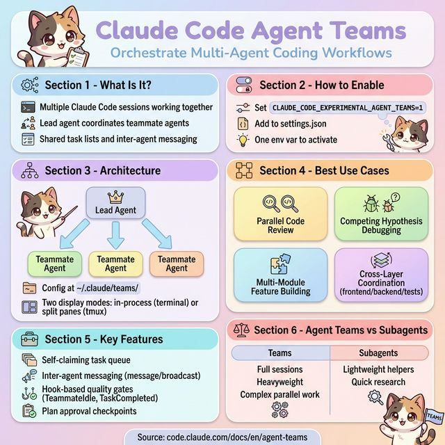

# Claude Code Agent Teams — Orchestrating Multi-Agent Coding Workflows

## Metadata
- **Created:** 2026-02-13
- **Source:** [Claude Code Docs — Agent Teams](https://code.claude.com/docs/en/agent-teams)
- **Status:** Experimental Feature
- **Date:** February 2026

## TL;DR
Claude Code Agent Teams lets you spin up **multiple Claude Code sessions** that work together as a coordinated team — with a lead agent, teammate agents, shared task lists, and inter-agent messaging. Think of it as going from a solo developer to running a **small engineering squad**, all in your terminal. It's experimental, powerful, and changes how you think about parallelizing complex coding work.



---

## What Is Agent Teams?

> "Coordinate multiple Claude Code instances working together as a team, with shared tasks, inter-agent messaging, and centralized management."

**My Take:** This is the natural evolution of AI-assisted coding. Instead of one agent doing everything sequentially, you now get a **team of specialists** — each Claude instance focuses on a different piece of the puzzle. It's the difference between having one person move furniture and having a crew.

---

## How to Enable It

> Agent Teams is an experimental feature. To enable it, set the environment variable `CLAUDE_CODE_EXPERIMENTAL_AGENT_TEAMS` to `1` in your `settings.json`:

```json
{
  "env": {
    "CLAUDE_CODE_EXPERIMENTAL_AGENT_TEAMS": "1"
  }
}
```

**My Take:** One env var and you're in. The fact that it lives in `settings.json` means you can enable it for your entire team by checking it into your repo. No global installs, no ceremony — just flip a switch.

---

## How to Start a Team

> Just describe a task that benefits from parallel work. Claude will create a team based on your instructions — or propose one if it thinks your task would benefit from it.

Example prompt:

```
I'm designing a CLI tool that helps developers track TODO comments 
across their codebase. Create an agent team to explore this from 
different angles: one teammate on UX, one on technical architecture, 
one playing devil's advocate.
```

**My Take:** The prompt-driven team creation is elegant. You don't wire up a config file — you just *describe what you need* in natural language, and Claude figures out the team structure. The "devil's advocate" role especially shows how creative you can get with this.

---

## Architecture — Lead & Teammates

> The session that creates the team is the **lead** for its lifetime. You can't promote a teammate to lead or transfer leadership.

Key details:

> - **Team config** lives at `~/.claude/teams/{team-name}/config.json`
> - **Task list** lives at `~/.claude/tasks/{team-name}/`
> - All teammates start with the lead's permission mode
> - Teammates cannot spawn their own teams (no nested teams)

**My Take:** The lead/teammate hierarchy is intentional. One central coordinator, many workers. It mirrors how real engineering teams operate — there's always a tech lead marshaling the work. The flat permission inheritance is pragmatic: you don't want to configure permissions per-agent when you're trying to move fast.

---

## Display Modes — How You See Your Team

> - **In-process:** All teammates run inside your main terminal. Use `Shift+Up/Down` to select a teammate. Works in any terminal.
> - **Split panes:** Each teammate gets its own pane. You can see everyone's output at once. Requires `tmux` or iTerm2.

Set it via settings:

```json
{ "teammateMode": "in-process" }
```

Or on the command line:

```bash
claude --teammate-mode in-process
```

**My Take:** Split panes with tmux is the power-user setup — seeing all agents work simultaneously is like watching a mission control screen. But in-process mode is the smart default: zero setup, works everywhere. Start with in-process, graduate to split panes when you're hooked.

---

## Communication Between Agents

> - **Automatic message delivery:** When teammates send messages, they're delivered automatically to recipients. The lead doesn't need to poll.
> - **Idle notifications:** When a teammate finishes, they automatically notify the lead.
> - **Shared task list:** All agents can see task status and claim available work.
> - **message:** Send to one specific teammate.
> - **broadcast:** Send to all teammates simultaneously. Use sparingly — costs scale with team size.

**My Take:** The messaging model is event-driven, not polling-based. Agents don't waste tokens asking "are you done yet?" — they get notified. The `broadcast` caveat is important: every broadcast multiplies your token cost by the team size. Be surgical with communication.

---

## Controlling Your Team

### Assign and Claim Tasks

> - **Lead assigns:** Tell the lead which task to give to which teammate.
> - **Self-claim:** After finishing a task, a teammate picks up the next unassigned, unblocked task on its own.

### Require Plan Approval

> "Spawn an architect teammate to refactor the authentication module. Require plan approval before they make any changes."

### Shut Down Teammates

> "Ask the researcher teammate to shut down."

### Clean Up

> "Clean up the team" — shuts down all teammates and removes the team.

**My Take:** The self-claim mechanism is the star here. It turns your team into a mini work queue — agents finish a task, look at the backlog, and grab the next one. No micromanagement needed. But when you *do* want control, plan approval gives you a human-in-the-loop checkpoint.

---

## Quality Gates with Hooks

> Hooks let you enforce standards across your team:
> - **TeammateIdle:** Runs when a teammate is about to go idle. Exit with code 2 to send feedback and keep them working.
> - **TaskCompleted:** Runs when a task is being marked complete. Exit with code 2 to prevent completion and send feedback.

**My Take:** Hooks turn Agent Teams from a parallel-work tool into a **continuous quality system**. Imagine a `TaskCompleted` hook that runs your test suite — no task can be marked "done" until tests pass. This is how you build trust in the output of multi-agent workflows.

---

## When to Use Agent Teams

> Best use cases:
> - **Research and review:** Multiple teammates investigate different aspects simultaneously, then share and challenge each other's findings.
> - **New modules or features:** Teammates each own a separate piece without stepping on each other.
> - **Debugging with competing hypotheses:** Teammates test different theories in parallel and converge on the answer.
> - **Cross-layer coordination:** Changes spanning frontend, backend, and tests — each owned by a different teammate.

**My Take:** The competing-hypotheses pattern is the most creative use case. Instead of one agent going down one debugging path for 20 minutes, you send five agents down five paths simultaneously. The first one to find the answer wins. It's debugging by brute-force parallelism.

---

## Real-World Example Prompts

### Parallel Code Review

```
Create an agent team to review PR #142. 
Spawn three reviewers:
- One focused on security implications
- One checking performance impact  
- One validating test coverage
Have them each review and report findings.
```

### Competing Hypotheses Debugging

```
Users report the app exits after one message instead of 
staying connected. Spawn 5 agent teammates to investigate 
different hypotheses. Have them talk to each other to try 
to disprove each other's theories, like a scientific debate. 
Update the findings doc with whatever consensus emerges.
```

**My Take:** The "scientific debate" prompt for debugging is genius. Agents don't just investigate — they *challenge each other's findings*. It's adversarial validation built into your dev workflow.

---

## Agent Teams vs. Subagents

| Feature | Agent Teams | Subagents |
|---------|------------|-----------|
| **Scope** | Multiple full Claude Code sessions | Lightweight helpers within one session |
| **Communication** | Inter-agent messaging, shared tasks | Report back to parent |
| **Coordination** | Centralized lead management | No coordination needed |
| **Best For** | Complex parallel work | Quick research or verification |
| **Token Cost** | Higher (multiple sessions) | Lower (shared context) |
| **Nesting** | No nested teams | Can be nested |

**My Take:** Think of subagents as **threads** and agent teams as **processes**. Subagents are lightweight — great for quick research within a session. Agent teams are heavyweight — each with their own full context, tools, and permissions. Use subagents when you can; use teams when you need true parallelism.

---

## Best Practices

> **1. Give teammates enough context.** Each teammate starts fresh — they don't share the lead's conversation history.

> **2. Size tasks appropriately:**
> - Too small → coordination overhead exceeds the benefit
> - Too large → teammates work too long without check-ins
> - Just right → self-contained units that produce a clear deliverable

> **3. Wait for teammates to finish.** Tell the lead: "Wait for your teammates to complete their tasks before proceeding."

> **4. Start with research and review.** These are the safest use cases — no file conflicts, clear deliverables.

> **5. Avoid file conflicts.** Don't assign two teammates to edit the same file.

> **6. Monitor and steer.** Check in on teammates; course-correct early rather than after wasted work.

**My Take:** The biggest gotcha is **context isolation**. Teammates don't know what the lead discussed with you — you have to spell it out in the spawn prompt. Think of each teammate spawn as writing a mini design doc: explicit context, clear scope, defined deliverable.

---

## Known Limitations

> - No session resumption with in-process teammates — `/resume` and `/rewind` won't restore them
> - Task status can lag — teammates sometimes forget to mark tasks complete
> - One team per session — clean up before starting a new one
> - No nested teams — teammates can't spawn their own teams
> - Lead is fixed — can't promote a teammate
> - Split panes require `tmux` or iTerm2 — not supported in VS Code terminal, Windows Terminal, or Ghostty
> - Permissions are set at spawn — all teammates inherit the lead's permission mode

**My Take:** The "no nested teams" and "one team per session" limits are the most impactful. You can't compose teams of teams (yet). For now, keep your team structures flat and focused. The session resumption gap is the one to watch — if the lead dies, you lose your team.

---

## Key Takeaways

1. **Agent Teams = parallel Claude sessions** coordinated by a lead, communicating via messages and shared tasks
2. **One env var to enable** — `CLAUDE_CODE_EXPERIMENTAL_AGENT_TEAMS=1` in `settings.json`
3. **Prompt-driven team creation** — describe what you need, Claude builds the team
4. **Two display modes** — in-process (simple) or split panes (tmux/iTerm2 power mode)
5. **Self-claiming task queue** — agents automatically pick up work after finishing
6. **Hook-based quality gates** — enforce tests, standards, and review before task completion
7. **Best for**: parallel reviews, multi-module features, competing-hypothesis debugging, cross-layer changes
8. **Watch out for**: context isolation, file conflicts, token costs scaling with team size

---

## Quick Reference

| Action | How |
|--------|-----|
| Enable | `CLAUDE_CODE_EXPERIMENTAL_AGENT_TEAMS=1` in `settings.json` |
| Start a team | Describe a parallel task in your prompt |
| Display mode | `--teammate-mode in-process` or `tmux` |
| Talk to teammate | `Shift+Up/Down` (in-process) or click pane (split) |
| Assign tasks | Tell the lead to assign, or let agents self-claim |
| Require approval | Include "require plan approval" in spawn prompt |
| Shut down one | "Ask [name] teammate to shut down" |
| Clean up all | "Clean up the team" |
| Quality hooks | `TeammateIdle`, `TaskCompleted` |

---

*This post summarizes the Claude Code Agent Teams documentation. Feature is experimental and may change.*

**Source:** [code.claude.com/docs/en/agent-teams](https://code.claude.com/docs/en/agent-teams) — February 2026
