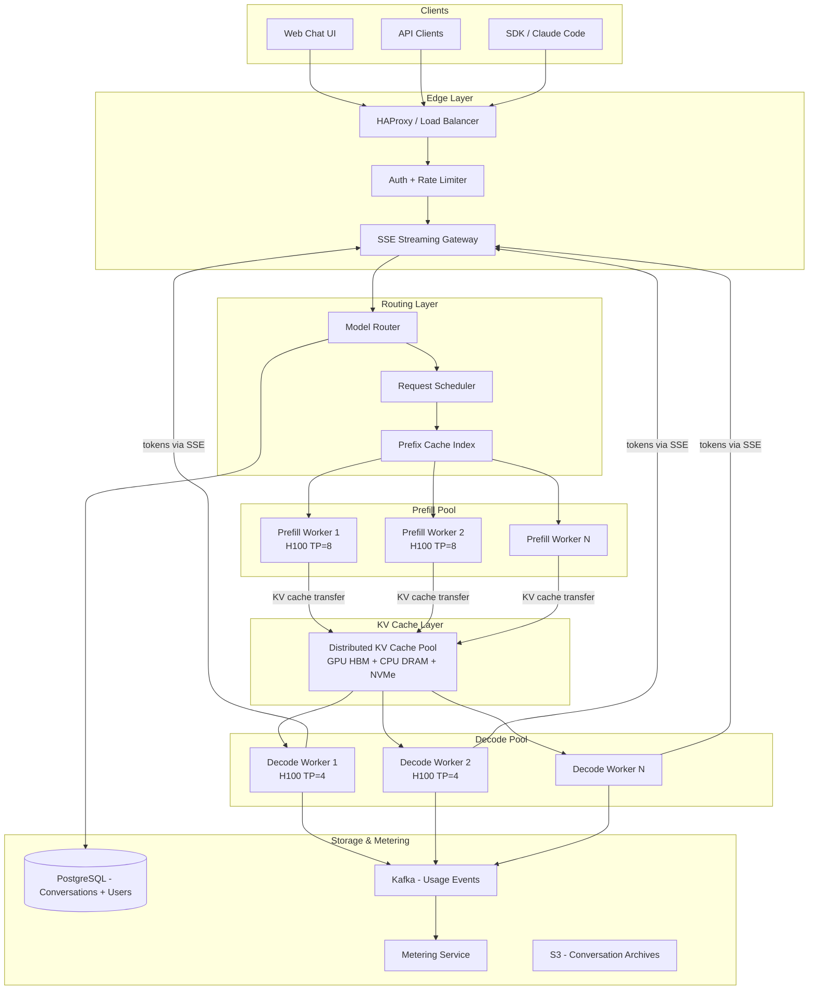
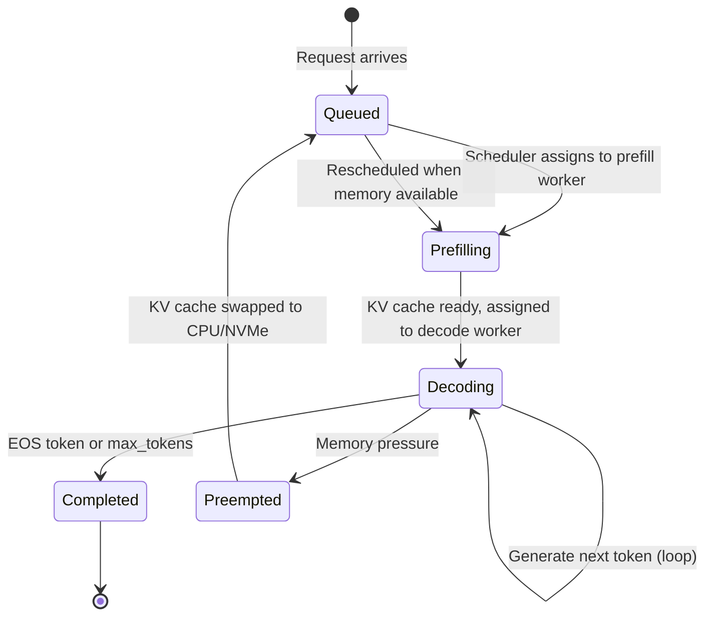
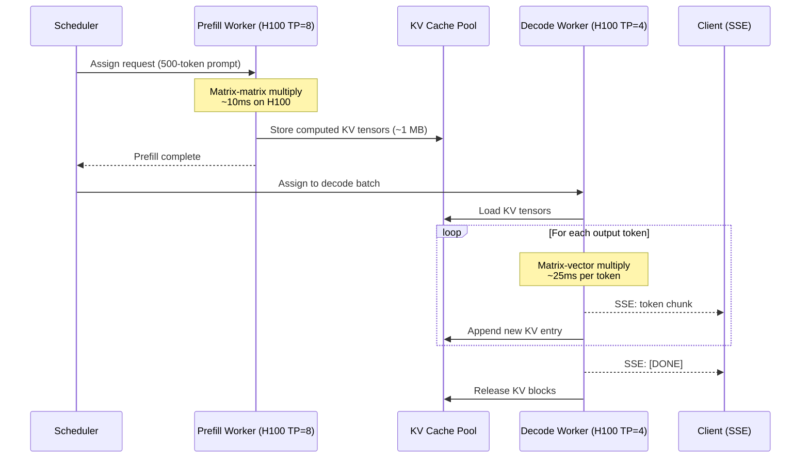
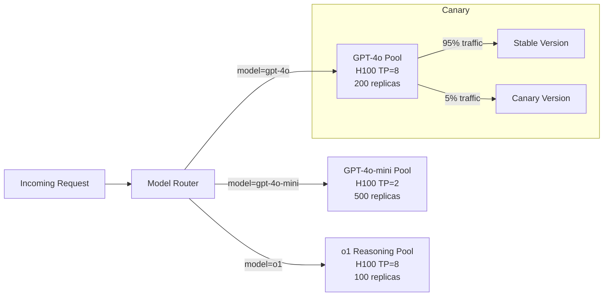
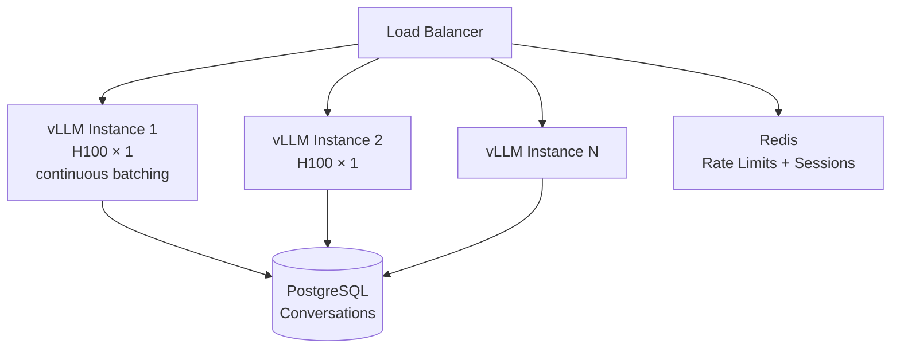
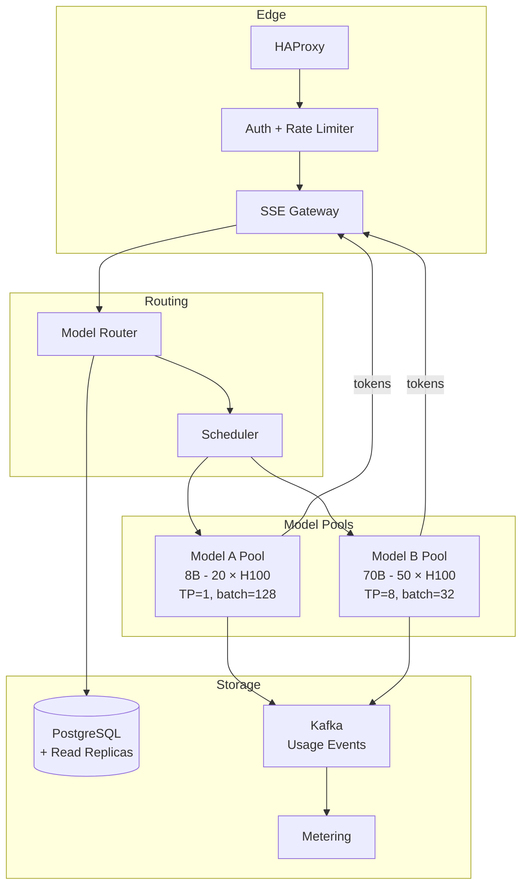
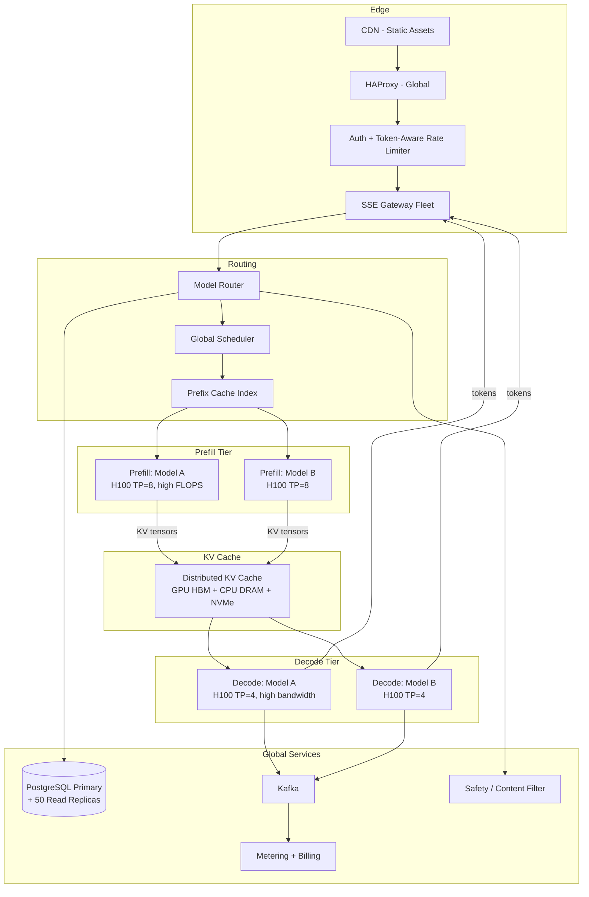
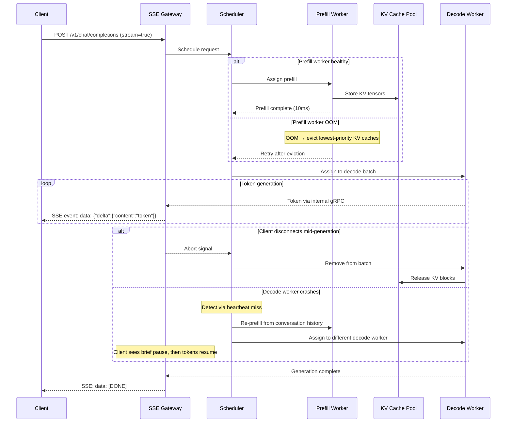

# System Design: ChatGPT — An AI Inference Platform at Scale

## A Staff Engineer's Guide to Designing LLM Serving Infrastructure Like OpenAI

---

## Table of Contents

1. [The Problem & Why It's Hard](#1-the-problem--why-its-hard)
2. [Requirements & Scope](#2-requirements--scope)
3. [Single Machine / Naive Solution](#3-phase-1-single-gpu-inference)
4. [Why Naive Fails (The Math)](#4-why-the-naive-approach-fails-the-math)
5. [Distributed Architecture](#5-phase-2-distributed-architecture)
6. [Core Component Deep Dives](#6-core-component-deep-dives)
7. [The Scaling Journey](#7-the-scaling-journey)
8. [Failure Modes & Resilience](#8-failure-modes--resilience)
9. [Data Model & Storage](#9-data-model--storage)
10. [Observability & Operations](#10-observability--operations)
11. [Design Trade-offs](#11-design-trade-offs)
12. [Common Interview Mistakes](#12-common-interview-mistakes)
13. [Interview Cheat Sheet](#13-interview-cheat-sheet)

---

## 1. The Problem & Why It's Hard

"Design ChatGPT" sounds like "put a model behind an API endpoint, add a chat UI, and scale the web tier." The web tier is the easy part. OpenAI runs it on a single primary PostgreSQL with ~50 read replicas.

The hard part is everything between the API and the GPU.

> **The interviewer's real question**: Can you design a system that serves autoregressive token generation to 100M+ concurrent users, where each request holds exclusive GPU memory (the KV cache) for the entire duration of generation, generation is fundamentally memory-bandwidth-bound (not compute-bound), and the two phases of each request (prefill and decode) have opposite hardware requirements?

Every token generated by a large language model requires loading the entire model's weights from GPU memory. For a 70B parameter model, that's ~140 GB of data moved through HBM per output token — regardless of how many FLOPS the GPU has. The GPU spends most of its time waiting for memory, not computing. This is the **memory wall**, and it's the central constraint of the entire system design.

> **Staff+ Signal:** The fundamental physics of LLM inference is that decode is a memory-bandwidth problem, not a compute problem. An H100 has 6x more compute FLOPS than an A100 but only 1.6x more HBM bandwidth — so it's only ~1.6x faster for single-request inference. Understanding the ops:byte ratio (H100: 591 FLOPS per byte of memory bandwidth) is the key to every design decision: why batching matters, why KV cache management is critical, and why prefill and decode should be separated.

---

## 2. Requirements & Scope

### Functional Requirements

- **Conversational AI**: Multi-turn chat with persistent conversation history
- **Token streaming**: Server-sent events delivering tokens as they're generated
- **Multiple models**: Route between models of different sizes and capabilities (GPT-4-class, GPT-4o-mini-class)
- **Context window**: Support up to 128K token contexts
- **System prompts**: Custom instructions prepended to every request
- **Tool use / function calling**: Model outputs structured tool calls; system executes and returns results
- **API access**: OpenAI-compatible REST API for programmatic access
- **Usage metering**: Track token consumption per user for billing

### Non-Functional Requirements

| Requirement | Target | Rationale |
|---|---|---|
| TTFT (p95) | < 500ms | Users perceive responsiveness from first token; longer feels "thinking" |
| TPOT / ITL (p95) | < 50ms | ~40ms/token matches human reading speed (~200ms/word, ~5 tokens/word) |
| Goodput | > 90% of requests meet both SLOs | Not raw throughput — throughput that satisfies latency targets |
| Availability | 99.9% | Users tolerate brief outages; extended outages trigger social media storms |
| Concurrent sessions | 10M+ | Driven by 100M+ weekly active users with ~10% concurrency |
| Model size support | Up to 400B+ parameters (MoE) | Frontier models like GPT-4, Llama 4 Maverick (400B) |

### Scale Estimation (Back-of-Envelope)

```
Weekly active users:         100M (OpenAI's reported number, Nov 2023)
Concurrent sessions:         ~10M (10% concurrency at peak)
Average request:             ~500 input tokens, ~300 output tokens
Requests per second (peak):  ~200K

Token generation:
  200K req/s × 300 output tokens = 60M tokens/sec to generate

Per-GPU throughput (H100, 70B model, batch=32):
  ~2,000 output tokens/sec per GPU

GPUs needed for decode alone:
  60M / 2,000 = 30,000 H100 GPUs

Prefill throughput (H100, 70B model):
  ~50K input tokens/sec per GPU
  200K req/s × 500 input tokens = 100M input tokens/sec
  100M / 50K = 2,000 GPUs for prefill

KV cache memory per request (70B model, 800-token context, GQA):
  ~2 MB per request (with grouped-query attention)
  10M concurrent × 2 MB = 20 TB of KV cache across the cluster

Model weight memory (70B in FP16):
  ~140 GB per replica
  With tensor parallelism across 8 GPUs: 17.5 GB model weights per GPU
  Remaining ~60 GB HBM per H100 → ~30,000 KV cache slots per GPU
```

The key derived constraints: **(1)** We need ~30,000 H100 GPUs just for decode generation — GPUs are the primary cost center. **(2)** KV cache (20 TB across the cluster) dwarfs model weights (140 GB per replica). **(3)** Decode throughput is bound by memory bandwidth, not FLOPS — batching is the only way to increase GPU efficiency.

---

## 3. Phase 1: Single GPU Inference

```
┌─────────────────────────────────────────────────┐
│              Single GPU Server                   │
│                                                  │
│  ┌───────────┐  ┌────────────┐  ┌────────────┐ │
│  │ HTTP API  │  │ Model      │  │ Token      │ │
│  │ (FastAPI) │  │ (HF Transformers)│ Sampler  │ │
│  └─────┬─────┘  └──────┬─────┘  └──────┬─────┘ │
│        │               │               │        │
│        └───────┬───────┘               │        │
│                │                       │        │
│         ┌──────▼──────┐        ┌───────▼──────┐ │
│         │  GPU (H100) │        │   KV Cache   │ │
│         │  80 GB HBM  │        │   (in HBM)   │ │
│         └─────────────┘        └──────────────┘ │
└─────────────────────────────────────────────────┘
```

The simplest implementation: load a model with HuggingFace Transformers, run `model.generate()` one request at a time.

```python
from transformers import AutoModelForCausalLM, AutoTokenizer

model = AutoModelForCausalLM.from_pretrained("meta-llama/Llama-3-8B", device_map="auto")
tokenizer = AutoTokenizer.from_pretrained("meta-llama/Llama-3-8B")

def generate(prompt: str, max_tokens: int = 256):
    inputs = tokenizer(prompt, return_tensors="pt").to("cuda")

    # Prefill: process all input tokens at once (matrix-matrix multiply)
    # Then decode: generate one token at a time (matrix-vector multiply)
    outputs = model.generate(
        **inputs,
        max_new_tokens=max_tokens,
        do_sample=True,
        temperature=0.7
    )
    return tokenizer.decode(outputs[0], skip_special_tokens=True)
```

**When does Phase 1 work?** Internal tools, prototypes, personal use. A single H100 generates ~170 tokens/sec for a 7B model — plenty for one user at a time.

**When does Phase 1 fail?** The moment a second user arrives. While the model generates 300 tokens for User A (~1.8 seconds), User B waits. At 10 concurrent users, the last user waits 18 seconds. This is called **head-of-line blocking**, and it's fatal for interactive applications.

---

## 4. Why the Naive Approach Fails (The Math)

### Bottleneck 1: Sequential Processing Wastes GPU Compute

A single decode step for a 7B model on H100:
```
Weight loading:   14 GB (FP16) from HBM at 3,350 GB/s = 4.2 ms
Compute:          14B FLOPs / 1,979 TFLOPS (FP16) = 0.007 ms
Ratio:            600:1 memory time vs compute time
```

The GPU is **99.8% idle** during single-request decode. It loads 14 GB of weights from memory to produce a single token, performing virtually no computation relative to the data movement.

Batching fixes this: with batch size 32, the GPU loads weights once and computes 32 tokens simultaneously:
```
Weight loading:   14 GB at 3,350 GB/s = 4.2 ms (same)
Compute:          14B × 32 FLOPs / 1,979 TFLOPS = 0.23 ms
Effective throughput: 32 tokens / 4.2 ms = 7,600 tokens/sec (vs 238 tokens/sec for batch=1)
```

That's **32x throughput from batching alone**, with the same hardware.

### Bottleneck 2: Static Batching Wastes Time

Naive batching (static batching) waits for a full batch before processing:
```
Batch size: 32, arrival rate: 10 req/s
Average wait to fill batch: 3.2 seconds
Longest sequence: 500 tokens (2.5 seconds)
Shortest sequence: 50 tokens (0.25 seconds)

Total time: 3.2s wait + 2.5s generation = 5.7 seconds
Short sequences done after 3.45s but held until longest finishes
```

The key waste: short sequences pad to the longest and sit idle. ORCA (OSDI 2022) showed that **continuous batching** — inserting new requests at each iteration step — achieves **36.9x throughput improvement** over static batching.

### Bottleneck 3: KV Cache Memory Fragmentation

Each request accumulates a KV cache that grows with each generated token. Without paging:
```
Pre-allocated KV cache for max_seq_len=2048 per request: ~2 MB (8B model, GQA)
Actual average usage: ~800 tokens → 0.8 MB
Waste: 60% of allocated KV cache memory is empty reserved space

With 80 GB HBM, 8B model weights (16 GB):
  Available for KV cache: 64 GB
  Pre-allocated slots: 64 GB / 2 MB = 32,000 concurrent requests
  With paging (PagedAttention): 64 GB / 0.8 MB actual = 80,000 concurrent requests
  → 2.5x more concurrent requests from the same hardware
```

| Bottleneck | Single GPU | Distributed Fix |
|---|---|---|
| Sequential processing | 99.8% GPU idle during decode | Continuous batching (batch=32-256) |
| Static batching | Short requests wait for long ones | Iteration-level scheduling (ORCA) |
| KV cache fragmentation | 60-80% memory wasted | PagedAttention (virtual memory paging) |
| Head-of-line blocking | Second user waits for first to finish | Concurrent request pipeline |
| Model too large for 1 GPU | 70B model = 140 GB > 80 GB HBM | Tensor parallelism across 2-8 GPUs |
| Prefill blocks decode | Long prompt stalls all in-flight decode | Prefill-decode disaggregation |

**The tipping point**: A single GPU with naive inference serves ~1 user at a time. With continuous batching and PagedAttention, the same GPU serves ~50-100 concurrent users. To serve 10M concurrent users, you need ~100,000-300,000 GPUs — and that's before redundancy.

---

## 5. Phase 2+: Distributed Architecture

**The key architectural insight**: Disaggregate prefill (compute-bound, processes entire prompt as a matrix-matrix multiply) from decode (memory-bandwidth-bound, generates one token per step as a matrix-vector multiply), and treat the KV cache as the central resource that the entire system manages — not an afterthought.



### How Real Companies Built This

**OpenAI / ChatGPT** runs on Microsoft Azure across multiple regions, treating Kubernetes clusters as "cattle not pets." They use H100 GPUs with HAProxy for load balancing. Their Applied Engineering Lead Evan Morikawa revealed that the critical operational metrics are **batch size and KV cache utilization** — not GPU utilization percentage, which is misleading (a GPU can be 100% "utilized" while starved of arithmetic work). Geographic proximity to users matters less than GPU availability — token generation speed dominates latency. The web tier is deceptively simple: a single primary Azure PostgreSQL with ~50 read replicas, unsharded, handles millions of queries per second at p99 in low double-digit milliseconds with five-nines availability.

**Anthropic / Claude** serves inference across three hardware platforms: AWS Trainium (majority of Bedrock inference), NVIDIA GPUs, and Google Cloud TPUs (Vertex AI). Their Project Rainier activated ~500,000 Trainium2 chips, with plans to scale to 1M+. Trainium2 is ~30-40% cheaper than H200, giving Anthropic significant cost advantages. However, this multi-hardware strategy created real production bugs: in August-September 2025, they disclosed three overlapping incidents — a context window routing error that sent 16% of requests to wrong server tiers (affecting 30% of Claude Code users), a TPU server misconfiguration causing output corruption (Thai text appearing in English responses), and an XLA compiler bug where approximate top-k operations returned wrong results depending on batch size.

**DeepSeek** published their production architecture for V3/R1 serving — the most transparent look at a frontier model's inference infrastructure. They run on 278 peak nodes (226.75 average), each with 8 H800 GPUs. Their MoE model (671B total, 37B activated per token) uses EP32 for prefill (4 nodes, 9 routed experts per GPU) and EP144 for decode (18 nodes, 2 routed experts per GPU). On-disk KV caching achieves 56.3% cache hit rate on 608B daily input tokens. Daily infrastructure cost: ~$87,072. At R1 pricing, theoretical gross margin is 545%.

**Meta** deployed innovations across three parallelism dimensions for Llama 3 405B inference. Their **DDA (Direct Data Access) algorithm** for tensor parallelism reduces AllReduce latency from O(N) to O(1), achieving parity between AMD MI300X and NVIDIA H100 hardware. For long contexts, their **Context Parallelism** splits token sequences across nodes — prefilling 128K tokens in 3.8 seconds over 16 nodes, and 1M tokens in 77 seconds over 32 H100 hosts. Their SLO targets: TTFT under 350ms, TPOT under 25ms.

### Key Data Structure: The PagedAttention KV Cache

The breakthrough that made production LLM serving feasible — inspired by OS virtual memory:

```
Physical KV Cache Blocks (in GPU HBM):
┌──────────┬──────────┬──────────┬──────────┬─────┐
│ Block 0  │ Block 1  │ Block 2  │ Block 3  │ ... │
│ 16 tokens│ 16 tokens│ 16 tokens│ 16 tokens│     │
└──────────┴──────────┴──────────┴──────────┴─────┘

Page Table (per request):
┌────────────────────────────────────────┐
│ Request A: [Block 2] → [Block 7] → [Block 11] → [Block 3]  │
│ Request B: [Block 0] → [Block 5] → [Block 9]               │
│ Request C: [Block 2] → [Block 7] → [Block 14]  (shared prefix!) │
└────────────────────────────────────────┘

Copy-on-Write: Request C shares Block 2 and Block 7 with Request A
(same system prompt prefix). Only divergent blocks are new allocations.
```

Before PagedAttention: 60-80% KV cache waste due to fragmentation and over-reservation.
After PagedAttention: under 4% waste. This single innovation delivered **2-4x throughput improvement** (vLLM, SOSP 2023).

---

## 6. Core Component Deep Dives

### 6.1 Request Scheduler (The Brain)

**Responsibilities:**
- Accept incoming requests and queue them by priority
- Assign requests to prefill workers based on load and prefix cache hits
- Manage the batch composition for each decode iteration
- Preempt low-priority requests when memory pressure spikes (evict KV cache to CPU)
- Enforce goodput SLOs: reject requests that would violate TTFT/TPOT targets



The scheduler's key decision each iteration: **which requests to include in this decode batch?** The vLLM scheduler uses a formula: `score = len(waiting) × 4 + len(running)` per data-parallel replica, routing to the least-loaded one.

> **Staff+ Signal:** The scheduler is where throughput and latency trade off. A scheduler optimizing for throughput will pack the maximum batch size — but this increases TTFT (new requests wait longer to enter the batch) and increases TPOT (more memory for KV cache = less memory for batching). The correct objective function is **goodput**: requests per second that meet both TTFT and TPOT SLOs. DistServe (OSDI 2024) showed that a system at 90% throughput utilization can have goodput below 40% if the wrong requests are delayed. The scheduler must treat SLO compliance as a hard constraint, not a soft goal.

### 6.2 Prefill-Decode Disaggregation

**Responsibilities:**
- Prefill workers: Process input prompts as matrix-matrix multiplies (compute-bound, wants high FLOPS)
- Decode workers: Generate tokens one at a time as matrix-vector multiplies (memory-bandwidth-bound, wants high HBM bandwidth)
- KV cache transfer: Move computed KV tensors from prefill to decode workers



**Why disaggregate?** Without it, a long prefill (2,000-token prompt) monopolizes the GPU for ~40ms, stalling all in-flight decode requests. With 100 concurrent decode requests, each loses 40ms of TPOT — a visible stutter in the streaming output. DistServe showed **2-30x TPOT improvement** under bursty workloads by eliminating this interference.

**Splitwise** (Microsoft, ISCA 2024) pushed this further: use H100s for prefill (high FLOPS) and cheaper A100s for decode (adequate bandwidth). Result: **1.4x higher throughput at 20% lower cost**.

### 6.3 Token Streaming via SSE

**Responsibilities:**
- Maintain persistent HTTP connections for in-progress generations
- Deliver each generated token as an SSE event
- Handle client disconnections gracefully (abort generation, release KV cache)
- Support backpressure when clients consume slower than generation

```
Client ←── SSE ──── Streaming Gateway ←── Decode Worker

Event stream format (OpenAI-compatible):
data: {"id":"chatcmpl-abc","choices":[{"delta":{"content":" Hello"}}]}

data: {"id":"chatcmpl-abc","choices":[{"delta":{"content":" world"}}]}

data: [DONE]
```

Why SSE over WebSockets? LLM responses are unidirectional (server → client). SSE is simpler (standard HTTP), stateless (horizontal scaling without sticky sessions), and has built-in auto-reconnect. WebSocket latency is only ~3ms faster — irrelevant at token-level streaming cadence of 25-50ms.

### 6.4 Prefix Caching

**Responsibilities:**
- Identify shared prompt prefixes across requests (system prompts, few-shot examples)
- Cache pre-computed KV tensors for reuse
- Manage cache eviction under memory pressure

When every API request starts with the same 2,000-token system prompt, you're recomputing identical KV tensors for those tokens on every request. At 200K req/s, that's 400M redundant prefill tokens per second.

**vLLM's approach**: Hash-based matching on 16-token blocks. If the first N blocks of a new request match cached blocks, skip prefill for those tokens. Prefix must match exactly from the beginning.

**SGLang's RadixAttention**: A radix tree indexed by token sequences. Maintains a cache of KV tensors with LRU eviction. CPU-side tree maintenance (zero GPU overhead). Automatically reuses KV cache across multi-turn conversations, few-shot examples, and tool-calling chains. Benchmarks show **up to 5x throughput improvement** on structured workloads.

**DeepSeek's production result**: On-disk KV caching achieves **56.3% cache hit rate** on 608B daily input tokens — meaning 342B tokens skip prefill entirely.

> **Staff+ Signal:** Prefix caching transforms the cost model of LLM serving. Anthropic advertises "up to 90% cost savings and 85% latency reduction for long prompts" with prompt caching. At scale, the prefix cache hit rate is the single most impactful metric for inference cost. A system with 60% cache hit rate (like DeepSeek) effectively processes only 40% of input tokens through prefill. This means the prefix cache routing strategy — ensuring requests with matching prefixes land on the same server — is more impactful than GPU hardware selection.

### 6.5 Model Router

**Responsibilities:**
- Route requests to the correct model version (GPT-4-class, mini-class, reasoning-class)
- Select between hardware backends (H100, Trainium, TPU)
- Implement canary deployments for new model versions
- Handle graceful model transitions during updates



> **Staff+ Signal:** Model routing is where organizational complexity meets technical design. Each model pool has different GPU requirements (the 8B mini model fits on 2 GPUs; the 400B MoE model needs 18 nodes with EP144). A new model version deployment is a multi-hour rollout across thousands of GPUs — you can't just restart pods. The routing layer must support gradual traffic shifting, instant rollback on quality regression, and per-customer model pinning for enterprise SLAs. Anthropic's context routing bug (August 2025, where 16% of requests hit wrong server tiers) shows that routing errors at this layer are catastrophic and hard to detect without per-request evaluation.

---

## 7. The Scaling Journey

### Stage 1: Prototype (1 GPU, < 10 users)

```
┌──────────┐     ┌──────────────────────────────┐
│ FastAPI   │────▶│ Single H100 GPU              │
│ + SSE     │     │ - HF Transformers            │
│           │     │ - Naive generate()            │
│           │     │ - No batching                 │
└──────────┘     └──────────────────────────────┘
```

One H100 runs a 7B model at ~170 tokens/sec for one user. Good for demos, internal tools, and local development.

**Limit**: Head-of-line blocking at 2+ concurrent users. GPU 99.8% idle during single-request decode.

### Stage 2: Production Single-Model (vLLM, 100-10K users)



**New capabilities:**
- Continuous batching: 23x throughput improvement over static batching
- PagedAttention: 2-4x more concurrent requests per GPU
- Multiple vLLM replicas behind a load balancer
- SSE streaming to clients

**Key metric**: Each H100 now serves ~50-100 concurrent requests for an 8B model.

**Limit**: At ~10K concurrent users, you need ~100+ GPUs. Load balancing becomes prefix-unaware (random routing wastes cache). Larger models (70B+) need tensor parallelism.

### Stage 3: Multi-Model Platform (10K-1M users)



**New capabilities:**
- Model router supporting multiple model sizes
- Tensor parallelism for 70B+ models (8 GPUs per replica)
- Kafka-based usage metering for billing
- Prefix-aware routing (requests with matching system prompts go to the same replica)

**Limit**: Prefill-decode interference. Long prompts stall decode for all co-batched requests. GPU utilization plateaus at ~60-70%.

### Stage 4: Disaggregated Inference Platform (1M-100M+ users)



**New capabilities:**
- Prefill-decode disaggregation (2-30x TPOT improvement under bursty load)
- Distributed KV cache pool (GPU HBM → CPU DRAM → NVMe tiering)
- Prefix-aware scheduling (60% TTFT reduction via warm cache routing)
- Token-aware rate limiting (RPM + TPM dual bucket)
- Content safety pipeline in the request path
- Global scheduling across multiple regions

> **Staff+ Signal:** At OpenAI's scale (800M users, thousands of K8s nodes), the Kubernetes control plane itself becomes a failure domain. Their December 2024 outage was caused by a telemetry service that made every node execute resource-intensive K8s API calls simultaneously. DNS caching hid the problem during rollout — it only manifested after TTL expiry. The lesson: at this scale, the orchestration layer needs the same resilience engineering as the inference layer. Phased rollouts, emergency control-plane access independent of the main K8s API, and decoupled critical systems (inference routing must work even if monitoring is down).

---

## 8. Failure Modes & Resilience

### Request Flow with Failure Handling



### Failure Scenarios

| Failure | Detection | Recovery | Blast Radius |
|---|---|---|---|
| Decode worker OOM | CUDA OOM exception | Preempt lowest-priority requests (swap KV to CPU); re-queue preempted requests | Preempted users see brief pause |
| Prefill worker crash | Heartbeat timeout (5s) | Scheduler routes to another prefill worker; re-process prompt | Single request delayed by ~100ms |
| KV cache transfer failure | Transfer timeout | Re-prefill on decode worker directly (slower but correct) | One request's TTFT increases |
| Model produces safety violation | Output classifier detects | Truncate response, return safety message | Single user |
| GPU hardware error (ECC) | NVIDIA driver error log | Drain node, migrate requests, replace GPU | Requests on that node re-queued |
| K8s control plane overload | API server latency spike | Inference continues on existing pods; no new scheduling until recovery | No new autoscaling; existing traffic unaffected |
| Prefix cache corruption | Hash mismatch on retrieval | Invalidate cached block, re-compute from scratch | One request loses cache speedup |
| Rate limit breach | Token bucket exhaustion | Return 429 with `Retry-After` header | Single user/API key throttled |

> **Staff+ Signal:** The most insidious failure in LLM serving is silent quality degradation — the model appears to work but produces subtly wrong outputs. Anthropic's August 2025 TPU bug caused token probabilities to shift, producing Thai characters in English responses. The XLA compiler's `xla_allow_excess_precision` flag silently promoted bf16 to fp32 approximate computations, and the approximate top-k operation occasionally returned completely wrong tokens depending on batch size. These bugs are invisible to latency and throughput monitoring. Detection requires output quality evaluation (automated evals, user reports), and the fix required switching from approximate to exact top-k operations — a deliberate performance trade-off for correctness. Any multi-hardware serving platform (GPU + TPU + custom silicon) must treat compiler-level correctness as a production concern, not a theoretical one.

---

## 9. Data Model & Storage

### Conversation Schema

```sql
CREATE TABLE users (
    id              UUID PRIMARY KEY DEFAULT gen_random_uuid(),
    email           VARCHAR(255) UNIQUE NOT NULL,
    tier            VARCHAR(20) DEFAULT 'free',
    api_key_hash    VARCHAR(64),
    created_at      TIMESTAMPTZ DEFAULT NOW()
);

CREATE TABLE conversations (
    id              UUID PRIMARY KEY DEFAULT gen_random_uuid(),
    user_id         UUID NOT NULL REFERENCES users(id),
    title           VARCHAR(500),
    model           VARCHAR(50) NOT NULL,
    system_prompt   TEXT,
    created_at      TIMESTAMPTZ DEFAULT NOW(),
    updated_at      TIMESTAMPTZ DEFAULT NOW()
);

CREATE TABLE messages (
    id              UUID PRIMARY KEY DEFAULT gen_random_uuid(),
    conversation_id UUID NOT NULL REFERENCES conversations(id),
    role            VARCHAR(20) NOT NULL,
    content         TEXT NOT NULL,
    token_count     INT NOT NULL,
    model           VARCHAR(50),
    finish_reason   VARCHAR(20),
    latency_ms      INT,
    created_at      TIMESTAMPTZ DEFAULT NOW()
);

CREATE TABLE usage_records (
    id              UUID PRIMARY KEY DEFAULT gen_random_uuid(),
    user_id         UUID NOT NULL,
    model           VARCHAR(50) NOT NULL,
    input_tokens    INT NOT NULL,
    output_tokens   INT NOT NULL,
    cached_tokens   INT DEFAULT 0,
    cost_micros     BIGINT NOT NULL,
    request_id      VARCHAR(64) NOT NULL,
    created_at      TIMESTAMPTZ DEFAULT NOW()
);
```

### Critical Indexes

```sql
CREATE INDEX idx_conversations_user ON conversations (user_id, updated_at DESC);

CREATE INDEX idx_messages_conversation ON messages (conversation_id, created_at);

CREATE INDEX idx_usage_user_period ON usage_records (user_id, created_at);

CREATE INDEX idx_usage_billing ON usage_records (user_id, model, created_at)
    WHERE cost_micros > 0;
```

### KV Cache Storage Hierarchy

```
┌─────────────────────────────────────────────────────────┐
│ Tier 1: GPU HBM (80 GB per H100)                        │
│ Latency: ~1 μs | Bandwidth: 3,350 GB/s                  │
│ Use: Active decode requests' KV cache                    │
│ Capacity: ~30,000 concurrent request slots per GPU       │
├─────────────────────────────────────────────────────────┤
│ Tier 2: CPU DRAM (512 GB - 2 TB per node)               │
│ Latency: ~100 ns | Bandwidth: ~200 GB/s                 │
│ Use: Preempted requests, warm prefix cache               │
│ Capacity: 10-50x more slots than GPU HBM                │
├─────────────────────────────────────────────────────────┤
│ Tier 3: NVMe SSD (4-8 TB per node)                      │
│ Latency: ~100 μs | Bandwidth: ~7 GB/s                   │
│ Use: Cold prefix cache, conversation resume              │
│ Capacity: 100-500x more slots than GPU HBM              │
└─────────────────────────────────────────────────────────┘

Mooncake (Moonshot AI): Distributes KV cache across ALL nodes'
CPU DRAM and NVMe via RDMA, creating a cluster-wide KV pool.
Result: 59%-498% higher effective capacity while meeting SLOs.
```

### Storage Engine Choice

| Engine | Use Case | Why |
|---|---|---|
| PostgreSQL (primary + ~50 replicas) | Conversations, users, API keys | OpenAI's actual choice; unsharded single primary handles millions of QPS at p99 low double-digit ms |
| Kafka | Usage events, audit log, billing pipeline | Durable event stream; decouples metering from serving path |
| Redis | Rate limit counters (RPM/TPM), session tokens | Sub-ms reads for per-request rate limit checks |
| GPU HBM | Active KV cache | Only storage fast enough for per-token decode access |
| CPU DRAM / NVMe | KV cache overflow, prefix cache | Tiered storage for preempted and cached KV tensors |

> **Staff+ Signal:** OpenAI's PostgreSQL architecture is a lesson in simplicity. A single unsharded primary with ~50 read replicas across regions handles their entire conversational storage at 800M users. They didn't need Cassandra, DynamoDB, or a custom database. The inference tier is complex enough — keeping the data tier simple reduces operational surface area. The rule: push complexity to where it's unavoidable (GPU scheduling, KV cache management), and keep everything else as boring as possible.

---

## 10. Observability & Operations

### Key Metrics

**Inference SLO metrics:**
- `llm.ttft_seconds{model, quantile}` — Time-to-first-token distribution; p95 > 500ms triggers investigation
- `llm.tpot_ms{model, quantile}` — Time-per-output-token; p95 > 50ms means decode is overloaded or interference occurring
- `llm.goodput_ratio{model}` — Fraction of requests meeting both TTFT and TPOT SLOs; < 90% is a P1

**GPU resource metrics:**
- `gpu.kv_cache_utilization{node}` — KV cache memory usage as fraction of available HBM; > 90% means preemption imminent
- `gpu.batch_size{node}` — Current decode batch size; should be near target (32-128); too low = waste, too high = TPOT bloat
- `gpu.arithmetic_intensity{node}` — Actual FLOPS / byte transferred; reveals whether GPU is compute or memory bound
- `gpu.hbm_bandwidth_utilization{node}` — Should be > 80% during decode; lower means scheduling is suboptimal

**System health metrics:**
- `llm.prefix_cache_hit_rate{model}` — Fraction of prefill tokens served from cache; < 40% indicates routing is prefix-unaware
- `llm.preemption_rate{model}` — Requests preempted per second; rising trend means KV cache capacity is insufficient
- `llm.queue_depth{model, priority}` — Requests waiting for prefill; sustained growth means capacity shortfall
- `llm.request_abort_rate` — Client disconnections; high rate means TTFT is too slow (users giving up)

### Distributed Tracing

A typical chat completion request trace:

```
[HAProxy] ─── 1ms ───▶ [Auth + Rate Check] ─── 2ms
                              │
                        [Model Router] ─── 1ms
                              │
                        [Scheduler: prefix match?] ─── 0.5ms
                              │
                        [Prefill Worker: 500 input tokens]
                        ├── Cache hit (400 tokens): 0 ms
                        └── Compute (100 tokens): 2ms
                              │
                        [KV Transfer to decode node] ─── 3ms
                              │
                        [Decode Worker: join batch, generate 300 tokens]
                        ├── Batch join wait: 5ms
                        └── 300 tokens × 30ms/token = 9,000ms
                              │
                        [SSE streaming: tokens delivered as generated]

TTFT: 1 + 2 + 1 + 0.5 + 2 + 3 + 5 + 30 = ~44.5 ms
Total generation: ~9 seconds
End-to-end: ~9.05 seconds
```

### Alerting Strategy

| Alert | Condition | Severity | Action |
|---|---|---|---|
| Goodput drop | < 85% for 5min | P1 | Page on-call; check batch sizes, KV cache pressure, prefill-decode interference |
| TTFT spike | p95 > 1s for 5min | P1 | Check queue depth, prefill worker health, prefix cache hit rate |
| KV cache near OOM | > 95% utilization for 2min | P1 | Scale decode pool; increase preemption aggressiveness; check for leaked KV blocks |
| GPU node failure | Heartbeat miss for 30s | P2 | Drain node; redistribute requests; RMA hardware |
| Prefix cache hit rate drop | < 30% for 15min | P2 | Check routing logic; verify prefix-aware scheduling is active |
| Request abort rate spike | > 10% for 10min | P2 | Users abandoning due to slow TTFT; investigate queue depth |
| Model quality regression | Eval scores drop > 5% | P2 | Check for compiler bugs, precision issues, canary rollback |
| Billing pipeline lag | Kafka consumer lag > 5min | P3 | Usage records delayed; check metering service health |

---

## 11. Design Trade-offs

| Decision | Option A | Option B | Recommended | Why |
|---|---|---|---|---|
| Batching strategy | Static batching | Continuous batching | **Continuous** | ORCA showed 36.9x throughput improvement. Static batching wastes GPU time on padding and makes short requests wait for long ones. Continuous batching is universally adopted (vLLM, TGI, TensorRT-LLM, SGLang). |
| Prefill-decode | Shared GPU pool | Disaggregated pools | **Disaggregated** | DistServe showed 2-30x TPOT improvement. Prefill is compute-bound (wants FLOPS), decode is memory-bound (wants bandwidth). Running them together means neither is optimized. Splitwise showed 1.4x throughput at 20% lower cost with heterogeneous hardware. |
| KV cache management | Pre-allocate max length | PagedAttention | **PagedAttention** | 2-4x throughput improvement by eliminating 60-80% memory waste. Copy-on-write enables prefix sharing. Universal in production (vLLM, TGI, TensorRT-LLM). |
| Prefix caching | None (recompute always) | Hash-based or RadixAttention | **RadixAttention** | DeepSeek's 56.3% cache hit rate eliminates over half of all prefill compute. SGLang's RadixAttention is always-on with zero GPU overhead. The savings scale with system prompt length and multi-turn conversation depth. |
| Parallelism for 70B+ | Pipeline parallelism | Tensor parallelism | **TP within node, DP across nodes** | TP exploits NVLink bandwidth (900 GB/s on H100) for low per-request latency. PP introduces pipeline bubbles. Meta's rule: TP intra-node, DP inter-node. EP for MoE on top. |
| Streaming protocol | WebSocket | SSE (Server-Sent Events) | **SSE** | LLM output is unidirectional. SSE is simpler, stateless HTTP (scales horizontally), has browser auto-reconnect. WebSocket's bidirectionality is unnecessary overhead. 3ms latency difference is irrelevant at 25-50ms token cadence. |
| Rate limiting | Requests per minute only | RPM + Tokens per minute | **Dual RPM + TPM** | Token cost varies 100x between requests. RPM alone lets a single 100K-token request consume as many resources as 500 short requests. TPM enforces fair resource consumption. |
| Hardware | NVIDIA only | Multi-hardware (GPU + TPU + custom) | **NVIDIA primary, diversify gradually** | NVIDIA has the strongest software ecosystem (CUDA, TensorRT). Multi-hardware reduces vendor lock-in but introduces compiler-level correctness risks (Anthropic's XLA bug). Diversify only after building robust per-hardware evaluation. |

> **Staff+ Signal:** The prefill-decode disaggregation decision is a one-way door with organizational implications. Once you disaggregate, you have two separate fleets with different scaling policies, different hardware requirements, and different on-call runbooks. The prefill fleet scales with input token volume; the decode fleet scales with concurrent sessions × output length. During a usage spike, the two fleets need to scale independently — but the KV cache transfer between them becomes a network bottleneck. Mooncake's insight: make the KV cache a first-class distributed system (not just GPU-local storage), backed by cluster-wide CPU DRAM and NVMe via RDMA. This turns the disaggregation bottleneck into a distributed storage problem that systems engineers know how to solve.

---

## 12. Common Interview Mistakes

1. **Designing the web tier instead of the inference tier**: Candidates spend 20 minutes on load balancers, databases, and microservices. OpenAI runs a single PostgreSQL primary with read replicas. **What staff+ candidates say instead**: "The web tier is solved with standard patterns. Let me focus on the hard part: GPU scheduling, KV cache management, and prefill-decode disaggregation."

2. **Ignoring the memory bandwidth wall**: "I'll add more GPUs for more compute." More FLOPS doesn't help when decode is memory-bandwidth-bound. An H100 has 6x more compute than A100 but is only ~1.6x faster for single-request inference. **What staff+ candidates say instead**: "Decode throughput is bound by HBM bandwidth, not compute FLOPS. Batching is the only way to improve GPU efficiency — it amortizes weight loading across multiple sequences."

3. **Treating all tokens equally**: "My system handles N requests per second." But a 100-token request and a 100,000-token request consume vastly different resources. **What staff+ candidates say instead**: "I need dual rate limiting — RPM for request fairness and TPM for resource fairness. The scheduler must account for per-request KV cache size when admitting to a batch."

4. **No streaming architecture**: "Client sends request, server returns full response." This means the user stares at a blank screen for 5-30 seconds. **What staff+ candidates say instead**: "I'd use SSE to stream tokens as they're generated. TTFT is the perceived responsiveness metric — users see the first token in < 500ms even for long responses."

5. **Ignoring prefill-decode interference**: "I'll batch all requests together on shared GPUs." A 2,000-token prefill blocks all in-flight decode for ~40ms, causing visible stutter. **What staff+ candidates say instead**: "Prefill is compute-bound, decode is memory-bound — they have opposite hardware requirements. I'd disaggregate them into separate pools, transferring KV cache between them."

6. **Pre-allocating max KV cache per request**: "I'll reserve memory for the full 128K context window per request." This wastes 99%+ of memory for average 800-token conversations. **What staff+ candidates say instead**: "I'd use PagedAttention — virtual memory paging for KV cache. Allocate in 16-token blocks on demand. This reduced KV cache waste from 60-80% to under 4% in vLLM's benchmarks."

7. **Optimizing for throughput instead of goodput**: "My system processes 100K tokens/sec." But if only 40% of requests meet latency SLOs, the system fails from the user's perspective. **What staff+ candidates say instead**: "The correct objective is goodput — requests per second that meet both TTFT and TPOT SLOs. Maximizing throughput can actively hurt goodput by increasing queuing delay."

---

## 13. Interview Cheat Sheet

### Time Allocation (45-minute interview)

| Phase | Time | What to Cover |
|---|---|---|
| Clarify requirements | 5 min | Model size? Latency SLOs (TTFT/TPOT)? Scale (concurrent users)? Streaming? Multi-model? |
| High-level design | 10 min | Prefill-decode disaggregation, KV cache as central resource, streaming pipeline, model routing |
| Deep dive #1 | 10 min | KV cache management: PagedAttention, prefix caching, tiered storage (HBM → DRAM → NVMe) |
| Deep dive #2 | 8 min | Scheduling: continuous batching, goodput optimization, preemption under memory pressure |
| Failure modes + scaling | 7 min | GPU failures, KV cache OOM, silent quality degradation, K8s control plane at scale |
| Trade-offs + wrap-up | 5 min | TP vs PP, SSE vs WebSocket, throughput vs goodput, multi-hardware risks |

### Step-by-Step Answer Guide

1. **Clarify**: "What model size are we serving? What are the latency SLOs — TTFT and TPOT? How many concurrent users? Do we need multi-model routing?"

2. **The key insight**: "LLM inference has two fundamentally different phases: prefill (compute-bound, processes the entire prompt) and decode (memory-bandwidth-bound, generates one token at a time). Designing them as one system is a compromise that satisfies neither."

3. **Simple version**: "A single GPU running vLLM with continuous batching and PagedAttention serves ~50-100 concurrent users for an 8B model. That's our Phase 1."

4. **Break it**: "At 10M concurrent users, we need ~30,000+ H100 GPUs. Decode throughput is bound by HBM bandwidth at 3,350 GB/s — the GPU is 99.8% idle on memory access for single requests. Batching amortizes weight loading: batch=32 gives 32x throughput."

5. **Distributed architecture**: "Disaggregated prefill and decode pools. Prefill workers process prompts on high-FLOPS GPUs, produce KV tensors, transfer to decode workers via a distributed KV cache pool. Decode workers run continuous batching with PagedAttention."

6. **KV cache deep dive**: "PagedAttention treats KV cache like OS virtual memory — 16-token blocks, page tables per request, copy-on-write for shared prefixes. Prefix caching via RadixAttention reuses KV for system prompts. DeepSeek achieves 56% cache hit rate."

7. **Scheduling**: "The scheduler optimizes for goodput, not throughput. Goodput = requests/sec meeting both TTFT and TPOT SLOs. Large batch sizes increase throughput but hurt TTFT. The scheduler admits requests to the batch only if SLOs will be met."

8. **Failure handling**: "GPU OOM → preempt lowest-priority requests (swap KV to CPU). Worker crash → re-prefill and reassign. Client disconnect → abort and release KV blocks immediately. Silent quality degradation → automated evals on sampled outputs."

9. **Scale levers**: "Prefix-aware routing (60% TTFT reduction). Heterogeneous hardware for prefill vs decode (Splitwise: 1.4x throughput at 20% less cost). KV cache tiering (HBM → DRAM → NVMe). GQA models to reduce KV cache size by 4-8x."

10. **Streaming**: "SSE for token delivery — unidirectional, stateless HTTP, auto-reconnect. The user perceives TTFT as responsiveness. Even a 30-second generation feels fast if the first token arrives in 200ms."

### What the Interviewer Wants to Hear

- At **L5/Senior**: Correct understanding of autoregressive generation, basic GPU serving with batching, SSE streaming, simple scaling with replicas, awareness of KV cache.

- At **L6/Staff**: Prefill-decode disaggregation, PagedAttention mechanics, continuous batching vs static, goodput vs throughput distinction, prefix caching economics, memory-bandwidth wall explanation with actual numbers, real production examples (OpenAI, Anthropic, DeepSeek).

- At **L7/Principal**: KV cache as a distributed system (Mooncake architecture), multi-hardware serving risks (XLA compiler bugs), organizational implications of disaggregated fleets, cost optimization (Splitwise heterogeneous hardware), inference cost economics ($ per million tokens trajectory), migration strategy from monolithic to disaggregated serving.

### My Take (Michi Meow)

This is my favorite system design topic because it inverts every intuition from traditional web systems. In web systems, compute is the bottleneck and you scale with more CPU cores. In LLM inference, memory bandwidth is the bottleneck and adding compute barely helps. In web systems, you fight to keep databases consistent. In LLM inference, you fight to keep KV cache blocks allocated and fragmentation-free. In web systems, all requests are roughly equal. In LLM inference, a 100K-token request consumes 1,000x more resources than a 100-token request.

The production evidence tells a fascinating story of rapid evolution. In 2022, ORCA introduced continuous batching (36.9x improvement). In 2023, PagedAttention solved KV cache fragmentation (2-4x more concurrent requests). In 2024, DistServe and Splitwise established prefill-decode disaggregation as the standard architecture. In 2025, Mooncake made the KV cache itself a distributed system. Each breakthrough unlocked the next bottleneck.

And yet, OpenAI's web tier — the part candidates spend 20 minutes designing — is a single PostgreSQL with 50 read replicas. The lesson is clear: **push complexity where it's unavoidable (GPU scheduling, KV cache management), and keep everything else as boring as possible.**

If you remember one thing from this post: **decode is a memory-bandwidth problem, not a compute problem. Every design decision flows from this fact.**

*Written as a reference for staff-level system design interviews.*
