# System Design: Distributed Crossword Puzzle Solver

## From One Machine to a Fleet of Workers — A Staff Engineer's Guide

---

## Table of Contents

1. [The Problem & Why It's Hard](#1-the-problem--why-its-hard)
2. [Requirements & Scope](#2-requirements--scope)
3. [The Algorithm: Constraint Satisfaction Problem](#3-the-algorithm-constraint-satisfaction-problem)
4. [Phase 1: Single Machine Solver](#4-phase-1-single-machine-solver)
5. [Why One Machine Fails (The Math)](#5-why-one-machine-fails-the-math)
6. [Phase 2: Distributed Architecture](#6-phase-2-distributed-architecture)
7. [Core Component Deep Dives](#7-core-component-deep-dives)
8. [The Scaling Journey](#8-the-scaling-journey)
9. [Failure Modes & Resilience](#9-failure-modes--resilience)
10. [Data Model & Storage](#10-data-model--storage)
11. [Observability & Operations](#11-observability--operations)
12. [Design Trade-offs](#12-design-trade-offs)

---

## 1. The Problem & Why It's Hard

You're asked to build a service that solves crossword puzzles. You're given:

- A **board** (~50×50 grid) with about **100 slots** (each has a position, direction, and length)
- A **dictionary** of ~1 million words
- A **constraint**: wherever two slots cross, the letters at the intersection must match

On the surface, it sounds like "just a search problem." The trap is underestimating the search space.

> **The interviewer's real question**: Can you prove a single computer is too slow, and then design a distributed system that splits the work intelligently, handles dead ends fast, and moves tasks around if workers get stuck?

This is not an algorithm puzzle. It is a **distributed systems design** challenge.

---

## 2. Requirements & Scope

### Functional Requirements

- **Submit a puzzle**: Accept a grid layout (slot definitions) and return a solved board
- **Partial solve support**: Return the best partial solution if unsolvable (or unsolvable in time)
- **Async solving**: For large puzzles, return a job ID and poll/subscribe for results
- **Dictionary management**: CRUD operations on the word dictionary
- **Cancel solving**: Allow clients to cancel in-flight solve requests

### Non-Functional Requirements

| Requirement | Target | Rationale |
|---|---|---|
| Solve latency (simple puzzle) | < 5s p99 | Interactive use cases |
| Solve latency (hard puzzle) | < 60s p99 | Batch/asynchronous acceptable |
| Dictionary size | 1M words | Realistic production corpus |
| Concurrent solve jobs | 1,000+ | Multi-tenant SaaS |
| Availability | 99.9% | ~8.7 hr/year downtime budget |
| Correctness | 100% | A wrong answer is worse than no answer |
| Idempotency | Yes | Same puzzle, same result (given same dictionary) |
| Horizontal scalability | Yes | Workers scale independently of API |

### Scale Estimation (Back-of-Envelope)

```
Puzzle requests per day:        100,000
Peak requests per second:       ~5 (bursty, batch solvers)
Dictionary size:                1M words × avg 8 bytes = ~8MB in memory
Grid size:                      50×50 = 2,500 cells
Slots per puzzle:               ~100 (50 across + 50 down typical)
Candidates per slot (len 5-7):  ~5,000–50,000 words (filtered by length)
Search tree depth:              100 (one level per slot)
Branching factor (unoptimized): 10,000+ at root
Work item state size:           ~50KB (partial assignment + candidate lists)
Workers needed at peak:         50–200 (depends on puzzle difficulty)
```

---

## 3. The Algorithm: Constraint Satisfaction Problem

Before designing the system, understand what we're asking computers to do.

### 3.1 Formalization as CSP

A crossword puzzle is a **Constraint Satisfaction Problem (CSP)**:

- **Variables**: Each slot `S_i` (e.g., `2-ACROSS`, `7-DOWN`)
- **Domain**: The set of candidate words that fit `S_i`'s length (initially thousands of words)
- **Constraints**: For every pair of crossing slots `(S_i, S_j)`, the letter at the intersection must match

```
Example:
  Slot 1 (3-ACROSS, length 5): candidates = [APPLE, ABBEY, ACTOR, ...]
  Slot 2 (4-DOWN,   length 5): candidates = [ALPHA, ALOFT, ALLOT, ...]
  Constraint: Slot1[2] == Slot2[0]  (they cross at position 2 of Slot1, position 0 of Slot2)
```

### 3.2 Backtracking with Constraint Propagation

The standard solve algorithm:

```
function SOLVE(assignment, domains):
    if all slots are assigned:
        return assignment  // solution found!

    slot = SELECT_UNASSIGNED_SLOT(assignment, domains)  // MRV heuristic

    for each word in domains[slot]:
        if word is CONSISTENT with current assignment:
            assignment[slot] = word
            new_domains = PROPAGATE_CONSTRAINTS(slot, word, domains)

            if no domain is empty:
                result = SOLVE(assignment, new_domains)
                if result is not FAILURE:
                    return result

            assignment.remove(slot)

    return FAILURE  // exhausted all candidates — backtrack
```

**Key optimizations that make this tractable:**

1. **MRV (Minimum Remaining Values)**: Always pick the slot with the *fewest* remaining candidates. Fail fast rather than exploring large branches that will fail later.

2. **Arc Consistency (AC-3)**: After assigning a word to a slot, propagate constraints to all crossing slots. Remove candidates that are now incompatible. If any slot's candidate list drops to zero, backtrack immediately without exploring further.

3. **Candidate indexing**: Pre-build an index: `by_length[n] → all words of length n`, and `by_pattern["A?P?E"] → [APPLE, AMPLE, ...]`. Constraint propagation becomes a set intersection, not a linear scan.

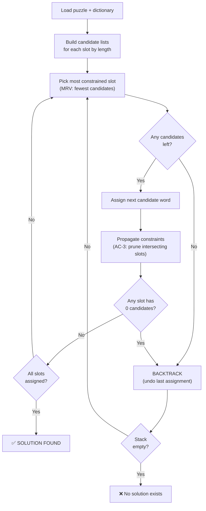

---

## 4. Phase 1: Single Machine Solver

The simplest possible design — everything on one server.

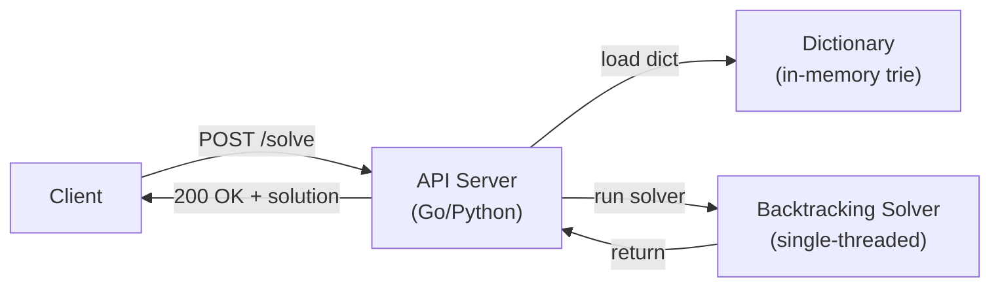

**Implementation sketch (Python pseudocode):**

```python
class CrosswordSolver:
    def __init__(self, dictionary: list[str]):
        self.by_length = defaultdict(list)
        for word in dictionary:
            self.by_length[len(word)].append(word)

    def solve(self, puzzle: Puzzle) -> Optional[Assignment]:
        # Build initial candidate lists
        domains = {
            slot: self.by_length[slot.length][:]
            for slot in puzzle.slots
        }
        return self._backtrack({}, domains, puzzle)

    def _backtrack(self, assignment, domains, puzzle):
        if len(assignment) == len(puzzle.slots):
            return assignment

        slot = self._mrv_slot(assignment, domains)

        for word in domains[slot]:
            if self._is_consistent(word, slot, assignment, puzzle):
                assignment[slot] = word
                new_domains = self._propagate(slot, word, domains, puzzle)
                if all(len(d) > 0 for d in new_domains.values()):
                    result = self._backtrack(assignment, new_domains, puzzle)
                    if result:
                        return result
                del assignment[slot]

        return None
```

**When does Phase 1 work?**
- Small puzzles (< 20 slots)
- Strong constraints (few valid candidates per slot)
- Offline batch processing with unlimited time budget

**When does Phase 1 fail?** See next section.

---

## 5. Why One Machine Fails (The Math)

Let's quantify the problem honestly.

### The Worst Case: A "Flat" Puzzle

Imagine a puzzle where the first slot has 10,000 candidates (a common 5-letter slot), the second has 8,000, and so on — with weak constraints between slots (they barely cross). The search tree looks like:

```
Level 0 (slot 1): 10,000 branches
Level 1 (slot 2): 8,000 branches each
Level 2 (slot 3): 6,000 branches each
...
```

Even with aggressive pruning, a worst-case estimate:

```
Without pruning:  10,000 × 8,000 × ... = astronomical (never finishes)
With MRV + AC-3:  Pruning helps enormously but worst-case is still exponential
Real-world hard:  Minutes to hours on a single thread
```

### CPU Bound vs. Memory Bound

| Bottleneck | Single Machine | Distributed Fix |
|---|---|---|
| Search tree too deep | Backtracking takes hours | Split tree across workers |
| Memory for candidate state | 100 slots × 10K candidates = ~50MB | Each worker holds only its subtree |
| CPU for constraint propagation | 1 core × repeated intersection ops | N workers × parallel propagation |
| No early termination | Must explore all branches | Workers can signal "solution found" and cancel peers |

### The Tipping Point

A well-optimized single-threaded solver can handle ~10M node evaluations per second.

A hard 100-slot puzzle might require exploring **10^15 nodes** in the worst case (even with pruning).

```
10^15 nodes / 10^7 nodes/sec = 10^8 seconds ≈ 3 years
```

With 1,000 parallel workers, that's 3 years / 1,000 = ~26 hours. Still bad. The key insight: we need **smarter decomposition**, not just brute-force parallelism.

---

## 6. Phase 2: Distributed Architecture

The key architectural insight: **turn the recursive search tree into a work queue**.

Instead of one worker recursively exploring everything, we:
1. Start with an initial "empty assignment" work item in the queue
2. Workers pull items, explore a few levels, then **split** promising branches back into the queue
3. When any worker finds a solution, it broadcasts "done" and all other workers for this puzzle stop

### High-Level Architecture

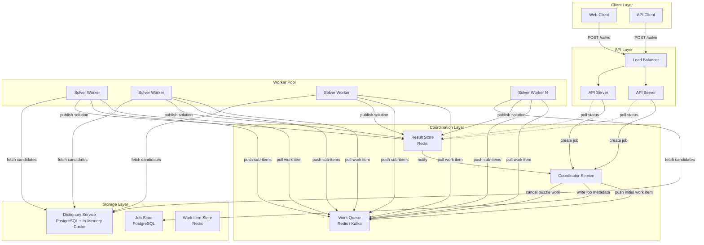

### The Work Item: The Key Data Structure

Every work item encodes a **snapshot of solver state** — enough for any stateless worker to resume:

```json
{
  "workItemId": "wi-abc123",
  "puzzleId": "pz-xyz789",
  "priority": 0.87,
  "partialAssignment": {
    "1-ACROSS": "APPLE",
    "3-DOWN":   "ALPHA"
  },
  "constraintState": {
    "2-ACROSS": ["BAT", "CAT", "HAT", "MAT"],
    "4-DOWN":   ["CREAM", "CRIMP", "CROAK"],
    "5-ACROSS": ["..."]
  },
  "remainingSlots": ["2-ACROSS", "4-DOWN", "5-ACROSS", "..."],
  "depth": 2,
  "ttl": 1708123456,
  "parentWorkItemId": "wi-root"
}
```

**Why encode full constraint state?**
Workers are **stateless**. They need everything to resume. Sending just the partial assignment would force each worker to re-run constraint propagation from scratch — expensive and wasteful. Encoding the already-pruned candidate lists means workers can jump straight to exploring, not re-deriving.

### Work Splitting: The Parallelism Engine

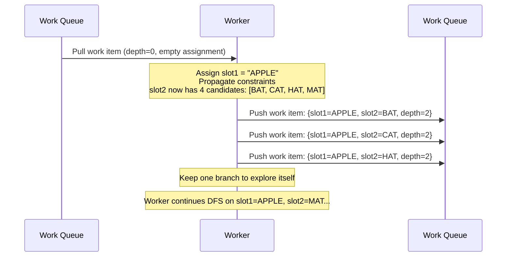

The rule: **a worker explores at most `SPLIT_THRESHOLD` levels of DFS, then splits remaining branches back to the queue**. This balances:
- Worker efficiency (don't split so aggressively that each item is 1 node)
- Parallelism (don't let one worker hold all the work)

A good `SPLIT_THRESHOLD` is **3–5 levels** — enough to propagate constraints meaningfully before splitting.

---

## 7. Core Component Deep Dives

### 7.1 Dictionary Service

The dictionary is read-heavy and changes infrequently. Design for fast candidate lookup.

**Data structures:**
- **Trie** (prefix tree): Supports pattern matching. `A??LE` → walk trie, wildcard = explore all children
- **By-length index**: `words_by_length[n]` → `list[str]`. Used to seed initial candidate lists.
- **Pattern bitmap index**: For each (position, letter) pair, a bitset of matching words. Constraint propagation = bitwise AND.

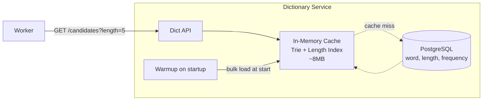

**Cache strategy**: The entire 1M-word dictionary fits in ~8MB of RAM. Load everything into memory at service startup. No per-request DB hits. Dictionary updates invalidate the in-memory cache and reload asynchronously (brief window of stale candidates is acceptable — worst case: a word appears that wasn't in the old dict or vice versa).

### 7.2 Coordinator Service

The coordinator is the **brains of the distributed solve**. It manages puzzle lifecycle.

**Responsibilities:**
1. Create puzzle job, assign jobId
2. Parse slots, fetch initial candidate lists from Dictionary Service
3. Push initial work item to queue
4. Monitor progress via heartbeats from workers
5. Detect completion (worker published a solution)
6. Cancel all remaining work items for a completed puzzle
7. Handle timeout: if no solution found in `MAX_SOLVE_TIME`, mark job as failed/partial

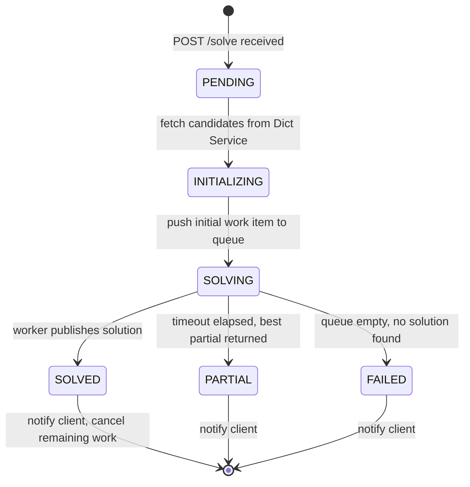

**Coordinator is NOT in the critical path of workers** — workers pull from the queue and push results directly. The coordinator only listens to result events. This keeps coordinator load low and avoids it being a bottleneck.

### 7.3 Solver Workers

Workers are the stateless computational workhorses.

**Worker lifecycle:**

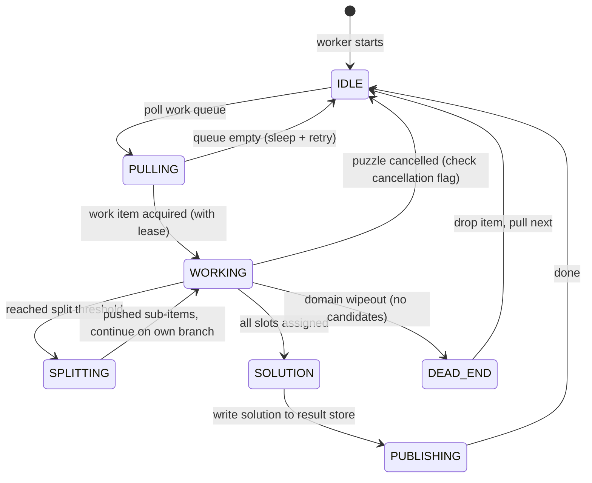

**Worker pseudocode:**

```python
def worker_loop():
    while True:
        item = queue.pull(timeout=5s)
        if item is None:
            sleep(1)
            continue

        if result_store.is_solved(item.puzzle_id):
            continue  # puzzle already solved by someone else, skip

        result = solve_from_item(item)

        if result == SOLUTION:
            result_store.publish_solution(item.puzzle_id, result)
        elif result == DEAD_END:
            pass  # just drop the item
        # sub-items are pushed inside solve_from_item when splitting

def solve_from_item(item):
    assignment = item.partial_assignment.copy()
    domains    = item.constraint_state.copy()
    depth      = 0

    while len(assignment) < total_slots:
        slot = mrv_slot(assignment, domains)

        if not domains[slot]:
            return DEAD_END

        word = domains[slot][0]
        assignment[slot] = word
        new_domains = propagate(slot, word, domains)

        depth += 1
        if depth == SPLIT_THRESHOLD:
            # Push siblings as new work items
            for alt_word in domains[slot][1:]:
                push_work_item(assignment_without(slot), domains, alt_word, slot)
            break  # continue on current branch (word = first candidate)

    return solve_dfs(assignment, domains)  # finish with DFS
```

### 7.4 Work Queue

The work queue is the spine of the distributed system.

| Property | Requirement | Implementation |
|---|---|---|
| At-least-once delivery | Workers must not drop items | Redis BRPOPLPUSH or Kafka consumer groups |
| Leasing | Work item locked to one worker at a time | Redis key expiry as lease timeout |
| Priority | More constrained (smaller search space) first | Redis sorted set (ZADD + ZPOPMAX) |
| Puzzle cancellation | Stop all items for a puzzle efficiently | Redis pub/sub cancel signal; workers check a "cancelled" key |
| Visibility timeout | If worker dies, item re-appears | SQS visibility timeout or manual re-queue after TTL |

**Why Redis over Kafka for work queue?**
Work items need **random deletion** (cancel all items for puzzle P), **priority ordering**, and **lease management**. These are natural for Redis sorted sets + hashes. Kafka is better for ordered event streams, not work-stealing queues.

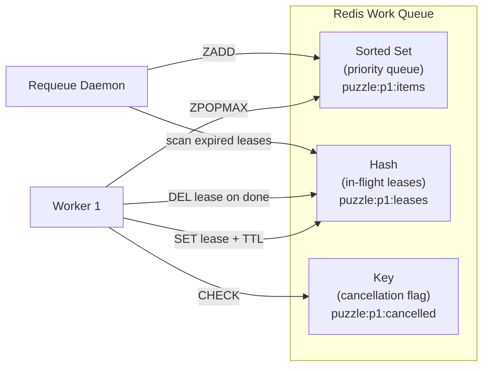

---

## 8. The Scaling Journey

### Stage 1: Monolith (0–100 req/day)

Everything in a single process. Good for prototyping.

```
┌─────────────────────────────────────────┐
│           Single Server                  │
│  ┌────────┐  ┌──────────┐  ┌─────────┐ │
│  │  API   │  │  Solver  │  │  Dict   │ │
│  │ (Flask)│  │ (Python) │  │(in-mem) │ │
│  └────────┘  └──────────┘  └─────────┘ │
└─────────────────────────────────────────┘
         ↕ SQLite / PostgreSQL
```

**Limit**: CPU-bound for hard puzzles. One slow solve blocks all others.

---

### Stage 2: Separate Workers (100–1,000 req/day)

Decouple API from compute. Workers run in separate processes.

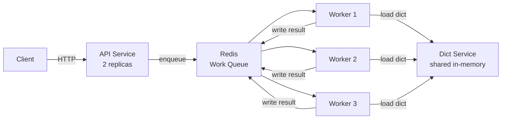

**Limit**: Dictionary loaded per-worker (wasteful), no smart work-splitting yet, one Redis is a SPOF.

---

### Stage 3: Smart Splitting + Shared Dictionary (1K–10K req/day)

Add the work-splitting algorithm, dedicated dictionary service, and result streaming.

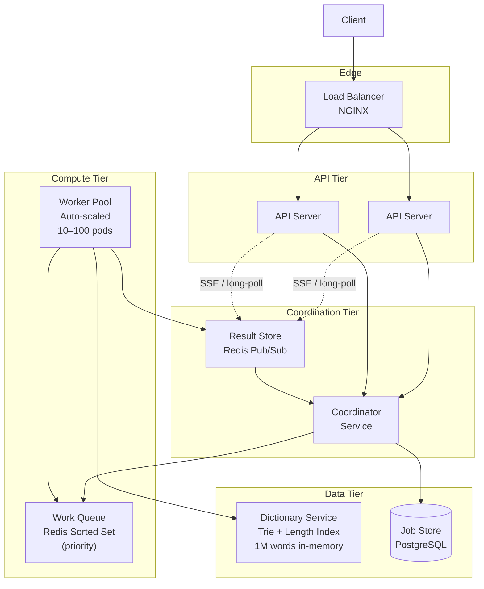

**New capabilities at this stage:**
- Workers split work items at `depth == 3`, pushing siblings back
- Result store uses pub/sub — coordinator and API are notified immediately on solve
- Auto-scaling: worker count scales with queue depth (Kubernetes HPA)
- Dictionary service serves candidates via gRPC; workers cache locally per-slot per-puzzle

---

### Stage 4: Enterprise Scale (10K+ req/day, Multi-Tenant SaaS)

Full enterprise architecture with multi-region, tenant isolation, and observability.

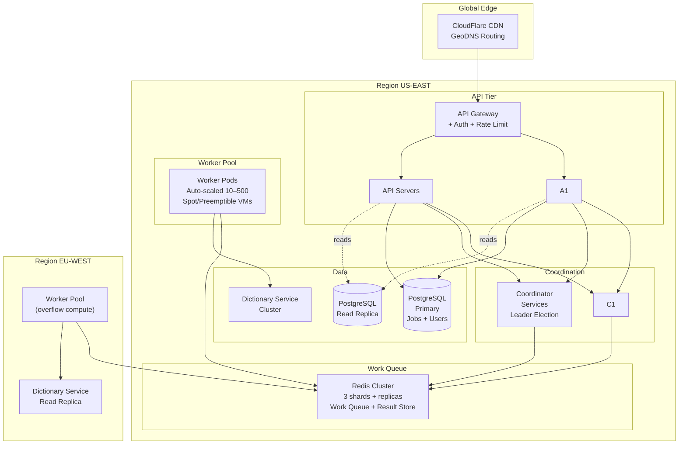

**Enterprise additions:**
- **Multi-region workers**: Hard puzzles can overflow work to a second region's workers
- **Tenant isolation**: Each tenant's work items carry a `tenantId`; high-priority tenants get a dedicated queue partition
- **Spot VMs**: Workers are stateless → perfect for spot/preemptible instances (70% cost savings)
- **Leader election**: Two coordinator replicas, one leader (Zookeeper / etcd-based), zero SPOF

---

## 9. Failure Modes & Resilience

### Request Flow with Failure Handling

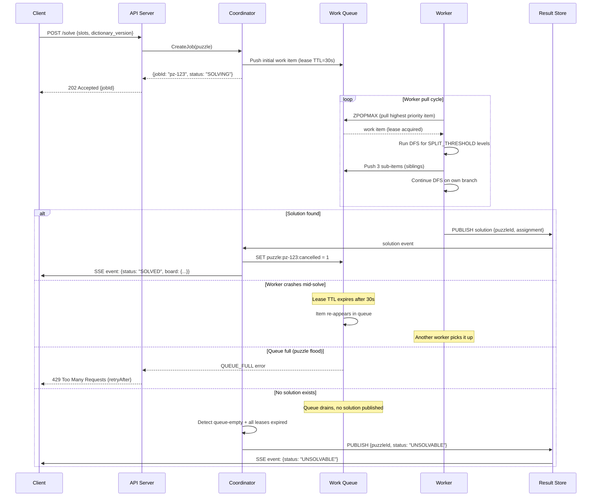

### Failure Scenarios and Mitigations

| Failure | Detection | Recovery |
|---|---|---|
| Worker pod crashes | Lease TTL expires (30s) | Work item re-queued automatically |
| Coordinator crashes | K8s liveness probe | Leader re-elected from replica; jobs reloaded from PostgreSQL |
| Redis OOM | Memory alerts, eviction policy | Bounded queue per puzzle; backpressure to API (429) |
| Dictionary service down | Worker health check fails | Workers use local in-process cache (stale but functional) |
| Runaway puzzle (unsolvable) | Max TTL on job (e.g., 120s) | Coordinator marks as TIMEOUT, returns best partial |
| Duplicate work items | Idempotency keys on result publish | Result store deduplicates with `SET NX` |
| Wrong solution published | Solution validator service | Re-validate against all constraints before writing to RS |

### Work Item Re-queue Logic (Critical)

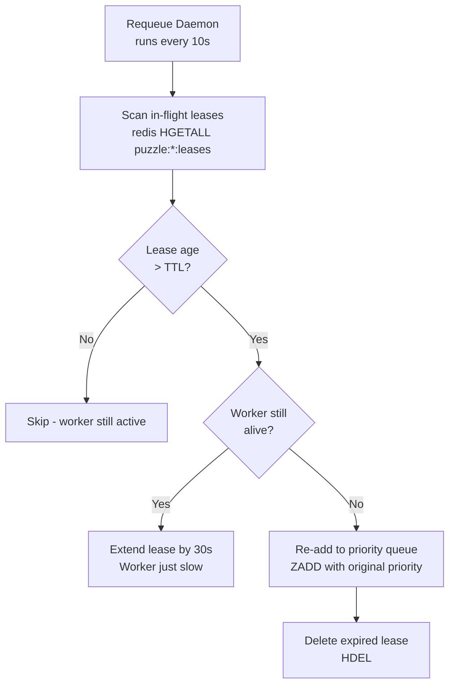

---

## 10. Data Model & Storage

### Job Store (PostgreSQL)

```sql
CREATE TABLE puzzle_jobs (
    job_id          UUID PRIMARY KEY,
    tenant_id       UUID NOT NULL,
    status          VARCHAR(20) NOT NULL,  -- PENDING, SOLVING, SOLVED, UNSOLVABLE, TIMEOUT
    puzzle_input    JSONB NOT NULL,         -- slot definitions
    dictionary_ver  INTEGER NOT NULL,
    solution        JSONB,                  -- filled when SOLVED
    partial_best    JSONB,                  -- best partial (for TIMEOUT)
    created_at      TIMESTAMPTZ DEFAULT NOW(),
    solved_at       TIMESTAMPTZ,
    ttl_seconds     INTEGER DEFAULT 120,
    INDEX idx_status_created (status, created_at),
    INDEX idx_tenant (tenant_id, created_at DESC)
);
```

### Work Item (Redis — ephemeral)

```
Key:   puzzle:{puzzleId}:items          (sorted set, score = priority)
Value: {workItemId} → serialized WorkItem (msgpack or protobuf)

Key:   puzzle:{puzzleId}:leases         (hash)
Field: {workItemId} → {workerId}:{expiresAt}

Key:   puzzle:{puzzleId}:cancelled      (string, TTL = job TTL)
Value: "1" (set when puzzle is solved or cancelled)

Key:   puzzle:{puzzleId}:result         (string)
Value: serialized Solution
```

### Dictionary Store (PostgreSQL + in-memory)

```sql
CREATE TABLE words (
    word        VARCHAR(50) PRIMARY KEY,
    length      SMALLINT NOT NULL,
    frequency   INTEGER DEFAULT 0,           -- word frequency for scoring
    version     INTEGER NOT NULL DEFAULT 1,  -- for cache invalidation
    INDEX idx_length (length),
    INDEX idx_version (version)
);
```

**Cache warm-up** at Dictionary Service startup:
```python
def warm_cache():
    rows = db.execute("SELECT word, length FROM words ORDER BY length, word")
    by_length = defaultdict(list)
    trie = Trie()
    for word, length in rows:
        by_length[length].append(word)
        trie.insert(word)
    return by_length, trie
```

---

## 11. Observability & Operations

### Key Metrics

**Work Queue Health:**
- `queue_depth{puzzle_id}` — items waiting; alerts if growing unbounded
- `lease_age_p99` — p99 age of in-flight items; high = workers are slow
- `requeue_rate` — items re-queued after lease expiry; high = worker instability

**Solver Performance:**
- `solve_latency_seconds{status}` — p50/p99 by outcome (SOLVED, UNSOLVABLE, TIMEOUT)
- `dead_end_rate` — fraction of work items ending in dead ends; high = poor splitting heuristic
- `nodes_per_second{worker_id}` — throughput per worker

**Business Metrics:**
- `jobs_per_minute{tenant}` — tenant usage tracking
- `unsolvable_rate` — fraction of puzzles with no solution (data quality issue?)
- `partial_solution_rate` — puzzles solved partially (quality signal)

### Distributed Tracing

Every work item carries a `traceId` (same as the `jobId`). When workers pull items, they propagate the trace context. This lets you see the full tree of work items for a puzzle in Jaeger/Zipkin:

```
Trace: pz-abc123
├── Coordinator.createJob           [2ms]
├── DictionaryService.fetchCandidates [45ms]
├── Worker-1.solveFromItem (depth=0) [3200ms]
│   ├── Worker-1.propagateConstraints  [12ms]
│   ├── Worker-2.solveFromItem (depth=3) [800ms]  ← split
│   │   └── DEAD_END
│   └── Worker-1.solveFromItem (depth=3) [2300ms] ← own branch
│       └── SOLUTION FOUND ✅
└── Coordinator.cancelPuzzleWork    [1ms]
```

---

## 12. Design Trade-offs

### Split Threshold: Depth vs. Breadth

| Threshold | Behavior | Trade-off |
|---|---|---|
| 1 (pure BFS) | Every node is a work item | Maximum parallelism, but massive queue overhead; can't benefit from local constraint propagation |
| 3–5 | Balanced | Worker does meaningful local work + propagation before splitting |
| ∞ (pure DFS) | One worker does everything | No parallelism; single worker holds all work |

**Recommended**: `SPLIT_THRESHOLD = 4`. Allows 3 rounds of AC-3 constraint propagation before splitting, dramatically reducing the size of sub-trees pushed to the queue.

### Work Item Size

As `partialAssignment` grows, work items grow (encoding candidate lists for remaining slots). At depth 50 of 100 slots, a work item could be ~25KB.

- **Option A**: Encode full constraint state (default — no re-computation)
- **Option B**: Encode only the partial assignment; workers re-derive constraints from scratch
  - Pro: smaller items, simpler code
  - Con: ~O(n²) wasted AC-3 re-computation per item

**Recommended**: Option A for puzzles < 100 slots. For larger puzzles, compress with zstd (5–10× ratio on repetitive word list data).

### Queue Backend: Redis vs. Kafka vs. SQS

| Backend | Pros | Cons | Best For |
|---|---|---|---|
| **Redis sorted set** | Microsecond enqueue/dequeue, priority, custom TTL, pub/sub | Memory-bound, no persistence guarantees | Default choice — fast and flexible |
| **Kafka** | Durable, replay, excellent monitoring | No built-in priority, complex consumer group management | When durability of in-flight work matters more than speed |
| **AWS SQS** | Fully managed, visibility timeout built-in, FIFO available | No priority, 256KB message limit, ~10ms latency | Good for cloud-native; if work items are small |

**Recommended**: Redis sorted set for latency-sensitive use (< 5ms enqueue), SQS for durability-first teams.

### When to Give Up: Timeout Strategy

Some crossword configurations have no solution (dictionary is missing a required word). The system must not run forever.

```
Job TTL = max(BASE_TTL, SLOTS_COUNT × PER_SLOT_TTL)
       = max(30s, 100 × 0.5s)
       = 80s

If queue drains and no solution:    → UNSOLVABLE
If TTL expires before queue drains: → TIMEOUT (return best partial)
```

---

## Summary: Interview Cheat Sheet

If asked to design this in an interview setting, structure your answer:

1. **Clarify**: ~50×50 grid, 100 slots, 1M dictionary, need first valid solution
2. **Algorithm first**: CSP backtracking with MRV + AC-3. This is the engine.
3. **Prove single machine fails**: Branching factor × depth = exponential. Hard puzzles = hours.
4. **The insight**: Turn recursive DFS into a work queue. Each work item = subtree root.
5. **Work splitting**: Workers explore N levels then push siblings back to queue.
6. **Components**: API → Coordinator → Work Queue (Redis) → Workers → Result Store
7. **Failure handling**: Lease TTL re-queues dead worker items. Cancel key stops orphaned work.
8. **Scale levers**: Worker pod count, split threshold, priority queue for MRV-guided work.
9. **Trade-off**: Statefulness of work items (encode constraint state vs. recompute).
10. **Don't forget**: Solution validation, dictionary caching, observability.

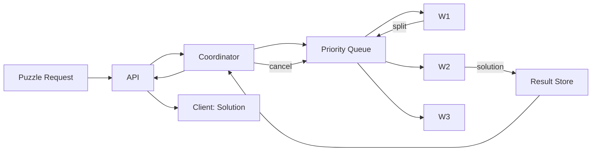

The crossword solver is a beautiful example of how a well-understood algorithm (backtracking CSP) becomes a distributed systems challenge at scale. The algorithm itself is not the hard part — **decomposing the search tree into independently executable work items, managing their lifecycle, and handling failures gracefully** is where the real engineering lives.

---

*Written as a reference for staff-level system design interviews. The patterns here — work queue-based search, stateless workers with lease management, and priority-driven decomposition — apply broadly to any distributed search or optimization problem.*
