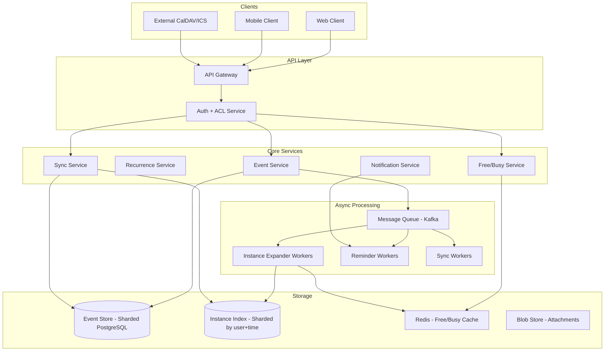
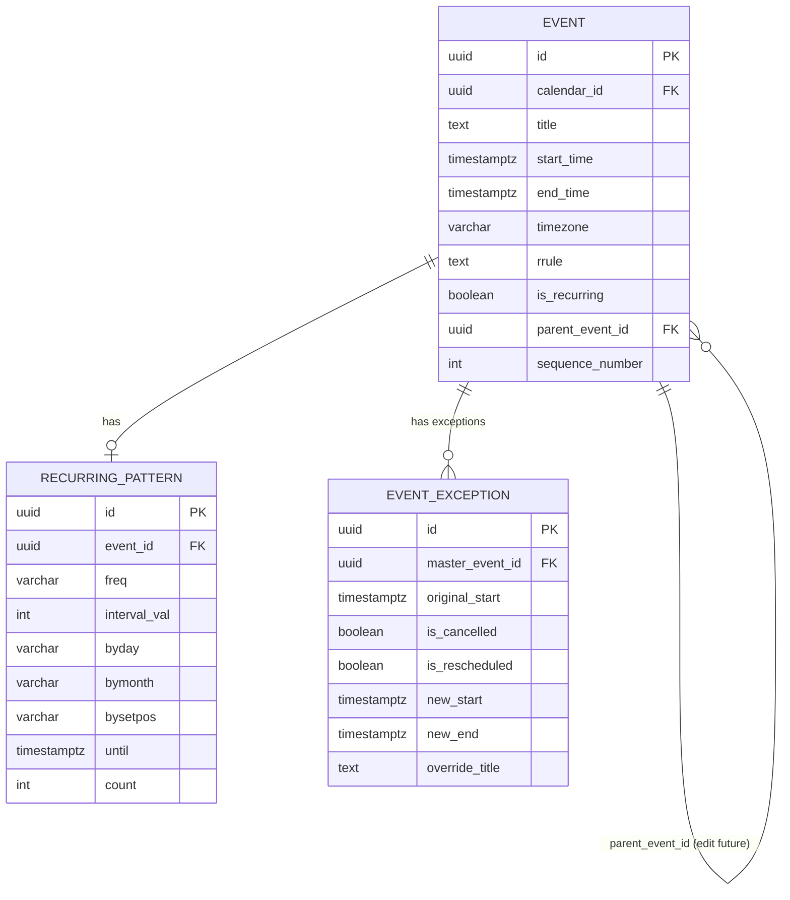
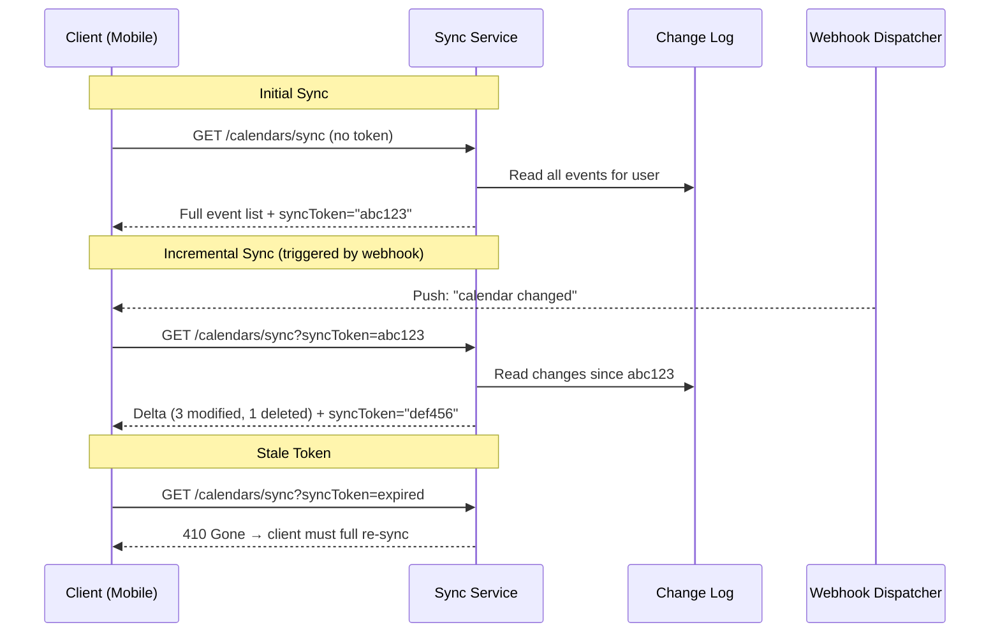
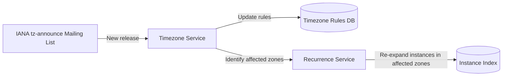
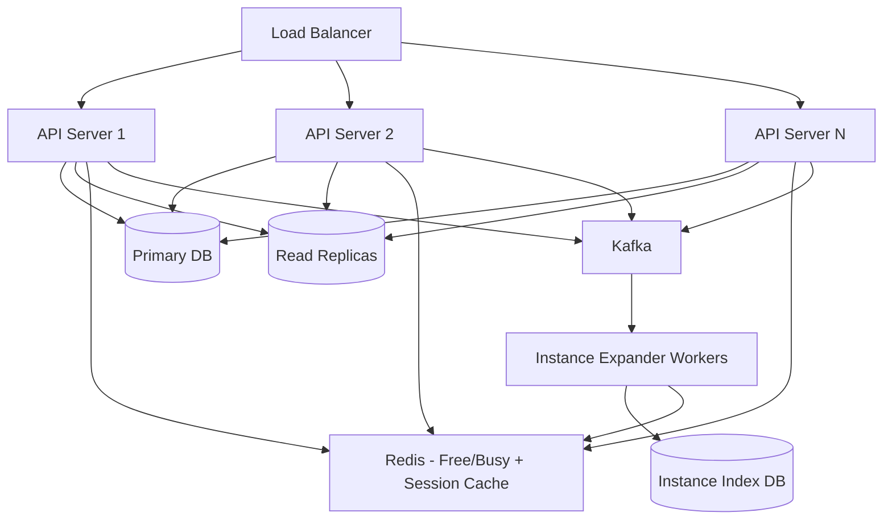
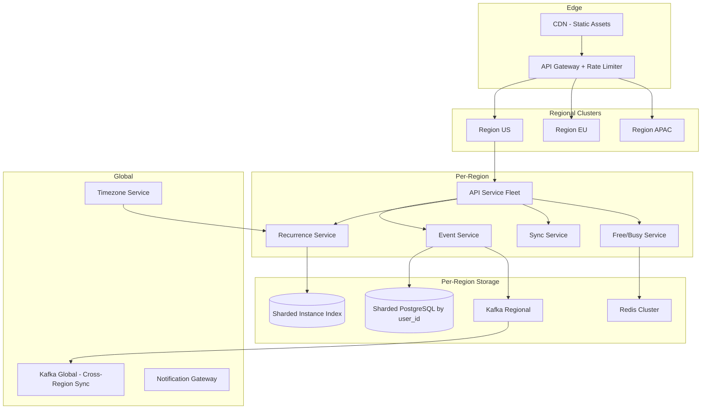
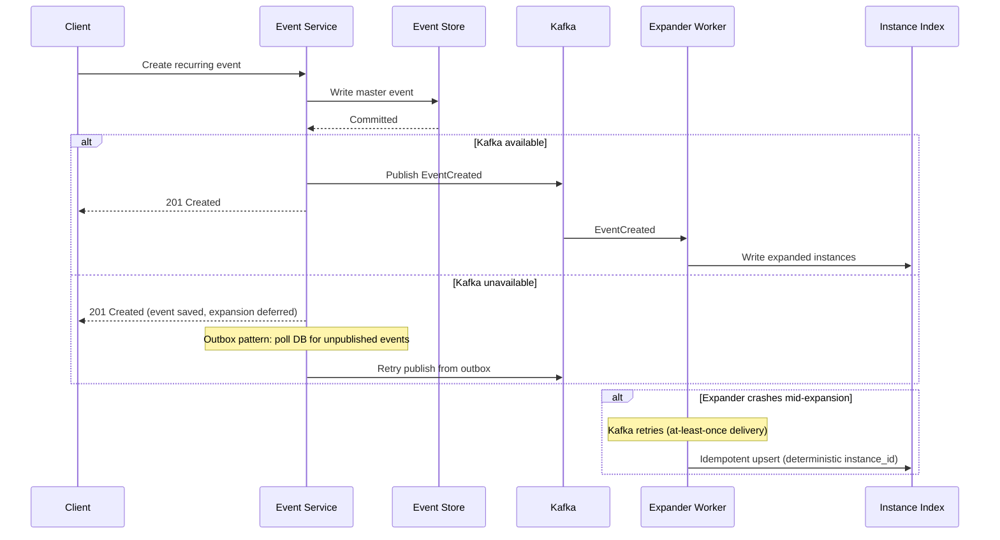

# System Design: Google Calendar

## A Staff Engineer's Guide to Designing a Calendar System at Scale

---

## Table of Contents

1. [The Problem & Why It's Hard](#1-the-problem--why-its-hard)
2. [Requirements & Scope](#2-requirements--scope)
3. [Single Machine / Naive Solution](#3-phase-1-single-machine-calendar)
4. [Why Naive Fails (The Math)](#4-why-the-naive-approach-fails-the-math)
5. [Distributed Architecture](#5-phase-2-distributed-architecture)
6. [Core Component Deep Dives](#6-core-component-deep-dives)
7. [The Scaling Journey](#7-the-scaling-journey)
8. [Failure Modes & Resilience](#8-failure-modes--resilience)
9. [Data Model & Storage](#9-data-model--storage)
10. [Observability & Operations](#10-observability--operations)
11. [Design Trade-offs](#11-design-trade-offs)
12. [Common Interview Mistakes](#12-common-interview-mistakes)
13. [Interview Cheat Sheet](#13-interview-cheat-sheet)

---

## 1. The Problem & Why It's Hard

"Design Google Calendar" sounds like a CRUD app with a nice UI. Create events, read events, update events, delete events. Maybe add some sharing. Ship it.

That instinct is the trap.

> **The interviewer's real question**: Can you design a system that handles recurring events across timezones, syncs across devices in near-real-time, prevents double-booking under concurrent load, and interoperates with external calendar protocols — all at the scale of billions of events?

The reason this problem is hard has nothing to do with storing an event. It has everything to do with what happens when a user creates a weekly meeting that repeats every Tuesday at 2 PM in `America/New_York`, then a participant in `Asia/Tokyo` modifies a single occurrence, and daylight saving time shifts all future instances by one hour — while three devices are offline and need to sync later.

> **Staff+ Signal:** The real challenge isn't the CRUD operations — it's that "show me all events between Monday and Friday" becomes computationally expensive when recurring events must be expanded on the fly, timezone rules mutate due to government decisions, and exceptions to recurring series create a branching tree of overrides. This is a temporal data management problem disguised as a productivity tool.

---

## 2. Requirements & Scope

### Functional Requirements

- **Create / edit / delete events** with title, description, time, location, and attendees
- **Recurring events** with support for complex patterns (every 2nd Tuesday, last Friday of the month, etc.)
- **Calendar sharing** with access control (view only, edit, manage)
- **Free/busy lookup** for scheduling across users
- **Reminders and notifications** (push, email, in-app)
- **Multi-device sync** with offline support
- **External calendar import/export** (iCalendar/ICS format)
- **RSVP and attendee management** for meetings

### Non-Functional Requirements

| Requirement | Target | Rationale |
|---|---|---|
| Latency (p99) | < 200ms for reads, < 500ms for writes | Calendar feels sluggish above 200ms for event listing |
| Throughput | 50K read req/s, 5K write req/s | Driven by scale estimation below |
| Availability | 99.99% (52 min downtime/year) | Calendar is critical infrastructure — missed meetings cost real money |
| Consistency | Strong consistency for writes, eventual for cross-device sync | Users must see their own writes immediately |
| Sync latency | < 5 seconds cross-device | Changes should propagate quickly to all devices |

### Scale Estimation (Back-of-Envelope)

```
Users:                  500M monthly active
Events per user:        ~30 per month (mix of one-off and recurring)
Total events created:   15B events/month = ~500M/day = ~6K writes/sec
Peak write rate:        ~30K writes/sec (5x during business hours)

Read pattern:           Each user checks calendar ~10 times/day
Total reads:            5B reads/day = ~58K reads/sec
Peak read rate:         ~200K reads/sec (Monday morning spike)

Recurring events:       ~40% of all events are recurring
Expansion factor:       Each recurring event generates ~52 instances/year (weekly)
Virtual instances:      For 6B recurring events → 312B virtual instances/year

Storage per event:      ~2 KB (metadata + description)
Base event storage:     15B × 2KB = 30 TB/month
Instance index:         312B × 100 bytes = 31 TB/year for precomputed index

Reminder fanout:        Each event averages 1.5 reminders
Reminder throughput:    ~9K reminder triggers/sec average, ~50K/sec peak
```

The key derived constraint: **we cannot expand all recurring events at query time**. With 312B virtual instances per year, the expansion must be precomputed or aggressively cached. This single number eliminates any architecture that relies on runtime RRULE evaluation for every read.

---

## 3. Phase 1: Single Machine Calendar

```
┌─────────────────────────────────────────────────┐
│                  Calendar Server                 │
│                                                  │
│  ┌───────────┐  ┌────────────┐  ┌────────────┐ │
│  │ REST API  │  │ RRULE      │  │ Reminder   │ │
│  │ Handler   │  │ Expander   │  │ Scheduler  │ │
│  └─────┬─────┘  └──────┬─────┘  └──────┬─────┘ │
│        │               │               │        │
│        └───────┬───────┘               │        │
│                │                       │        │
│         ┌──────▼──────┐        ┌───────▼──────┐ │
│         │ PostgreSQL  │        │    Cron Job   │ │
│         │  (events +  │        │  (scan for    │ │
│         │  instances) │        │   due alerts) │ │
│         └─────────────┘        └──────────────┘ │
└─────────────────────────────────────────────────┘
```

The minimal implementation stores events in a single PostgreSQL database. Recurring events store their RRULE pattern, and the server expands instances on every read request.

```python
def get_events(user_id, start, end):
    single_events = db.query(
        "SELECT * FROM events WHERE user_id = ? AND start_time >= ? AND end_time <= ? AND rrule IS NULL",
        user_id, start, end
    )

    recurring_masters = db.query(
        "SELECT * FROM events WHERE user_id = ? AND rrule IS NOT NULL AND recurring_start <= ?",
        user_id, end
    )

    expanded = []
    for master in recurring_masters:
        instances = expand_rrule(master.rrule, master.start, start, end)
        exceptions = get_exceptions(master.id, start, end)
        expanded.extend(apply_exceptions(instances, exceptions))

    return sorted(single_events + expanded, key=lambda e: e.start_time)
```

**When does Phase 1 work?** A single-user or small-team calendar (< 10K users). Desktop apps like Thunderbird/Lightning work exactly this way — expand locally from stored RRULE data.

**When does Phase 1 fail?** See next section.

---

## 4. Why the Naive Approach Fails (The Math)

The killer is the RRULE expansion on every read.

```
Average user:       30 events visible in a weekly view
Recurring events:   ~12 of those 30 come from recurring series
Expansion cost:     Each RRULE evaluation = ~0.5ms (parse + iterate)
Per-read cost:      12 × 0.5ms = 6ms just for RRULE expansion

At scale:
  200K reads/sec × 6ms RRULE compute = 1,200 CPU-seconds/sec
  → Need 1,200+ CPU cores just for RRULE expansion
```

But that's the average case. The worst case is far more brutal:

```
"Find next available slot" across 10 attendees:
  Each attendee: expand all recurring events for the next 30 days
  Average 20 recurring series × 30-day window = ~85 instances per attendee
  10 attendees × 85 instances × 0.5ms = 425ms just for expansion
  Then overlap detection: O(n²) comparison = another ~200ms
  Total: 625ms per free/busy query — and users expect < 200ms
```

| Bottleneck | Single Machine | Distributed Fix |
|---|---|---|
| RRULE expansion CPU | Blows up linearly with read traffic | Precomputed instance index |
| Free/busy query latency | O(attendees × recurring_events) | Materialized free/busy bitmap |
| Timezone recalculation | Must re-expand if tz rules change | Background re-expansion job |
| Reminder scheduling | Cron scan is O(all_events) every tick | Priority queue with next-fire index |
| Write contention | Single DB connection pool saturates at ~5K writes/sec | Sharded writes by user_id |

**The tipping point**: At roughly 100K concurrent users, the RRULE expansion CPU cost exceeds what a single beefy machine can provide, and the free/busy queries for scheduling meetings become unacceptably slow.

---

## 5. Phase 2+: Distributed Architecture

**The key architectural insight**: Separate event storage (the source of truth with RRULE rules) from event indexing (precomputed instances optimized for time-range queries), and maintain a materialized free/busy layer that can answer availability questions without expanding anything at read time.



### How Real Companies Built This

**Google Calendar** uses a hybrid storage approach: recurring events store the RRULE pattern as the source of truth, instances are precomputed for approximately the next year, and on-demand expansion handles queries beyond that window. Their sync protocol relies on opaque `syncToken` values — clients do an initial full sync, then use the token on subsequent requests to receive only deltas. Webhooks push notifications that "something changed," but Google explicitly warns that webhooks are not 100% reliable, so clients must implement periodic background sync as a safety net. Critically, Google does NOT use the iCalendar `EXDATE` field for cancelled recurring instances — instead, they create abbreviated event objects with `status: cancelled`, linked back to the parent via `recurringEventId` and `originalStartTime`.

**Microsoft Exchange** takes a different architectural approach: recurring event occurrences are stored not as database rows but as *attachments to a recurring master item*. This means you cannot query a date range with a simple `WHERE start BETWEEN x AND y` — you must use a special calendar view API that knows how to unpack these embedded instances. Exchange also stores all times internally in UTC but uses proprietary Windows timezone identifiers (like "Romance Standard Time" instead of `Europe/Paris`), creating interoperability headaches documented in Microsoft's own [MS-STANOICAL] deviation specification.

**Fastmail** is building on JMAP (RFC 8620 + RFC 8984), a modern JSON-based replacement for CalDAV. Their architecture uses `modseq` (modification sequence) counters per record for efficient change detection — instead of scanning all records, the client says "give me everything with modseq > 12345." They use shared workers for persistent EventSource connections (choosing shared workers over service workers due to iOS bugs with background network interception) and IndexedDB for local storage.

### Key Data Structure: The Event Instance Record

The critical data structure that makes the distributed architecture work is the precomputed instance record:

```json
{
  "instance_id": "evt_abc123_20260301T140000Z",
  "master_event_id": "evt_abc123",
  "user_id": "user_789",
  "calendar_id": "cal_456",
  "start_time": "2026-03-01T14:00:00Z",
  "end_time": "2026-03-01T15:00:00Z",
  "original_start_time": "2026-03-01T14:00:00Z",
  "timezone": "America/New_York",
  "is_exception": false,
  "exception_type": null,
  "sequence_number": 3,
  "last_modified": "2026-02-20T10:30:00Z"
}
```

The `instance_id` is deterministic (master_id + original_start_time in UTC), which makes it idempotent — re-expansion of the same RRULE produces the same instance IDs, so upserts are safe. The `sequence_number` tracks modification ordering for sync conflict resolution.

---

## 6. Core Component Deep Dives

### 6.1 Recurrence Service (The Hard Part)

**Responsibilities:**
- Parse RRULE strings per RFC 5545
- Expand instances for a given time window
- Apply exceptions (modified and cancelled instances) to the expanded set
- Re-expand affected instances when timezone rules change (IANA tz database update)

The recurrence service implements a three-table model:



The `parent_event_id` self-reference enables "edit all future events" — instead of creating thousands of exception records, we split the series: the original master gets an `UNTIL` date, and a new master starts from the split point with the modified properties. This is how Google Calendar handles the "this and following events" edit.

> **Staff+ Signal:** The `parent_event_id` approach is critical for the "edit all future events" operation. The naive implementation creates individual exception records for every future instance, which is O(n) in the number of remaining occurrences. Splitting the series is O(1) and preserves the ability to bulk-modify future instances. Square's engineering team built a custom RRULE library because existing libraries (like Ruby's `ice_cube`) couldn't handle the full RFC 5545 spec — specifically `BYSETPOS` rules that combine day-of-week with set position.

### 6.2 Sync Service

**Responsibilities:**
- Maintain per-client sync tokens (opaque cursors into the change log)
- Compute deltas between client state and server state
- Handle conflict resolution when the same event is modified on multiple devices
- Issue webhook notifications when events change
- Gracefully handle stale tokens (HTTP 410 → full re-sync)



> **Staff+ Signal:** Webhooks are unreliable by design — Google's own documentation warns that push notifications are best-effort and applications must implement periodic background sync as a safety net. The sync service should treat webhooks as an optimization (reducing polling frequency) rather than a guarantee. In production, budget for ~1-2% of changes being detected only by background sync.

### 6.3 Free/Busy Service

**Responsibilities:**
- Maintain a materialized free/busy bitmap per user
- Answer availability queries in O(1) without expanding recurring events
- Support multi-user availability intersection for meeting scheduling

The free/busy bitmap divides each day into 15-minute slots (96 slots per day). Each slot is a 2-bit value: `00` = free, `01` = tentative, `10` = busy, `11` = out-of-office.

```
User alice@company.com, 2026-03-01:
Slot:   0  1  2  ... 36 37 38 39 40 41 42 43 ... 95
Time: 0:00           9:00          10:00       23:45
Value:  00 00 00 ... 10 10 10 10 00 00 10 10 ... 00
                     └──busy──┘        └busy┘
```

One day = 96 slots × 2 bits = 192 bits = 24 bytes. One year = 24 × 365 = 8.76 KB per user. For 500M users: **4.38 TB** — fits in a Redis cluster.

Multi-user availability query is a bitwise OR across all participants' bitmaps, producing a merged busy map in microseconds regardless of how many recurring events each person has.

> **Staff+ Signal:** The free/busy bitmap is a write-heavy, read-must-be-fast data structure. Every event create/update/delete must update the bitmap. But the bitmap never needs to be "correct" in real-time — it can lag by a few seconds. This means we can update it asynchronously from the Kafka event stream, accepting brief inconsistency in exchange for write path simplicity. The only invariant we need is that the bitmap is *eventually* consistent and that it never shows a busy slot as free (false negatives are acceptable; false positives are not).

### 6.4 Timezone Service

**Responsibilities:**
- Map IANA timezone identifiers to UTC offsets for any point in time
- Map Windows timezone identifiers to IANA (for Exchange interop) via CLDR mapping
- Detect when the IANA timezone database is updated and trigger re-expansion of affected recurring events
- Handle edge cases: 23/25-hour days, :30/:45 offsets, abolished timezones



The IANA timezone database is updated 3-21 times per year, often with short notice. In 2023, Lebanon reversed a DST decision 4 days before implementation. Chile's Aysén region created a new timezone entry (`America/Punta_Arenas`) that caused Google Calendar to display incorrect event times after April 5, 2025. A staff engineer treats timezone updates as an operational responsibility with a tested rollout procedure, not a "set it and forget it" configuration.

---

## 7. The Scaling Journey

### Stage 1: Startup (0–100K users)

```
┌──────────┐     ┌───────────────┐     ┌───────────┐
│  Web App │────▶│  Monolith API │────▶│PostgreSQL │
│          │     │  + RRULE lib  │     │ (single)  │
└──────────┘     └───────────────┘     └───────────┘
```

Single PostgreSQL instance. RRULE expansion in the API server. Reminders via a cron job polling for due notifications. CalDAV support through a library like sabre/dav.

**Limit**: At ~100K users, the RRULE expansion CPU cost during peak read times (Monday morning) saturates the API servers. Free/busy queries for rooms with 50+ attendees take > 1 second.

### Stage 2: Growth (100K–10M users)



**New capabilities at this stage:**
- Precomputed instance index eliminates runtime RRULE expansion for reads
- Free/busy bitmap in Redis serves availability queries in < 5ms
- Kafka decouples event writes from instance expansion (async)
- Read replicas handle the 10:1 read-to-write ratio

**Limit**: PostgreSQL primary becomes a write bottleneck at ~10M users. Cross-user queries (shared calendars, org-wide room booking) create hot partitions.

### Stage 3: Scale (10M–500M users)



**New capabilities at this stage:**
- Database sharded by `user_id` (consistent hashing with virtual nodes)
- Regional deployment for latency (user data lives in their nearest region)
- Global Kafka for cross-region sync (shared calendars across regions)
- Dedicated timezone service subscribed to IANA updates

**Limit**: Cross-region shared calendars introduce distributed consistency challenges. A meeting invite from US to EU must be visible to both within the sync SLA.

> **Staff+ Signal:** At this scale, the system decomposes along organizational boundaries. The Event Service, Recurrence Service, and Sync Service are each owned by separate teams with independent deployment cycles. The Kafka topics between them are the API contracts. Conway's Law is your friend here — align service boundaries with team boundaries. The Free/Busy service can be owned by the team that also owns room booking, since they share the same availability data model.

---

## 8. Failure Modes & Resilience

### Request Flow with Failure Handling



### Failure Scenarios

| Failure | Detection | Recovery | Blast Radius |
|---|---|---|---|
| Instance expander crash | Kafka consumer lag alert | Kafka redelivers message; idempotent upsert | Delayed instance availability (~seconds) |
| Instance index DB down | Health probe + read errors | Fall back to runtime RRULE expansion (degraded perf) | Slower reads for affected shard |
| Free/busy cache loss | Redis cluster monitoring | Re-warm from instance index (background job) | Inaccurate availability for ~minutes |
| Timezone service stale | Version check vs. IANA release list | Alert on-call; manual tz database update | Incorrect times for affected zones |
| Sync token corruption | Client receives 410 Gone | Full re-sync (expensive but correct) | One user's sync resets |
| Cross-region Kafka lag | Consumer lag > threshold | Events visible in source region immediately; destination lags | Shared calendar updates delayed |
| Double-booking race | Optimistic lock conflict on free/busy bitmap | Retry with fresh bitmap; reject if truly conflicting | Single booking attempt fails |

> **Staff+ Signal:** The most insidious failure mode is a timezone database update that isn't propagated. Unlike a crash (which is noisy and obvious), a stale timezone database causes events to silently display at wrong times — users see the wrong hour but the system reports no errors. Microsoft's Exchange ActiveSync DST bug in 2014 demonstrated this exactly: recurring meetings shifted by one hour on all ActiveSync devices because the timezone metadata wasn't adjusted at the protocol layer. Detection requires proactive monitoring: compare your deployed tz database version against the latest IANA release, and alert if they diverge for more than 24 hours.

### Graceful Degradation Strategy

| Severity | What breaks | User experience | System response |
|---|---|---|---|
| **S1**: Instance index down | Can't serve precomputed instances | Slower calendar load (~500ms instead of ~100ms) | Fall back to runtime RRULE expansion; auto-healing when index recovers |
| **S2**: Free/busy cache cold | Availability queries slow | "Checking availability..." spinner (2-3s instead of <100ms) | Re-warm cache from instance index; serve stale data if available |
| **S3**: Kafka backlog | Instance expansion delayed | New recurring events show only the first instance until expansion catches up | Prioritize expansion by event start proximity (expand tomorrow's events before next year's) |
| **S4**: Cross-region sync lag | Shared calendar updates delayed | Invite appears in sender's calendar immediately, recipient sees it 30s-2min later | Display "syncing..." indicator; allow manual refresh |

---

## 9. Data Model & Storage

### Core Schema

```sql
CREATE TABLE calendars (
    id              UUID PRIMARY KEY DEFAULT gen_random_uuid(),
    owner_id        UUID NOT NULL,
    name            VARCHAR(255) NOT NULL,
    timezone        VARCHAR(64) NOT NULL DEFAULT 'UTC',
    color           VARCHAR(7),
    is_primary      BOOLEAN DEFAULT FALSE,
    created_at      TIMESTAMPTZ DEFAULT NOW(),
    updated_at      TIMESTAMPTZ DEFAULT NOW()
);

CREATE TABLE events (
    id              UUID PRIMARY KEY DEFAULT gen_random_uuid(),
    calendar_id     UUID NOT NULL REFERENCES calendars(id),
    title           VARCHAR(500) NOT NULL,
    description     TEXT,
    location        TEXT,
    start_time      TIMESTAMPTZ NOT NULL,
    end_time        TIMESTAMPTZ NOT NULL,
    timezone        VARCHAR(64) NOT NULL,
    is_all_day      BOOLEAN DEFAULT FALSE,
    is_recurring    BOOLEAN DEFAULT FALSE,
    rrule           TEXT,
    parent_event_id UUID REFERENCES events(id),
    status          VARCHAR(20) DEFAULT 'confirmed',
    sequence_num    INT DEFAULT 0,
    organizer_id    UUID NOT NULL,
    visibility      VARCHAR(20) DEFAULT 'default',
    created_at      TIMESTAMPTZ DEFAULT NOW(),
    updated_at      TIMESTAMPTZ DEFAULT NOW()
);

CREATE TABLE event_instances (
    instance_id     VARCHAR(255) PRIMARY KEY,
    master_event_id UUID NOT NULL REFERENCES events(id),
    calendar_id     UUID NOT NULL,
    start_time      TIMESTAMPTZ NOT NULL,
    end_time        TIMESTAMPTZ NOT NULL,
    original_start  TIMESTAMPTZ NOT NULL,
    is_exception    BOOLEAN DEFAULT FALSE,
    is_cancelled    BOOLEAN DEFAULT FALSE,
    override_data   JSONB,
    sequence_num    INT DEFAULT 0,
    created_at      TIMESTAMPTZ DEFAULT NOW()
);

CREATE TABLE event_attendees (
    event_id        UUID NOT NULL REFERENCES events(id),
    user_id         UUID NOT NULL,
    email           VARCHAR(255) NOT NULL,
    response_status VARCHAR(20) DEFAULT 'needsAction',
    is_organizer    BOOLEAN DEFAULT FALSE,
    PRIMARY KEY (event_id, user_id)
);

CREATE TABLE calendar_acl (
    calendar_id     UUID NOT NULL REFERENCES calendars(id),
    grantee_id      UUID NOT NULL,
    grantee_type    VARCHAR(20) NOT NULL,
    role            VARCHAR(20) NOT NULL,
    PRIMARY KEY (calendar_id, grantee_id)
);

CREATE TABLE sync_tokens (
    user_id         UUID NOT NULL,
    client_id       VARCHAR(255) NOT NULL,
    token           VARCHAR(255) NOT NULL,
    last_sync_at    TIMESTAMPTZ NOT NULL,
    PRIMARY KEY (user_id, client_id)
);
```

### Critical Indexes

```sql
CREATE INDEX idx_events_calendar_time ON events (calendar_id, start_time, end_time);

CREATE INDEX idx_instances_calendar_time ON event_instances (calendar_id, start_time, end_time);

CREATE INDEX idx_instances_master ON event_instances (master_event_id);

CREATE INDEX idx_instances_time_range ON event_instances
    USING GIST (tstzrange(start_time, end_time));

CREATE INDEX idx_attendees_user ON event_attendees (user_id, response_status);
```

> **Staff+ Signal:** The GiST index on `tstzrange(start_time, end_time)` is essential for overlap detection. The naive approach — `WHERE start_time < @end AND end_time > @start` — works but performs a range scan. The GiST index converts overlap queries to logarithmic performance, which matters when checking a meeting room's availability against thousands of existing events. PostgreSQL's `OVERLAPS` operator, surprisingly, does NOT use indexes — you must use `&&` with the `tstzrange` type.

### Storage Engine Choice

| Engine | Use Case | Why |
|---|---|---|
| PostgreSQL (sharded) | Event store, calendar metadata, ACLs | ACID guarantees for event creation, strong consistency for user's own writes, JOIN support for ACL checks |
| PostgreSQL (sharded) | Instance index | Range queries on time columns, GiST indexes for overlap detection, bulk upsert for re-expansion |
| Redis Cluster | Free/busy bitmaps, sync token cache | Sub-millisecond reads for availability queries, TTL-based expiry for stale sync tokens |
| Kafka | Event bus (EventCreated, EventUpdated, etc.) | Durable, ordered event stream for async processing; replay capability for re-expansion jobs |
| Blob storage (S3) | Event attachments, ICS export files | Cost-effective for large binary data; CDN-friendly |

### Sharding Strategy

Shard by `user_id` (consistent hashing). This keeps all of a user's calendars and events on the same shard, ensuring single-shard reads for the common case (viewing your own calendar).

The exception is **shared calendars and meeting rooms**: a conference room calendar has events from many users across many shards. Solution: room calendars live on a dedicated shard set, and meeting invites are replicated to attendees' shards as fan-out writes.

---

## 10. Observability & Operations

### Key Metrics

- `calendar.event_writes{type=single|recurring}` — write throughput; sudden drops indicate write path issues
- `calendar.instance_expansion_lag_seconds` — time between event creation and instance index update; > 30s triggers investigation
- `calendar.freebusy_query_latency_p99` — availability query latency; > 100ms indicates cache miss or bitmap staleness
- `calendar.sync_full_resync_rate` — percentage of syncs that trigger full re-sync (410 Gone); > 5% indicates token TTL or storage issues
- `calendar.rrule_expansion_fallback_rate` — percentage of reads falling back to runtime expansion (instance index miss); > 1% indicates expander lag
- `calendar.tz_database_version_drift` — difference between deployed and latest IANA tz version; > 0 for > 24h is P2

### Distributed Tracing

A typical "create recurring event" trace:

```
[API Gateway]  ─── 2ms ───▶ [Event Service: validate + write] ─── 15ms
                                    │
                                    ├──▶ [PostgreSQL: INSERT event] ─── 8ms
                                    │
                                    ├──▶ [Kafka: publish EventCreated] ─── 3ms
                                    │
                                    └──▶ [Response to client] ─── 1ms
                                                    ...async...
[Expander Worker: consume message] ─── 5ms
    │
    ├──▶ [RRULE expand 52 instances] ─── 12ms
    │
    ├──▶ [Instance Index: batch upsert] ─── 20ms
    │
    └──▶ [Redis: update free/busy bitmap] ─── 2ms

Total synchronous latency: ~29ms
Total async expansion: ~39ms
End-to-end: ~68ms
```

### Alerting Strategy

| Alert | Condition | Severity | Action |
|---|---|---|---|
| Expansion lag critical | Consumer lag > 60s for 5min | P1 | Page on-call; check expander worker health and Kafka partition assignment |
| Free/busy cache miss spike | Fallback rate > 10% for 10min | P2 | Investigate Redis cluster; trigger cache re-warm job |
| Timezone database stale | Drift > 0 for > 24 hours | P2 | Verify IANA release; deploy updated tz package; trigger re-expansion for affected zones |
| Full re-sync spike | Rate > 10% for 15min | P2 | Check sync token storage (Redis); verify token generation logic |
| Write error rate | > 1% 5xx for 5min | P1 | Page on-call; check PostgreSQL primary health, connection pool, disk space |
| Cross-region sync delay | Lag > 5min for 10min | P2 | Check global Kafka cluster; verify regional connectivity |

---

## 11. Design Trade-offs

| Decision | Option A | Option B | Recommended | Why |
|---|---|---|---|---|
| Recurring event storage | Store individual instances | Hybrid: RRULE + precomputed index | **Hybrid** | Individual instances can't represent infinite series and are expensive to update. Pure RRULE is too CPU-intensive at read time. The hybrid gives O(1) reads and O(1) storage for the rule. Google, Microsoft, and Nylas all use this approach. |
| Sync protocol | CalDAV (RFC 4791) | JMAP (RFC 8984) | **CalDAV for interop, proprietary for primary** | CalDAV is battle-tested with universal client support but is WebDAV-based (verbose XML, PROPFIND-heavy). A modern system should expose CalDAV for external clients while using a lighter proprietary sync protocol (like Google's syncToken approach) for first-party clients. JMAP is promising but has limited client adoption. |
| Free/busy representation | Per-event query at read time | Materialized bitmap | **Bitmap** | 24 bytes/day/user is trivial storage. Bitmap OR across N participants is microseconds. The write cost (update bitmap on every event change) is acceptable given async processing. |
| Conflict resolution | Last-write-wins | Server-authoritative with sequence numbers | **Sequence numbers** | LWW loses edits silently. Sequence numbers allow the server to detect conflicts and surface them to the client. Google's approach: server always wins, client re-syncs. For calendar data, this is acceptable — lost edits are rare and the damage is low (worst case: a meeting title reverts). |
| Timezone storage | Store UTC offset | Store IANA timezone identifier | **IANA identifier** | UTC offsets are wrong for recurring events. A weekly meeting at 2 PM New York time is UTC-5 in winter and UTC-4 in summer. The offset changes across the series. Store the IANA identifier and recalculate UTC offsets from the tz database. |
| Reminder delivery | Poll-based (cron) | Priority queue with next-fire index | **Priority queue** | Cron polling is O(all_events) on every tick. A priority queue sorted by next reminder time gives O(1) for the next due reminder and O(log n) for insertion. At 500M users with 1.5 reminders per event, polling is unacceptable. |

> **Staff+ Signal:** The CalDAV-vs-proprietary decision is a two-way door with organizational implications. CalDAV interop is necessary for enterprise customers who use third-party calendar clients, but CalDAV's PROPFIND semantics are expensive (they fetch full event data even when only checking if something changed). The pragmatic answer: support CalDAV on a separate gateway optimized for its access patterns, and invest engineering effort in the proprietary sync protocol for the 95% of traffic coming from first-party clients. This way, the CalDAV team doesn't slow down the core sync team.

---

## 12. Common Interview Mistakes

1. **Treating it as a CRUD app**: Candidates jump straight to "events table with REST endpoints" and miss the recurring event expansion, timezone, and sync challenges. **What staff+ candidates say instead**: "Before drawing any architecture, let me identify the hard parts — recurring events, timezone handling, and multi-device sync are where the real complexity lives."

2. **Storing expanded instances for all recurring events**: "I'll just create a row for every Tuesday for the next 10 years." This produces billions of rows, makes "edit all future events" an O(n) operation, and can't represent "every Tuesday forever." **What staff+ candidates say instead**: "I'd use a hybrid model — store the RRULE as source of truth and precompute instances for a rolling window."

3. **Ignoring timezones or storing UTC offsets**: "I'll store everything in UTC." Correct for single events, wrong for recurring events. A weekly meeting at 2 PM Eastern is at a different UTC offset after DST transitions. **What staff+ candidates say instead**: "I need to store the IANA timezone identifier alongside UTC times, because the UTC offset changes across a recurring series during DST transitions."

4. **Free/busy as a real-time query**: "To find availability, I'll query all events for each attendee." At 10 attendees with 20 recurring series each, this requires expanding 200 RRULE patterns per query. **What staff+ candidates say instead**: "I'd maintain a materialized free/busy bitmap — 24 bytes per day per user — so availability queries are a bitwise OR, not a database scan."

5. **Assuming sync is simple**: "Clients just poll the server." Polling doesn't scale (500M users × 10 polls/day = 58K requests/sec of pure waste). Push-only misses changes. **What staff+ candidates say instead**: "I'd use a webhook-plus-syncToken pattern — push notifications trigger incremental sync via opaque tokens, with periodic background sync as a safety net."

6. **Forgetting the interoperability requirement**: Calendar systems don't exist in isolation. Users import `.ics` files, connect to Exchange, and use CalDAV clients. **What staff+ candidates say instead**: "The system needs a protocol gateway — CalDAV for standards compliance, ICS import/export for data portability, and a Windows-to-IANA timezone mapping layer for Exchange interop."

7. **No failure handling for the expansion pipeline**: "Events go in, instances come out." But what if the expander crashes mid-expansion? What if Kafka loses messages? **What staff+ candidates say instead**: "The instance IDs are deterministic, so re-expansion is idempotent. I'd use Kafka's at-least-once delivery with idempotent upserts to the instance index."

---

## 13. Interview Cheat Sheet

### Time Allocation (45-minute interview)

| Phase | Time | What to Cover |
|---|---|---|
| Clarify requirements | 5 min | Recurring events? Sharing/ACL? Scale (users, events)? CalDAV interop? |
| High-level design | 10 min | Event store, instance index, free/busy cache, sync protocol, notification pipeline |
| Deep dive #1 | 10 min | Recurring events: RRULE storage, hybrid expansion, exception model, series splitting |
| Deep dive #2 | 8 min | Sync: syncToken pattern, webhook + periodic sync, conflict resolution |
| Failure modes + scaling | 7 min | Timezone propagation, expansion pipeline resilience, sharding strategy |
| Trade-offs + wrap-up | 5 min | CalDAV vs. proprietary, bitmap vs. query, consistency vs. availability for shared calendars |

### Step-by-Step Answer Guide

1. **Clarify**: "How complex are recurring events? Do we need full RFC 5545 RRULE support or just basic weekly/monthly? What's our scale target — consumer (billions of users) or enterprise (millions of organizations)?"

2. **The key insight**: "Calendar looks like CRUD but it's really a temporal data management problem. The three hard parts are: recurring event expansion, timezone handling, and multi-device sync."

3. **Simple version**: "On a single machine, I'd store events in PostgreSQL with RRULE strings and expand at read time. This works up to ~100K users."

4. **Break it**: "At 200K reads/sec, RRULE expansion alone needs 1,200 CPU cores. Free/busy queries for 10 attendees take 600ms. We need precomputation."

5. **Distributed architecture**: "Separate the event store (source of truth) from the instance index (precomputed for reads) and the free/busy cache (materialized bitmap). Kafka connects them asynchronously."

6. **Recurring event model**: "Three tables: events (master), recurring_patterns (RRULE fields), event_exceptions (cancelled/modified instances). 'Edit future events' splits the series using parent_event_id."

7. **Sync protocol**: "SyncToken + webhooks. Full sync establishes baseline, incremental sync fetches deltas. 410 Gone forces re-sync. Background polling as safety net."

8. **Failure handling**: "Deterministic instance IDs make re-expansion idempotent. Outbox pattern for Kafka unavailability. Fallback to runtime expansion if instance index is down."

9. **Scale levers**: "Shard by user_id. Regional deployment. Dedicated shard set for room calendars. Rolling expansion window (precompute 1 year, expand on-demand beyond that)."

10. **Timezone operations**: "Store IANA identifier, not UTC offset. Subscribe to IANA tz-announce. Re-expand affected recurring events when rules change. This is an ongoing operational responsibility, not a one-time setup."

### What the Interviewer Wants to Hear

- At **L5/Senior**: Functional event CRUD, basic recurring events, simple database schema, awareness of timezone challenges, read replicas for scaling reads.

- At **L6/Staff**: Hybrid RRULE storage model, free/busy bitmap optimization, syncToken-based incremental sync, IANA timezone operational strategy, failure modes in the expansion pipeline, sharding strategy with cross-shard shared calendar handling.

- At **L7/Principal**: CalDAV/JMAP protocol strategy and interop gateway, Conway's Law alignment of service boundaries, multi-region architecture with cross-region consistency model for shared calendars, timezone database as a supply chain dependency, migration path from monolith to distributed (can we ship Phase 1 in 2 weeks and evolve?).

### My Take (Michi Meow)

Calendar system design is one of my favorite interview questions because it's the perfect senior-vs-staff filter. Senior candidates design a good event storage system. Staff candidates immediately recognize that the real problems are temporal: recurring events that expand differently depending on timezone rules that are controlled by governments and updated unpredictably.

The production evidence backs this up. Google precomputes instances for ~1 year. Microsoft stores occurrences as attachments to a master record. Square built a custom RRULE library because existing ones couldn't handle the full RFC 5545 spec. Fastmail is investing in JMAP because CalDAV's verbosity doesn't scale to mobile. Every company that's built a calendar system at scale has a war story about timezone bugs — from Exchange's ActiveSync DST failure in 2014 to Google Calendar's Chile timezone incident in 2025.

If you remember one thing from this post: **a calendar is not a list of events. It's a materialized view over an unbounded set of temporal rules, projected through timezone transformations that change without your consent.**

*Written as a reference for staff-level system design interviews.*
