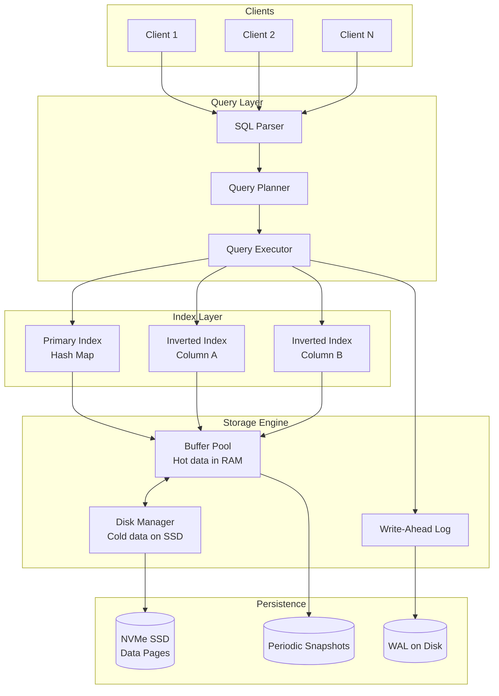
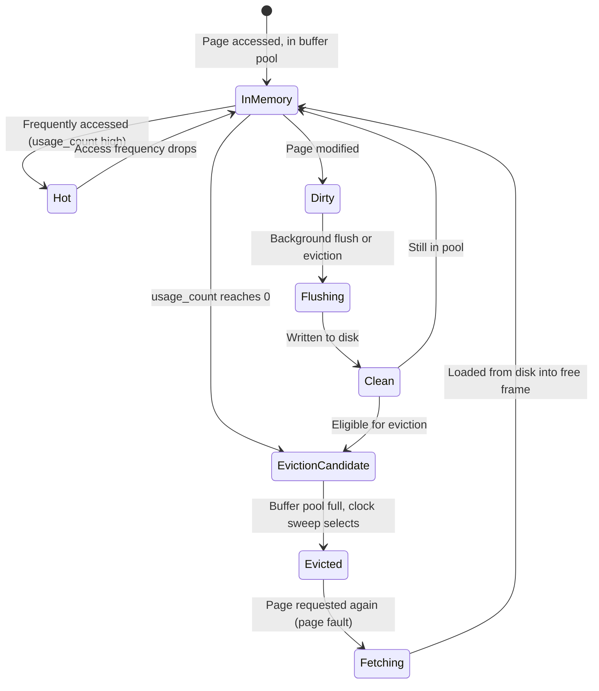
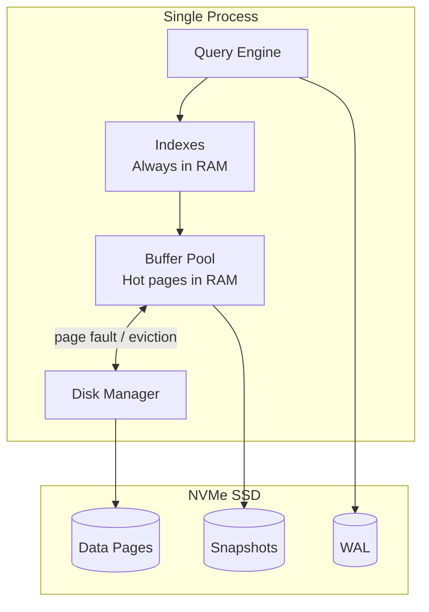
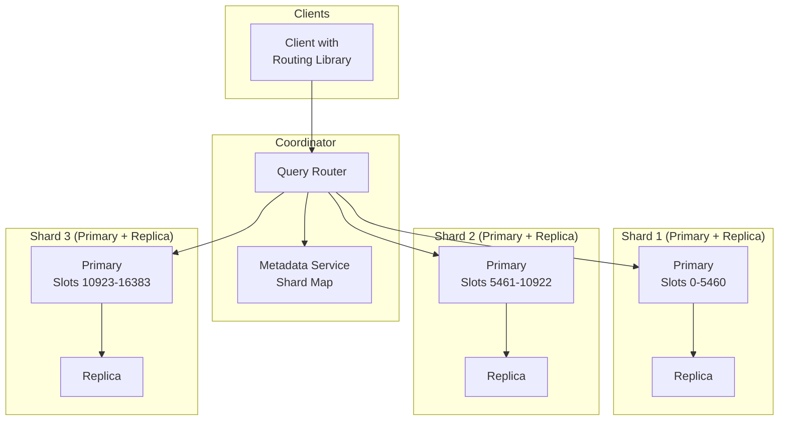
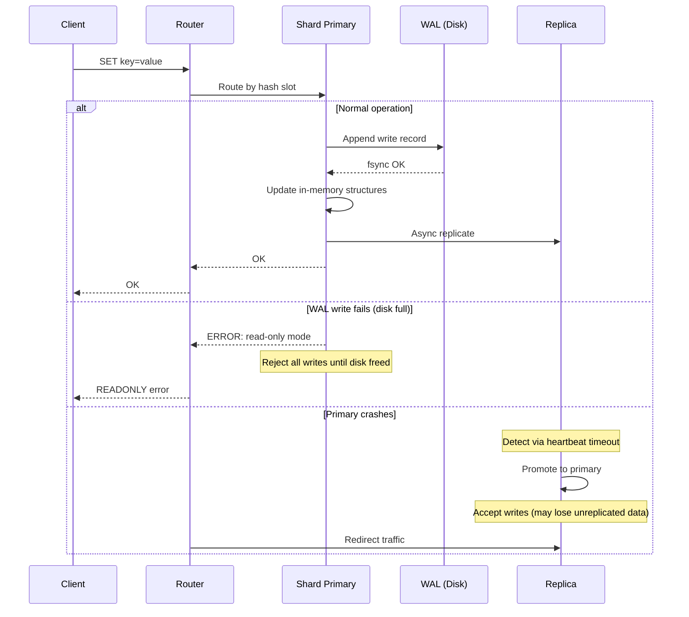

# System Design: In-Memory Database

## From Hash Tables to Tiered Storage — A Staff Engineer's Guide to the Four-Part Interview

---

## Table of Contents

1. [The Problem & Why It's Hard](#1-the-problem--why-its-hard)
2. [Requirements & Scope](#2-requirements--scope)
3. [Single Machine / Naive Solution](#3-phase-1-the-in-memory-data-store)
4. [Why Naive Fails (The Math)](#4-why-naive-fails-the-math)
5. [Distributed Architecture](#5-phase-2-distributed-architecture)
6. [Core Component Deep Dives](#6-core-component-deep-dives)
7. [The Scaling Journey](#7-the-scaling-journey)
8. [Failure Modes & Resilience](#8-failure-modes--resilience)
9. [Data Model & Storage](#9-data-model--storage)
10. [Observability & Operations](#10-observability--operations)
11. [Design Trade-offs](#11-design-trade-offs)
12. [Common Interview Mistakes](#12-common-interview-mistakes)
13. [Interview Cheat Sheet](#13-interview-cheat-sheet)

---

## 1. The Problem & Why It's Hard

This interview question typically comes in four escalating parts — each one raises the bar:

| Part | Question | What It Tests |
|---|---|---|
| 1 | Implement an in-memory database | Data structures, API design, concurrency |
| 2 | Support efficient querying with inverted indexes | Search fundamentals, index maintenance cost |
| 3 | Handle datasets too large for memory | Tiered storage, buffer management |
| 4 | Keep hot data in memory, preload frequent data | Caching algorithms, access pattern analysis |

Most candidates finish Parts 1 and 2. Parts 3 and 4 are where staff+ candidates separate themselves.

> **The interviewer's real question**: Can you design a system that delivers microsecond reads when data fits in memory, millisecond reads when it doesn't, and degrades gracefully as the dataset grows — all while maintaining correctness under concurrent access?

The trap is treating this as "just put a hash map behind an API." The real challenge is threefold:

1. **Concurrency without destroying latency**: The whole point of in-memory is speed. A global lock turns your microsecond database into a millisecond one.
2. **Querying beyond key-value**: Adding secondary indexes (inverted indexes) means every write now updates multiple data structures atomically.
3. **The memory cliff**: When data exceeds memory, you don't just "add disk." You need a tiered architecture that's transparent to the caller and doesn't sacrifice the in-memory performance for hot data.

> **Staff+ Signal:** The real interview insight is that Parts 1-4 aren't four separate systems — they're one system at four stages of maturity. A staff engineer designs Part 1 with the foresight that Parts 3 and 4 are coming. The storage engine abstraction you choose in Part 1 determines whether Part 3 is a refactor or a rewrite.

---

## 2. Requirements & Scope

### Functional Requirements

- **CRUD operations**: Create table, insert row, select by primary key, update, delete
- **SQL-like interface**: `CREATE TABLE`, `INSERT INTO`, `SELECT ... WHERE`
- **Secondary indexes**: Inverted index for efficient querying on non-primary-key columns
- **Multi-column queries**: Support `WHERE col1 = x AND col2 = y`
- **Persistence**: Survive process restarts (optional but expected at staff+ level)
- **Transactions**: At minimum, atomic single-row operations; ideally multi-row ACID

### Non-Functional Requirements

| Requirement | Target | Rationale |
|---|---|---|
| Point read latency (in-memory) | < 10 μs | Hash table lookup + minimal overhead |
| Point read latency (on-disk) | < 1 ms | SSD random read + deserialization |
| Write latency | < 50 μs | Append to WAL + update in-memory structures |
| Query latency (indexed) | < 1 ms | Inverted index lookup + row fetch |
| Throughput | 100K–1M ops/sec | Single node, depends on concurrency model |
| Availability | 99.99% | Data loss = user trust loss |

### Scale Estimation (Back-of-Envelope)

```
Dataset:                 50M rows, 500 bytes avg per row
Total data size:         50M × 500B = 25GB raw data
With indexes:            ~1.5x overhead → ~37.5GB total
Available server RAM:    64GB
Headroom after OS/app:   ~56GB usable

Phase 1-2: 37.5GB fits in 56GB RAM → pure in-memory ✓
Phase 3-4: Dataset grows to 200GB → exceeds memory by 3.5x

Index overhead:
  Primary index (hash):  50M entries × 16B (key + pointer) = 800MB
  Inverted index:        varies by cardinality
    - Low cardinality (status: 5 values):    5 × bitmap(50M bits) = 31MB
    - High cardinality (email: 50M values):  50M × ~40B = 2GB

Write amplification with 3 indexes:
  1 row insert = 1 data write + 1 primary index + 3 secondary index updates = 5 writes
  At 100K inserts/sec: 500K index operations/sec
```

---

## 3. Phase 1: The In-Memory Data Store

This is LeetCode "Design SQL" — the foundation. But how you build it determines everything that follows.

```
┌──────────────────────────────────────────────┐
│              In-Memory Database               │
│                                               │
│  ┌─────────────────────────────────────────┐ │
│  │            Query Parser / API            │ │
│  └──────────────┬──────────────────────────┘ │
│                 │                              │
│  ┌──────────────┴──────────────────────────┐ │
│  │          Table Manager (catalog)         │ │
│  │    tables: HashMap<String, Table>        │ │
│  └──────────────┬──────────────────────────┘ │
│                 │                              │
│  ┌──────────────┴──────────────────────────┐ │
│  │              Table                       │ │
│  │  schema: Vec<ColumnDef>                  │ │
│  │  rows:   HashMap<PK, Row>               │ │
│  │  next_id: AtomicU64                      │ │
│  └─────────────────────────────────────────┘ │
│                                               │
│  Row = Vec<Value>   (column-order array)      │
│  Value = String | Int | Float | Null          │
└──────────────────────────────────────────────┘
```

### Core Data Structures

**Primary storage: Hash map (PK → Row)**

```
HashMap<PrimaryKey, Row>

Lookup:   O(1) average
Insert:   O(1) amortized
Delete:   O(1) average
Scan:     O(n) — no ordering guarantee
Memory:   ~64 bytes overhead per entry (bucket + pointers + metadata)
```

**Why hash map over B-tree for primary index?**

| Structure | Point Lookup | Range Query | Insert | Memory Overhead |
|---|---|---|---|---|
| Hash map | O(1) | O(n) — must scan all | O(1) amortized | ~64B/entry |
| B-tree | O(log n) | O(log n + k) | O(log n) | ~40B/entry |
| Skip list | O(log n) | O(log n + k) | O(log n) | ~33B/entry |

For an in-memory database where most access is by primary key, the hash map wins. If range queries on PK are needed, a B-tree or skip list is better. SingleStore uses **lock-free skip lists** for this reason — they support both point and range queries without lock contention.

### Pseudocode: Core Operations

```python
class Table:
    def __init__(self, name, columns, pk_column):
        self.name = name
        self.columns = columns          # [ColumnDef(name, type), ...]
        self.pk_col_idx = pk_column     # index into columns
        self.rows = {}                  # pk_value -> [col1, col2, ...]
        self.next_auto_id = 1

    def insert(self, values):
        pk = values[self.pk_col_idx]
        if pk is None:
            pk = self.next_auto_id
            self.next_auto_id += 1
            values[self.pk_col_idx] = pk
        if pk in self.rows:
            raise DuplicateKeyError(pk)
        self.rows[pk] = values
        return pk

    def select(self, pk):
        return self.rows.get(pk)        # O(1)

    def select_where(self, conditions):
        # Without indexes: full table scan O(n)
        return [row for row in self.rows.values()
                if all(row[col] == val for col, val in conditions)]

    def delete(self, pk):
        return self.rows.pop(pk, None)  # O(1)
```

**When Phase 1 works:** Small datasets (< RAM), single-threaded access, simple key-value lookups.

**When Phase 1 fails:** The moment you need `SELECT * WHERE status = 'active'` — every query is a full table scan.

---

## 4. Why Naive Fails (The Math)

### Problem 1: Query Performance Without Indexes

```
Table: users (50M rows)
Query: SELECT * FROM users WHERE city = 'San Francisco'

Without index:
  Full scan: 50M rows × ~100ns per comparison = 5 seconds
  Unacceptable for any interactive use case.

With inverted index on city:
  Index lookup: O(1) hash lookup → posting list of row IDs
  Fetch matching rows: k lookups × O(1) each
  For 500K users in SF: ~50ms total
  100x improvement.
```

### Problem 2: Concurrency Bottleneck

```
Single-threaded (Redis model):
  1 core × 100K ops/sec = 100K ops/sec max throughput
  Simple, correct, but wastes 95 cores on a 96-core server.

Global lock (naive multi-threaded):
  Lock contention at 100K ops/sec with 32 threads:
  ~60% of time spent waiting for lock → effective throughput: 40K ops/sec
  Worse than single-threaded!

Per-table lock:
  Better, but hot tables (e.g., "users") still bottleneck.

Partition-serial (VoltDB model):
  Partition data into N shards, each single-threaded.
  32 partitions × 100K ops/sec = 3.2M ops/sec
  Zero lock overhead. But cross-partition transactions are expensive.
```

### Problem 3: The Memory Wall

```
Server RAM:        64GB usable
Current dataset:   25GB (fits comfortably)
Growth rate:       10GB/month

In 4 months:       65GB → exceeds RAM
In 12 months:      145GB → 2.3x RAM

Options:
  A) Buy more RAM:      $$/GB increases non-linearly; 512GB RAM servers are 4x price of 64GB
  B) Shard across nodes: works, but adds network latency + operational complexity
  C) Tier to SSD:        keep hot data in RAM, cold on NVMe SSD
                         SSD random read: ~100μs (10x slower than RAM, but 100x cheaper)
```

| Bottleneck | Naive Approach | Production Fix |
|---|---|---|
| Query on non-PK column | Full table scan O(n) | Inverted index O(1) lookup + O(k) fetch |
| Concurrent access | Global lock (40K ops/sec) | Partition-serial or MVCC (millions ops/sec) |
| Data exceeds memory | Crash or OOM-kill | Tiered storage with buffer pool |
| Persistence | None (data lost on restart) | WAL + periodic snapshots |

**The tipping point**: A single hash map works for a LeetCode exercise. Production needs indexes for queries, a concurrency strategy for throughput, and a tiered storage layer for growth.

---

## 5. Phase 2+: Distributed Architecture

**The key architectural insight**: Separate the storage engine (how data is physically stored and accessed) from the query engine (how queries are parsed, planned, and executed), and design the storage engine interface so it can transparently tier between memory and disk.



### How Real Companies Built This

#### Redis — The Single-Threaded Champion

Redis sidesteps concurrency entirely: one thread processes all commands sequentially. This sounds limiting, but a single Redis process handles **100K–200K ops/sec** because each operation is a simple in-memory data structure manipulation taking microseconds. For more throughput, you run multiple Redis processes (Redis Cluster) with 16,384 hash slots distributed across shards.

Redis's persistence model offers two options:
- **RDB snapshots**: Fork the process, child writes memory to disk via copy-on-write. Fast recovery but loses data since last snapshot.
- **AOF (Append-Only File)**: Log every write command. Durable but slower recovery (replay all commands).

Redis Enterprise recommends **max 25GB per process** and multiple processes per VM, carefully aligned to NUMA boundaries to avoid cross-socket memory access penalties.

**War story**: Coinbase experienced a 5-hour Redis outage during a period of 50x traffic growth. The root cause was connection pool exhaustion — their application opened connections faster than Redis could process them, creating a stampede that took down the entire cluster. The lesson: connection pooling and backpressure are as important as the database itself.

#### VoltDB — Partition-Serial, Zero Locking

VoltDB takes the most radical approach to concurrency: **eliminate it entirely**. Data is partitioned into shards, and each shard is processed by a single thread. There are no locks, no latches, no MVCC overhead. A single partition runs stored procedures sequentially, achieving **millions of transactions per second** per node because every operation is a direct memory access with zero coordination.

The trade-off: cross-partition transactions require two-phase coordination and are significantly more expensive. VoltDB's design forces you to think about your data partitioning upfront — the partition key is the most important schema decision.

#### SingleStore (MemSQL) — Lock-Free Skip Lists + Code Generation

SingleStore compiles SQL queries to machine code via LLVM at `CREATE TABLE` time. Their rowstore uses **lock-free skip lists** as the primary index, allowing concurrent readers and writers without blocking. For memory-exceeding workloads, their columnstore compresses data with dictionary and run-length encoding, achieving 7x+ compression ratios.

#### H-Store Anti-Caching — Inverting the Buffer Pool

Carnegie Mellon's H-Store project pioneered "anti-caching" — the inverse of traditional databases. Instead of "data lives on disk, cache hot data in memory," anti-caching says "data lives in memory, evict cold data to disk." When a transaction accesses evicted data, it aborts, the data is fetched from disk asynchronously, and the transaction retries. This achieved **9-10x throughput** over MySQL for larger-than-memory workloads with skewed access patterns.

> **Staff+ Signal:** Redis's single-threaded model and VoltDB's partition-serial model are both solutions to the same insight: in-memory operations are so fast (microseconds) that the overhead of lock acquisition (even uncontended mutexes cost ~25ns) and cache-line bouncing between CPU cores dominates actual computation time. The staff+ answer isn't "add more threads" — it's "eliminate coordination overhead entirely, then scale out horizontally." This is why Redis at 100K ops/sec per thread often beats multi-threaded databases at aggregate throughput.

### Key Data Structure: The Inverted Index

The inverted index is the answer to Part 2 of the interview — efficient querying on non-primary-key columns.

```
Table: users
┌────┬──────────┬───────────────┬────────┐
│ id │ name     │ city          │ status │
├────┼──────────┼───────────────┼────────┤
│ 1  │ Alice    │ San Francisco │ active │
│ 2  │ Bob      │ New York      │ active │
│ 3  │ Charlie  │ San Francisco │ paused │
│ 4  │ Diana    │ London        │ active │
│ 5  │ Eve      │ New York      │ paused │
└────┴──────────┴───────────────┴────────┘

Inverted Index on "city":
┌───────────────┬────────────┐
│ Term          │ Posting List│
├───────────────┼────────────┤
│ San Francisco │ [1, 3]     │
│ New York      │ [2, 5]     │
│ London        │ [4]        │
└───────────────┴────────────┘

Inverted Index on "status":
┌────────┬────────────┐
│ Term   │ Posting List│
├────────┼────────────┤
│ active │ [1, 2, 4]  │
│ paused │ [3, 5]     │
└────────┴────────────┘

Query: SELECT * FROM users WHERE city = 'San Francisco' AND status = 'active'
  Step 1: city index lookup('San Francisco') → [1, 3]
  Step 2: status index lookup('active') → [1, 2, 4]
  Step 3: Intersect → [1]
  Step 4: Fetch row 1 from primary index → Alice

Cost: O(1) per index lookup + O(min(|A|,|B|)) for intersection
vs. O(n) full scan — orders of magnitude faster for selective queries.
```

**Posting list storage strategies:**

| Strategy | Memory | Intersection Speed | Best For |
|---|---|---|---|
| Sorted array | Compact | O(n+m) merge | Static data, low update frequency |
| Roaring bitmap | Very compact for dense sets | O(min) bitwise AND | Low-cardinality columns (status, country) |
| Skip list | Moderate | O(n log m) | High update frequency |
| Hash set | Largest | O(min) lookup | Small posting lists |

RediSearch uses **compressed inverted indexes with delta encoding and roaring bitmaps**, achieving sub-millisecond full-text search across millions of documents.

---

## 6. Core Component Deep Dives

### 6.1 Buffer Pool Manager (The Heart of Part 3)

When data exceeds memory, the buffer pool is the gatekeeper between fast RAM and slow disk. This is the answer to Part 3 of the interview.

**Responsibilities:**
- Manage a fixed-size pool of memory pages (frames)
- Decide which pages stay in memory and which get evicted
- Handle page faults: fetch from disk when a requested page isn't in memory
- Track dirty pages and flush them to disk



**Page layout:**

```
┌─────────────────────────────────────────┐
│              Buffer Pool                │
│                                         │
│  Frame 0: [Page 42]  pin=0 dirty=1     │
│  Frame 1: [Page 17]  pin=2 dirty=0     │  ← 2 active readers
│  Frame 2: [FREE]     pin=0 dirty=0     │
│  Frame 3: [Page 99]  pin=0 dirty=0     │
│  Frame 4: [Page 3]   pin=1 dirty=1     │
│  ...                                    │
│  Frame N: [Page 256] pin=0 dirty=0     │
│                                         │
│  Page Table: page_id → frame_id         │
│  Free List:  [2, ...]                   │
│  Clock Hand: → Frame 3                  │
└─────────────────────────────────────────┘
```

> **Staff+ Signal:** MySQL InnoDB's buffer pool uses a **midpoint insertion LRU** — new pages enter at the 3/8 mark rather than the head. This prevents full-table scans from flushing the entire buffer pool. A sequential scan reads every page once, and without midpoint insertion, those one-time-access pages would push out genuinely hot data. PostgreSQL solves the same problem differently: a 256KB "ring buffer" isolates sequential scans from polluting shared buffers entirely. The choice between these strategies depends on your workload mix — midpoint insertion is simpler, ring buffers are more effective but require the query planner to classify scan types.

### 6.2 Eviction Policy Engine (The Heart of Part 4)

Part 4 asks for two things: (1) keep recently-accessed data in memory (eviction policy), and (2) preload frequently-accessed data (prefetching/warming).

**Eviction Policy Comparison:**

| Algorithm | Hit Ratio | Overhead | Adaptiveness | Used By |
|---|---|---|---|---|
| LRU | Good for recency | O(1) with doubly-linked list + hash map | None — one access pattern | Memcached |
| LFU | Good for frequency | O(log n) naive, O(1) with bucket sort | None — can't forget old popular items | Redis (with decay) |
| ARC | Near-optimal | O(1) but 2x metadata (ghost entries) | Self-tuning recency/frequency balance | ZFS, IBM DS8000 |
| W-TinyLFU | Near-optimal | O(1), 8 bytes/entry for sketch | Hill climbing for window size | Caffeine (Java) |
| Clock | Good (LRU approximation) | O(1), no linked list overhead | None | PostgreSQL, Linux page cache |

**W-TinyLFU — the state of the art:**

```
┌─────────────────────────────────────────────────────┐
│                    W-TinyLFU                         │
│                                                      │
│  ┌──────────────┐    ┌───────────────────────────┐  │
│  │ Window Cache  │    │       Main Cache           │  │
│  │   (1% size)   │    │       (99% size)           │  │
│  │    LRU        │───▶│  Segmented LRU             │  │
│  │              │ Admission │  (Protected + Probation)│ │
│  │  New entries  │  Filter   │                       │  │
│  │  land here    │    │      │                       │  │
│  └──────────────┘    └───────────────────────────┘  │
│                                                      │
│  Admission Filter: CountMinSketch (4-bit counters)   │
│  - Tracks access frequency with ~8 bytes per entry   │
│  - Candidate admitted only if freq > victim's freq   │
│  - Periodic halving prevents historical bias          │
│                                                      │
└─────────────────────────────────────────────────────┘
```

The key insight: W-TinyLFU combines **recency** (window LRU catches burst popularity) with **frequency** (main cache retains consistently popular items) and uses a **probabilistic frequency sketch** (CountMinSketch) that costs only 8 bytes per tracked item — far cheaper than ARC's ghost entries.

**Preloading Strategy (Part 4 continued):**

```
┌─────────────────────────────────────────────┐
│          Preloading / Cache Warming          │
│                                              │
│  Strategy 1: Snapshot-based warming          │
│  - On startup, load last buffer pool state   │
│  - Redis: load RDB snapshot                  │
│  - InnoDB: innodb_buffer_pool_dump_at_shutdown│
│                                              │
│  Strategy 2: Access-log replay               │
│  - Record access patterns during operation   │
│  - On cold start, replay top-K accessed keys │
│  - Throttle to avoid self-inflicted DDoS     │
│                                              │
│  Strategy 3: Predictive prefetch             │
│  - Track temporal correlations:              │
│    "users who access table A then access B"  │
│  - Prefetch B's pages when A is accessed     │
│  - CMU Pythia: neural model in buffer pool   │
│                                              │
│  Strategy 4: Time-based preloading           │
│  - "Dashboard queries spike at 9am"          │
│  - Pre-warm those datasets at 8:55am         │
│  - Requires workload characterization        │
└─────────────────────────────────────────────┘
```

> **Staff+ Signal:** The preloading strategy matters most during cold starts — and cold starts happen more often than people think (deploys, failovers, scaling events). An unthrottled cache warming strategy is effectively a self-inflicted DDoS against your backing store. Production systems like InnoDB solve this by dumping the buffer pool page list (not the data) to disk on shutdown, then loading those specific pages on startup at a controlled rate. Redis does the same with RDB snapshots. The staff+ insight: cache warming latency directly determines your failover recovery time, which directly determines your availability SLO.

### 6.3 Concurrency Control

**Three production-proven approaches:**

**Approach 1: Single-threaded event loop (Redis)**

```
┌──────────────────────────────┐
│  Event Loop (single thread)   │
│                               │
│  while true:                  │
│    events = epoll_wait()      │
│    for event in events:       │
│      command = parse(event)   │
│      result = execute(command)│   ← All commands serialized
│      send_response(result)    │
│                               │
│  I/O threads (Redis 6.0+):   │
│    Read client buffers  ──┐   │
│    Write responses back ──┤   │   ← Only I/O is parallel
│    Command execution: ────┘   │   ← Still single-threaded
└──────────────────────────────┘
```

**Approach 2: Partition-serial (VoltDB)**

```
┌────────────────────────────────────────────┐
│            Partition-Serial                  │
│                                             │
│  ┌──────────┐ ┌──────────┐ ┌──────────┐   │
│  │Partition 0│ │Partition 1│ │Partition N│  │
│  │ Thread 0  │ │ Thread 1  │ │ Thread N  │  │
│  │           │ │           │ │           │  │
│  │ users     │ │ users     │ │ users     │  │
│  │ id: 0-99  │ │ id:100-199│ │ id:N..    │  │
│  │           │ │           │ │           │  │
│  │ No locks! │ │ No locks! │ │ No locks! │  │
│  └──────────┘ └──────────┘ └──────────┘   │
│                                             │
│  Cross-partition: 2PC coordinator           │
│  (expensive but rare if partitioned well)   │
└────────────────────────────────────────────┘
```

**Approach 3: MVCC (Hekaton / most traditional DBs)**

```
┌─────────────────────────────────────────────┐
│          Multi-Version Concurrency           │
│                                              │
│  Row "Alice": version chain                  │
│  ┌─────────┐   ┌─────────┐   ┌─────────┐  │
│  │ v3 (T=9)│──▶│ v2 (T=5)│──▶│ v1 (T=1)│  │
│  │ age: 31 │   │ age: 30 │   │ age: 29 │  │
│  │ active  │   │ active  │   │ active  │  │
│  └─────────┘   └─────────┘   └─────────┘  │
│                                              │
│  Transaction T=7 reads: sees v2 (age: 30)   │
│  Transaction T=10 reads: sees v3 (age: 31)  │
│  Readers never block writers.                │
│  Writers never block readers.                │
│                                              │
│  Garbage collection: prune versions older    │
│  than oldest active transaction.             │
└─────────────────────────────────────────────┘
```

| Approach | Throughput | Complexity | Cross-key Transactions | Best For |
|---|---|---|---|---|
| Single-threaded | 100-200K ops/sec | Lowest | Free (all serial) | Cache, simple KV |
| Partition-serial | Millions ops/sec | Medium | Expensive (2PC) | OLTP with partition key |
| MVCC | High (readers free) | Highest | Natural (snapshot isolation) | General-purpose RDBMS |

---

## 7. The Scaling Journey

### Stage 1: Single Process, All In-Memory (0–25GB)

```
┌────────────────────────────┐
│     Single Process          │
│                             │
│  ┌───────────────────────┐ │
│  │  Hash Map (primary)   │ │
│  │  Inverted Indexes     │ │
│  │  All data in RAM      │ │
│  └───────────────────────┘ │
│                             │
│  WAL → disk (durability)   │
│  Snapshot → disk (backup)  │
└────────────────────────────┘
```

**Limit**: Single machine RAM (64-512GB). No high availability. Process crash = downtime until WAL replay.

### Stage 2: Tiered Storage, Single Node (25GB–500GB)



**New capabilities:**
- Buffer pool manages hot/cold data transparently
- W-TinyLFU or ARC eviction keeps working set in memory
- Indexes remain in memory (they're small relative to data)
- Background flush writes dirty pages to SSD

**Limit**: Single-node CPU and I/O bandwidth. No horizontal scaling. SSD wear from write amplification.

### Stage 3: Sharded Cluster (500GB–10TB+)



**New capabilities:**
- Hash-slot-based sharding (Redis: CRC16 mod 16384)
- Each shard has tiered storage independently
- Replicas for read scaling and high availability
- Online resharding: migrate slot ranges between nodes

> **Staff+ Signal:** At the sharded stage, the inverted index becomes a distributed problem. Option A: each shard maintains its own local inverted index (queries on non-partition-key columns scatter to all shards). Option B: a separate global index service. Option A is operationally simpler but every non-PK query hits every shard. Option B reduces scatter but adds a service to operate and keep consistent. Twitter chose Option A for their 10,000+ Redis instances because the operational burden of a global index service outweighed the scatter-gather cost. The right choice depends on your query patterns — if 90% of queries include the partition key, local indexes win.

---

## 8. Failure Modes & Resilience

### Request Flow with Failure Handling



### Failure Scenarios

| Failure | Detection | Recovery | Blast Radius | Data Impact |
|---|---|---|---|---|
| Process crash | Heartbeat timeout (3s) | Restart + WAL replay | Single shard downtime | Lose last ~1s of async-replicated writes |
| OOM kill | Kernel OOM event | Restart with lower maxmemory; eviction policy kicks in | Single shard | No data loss if WAL enabled |
| Disk failure | I/O errors | Promote replica; rebuild from snapshot | Single shard write path | Lose data since last snapshot if no replica |
| Network partition | Split-brain detection | Quorum-based leader election; minority side rejects writes | Partitioned shards | Risk of divergent writes without quorum |
| Hot key thundering herd | Latency spike on single shard | Local caching at client; key splitting | Single shard, all queries for that key | No data loss, but availability degraded |
| Memory fragmentation | Increasing RSS with stable key count | Restart with jemalloc defrag; or activedefrag in Redis | Gradual throughput degradation | No data loss |

> **Staff+ Signal:** The most insidious failure in an in-memory database is **memory fragmentation**. After millions of allocations and deallocations of varying sizes, physical memory becomes fragmented even though there's enough total free space. RSS grows while useful data size stays flat. Redis addresses this with `activedefrag` (background jemalloc defragmentation), but it competes with command processing for CPU. The staff+ insight: your eviction policy math (e.g., "we have 64GB for 50GB of data, so 14GB headroom") must account for fragmentation overhead — real headroom is more like 20-30% of useful data size, not the naive difference.

### Persistence and Durability

```
┌─────────────────────────────────────────────────┐
│             Persistence Strategies                │
│                                                   │
│  Strategy 1: WAL (Write-Ahead Log)               │
│  ┌─────┐ ┌─────┐ ┌─────┐ ┌─────┐               │
│  │CMD 1│→│CMD 2│→│CMD 3│→│CMD 4│→ ...           │
│  └─────┘ └─────┘ └─────┘ └─────┘               │
│  + Every write logged before ack                  │
│  + Minimal data loss (last fsync interval)        │
│  - Replay is slow for large datasets              │
│  - Redis AOF: fsync every second (default)        │
│                                                   │
│  Strategy 2: Snapshots (Point-in-time)            │
│  [Full memory dump at T1] ... [Full dump at T2]   │
│  + Fast recovery (load snapshot, done)             │
│  - Lose all writes between snapshots               │
│  - Fork() doubles memory briefly (copy-on-write)  │
│                                                   │
│  Strategy 3: Hybrid (Redis default)               │
│  Snapshot every N minutes + AOF since last snapshot│
│  + Fast recovery (load snapshot + replay small AOF)│
│  + Bounded data loss                               │
│  - Complexity of coordinating both                 │
│                                                   │
│  Strategy 4: No-fork snapshot (Dragonfly)          │
│  Use versioning to create consistent snapshot      │
│  without fork() — avoids memory doubling           │
│  + No 2x memory spike during snapshot              │
│  - More complex implementation                     │
└─────────────────────────────────────────────────┘
```

---

## 9. Data Model & Storage

### Core Tables (Metadata)

```sql
CREATE TABLE db_tables (
    table_id        SERIAL PRIMARY KEY,
    table_name      VARCHAR(128) UNIQUE NOT NULL,
    column_count    INT NOT NULL,
    row_count       BIGINT NOT NULL DEFAULT 0,
    pk_column_idx   INT NOT NULL DEFAULT 0,
    created_at      TIMESTAMPTZ DEFAULT NOW()
);

CREATE TABLE db_columns (
    table_id        INT NOT NULL REFERENCES db_tables(table_id),
    column_idx      INT NOT NULL,
    column_name     VARCHAR(128) NOT NULL,
    column_type     VARCHAR(20) NOT NULL,
    is_indexed      BOOLEAN DEFAULT FALSE,
    is_nullable     BOOLEAN DEFAULT TRUE,

    PRIMARY KEY (table_id, column_idx),
    CONSTRAINT valid_type CHECK (column_type IN ('INT', 'FLOAT', 'STRING', 'BOOL', 'TIMESTAMP'))
);

CREATE TABLE db_indexes (
    index_id        SERIAL PRIMARY KEY,
    table_id        INT NOT NULL REFERENCES db_tables(table_id),
    column_idx      INT NOT NULL,
    index_type      VARCHAR(20) NOT NULL DEFAULT 'INVERTED',
    entry_count     BIGINT NOT NULL DEFAULT 0,

    CONSTRAINT valid_index_type CHECK (index_type IN ('HASH', 'BTREE', 'INVERTED')),
    UNIQUE (table_id, column_idx)
);
```

### In-Memory Page Layout

```
┌────────────────────────── Page (8KB) ──────────────────────────┐
│ Header (24 bytes)                                              │
│ ┌──────────────────────────────────────────────────────────┐  │
│ │ page_id: u64 │ checksum: u32 │ row_count: u16 │ flags: u16│ │
│ └──────────────────────────────────────────────────────────┘  │
│                                                                │
│ Slot Directory (grows downward)           Free Space           │
│ ┌────┬────┬────┬────┐                                         │
│ │ S0 │ S1 │ S2 │ S3 │ ──┐                                    │
│ └────┴────┴────┴────┘   │                                     │
│                          ▼                                     │
│                    ┌──────────┐                                │
│                    │ Row 3    │  (grows upward)                │
│                    ├──────────┤                                │
│                    │ Row 2    │                                │
│                    ├──────────┤                                │
│                    │ Row 1    │                                │
│                    ├──────────┤                                │
│                    │ Row 0    │                                │
│                    └──────────┘                                │
└────────────────────────────────────────────────────────────────┘

Row format (variable length):
┌────────────┬────────────┬─────────┬─────────┬─────────┐
│ null_bitmap│ col1_value │ col2_val│ col3_val│ ...     │
│ (N/8 bytes)│ (var)      │ (var)   │ (var)   │         │
└────────────┴────────────┴─────────┴─────────┴─────────┘
```

### Storage Engine Interface

```python
class StorageEngine:
    """Abstraction that enables transparent tiering."""

    def get_page(self, page_id) -> Page:
        """Check buffer pool first, then disk. Caller doesn't know which."""
        if page_id in self.buffer_pool:
            self.buffer_pool.touch(page_id)      # Update eviction metadata
            return self.buffer_pool[page_id]
        # Page fault: load from disk
        page = self.disk_manager.read_page(page_id)
        frame = self.buffer_pool.evict_and_replace(page)
        return frame

    def write_page(self, page_id, page):
        """Write to WAL, update in buffer pool, mark dirty."""
        self.wal.append(page_id, page.serialize())
        self.buffer_pool.mark_dirty(page_id)
        # Actual disk flush happens in background
```

### Storage Engine Choice

| Component | Engine | Rationale |
|---|---|---|
| Hot data (working set) | In-memory pages in buffer pool | Microsecond access, the whole point |
| Cold data | NVMe SSD pages | 100μs access, 100x cheaper than RAM per GB |
| WAL | Append-only file on SSD | Sequential writes, fsync for durability |
| Snapshots | Object storage (S3) | Cheap, durable, survives host failure |
| Metadata catalog | In-memory + WAL | Small, must be always available |
| Indexes | Always in-memory | Indexes are small relative to data; evicting them destroys query performance |

---

## 10. Observability & Operations

### Key Metrics

**Memory:**
- `buffer_pool_hit_ratio` — percentage of page requests served from memory. SLO: > 95%. Below 90% means your working set exceeds buffer pool. This is the single most important metric.
- `buffer_pool_dirty_pages_ratio` — percentage of dirty pages. If > 80%, flush I/O may bottleneck.
- `memory_fragmentation_ratio` — RSS / used_memory. Alert if > 1.5 (50% waste from fragmentation).
- `eviction_rate_per_sec` — pages evicted per second. Sustained high rate = working set doesn't fit.

**Latency:**
- `read_latency_us{tier="memory|disk"}` — separating memory hits from disk fetches reveals true performance.
- `write_latency_us` — includes WAL fsync time. Alert if p99 > 1ms.
- `index_lookup_latency_us{type="primary|inverted"}` — ensure indexes stay fast.

**Throughput:**
- `operations_per_second{type="read|write"}` — overall throughput by operation type.
- `page_faults_per_second` — disk fetches. Correlates directly with disk I/O saturation.

### Distributed Tracing: Indexed Query

```
[Client]                     1ms    → Send query
  └─[Router]                 0.1ms  → Route to correct shard
    └─[Query Parser]         0.05ms → Parse SQL
      └─[Query Planner]      0.1ms  → Choose index scan over table scan
        └─[Inverted Index]   0.01ms → Lookup posting list (in memory)
          └─[Intersection]   0.05ms → AND two posting lists
            └─[Buffer Pool]  0.01ms → Fetch 3 rows (all in memory: HIT)
              └─[Response]   ✓      → Return 3 rows
                                Total: ~1.3ms (all in-memory)

If page fault on row fetch:
            └─[Buffer Pool]  0.01ms → Page not in pool (MISS)
              └─[Disk Read]  0.1ms  → Read 8KB page from NVMe SSD
                └─[Response] ✓      → Return 3 rows
                                Total: ~1.4ms (one page fault)
```

### Alerting Strategy

| Alert | Condition | Severity | Action |
|---|---|---|---|
| Buffer pool hit ratio drop | < 90% for 10min | P2 | Working set grew — increase buffer pool size or add shard |
| Memory usage critical | > 90% of maxmemory | P1 | Eviction kicking in — scale up RAM or start evicting aggressively |
| WAL disk near full | < 10% disk space | P1 | WAL compaction stuck or snapshots not cleaning up; risk of write halt |
| Replication lag | > 5 seconds | P2 | Replica falling behind — failover would lose data |
| Hot key detected | Single key > 1% of total ops | P3 | Client-side caching or key splitting needed |
| OOM kill | Kernel event | P1 | Immediate: promote replica. Investigate: maxmemory misconfigured or memory leak |

---

## 11. Design Trade-offs

| Decision | Option A | Option B | Recommended | Why |
|---|---|---|---|---|
| Concurrency model | Single-threaded (Redis) | Partition-serial (VoltDB) | **Partition-serial** for DB workloads | Single-threaded is simpler but caps at ~200K ops/sec. Partition-serial scales linearly with cores while keeping zero-lock simplicity per partition. |
| Eviction policy | LRU | W-TinyLFU | **W-TinyLFU** | Near-optimal hit ratios with minimal memory overhead. LRU is vulnerable to scan pollution. ARC is patented by IBM. |
| Inverted index storage | Sorted arrays | Roaring bitmaps | **Hybrid** | Roaring bitmaps for low-cardinality columns (status, country). Sorted arrays for high-cardinality (email, user_id). |
| Persistence | WAL only | Snapshot + WAL | **Snapshot + WAL** | Snapshot for fast recovery; WAL for minimizing data loss since last snapshot. Redis's hybrid approach is battle-tested. |
| Index placement (distributed) | Local per-shard | Global index service | **Local per-shard** | Operationally simpler. Scatter-gather on non-PK queries is acceptable if most queries include the partition key. |
| When data exceeds memory | Shard to more nodes | Tier to SSD | **Tier first, shard second** | Tiering is a one-machine change. Sharding adds operational complexity (split-brain, rebalancing, cross-shard queries). Tier when you can; shard when you must. Two-way door. |
| Snapshot mechanism | fork() + COW | Versioned no-fork | **fork() for simplicity** | fork() is well-understood and works. No-fork (Dragonfly) avoids memory doubling but adds implementation complexity. Start with fork(); switch if memory pressure justifies it. |

> **Staff+ Signal:** "Tier first, shard second" is a key architectural principle. Adding tiered storage to a single node is a local change — your API, query engine, and index layer don't change. Sharding is a distributed systems change — you now have cross-shard queries, distributed transactions, rebalancing during growth, and split-brain during network partitions. A single node with 64GB RAM + 1TB NVMe SSD can handle far more data than people expect when the access pattern is skewed (and most real-world access patterns are). Instagram stored 300M mappings in <5GB by optimizing Redis data structures. Twitter runs 105TB across 10,000+ Redis instances — but most of those are sharded for throughput, not data size.

---

## 12. Common Interview Mistakes

1. **Jumping to distributed systems before solving single-node**: "I'd use a Redis cluster with consistent hashing." Stop. First design the data structures. Show you understand what's inside each node before you distribute it. What staff+ candidates say: "Let me start with a single-node in-memory store, prove where it breaks with math, then distribute."

2. **Using a global lock for concurrency**: "I'd add a mutex around the hash map." This destroys the entire latency advantage of being in-memory. A mutex acquisition (~25ns uncontended) is the same order of magnitude as a hash map lookup (~50ns). What staff+ candidates say: "For an in-memory DB, lock overhead dominates compute time. I'd use partition-serial execution — each partition is single-threaded, eliminating locks entirely."

3. **Forgetting index maintenance cost on writes**: "I'd add an inverted index on every column." Each index means every write does an additional insert into the index data structure. 5 indexes = 6x write amplification. What staff+ candidates say: "Indexes trade write performance for read performance. I'd index selectively based on query patterns, and I'd account for the write amplification in my capacity planning."

4. **Saying 'just add more RAM' when data exceeds memory**: This isn't a strategy — it's a credit card. RAM costs ~$5/GB/month; SSD costs ~$0.10/GB/month. At 1TB, that's $5,000/month vs. $100/month. What staff+ candidates say: "I'd implement tiered storage with a buffer pool. Indexes stay in memory, hot data pages stay in memory, and cold pages are evicted to SSD. The key is the eviction policy — W-TinyLFU gives near-optimal hit ratios."

5. **Designing the inverted index without considering intersection**: Building an inverted index is the easy part. The hard part is multi-column queries that require intersecting posting lists efficiently. What staff+ candidates say: "For `WHERE city = X AND status = Y`, I intersect the posting lists. I'd use sorted arrays for this — merge intersection is O(n+m). For low-cardinality columns like status, roaring bitmaps give me O(1) bitwise AND."

6. **No persistence story**: "It's in-memory, so no disk." Then your entire database disappears on restart. What staff+ candidates say: "I'd use a write-ahead log for durability — every write is appended to disk before being acknowledged. Periodic snapshots reduce recovery time. The trade-off is WAL fsync frequency: every write (durable but slower) vs. every second (faster but up to 1s data loss)."

7. **Ignoring memory fragmentation**: Calculating capacity as "64GB RAM / row size = max rows." Real memory usage is 20-30% higher due to allocator overhead and fragmentation. What staff+ candidates say: "I'd budget 70% of RAM for data, 10% for indexes, and 20% for fragmentation headroom and OS overhead. Redis uses jemalloc with active defragmentation to manage this."

---

## 13. Interview Cheat Sheet

### Time Allocation (45-minute interview)

| Phase | Time | What to Cover |
|---|---|---|
| Clarify requirements | 3 min | Scope: KV store vs. SQL-like DB? Read vs. write heavy? Data size vs. RAM? |
| Part 1: Core data structures | 8 min | Hash map for primary index, row storage, API (CRUD + query) |
| Part 2: Inverted index | 8 min | Index structure, posting lists, multi-column intersection, write amplification |
| Part 3: Exceeding memory | 10 min | Buffer pool, page-based storage, eviction policies, tiered architecture |
| Part 4: Hot/frequent data | 8 min | W-TinyLFU, preloading strategies, cache warming on cold start |
| Concurrency + persistence | 5 min | Concurrency model choice, WAL + snapshots |
| Trade-offs + wrap-up | 3 min | Key decisions, failure modes, what you'd do differently at 10x scale |

### Step-by-Step Answer Guide

1. **Clarify**: "Is this a key-value store like Redis or a relational store with SQL-like queries? What's the expected data size relative to available memory? Read-heavy or write-heavy?"

2. **Part 1 — Data structures**: "I'd use a hash map for primary key access (O(1) lookup). Rows stored as column-order arrays. A table catalog maps table names to their schema and data. For the LeetCode version, this is sufficient."

3. **Part 2 — Inverted index**: "For querying non-PK columns, I'd add an inverted index: a hash map from column value → posting list of row IDs. For multi-column queries, I intersect posting lists. I'd use roaring bitmaps for low-cardinality columns and sorted arrays for high-cardinality. Write amplification: each indexed column adds one index update per write."

4. **Part 3 — Exceeding memory**: "I'd introduce a buffer pool that manages fixed-size pages. Hot pages stay in RAM; cold pages are evicted to SSD. The storage engine interface is transparent — the query layer doesn't know if a page is in memory or on disk. Indexes stay in memory always (they're small relative to data)."

5. **Part 4 — Hot data + preloading**: "For eviction, I'd use W-TinyLFU: it combines recency (window LRU) with frequency (CountMinSketch) for near-optimal hit ratios. For preloading, I'd dump the buffer pool page list on shutdown and reload those pages on startup. For predictive preloading, I'd track access patterns and prefetch correlated pages."

6. **Concurrency**: "In-memory operations are so fast that lock overhead dominates. I'd use partition-serial execution — each data partition has a single thread, zero locks. Scale by adding partitions. Cross-partition transactions use 2PC but should be rare with good partitioning."

7. **Persistence**: "Hybrid: WAL for durability (append every write, fsync per second) + periodic snapshots for fast recovery. Recovery: load latest snapshot, replay WAL from that point."

8. **Failure modes**: "OOM: eviction policy as backpressure, degrade to disk reads. Process crash: promote replica, replay WAL. Memory fragmentation: jemalloc with active defrag, budget 20% headroom."

9. **Trade-offs**: "I optimized for read latency over write throughput (indexes add write cost). I chose tiered storage over sharding first because it's a local change. I'd shard when single-node I/O becomes the bottleneck."

### What the Interviewer Wants to Hear

- At **L5/Senior**: Parts 1-2 done well. Hash map for primary index, inverted index for queries, basic concurrency awareness.
- At **L6/Staff**: Parts 1-3 done well, Part 4 started. Buffer pool design, eviction policy choice with reasoning, persistence story, concurrency model justification citing real systems (Redis, VoltDB).
- At **L7/Principal**: All 4 parts with depth. Quantified trade-offs (W-TinyLFU vs. ARC vs. LRU with hit-ratio reasoning), production war stories (Coinbase connection stampede, Instagram memory optimization), organizational insight ("tier first, shard second" as an operational complexity argument), and migration path from each stage to the next.

---

*Written by Michi Meow as a reference for staff-level system design interviews. The in-memory database is the rare interview question that starts at LeetCode difficulty and ends at distributed systems difficulty — all in 45 minutes. The candidates who ace it are the ones who see all four parts as one evolving system, not four separate questions.*
