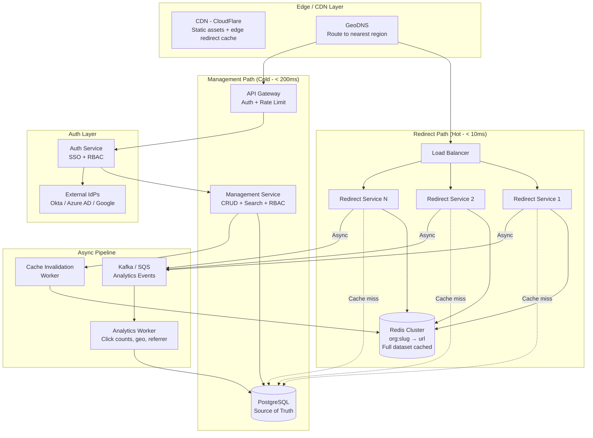
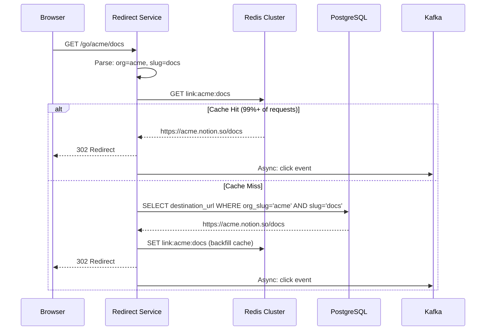
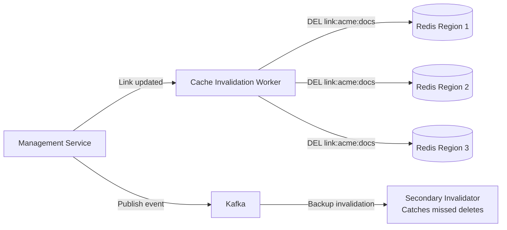
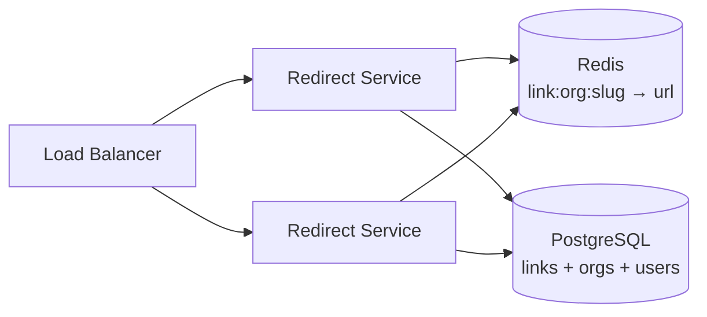
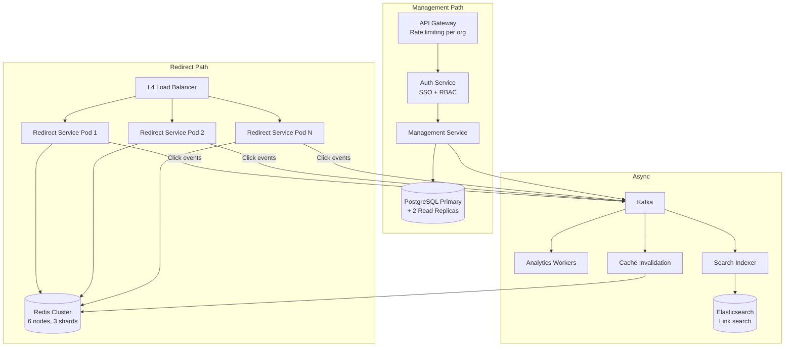
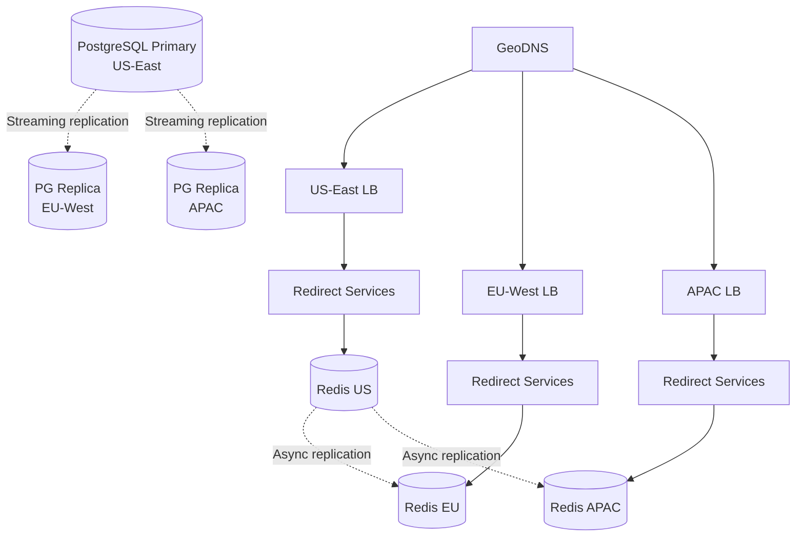
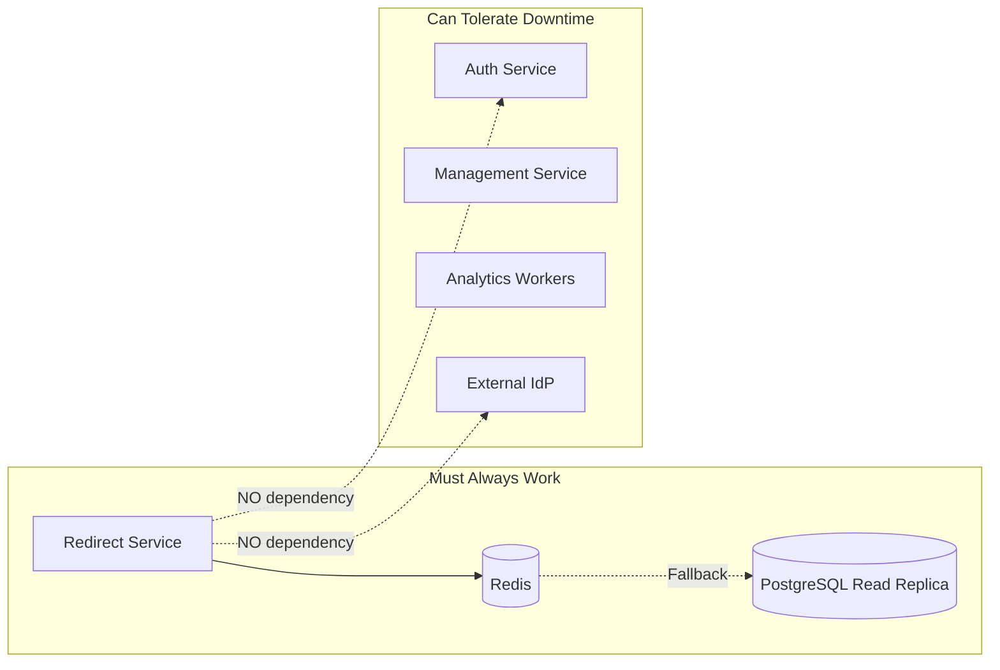

# System Design: Multi-Tenant URL Shortener with Organization Namespaces

## From go/link to go/\<company\>/link — A Staff Engineer's Guide to Enterprise Short Links

---

## Table of Contents

1. [The Problem & Why It's Hard](#1-the-problem--why-its-hard)
2. [Requirements & Scope](#2-requirements--scope)
3. [Phase 1: Single Machine Solution](#3-phase-1-single-machine-solution)
4. [Why Naive Fails (The Math)](#4-why-naive-fails-the-math)
5. [Phase 2+: Distributed Architecture](#5-phase-2-distributed-architecture)
6. [Core Component Deep Dives](#6-core-component-deep-dives)
7. [The Scaling Journey](#7-the-scaling-journey)
8. [Failure Modes & Resilience](#8-failure-modes--resilience)
9. [Data Model & Storage](#9-data-model--storage)
10. [Observability & Operations](#10-observability--operations)
11. [Design Trade-offs](#11-design-trade-offs)
12. [Common Interview Mistakes](#12-common-interview-mistakes)
13. [Interview Cheat Sheet](#13-interview-cheat-sheet)

---

## 1. The Problem & Why It's Hard

"Design a URL shortener" is perhaps the most common system design interview question. It's so common that many candidates walk in with a memorized answer: hash the URL, store it in a database, redirect on lookup. Done in 15 minutes, right?

Wrong. The interviewer doesn't want you to design bit.ly. They want to see how you handle the **hidden complexity** underneath a deceptively simple interface.

> **The interviewer's real question**: Can you design a system that's trivially simple on the surface (key → value lookup) but must handle multi-tenancy, namespace isolation, organizational access control, and extreme read-heavy traffic — all while maintaining sub-10ms redirect latency at millions of requests per second?

The multi-tenant variant — where organizations get their own namespace like `go/<company>/docs` — transforms a freshman data structures problem into a staff-level design challenge. Now you need:

- **Namespace isolation**: `go/acme/roadmap` and `go/globex/roadmap` are completely different links owned by different organizations
- **Permission boundaries**: An engineer at Acme must not be able to read, create, or discover Globex's links
- **Tenant-aware caching**: A cache miss for Org A must not serve Org B's data
- **Organizational URL routing**: The system must resolve `go/<org>/<slug>` in a single DNS hop, not a chain of redirects

> **Staff+ Signal:** The real challenge isn't URL shortening — it's building a multi-tenant namespace that behaves like a private knowledge graph per organization while sharing infrastructure for cost efficiency. Go links are closer to an internal knowledge management system than a URL shortener. At Google, go links became so embedded in company culture that losing them would be equivalent to losing internal search.

### A Brief History: Why Go Links Matter

In 2005, Eric DeFriez on Google's SysOps team built the first go/ link system. He aliased `go` to `goto.google.com` in internal DNS, and built a simple URL shortener behind it. Within weeks of a soft launch, it leaked to the internal "misc" mailing list and usage shot up 100x in 24 hours. Within months: 20,000 shortcuts and 10,000 redirects/day.

The system was later rewritten by Chris Heiser to run on Google standard infrastructure (Bigtable + Borg). By 2010, every Googler used go links daily. When Xooglers left for companies like LinkedIn, Twitter, Stripe, Airbnb, and Netflix between 2012-2015, they brought the go link culture with them — often building internal clones within their first weeks.

This history reveals something important: **go links are organizational knowledge infrastructure**, not just convenience shortcuts. They encode institutional knowledge ("go/oncall" always points to the current on-call rotation) and survive employee turnover. The system design must treat them accordingly.

---

## 2. Requirements & Scope

### Functional Requirements

- **Create short link**: `POST /api/v1/links` — create `go/<org>/<slug>` → `<destination_url>`
- **Redirect**: `GET /go/<org>/<slug>` → HTTP 301/302 to destination URL
- **Organization namespaces**: Each organization owns an isolated namespace. `go/acme/docs` and `go/globex/docs` resolve independently
- **Global links**: Platform-level links like `go/help`, `go/status` that work across all orgs
- **Custom slugs**: Human-readable slugs (not random hashes). `go/acme/q4-roadmap`, not `go/acme/a3Fk9`
- **Link management**: Update destination, transfer ownership, set expiration, view analytics
- **Search**: Search links within your organization by slug or destination URL
- **Parameterized links**: `go/acme/jira/%s` → `https://acme.atlassian.net/browse/%s` (variable substitution)
- **SSO integration**: Authenticate via organization's IdP (Okta, Azure AD, Google Workspace)
- **RBAC**: Organization admins, link creators, read-only viewers

### Non-Functional Requirements

| Requirement | Target | Rationale |
|---|---|---|
| Redirect latency (p99) | < 10ms | Go links replace typing URLs — must feel instant |
| Create latency (p99) | < 200ms | Interactive creation from browser extension |
| Redirect availability | 99.99% (< 52 min/year) | Broken go links block entire workflows |
| Read:write ratio | ~1000:1 | Links are created once, resolved millions of times |
| Concurrent orgs | 10,000+ | Multi-tenant SaaS serving thousands of companies |
| Links per org | Up to 500K | Large enterprises have deep link libraries |
| Redirects/second (peak) | 500K | All orgs combined during business hours |

### Scale Estimation (Back-of-Envelope)

```
Organizations:              10,000
Avg links per org:          10,000
Total links:                100M
Avg link size:              ~500 bytes (slug + URL + metadata)
Total link storage:         100M × 500B = ~50GB (fits in memory!)

Peak redirects/sec:         500K
Avg redirect payload:       ~200 bytes (slug lookup + redirect)
Bandwidth (redirects):      500K × 200B = ~100MB/s (trivial)

Peak creates/sec:           500 (500K / 1000 read:write ratio)
Analytics events/sec:       500K (one per redirect)

Key insight: 50GB of link data fits entirely in Redis.
  The entire hot dataset can be cached in memory.
  This is a caching problem, not a storage problem.
```

---

## 3. Phase 1: Single Machine Solution

For a single organization with a few thousand links, the solution is almost trivially simple.

```
┌─────────────────────────────────────────────┐
│               Single Server                  │
│                                              │
│  Browser ──→ Express.js ──→ PostgreSQL       │
│  Extension    (Node.js)     links table      │
│                  │                           │
│                  ▼                           │
│              In-Memory                       │
│              LRU Cache                       │
│              (slug → url)                    │
└─────────────────────────────────────────────┘
```

### Implementation Sketch

```python
# Redirect handler — the hot path
def redirect(org_slug, link_slug):
    cache_key = f"{org_slug}:{link_slug}"

    # Check in-memory cache first
    url = cache.get(cache_key)
    if url:
        log_analytics_async(org_slug, link_slug)
        return HTTP_302_Redirect(url)

    # Cache miss — check database
    link = db.query(
        "SELECT destination_url FROM links WHERE org_slug = %s AND slug = %s AND is_active = true",
        (org_slug, link_slug)
    )
    if not link:
        return HTTP_404

    cache.set(cache_key, link.destination_url, ttl=3600)
    log_analytics_async(org_slug, link_slug)
    return HTTP_302_Redirect(link.destination_url)

# Create handler — the cold path
def create_link(org_slug, link_slug, destination_url, user):
    # Check permission
    if not user.has_role(org_slug, "creator"):
        return HTTP_403

    # Check uniqueness within org namespace
    existing = db.query(
        "SELECT id FROM links WHERE org_slug = %s AND slug = %s",
        (org_slug, link_slug)
    )
    if existing:
        return HTTP_409_Conflict("Slug already taken in this org")

    db.insert("INSERT INTO links (org_slug, slug, destination_url, created_by) VALUES (%s, %s, %s, %s)",
              (org_slug, link_slug, destination_url, user.id))

    cache.set(f"{org_slug}:{link_slug}", destination_url, ttl=3600)
    return HTTP_201
```

### When Does Phase 1 Work?

- Single organization, < 10K links
- < 100 redirects/second
- One server can handle everything
- In-memory LRU cache gives < 1ms redirect latency for hot links

### When Does Phase 1 Fail?

See next section.

---

## 4. Why Naive Fails (The Math)

The naive single-machine solution breaks in three dimensions simultaneously:

### Dimension 1: Multi-Tenancy Breaks Everything

```
Single org:    1 namespace, simple cache key "slug" → url
10,000 orgs:   10,000 namespaces, cache key becomes "org:slug" → url

Problem: Cache isolation
  - Org A updates go/acme/docs → must invalidate cache
  - Must NOT accidentally serve stale Org A data to Org B
  - With shared cache, a cache poisoning bug leaks data across tenants

Problem: "Noisy neighbor"
  - Org with 500K links floods cache, evicting other orgs' hot links
  - Org running a link audit script fires 50K lookups/sec, degrading service for all
```

### Dimension 2: Read Volume Exceeds Single Machine

```
Peak redirects:     500K/sec
Single PostgreSQL:  ~5K-10K reads/sec (with connection pooling)
Gap:                50-100x shortfall

Even with in-memory cache at 95% hit rate:
  Cache misses:     500K × 5% = 25K/sec → still 3-5x over DB capacity

Single Redis:       ~100K ops/sec → need 5+ Redis instances
                    OR Redis Cluster with sharding
```

### Dimension 3: Availability Requirements

```
99.99% availability = 52 minutes downtime/year
Single server:       Any deploy, crash, or restart = downtime

For 10,000 organizations depending on go links for daily work:
  - go/oncall, go/runbook, go/incident-123 are used DURING incidents
  - If the URL shortener is down during an incident, you can't reach your runbooks
  - This is a dependency loop — the tool you need to fix outages is itself down
```

> **Staff+ Signal:** The availability requirement for go links is higher than most services because they're used *during* incident response. If `go/runbook` doesn't resolve, your MTTR increases. This creates a bootstrap problem: the go link service must be one of the last things to go down and first things to come up. Design it with minimal external dependencies.

| Bottleneck | Single Machine | Distributed Fix |
|---|---|---|
| Read throughput | ~10K redirects/sec | Redis Cluster + read replicas |
| Tenant isolation | Shared process memory | Per-tenant cache partitions + row-level security |
| Availability | Single point of failure | Multi-node with health checks + failover |
| Cache pollution | One big LRU | Tenant-aware cache with per-org eviction policies |

**The tipping point**: Once you serve more than ~50 organizations or exceed ~10K redirects/sec, you need distributed caching, tenant isolation at the data layer, and redundancy.

---

## 5. Phase 2+: Distributed Architecture

**The key architectural insight**: A multi-tenant URL shortener is a **tenant-namespaced key-value store with an HTTP redirect interface**. The redirect path (read) must be as close to a single cache lookup as possible. The management path (write) handles all the complexity — auth, RBAC, namespacing, analytics — and can tolerate higher latency.



### How Real Companies Built This

#### Google (go/ links — 2005-present)

Google's internal go link system was the original. Key architectural choices:

- **DNS-based routing**: `go` resolves to `goto.google.com` via internal DNS. On external networks, a BeyondCorp Chrome extension handles the redirection and authentication.
- **Bigtable backend**: Originally simple, the system was rewritten to run on Bigtable + Borg to handle Google-scale usage (tens of thousands of links, millions of redirects daily).
- **First-come-first-serve namespace**: No per-team namespacing — all of Google shares one flat namespace. This works for a single company but is the exact problem multi-tenant systems must solve.
- **What they learned**: Go links became so embedded in culture that they're essential infrastructure. Slides, docs, chat messages, and even printed posters reference go links. The system must have near-100% availability.

#### Bitly (2008-present, 6B decodes/month)

Bitly handles ~6 billion link redirects per month at enterprise scale:

- **MySQL → Bigtable migration**: In 2023, Bitly migrated 80 billion rows of link data from MySQL to Cloud Bigtable. The migration completed in 6 days using concurrent Go scripts processing 26TB of data. They chose Bigtable for on-demand scaling without relational semantics overhead.
- **Stream-based architecture**: Bitly uses an asynchronous processing pipeline where each step performs a single logical transformation on event data — link creation, click tracking, and analytics flow through separate stages.
- **Multi-tenant via branded domains**: Bitly's enterprise product assigns custom domains per customer (e.g., `yourcompany.link/xxx`), achieving namespace isolation at the DNS level rather than URL path level.

#### Short.io (War Story — October 2025 AWS Outage)

Short.io's post-mortem from October 2025 is a cautionary tale for URL shortener design:

- **Root cause**: AWS us-east-1 DNS outage made DynamoDB inaccessible across the entire region. All short links went down.
- **Cascading failure**: Their status page (Atlassian Statuspage) and customer support (Intercom) were both hosted in us-east-1 — they couldn't even communicate the outage.
- **Key lesson**: They had a Cassandra fallback but it wasn't operationally available during the incident. "We believed such an outage was highly unlikely" — but it happened.
- **Post-incident changes**: Secondary status page on a different provider, Cassandra as active fallback for DynamoDB, regional autonomy for Frankfurt and Sydney clusters.

> **Staff+ Signal:** Short.io's outage reveals a pattern: infrastructure dependencies for URL shorteners create amplified blast radius. When your go links are down, every other system that's referenced by go links becomes harder to access. Design the redirect path with zero external dependencies beyond your own cache layer. The management path can depend on external auth — but redirects must work even when your IdP is down.

### Key Data Structure: Tenant-Namespaced Key-Value

The central abstraction is a composite key: `(org_id, slug)` → `destination_url`

```json
{
  "key": "acme:q4-roadmap",
  "org_id": "org_a1b2c3",
  "slug": "q4-roadmap",
  "destination_url": "https://docs.google.com/document/d/1abc.../edit",
  "created_by": "user_xyz",
  "created_at": "2025-01-15T10:30:00Z",
  "updated_at": "2025-03-01T14:22:00Z",
  "click_count": 4521,
  "is_parameterized": false,
  "tags": ["product", "roadmap"],
  "acl": {
    "visibility": "org_wide",
    "editors": ["user_xyz", "team_product"]
  }
}
```

---

## 6. Core Component Deep Dives

### 6.1 Redirect Service (The Hot Path)

The redirect service is the most performance-critical component. It handles 99.9% of all traffic and must resolve in < 10ms.

**Responsibilities:**
- Parse incoming URL: extract `org_slug` and `link_slug` from path
- Look up destination from Redis (primary) or PostgreSQL (fallback)
- Handle parameterized links: substitute `%s` with path parameters
- Return HTTP 301 (permanent) or 302 (temporary) redirect
- Emit analytics event asynchronously

**Request Flow:**



**Design decisions:**

- **No auth on redirect path**: The redirect service does NOT authenticate requests. This is deliberate — it eliminates a network hop to the auth service and removes a failure dependency. If a link should be private, the destination itself should be behind auth (the linked Google Doc, Notion page, etc. has its own access control).
- **301 vs 302**: Use 302 (temporary redirect) by default. 301 (permanent) gets cached by the browser, which means you can't update the destination later. Some orgs may opt into 301 for performance.
- **Stateless**: The redirect service holds no state. Any instance can handle any request. Scales horizontally by adding pods.

> **Staff+ Signal:** The decision to not authenticate on the redirect path is controversial but correct for internal go links. Authentication adds 5-20ms latency per redirect and creates a dependency on your IdP. If Okta goes down, no one can resolve go links. Instead, treat go links as "discoverable but not secret" — the same model as internal DNS. If a link must be private, the destination system (Notion, Google Docs, Jira) handles access control. This separates the concerns cleanly and keeps the redirect path dependency-free.

### 6.2 Management Service (The Cold Path)

**Responsibilities:**
- CRUD operations on links (create, read, update, delete)
- Slug uniqueness enforcement within org namespace
- RBAC enforcement (who can create/edit/delete links)
- Search (find links by slug prefix, destination domain, or tags)
- Organization administration (invite members, assign roles)
- Cache invalidation (push updates to Redis when links change)

**RBAC Model:**

```
Roles per organization:
  - org_admin:    Manage members, configure org settings, delete any link
  - link_admin:   Create/edit/delete any link in the org
  - creator:      Create new links, edit/delete own links
  - viewer:       Browse and use links, cannot create or edit

Permission matrix:
  Action              | org_admin | link_admin | creator | viewer
  --------------------|-----------|------------|---------|--------
  Create link         |     ✓     |     ✓      |    ✓    |   ✗
  Edit own link       |     ✓     |     ✓      |    ✓    |   ✗
  Edit any link       |     ✓     |     ✓      |    ✗    |   ✗
  Delete own link     |     ✓     |     ✓      |    ✓    |   ✗
  Delete any link     |     ✓     |     ✓      |    ✗    |   ✗
  View analytics      |     ✓     |     ✓      |    ✓    |   ✓
  Manage members      |     ✓     |     ✗      |    ✗    |   ✗
  Configure SSO       |     ✓     |     ✗      |    ✗    |   ✗
```

### 6.3 Parameterized Links (go/acme/jira/%s)

Parameterized links are a killer feature that transforms go links from simple redirects into a lightweight internal API gateway:

```
go/acme/jira/PROJ-123    → https://acme.atlassian.net/browse/PROJ-123
go/acme/wiki/%s           → https://wiki.acme.com/search?q=%s
go/acme/gh/%s/%s          → https://github.com/acme/%s/pull/%s
```

**Resolution logic:**

```python
def resolve_parameterized(org_slug, path_parts):
    # path_parts = ["jira", "PROJ-123"]
    # Try exact match first: slug = "jira/PROJ-123"
    link = lookup(org_slug, "/".join(path_parts))
    if link:
        return link.destination_url

    # Try parameterized match: slug = "jira/%s"
    for i in range(len(path_parts), 0, -1):
        base_slug = "/".join(path_parts[:i])
        params = path_parts[i:]
        link = lookup(org_slug, base_slug + "/%s" * len(params))
        if link:
            url = link.destination_url
            for param in params:
                url = url.replace("%s", param, 1)
            return url

    return None
```

> **Staff+ Signal:** Parameterized links create a subtle caching challenge. `go/acme/jira/PROJ-123` and `go/acme/jira/PROJ-456` both resolve via the template `go/acme/jira/%s`, but you can't cache the final resolved URL (infinite key space). Instead, cache the template: `link:acme:jira/%s → https://acme.atlassian.net/browse/%s`, and resolve parameters at the redirect service level. This keeps the cache finite while supporting infinite parameter combinations.

### 6.4 Cache Invalidation Strategy

When a link is updated or deleted, the cache must be invalidated. With Redis Cluster across multiple regions, this requires careful coordination.



**Invalidation approaches:**

| Approach | Latency | Consistency | Complexity |
|---|---|---|---|
| Delete on write (sync) | ~5ms | Strong | Low |
| Publish-subscribe (async) | ~50-200ms | Eventual | Medium |
| TTL-based expiry | Up to TTL | Weak | Lowest |
| **Hybrid (recommended)** | ~5ms local, ~200ms cross-region | Eventual with fast local | Medium |

The recommended approach: synchronously delete from the local Redis on write, then publish an invalidation event to Kafka for cross-region propagation. Set a TTL of 1 hour as a safety net for any missed invalidations.

### 6.5 Auth & SSO Integration

Each organization connects their identity provider (IdP) for single sign-on:

```
Supported IdPs:
  - SAML 2.0 (Okta, Azure AD, OneLogin)
  - OIDC (Google Workspace, Auth0)
  - SCIM 2.0 for automated user provisioning/deprovisioning

Flow:
  1. User visits go/acme/settings (management path)
  2. API Gateway checks for valid session cookie
  3. No session → redirect to Acme's IdP (Okta)
  4. User authenticates with Okta
  5. SAML assertion returned with user attributes + group memberships
  6. Management Service maps IdP groups to internal roles:
       "Engineering" group → "creator" role
       "IT Admins" group → "org_admin" role
  7. Session cookie set (8-hour TTL)
```

**SCIM provisioning** handles the lifecycle:
- When a user joins Acme in Okta → automatically provisioned with "viewer" role
- When a user leaves Acme in Okta → automatically deprovisioned, their created links transferred to a backup owner

> **Staff+ Signal:** SCIM deprovisioning is the security-critical path most teams forget. When an employee leaves, their go links shouldn't die — they should be transferred to a designated owner or team. But their *ability to create or edit links* must be revoked immediately. The deprovisioning webhook from the IdP must be processed synchronously (block the response until revoked), not queued asynchronously — otherwise there's a window where a terminated employee can still modify links.

---

## 7. The Scaling Journey

### Stage 1: Single Tenant MVP (1 org, ~100 redirects/sec)

```
Browser → Express.js → PostgreSQL
             ↓
         LRU Cache (in-process)
```

- Single server, single database
- In-process LRU cache for hot links
- Simple API key auth
- **Limit**: Server crash = cache lost, single point of failure

### Stage 2: Multi-Tenant with Redis (~100 orgs, ~10K redirects/sec)



**New capabilities at this stage:**
- Redis as shared cache (survives server restarts)
- Multiple redirect service instances behind a load balancer
- Tenant isolation via composite cache key: `link:{org_slug}:{slug}`
- SSO integration (SAML/OIDC) for organizational auth
- **Limit**: Single Redis instance maxes at ~100K ops/sec. Single PostgreSQL for reads.

### Stage 3: Enterprise Scale (~5,000 orgs, ~200K redirects/sec)



**New capabilities at this stage:**
- Redis Cluster with 3 shards (hash by org_slug for tenant locality)
- Kafka for async analytics and cache invalidation
- Elasticsearch for link search within orgs
- Per-org rate limiting at the API gateway
- SCIM provisioning for automated user lifecycle
- **Limit**: Single-region deployment. Cross-continent latency for global orgs.

> **Staff+ Signal:** At this stage, you need a dedicated on-call rotation. The most common alert? Cache hit rate dropping below 95% for a specific org — usually because they're bulk-importing links or running a migration. The runbook should include: (1) check if it's a single noisy tenant, (2) if yes, enable per-org rate limiting on the management path, (3) pre-warm their cache from a DB read replica. Do not let one tenant's bulk operation degrade redirect latency for all tenants.

### Stage 4: Global Scale (~10,000+ orgs, ~500K redirects/sec)

Multi-region deployment with per-region Redis clusters and cross-region replication.



**Critical design decision: Where do writes go?**
- All writes go to the primary region (US-East) for PostgreSQL
- Redis cache is populated per-region from read replicas
- A link created by an engineer in London is written to US-East, then replicated to EU-West Redis within ~200ms
- For redirects, each region serves from its local Redis — no cross-region hops on the read path

---

## 8. Failure Modes & Resilience

### Failure Scenarios

| Failure | Detection | Recovery | Blast Radius | User Experience |
|---|---|---|---|---|
| Single redirect pod crash | K8s health probe (5s) | Auto-restart, LB routes around | Zero — other pods serve | Invisible |
| Redis node failure | Sentinel/Cluster failover (< 5s) | Replica promoted | 1/N of cached links briefly slower | ~5s of cache misses hitting DB |
| Redis cluster total failure | Health check cascade | Fall back to PostgreSQL read replicas | All redirects hit DB (10-20ms vs 1ms) | Slower but functional |
| PostgreSQL primary failure | Replication lag monitor | Promote replica (< 30s) | No new link creation for ~30s | Creates fail, redirects work (cache) |
| Auth/IdP outage (Okta down) | Auth service health check | Extend existing session TTLs | Management path blocked | Can't create/edit links, redirects work |
| Full region failure | Cross-region health check | GeoDNS failover to secondary region | Minutes of elevated latency | Links work, slightly slower |

### The Critical Insight: Redirect Path Independence



The redirect path has exactly two dependencies: Redis (primary) and PostgreSQL read replica (fallback). It does NOT depend on:
- Auth service (no authentication on redirects)
- External IdP (Okta, Azure AD)
- Kafka (analytics are async, can be buffered)
- Management service
- Elasticsearch

This means: even if your entire management plane is down, users can still resolve go links.

> **Staff+ Signal:** Design the redirect path to survive the failure of everything else. The Short.io post-mortem showed what happens when URL shorteners have too many dependencies — their status page, support tools, and primary data store all shared a blast radius. For go links specifically, the redirect path should have a degradation hierarchy: (1) Redis → works at full speed, (2) Redis down → PostgreSQL read replica at 10x latency, (3) Both down → serve from a local cache snapshot file baked into the container image, updated hourly. Level 3 serves stale data but never returns a 500.

### Cache Warming Strategy

Cold start (new region, new Redis node, or Redis flush) is the most dangerous period:

```
Problem: After Redis restart, 100% of redirects hit PostgreSQL
  500K redirects/sec × 100% miss rate = 500K DB reads/sec
  PostgreSQL capacity: ~50K reads/sec → instant overload

Solution: Cache warming pipeline
  1. On Redis startup, run warm-up job:
     SELECT org_slug, slug, destination_url FROM links
     WHERE click_count > 10  -- Only popular links
     ORDER BY click_count DESC
     LIMIT 10_000_000
  2. Batch MSET into Redis (pipeline 1000 keys at a time)
  3. Warm-up completes in ~60 seconds for 10M keys
  4. Mark Redis node as "ready" in service discovery
  5. Load balancer starts routing traffic to this node
```

---

## 9. Data Model & Storage

### PostgreSQL Schema

```sql
-- Organizations (tenants)
CREATE TABLE organizations (
    id              UUID PRIMARY KEY DEFAULT gen_random_uuid(),
    slug            VARCHAR(64) UNIQUE NOT NULL,    -- "acme" in go/acme/xxx
    name            VARCHAR(256) NOT NULL,
    plan            VARCHAR(32) DEFAULT 'free',     -- free, pro, enterprise
    sso_provider    VARCHAR(32),                    -- 'okta', 'azure_ad', 'google'
    sso_config      JSONB,                          -- IdP metadata, entity ID, etc.
    created_at      TIMESTAMPTZ DEFAULT NOW(),
    settings        JSONB DEFAULT '{}'              -- org-level config
);

-- Users (cross-org, a user can belong to multiple orgs)
CREATE TABLE users (
    id              UUID PRIMARY KEY DEFAULT gen_random_uuid(),
    email           VARCHAR(256) UNIQUE NOT NULL,
    name            VARCHAR(256),
    created_at      TIMESTAMPTZ DEFAULT NOW()
);

-- Organization membership + roles
CREATE TABLE org_memberships (
    org_id          UUID REFERENCES organizations(id),
    user_id         UUID REFERENCES users(id),
    role            VARCHAR(32) NOT NULL DEFAULT 'viewer',  -- org_admin, link_admin, creator, viewer
    provisioned_via VARCHAR(32) DEFAULT 'manual',           -- 'manual', 'scim', 'sso_jit'
    created_at      TIMESTAMPTZ DEFAULT NOW(),
    PRIMARY KEY (org_id, user_id)
);

-- Links (the core entity)
CREATE TABLE links (
    id              UUID PRIMARY KEY DEFAULT gen_random_uuid(),
    org_id          UUID REFERENCES organizations(id) NOT NULL,
    slug            VARCHAR(512) NOT NULL,              -- "q4-roadmap" or "jira/%s"
    destination_url TEXT NOT NULL,
    is_parameterized BOOLEAN DEFAULT FALSE,
    created_by      UUID REFERENCES users(id),
    updated_by      UUID REFERENCES users(id),
    created_at      TIMESTAMPTZ DEFAULT NOW(),
    updated_at      TIMESTAMPTZ DEFAULT NOW(),
    expires_at      TIMESTAMPTZ,                        -- optional expiration
    is_active       BOOLEAN DEFAULT TRUE,
    click_count     BIGINT DEFAULT 0,                   -- denormalized for quick display
    tags            TEXT[] DEFAULT '{}',
    UNIQUE (org_id, slug)
);

-- Enforce uniqueness per org namespace
CREATE UNIQUE INDEX idx_links_org_slug ON links(org_id, slug) WHERE is_active = true;

-- Fast lookups for redirect path
CREATE INDEX idx_links_redirect ON links(org_id, slug, is_active) INCLUDE (destination_url, is_parameterized);

-- Global links (platform-level, not org-scoped)
CREATE TABLE global_links (
    slug            VARCHAR(512) PRIMARY KEY,
    destination_url TEXT NOT NULL,
    created_at      TIMESTAMPTZ DEFAULT NOW(),
    updated_at      TIMESTAMPTZ DEFAULT NOW()
);

-- Analytics (append-only, partitioned by month)
CREATE TABLE link_clicks (
    id              BIGSERIAL,
    link_id         UUID NOT NULL,
    org_id          UUID NOT NULL,
    clicked_at      TIMESTAMPTZ DEFAULT NOW(),
    referrer        TEXT,
    user_agent      TEXT,
    country_code    CHAR(2),
    PRIMARY KEY (clicked_at, id)
) PARTITION BY RANGE (clicked_at);

CREATE TABLE link_clicks_2025_03 PARTITION OF link_clicks
    FOR VALUES FROM ('2025-03-01') TO ('2025-04-01');
```

### Redis Data Model

```
# Link cache (the hot path)
link:{org_slug}:{slug} → destination_url
  Example: link:acme:q4-roadmap → "https://docs.google.com/d/1abc..."
  TTL: 1 hour (safety net), refreshed on access

# Parameterized link templates
link:{org_slug}:{slug_template} → destination_url_template
  Example: link:acme:jira/%s → "https://acme.atlassian.net/browse/%s"

# Global links (platform-level)
global:{slug} → destination_url
  Example: global:help → "https://golinks.example.com/help"

# Org metadata cache (for redirect service to validate org exists)
org:{org_slug}:active → "1" or absent
  TTL: 5 minutes

# Rate limiting counters (per org, per user)
ratelimit:{org_id}:creates:{window} → count
  TTL: 60 seconds (sliding window)
```

### Storage Engine Selection

| Engine | Role | Why |
|---|---|---|
| PostgreSQL | Source of truth for links, orgs, users, memberships | ACID, joins for RBAC queries, mature ecosystem |
| Redis Cluster | Redirect cache (full dataset), rate limiting, session store | Sub-ms reads, perfect for key-value redirect lookups |
| Kafka | Analytics event bus, cache invalidation events | Durable, ordered, decouples write path from analytics |
| Elasticsearch | Link search within orgs | Full-text search on slugs, destinations, tags |
| S3 | Analytics archives (monthly rollups) | Cheap long-term storage for click data |

---

## 10. Observability & Operations

### Key Metrics

**Redirect path (SLO-critical):**
- `redirect_latency_ms{org, quantile}` — p50, p95, p99 redirect time. Alert if p99 > 10ms
- `redirect_cache_hit_rate{org}` — should be > 99%. Drop below 95% = investigate
- `redirect_total{org, status_code}` — 200 (success), 404 (not found), 500 (error)
- `redirect_rps{org}` — requests per second per org. Spike detection for abuse

**Management path:**
- `link_creates{org}` — creation rate per org. Burst = potential abuse or bulk import
- `auth_failures{org, idp}` — SSO failures per org. Spike = IdP issue or misconfiguration
- `cache_invalidation_lag_ms` — time between link update and cache delete. Alert if > 1s

**Tenant health:**
- `org_link_count{org}` — total links per org. Approaching plan limit = upsell opportunity
- `org_active_users{org}` — monthly active users per org. Drop = churn risk
- `noisy_neighbor_score{org}` — composite metric of an org's resource consumption relative to plan

### Alerting Strategy

| Alert | Condition | Severity | Action |
|---|---|---|---|
| Redirect p99 > 10ms | 5 min sustained | P1 — Page on-call | Check Redis health, cache hit rate |
| Cache hit rate < 95% | 10 min sustained | P2 — Slack alert | Identify affected org, check for bulk operations |
| Redis memory > 80% | Threshold | P2 — Slack alert | Identify largest orgs, check for leak |
| Redirect 5xx rate > 0.1% | 5 min window | P1 — Page on-call | Check Redis connectivity, DB fallback |
| Link creation spike > 10x | Per-org, 1 min window | P3 — Log + rate limit | Likely bulk import; auto-throttle |
| Auth failure rate > 5% | Per-org, 5 min | P2 — Slack alert | Check IdP health, SAML cert expiry |

### Distributed Tracing

A redirect request trace:

```
[Redirect] GET /go/acme/docs  total: 2.3ms
  ├── [Parse]     Extract org=acme, slug=docs           0.01ms
  ├── [Redis]     GET link:acme:docs                    0.8ms
  ├── [Resolve]   Not parameterized, direct redirect    0.01ms
  ├── [Analytics] Emit click event to Kafka (async)     0.1ms (non-blocking)
  └── [Response]  302 Redirect                          0.02ms
```

A create request trace:

```
[Create] POST /api/v1/orgs/acme/links  total: 85ms
  ├── [Auth]        Validate session + RBAC             12ms
  ├── [Validate]    Check slug format + length          0.1ms
  ├── [Uniqueness]  SELECT from PostgreSQL              8ms
  ├── [Insert]      INSERT into PostgreSQL              15ms
  ├── [Cache]       SET in Redis                        1ms
  ├── [Search]      Index in Elasticsearch              40ms (async, non-blocking)
  └── [Response]    201 Created                         0.1ms
```

---

## 11. Design Trade-offs

### Trade-off 1: Multi-Tenant Data Isolation

| Approach | How | Pros | Cons | Recommendation |
|---|---|---|---|---|
| **Shared schema** (tenant_id column) | All orgs in one `links` table with `org_id` column | Simple, efficient, easy to query across orgs for platform analytics | Risk of cross-tenant data leak if queries miss the `org_id` filter; noisy neighbor | **Start here** — good enough for 95% of cases |
| **Schema per tenant** | Each org gets own PostgreSQL schema (`acme.links`, `globex.links`) | Stronger isolation, easy per-org backup/restore | Schema migration across 10K schemas is painful; connection pool overhead | Good for regulated industries |
| **Database per tenant** | Each org gets own database | Complete isolation, independent scaling, easy data residency compliance | Operational nightmare at 10K+ tenants; connection management becomes a distributed systems problem | Only for enterprise tier with compliance requirements |

> **Staff+ Signal:** The decision between shared schema and schema-per-tenant is a one-way door at scale. Migrating from shared schema to per-tenant schema with 100M links and zero downtime requires a complex dual-write migration. My recommendation: start with shared schema + rigorous row-level security policies in PostgreSQL. If a customer requires physical isolation (healthcare, finance), offer database-per-tenant as an enterprise add-on — and charge accordingly, because the operational cost is real.

### Trade-off 2: URL Structure

| Approach | Format | Pros | Cons |
|---|---|---|---|
| Path-based namespace | `go/<org>/<slug>` | Single domain, simple routing, easy to add global links | Org slug in URL visible to users |
| Subdomain-based | `<org>.go.example.com/<slug>` | Clean URLs, DNS-level isolation | Wildcard TLS cert needed, DNS propagation delay for new orgs |
| Custom domain | `go.acme.com/<slug>` | Branded experience, full DNS control per org | Complex cert management, DNS setup burden on customer |
| **Recommended: Path-based** | `go/<org>/<slug>` | Simplest to implement and operate | Org slug visible (usually fine for internal tools) |

### Trade-off 3: Redirect Caching Strategy

| Approach | Cache Hit Rate | Consistency | Cost |
|---|---|---|---|
| **Full dataset in Redis** | ~100% (everything cached) | Strong (invalidate on write) | Higher memory (~50GB for 100M links) |
| **LRU hot cache** | ~90-95% (popular links only) | Eventual (TTL-based) | Lower memory (~5GB) |
| **CDN edge cache** | ~99% for hot links | Weak (TTL 60s+) | Lowest latency, highest inconsistency |
| **Recommended: Full dataset** | ~100% | Strong + TTL safety net | Redis is cheap; 50GB is ~$200/month |

**My Take:** At 500 bytes per link and 100M total links, the entire dataset is 50GB. Redis handles this comfortably on a few nodes. Caching everything means cache misses are essentially zero — the only misses are newly created links before cache population (< 1s gap). This dramatically simplifies the system because you never need to worry about thundering herd on cache miss.

### Trade-off 4: Analytics Pipeline

| Approach | Latency | Accuracy | Complexity |
|---|---|---|---|
| Synchronous write (increment on redirect) | Blocks redirect | 100% accurate | Simple but adds redirect latency |
| Async via Kafka | Non-blocking | Near-real-time (seconds lag) | Medium — Kafka + consumer |
| Batch aggregation (hourly from logs) | Hours of delay | Approximate | Simplest for analytics |
| **Recommended: Async via Kafka** | Non-blocking redirect | Seconds of lag (acceptable) | Moderate |

### Trade-off 5: Global Link Resolution Order

When a user types `go/docs`, should the system check the org namespace first or the global namespace?

| Approach | Behavior | Pros | Cons |
|---|---|---|---|
| **Org-first** | Check `go/acme/docs`, then `go/docs` global | Org can override global links | Confusing if org shadow a well-known global link |
| **Global-first** | Check `go/docs` global, then `go/acme/docs` | Consistent platform experience | Org can't customize global names |
| **Recommended: Org-first with warnings** | Org takes priority, but warn admins if they shadow a global link | Flexibility with safety | Slightly more complex |

> **Staff+ Signal:** The resolution order decision has organizational implications beyond engineering. If global links take priority, the platform team controls the namespace and orgs can't override. If org links take priority, orgs have full autonomy but may accidentally shadow important platform links like `go/help` or `go/status`. The right answer depends on your organizational model: if you're building an internal tool for one company, global-first is simpler. If you're building a SaaS product, org-first with guardrails (reserved global slugs that can't be shadowed) respects tenant autonomy.

---

## 12. Common Interview Mistakes

### 1. Designing a Generic URL Shortener

**What candidates say**: "I'll generate a random 7-character hash and store it in a database."

**What's wrong**: The multi-tenant variant requires namespace isolation, not random hashes. The slug is human-readable (`go/acme/roadmap`), not random (`bit.ly/a3Fk9`). This changes the entire data model — you need composite keys, org-scoped uniqueness, and RBAC.

**What staff+ candidates say**: "Let me first clarify — are these human-readable slugs within organizational namespaces? That changes the key design from hash-based to namespace-scoped composite keys."

### 2. Putting Auth on the Redirect Path

**What candidates say**: "Every redirect checks if the user has permission to access this link."

**What's wrong**: This adds 10-20ms per redirect and creates a dependency on the auth service/IdP for the hottest path. If Okta is down, no redirects work.

**What staff+ candidates say**: "I'd keep the redirect path auth-free and let the destination system handle access control. The management path (create/edit) requires auth, but redirects should have zero external dependencies beyond cache."

### 3. Ignoring the Noisy Neighbor Problem

**What candidates say**: "All orgs share the same Redis cache with a composite key."

**What's wrong**: A large org importing 500K links can evict other orgs' hot links from cache. A single org running analytics queries can saturate DB read capacity.

**What staff+ candidates say**: "I'd implement per-org rate limiting on the management path and monitor per-org cache utilization. For Redis, I'd consider hashing by org_slug so each org's links land on the same shard — this gives shard-level isolation and makes per-org metrics easier."

### 4. Using 301 (Permanent) Redirects by Default

**What candidates say**: "301 is more efficient — browsers cache it."

**What's wrong**: Once a browser caches a 301, updating the link's destination has no effect for that user until they clear their cache. For go links where destinations change regularly (e.g., `go/acme/oncall` points to a rotation that changes weekly), this breaks the system.

**What staff+ candidates say**: "302 by default because go links are living documents — their destinations change. We can offer 301 as an opt-in for truly permanent links, with a clear warning in the UI."

### 5. Forgetting Parameterized Links

**What candidates say**: "Each link maps one slug to one URL."

**What's wrong**: Parameterized links (`go/acme/jira/%s → https://acme.atlassian.net/browse/%s`) are the most powerful feature of go links. They transform the system from a URL shortener into an internal routing layer.

### 6. Not Addressing SSO and Org Lifecycle

**What candidates say**: "Users create accounts with email and password."

**What's wrong**: Enterprise go links are B2B SaaS. Organizations authenticate via SSO (SAML/OIDC). User lifecycle is managed via SCIM. Without this, onboarding and offboarding are manual processes that don't scale.

### 7. Single-Region Without Acknowledging the Trade-off

**What candidates say**: "I'll deploy everything in us-east-1."

**What's wrong**: Not that single-region is wrong for an MVP — it's that candidates don't acknowledge the trade-off. Short.io's October 2025 outage proved that single-region URL shorteners can go down completely when that region has issues.

**What staff+ candidates say**: "I'd start single-region and build the redirect service to be region-independent. The data model (org:slug → url) is simple enough that cross-region replication is straightforward when we need it."

---

## 13. Interview Cheat Sheet

### Time Allocation (45-minute interview)

| Phase | Time | What to Cover |
|---|---|---|
| Clarify requirements | 5 min | Multi-tenant? Human-readable slugs? Parameterized? SSO? Scale target? |
| High-level design | 10 min | Split redirect path (hot) from management path (cold). Redis cache + PostgreSQL |
| Deep dive #1 | 10 min | Multi-tenant namespace isolation — data model, cache key design, RBAC |
| Deep dive #2 | 8 min | Redirect hot path — < 10ms target, cache strategy, no auth dependency |
| Scale + failure modes | 7 min | Redis Cluster, multi-region, redirect path independence |
| Trade-offs + wrap-up | 5 min | Shared vs. per-tenant schema, 301 vs. 302, resolution order |

### Step-by-Step Answer Guide

1. **Clarify**: "Is this a multi-tenant system like GoLinks where each organization gets their own namespace? Or a single-company internal tool like Google's go/ links?" — this changes everything
2. **Key insight**: "The system is a tenant-namespaced key-value store with an HTTP redirect interface. The redirect path must be as fast as a cache lookup. Everything else can be slower."
3. **Draw two paths**: Redirect path (stateless, cache-only, no auth) and management path (stateful, auth required, CRUD operations)
4. **Data model**: Composite key `(org_id, slug)` with uniqueness constraint per org. Redis key: `link:{org}:{slug}`. Show the SQL schema.
5. **Multi-tenancy deep dive**: Shared schema with `org_id` column, row-level security, composite unique index. Explain why not per-tenant schema (operational overhead).
6. **Redirect performance**: Full dataset in Redis (~50GB for 100M links). Zero external dependencies on redirect path. No auth check.
7. **Failure handling**: Redis down → fall back to PostgreSQL read replica. IdP down → redirects still work. Show the dependency diagram.
8. **Scale**: Redis Cluster for sharding, multi-region with GeoDNS, async analytics via Kafka
9. **Trade-offs**: 302 vs 301, shared vs isolated schema, org-first vs global-first resolution
10. **Observe**: Cache hit rate per org, redirect p99, noisy neighbor detection

### What the Interviewer Wants to Hear

**At L5/Senior:**
- Functional design works (redirect + create + basic auth)
- Redis caching for performance
- Basic understanding of multi-tenancy (composite keys)
- Common failure mode: "What if Redis goes down?"

**At L6/Staff:**
- Explicit split of redirect path (hot) vs. management path (cold)
- Tenant isolation strategy with trade-off reasoning (shared vs. per-tenant schema)
- No auth on redirect path (with justification)
- Cache invalidation strategy across regions
- Noisy neighbor awareness and per-org rate limiting
- Parameterized links and their caching implications

**At L7/Principal:**
- Go links as organizational knowledge infrastructure (not just a URL shortener)
- SCIM lifecycle management and security implications of offboarding
- Multi-region consistency model: what's the acceptable staleness for a link update?
- Total cost of ownership: per-tenant database at 10K tenants is an operational team, not a config flag
- Evolution strategy: "Phase 1 is shared schema monolith. Phase 2 splits read/write paths. Phase 3 adds per-tenant isolation for enterprise customers. We can stop after any phase."

---

*Written by Michi Meow as a reference for staff-level system design interviews. The multi-tenant go/ links variant tests everything a generic URL shortener does — plus namespace isolation, organizational access control, and the judgment to keep the redirect path dependency-free.*
