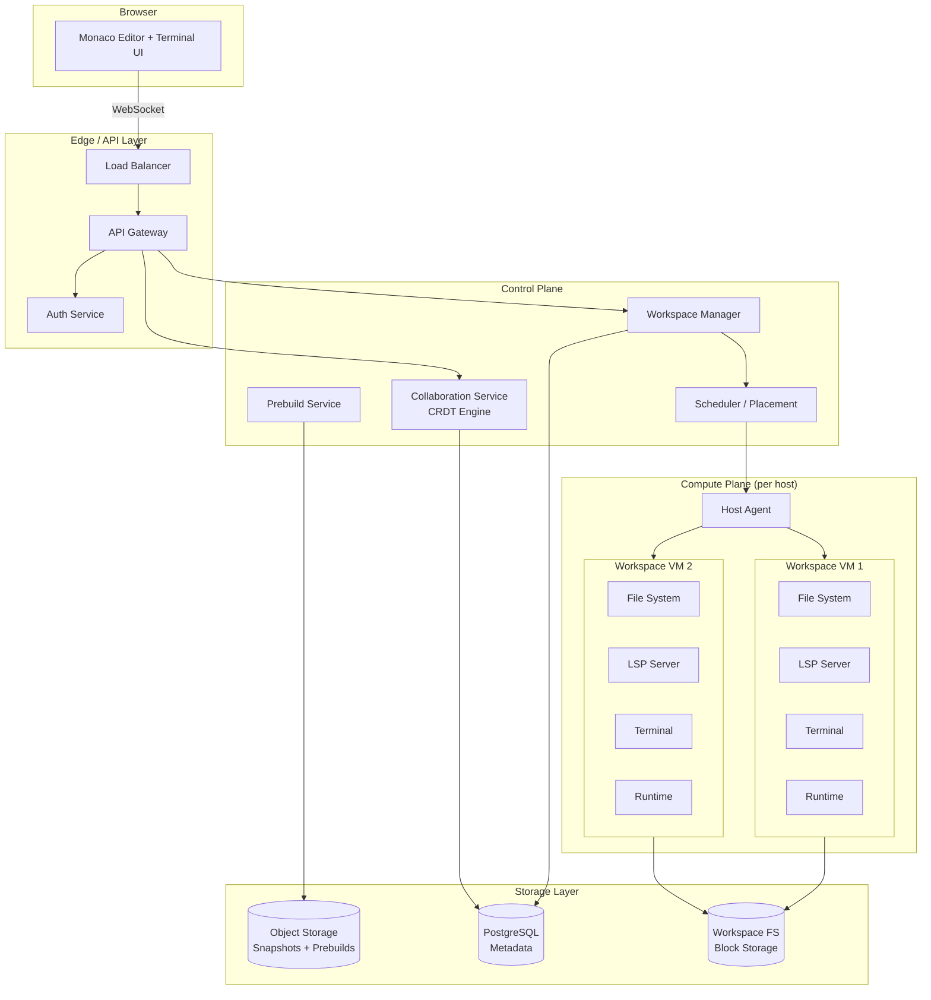
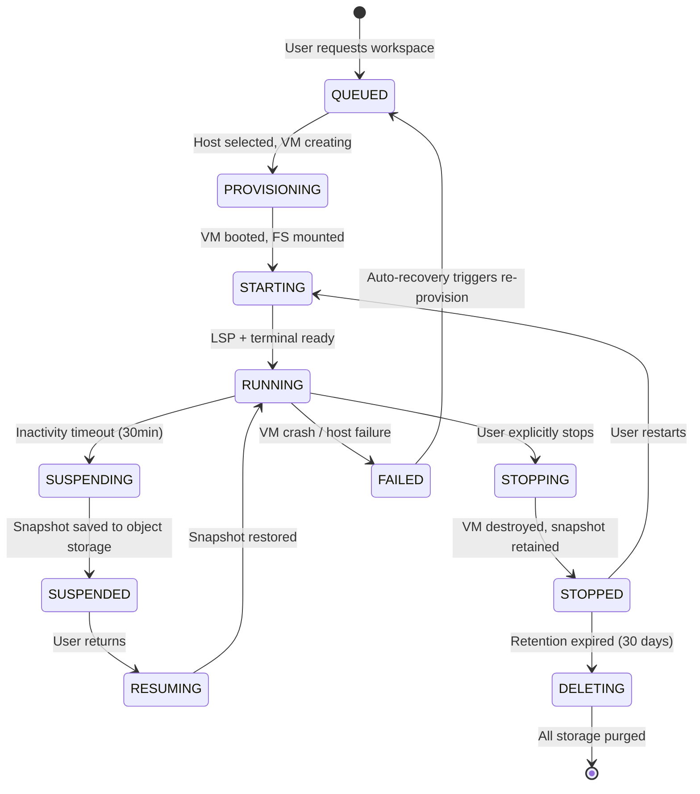
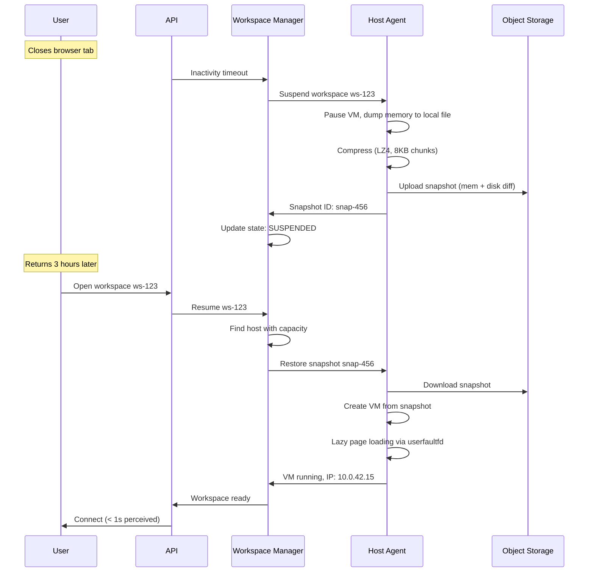
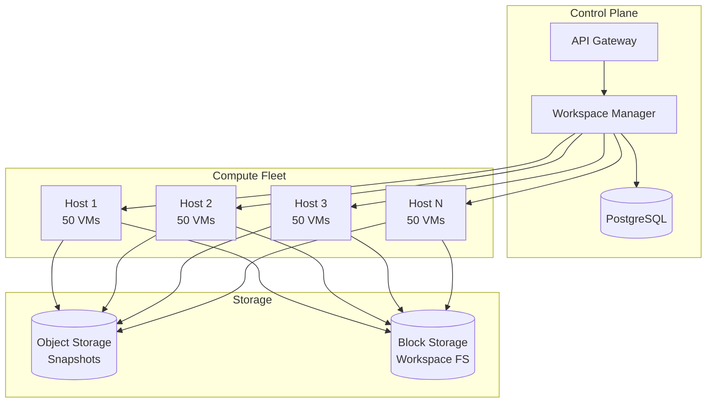
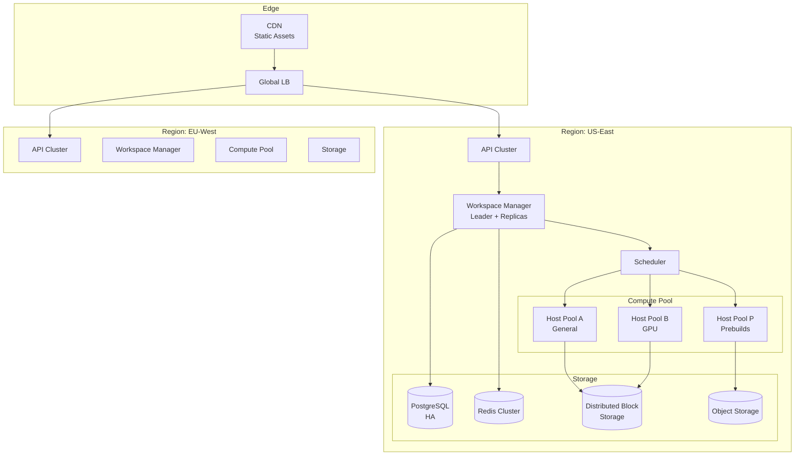
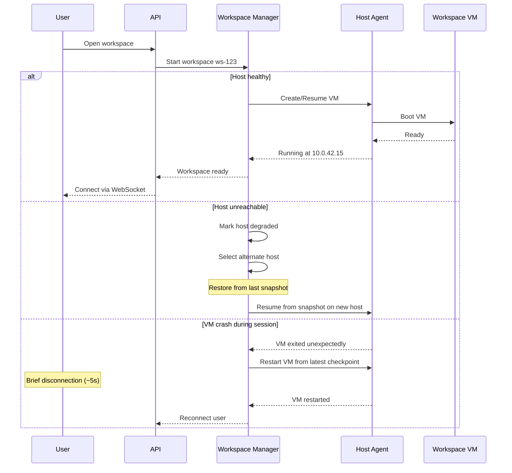

# System Design: Online IDE

## From Monaco Editor to Multi-Tenant Code Execution — A Staff Engineer's Guide

---

## Table of Contents

1. [The Problem & Why It's Hard](#1-the-problem--why-its-hard)
2. [Requirements & Scope](#2-requirements--scope)
3. [Single Machine / Naive Solution](#3-phase-1-single-machine-solution)
4. [Why Naive Fails (The Math)](#4-why-naive-fails-the-math)
5. [Distributed Architecture](#5-phase-2-distributed-architecture)
6. [Core Component Deep Dives](#6-core-component-deep-dives)
7. [The Scaling Journey](#7-the-scaling-journey)
8. [Failure Modes & Resilience](#8-failure-modes--resilience)
9. [Data Model & Storage](#9-data-model--storage)
10. [Observability & Operations](#10-observability--operations)
11. [Design Trade-offs](#11-design-trade-offs)
12. [Common Interview Mistakes](#12-common-interview-mistakes)
13. [Interview Cheat Sheet](#13-interview-cheat-sheet)

---

## 1. The Problem & Why It's Hard

"Design an online IDE" sounds like a frontend problem. Build a code editor in the browser, let users type code, run it on a server. Ship it.

Here's the trap: the editor is the easiest part. Monaco (VS Code's editor component) is open source. You can embed it in a weekend. The hard parts are everything behind the editor:

- **Running arbitrary, untrusted code** on your infrastructure without letting users mine crypto, attack other tenants, or escape the sandbox
- **Providing a full development environment** — not just a REPL, but file systems, package managers, build tools, language servers, terminals, and port forwarding
- **Keeping it fast** — developers will abandon a cloud IDE the moment it feels slower than their local machine

> **The interviewer's real question**: Can you design a multi-tenant compute platform that provides strong isolation guarantees while maintaining sub-second responsiveness — and do it at a cost that makes the business viable?

The real challenge isn't "build a text editor." It's "build a secure, multi-tenant, stateful compute platform where every tenant runs arbitrary code and expects the experience of a local machine."

> **Staff+ Signal:** The key architectural tension in any online IDE is the isolation-latency tradeoff. VM-level isolation (Firecracker, QEMU) gives you strong security boundaries but cold starts measured in seconds. Container-level isolation (Docker, gVisor) starts faster but with weaker security guarantees. The choice here cascades into every other design decision — storage architecture, networking model, resource scheduling, and cost structure. Get this wrong and you'll either have security incidents or users leaving because it's too slow.

---

## 2. Requirements & Scope

### Functional Requirements

- **Code editing**: Syntax highlighting, autocomplete (LSP-based), multi-file project support
- **Code execution**: Run, build, and debug in any supported language/runtime
- **Terminal access**: Full shell access within the workspace
- **File management**: Persistent file system with project structure
- **Collaboration**: Real-time collaborative editing (Google Docs-style)
- **Environment configuration**: Reproducible dev environments (Dockerfiles, Nix, devcontainers)
- **Port forwarding**: Access web apps running inside the workspace from the browser
- **Git integration**: Clone, commit, push from within the IDE

### Non-Functional Requirements

| Requirement | Target | Rationale |
|---|---|---|
| Workspace startup (cold) | < 30s | Developer tolerance threshold before abandonment |
| Workspace startup (warm/prebuild) | < 5s | Competitive with local "open folder" |
| Keystroke latency (editor) | < 50ms | Imperceptible typing lag requires local-first rendering |
| Code execution start | < 2s | Near-instant feedback loop for iterative development |
| Availability | 99.9% | Developers blocked = entire team blocked |
| Isolation | VM-equivalent | Users run arbitrary code; container escapes are well-documented |

### Scale Estimation (Back-of-Envelope)

```
Target users:              1M registered developers
Daily active users:        100K (10% DAU)
Concurrent workspaces:     20K peak (20% of DAU active at any moment)
Avg workspace lifetime:    4 hours active, up to 30 days idle
Storage per workspace:     5GB avg (source + dependencies + toolchains)
Memory per workspace:      2-8GB (language-dependent)
CPU per workspace:         2 vCPUs avg, bursts to 4

Compute:
  20K concurrent × 2 vCPUs = 40K vCPUs at peak
  40K vCPUs ÷ 96 vCPUs/host = ~420 physical hosts minimum

Storage:
  1M users × 5GB = 5PB total workspace storage
  But only 100K active/day → hot storage for active, cold for idle
  Active: 100K × 5GB = 500TB hot storage
  Idle: 900K × 5GB = 4.5PB cold/archive storage

Network:
  Editor traffic: ~1KB/keystroke × 100 keystrokes/min = 100KB/min/user (negligible)
  Build/download traffic: bursts to 100MB+ during npm install/pip install
  Port forwarding: up to 50Mbps per workspace during web dev
```

---

## 3. Phase 1: Single Machine Solution

The simplest online IDE: a web server that spawns Docker containers on a single beefy machine.

```
┌─────────────────────────────────────────────┐
│                  Browser                     │
│  ┌─────────────────────────────────────┐    │
│  │         Monaco Editor (JS)          │    │
│  └──────────────┬──────────────────────┘    │
└─────────────────┼───────────────────────────┘
                  │ WebSocket
┌─────────────────┼───────────────────────────┐
│  Single Server  │                            │
│  ┌──────────────┴──────────────────────┐    │
│  │          Workspace Manager           │    │
│  │   (spawns/manages containers)        │    │
│  └──┬──────────┬───────────┬───────────┘    │
│     │          │           │                 │
│  ┌──┴───┐  ┌──┴───┐  ┌───┴────┐            │
│  │ WS 1 │  │ WS 2 │  │ WS 3   │            │
│  │Docker │  │Docker │  │Docker  │            │
│  │ +LSP  │  │ +LSP  │  │ +LSP   │            │
│  └───┬───┘  └───┬───┘  └───┬────┘            │
│      └──────────┴───────────┘                │
│              Local Disk                      │
│         (bind-mounted volumes)               │
└──────────────────────────────────────────────┘
```

**How it works:**
1. User opens IDE → server spawns a Docker container with their language runtime
2. Monaco editor in browser connects via WebSocket to the container's terminal + LSP server
3. File changes write directly to bind-mounted volumes on host disk
4. Port forwarding: nginx reverse proxy routes `user-port.ide.example.com` to the container

**When Phase 1 works:**
- Small team (< 50 concurrent users)
- Internal dev tool
- Educational platform with lightweight exercises (LeetCode-style)

**When Phase 1 fails:** See next section.

---

## 4. Why Naive Fails (The Math)

### Resource Exhaustion

```
Single server: 96 vCPUs, 384GB RAM, 4TB NVMe

Per workspace:  2 vCPUs, 4GB RAM, 5GB disk
Max workspaces: min(96/2, 384/4, 4000/5) = min(48, 96, 800) = 48 concurrent

At 48 concurrent users, a $15K/month bare metal server is full.
Cost per concurrent workspace: $312/month

Target: 20K concurrent → need 420 servers just for compute
Single-server approach: you're managing 420 independent machines with no orchestration.
```

### Isolation Failure

Docker containers share a kernel. A single `CVE-2024-21626` (runc container escape) means every workspace on that host is compromised. For an IDE where users run arbitrary code:

```
Attack surface of Docker container:
  - Shared kernel (1 vulnerability = all tenants compromised)
  - Default capabilities allow many privilege escalations
  - /proc and /sys filesystem leaks host information
  - Network namespace escape via CVE is periodically discovered

Compare to Firecracker microVM:
  - Separate kernel per VM
  - Hardware-enforced isolation (KVM/VT-x)
  - ~150 syscalls exposed (vs ~300+ for containers)
  - Memory overhead: <5MB per VM
```

### Cold Start Problem

```
Docker container start:         1-3s (image cached)
Docker container start:         15-45s (pulling image)
Full dev environment setup:     2-10 minutes
  └─ npm install (node_modules): 30s-3min
  └─ pip install (venv):         20s-2min
  └─ Language server startup:    5-15s
  └─ Build toolchain init:       10-30s

User expectation:               < 5 seconds

Gap: 2-10 minutes vs. 5 seconds = 24x-120x too slow
```

| Bottleneck | Single Machine | Distributed Fix |
|---|---|---|
| Compute capacity | 48 concurrent max | Horizontal scaling across host fleet |
| Security isolation | Shared kernel (container) | microVM per workspace (Firecracker) |
| Cold start latency | Minutes (image pull + setup) | Prebuilds + snapshot/resume (seconds) |
| Storage | Local disk, no redundancy | Distributed FS with replication |
| Availability | Single point of failure | Multi-host with live migration |

**The tipping point**: The moment you have more than one untrusted user running arbitrary code, Docker containers on a single machine are both a security liability and a scaling dead-end.

---

## 5. Phase 2+: Distributed Architecture

**The key architectural insight**: Separate the editor (stateless, latency-sensitive) from the workspace runtime (stateful, compute-intensive), and treat workspaces as disposable VMs that can be snapshotted, resumed, and migrated.



### How Real Companies Built This

#### GitHub Codespaces — Docker-in-VM with Prebuilds

GitHub Codespaces runs each workspace as a Docker container inside a dedicated VM. This gives the familiar devcontainer experience while maintaining VM-level isolation between users. Their key innovation is **prebuild pools**: when you push to a repo with a devcontainer config, Codespaces pre-provisions a ready-to-go environment. This slashed workspace start times from **45 minutes to ~10 seconds**.

When GitHub migrated their own engineering team to Codespaces, they discovered 14 years of macOS-specific assumptions baked into their tooling. They also migrated from Intel to AMD hosts, achieving ~50% cost savings — a reminder that IDE infrastructure cost optimization is an ongoing concern, not a one-time decision.

**War story**: In September 2025, a network relay exhaustion incident caused unrecoverable data loss for ~2,000 Codespaces users. Workspace storage was not replicated off-host, so when the relay failed, pending writes were lost permanently.

#### Gitpod — The Kubernetes Exodus

Gitpod spent 6 years building their cloud IDE on Kubernetes, serving 1.5 million users. Then they wrote a blog post titled "We're Leaving Kubernetes" and built **Gitpod Flex** from scratch in 10 months. Their reasons are the most detailed public post-mortem of K8s limitations for workspace workloads:

- **CPU scheduling**: K8s CPU throttling via CFS caused unpredictable latency spikes during typing. CFS bandwidth control doesn't distinguish "typing in an editor" from "running a build."
- **Memory**: Overcommitting memory (standard practice in K8s) is dangerous when workspaces run arbitrary code. A single user's `npm install` can OOM-kill other workspaces on the same node.
- **Storage**: Persistent Volumes in K8s are tied to a single availability zone. Pod rescheduling across AZs meant losing data.
- **Security**: Running developer workspaces required root inside containers, which conflicts with K8s security models. Every CRI vulnerability was a potential multi-tenant escape.

> **Staff+ Signal:** Gitpod's experience reveals a critical architectural lesson: Kubernetes was designed for stateless microservices with predictable resource profiles. Developer workspaces are the opposite — stateful, bursty, security-sensitive, and storage-heavy. Forcing workspace workloads into K8s abstractions creates friction at every layer. The correct compute substrate is purpose-built VM orchestration, not general-purpose container orchestration.

#### CodeSandbox — Firecracker MicroVMs with Snapshot/Resume

CodeSandbox built the most technically impressive workspace infrastructure publicly documented. Their numbers:

- **250K microVMs created per month**, **2.5M resumes per month**
- Clone a running VM in **< 2 seconds**
- Resume a suspended VM in **400ms average**
- 16GB VM memory compresses to **1.5GB snapshot** using 8KB chunked LZ4 compression
- Memory decompression is done lazily — pages are loaded on demand via userfaultfd

Their key insight: **don't destroy workspaces, hibernate them.** When a user closes their browser tab, the VM is snapshotted (memory + disk state) and suspended. When they return, the snapshot is restored faster than a cold boot. This eliminates cold starts entirely for returning users.

#### Replit — Containers with Custom Filesystem

Replit takes a different approach: Linux containers on GCE VMs with a custom infrastructure layer called "Goval." They store 300M+ repositories and recently built a custom filesystem called "Margarine" using Nix and Tvix FUSE mounts to compress 16TB of toolchains down to 1.2TB. Their snapshot engine was specifically designed for AI agent safety — enabling instant filesystem forks so AI-generated changes can be reviewed before committing.

### Key Data Structure: Workspace State Machine

The workspace lifecycle is the central coordination primitive:

```json
{
  "workspace_id": "ws-a1b2c3d4",
  "owner_id": "user-xyz",
  "repo_url": "https://github.com/user/project",
  "state": "RUNNING",
  "compute": {
    "host_id": "host-42",
    "vm_id": "fc-9876",
    "cpu_cores": 2,
    "memory_mb": 4096,
    "gpu": null
  },
  "storage": {
    "root_snapshot_id": "snap-prebuild-abc",
    "current_layer_id": "layer-def456",
    "total_size_bytes": 5368709120
  },
  "networking": {
    "internal_ip": "10.0.42.15",
    "forwarded_ports": [3000, 8080],
    "preview_urls": {
      "3000": "ws-a1b2c3d4-3000.preview.ide.example.com"
    }
  },
  "prebuild_id": "pb-latest-main",
  "last_activity_at": "2025-01-15T10:30:00Z",
  "created_at": "2025-01-15T08:00:00Z"
}
```

---

## 6. Core Component Deep Dives

### 6.1 Workspace Manager

**Responsibilities:**
- Lifecycle management: create, start, stop, snapshot, resume, delete workspaces
- Placement decisions: which host gets the new workspace
- Prebuild orchestration: trigger prebuilds on git push, maintain warm pools
- Resource accounting: track CPU/memory/storage usage per user and per workspace



The workspace manager must handle state transitions atomically. A crash during `SUSPENDING` → `SUSPENDED` could leave a workspace with a partial snapshot and a destroyed VM — data loss.

> **Staff+ Signal:** The prebuild system is where workspace managers earn their complexity budget. Naive approach: start a fresh container and run `npm install` every time. Production approach: on every push to `main`, a background job creates a fully-initialized workspace snapshot (dependencies installed, build cached, LSP index warmed). New workspaces are forked from this snapshot. GitHub Codespaces reduced start time from 45 minutes to 10 seconds with this pattern. The organizational implication: you now need a CI/CD-like pipeline just for development environments, with its own monitoring, capacity planning, and failure modes.

### 6.2 Compute Isolation Layer (Firecracker microVMs)

**Responsibilities:**
- Strong multi-tenant isolation (hardware-enforced via KVM)
- Fast boot times (~125ms for bare VM)
- Minimal resource overhead (<5MB memory per VM)
- Snapshot/restore for suspend/resume

**Why Firecracker over alternatives:**

| Approach | Boot Time | Isolation | Memory Overhead | Use Case |
|---|---|---|---|---|
| Docker containers | 1-3s | Weak (shared kernel) | ~10MB | Trusted workloads only |
| gVisor | 1-3s | Medium (user-space kernel) | ~50MB | Google Cloud Run (JS/Python) |
| Kata Containers | 2-5s | Strong (VM-backed OCI) | ~30MB | K8s with VM isolation |
| Firecracker microVM | ~125ms | Strong (KVM) | <5MB | AWS Lambda, CodeSandbox |
| QEMU full VM | 5-30s | Strong (KVM) | ~100MB | Traditional VMs |

Firecracker was built by AWS for Lambda — it strips QEMU's 2 million lines of C down to ~50K lines of Rust, removing device emulation (no GPU, no USB, no PCI passthrough) in exchange for a minimal attack surface and sub-second boot.

**Snapshot/Resume Flow:**



> **Staff+ Signal:** The snapshot contains the entire VM memory state — including whatever the user had running (web servers, databases, build processes). On resume, all processes pick up exactly where they left off. This is the killer feature that makes cloud IDEs feel local: you don't lose context. But it means snapshot corruption = total workspace loss. You need checksums on every snapshot chunk and the ability to fall back to a "last known good" snapshot if the latest is corrupted. CodeSandbox stores snapshots with LZ4 compression in 8KB chunks specifically so a single corrupted chunk doesn't invalidate the entire 1.5GB snapshot.

### 6.3 Collaboration Service (CRDT Engine)

**Responsibilities:**
- Merge concurrent edits from multiple users editing the same file
- Maintain consistent document state across all participants
- Handle offline edits and network partitions gracefully
- Provide cursor/selection awareness for all participants

**OT vs. CRDT Decision:**

| Factor | OT (Operational Transform) | CRDT (Conflict-free Replicated Data Types) |
|---|---|---|
| Consistency model | Centralized server transforms operations | Mathematically guaranteed convergence |
| Latency | Client → server → all clients | Apply locally first, sync async |
| Offline support | Poor (needs server) | Excellent (merge on reconnect) |
| Complexity | Transform functions are subtle and error-prone | Tombstone metadata accumulates |
| Production examples | Google Docs | Figma, Zed, Apple Notes |

For an online IDE, **CRDT is the better choice** because:
1. Code editing has simpler structure than rich text (no formatting, just characters and lines)
2. Users expect local-first responsiveness — edits must appear instantly, not after a server round-trip
3. The workspace is already on a remote server, so the CRDT sync can be co-located with storage

**Yjs** is the production-ready CRDT library with integrations for Monaco (the VS Code editor) and CodeMirror, handling millions of operations in benchmarks.

### 6.4 Language Server Protocol (LSP) Proxy

**Responsibilities:**
- Run language servers inside the workspace VM (co-located with user code)
- Proxy LSP JSON-RPC messages between the browser editor and the in-VM language server
- Handle language server crashes and restarts transparently
- Support multiple languages simultaneously in a single workspace

```
Browser (Monaco) ──LSP JSON-RPC──> API Gateway ──WebSocket──> Host Agent ──> VM
                                                                            │
                                                                   ┌────────┴────────┐
                                                                   │  tsserver (TS)   │
                                                                   │  pylsp (Python)  │
                                                                   │  rust-analyzer   │
                                                                   └─────────────────┘
```

LSP servers **must** run inside the workspace VM, not on a shared server. They need access to the project's file system, installed dependencies, and build output to provide accurate completions. A shared LSP server would need to understand every user's project structure — impossible at scale.

---

## 7. The Scaling Journey

### Stage 1: Single Host (0–50 concurrent users)

```
┌──────────────────────────────────┐
│           Single Host            │
│  ┌────┐ ┌────┐ ┌────┐ ┌────┐   │
│  │VM 1│ │VM 2│ │VM 3│ │...50│  │
│  └────┘ └────┘ └────┘ └────┘   │
│         Local NVMe Disk          │
│         Host Agent               │
│         nginx (port forwarding)  │
└──────────────────────────────────┘
```

Everything on one machine. Workspace Manager is a single process. Storage is local disk. Good enough for a prototype or internal tool.

**Limit**: 50 concurrent workspaces per host (96 vCPU machine). No redundancy — host failure kills all workspaces.

### Stage 2: Multi-Host with Central Control (50–5K concurrent)



**New capabilities:**
- Scheduler places workspaces on hosts based on resource availability
- Snapshots stored in object storage (survive host failure)
- Prebuilds run on dedicated hosts, snapshots distributed to compute hosts

**Limit**: Workspace Manager is a single point of failure. Scheduler makes suboptimal placements without real-time host metrics. Storage is still host-local with snapshots as backup — resume after host failure takes minutes, not seconds.

### Stage 3: Production Scale (5K–50K+ concurrent)



**New capabilities:**
- Multi-region deployment with workspace affinity to nearest region
- Host pools segmented by capability (general, GPU, prebuild)
- Distributed block storage (workspace FS survives host failure without snapshot restore)
- Redis for hot metadata (workspace state, routing tables)
- Warm pools: pre-booted VMs ready for instant assignment

> **Staff+ Signal:** At this stage, the organizational structure matters as much as the architecture. You need separate teams for: (1) the control plane (workspace lifecycle, scheduling), (2) the compute plane (host agent, VM management, Firecracker), (3) the storage plane (block storage, snapshots), and (4) the editor/frontend. These map naturally to failure domains — a storage team incident shouldn't require compute team on-call to diagnose. Conway's Law works in your favor here: the service boundaries match the team boundaries.

---

## 8. Failure Modes & Resilience

### Request Flow with Failure Handling



### Failure Scenarios

| Failure | Detection | Recovery | Blast Radius | User Experience |
|---|---|---|---|---|
| VM crash | Host agent detects process exit | Restart VM from last checkpoint | Single workspace | 5-10s reconnection |
| Host failure | Heartbeat timeout (30s) | Re-provision workspaces on healthy hosts from snapshots | All workspaces on host (up to 50) | 30-60s workspace recovery |
| Control plane down | Health check failures | Existing workspaces continue running; new starts fail | No running workspaces affected | Cannot create/stop workspaces |
| Storage failure | I/O errors in VMs | Fall back to local host cache; degrade to read-only | All workspaces on affected storage node | Data may be stale |
| Network partition | Split-brain detection | Workspace continues locally; reconcile on reconnect | Workspaces on partitioned segment | Collaboration pauses |
| Snapshot corruption | Checksum validation | Fall back to previous snapshot; rebuild from git if needed | Single workspace | Lose unsaved changes since last good snapshot |

> **Staff+ Signal:** The most dangerous failure mode is **silent data loss during suspend**. A workspace is suspended (VM memory dumped to snapshot), the host is decommissioned, and later the user resumes — but the snapshot was partially written due to a disk error during suspend. The VM boots from a corrupted memory image, and data structures are in an inconsistent state. File system journaling catches disk-level corruption, but in-memory state (open file handles, unsaved editor buffers) is simply gone. Mitigation: always checkpoint to object storage with end-to-end checksums and maintain a "last known good" snapshot lineage. GitHub Codespaces learned this the hard way in September 2025.

### The Noisy Neighbor Problem

```
Host with 50 workspaces:
  - User A: idle (reading docs)         → 0.1 vCPU, 500MB RAM
  - User B: running npm install          → 4 vCPU burst, 6GB RAM
  - User C: compiling Rust project       → 8 vCPU burst, 4GB RAM

Total burst demand: 12.1 vCPU on a 2 vCPU allocation
```

Without proper resource limits, User B's `npm install` degrades User A's typing latency. Solutions:
1. **CPU pinning**: Dedicate physical cores to each VM (wasteful but deterministic)
2. **CPU cgroup limits with burst**: Allow short bursts above baseline, throttle sustained overuse
3. **Memory ballooning**: Firecracker's balloon device can reclaim unused memory from idle VMs
4. **Placement anti-affinity**: Don't schedule two heavy workspaces on the same host

---

## 9. Data Model & Storage

### Core Tables

```sql
CREATE TABLE workspaces (
    id              UUID PRIMARY KEY DEFAULT gen_random_uuid(),
    owner_id        UUID NOT NULL REFERENCES users(id),
    repo_url        TEXT,
    branch          TEXT DEFAULT 'main',
    state           VARCHAR(20) NOT NULL DEFAULT 'QUEUED',
    host_id         UUID REFERENCES hosts(id),
    vm_id           VARCHAR(64),
    cpu_cores       INT NOT NULL DEFAULT 2,
    memory_mb       INT NOT NULL DEFAULT 4096,
    prebuild_id     UUID REFERENCES prebuilds(id),
    last_activity   TIMESTAMPTZ DEFAULT NOW(),
    created_at      TIMESTAMPTZ DEFAULT NOW(),

    CONSTRAINT valid_state CHECK (state IN (
        'QUEUED', 'PROVISIONING', 'STARTING', 'RUNNING',
        'SUSPENDING', 'SUSPENDED', 'RESUMING',
        'STOPPING', 'STOPPED', 'FAILED', 'DELETING'
    ))
);

CREATE INDEX idx_workspaces_owner ON workspaces(owner_id);
CREATE INDEX idx_workspaces_state ON workspaces(state) WHERE state IN ('RUNNING', 'SUSPENDED');
CREATE INDEX idx_workspaces_host ON workspaces(host_id) WHERE host_id IS NOT NULL;

CREATE TABLE hosts (
    id              UUID PRIMARY KEY DEFAULT gen_random_uuid(),
    region          VARCHAR(20) NOT NULL,
    pool            VARCHAR(20) NOT NULL DEFAULT 'general',
    total_cpu       INT NOT NULL,
    total_memory_mb INT NOT NULL,
    used_cpu        INT NOT NULL DEFAULT 0,
    used_memory_mb  INT NOT NULL DEFAULT 0,
    status          VARCHAR(20) NOT NULL DEFAULT 'ACTIVE',
    last_heartbeat  TIMESTAMPTZ DEFAULT NOW(),

    CONSTRAINT valid_pool CHECK (pool IN ('general', 'gpu', 'prebuild'))
);

CREATE TABLE snapshots (
    id              UUID PRIMARY KEY DEFAULT gen_random_uuid(),
    workspace_id    UUID NOT NULL REFERENCES workspaces(id),
    type            VARCHAR(20) NOT NULL,
    storage_url     TEXT NOT NULL,
    size_bytes      BIGINT NOT NULL,
    checksum        VARCHAR(64) NOT NULL,
    parent_id       UUID REFERENCES snapshots(id),
    created_at      TIMESTAMPTZ DEFAULT NOW(),

    CONSTRAINT valid_type CHECK (type IN ('FULL', 'INCREMENTAL', 'PREBUILD'))
);

CREATE INDEX idx_snapshots_workspace ON snapshots(workspace_id, created_at DESC);

CREATE TABLE prebuilds (
    id              UUID PRIMARY KEY DEFAULT gen_random_uuid(),
    repo_url        TEXT NOT NULL,
    branch          TEXT NOT NULL DEFAULT 'main',
    commit_sha      VARCHAR(40) NOT NULL,
    snapshot_id     UUID REFERENCES snapshots(id),
    status          VARCHAR(20) NOT NULL DEFAULT 'BUILDING',
    build_log_url   TEXT,
    created_at      TIMESTAMPTZ DEFAULT NOW(),

    CONSTRAINT valid_status CHECK (status IN ('BUILDING', 'READY', 'FAILED', 'EXPIRED'))
);

CREATE UNIQUE INDEX idx_prebuilds_repo_branch ON prebuilds(repo_url, branch, commit_sha);

CREATE TABLE port_forwards (
    id              UUID PRIMARY KEY DEFAULT gen_random_uuid(),
    workspace_id    UUID NOT NULL REFERENCES workspaces(id),
    port            INT NOT NULL,
    visibility      VARCHAR(10) NOT NULL DEFAULT 'private',
    preview_url     TEXT NOT NULL,

    CONSTRAINT valid_visibility CHECK (visibility IN ('private', 'org', 'public')),
    UNIQUE(workspace_id, port)
);
```

### Storage Engine Choice

| Engine | Strength | Used For |
|---|---|---|
| PostgreSQL | ACID, complex queries | Workspace metadata, user data, prebuilds |
| Redis | Speed, TTL, pub/sub | Workspace routing (host→VM mapping), session state, collaboration presence |
| Object Storage (S3) | Durability, cost | VM snapshots, prebuild images, large artifacts |
| Block Storage (EBS/PD) | Consistent I/O, snapshots | Active workspace file systems |
| etcd | Consistency, leader election | Scheduler coordination, host fleet membership |

### Workspace File System Architecture

```
Object Storage (S3)
  └─ Prebuild snapshot: base image + dependencies (read-only layer)

Block Storage (per workspace)
  └─ CoW overlay: user's changes on top of prebuild
  └─ Mounted as root FS inside Firecracker VM

On suspend:
  Memory → LZ4 compressed → Object Storage
  Block diff → Incremental snapshot → Object Storage

On resume:
  Base prebuild (cached on host) + block diff + memory snapshot → Running VM
```

> **Staff+ Signal:** The storage architecture is a layered cake: immutable prebuild base → copy-on-write user layer → incremental snapshots. This is analogous to Docker's overlay filesystem but at the block device level. The key operational insight: prebuild snapshots should be cached on every host in a region (they're shared across users), while user layers are workspace-specific. Pre-caching prebuilds reduces resume time from "download 2GB snapshot" to "download 50MB user diff."

---

## 10. Observability & Operations

### Key Metrics

**Workspace Lifecycle:**
- `workspace_start_duration_seconds{type="cold|warm|prebuild"}` — time from user click to ready. SLO: p99 < 30s cold, < 5s prebuild. Alert if p95 exceeds 15s/3s.
- `workspace_suspend_duration_seconds` — time to snapshot and suspend. Alert if > 30s (risk of data loss on host failure).
- `workspace_resume_duration_seconds` — time from resume to interactive. The metric users feel most.
- `workspace_count{state="RUNNING|SUSPENDED|FAILED"}` — fleet state. Alert if FAILED > 1% of total.

**Compute Health:**
- `host_workspace_count` — workspaces per host. Alert if > 45 (approaching 50-workspace limit).
- `host_cpu_utilization` — per-host CPU. Alert sustained > 85% (noisy neighbor risk).
- `host_memory_pressure` — OOM risk indicator. Alert if any host has < 2GB free.
- `vm_cpu_steal_percent` — measures noisy neighbor impact. Alert if > 10%.

**User Experience:**
- `editor_keystroke_latency_ms` — measured browser-side. SLO: p99 < 100ms. This is the single most important UX metric.
- `lsp_completion_latency_ms` — time for autocomplete to appear. SLO: p99 < 500ms.
- `terminal_output_latency_ms` — time for command output to render. SLO: p99 < 200ms.
- `collaboration_sync_lag_ms` — time for edit to appear on collaborator's screen.

### Distributed Tracing: Workspace Start

```
[API Gateway]          2ms   → Parse request, authenticate
  └─[Workspace Manager] 5ms  → Look up workspace state, check quotas
    └─[Scheduler]       10ms  → Find optimal host, check capacity
      └─[Host Agent]    50ms  → Download snapshot layers
        └─[Firecracker] 125ms → Boot microVM from snapshot
          └─[Init]      200ms → Mount FS, start LSP, open terminal
            └─[Ready]   ✓     → WebSocket connection established
                              Total: ~392ms (warm resume)
```

### Alerting Strategy

| Alert | Condition | Severity | Action |
|---|---|---|---|
| High start failure rate | > 5% workspace starts fail for 5min | P1 | Page on-call; likely host fleet or storage issue |
| Elevated keystroke latency | p99 > 200ms for 10min | P1 | Check host CPU steal, network latency, WebSocket proxy |
| Host heartbeat missing | No heartbeat for 60s | P2 | Mark host degraded; trigger workspace evacuation |
| Snapshot save failures | > 1% snapshot saves fail | P2 | Risk of data loss on host failure; check object storage |
| Prebuild backlog growing | Queue depth > 50 for 30min | P3 | Scale prebuild hosts; non-urgent but affects start times |
| Disk space exhaustion | Host disk < 10% free | P2 | Block new workspace placement; trigger garbage collection |

### On-Call Runbook: Mass Workspace Failures

```
1. Check: Are failures localized to one host or region?
   → If one host: drain and investigate. Workspaces auto-recover on other hosts.
   → If region-wide: check block storage service and network.

2. Check: What state are workspaces failing in?
   → PROVISIONING failures: Scheduler or host agent issue
   → STARTING failures: Snapshot corruption or FS mount issue
   → RUNNING failures: VM crash (check dmesg on host for KVM errors)

3. Check: Is object storage accessible?
   → If degraded: all suspend/resume is affected. Extend inactivity timeouts
     to keep VMs running longer (avoid suspends).

4. Communicate: Post to status page if >100 users affected.
```

---

## 11. Design Trade-offs

| Decision | Option A | Option B | Recommended | Why |
|---|---|---|---|---|
| Isolation | Containers (Docker/gVisor) | MicroVMs (Firecracker) | **Firecracker** | Users run arbitrary code. Container escapes are regularly discovered. VM overhead (<5MB) is negligible vs. the security risk. |
| Editor protocol | Full VS Code in browser (code-server) | Thin client + remote protocol | **VS Code in browser** | Industry standard. Users already know it. JetBrains tried a new editor (Fleet) and discontinued it. Don't fight the VS Code ecosystem. |
| Collaboration | OT (central server) | CRDT (Yjs) | **CRDT** | Local-first responsiveness. Works during network partitions. Yjs is battle-tested with Monaco. |
| Workspace lifecycle | Destroy on stop (ephemeral) | Snapshot and suspend | **Snapshot/suspend** | CodeSandbox proved this: 2.5M resumes/month vs 250K creates. Users hate losing context. |
| Storage | Local disk per host | Distributed block storage | **Distributed at scale** | Start with local disk + snapshot backup (cheaper). Move to distributed block storage when you need cross-host resume in <5s. Two-way door. |
| Prebuild trigger | On workspace start | On git push (async) | **On git push** | Shifts latency from user-facing start to background job. 10s start vs 45min start is the difference between adoption and abandonment. |
| Networking | Centralized proxy | Peer-to-peer (DERP/STUN) | **Hybrid** | Proxy for port forwarding (reliable). P2P for terminal/editor traffic (lower latency). Coder achieved 68% latency reduction with P2P. |

> **Staff+ Signal:** The "VS Code in browser vs. custom editor" decision is the highest-leverage trade-off. JetBrains invested years building Fleet as a new cloud-native editor and discontinued it in December 2025. Eclipse Theia built a VS Code-compatible editor from scratch to avoid licensing issues. GitHub, Gitpod, and Coder all chose to embed VS Code directly. The lesson: **don't compete with VS Code on the editor — compete on the infrastructure behind it.** The editor is a commodity; the compute platform is the moat. Fighting the ecosystem on the most visible layer is a losing battle.

**My Take:** If I were building an online IDE today, I'd start with code-server (open source VS Code in browser) on Firecracker microVMs, with Yjs for collaboration. This gives you production-grade editor, strong isolation, and real-time collaboration with minimal custom code. The engineering investment should go into the workspace lifecycle (prebuilds, snapshot/resume, scheduling) — that's where the user experience is won or lost.

---

## 12. Common Interview Mistakes

1. **Spending 20 minutes on the editor UI**: The editor is a solved problem (Monaco/VS Code). Candidates who deep-dive into syntax highlighting or autocomplete UI are missing the forest for the trees. What staff+ candidates say: "I'll use Monaco — it's the industry standard. The interesting design challenge is the compute and isolation layer behind it."

2. **Using plain Docker containers for user code**: This demonstrates a lack of security awareness. When users run arbitrary code, container isolation is insufficient — runc CVEs are discovered regularly. What staff+ candidates say: "I'd use Firecracker microVMs for workspace isolation. The 125ms boot overhead is worth the hardware-enforced isolation boundary."

3. **Ignoring cold start latency**: Designing an IDE where every session requires pulling images and installing dependencies. What staff+ candidates say: "Cold start is the adoption killer. I'd implement a prebuild pipeline that creates warm snapshots on every git push, so workspace start is a snapshot restore, not a fresh install."

4. **Designing only the happy path**: No mention of what happens when a host fails, a VM crashes, or storage becomes unavailable. What staff+ candidates say: "Let me walk through the failure modes: host failure affects up to 50 workspaces. We recover by re-provisioning from snapshots on healthy hosts, targeting < 60s recovery."

5. **Flat architecture at any scale**: Putting all workspaces on one homogeneous host pool. What staff+ candidates say: "I'd segment the compute fleet into pools: general-purpose, GPU-enabled, and dedicated prebuild hosts. Different workloads have different resource profiles, and mixing them causes noisy-neighbor issues."

6. **Ignoring the file system layer**: Treating workspace storage as "just a volume mount." What staff+ candidates say: "The storage architecture is layered: immutable prebuild base, copy-on-write user layer, incremental snapshots. This separation lets us share the base layer across thousands of workspaces and keeps snapshots small."

7. **Choosing Kubernetes reflexively**: "I'd put it on K8s" without considering whether K8s is the right compute substrate. What staff+ candidates say: "Kubernetes was designed for stateless microservices. Developer workspaces are stateful, security-sensitive, and bursty. Gitpod spent 6 years on K8s before abandoning it. I'd use purpose-built VM orchestration instead."

---

## 13. Interview Cheat Sheet

### Time Allocation (45-minute interview)

| Phase | Time | What to Cover |
|---|---|---|
| Clarify requirements | 5 min | Scope (full IDE vs. code playground), scale, isolation requirements, collaboration needs |
| High-level architecture | 10 min | Editor (browser) ↔ Control Plane ↔ Compute Plane ↔ Storage. Explain the editor-runtime split. |
| Deep dive: Isolation & Lifecycle | 12 min | Firecracker choice, workspace state machine, snapshot/resume flow, prebuild pipeline |
| Deep dive: Collaboration or Storage | 8 min | Pick based on interviewer interest. CRDT for collab, layered snapshots for storage. |
| Scaling + Failure modes | 7 min | Multi-host → multi-region progression. Host failure, snapshot corruption, noisy neighbor. |
| Trade-offs + wrap-up | 3 min | Key decisions (VM vs container, VS Code vs custom, prebuild strategy). Questions. |

### Step-by-Step Answer Guide

1. **Clarify**: "Is this a full development environment (like GitHub Codespaces) or a lightweight code playground (like CodePen)? How many concurrent users? Do we need real-time collaboration?" — Scope determines everything.

2. **Key insight**: "The editor is a solved problem — the hard part is multi-tenant code execution with strong isolation and fast startup."

3. **Single machine**: "On a single host, I'd spawn Docker containers per workspace with Monaco as the frontend. This works for ~50 concurrent users."

4. **Prove it fails**: "At scale, Docker containers share a kernel — one CVE compromises all tenants. Cold starts take minutes. A single host caps at 48 workspaces."

5. **Distributed architecture**: "Split into control plane (lifecycle management), compute plane (Firecracker VMs on host fleet), and storage plane (block storage + object storage for snapshots)."

6. **Workspace lifecycle**: "The state machine: QUEUED → PROVISIONING → RUNNING → SUSPENDED → RESUMING → RUNNING. Prebuilds eliminate cold starts. Snapshot/resume eliminates context loss."

7. **Failure handling**: "Host failure: re-provision from snapshots on healthy hosts (< 60s). VM crash: restart from checkpoint (< 10s). Snapshot corruption: fall back to previous snapshot + git as last resort."

8. **Scale levers**: "Prebuild caching, warm VM pools, host pool segmentation, multi-region, distributed block storage."

9. **Trade-offs**: "VM isolation over containers (security). VS Code over custom editor (ecosystem). CRDT over OT (latency). Snapshot/resume over ephemeral (user experience)."

10. **Observe**: "Keystroke latency (p99 < 100ms), workspace start time (p99 < 30s cold / 5s warm), host CPU steal (< 10%), snapshot save success rate (> 99%)."

### What the Interviewer Wants to Hear

- At **L5/Senior**: Can design the basic architecture. Understands editor-runtime split. Mentions containers for isolation.
- At **L6/Staff**: Chooses Firecracker with reasoning. Designs prebuild pipeline and snapshot lifecycle. Identifies noisy neighbor, host failure, and cold start as key challenges. References real production systems.
- At **L7/Principal**: Discusses organizational implications (team boundaries matching service boundaries). Designs migration path from simple to distributed. Considers cost optimization (AMD migration, spot instances for prebuilds). References Gitpod's K8s exodus and JetBrains Fleet's discontinuation as industry lessons.

---

*Written by Michi Meow as a reference for staff-level system design interviews. The best online IDEs feel like magic — but behind the Monaco editor is one of the most complex multi-tenant compute platforms in modern infrastructure.*
