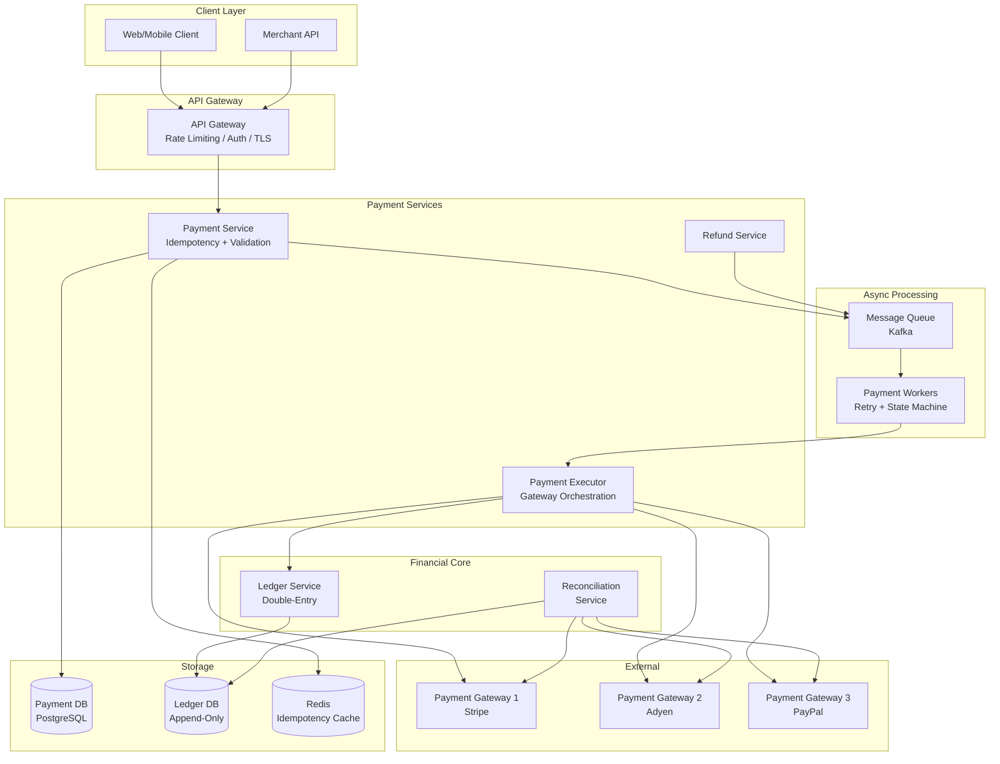
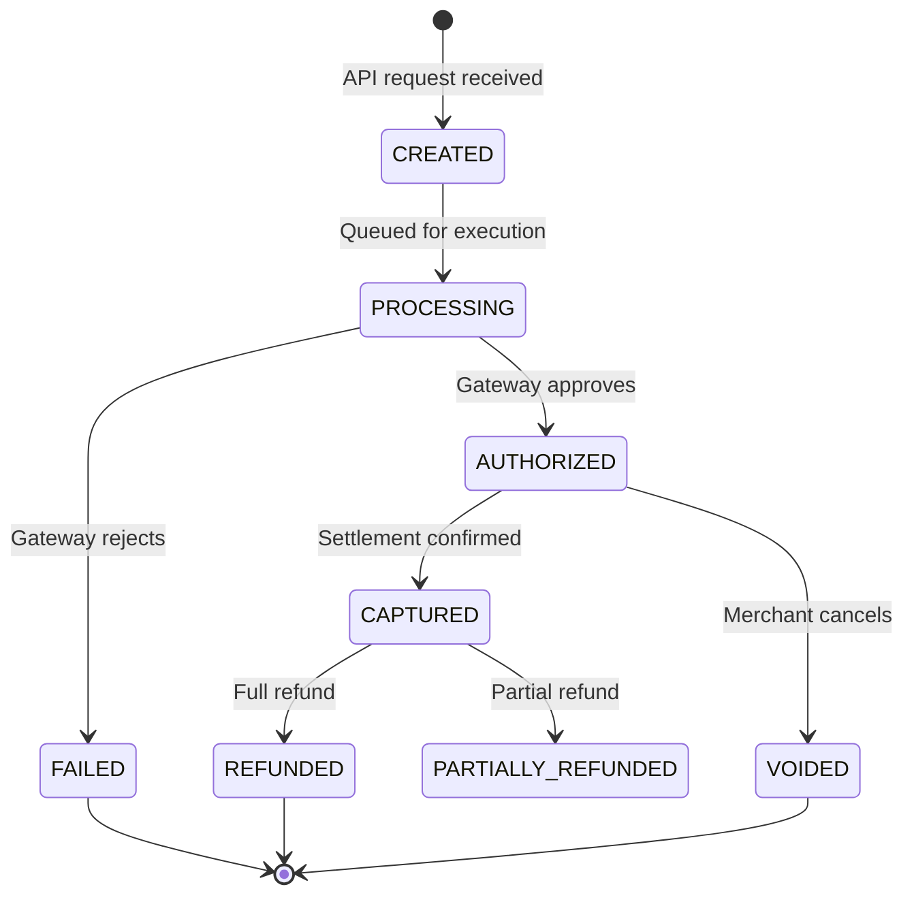
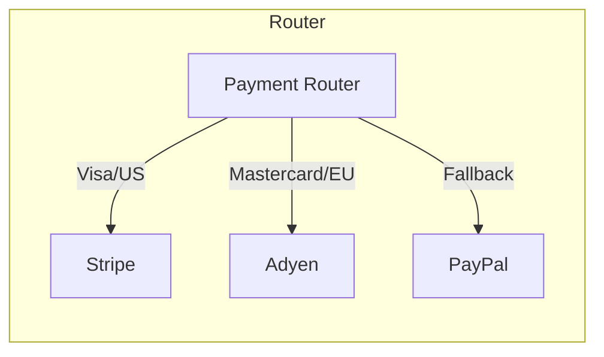
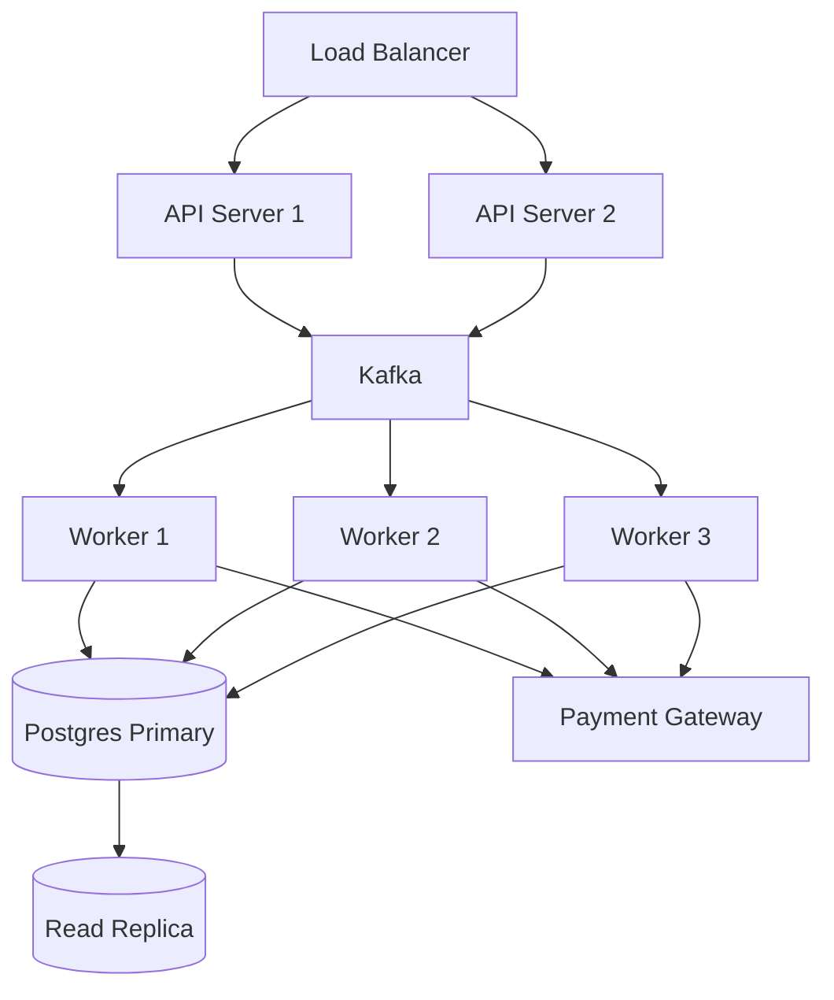
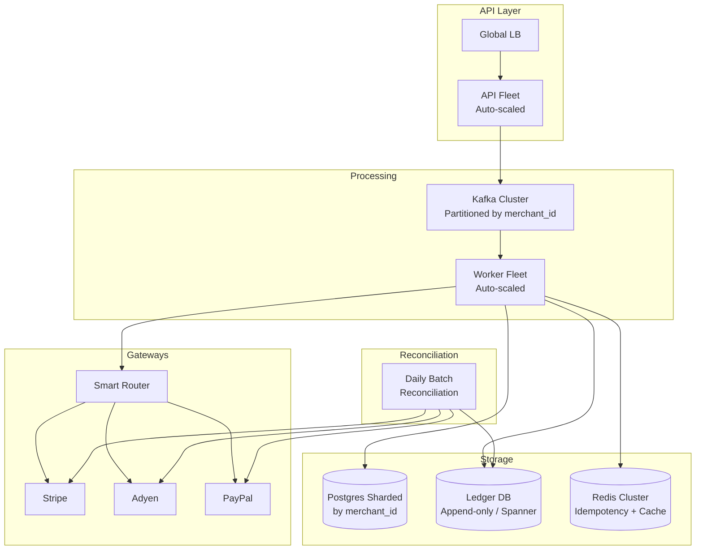
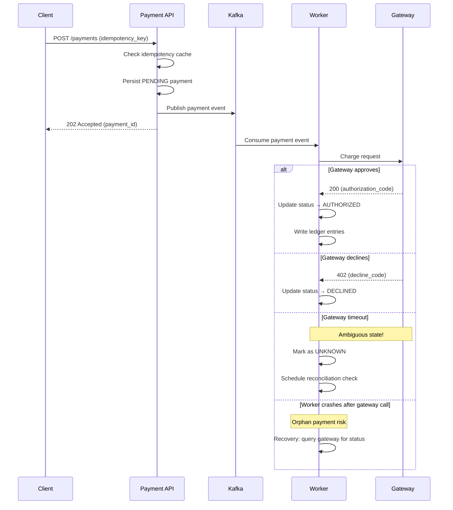

# System Design: Payment System

## A Staff Engineer's Guide — From Single Charge to Global Financial Infrastructure

---

## Table of Contents

1. [The Problem & Why It's Hard](#1-the-problem--why-its-hard)
2. [Requirements & Scope](#2-requirements--scope)
3. [Phase 1: Single Machine Payment Service](#3-phase-1-single-machine-payment-service)
4. [Why Naive Fails (The Math)](#4-why-naive-fails-the-math)
5. [Phase 2+: Distributed Payment Architecture](#5-phase-2-distributed-payment-architecture)
6. [Core Component Deep Dives](#6-core-component-deep-dives)
7. [The Scaling Journey](#7-the-scaling-journey)
8. [Failure Modes & Resilience](#8-failure-modes--resilience)
9. [Data Model & Storage](#9-data-model--storage)
10. [Observability & Operations](#10-observability--operations)
11. [Design Trade-offs](#11-design-trade-offs)
12. [Common Interview Mistakes](#12-common-interview-mistakes)
13. [Interview Cheat Sheet](#13-interview-cheat-sheet)

---

## 1. The Problem & Why It's Hard

"Design a payment system" is one of the most deceptively simple interview prompts. On the surface, it's just "move money from A to B." In reality, it's a distributed systems problem wrapped in financial regulation, constrained by the physics of multi-party networks, and one where every bug has a dollar amount attached to it.

> **The interviewer's real question**: Can you design a system where money is never created, never destroyed, and every transaction is processed exactly once — even when networks fail, services crash, and third-party processors return ambiguous responses?

Why is this hard? Because payment systems live at the intersection of three conflicting demands:

1. **Correctness over availability**: Unlike most systems where eventual consistency is fine, a payment system that double-charges a customer or loses a payment is a business-ending event. You cannot "retry and merge later" like you would with social media posts.

2. **Multi-party coordination**: A single payment touches your system, a payment gateway, a card network (Visa/Mastercard), an issuing bank, and an acquiring bank. You don't control most of these parties, and each has different failure modes, latency characteristics, and idempotency guarantees.

3. **Regulatory surface area**: PCI DSS compliance means you can't just "store the card number in Postgres." Tokenization, encryption at rest, network segmentation, and audit logs aren't optional — they're legal requirements.

> **Staff+ Signal:** The real challenge isn't processing a single payment — it's ensuring consistency across a multi-party financial network where each participant has different failure semantics, and where the cost of a bug is measured in dollars and regulatory penalties, not just user frustration.

---

## 2. Requirements & Scope

### Functional Requirements

- **Pay-in (Collection)**: Accept payments from customers via credit card, debit card, and digital wallets
- **Pay-out (Disbursement)**: Send money to merchants/sellers/partners
- **Refunds**: Full and partial refund processing
- **Payment status tracking**: Real-time status updates for all payment states
- **Ledger**: Maintain an immutable record of all financial transactions
- **Reconciliation**: Automated matching of internal records against external processor statements
- **Multi-currency support**: Handle payments across different currencies with exchange rate management

### Non-Functional Requirements

| Requirement | Target | Rationale |
|---|---|---|
| Latency (p99) | < 500ms for payment initiation | User-facing checkout; higher latency = cart abandonment |
| Throughput | 1,000 TPS steady, 10,000 TPS peak | Holiday shopping spikes (Black Friday is 10x normal) |
| Availability | 99.99% (52 min downtime/year) | Every minute of downtime = lost revenue |
| Consistency | Strong (linearizable for balance operations) | Cannot tolerate stale reads on account balances |
| Durability | Zero data loss | Financial transactions are legally required to be durable |

### Scale Estimation (Back-of-Envelope)

```
Daily transactions:        ~50M (mid-size payment platform)
Peak TPS:                  ~5,000 (holiday spike, 10x average)
Average transaction size:  ~$50
Daily volume:              ~$2.5B
Storage per transaction:   ~2KB (payment record + metadata + audit)
Daily storage:             ~100GB
Annual storage:            ~36TB (before compression)
Ledger entries:            ~200M/day (each payment = ~4 ledger entries)
```

These numbers are modeled after a mid-size platform. For reference, Stripe processed $1.4 trillion in total payment volume in 2024, and Uber's Gulfstream platform handles payments across 70+ countries.

---

## 3. Phase 1: Single Machine Payment Service

In an interview, always start simple. Here's what a minimal payment service looks like:

```
┌─────────────────────────────────────────────────┐
│                  Single Server                   │
│                                                  │
│  ┌──────────┐   ┌──────────┐   ┌──────────────┐ │
│  │  API     │──▶│ Payment  │──▶│  Payment     │ │
│  │  Layer   │   │ Service  │   │  Gateway     │ │
│  └──────────┘   └────┬─────┘   │  (Stripe/    │ │
│                      │         │   Adyen)     │ │
│                      ▼         └──────────────┘ │
│               ┌──────────┐                      │
│               │ Postgres │                      │
│               │ (single) │                      │
│               └──────────┘                      │
└─────────────────────────────────────────────────┘
```

### Pseudocode: Process a Payment

```python
def process_payment(request):
    # 1. Validate input
    validate(request.amount, request.currency, request.payment_method)

    # 2. Check idempotency (critical even in v1)
    existing = db.query(
        "SELECT * FROM payments WHERE idempotency_key = %s",
        request.idempotency_key
    )
    if existing:
        return existing.result

    # 3. Create payment record
    payment = db.execute("""
        INSERT INTO payments (id, amount, currency, status, idempotency_key)
        VALUES (%s, %s, %s, 'PENDING', %s)
    """, new_uuid(), request.amount, request.currency, request.idempotency_key)

    # 4. Call payment gateway
    try:
        result = gateway.charge(payment.id, request.amount, request.token)
        db.execute(
            "UPDATE payments SET status = 'COMPLETED', gateway_ref = %s WHERE id = %s",
            result.reference, payment.id
        )
        return success(payment.id, result.reference)
    except GatewayError as e:
        db.execute(
            "UPDATE payments SET status = 'FAILED', error = %s WHERE id = %s",
            str(e), payment.id
        )
        return failure(payment.id, e)
```

**When does Phase 1 work?** For a startup processing <1,000 transactions/day. Single Postgres instance, single application server, synchronous gateway calls. Simple, debuggable, and correct.

**When does Phase 1 fail?** See next section.

---

## 4. Why Naive Fails (The Math)

The single-machine approach breaks in three distinct ways as scale grows:

### Bottleneck 1: Database Writes

```
At 1,000 TPS:
  - Each payment = 1 INSERT + 1 UPDATE = 2 writes
  - Plus 4 ledger entries = 4 INSERTs
  - Total: 6 writes per payment × 1,000 TPS = 6,000 writes/sec
  - Single Postgres with SSD: ~10,000 write IOPS (with WAL + fsync)
  - Headroom: ~40% — one holiday spike and you're saturated
```

### Bottleneck 2: Gateway Latency

```
Synchronous gateway call:
  - Average latency: 200ms
  - p99 latency: 2,000ms (card networks are slow)
  - Thread pool: 200 threads × (1000ms avg hold time) = 200 concurrent payments
  - At 1,000 TPS: need 1,000 threads → context switching destroys performance
  - Gateway timeout cascade: one slow response blocks a thread for 30s
```

### Bottleneck 3: Availability

```
Single machine MTBF: ~1,000 hours (41 days)
Recovery time: ~5-15 minutes (restart + DB recovery)
Annual downtime: ~2-5 hours
99.99% target: 52 minutes/year → IMPOSSIBLE with single machine
```

| Bottleneck | Single Machine Limit | Distributed Fix |
|---|---|---|
| DB write throughput | ~10K IOPS | Sharded database / separate ledger DB |
| Gateway latency | 200 concurrent (sync) | Async processing with queues |
| Availability | ~99.5% | Multi-AZ with failover |
| Blast radius | Everything fails together | Service isolation |

**The tipping point**: Around 500-1,000 TPS, a single machine payment service starts showing latency spikes during peak hours. By 2,000 TPS, you're either dropping payments or queueing them beyond acceptable latency. This is where most mid-size companies are forced to go distributed.

> **Staff+ Signal:** The first bottleneck that kills you isn't database writes — it's gateway latency variance. A single slow response from Visa (2-5 seconds during their own peak) ties up a thread and cascades into connection pool exhaustion. This is why the first architectural change is almost always decoupling the gateway call from the API response — async processing, not database scaling.

---

## 5. Phase 2+: Distributed Payment Architecture

**The key architectural insight**: Separate the *acceptance* of a payment request (fast, synchronous, user-facing) from the *execution* of the payment (slow, asynchronous, gateway-facing). This is the Pay-in → Process → Settle pipeline, and it mirrors how every major payment company actually works.



### How Real Companies Built This

#### Stripe — Idempotency as a First-Class Primitive

Stripe processes $1.4 trillion annually and has made idempotency a core API design principle. Every mutating API endpoint accepts an `Idempotency-Key` header. Their approach:

- The server saves the resulting status code and body of the first request for any given idempotency key
- Subsequent requests with the same key return the cached result — even if the first request returned a 500 error
- Keys expire after 24 hours
- The idempotency layer compares incoming parameters to the original request, rejecting mismatches to prevent accidental misuse

Stripe's 2022 latency incident is instructive: a metadata write path backed by payment creation hit a database cluster saturation point, causing stalled checkouts and duplicate transactions. The root cause was an unbalanced connection pool — a subtle failure mode that only manifests under specific traffic patterns.

#### Uber — Gulfstream and Double-Entry at Global Scale

Uber's fifth-generation payment platform, Gulfstream, is built on three principles:

1. **Zero-sum processing**: Every payment order results in money movements that sum to zero. A ride collection from the rider equals disbursement to the driver plus Uber's service fee.
2. **Immutable orders**: Orders are processed only after they're persisted, and processed order IDs prevent duplicates.
3. **Versioned change logs**: Every transactional change to a user's payment account is persisted in an entity change log. The system serializes writebacks by version number per user, detecting out-of-sequence events and triggering reconciliation.

Uber runs asynchronous validation jobs every 24 hours, split by country and further by city ID, enabling rapid issue detection during platform rollouts.

#### Square — Books: 20TB on a Team of Three

Square's Books service is an immutable double-entry accounting database built on Google Cloud Spanner. Key design choices:

- **Append-only data model**: Besides the balance field on the `books` table, there are no UPDATE statements — only INSERTs. Corrections require new entries that offset previous ones.
- **Spanner for global distribution**: Eliminated application-level sharding. They replaced monotonically increasing integers with UUIDs to enable horizontal scaling.
- **Cursor sharding**: Used `cursor_shard + commit_timestamp` schema patterns to avoid Spanner hotspots on timestamp-ordered data.
- At time of publication (2019), the system managed ~20TB of data with a team of three engineers.

### Key Data Structure: Idempotency Record

```json
{
  "idempotency_key": "client-generated-uuid-v4",
  "request_hash": "sha256-of-serialized-request-params",
  "payment_id": "pay_8f3a2b1c",
  "status": "COMPLETED",
  "response_code": 200,
  "response_body": "{...cached response...}",
  "created_at": "2025-01-15T10:30:00Z",
  "expires_at": "2025-01-16T10:30:00Z",
  "locked_at": null
}
```

This record is the backbone of retry safety. On every incoming request, the payment service checks Redis for an existing idempotency record before touching the database or calling the gateway. The `request_hash` ensures that a reused key with different parameters is rejected — preventing subtle bugs where a client accidentally reuses a key for a different payment.

---

## 6. Core Component Deep Dives

### 6.1 Payment Service (Coordinator)

**Responsibilities:**
- Accept and validate payment requests
- Enforce idempotency using client-provided keys
- Persist payment intent to the database
- Publish payment events to the message queue
- Return immediate acknowledgment to the client



The state machine above is the heart of the payment service. Every transition is persisted atomically with the payment record — if the process crashes between a gateway response and a database write, the recovery process can determine the correct state by querying the gateway.

> **Staff+ Signal:** The most dangerous state transition is PROCESSING → AUTHORIZED. If your service crashes after the gateway approves but before you persist the authorization, you have an "orphan payment" — money has been charged but your system doesn't know it. Airbnb built a dedicated Orphan Payment Detector that periodically reconciles with the gateway to find and resolve these ghosts. Your design must account for this gap.

### 6.2 Payment Executor (Gateway Orchestration)

**Responsibilities:**
- Route payments to the optimal gateway based on card type, currency, and cost
- Execute the actual charge via gateway API
- Handle gateway-specific response formats and error codes
- Implement retry logic with exponential backoff
- Support gateway failover when primary is down



Gateway routing is a critical optimization point. Different gateways have different approval rates for different card types and regions. A staff-level candidate would note that routing decisions should be data-driven — tracking approval rates per gateway/card-type/region combination and adjusting routing weights accordingly.

> **Staff+ Signal:** Gateway failover sounds simple until you realize that "is the gateway down?" is an ambiguous question. A gateway returning 500 errors for Visa cards but working fine for Mastercard is a *partial* failure. Your circuit breaker needs to be granular — per gateway *per card network* — not a binary "gateway up/down" toggle. This is the difference between losing all Visa transactions for 10 minutes vs. routing them to the backup gateway in 30 seconds.

### 6.3 Ledger Service (Double-Entry Bookkeeping)

**Responsibilities:**
- Record all money movements as balanced journal entries
- Enforce the zero-sum invariant (debits = credits for every entry)
- Provide real-time balance queries
- Maintain immutable audit trail

The ledger implements double-entry bookkeeping — the same system that accountants have used for 500 years, and for good reason. Every transaction creates at least two entries: a debit from one account and a credit to another. The sum of all entries must always be zero.

```
Payment of $100 from Customer → Merchant:

Journal Entry #JE-001:
  ┌───────────────────┬──────────┬──────────┐
  │ Account           │  Debit   │  Credit  │
  ├───────────────────┼──────────┼──────────┤
  │ Customer Wallet   │  $100    │          │
  │ Platform Revenue  │          │  $3      │
  │ Merchant Balance  │          │  $97     │
  └───────────────────┴──────────┴──────────┘
  Sum: $100 - $3 - $97 = $0 ✓
```

### 6.4 Reconciliation Service

**Responsibilities:**
- Match internal ledger records against external gateway settlement files
- Detect discrepancies (missing charges, double charges, amount mismatches)
- Generate exception reports for manual review
- Trigger automated corrections for known discrepancy patterns

Reconciliation is the silent guardian of a payment system. It runs in batch (typically daily), comparing your ledger against every external party's records:

1. **Internal reconciliation**: Payment DB ↔ Ledger DB (do our records agree with each other?)
2. **External reconciliation**: Ledger DB ↔ Gateway settlement files (do our records agree with Stripe/Adyen?)
3. **Bank reconciliation**: Ledger DB ↔ Bank statements (did the money actually move?)

> **Staff+ Signal:** Reconciliation is where most payment systems reveal their hidden bugs. A payment marked as "COMPLETED" in your database but missing from the gateway's settlement file means either: (a) the gateway charged the customer but didn't report it, or (b) your system recorded a success that never happened. The correct response is NOT to auto-fix — it's to generate an exception report and have a human review it. The blast radius of automated reconciliation corrections in a financial system is catastrophic. At Uber, reconciliation jobs run per-country per-city to limit blast radius and enable incremental rollouts.

---

## 7. The Scaling Journey

### Stage 1: Startup (0–100 TPS)

```
┌────────────────┐     ┌────────────┐     ┌──────────┐
│  Single API    │────▶│  Postgres  │     │ Gateway  │
│  Server        │────▶│  (primary) │     │ (Stripe) │
└────────────────┘     └────────────┘     └──────────┘
```

- Single server, single database, single gateway
- Synchronous processing — API call waits for gateway response
- Idempotency via database unique constraint on `idempotency_key`
- Manual reconciliation via spreadsheet export

**Limit**: Gateway latency variance causes thread pool exhaustion at ~200 concurrent payments. A single slow Visa response cascades.

### Stage 2: Growth (100–1,000 TPS)



**New capabilities at this stage:**
- **Async processing**: API accepts payment, returns `202 Accepted`, workers process via Kafka
- **Horizontal API scaling**: Stateless API servers behind a load balancer
- **Read replicas**: Payment status queries go to replicas; writes go to primary
- **Dedicated ledger service**: Separated from the payment service for independent scaling
- **Automated daily reconciliation**: Batch job compares internal records against gateway settlement files

**Limit**: Single Postgres primary becomes a write bottleneck around 5,000 write IOPS. Read replicas help with queries but not with write amplification from ledger entries.

### Stage 3: Scale (1,000–10,000 TPS)



**New capabilities at this stage:**
- **Database sharding**: Partition payment records by `merchant_id` for write distribution
- **Dedicated ledger database**: Consider a purpose-built ledger database (e.g., TigerBeetle, or Spanner like Square)
- **Multi-gateway routing**: Data-driven routing based on approval rates per card type/region
- **Real-time fraud scoring**: ML-based fraud detection as a pre-processing step before gateway call
- **Multi-region deployment**: Active-active in two regions with eventual consistency for read-heavy operations, strong consistency for writes within a region

**Limit**: Cross-region consistency for real-time balance checks. Multi-currency settlement complexity grows quadratically with the number of supported currencies.

> **Staff+ Signal:** At this stage, the payment system is no longer a single team's responsibility. You need separate teams for: payment processing (API + workers), ledger/accounting (financial correctness), fraud/risk (ML models + rules), and payment operations (reconciliation + merchant support). Conway's Law is real — your system architecture will mirror your team structure, so design the team boundaries deliberately. At Uber, Gulfstream was specifically designed as a "role-agnostic" platform so multiple business lines (Rides, Eats, Freight) could share the same payment infrastructure without creating coupling between product teams.

---

## 8. Failure Modes & Resilience

### Request Flow with Failure Handling



### Failure Scenarios

| Failure | Detection | Recovery | Blast Radius |
|---|---|---|---|
| API server crash | Load balancer health check | Auto-restart; client retries with same idempotency key | Single request; no data loss (payment not yet processed) |
| Worker crash mid-processing | Kafka consumer timeout | Another worker picks up message; idempotency prevents double-charge | Single payment delayed |
| Gateway timeout | HTTP timeout (30s) | Mark UNKNOWN; reconciliation service queries gateway | Single payment in ambiguous state |
| Gateway full outage | Circuit breaker trips | Route to backup gateway | All payments on that gateway delayed |
| Database primary failure | Health check + replication lag | Promote replica; may lose in-flight transactions | All writes paused for ~30s during failover |
| Kafka broker failure | ISR (in-sync replica) count drops | Kafka replication ensures no message loss | Temporary throughput reduction |
| Redis failure (idempotency cache) | Connection timeout | Fall back to database check (slower but correct) | Increased DB load; no correctness impact |
| Double-charge (orphan payment) | Reconciliation service detects mismatch | Auto-void if within 24h; manual review otherwise | Single customer affected |

### The Three Most Dangerous Failure Modes

**1. The Ambiguous Gateway Response**: You sent a charge request. The gateway didn't respond before your timeout. Did the charge go through? You don't know. If you retry, you might double-charge. If you don't retry, you might lose the sale. The correct answer: mark the payment as UNKNOWN, do NOT retry automatically, and let the reconciliation service resolve it by querying the gateway's transaction status API.

**2. The Split-Brain Ledger**: Your payment service says "COMPLETED" but the ledger service failed to write the corresponding journal entry. Now your payment database and your ledger disagree. This is why the payment state update and the ledger write should be in the same transaction (or the same Kafka consumer within an exactly-once processing boundary). If they can't be, you need a saga with compensating transactions.

**3. The Cascading Retry Storm**: Twilio's billing incident is the canonical example. A Redis misconfiguration caused the billing system to charge customer credit cards without updating balances. The system kept retrying because the balance never updated, resulting in customers being charged repeatedly. The fix isn't just idempotency — it's circuit breaking on repeated failures to the same downstream dependency.

> **Staff+ Signal:** The most subtle failure in payment systems is the "successful failure" — when your system correctly processes a payment that should have been rejected. Example: a fraud check service is down, your system defaults to "allow" (availability bias), and a fraudulent payment goes through. The staff-level insight is that payment systems should fail *closed* (reject the payment) when risk services are unavailable, even though this hurts availability metrics. This is the opposite of most system design advice, where we default to graceful degradation.

---

## 9. Data Model & Storage

### Payment Record

```sql
CREATE TABLE payments (
    id                UUID PRIMARY KEY,
    idempotency_key   VARCHAR(255) NOT NULL UNIQUE,
    merchant_id       UUID NOT NULL,
    amount            BIGINT NOT NULL,            -- stored in smallest currency unit (cents)
    currency          CHAR(3) NOT NULL,           -- ISO 4217 (USD, EUR, GBP)
    status            VARCHAR(20) NOT NULL,       -- CREATED, PROCESSING, AUTHORIZED, CAPTURED, FAILED, REFUNDED
    payment_method    JSONB NOT NULL,             -- tokenized reference, never raw card data
    gateway_id        VARCHAR(50),
    gateway_ref       VARCHAR(255),
    error_code        VARCHAR(50),
    metadata          JSONB,
    created_at        TIMESTAMPTZ NOT NULL DEFAULT NOW(),
    updated_at        TIMESTAMPTZ NOT NULL DEFAULT NOW(),
    version           INT NOT NULL DEFAULT 1      -- optimistic locking
);

CREATE INDEX idx_payments_merchant ON payments(merchant_id, created_at DESC);
CREATE INDEX idx_payments_status ON payments(status) WHERE status IN ('PROCESSING', 'UNKNOWN');
```

**Why `BIGINT` for amount?** Floating-point arithmetic creates rounding errors in financial calculations. `$19.99` is stored as `1999` cents. This is an industry standard — Stripe, Square, and every serious payment API uses integer amounts in the smallest currency unit.

### Ledger Tables (Double-Entry)

```sql
CREATE TABLE journal_entries (
    id              UUID PRIMARY KEY,
    payment_id      UUID NOT NULL REFERENCES payments(id),
    entry_type      VARCHAR(30) NOT NULL,        -- PAYMENT, REFUND, FEE, ADJUSTMENT
    description     TEXT,
    created_at      TIMESTAMPTZ NOT NULL DEFAULT NOW()
);

CREATE TABLE book_entries (
    id              UUID PRIMARY KEY,
    journal_id      UUID NOT NULL REFERENCES journal_entries(id),
    account_id      UUID NOT NULL,
    amount          BIGINT NOT NULL,             -- positive = debit, negative = credit
    currency        CHAR(3) NOT NULL,
    balance_after   BIGINT NOT NULL,             -- cached balance for fast lookups
    version         BIGINT NOT NULL,             -- monotonic per account
    created_at      TIMESTAMPTZ NOT NULL DEFAULT NOW()
);

CREATE TABLE accounts (
    id              UUID PRIMARY KEY,
    owner_id        UUID NOT NULL,               -- merchant, customer, or platform
    owner_type      VARCHAR(20) NOT NULL,        -- MERCHANT, CUSTOMER, PLATFORM
    account_type    VARCHAR(20) NOT NULL,        -- RECEIVABLE, PAYABLE, REVENUE, SETTLEMENT
    currency        CHAR(3) NOT NULL,
    balance         BIGINT NOT NULL DEFAULT 0,
    created_at      TIMESTAMPTZ NOT NULL DEFAULT NOW(),
    UNIQUE(owner_id, account_type, currency)
);
```

**The zero-sum invariant**: For every journal entry, `SUM(book_entries.amount) = 0`. This is enforced at the application level before committing and verified by the reconciliation service. Square's Books enforces this at the database level — their schema makes it impossible to insert an unbalanced journal entry.

### Idempotency Store (Redis)

```
Key:    idempotency:{idempotency_key}
Value:  {payment_id, status, response_code, response_body, request_hash}
TTL:    24 hours
```

Redis is the first check — fast path. If Redis is down, fall back to the `payments.idempotency_key` unique constraint in Postgres — slower but equally correct.

### Storage Engine Choice

| Engine | Use Case | Why |
|---|---|---|
| PostgreSQL | Payment records, account balances | ACID transactions, strong consistency, mature tooling |
| Append-only DB (Spanner / TigerBeetle) | Ledger entries | Immutability guarantees, horizontal scale for write-heavy audit logs |
| Redis | Idempotency cache, rate limiting | Sub-millisecond lookups, TTL for key expiration |
| Kafka | Payment events, state transitions | Durable message log, replay capability for reconciliation |
| S3 / Object Storage | Gateway settlement files, audit archives | Cheap long-term storage for compliance (7-year retention) |

> **Staff+ Signal:** The decision to shard by `merchant_id` vs. `payment_id` has organizational implications. Sharding by `merchant_id` keeps all of a merchant's data co-located (good for merchant dashboards, payout calculations, and support queries), but creates hot shards for large merchants. Sharding by `payment_id` distributes load evenly but makes merchant-level queries expensive (scatter-gather across all shards). Most payment companies start with `merchant_id` sharding and add a dedicated analytics database for cross-merchant queries, accepting the hot-shard risk for the top 1% of merchants and handling those with dedicated shard capacity.

---

## 10. Observability & Operations

### Key Metrics

**Business Metrics:**
- `payment_success_rate{gateway, card_network, region}` — authorization approval rate; drop below 95% → investigate gateway health
- `payment_volume_total{currency}` — total payment volume processed; sudden drops indicate system issues
- `refund_rate{merchant}` — refund percentage; spikes may indicate fraud or merchant quality issues

**System Metrics:**
- `payment_processing_latency_p99{stage}` — end-to-end latency per processing stage; >500ms → alert
- `gateway_response_time_p99{gateway}` — gateway latency; >2s sustained → trigger circuit breaker
- `idempotency_cache_hit_rate` — should be >99%; low rate means clients aren't reusing keys (or Redis is down)
- `ledger_balance_drift{account_type}` — difference between cached balance and sum of entries; any non-zero → P1 alert
- `reconciliation_exceptions_count{type}` — daily reconciliation mismatches; track trend, not absolute count

### Distributed Tracing

A complete payment trace spans:
```
[Client] → [API Gateway] → [Payment Service] → [Kafka] → [Worker] → [Gateway] → [Ledger Service]
   │              │               │                │           │           │             │
   t=0ms       t=5ms          t=15ms           t=20ms      t=25ms     t=225ms       t=230ms
                                                                         │
                                                              (gateway latency dominates)
```

Every payment should carry a `trace_id` (set by the client or API gateway) and a `payment_id` through all services. This allows correlating a customer complaint ("I was charged twice") to the exact sequence of events across services.

### Alerting Strategy

| Alert | Condition | Severity | Action |
|---|---|---|---|
| Payment success rate drop | < 95% for 5 min | P1 | Page on-call; check gateway status |
| Gateway circuit breaker open | Any gateway fully tripped | P1 | Verify failover is routing traffic |
| Ledger balance drift | Any non-zero drift detected | P1 | Halt payouts; investigate immediately |
| Reconciliation exception spike | > 2x daily average | P2 | Review exception report next business day |
| Processing latency spike | p99 > 2s for 10 min | P2 | Check Kafka consumer lag, DB CPU |
| Idempotency cache miss rate | > 5% for 15 min | P3 | Check Redis cluster health |

### Runbook: Handling a Double-Charge Alert

1. Identify affected payment IDs from the reconciliation exception report
2. Verify the duplicate via gateway transaction status API
3. If confirmed duplicate: issue automatic void (if within 24h) or refund
4. Notify affected customer proactively — do NOT wait for them to complain
5. Root cause analysis: was it a retry storm, a missed idempotency check, or a gateway bug?
6. Update the incident timeline and publish post-mortem within 48 hours

---

## 11. Design Trade-offs

| Decision | Option A | Option B | Recommended | Why |
|---|---|---|---|---|
| Processing model | Synchronous (block until gateway responds) | Asynchronous (accept → queue → process) | Async for >100 TPS | Sync is simpler but gateway latency variance makes it fragile at scale |
| Idempotency storage | Database only | Redis + DB fallback | Redis + DB | Redis is 100x faster for the hot path; DB is the safety net |
| Ledger consistency | Same transaction as payment update | Separate service with eventual consistency | Same transaction at small scale; saga at large scale | Co-located transactions are simpler but create coupling; sagas add complexity but allow independent scaling |
| Gateway strategy | Single gateway | Multi-gateway with smart routing | Multi-gateway | Higher approval rates, redundancy, negotiating leverage on fees |
| Amount storage | Decimal/Float | Integer (smallest currency unit) | Integer | Floating-point arithmetic is dangerous for financial calculations; $19.99 = 1999 cents |
| Sharding key | `payment_id` | `merchant_id` | `merchant_id` | Co-locates merchant data for dashboards and payouts; accept hot-shard risk for large merchants |
| Failed payment retry | Automatic retry | Return failure to client | Depends on failure type | Retry on network errors; return failure on business declines (insufficient funds) |

### My Take: The Synchronous vs. Asynchronous Debate

In interviews, I see candidates default to "just make it async" without articulating why. The truth is: **synchronous processing is better for small-scale systems.** It's simpler to reason about, easier to debug, and has fewer failure modes. The jump to async should be justified by math — show that gateway latency variance at your expected TPS makes synchronous processing unviable, then introduce the queue. The interviewer wants to see that you understand the trade-off, not that you memorized "use Kafka."

> **Staff+ Signal:** The choice between "fail open" (allow payment if a dependency is down) and "fail closed" (reject payment if a dependency is down) varies by component. Fail open for non-critical enrichment (analytics, loyalty points). Fail closed for risk-critical services (fraud detection, sanctions screening). Getting this wrong in either direction is costly — fail open on fraud checks means financial losses; fail closed on analytics means unnecessary revenue loss. Document the fail-open/fail-closed policy for every dependency in your architecture decision record.

---

## 12. Common Interview Mistakes

### 1. "I'll store the credit card number in our database"

**Why it's wrong**: PCI DSS compliance makes this a regulatory minefield. You need a Hardware Security Module (HSM), network segmentation, quarterly security audits, and a team of compliance specialists.

**What staff+ candidates say**: "We tokenize card data at the edge — the raw PAN never enters our internal network. We use a third-party tokenization vault (or our gateway's tokenization service) so our CDE scope is minimized. This reduces compliance burden and audit cost dramatically."

### 2. "We'll just retry if the payment fails"

**Why it's wrong**: Blind retries without idempotency keys can double-charge customers. Retrying a declined payment (insufficient funds) wastes gateway API calls and annoys the customer with repeated decline notifications.

**What staff+ candidates say**: "Retries are only safe with idempotency keys, and only for transient failures (network errors, 5xx responses). Business declines (insufficient funds, stolen card) should never be retried. We use exponential backoff with jitter to prevent thundering herd problems on a recovering gateway."

### 3. "We'll use a single database for everything"

**Why it's wrong**: Payment records and ledger entries have fundamentally different access patterns. Payment records are read-heavy (status checks) and update-heavy (state transitions). Ledger entries are write-heavy (append-only) and read in batch (reconciliation).

**What staff+ candidates say**: "I'd separate the payment database from the ledger database. The payment DB is optimized for OLTP (indexes on status, merchant_id, creation time). The ledger DB is append-only and optimized for sequential writes and batch reads. This separation also lets us scale them independently — the ledger grows much faster than the payment table."

### 4. "The payment is complete when the gateway returns success"

**Why it's wrong**: Authorization ≠ Capture ≠ Settlement. A gateway returning "approved" means the card issuer has reserved the funds. The money hasn't moved yet. Capture happens later (immediately or at fulfillment), and actual settlement (money in your bank account) takes 1-3 business days.

**What staff+ candidates say**: "I'd model the full payment lifecycle: Authorization → Capture → Settlement. This matters because merchants may need to void an authorization (customer cancels), do a partial capture (partial shipment), or handle chargebacks that arrive weeks after settlement."

### 5. "I'll design the happy path first and handle errors later"

**Why it's wrong**: In payment systems, the error paths ARE the design. The happy path is trivial. The value is in how you handle gateway timeouts, ambiguous responses, partial failures, and concurrent requests for the same payment.

**What staff+ candidates say**: "Let me start with the failure modes. The three scenarios I need to handle are: gateway timeout with unknown result, service crash between gateway charge and database update, and concurrent duplicate requests from a client retry. Here's how the system handles each one..."

### 6. "We'll reconcile manually"

**Why it's wrong**: At any non-trivial scale, manual reconciliation is impossible. 50 million transactions per day across multiple gateways, currencies, and time zones cannot be reconciled by humans.

**What staff+ candidates say**: "Automated reconciliation runs daily as a batch job, comparing our ledger against each gateway's settlement file. We generate exception reports for discrepancies and auto-resolve known patterns (like timing differences for cross-day settlements). Only genuine mismatches go to humans — and we track our exception rate as a key operational metric."

### 7. "I'll use floating-point for money"

**Why it's wrong**: `0.1 + 0.2 = 0.30000000000000004` in IEEE 754. In a payment system processing millions of transactions, these rounding errors accumulate into real financial discrepancies.

**What staff+ candidates say**: "All monetary amounts are stored as integers in the smallest currency unit — cents for USD, yen for JPY. Arithmetic is exact. Currency conversion is the only place where rounding occurs, and we use banker's rounding with explicit precision rules documented per currency pair."

---

## 13. Interview Cheat Sheet

### Time Allocation (45-minute interview)

| Phase | Time | What to Cover |
|---|---|---|
| Clarify requirements | 5 min | Pay-in vs. pay-out scope, scale (TPS), multi-currency?, refunds? |
| High-level design | 10 min | API → Queue → Worker → Gateway pipeline; ledger as separate service |
| Deep dive | 15 min | Idempotency mechanism (show the key lifecycle), payment state machine (draw all transitions), ledger double-entry (show a balanced journal entry) |
| Scale + failures | 10 min | Gateway timeout handling, orphan payment detection, reconciliation |
| Trade-offs + wrap-up | 5 min | Sync vs. async, single vs. multi-gateway, sharding strategy |

### Step-by-Step Answer Guide

1. **Clarify**: "Before I design, let me confirm scope. Are we designing pay-in (collecting from customers), pay-out (disbursing to merchants), or both? What's our target TPS? Do we need multi-currency support?"

2. **The key insight**: "The fundamental challenge is exactly-once payment processing in a distributed system where the payment gateway is an external party with its own failure modes. We solve this with idempotency keys, a state machine, and reconciliation."

3. **Single machine**: Draw the simple version — API → DB → Gateway. Show the pseudocode. "This works for a startup at 100 TPS."

4. **Prove it fails**: "At 1,000 TPS, gateway latency variance causes thread pool exhaustion. A single slow Visa response blocks a thread for 2 seconds, and at 1,000 TPS we'd need 2,000 threads just for the gateway calls."

5. **Distributed architecture**: Draw the async pipeline. "The key change is decoupling the API response from the gateway call. The API persists the payment intent and returns 202 Accepted. Workers consume from Kafka and make the gateway call asynchronously."

6. **Core components**: Walk through Payment Service (coordinator), Payment Executor (gateway orchestration), Ledger Service (double-entry), Reconciliation Service (correctness verification).

7. **Failure handling**: "The three failure modes I'd highlight are: gateway timeout (mark UNKNOWN, reconcile later), service crash after gateway success (orphan payment detector), and duplicate requests (idempotency key in Redis with DB fallback)."

8. **Scale levers**: "Shard the payment DB by merchant_id. Use a dedicated append-only store for the ledger. Multi-gateway routing based on approval rate data. Multi-region for availability."

9. **Trade-offs**: "I chose async over sync because of gateway latency variance at our scale. I chose merchant_id sharding because it co-locates data for merchant dashboards, accepting the hot-shard risk for large merchants. I chose to fail closed on fraud checks even though it hurts availability."

10. **Observe**: "The three metrics I'd watch most closely: payment success rate by gateway/card-network (business health), ledger balance drift (correctness), and reconciliation exception count (system integrity)."

### What the Interviewer Wants to Hear

- At **L5/Senior**: Functional design with a working state machine, basic idempotency, single gateway integration, and awareness of PCI compliance.
- At **L6/Staff**: Double-entry ledger design, multi-gateway routing with data-driven decisions, reconciliation as a first-class component, failure mode analysis with blast radius assessment, and organizational awareness (team boundaries, Conway's Law).
- At **L7/Principal**: Industry-wide payment rail evolution (real-time payments replacing batch ACH), regulatory implications across jurisdictions, multi-year platform migration strategy (how to go from monolith to distributed without a big-bang rewrite), and total cost of ownership analysis including compliance audit costs.

---

*Written by Michi Meow as a reference for staff-level system design interviews. Built on production insights from Stripe, Uber, Square, and Airbnb's engineering teams.*

**Sources:**
- [Stripe: Designing robust APIs with idempotency](https://stripe.com/blog/idempotency)
- [Stripe: Payments API — The First 10 Years](https://stripe.com/blog/payment-api-design)
- [Uber: Revolutionizing Money Movements at Scale](https://www.uber.com/blog/money-scale-strong-data/)
- [Uber: Engineering Next-Gen Payments Platform](https://www.uber.com/blog/payments-platform/)
- [Square: Books — An Immutable Double-Entry Accounting Database](https://developer.squareup.com/blog/books-an-immutable-double-entry-accounting-database-service/)
- [Airbnb: Avoiding Double Payments in a Distributed System](https://medium.com/airbnb-engineering/avoiding-double-payments-in-a-distributed-payments-system-2981f6b070bb)
- [Airbnb: Rebuilding Payment Orchestration](https://medium.com/airbnb-engineering/rebuilding-payment-orchestration-at-airbnb-341d194a781b)
- [Airbnb: Unified Payments Data Read](https://medium.com/airbnb-engineering/unified-payments-data-read-at-airbnb-e613e7af1a39)
- [Twilio: Billing Incident Post-Mortem](https://www.twilio.com/en-us/blog/company/communications/billing-incident-post-mortem-breakdown-analysis-and-root-cause-html)
- [Brandur: Implementing Stripe-like Idempotency Keys in Postgres](https://brandur.org/idempotency-keys)
- [CockroachDB: Idempotency's Role in Financial Services](https://www.cockroachlabs.com/blog/idempotency-in-finance/)
