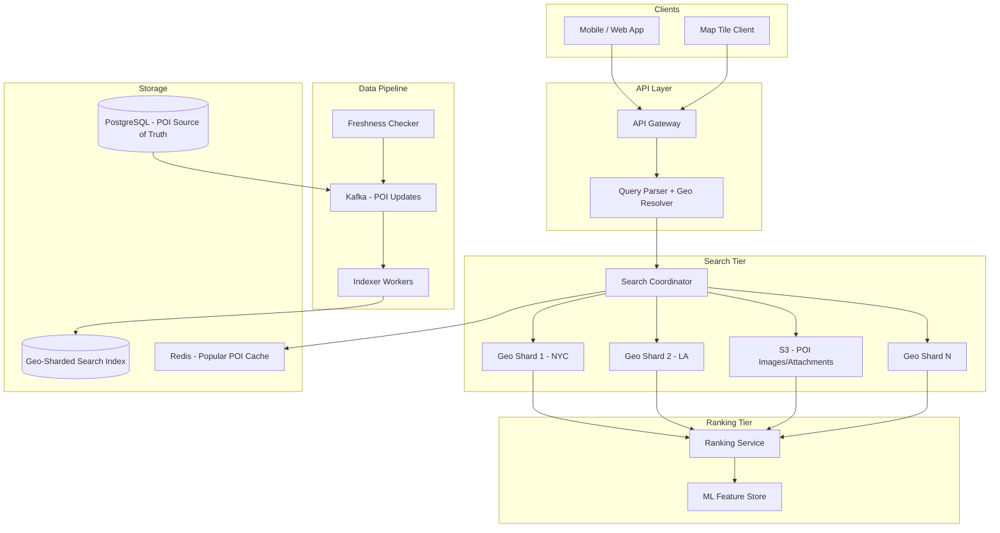
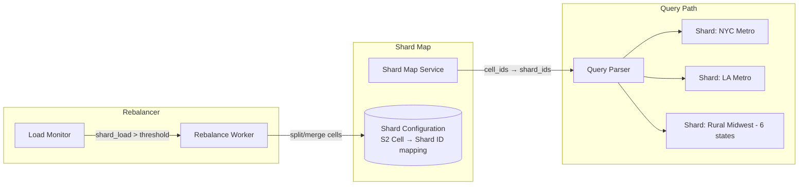
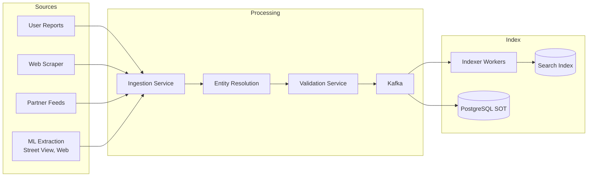
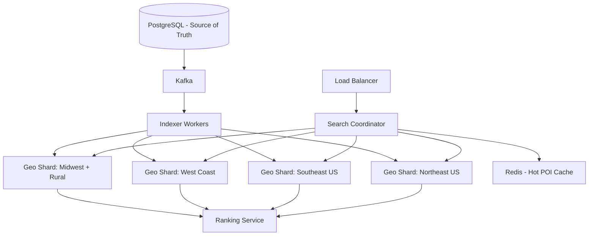
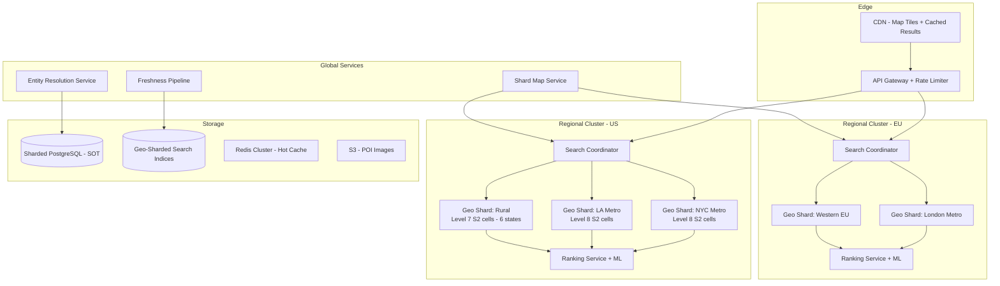
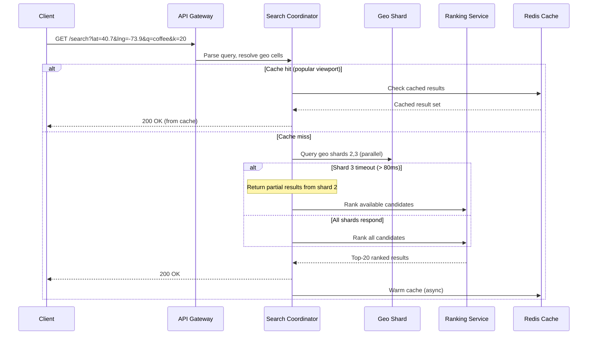

# System Design: Point of Interest (POI) System

## A Staff Engineer's Guide to Geospatial Search at Scale — From Geohash to Quadtree to Production

---

## Table of Contents

1. [The Problem & Why It's Hard](#1-the-problem--why-its-hard)
2. [Requirements & Scope](#2-requirements--scope)
3. [Single Machine / Naive Solution](#3-phase-1-single-machine-poi-search)
4. [Why Naive Fails (The Math)](#4-why-the-naive-approach-fails-the-math)
5. [Distributed Architecture](#5-phase-2-distributed-architecture)
6. [Core Component Deep Dives](#6-core-component-deep-dives)
7. [The Scaling Journey](#7-the-scaling-journey)
8. [Failure Modes & Resilience](#8-failure-modes--resilience)
9. [Data Model & Storage](#9-data-model--storage)
10. [Observability & Operations](#10-observability--operations)
11. [Design Trade-offs](#11-design-trade-offs)
12. [Common Interview Mistakes](#12-common-interview-mistakes)
13. [Interview Cheat Sheet](#13-interview-cheat-sheet)

---

## 1. The Problem & Why It's Hard

"Design a POI system" sounds like a database with latitude/longitude columns and a distance formula. Store restaurants, query by location, sort by distance. Ship it.

That instinct misses every hard problem.

> **The interviewer's real question**: Can you design a system that answers "find the k nearest coffee shops" in under 100ms across 200 million POIs, handles the Manhattan-vs-Montana density problem, ranks results by a blend of distance, quality, and relevance, and keeps POI data fresh — all while serving 100K queries per second?

The fundamental challenge is that geographic proximity is not a one-dimensional problem. You cannot sort points on Earth into a single ordered list and binary search them. Every spatial indexing scheme — geohash, quadtree, R-tree, H3, S2 — is a different compromise between encoding the 2D surface of a sphere into structures that computers can search efficiently.

> **Staff+ Signal:** The real complexity isn't the spatial index — it's the density variance. Manhattan has 100,000+ POIs in a few square kilometers. Rural Wyoming has 50 POIs spread across hundreds of kilometers. Any fixed-cell indexing scheme (geohash at a single precision, H3 at a single resolution) creates either tiny shards that overwhelm a cluster or giant shards that contain too much data. Production systems at Uber and Tinder independently converged on adaptive geo-sharding — partitioning by measured load, not by geographic area.

---

## 2. Requirements & Scope

### Functional Requirements

- **Nearby search**: Given a location and radius, return POIs sorted by distance
- **K-nearest neighbor (KNN)**: Find the k closest POIs to a point
- **Category filtering**: Search within categories (restaurants, gas stations, hotels)
- **Text search with geo-constraint**: "Italian restaurants near me"
- **POI CRUD**: Create, read, update, delete points of interest
- **Reviews and ratings**: Aggregate ratings per POI
- **Business hours**: Filter by currently open/closed
- **Viewport search**: Return POIs visible in a map bounding box

### Non-Functional Requirements

| Requirement | Target | Rationale |
|---|---|---|
| Read latency (p99) | < 100ms | Map interactions feel sluggish above 100ms |
| Write latency (p99) | < 500ms | POI updates are not time-critical |
| Throughput | 100K reads/sec, 1K writes/sec | Driven by scale estimation below |
| Availability | 99.99% | Maps are critical infrastructure for navigation |
| Data freshness | < 1 hour for POI updates | Users need current hours, closures, new businesses |
| Geographic coverage | Global | Must handle antimeridian, poles, all coordinate systems |

### Scale Estimation (Back-of-Envelope)

```
Total POIs:              200M globally (Google Maps has 200M+ businesses)
Active users:            100M DAU
Searches per user/day:   ~5 (mix of map pans, explicit searches, navigation)
Total read queries:      500M/day = ~6K reads/sec average
Peak read rate:          ~100K reads/sec (5PM commute + lunch hour spikes)

POI updates:             ~500K/day (new businesses, closures, hour changes)
Write rate:              ~6 writes/sec average, ~50 writes/sec peak

Storage per POI:         ~2 KB (name, coordinates, category, hours, metadata)
Total POI storage:       200M × 2 KB = 400 GB (fits on a single machine's disk)
Index size:              ~80 GB (geospatial index + text index)

KNN query fanout:        Average 5km radius, ~500 POIs in urban, ~10 in rural
Candidate set per query: 500-5,000 after spatial filter, ranked down to k=20
```

The key derived constraint: **400 GB of POI data fits on one machine, but 100K reads/sec with complex ranking does not**. This is a compute-bound problem, not a storage-bound one. The bottleneck is ranking 500-5,000 candidates per query at 100K QPS — that's 50-500 million scoring operations per second.

---

## 3. Phase 1: Single Machine POI Search

```
┌─────────────────────────────────────────────────────┐
│                   POI Server                         │
│                                                      │
│  ┌───────────┐  ┌──────────────┐  ┌──────────────┐ │
│  │ REST API  │  │ Geo Index    │  │ Text Search  │ │
│  │ Handler   │  │ (PostGIS     │  │ (pg_trgm or  │ │
│  │           │  │  GiST index) │  │  tsvector)   │ │
│  └─────┬─────┘  └──────┬───────┘  └──────┬───────┘ │
│        │               │                 │          │
│        └───────┬───────┴────────┬────────┘          │
│                │                │                    │
│         ┌──────▼──────┐  ┌─────▼──────┐            │
│         │ PostgreSQL  │  │  Redis     │            │
│         │ + PostGIS   │  │  (cache)   │            │
│         └─────────────┘  └────────────┘            │
└─────────────────────────────────────────────────────┘
```

With PostGIS, the k-nearest neighbor query is straightforward:

```sql
SELECT id, name, category, ST_Distance(
    location::geography,
    ST_MakePoint(-73.9857, 40.7484)::geography
) AS distance_meters
FROM pois
WHERE category = 'restaurant'
ORDER BY location <-> ST_MakePoint(-73.9857, 40.7484)::geometry
LIMIT 20;
```

The `<->` operator triggers PostGIS's GiST index-driven KNN search: a best-first traversal that terminates early once `LIMIT` is satisfied. Benchmark on 2.2 million records: **7.8ms for 10 nearest neighbors** — a 1,800x speedup over a full table scan.

For radius-bounded search, `ST_DWithin` is the standard:

```sql
SELECT id, name, ST_Distance(location::geography, query_point::geography) AS dist
FROM pois
WHERE ST_DWithin(location::geography, query_point::geography, 5000)  -- 5km radius
ORDER BY dist
LIMIT 20;
```

**When does Phase 1 work?** Up to ~10M POIs and ~1K QPS. A single PostgreSQL instance with PostGIS, a GiST index, and read replicas handles this comfortably. Many startups and city-scale applications never need to leave this phase.

**When does Phase 1 fail?** See next section.

---

## 4. Why the Naive Approach Fails (The Math)

### Bottleneck 1: Query CPU at Scale

```
100K reads/sec × ~500 candidate POIs × scoring function
= 50M scoring operations/sec

Each scoring operation: distance calc + category match + rating lookup + text relevance
≈ 10μs per candidate
Total CPU: 50M × 10μs = 500 CPU-seconds/sec
→ Need 500+ CPU cores just for ranking
```

A single PostgreSQL instance can handle ~2K complex spatial queries per second on a 64-core machine. At 100K QPS, you need 50 replicas — and that's before text search or ranking.

### Bottleneck 2: The Density Problem

```
Manhattan (10 km²):    ~100,000 POIs → 10,000 POIs/km²
Rural Montana (1000 km²): ~50 POIs → 0.05 POIs/km²
Density ratio: 200,000:1
```

A fixed geohash precision that gives manageable cell sizes in Manhattan (precision 7: ~150m cells) would create billions of nearly-empty cells globally. A precision that works for rural areas (precision 4: ~40km cells) puts 100,000 POIs in a single Manhattan cell.

### Bottleneck 3: KNN Across Boundaries

```
User at geohash cell boundary:
┌──────────┬──────────┐
│ Cell A   │ Cell B   │
│          │ x        │  ← User here
│          │          │
│    *     │          │  ← Nearest POI here (in Cell A!)
└──────────┴──────────┘

Searching only Cell B misses the nearest POI.
Must always search 9 cells (center + 8 neighbors).
At high precision: 9 cells × 1,000 POIs each = 9,000 candidates per query.
```

| Bottleneck | Single Machine | Distributed Fix |
|---|---|---|
| Query CPU | Saturates at ~2K complex geo queries/sec | Geo-sharded search cluster |
| Density imbalance | Fixed precision wastes resources | Adaptive cell resolution / quadtree |
| KNN boundary miss | 9-cell expansion creates large candidate sets | R-tree / KD-tree with cross-boundary traversal |
| Text + geo combined | Two separate indexes, joined at query time | Elasticsearch with compound geo+text queries |
| Ranking latency | Score all candidates synchronously | Two-phase: retrieve → rank pipeline |

**The tipping point**: At roughly 50M POIs and 10K QPS, PostGIS read replicas can no longer keep up with the combined spatial + text + ranking workload. The scatter-gather pattern across replicas adds latency, and the ranking function needs to consider signals (reviews, click-through rates, recency) that don't fit cleanly in SQL.

---

## 5. Phase 2+: Distributed Architecture

**The key architectural insight**: Separate the problem into two phases — (1) fast candidate retrieval using a geospatially-sharded index that reduces 200M POIs to ~1,000 candidates, and (2) a ranking service that scores those candidates using distance, relevance, quality, and behavioral signals.



### How Real Companies Built This

**Uber** built their geospatial dispatch system (DISCO) using Google's S2 library at level 12, dividing Earth into cells of 3-6 km². Each cell gets an `int64` ID used as a sharding key. When a rider requests a match, the system computes a coverage circle, finds all overlapping S2 cells, and queries only those shards. Driver locations update every 4 seconds, requiring a write-optimized architecture handling **1 million writes per second**. They used ringpop (a consistent-hash ring with SWIM gossip) across thousands of nodes. The critical innovation: on datacenter failover, drivers carry an encrypted "State Digest" on their phones that they replay to the new datacenter — eliminating the need for cross-DC state replication.

**Yelp** evolved through three generations of search infrastructure. Their original custom Lucene system used geographic sharding (separate index per city) with microsharding within each geo region. A coordinator broadcasts queries to all microshards within the relevant geo shard and merges results. When they migrated to Elasticsearch (2017), code deploys went from "several hours" to "a few minutes." They later built **Nrtsearch**, a custom Lucene-based engine with segment replication via S3 — achieving **30-50% improvement on P50/P95/P99 latency** and 40% infrastructure cost reduction. Scoring was consistently the bottleneck, not indexing.

**Tinder** migrated from a single global Elasticsearch index (5 default shards) to S2-based geosharding. They mapped Earth to S2 cells at level 7 (~45 miles) for sparse regions and level 8 (~22.5 miles) for dense cities. 40-100 geoshards stored as separate Elasticsearch indices. A query for a 100-mile radius touches only 3 of 55 shards instead of all of them — enabling **20x more computations** at the same latency. Load balancing trick: shards from different timezones are colocated on the same server to smooth time-of-day peaks.

**Lyft** powers their geospatial matching with **Redis at 15 million QPS**. They store driver locations in Redis sorted sets using 52-bit geohash integers as scores. The `GEOSEARCH` command computes a bounding box, fetches members with scores in range (O(log M) on the sorted set), then filters by exact distance. A critical invariant: a driver must never appear in two geohash cells simultaneously while moving — requiring atomic remove-and-add operations.

### Key Data Structure: The Two-Phase Search Pipeline

The architecture that separates production systems from naive designs:

```
Phase 1: Candidate Retrieval (Recall)
┌─────────────────────────────────────────────────┐
│ Input: (lat, lng, radius, category, query_text)  │
│                                                   │
│ 1. Compute covering cells (S2/geohash/H3)        │
│ 2. Route to relevant geo shards                  │
│ 3. Spatial filter: bounding box → exact distance │
│ 4. Category + text filter                        │
│ 5. Return ~1,000 candidates with base features   │
└─────────────────────────────────────────────────┘
           │
           ▼
Phase 2: Ranking (Precision)
┌─────────────────────────────────────────────────┐
│ Input: ~1,000 candidates + user context          │
│                                                   │
│ 1. Distance score (exact Haversine, not approx)  │
│ 2. Quality score (ratings, review count, recency)│
│ 3. Relevance score (text match, category match)  │
│ 4. Behavioral signals (CTR, bookings, time-of-day│
│ 5. Business boost (promoted, verified)           │
│ 6. Return top-k ranked results                   │
└─────────────────────────────────────────────────┘
```

> **Staff+ Signal:** Companies that conflate retrieval and ranking — scoring every document at retrieval time — create the bottleneck Yelp documented. Scoring was consistently their #1 performance bottleneck. The two-phase pipeline is what allows search to scale: Phase 1 (retrieval) is parallelized across geo shards and uses cheap filters; Phase 2 (ranking) runs on a smaller candidate set with expensive ML-based scoring. This mirrors the retrieval-then-ranking architecture used in recommendation systems.

---

## 6. Core Component Deep Dives

### 6.1 Geospatial Index: Geohash vs. Quadtree vs. S2 vs. H3

This is the question interviewers ask most. Here's what production evidence tells us:

#### Geohash

Encodes latitude/longitude as a base32 string by interleaving bits. Prefix = parent cell. Widely supported (Redis native, PostgreSQL, DynamoDB).

```
Precision 6: ~1.2 km × 0.6 km cell
Precision 7: ~150m × 150m cell
Precision 8: ~40m × 20m cell

Example: "dr5ru7" → covers a block in Manhattan
```

**Strengths**: Simple, string-prefix hierarchy works with any key-value store, Redis `GEOADD/GEOSEARCH` uses it natively.

**Weaknesses**: Rectangular cells have non-equal area (0.72 km² at equator vs. 0.18 km² near Helsinki at precision 6). Z-order curve has locality discontinuities. Breaks at the antimeridian (±180°) — adjacent points have no common prefix. **Always requires 9-cell expansion** (center + 8 neighbors) for proximity search.

#### Quadtree

Recursively subdivides 2D space into four quadrants. Adaptive by nature — dense areas get deeper subdivision, sparse areas stay coarse.

```
          ┌─────────┬─────────┐
          │         │         │
          │   NW    │   NE    │
          │         │  ┌──┬──┐│
          │         │  │  │xx││  ← Dense area subdivided deeper
          ├─────────┤  ├──┼──┤│
          │         │  │  │  ││
          │   SW    │  └──┴──┘│
          │         │   SE    │
          └─────────┴─────────┘
```

**Strengths**: Density-adaptive (the key advantage). KNN search uses best-first traversal. Memory-efficient for non-uniform distributions.

**Weaknesses**: Not database-native — must be implemented in application code or memory. Tree structure requires pointer traversal (cache-unfriendly). Rebalancing on updates is non-trivial. Not directly shardable across machines.

#### Google S2

Maps the sphere onto six cube faces, then uses a Hilbert curve to enumerate cells. 30 resolution levels (3 km² at level 7 down to 1 cm² at level 30). Cell IDs are `int64`.

**Strengths**: Best locality preservation (Hilbert curve). Handles antimeridian and poles correctly. `S2RegionCoverer` computes tight cell coverings for any shape. Used by Google Maps, MongoDB (`2dsphere` index), Tinder, Foursquare.

**Weaknesses**: Most computationally expensive to encode/decode. C++ reference implementation; bindings in other languages are less mature. More complex API than geohash.

#### Uber H3

Hexagonal cells on an icosahedron projection. 16 resolution levels. All cells approximately equal area. Cell IDs are `uint64`.

**Strengths**: Equal-area cells globally (critical for analytics and fair pricing). 6 equidistant neighbors (vs. 8 at two distances for squares). `kRing()` returns all neighbors at distance k exactly. Used by Uber for surge pricing, Foursquare's Places dataset.

**Weaknesses**: Approximate parent containment (a point may not be strictly inside its H3 parent cell). 12 pentagon cells (placed in oceans to minimize impact). Less database support than geohash.

#### The Real Answer for Interviews

| Use Case | Best Choice | Why |
|---|---|---|
| Key-value store (Redis, DynamoDB) | Geohash | String prefix works natively |
| Analytics / equal-area aggregation | H3 | Only system with globally consistent cell area |
| Database spatial index (PostgreSQL) | PostGIS R-tree | GiST index with KNN operator |
| Global-scale geo-sharding | S2 | Hilbert curve locality + correct pole/antimeridian handling |
| In-memory adaptive index | Quadtree | Density-adaptive, best for non-uniform distributions |
| Search engine (Elasticsearch) | Built-in BKD tree | geo_point type, no external library needed |

> **Staff+ Signal:** The choice of spatial index rarely determines system performance. Uber's 800ms query problem wasn't caused by a bad spatial algorithm — it was caused by no spatial index at all (flat table scan). Once any spatial index exists, the dominant performance factors are shard design, caching strategy, and the two-phase retrieval-ranking split. An interviewer who hears you debate geohash vs. S2 for 10 minutes will be less impressed than one who hears you explain the two-step filter pattern (coarse spatial filter → exact distance) and the density-adaptive sharding strategy.

### 6.2 Geo-Sharding Service

**Responsibilities:**
- Map geographic regions to shards based on POI density and query load
- Route incoming queries to the correct subset of shards
- Rebalance shards when load shifts (events, new city launches)



Tinder's approach: group S2 cells into shards at level 7 (~45 miles) for sparse regions, level 8 (~22.5 miles) for dense cities. The shard map is updated periodically based on measured load. A cross-timezone trick: colocate shards from different timezones on the same physical server so that peak loads from US East and US West don't coincide.

### 6.3 Ranking Service

**Responsibilities:**
- Score candidate POIs on multiple dimensions
- Blend distance, quality, relevance, and behavioral signals
- Apply business rules (promoted results, verified businesses)
- Personalize based on user history and preferences

```mermaid
flowchart TB
    CAND[1,000 Candidates from Retrieval]

    subgraph Scoring Pipeline
        DIST[Distance Scorer<br/>Exact Haversine]
        QUAL[Quality Scorer<br/>Rating × Log(review_count) × recency_decay]
        REL[Relevance Scorer<br/>BM25 text match + category boost]
        BEH[Behavioral Scorer<br/>CTR, conversion, time-of-day]
    end

    BLEND[Score Blender<br/>weighted_sum or ML model]
    TOPK[Top-K Selection]

    CAND --> DIST & QUAL & REL & BEH
    DIST & QUAL & REL & BEH --> BLEND --> TOPK
```

Google's published data reveals the ranking dynamics: distance dominates at 69.2% of weight for positions 4-21, but in the top 3 positions, rating surges to 52.8% of weight. The transition from distance-dominant to quality-dominant ranking is context-sensitive — it depends on category, user behavior, and query intent.

### 6.4 POI Data Freshness Pipeline

**Responsibilities:**
- Ingest POI updates from multiple sources (user reports, web scraping, partner feeds, ML extraction)
- Deduplicate and reconcile conflicting data (entity resolution)
- Update the search index within the freshness SLA
- Validate data quality before publishing



> **Staff+ Signal:** Entity resolution at 200M+ POIs is the hardest unsolved problem in POI systems, and most candidates never mention it. The same Starbucks appears 3-7 times across different data sources — different names ("Starbucks", "Starbucks Coffee", "SBUX #12345"), slightly different coordinates (GPS jitter), different business hours (from different scrapers). Resolving these requires proximity-based blocking (only compare POIs within X meters), fuzzy name matching, and confidence scoring. Naive O(n²) comparison on 200M POIs is 4×10¹⁶ comparisons — physically impossible. Google employs thousands of people and uses ML-based extraction from 220B+ Street View images. Foursquare built AI agents that propose and vote on data changes. This is a data problem, not an infrastructure problem.

---

## 7. The Scaling Journey

### Stage 1: City-Scale (0-10M POIs, < 1K QPS)

```
┌──────────┐     ┌───────────────────┐     ┌──────────────┐
│ REST API │────▶│ PostgreSQL+PostGIS│────▶│ GiST R-tree  │
│          │     │ (single instance) │     │ spatial index │
└──────────┘     └───────────────────┘     └──────────────┘
                          │
                    ┌─────▼──────┐
                    │ Redis cache │
                    │(hot POIs)   │
                    └────────────┘
```

PostGIS KNN with GiST index: 7.8ms for 10-nearest on 2.2M records. Cache the top-100 POIs for popular grid cells in Redis. Add read replicas at ~500 QPS.

**Limit**: At ~10M POIs and 1K QPS, complex queries (text + geo + category filter + ranking) take 50-100ms per query. CPU on the primary becomes the bottleneck.

### Stage 2: Country-Scale (10M-100M POIs, 1K-20K QPS)



**New capabilities at this stage:**
- Geo-sharded Elasticsearch indices (one index per region, 10-20 shards total)
- Search coordinator routes queries to 1-3 relevant shards (not all)
- Ranking service separates scoring from retrieval
- Kafka-based indexing pipeline for near-real-time POI updates
- Redis cache for popular viewport queries (Times Square, airports)

**Limit**: At ~20K QPS, the coordinator becomes a bottleneck. Cross-region queries (user on a shard boundary) require scatter-gather across multiple shards, creating tail latency.

### Stage 3: Global-Scale (200M+ POIs, 20K-100K+ QPS)



**New capabilities at this stage:**
- Adaptive geo-sharding: dense cities get level 8 S2 cells (~22.5 miles), rural areas get level 7 (~45 miles)
- Regional deployment (US, EU, APAC) for latency
- CDN caching for popular viewport queries
- ML-based ranking with feature store (click-through rates, conversion, time-of-day patterns)
- Entity resolution service for cross-source POI deduplication
- Dynamic shard rebalancing based on measured load

**Limit**: Cross-region POI updates have eventual consistency (user adds a restaurant in NYC, European travelers see it after propagation delay).

> **Staff+ Signal:** At this scale, the shard map itself becomes a critical service. It must be read on every query (to route to the right shards) and is updated infrequently (rebalance events). This is a classic read-heavy configuration — cache it aggressively on every search coordinator node, with a TTL refresh. If the shard map service goes down, coordinators should continue serving with their cached copy (stale shard map is better than no results). The shard map update must be atomic and versioned — a partial update where some coordinators see the old map and others see the new one creates inconsistent results during rebalancing.

---

## 8. Failure Modes & Resilience

### Request Flow with Failure Handling



### Failure Scenarios

| Failure | Detection | Recovery | Blast Radius |
|---|---|---|---|
| Single geo shard down | Health check + query timeout | Route to replica shard; if no replica, return results from remaining shards with degraded coverage | Users in that geographic area get fewer results |
| Ranking service timeout | p99 latency threshold | Fall back to distance-only ranking (skip quality/behavioral scoring) | Results less relevant but still geographically correct |
| Redis cache down | Connection failure | Bypass cache, query shards directly; higher latency but correct results | All users experience ~50ms latency increase |
| Shard map service down | Health check | Coordinators use cached shard map (may be slightly stale) | Queries during rebalancing may miss some POIs on newly-moved cells |
| Indexing pipeline lag | Consumer lag metric | Search index serves stale data; new POIs not visible | Recently updated POIs not searchable (< 1% of queries affected) |
| Entity resolution creates duplicate | Monitoring: duplicate POI count per geohash | Manual review queue; automated rollback if confidence < threshold | Users see duplicate listings |
| Elasticsearch cluster red | Cluster health API | Failover to read-only replica cluster; reject writes | Read-only mode for affected region |

> **Staff+ Signal:** The most dangerous failure in a POI system is silent data corruption: a wrong coordinate, a business marked "open" that's permanently closed, or a duplicate POI that confuses ranking. Unlike a crash (noisy, detected in seconds), bad data can persist for months. MongoDB had a documented bug where the geospatial distance calculation returned wrong results silently. Production POI systems need data quality metrics (duplicate rate, coordinate outlier rate, stale-hours percentage) monitored as aggressively as availability and latency.

### Graceful Degradation Strategy

| Severity | What breaks | User experience | System response |
|---|---|---|---|
| **S1**: Search cluster down | No search results | Show cached results from CDN + "results may be outdated" banner | Serve stale CDN cache, alert on-call |
| **S2**: One geo shard down | Missing results for one region | Users searching in that region get fewer results | Return partial results, log coverage gap |
| **S3**: Ranking service down | Unranked results | Results sorted by distance only (no quality/relevance scoring) | Fall back to distance sort |
| **S4**: Freshness pipeline stalled | New POIs not indexed | Existing POIs still searchable; new businesses invisible for hours | Alert data team, serve stale index |

---

## 9. Data Model & Storage

### Core Schema

```sql
CREATE TABLE pois (
    id              UUID PRIMARY KEY DEFAULT gen_random_uuid(),
    name            VARCHAR(500) NOT NULL,
    description     TEXT,
    category_id     INT NOT NULL REFERENCES categories(id),
    latitude        DOUBLE PRECISION NOT NULL,
    longitude       DOUBLE PRECISION NOT NULL,
    location        GEOGRAPHY(POINT, 4326) NOT NULL,
    geohash         VARCHAR(12) GENERATED ALWAYS AS (ST_GeoHash(location::geometry, 8)) STORED,
    s2_cell_id      BIGINT NOT NULL,
    address         JSONB,
    phone           VARCHAR(20),
    website         VARCHAR(500),
    price_level     SMALLINT CHECK (price_level BETWEEN 1 AND 4),
    avg_rating      NUMERIC(2,1) DEFAULT 0,
    review_count    INT DEFAULT 0,
    is_verified     BOOLEAN DEFAULT FALSE,
    status          VARCHAR(20) DEFAULT 'active',
    source          VARCHAR(50) NOT NULL,
    source_id       VARCHAR(255),
    created_at      TIMESTAMPTZ DEFAULT NOW(),
    updated_at      TIMESTAMPTZ DEFAULT NOW()
);

CREATE TABLE poi_hours (
    poi_id          UUID NOT NULL REFERENCES pois(id),
    day_of_week     SMALLINT NOT NULL CHECK (day_of_week BETWEEN 0 AND 6),
    open_time       TIME,
    close_time      TIME,
    is_closed       BOOLEAN DEFAULT FALSE,
    PRIMARY KEY (poi_id, day_of_week)
);

CREATE TABLE reviews (
    id              UUID PRIMARY KEY DEFAULT gen_random_uuid(),
    poi_id          UUID NOT NULL REFERENCES pois(id),
    user_id         UUID NOT NULL,
    rating          SMALLINT NOT NULL CHECK (rating BETWEEN 1 AND 5),
    text            TEXT,
    created_at      TIMESTAMPTZ DEFAULT NOW()
);

CREATE TABLE categories (
    id              SERIAL PRIMARY KEY,
    name            VARCHAR(100) NOT NULL,
    parent_id       INT REFERENCES categories(id),
    slug            VARCHAR(100) UNIQUE NOT NULL
);

CREATE TABLE poi_entity_links (
    canonical_id    UUID NOT NULL REFERENCES pois(id),
    duplicate_id    UUID NOT NULL REFERENCES pois(id),
    confidence      NUMERIC(3,2) NOT NULL,
    resolved_at     TIMESTAMPTZ DEFAULT NOW(),
    PRIMARY KEY (canonical_id, duplicate_id)
);
```

### Critical Indexes

```sql
CREATE INDEX idx_pois_location_gist ON pois USING GIST (location);

CREATE INDEX idx_pois_geohash ON pois (geohash);

CREATE INDEX idx_pois_s2_cell ON pois (s2_cell_id);

CREATE INDEX idx_pois_category_location ON pois USING GIST (location)
    WHERE status = 'active';

CREATE INDEX idx_reviews_poi_rating ON reviews (poi_id, rating);

CREATE INDEX idx_pois_updated ON pois (updated_at DESC);
```

### Elasticsearch Index Mapping (Geo-Sharded)

```json
{
  "settings": {
    "number_of_shards": 1,
    "number_of_replicas": 2
  },
  "mappings": {
    "properties": {
      "poi_id":       { "type": "keyword" },
      "name":         { "type": "text", "analyzer": "standard" },
      "category":     { "type": "keyword" },
      "location":     { "type": "geo_point" },
      "geohash":      { "type": "keyword" },
      "avg_rating":   { "type": "float" },
      "review_count": { "type": "integer" },
      "price_level":  { "type": "integer" },
      "is_open_now":  { "type": "boolean" },
      "updated_at":   { "type": "date" }
    }
  }
}
```

Each geo shard is a separate Elasticsearch index (e.g., `pois-nyc-metro`, `pois-la-metro`, `pois-rural-midwest`). The shard map service maintains the S2 cell → index name mapping.

### Storage Engine Choice

| Engine | Use Case | Why |
|---|---|---|
| PostgreSQL + PostGIS | POI source of truth, entity resolution, admin queries | ACID guarantees, rich spatial functions, JOIN support for complex queries |
| Elasticsearch (geo-sharded) | Production search serving | BKD tree geo_point, combined text+geo queries, horizontal scaling via indices |
| Redis Cluster | Hot POI cache, popular viewport results, real-time location (if applicable) | Sub-ms reads, geospatial commands, TTL for cache invalidation |
| Kafka | POI update event stream | Durable, ordered event stream; replay for re-indexing; decouples write path from index |
| S3 | POI images, bulk data exports | Cost-effective blob storage, CDN-friendly |

> **Staff+ Signal:** The GiST index on PostGIS and the BKD tree in Elasticsearch both implement the same fundamental idea: a two-step filter. The spatial index provides a coarse bounding-box filter (cheap, eliminates 99%+ of candidates), then exact distance calculation filters the remaining false positives. PostGIS's `<->` KNN operator goes further — it uses a best-first traversal that terminates early when `LIMIT` is satisfied, never scanning candidates beyond what's needed. Understanding this two-step mechanism is essential because it explains why spatial indexes don't help with all query patterns: a query that needs ALL points within 50km (no LIMIT) can't benefit from early termination and may still scan extensively.

---

## 10. Observability & Operations

### Key Metrics

- `poi.search_latency_p99{shard, query_type}` — search latency by shard and query type; > 100ms triggers investigation
- `poi.shard_query_fanout` — number of shards touched per query; should be 1-3 for radius search, all shards for global text search
- `poi.candidate_set_size{shard}` — candidates returned by retrieval phase; > 5,000 indicates index precision issues
- `poi.cache_hit_rate{region}` — viewport cache effectiveness; < 80% means cache sizing or TTL needs adjustment
- `poi.index_freshness_lag_seconds` — time between POI update in PostgreSQL and searchability in Elasticsearch; > 3600s violates SLA
- `poi.entity_duplicate_rate` — percentage of POIs flagged as potential duplicates; rising trend indicates data quality issue
- `poi.ranking_fallback_rate` — percentage of queries using distance-only fallback; > 1% means ranking service is degraded
- `poi.empty_result_rate{category, geohash}` — queries returning zero results; localized spikes indicate missing POI coverage

### Distributed Tracing

A typical "find nearest 20 coffee shops" trace:

```
[API Gateway]  ─── 1ms ───▶ [Query Parser: resolve geo cells, parse "coffee"]  ─── 3ms
                                    │
                                    ├──▶ [Redis Cache: check viewport cache] ─── 0.5ms (MISS)
                                    │
                                    ├──▶ [Shard Map: cell_ids → shard_ids] ─── 0.1ms (cached)
                                    │
                            ┌───────┴──────────┐
                            │  Parallel shard   │
                            │  queries          │
                            │                   │
                    [Shard NYC-1] ─── 15ms   [Shard NYC-2] ─── 12ms
                    (650 candidates)          (340 candidates)
                            │                   │
                            └───────┬──────────┘
                                    │
                            [Merge: 990 candidates] ─── 1ms
                                    │
                            [Ranking Service: score + sort] ─── 20ms
                                    │
                            [Top-20 results returned] ─── 0.5ms
                                    │
                            [Async: warm cache] ─── fire-and-forget

Total latency: ~53ms
```

### Alerting Strategy

| Alert | Condition | Severity | Action |
|---|---|---|---|
| Search latency spike | p99 > 200ms for 5min | P1 | Check shard health, candidate set sizes, ranking service latency |
| Shard down | Health check fails for 30s | P1 | Failover to replica; page on-call if no replica |
| Index freshness lag | Lag > 1 hour for 10min | P2 | Check Kafka consumer group, indexer worker health |
| Cache hit rate drop | < 60% for 15min | P2 | Check Redis memory, eviction rate, TTL configuration |
| Empty result spike | > 5% empty results in any geohash-4 for 30min | P2 | Investigate POI coverage gap or index corruption |
| Entity duplicate spike | Duplicate rate > 2% for 1 hour | P3 | Check entity resolution pipeline, review recent data imports |

---

## 11. Design Trade-offs

| Decision | Option A | Option B | Recommended | Why |
|---|---|---|---|---|
| Spatial index | Geohash (simple, universal) | S2 (correct, Hilbert locality) | **Geohash for Redis/KV stores; S2 for geo-sharding** | Geohash is adequate when you control the query pattern (always expand 9 cells). S2 is necessary when sharding globally — its Hilbert curve gives better locality, and it handles poles/antimeridian correctly. Use the right tool for each layer. |
| Geo-sharding strategy | Static (fixed regions) | Adaptive (load-based) | **Adaptive** | Static sharding creates 200,000:1 density imbalance. Tinder and Uber both use adaptive sharding (S2 cells grouped by load). The rebalancing cost is worth the load distribution. |
| Search engine | PostGIS | Elasticsearch | **Both: PostGIS as SOT, Elasticsearch for serving** | PostGIS is better for complex spatial operations and is the authoritative data store. Elasticsearch is better for combined text+geo queries at high QPS with horizontal scaling. Use PostGIS for admin/analytics, Elasticsearch for user-facing search. |
| Ranking architecture | Score at retrieval time | Two-phase retrieve → rank | **Two-phase** | Yelp's experience: scoring was consistently the bottleneck. Separating retrieval (cheap, parallelized) from ranking (expensive, ML-based) is the only way to scale ranking independently. |
| KNN algorithm | Geohash 9-cell expansion | Quadtree best-first traversal | **Geohash for distributed; Quadtree for in-memory** | Geohash cells map directly to shard keys. Quadtree gives better KNN accuracy (density-adaptive, best-first termination) but requires an in-memory tree structure that doesn't shard easily. Use quadtree within a single shard if density warrants it. |
| Cache granularity | Per-query result cache | Per-viewport tile cache | **Per-viewport tile** | Users pan maps incrementally. Caching tiles (geohash-4 or geohash-5 cells with pre-ranked POIs) gives high hit rates across slightly different queries. Per-query caching has low hit rate due to coordinate precision variation. |

> **Staff+ Signal:** The PostGIS-vs-Elasticsearch decision is a two-way door, but the data flow is a one-way door. Once you establish PostgreSQL as the source of truth with Kafka-based indexing into Elasticsearch, changing either database is a major migration. The pragmatic approach: start with PostGIS only (Phase 1), add Elasticsearch when QPS demands it (Phase 2), and maintain the PostgreSQL → Kafka → Elasticsearch pipeline as your single source of truth pattern. Never write directly to Elasticsearch from the application — always through the pipeline. This makes re-indexing (schema changes, shard rebalancing) a pipeline replay, not a data migration.

---

## 12. Common Interview Mistakes

1. **Full table scan with Haversine distance**: Candidates write `SELECT * FROM pois ORDER BY haversine(lat, lng, user_lat, user_lng) LIMIT 20` — which computes distance against every row. **What staff+ candidates say instead**: "I'd use a two-step approach: a spatial index (GiST, BKD tree, or geohash) for coarse filtering to ~1,000 candidates, then exact Haversine on only those candidates."

2. **Using a single geohash precision globally**: "I'll use geohash precision 6 everywhere." This creates cells of wildly different effective sizes and ignores the density problem. **What staff+ candidates say instead**: "I'd use adaptive resolution — denser areas get finer-grained cells (S2 level 8 for Manhattan, level 7 for rural areas) based on measured POI density and query load."

3. **Ignoring the boundary problem**: Candidates search only the user's geohash cell and miss POIs across the boundary. **What staff+ candidates say instead**: "Geohash proximity search always requires expanding to 9 cells (center + 8 neighbors) because two points in the same cell can be farther apart than a point in an adjacent cell. Post-filtering by exact distance is mandatory."

4. **Treating POI search as a pure infrastructure problem**: Candidates spend 40 minutes on geospatial indexing and never mention data quality. **What staff+ candidates say instead**: "The harder problem is entity resolution — the same Starbucks appears 3-7 times across data sources. At 200M POIs, deduplication requires blocking strategies and fuzzy matching, not brute force."

5. **Conflating write-heavy and read-heavy geospatial**: "I'll use an R-tree for driver tracking." R-trees max out at ~2,000 updates/sec with 1M moving objects. **What staff+ candidates say instead**: "Driver tracking is write-heavy — I'd use Redis GEOADD or cell-based sharding. POI search is read-heavy — I'd use Elasticsearch with BKD trees. These are fundamentally different access patterns."

6. **No ranking model**: Candidates return results sorted by distance only. **What staff+ candidates say instead**: "Distance gets you recall, but ranking gives you precision. I'd blend distance with quality signals (ratings, review count, recency) and behavioral signals (click-through rate). The blending weights are context-dependent — for 'gas station near me,' distance dominates; for 'best Italian restaurant,' quality dominates."

7. **Designing quadtree as a database**: Candidates describe building a quadtree in a database with parent-child rows. **What staff+ candidates say instead**: "Quadtrees are in-memory data structures — they're excellent for density-adaptive spatial indexing within a single node. For distributed systems, I'd encode locations using geohash or S2 cell IDs as shard keys, then optionally use a quadtree within each shard for adaptive subdivision."

---

## 13. Interview Cheat Sheet

### Time Allocation (45-minute interview)

| Phase | Time | What to Cover |
|---|---|---|
| Clarify requirements | 5 min | KNN vs. radius search? Scale (POI count, QPS)? Combined text+geo? Global? |
| High-level design | 10 min | Two-phase pipeline (retrieve → rank), geo-sharding, data flow |
| Deep dive #1 | 10 min | Geospatial indexing: geohash vs. quadtree vs. S2 — trade-offs, boundary problem, two-step filter |
| Deep dive #2 | 8 min | Geo-sharding: density imbalance, adaptive cell resolution, shard map service |
| Failure modes + scaling | 7 min | Partial shard failure, ranking fallback, data freshness pipeline |
| Trade-offs + wrap-up | 5 min | PostGIS vs. Elasticsearch, static vs. adaptive sharding, cache granularity |

### Step-by-Step Answer Guide

1. **Clarify**: "What query types? KNN (find k nearest), radius (all within 5km), or viewport (all in bounding box)? What scale — city-level, country-level, or global? Do we need combined text + geo search, or geo only?"

2. **The key insight**: "This is a two-phase problem: fast candidate retrieval using spatial indexing, then expensive ranking on the candidate set. Conflating them creates the bottleneck."

3. **Simple version**: "On a single machine, PostGIS with a GiST index gives 7.8ms KNN on 2.2M records. The `<->` operator does best-first traversal with early termination."

4. **Break it**: "At 100K QPS with ranking, we need 500+ CPU cores just for scoring. A single PostGIS instance handles ~2K complex spatial queries/sec."

5. **Distributed architecture**: "Geo-sharded search indices — each shard covers a geographic region. A coordinator routes queries to 1-3 relevant shards. Candidates merge into a ranking service for scoring."

6. **Geospatial index deep dive**: "Geohash for key-value stores (simple, prefix hierarchy). S2 for geo-sharding (Hilbert locality, correct at poles/antimeridian). Quadtree for in-memory adaptive indexing (density-aware). Always two-step filter: spatial bounding box first, exact distance second."

7. **The density problem**: "Manhattan has 200,000x more POIs per km² than rural Montana. Static cell sharding creates hot spots. Adaptive sharding groups S2 cells by measured load — Tinder's approach gives 20x improvement by querying 3 of 55 shards instead of all of them."

8. **Failure handling**: "If a shard goes down, return partial results from remaining shards. If ranking service is slow, fall back to distance-only sort. Stale shard map is better than no shard map — cache it on every coordinator."

9. **Scale levers**: "Regional deployment. CDN caching for popular viewports. Adaptive shard rebalancing. Index replica scaling independent of shard count."

10. **Data quality**: "Entity resolution across sources is the unsolved problem. Blocking by proximity + fuzzy name matching + confidence scoring. Google uses ML on 220B+ Street View images. This is the problem that separates a POI system from a geospatial database."

### What the Interviewer Wants to Hear

- At **L5/Senior**: Correct spatial index choice (geohash or quadtree), working KNN algorithm, basic schema, awareness of the boundary problem, PostGIS or Elasticsearch.

- At **L6/Staff**: Two-phase retrieve-then-rank pipeline, geo-sharding with density awareness, quantified bottleneck analysis, trade-off reasoning between geohash/S2/quadtree grounded in production evidence (Uber, Tinder, Yelp), entity resolution as a first-class concern.

- At **L7/Principal**: Adaptive shard rebalancing as an operational system (not just a one-time setup), data freshness pipeline as the real competitive moat, ranking as a context-dependent blend that evolves with ML, organizational structure (search infra team vs. data quality team vs. ranking team), migration strategy from PostGIS monolith to geo-sharded Elasticsearch.

### My Take (Michi Meow)

POI system design is the ultimate "iceberg question." The 10% above water — spatial indexing algorithms — is what candidates prepare for. The 90% below — density-adaptive sharding, entity resolution, ranking, data freshness — is what actually determines whether a mapping service works in production.

The production evidence is clear: Uber's 800ms query crisis wasn't a bad algorithm, it was no spatial index at all. Yelp's scoring bottleneck wasn't the geospatial filter, it was ranking 1,000 candidates with complex signals. Tinder's 20x improvement came from querying 3 shards instead of 55, not from switching spatial libraries. And Foursquare's biggest engineering investment isn't their search infrastructure — it's their AI-driven data quality pipeline that maintains 100M+ POIs across 22 core attributes.

If you remember one thing from this post: **a POI system is a data quality problem wearing a spatial indexing costume.** The spatial index is solved (PostGIS GiST, Elasticsearch BKD, pick one). The unsolved problems are: keeping 200M POIs accurate, deduplicating across sources, and ranking results in a way that balances distance, quality, and user intent.

*Written as a reference for staff-level system design interviews.*
