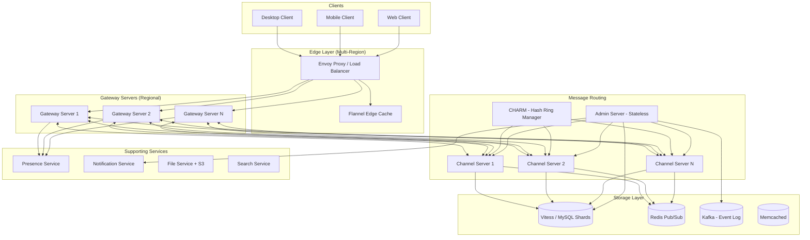
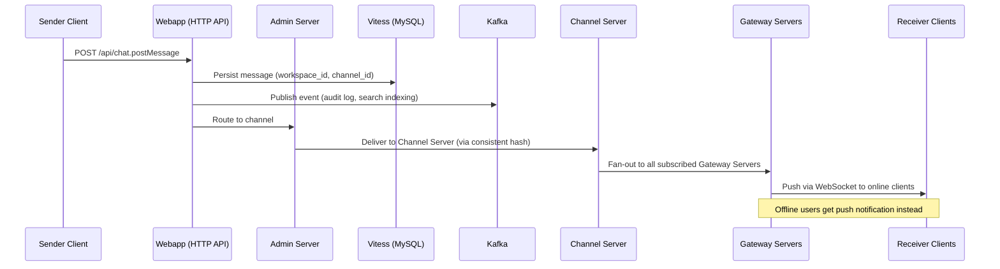
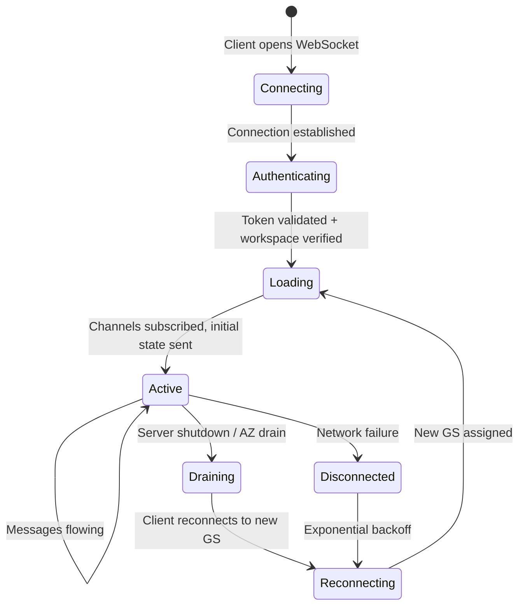
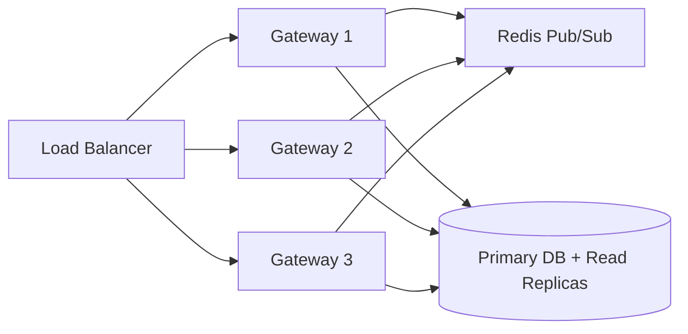
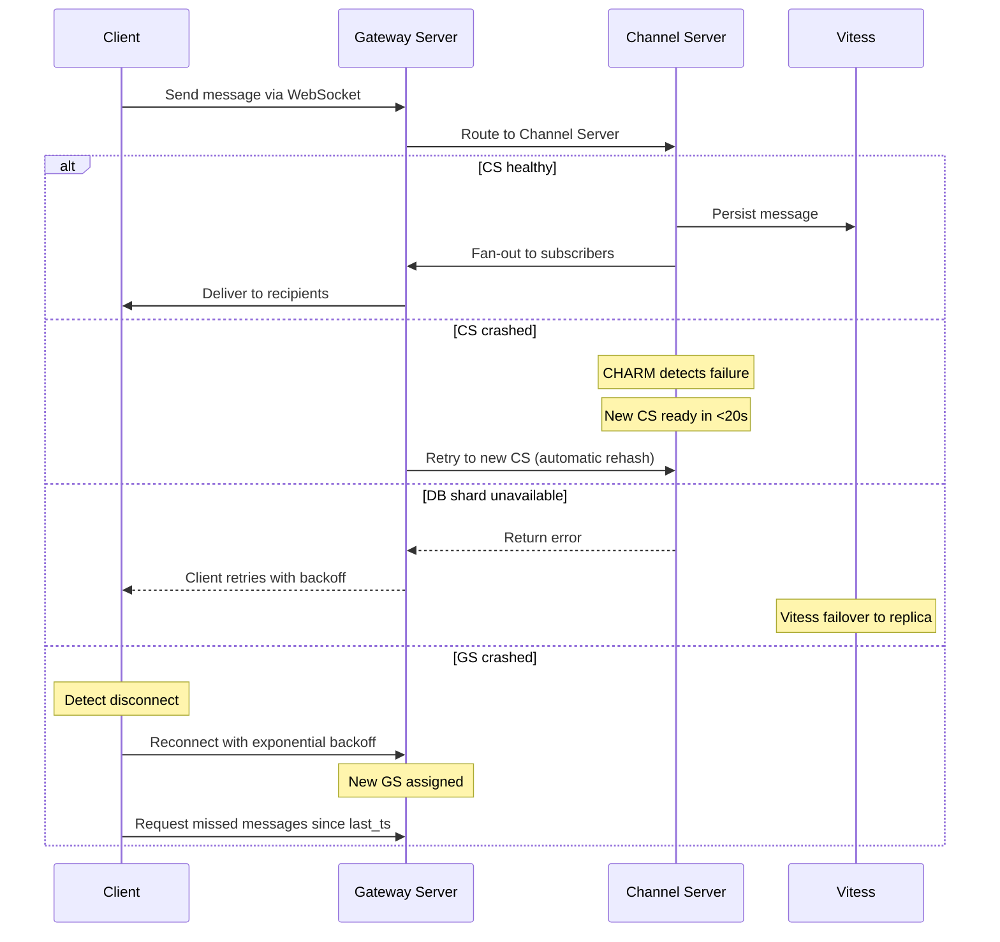

# System Design: Slack — Enterprise Real-Time Messaging

## From WebSockets to Cellular Architecture: A Staff Engineer's Guide

---

## Table of Contents

1. [The Problem & Why It's Hard](#1-the-problem--why-its-hard)
2. [Requirements & Scope](#2-requirements--scope)
3. [Single Machine / Naive Solution](#3-phase-1-single-server-chat)
4. [Why Naive Fails (The Math)](#4-why-naive-fails-the-math)
5. [Distributed Architecture](#5-phase-2-distributed-architecture)
6. [Core Component Deep Dives](#6-core-component-deep-dives)
7. [The Scaling Journey](#7-the-scaling-journey)
8. [Failure Modes & Resilience](#8-failure-modes--resilience)
9. [Data Model & Storage](#9-data-model--storage)
10. [Observability & Operations](#10-observability--operations)
11. [Design Trade-offs](#11-design-trade-offs)
12. [Common Interview Mistakes](#12-common-interview-mistakes)
13. [Interview Cheat Sheet](#13-interview-cheat-sheet)

---

## 1. The Problem & Why It's Hard

You're asked to design an enterprise messaging platform like Slack — real-time chat with channels, direct messages, file sharing, notifications, and strict workspace isolation. Millions of concurrent users across thousands of companies, with sub-second message delivery.

> **The interviewer's real question**: Can you design a system that delivers messages in real time to millions of users while keeping each company's data completely isolated — and can you explain what happens when things break?

The surface-level problem — "build a chat app" — is deceptively simple. A weekend hackathon can produce a working chat prototype. But the engineering challenges that separate Slack from a toy are brutal:

1. **Fan-out at scale**: A single message to a 10,000-member channel must reach every online member in under a second. That's 10,000 WebSocket pushes triggered by one HTTP POST.
2. **Multi-tenancy isolation**: Company A must never see Company B's data, even when they share the same infrastructure. One company's traffic spike cannot degrade another company's experience.
3. **Connection management**: Maintaining millions of persistent WebSocket connections across multiple regions, and gracefully handling the thundering herd when a server dies and 100K clients reconnect simultaneously.
4. **Message ordering**: When a user sends from their phone and reads on their laptop, both devices must see messages in the same order — even when messages arrive at the server out of order.

> **Staff+ Signal:** The hardest part of Slack's design isn't the message delivery — it's the *blast radius management*. When Slack had a single-region architecture, a gray failure in one availability zone cascaded across the entire platform. Their 2021 incident forced a complete migration to cellular architecture. A senior candidate designs the happy path; a staff candidate designs for partial failures from the start.

---

## 2. Requirements & Scope

### Functional Requirements

- **Channel messaging**: Send messages to groups (1 to many), with channels supporting 10,000+ members
- **Direct messaging**: 1-to-1 conversations between users
- **Channel management**: Create channels, add/remove users, set permissions
- **Notifications**: Real-time push for online users, mobile/email push for offline users
- **File sharing**: Upload and share images, documents, and files within channels
- **Message deletion**: Users can delete their own messages
- **Multi-tenancy**: Complete data isolation between workspaces (companies)
- **Presence**: Show who's online, typing indicators

### Non-Functional Requirements

| Requirement | Target | Rationale |
|---|---|---|
| Message delivery latency (p99) | < 500ms | Slack's published target for global delivery |
| Concurrent WebSocket connections | 5M+ | Slack's reported peak concurrent sessions |
| Availability | 99.99% | Enterprise SLA — 52 minutes downtime/year |
| Message throughput | 25B+ messages/day | Based on Slack's reported scale |
| Storage durability | 99.999999999% | Enterprise data cannot be lost |

### Scale Estimation (Back-of-Envelope)

```
Active users:              20 million DAU
Concurrent connections:    5 million (25% online at peak)
Messages per day:          2 billion
Messages per second:       ~25,000 avg, ~75,000 peak
Avg message size:          500 bytes (text + metadata)
Storage per day:           2B × 500B = 1 TB/day raw messages
Storage per year:          365 TB/year (before replication and indexes)
Workspaces:                500,000 (1,000 large enterprise + 499,000 SMB)
Channels per workspace:    500 avg, 50,000 for large enterprise
WebSocket events/sec:      ~500,000 (fan-out: each message reaches ~20 users avg)
File uploads per day:      50 million (avg 2MB each = 100 TB/day)
```

> **Staff+ Signal:** The fan-out ratio is the critical derived number. If the average channel has 20 members and there are 25,000 messages/sec, that's 500,000 WebSocket pushes per second for *messages alone* — before typing indicators, presence updates, and read receipts. Most candidates estimate message throughput but forget to multiply by fan-out. This number drives the entire gateway server fleet sizing.

---

## 3. Phase 1: Single Server Chat

```
┌──────────────────────────────────────┐
│           Single Server              │
│                                      │
│  ┌──────────┐    ┌───────────────┐   │
│  │ WebSocket │    │  In-Memory    │   │
│  │  Handler  │───▶│  Channel Map  │   │
│  └──────────┘    │               │   │
│       │          │  channel_id → │   │
│       │          │  [ws1,ws2,..] │   │
│       ▼          └───────────────┘   │
│  ┌──────────┐    ┌───────────────┐   │
│  │   HTTP    │    │   SQLite/     │   │
│  │   API     │───▶│   Postgres    │   │
│  └──────────┘    └───────────────┘   │
└──────────────────────────────────────┘
```

A single server can handle a simple chat system:

1. Clients connect via WebSocket. The server maintains an in-memory map: `channel_id → [list of WebSocket connections]`.
2. When a message arrives via HTTP POST, the server looks up the channel's subscribers and pushes the message to each WebSocket connection.
3. Messages are persisted to a single PostgreSQL database.
4. Presence is tracked by checking which WebSocket connections are alive.

```python
channels = {}  # channel_id -> set of websocket connections

async def on_message(channel_id, sender, text):
    msg = {"channel": channel_id, "sender": sender, "text": text, "ts": now()}
    db.insert("messages", msg)
    for ws in channels.get(channel_id, []):
        await ws.send(json.dumps(msg))

async def on_connect(ws, user_id):
    user_channels = db.query("SELECT channel_id FROM memberships WHERE user_id = ?", user_id)
    for ch in user_channels:
        channels.setdefault(ch, set()).add(ws)
```

**When does Phase 1 work?** A single team of 50-100 users, a few hundred channels, thousands of messages per day. This is your Minimum Viable Product.

**When does Phase 1 fail?** See next section.

---

## 4. Why Naive Fails (The Math)

Let's quantify where the single-server approach breaks:

```
WebSocket connections per server:    ~65,000 (limited by file descriptors)
Target concurrent connections:       5,000,000
Servers needed (connections alone):  77 servers minimum

Messages per second at peak:         75,000
Fan-out per message (avg 20 members): 1,500,000 WebSocket pushes/sec
Single server push capacity:         ~50,000 pushes/sec (with serialization)
Servers needed (fan-out alone):      30 servers minimum

Large channel (10K members):
  Single message → 10,000 pushes
  If 100 messages/min in channel → 1,000,000 pushes/min from ONE channel
  Single server serialization time: 10K × 0.1ms = 1 second per message
  → Violates 500ms delivery SLA
```

| Bottleneck | Single Machine | Distributed Fix |
|---|---|---|
| WebSocket connections | 65K per server (fd limit) | Gateway server fleet across regions |
| Fan-out for large channels | Serialized pushes → 1s+ per message | Parallel fan-out across gateway servers |
| Database writes | 75K writes/sec saturates single Postgres | Sharded database (Vitess) |
| Channel state in memory | All channels in one process → OOM | Consistent hashing to distribute channels |
| Single point of failure | Server crash = total outage | Cellular architecture with AZ isolation |

**The tipping point**: A single server becomes unworkable around 50K concurrent connections or when any channel exceeds ~1,000 members. For enterprise Slack with 10K+ member channels, fan-out alone requires distributed infrastructure.

---

## 5. Phase 2+: Distributed Architecture

**The key architectural insight**: Separate the concerns of *connection management* (Gateway Servers), *channel state and message routing* (Channel Servers), and *persistence* (Database layer) — then use consistent hashing to distribute channel state and geographic deployment to minimize WebSocket latency.



### How Real Companies Built This

**Slack's Production Architecture**

Slack's real-time messaging system runs on four core Java services:

- **Channel Servers (CS)**: Stateful, in-memory services mapped to channels via consistent hashing. At peak, each host serves ~16 million channels. CHARMs (Consistent Hash Ring Managers) can replace an unhealthy CS and have the new one serving traffic in under 20 seconds.
- **Gateway Servers (GS)**: Stateful services holding user WebSocket subscriptions, deployed across multiple geographic regions. They include a draining mechanism for region failures that seamlessly switches users to the nearest healthy region.
- **Flannel**: An application-level edge cache deployed to points-of-presence. It caches user, channel, and bot metadata, serving 4 million simultaneous connections and 600K client queries per second. For large teams (32K users), Flannel reduces startup payloads by 44x.
- **Vitess (Database)**: After a three-year migration, Slack moved 99% of MySQL traffic to Vitess, serving 2.3 million QPS at peak with 2ms median latency and 11ms p99.

Source: [Slack Engineering — Real-Time Messaging](https://slack.engineering/real-time-messaging/), [Flannel Edge Cache](https://slack.engineering/flannel-an-application-level-edge-cache-to-make-slack-scale/), [Scaling with Vitess](https://slack.engineering/scaling-datastores-at-slack-with-vitess/)

**Discord's Approach**

Discord takes a fundamentally different approach: each guild (server) runs as a single Elixir process that acts as a central routing point. When a message arrives, this process fans out to all connected user client processes. For storage, Discord migrated from Cassandra to ScyllaDB (a C++ rewrite of Cassandra) to handle trillions of messages. The result: p99 read latency dropped from 40-125ms to 15ms, and p99 write latency dropped from 5-70ms to 5ms. Discord also built intermediary "data services" in Rust to provide request coalescing for hot partitions.

Source: [How Discord Stores Trillions of Messages](https://discord.com/blog/how-discord-stores-trillions-of-messages)

**Microsoft Teams**

Teams serves the chat modality through a dedicated microservice in Azure, using in-memory processing with Azure storage and Cosmos DB. Their multi-tenancy model isolates user storage data across tenants, with recent architecture overhauls enabling cross-tenant notifications without context switching.

### Message Flow: Send and Receive



---

## 6. Core Component Deep Dives

### 6.1 Gateway Server (Connection Manager)

**Responsibilities:**
- Maintain persistent WebSocket connections with clients
- Track which channels each connected user subscribes to
- Receive fan-out events from Channel Servers and push to appropriate clients
- Handle client reconnection with message gap detection
- Region-aware deployment for latency optimization



**Connection initialization**:
1. Client obtains auth token from Webapp backend
2. Client connects via WebSocket to nearest regional Gateway Server through Envoy
3. GS fetches user data (channels, preferences) from Webapp
4. GS subscribes to all user's channels on the appropriate Channel Servers
5. GS sends initial state to client (recent messages, presence)

> **Staff+ Signal:** Gateway Servers must be stateful (they hold WebSocket connections) but must *behave* as if they're stateless from an infrastructure perspective. When a GS dies, its connections must seamlessly migrate to other instances. Slack achieves this by keeping all durable state in Channel Servers and the database — the GS is a projection that can be reconstructed. This is a critical distinction: the GS holds *ephemeral connection state*, not *durable channel state*.

### 6.2 Channel Server (Message Router)

**Responsibilities:**
- Maintain in-memory state for assigned channels (membership, recent messages)
- Route messages from Admin Servers to all Gateway Servers with subscribers
- Handle transient events (typing indicators) without persistence
- Support consistent hash rebalancing when Channel Servers are added/removed

Slack uses Consistent Hash Ring Managers (CHARMs) to map channels to Channel Servers. When a CS becomes unhealthy, the CHARM reassigns its channels to other instances. A replacement CS can serve traffic in under 20 seconds — this is the maximum window of elevated latency during a failover.

**Why consistent hashing matters**: If you randomly distributed channels across servers, every Gateway Server would need connections to every Channel Server. With consistent hashing, the mapping is deterministic — you know exactly which CS owns a given channel, reducing the connection mesh.

### 6.3 Presence Service

**Responsibilities:**
- Track which users are online/away/DND
- Aggregate presence across multiple devices (user on phone + desktop = "online")
- Fan out presence changes only to users who have the changed user visible on screen

Presence is expensive because it changes frequently and has a large blast radius. If a workspace has 10,000 online users, each presence change could theoretically notify 10,000 people. Slack optimizes this by only sending presence updates for users visible in the client's current view (sidebar contacts, open channel member list).

### 6.4 Flannel (Edge Cache)

**Responsibilities:**
- Cache workspace metadata (users, channels, bots) at edge PoPs
- Reduce backend load during client startup (44x payload reduction for large teams)
- Serve reconnecting clients from cache to prevent thundering herd on backend
- Proactively push data to clients (e.g., mentioned user's profile arrives before the message)

Flannel uses consistent hashing to maintain team affinity — users from the same team and region connect to the same Flannel instance, optimizing cache hit rates. At peak, Flannel handles 4 million simultaneous connections and 600K queries per second.

> **Staff+ Signal:** Flannel solves the "thundering herd on reconnect" problem. When a Gateway Server dies and 100K clients reconnect simultaneously, they hit Flannel's cache instead of the backend databases. Without this layer, a single GS failure would cascade into a database overload. This is a textbook example of using edge caching not for performance, but for *resilience*.

---

## 7. The Scaling Journey

### Stage 1: Startup (0–10K users)

```
┌──────────┐     ┌──────────┐     ┌──────────┐
│  Clients  │────▶│  Single   │────▶│  Single  │
│           │◀────│  Server   │     │ Postgres │
└──────────┘     └──────────┘     └──────────┘
```

Single server with WebSocket handling and HTTP API. PostgreSQL for storage. Everything in-process.

**Limit**: ~50K concurrent connections (file descriptors), single database becomes write bottleneck at ~5K messages/sec.

### Stage 2: Growing Company (10K–1M users)



Add multiple Gateway Servers behind a load balancer. Use Redis Pub/Sub for cross-server message fan-out — when a message arrives at any GS, it publishes to Redis, and all GS instances subscribed to that channel receive it.

**New capabilities**: Horizontal WebSocket scaling, read replicas for query load.
**Limit**: Redis Pub/Sub becomes a bottleneck at ~100K channels. Single database shard limits large workspaces. No workspace isolation.

### Stage 3: Enterprise Scale (1M–20M users)

This is where the architecture from Section 5 emerges:
- **Channel Servers** replace Redis Pub/Sub for more intelligent routing (don't broadcast to servers with no subscribers)
- **Vitess** replaces single MySQL for horizontal database sharding
- **Flannel** edge cache absorbs startup/reconnection load
- **Multi-region Gateway Servers** for latency optimization
- **Workspace-based sharding** for multi-tenancy isolation

**New capabilities**: 10K+ member channels, workspace isolation, geographic distribution.
**Limit**: Single-region architecture means AZ failures cascade. Workspace-based sharding creates hot spots for large enterprises.

### Stage 4: Planetary Scale (20M+ users)

- **Cellular architecture**: Services communicate only within their AZ, transforming each service into N virtual services (one per AZ). Edge load balancers drain traffic from unhealthy AZs in under 5 minutes.
- **Channel-level sharding**: Move beyond workspace-level sharding to distribute large enterprise workspaces across multiple database shards.
- **Multi-region active-active**: Gateway Servers in every major region with intelligent routing.

> **Staff+ Signal:** Slack's journey from Stage 3 to Stage 4 was forced by a real incident. In June 2021, a network disruption in a single AZ caused a "gray failure" — partial connectivity that was hard to detect — which cascaded across all AZs. This led to an 18-month migration to cellular architecture. The lesson: you don't need multi-region from day one, but you need AZ isolation before your first major incident teaches you the hard way. Design for cellular architecture as a "Phase 2" from the start.

---

## 8. Failure Modes & Resilience

### Request Flow with Failure Handling



### Failure Scenarios

| Failure | Detection | Recovery | Blast Radius |
|---|---|---|---|
| Gateway Server crash | Client WebSocket close event | Client reconnects with backoff; Flannel serves cached state | Users on that GS (typically 50-100K connections) |
| Channel Server crash | CHARM health probe | CHARM reassigns channels; new CS ready in <20s | Channels on that CS (~16M channels/host at Slack) |
| Database shard failure | Vitess health check | Promote replica to primary; 2-5s failover | Workspaces on that shard |
| AZ network partition (gray failure) | Cellular architecture monitoring | Drain AZ traffic at edge in <5 minutes | Contained to single AZ (1/3 of capacity) |
| Redis/Pub-Sub failure | Connection monitoring | Fall back to direct CS-to-GS communication; degrade presence | Presence updates delayed; messages still delivered |
| Thundering herd (mass reconnect) | Connection rate spike | Flannel absorbs startup queries; GS connection rate limiting | Controlled by edge cache capacity |
| Kafka broker failure | ISR monitoring | Producer retries; consumer reads from remaining replicas | Async operations delayed (search indexing, audit) |

> **Staff+ Signal:** The scariest failure isn't a clean crash — it's the "gray failure." Slack's 2021 incident was caused by partial connectivity between AZs, where nodes couldn't reliably detect which peers were healthy. Standard health checks returned "OK" while actual requests failed intermittently. The fix wasn't better health checks — it was *eliminating cross-AZ dependencies entirely* through cellular architecture. This is a pattern from AWS's Builder's Library: if you can't detect it, isolate it.

### Client Reconnection Protocol

When a client disconnects and reconnects, it must catch up on missed messages:

1. Client stores `last_event_timestamp` locally
2. On reconnect, client requests: `GET /api/conversations.history?oldest=last_event_timestamp`
3. Server returns missed messages ordered by timestamp
4. Client merges into local state, deduplicating by message ID
5. Client resumes normal WebSocket streaming

**Thundering herd mitigation**: When a GS dies, up to 100K clients reconnect simultaneously. Without protection, this storm hits the database. Flannel intercepts these requests, serving recent state from its edge cache. Clients also use jittered exponential backoff (base: 1s, max: 30s, jitter: 0-50%) to spread reconnections over time.

---

## 9. Data Model & Storage

### Core Tables (Vitess / Sharded MySQL)

```sql
CREATE TABLE workspaces (
    workspace_id    BIGINT PRIMARY KEY,
    name            VARCHAR(255) NOT NULL,
    domain          VARCHAR(255) UNIQUE NOT NULL,
    plan_tier       ENUM('free', 'pro', 'business', 'enterprise') NOT NULL,
    created_at      TIMESTAMP DEFAULT CURRENT_TIMESTAMP,
    settings_json   JSON
);

CREATE TABLE users (
    user_id         BIGINT PRIMARY KEY,
    workspace_id    BIGINT NOT NULL,       -- Vitess shard key
    email           VARCHAR(255) NOT NULL,
    display_name    VARCHAR(255) NOT NULL,
    avatar_url      VARCHAR(512),
    status          ENUM('active', 'deactivated', 'guest') NOT NULL,
    created_at      TIMESTAMP DEFAULT CURRENT_TIMESTAMP,
    INDEX idx_workspace (workspace_id)
);

CREATE TABLE channels (
    channel_id      BIGINT PRIMARY KEY,
    workspace_id    BIGINT NOT NULL,       -- Vitess shard key
    name            VARCHAR(80),
    type            ENUM('public', 'private', 'dm', 'group_dm', 'shared') NOT NULL,
    creator_id      BIGINT NOT NULL,
    is_archived     BOOLEAN DEFAULT FALSE,
    created_at      TIMESTAMP DEFAULT CURRENT_TIMESTAMP,
    INDEX idx_workspace (workspace_id)
);

CREATE TABLE messages (
    message_id      BIGINT PRIMARY KEY,    -- Snowflake ID (timestamp-encoded)
    channel_id      BIGINT NOT NULL,       -- Vitess shard key for message tables
    workspace_id    BIGINT NOT NULL,
    user_id         BIGINT NOT NULL,
    content         TEXT,
    message_type    ENUM('text', 'file', 'system') NOT NULL DEFAULT 'text',
    thread_ts       BIGINT,                -- Parent message ID for threads
    is_deleted      BOOLEAN DEFAULT FALSE,
    edited_at       TIMESTAMP NULL,
    created_at      TIMESTAMP DEFAULT CURRENT_TIMESTAMP,
    INDEX idx_channel_ts (channel_id, message_id),
    INDEX idx_thread (thread_ts)
);

CREATE TABLE channel_members (
    channel_id      BIGINT NOT NULL,
    user_id         BIGINT NOT NULL,
    workspace_id    BIGINT NOT NULL,       -- Vitess shard key
    role            ENUM('member', 'admin', 'owner') NOT NULL DEFAULT 'member',
    joined_at       TIMESTAMP DEFAULT CURRENT_TIMESTAMP,
    last_read_ts    BIGINT,                -- Last read message Snowflake ID
    mute_until      TIMESTAMP NULL,
    PRIMARY KEY (channel_id, user_id),
    INDEX idx_user_channels (user_id, workspace_id)
);

CREATE TABLE files (
    file_id         BIGINT PRIMARY KEY,
    workspace_id    BIGINT NOT NULL,       -- Vitess shard key
    channel_id      BIGINT NOT NULL,
    user_id         BIGINT NOT NULL,
    filename        VARCHAR(255) NOT NULL,
    file_type       VARCHAR(50) NOT NULL,
    size_bytes      BIGINT NOT NULL,
    s3_key          VARCHAR(512) NOT NULL,
    thumbnail_key   VARCHAR(512),
    created_at      TIMESTAMP DEFAULT CURRENT_TIMESTAMP,
    INDEX idx_channel (channel_id)
);
```

### Sharding Strategy

Slack's original approach was workspace-level sharding: all data for a workspace lived on one shard. This broke down when large enterprise customers exceeded single-shard capacity.

After the Vitess migration, the sharding strategy evolved:

| Table | Shard Key | Rationale |
|---|---|---|
| users, channels, channel_members | workspace_id | Co-locate workspace metadata for efficient joins |
| messages | channel_id | Distribute message writes across shards; large channels don't hot-spot a single shard |
| files | workspace_id | Files are workspace-scoped for access control |

**Why channel_id for messages?** A workspace with 50,000 channels and heavy messaging would overwhelm a single shard if all messages were colocated. Sharding by channel_id distributes write load evenly. The trade-off: cross-channel queries (search across all channels) require scatter-gather.

### Message ID Design (Snowflake IDs)

```
┌───────────────────────────────────────────────────────────┐
│  Snowflake ID (64 bits)                                   │
│                                                           │
│  ┌──────────┬────────────┬──────────┬───────────────────┐ │
│  │ Sign (1) │ Timestamp  │ Worker   │ Sequence (12 bits)│ │
│  │          │ (41 bits)  │ (10 bits)│                   │ │
│  └──────────┴────────────┴──────────┴───────────────────┘ │
│                                                           │
│  Timestamp: milliseconds since epoch → sortable by time   │
│  Worker ID: identifies the generating server              │
│  Sequence:  4096 IDs per millisecond per worker           │
└───────────────────────────────────────────────────────────┘
```

Snowflake IDs provide:
- **Time-sortable**: Messages are ordered by ID without a secondary sort column
- **Unique across servers**: No coordination needed between ID generators
- **Compact**: 64-bit integer fits in a BIGINT column with excellent index performance
- **Gap detection**: Clients can detect missing messages by checking for ID gaps

### Storage Engine Choice

| Engine | Use Case | Why |
|---|---|---|
| Vitess (MySQL) | Messages, channels, users, memberships | ACID compliance, mature tooling, Slack's existing expertise. 2.3M QPS at 2ms median latency |
| Redis | Presence state, typing indicators, rate limiting | Sub-millisecond reads, TTL-based expiry for transient state |
| Kafka | Event log, search indexing pipeline, audit trail | Durable replay, consumer groups for independent downstream processing |
| Memcached | Query result caching, session data | Simple key-value cache, large memory footprint |
| S3 | File storage, message attachments | Virtually unlimited storage, 11 nines durability |
| Elasticsearch | Full-text message search | Inverted index for keyword search across message history |

---

## 10. Observability & Operations

### Key Metrics

- `ws_connections_active{region, gateway_id}` — Total active WebSocket connections per gateway; spike during reconnection storms indicates GS failure
- `message_delivery_latency_p99{region}` — Time from message POST to last WebSocket push; SLO: <500ms
- `channel_server_channels_per_host` — Channel count per CS instance; alert if approaching 20M (capacity limit)
- `flannel_cache_hit_rate{region}` — Edge cache effectiveness; drop below 90% indicates cache warming issue
- `vitess_qps{shard, operation}` — Database queries per second per shard; alert on asymmetric load (hot shard)
- `fan_out_ratio{channel_size_bucket}` — Messages × recipients per second; tracks fan-out cost
- `reconnection_rate{region}` — Client reconnections per second; sustained spike indicates infrastructure issue
- `message_persist_latency_p99` — Database write latency; alert if >50ms (risk of write queue backup)

### Distributed Tracing

A complete message delivery trace includes:

```
[trace_id: abc123]
├── POST /api/chat.postMessage          (12ms)
│   ├── auth + workspace validation     (2ms)
│   ├── message persist to Vitess       (4ms)
│   ├── publish to Kafka                (3ms)
│   └── route to Admin Server           (3ms)
├── Admin Server → Channel Server       (2ms)
│   └── channel membership lookup       (1ms)
├── Channel Server → Gateway fan-out    (8ms)
│   ├── GS-us-east-1 (2,400 clients)   (3ms)
│   ├── GS-us-west-2 (1,800 clients)   (5ms)
│   └── GS-eu-west-1 (800 clients)     (8ms)  ← highest latency
└── Total: sender POST → last recipient (22ms domestic, 45ms cross-region)
```

### Alerting Strategy

| Alert | Condition | Severity | Action |
|---|---|---|---|
| Message delivery SLO breach | p99 latency > 500ms for 5min | P1 | Page on-call; check CS health, DB latency |
| Gateway Server mass disconnect | >10K disconnections in 1min from single GS | P1 | Auto-drain GS; verify Flannel absorbing reconnects |
| Database shard hot spot | Single shard >500K QPS (2x average) | P2 | Investigate large workspace activity; consider reshard |
| AZ health degradation | Error rate >5% in single AZ for 2min | P1 | Trigger AZ drain via cellular architecture |
| Flannel cache miss spike | Hit rate <80% for 5min | P2 | Check cache warming; verify Flannel-to-backend connectivity |
| Kafka consumer lag | >100K messages behind for 10min | P2 | Scale consumers; check downstream service health |

---

## 11. Design Trade-offs

| Decision | Option A | Option B | Recommended | Why |
|---|---|---|---|---|
| Message fan-out | Fan-out on write (push to all subscribers immediately) | Fan-out on read (recipients query on demand) | Fan-out on write | Chat requires real-time delivery; pull-based adds latency and makes presence updates impossible |
| Channel state | Stateless (query DB for every message route) | Stateful Channel Servers (in-memory) | Stateful with fast recovery | 16M channels/host in memory enables O(1) routing; DB lookup per message would add 2-4ms × 75K msg/sec = unacceptable |
| Database sharding | Workspace-level sharding | Channel-level sharding for messages | Hybrid: workspace for metadata, channel for messages | Workspace sharding creates hot spots for large enterprises; channel sharding distributes message writes |
| Cross-server messaging | Redis Pub/Sub (broadcast) | Direct CS-to-GS communication (targeted) | Direct at scale, Redis for small deployments | Redis Pub/Sub broadcasts to all subscribers; direct routing sends only to GS instances with active subscribers — critical at 500K+ pushes/sec |
| Presence updates | Push every change to all workspace members | Push only to users who have the changed user visible | Visibility-scoped presence | Full workspace presence fan-out is O(N²) for N users — a 10K-user workspace would generate 100M presence events |
| Message ordering | Strong ordering (single-leader per channel) | Eventual consistency with client-side merge | Strong ordering per channel with loose cross-channel ordering | Users expect messages in a channel to be ordered. Slack uses Snowflake IDs for time-sortable ordering within channels. Cross-channel ordering is "good enough" with timestamp sort |
| Multi-tenancy | Database-per-tenant | Shared database with workspace_id in every row | Shared with row-level filtering | Database-per-tenant doesn't scale to 500K workspaces. Shared DB with workspace_id shard key provides isolation + efficiency |

> **Staff+ Signal:** The fan-out on write vs. read decision is a one-way door for chat systems. Once you commit to push-based delivery, your entire infrastructure (Gateway Servers, Channel Servers, presence service) is designed around maintaining WebSocket state. Switching to pull-based later would require rebuilding the entire real-time layer. Make this decision explicitly and early in the interview.

---

## 12. Common Interview Mistakes

### 1. "I'll use Firebase/Socket.io for real-time"

**Why it's wrong**: Managed WebSocket services don't let you control fan-out strategy, connection draining, or server affinity. At Slack's scale (5M concurrent connections), you need Gateway Servers with custom routing logic.

**What staff+ candidates say**: "I'll use raw WebSocket connections on custom Gateway Servers with Envoy for edge load balancing, and consistent hashing to map channels to routing servers."

### 2. Ignoring multi-tenancy until asked

**Why it's wrong**: Enterprise chat systems are fundamentally different from consumer chat because of data isolation requirements. If you don't mention `workspace_id` in your data model, you've designed a consumer messenger, not Slack.

**What staff+ candidates say**: "Let me add `workspace_id` to every table from the start, use it as the primary shard key, and ensure every API call validates the workspace token matches the requested resource."

### 3. "Just use Redis Pub/Sub for message routing"

**Why it's wrong**: Redis Pub/Sub broadcasts to all subscribers. If 100 Gateway Servers subscribe to a channel's topic, but only 3 have active members in that channel, you're doing 33x unnecessary work. At 500K+ pushes/sec, this waste is catastrophic.

**What staff+ candidates say**: "I'll use stateful Channel Servers with consistent hashing. Each CS knows exactly which Gateway Servers have subscribers for its channels, enabling targeted fan-out instead of broadcast."

### 4. No fan-out math

**Why it's wrong**: Saying "we'll push to all subscribers" without calculating the cost is hand-waving. A 10K-member channel with 100 messages/minute generates 1M pushes/minute from one channel.

**What staff+ candidates say**: "Let me calculate the fan-out ratio. At peak, with 75K messages/sec and average 20 members per channel, that's 1.5M WebSocket pushes per second. For large channels, I need to parallelize fan-out across multiple Gateway Servers."

### 5. Designing for the happy path only

**Why it's wrong**: Every interviewer will ask "what happens when X fails?" If you haven't preemptively addressed failures, you're playing defense.

**What staff+ candidates say**: "Before we go deeper, let me walk through the failure modes. A Gateway Server crash affects 50-100K connections. Here's the reconnection protocol with jittered backoff, and here's how Flannel's edge cache prevents thundering herd on the database."

### 6. Flat data model without denormalization

**Why it's wrong**: A normalized schema requires joins between `channels`, `channel_members`, and `users` for every message delivery. At 75K messages/sec, these joins are unacceptable.

**What staff+ candidates say**: "I'll denormalize the membership data into two access patterns: `user_to_channels` (what channels is this user in?) for client startup, and `channel_to_users` (who is in this channel?) for message fan-out. Yes, this means updating two places when membership changes, but membership changes are 1000x less frequent than messages."

### 7. Forgetting about message ordering

**Why it's wrong**: Two users send messages at the same millisecond. Which one appears first? Without a defined ordering strategy, different clients may show different orders.

**What staff+ candidates say**: "I'll use Snowflake IDs — timestamp + worker_id + sequence number — for globally unique, time-sortable message identifiers. Within a channel, messages are ordered by Snowflake ID. Cross-channel ordering uses timestamp with the understanding that 'loosely ordered' is acceptable — users don't compare exact ordering across different channels."

---

## 13. Interview Cheat Sheet

### Time Allocation (45-minute interview)

| Phase | Time | What to Cover |
|---|---|---|
| Clarify requirements | 5 min | Functional scope (channels, DMs, notifications, files), scale (DAU, concurrent connections, message rate), multi-tenancy model |
| High-level architecture | 10 min | Gateway Servers, Channel Servers, database layer, edge cache. Draw the message flow diagram |
| Deep dive: fan-out + multi-tenancy | 15 min | Fan-out math, consistent hashing for Channel Servers, workspace_id sharding, presence optimization |
| Scale + failure modes | 10 min | Cellular architecture, AZ isolation, thundering herd mitigation, client reconnection protocol |
| Trade-offs + wrap-up | 5 min | Fan-out on write vs. read, Redis vs. direct routing, ordering guarantees |

### Step-by-Step Answer Guide

1. **Clarify**: "Are we designing for enterprise (multi-tenant, strict isolation) or consumer (single namespace)? What's the target scale — 1M DAU or 20M? Do we need to support channels with 10K+ members?"
2. **Fan-out math**: Calculate messages/sec × avg channel size = WebSocket pushes/sec. This drives the entire Gateway Server fleet size.
3. **Single machine**: Show the simple in-memory map approach. Prove it fails at 50K+ connections.
4. **Core architecture**: Gateway Servers (connection management), Channel Servers (message routing via consistent hashing), Vitess (sharded persistence).
5. **Multi-tenancy**: `workspace_id` in every table, workspace-level shard key, token-to-workspace validation on every API call, row-level security.
6. **Fan-out strategy**: Direct CS-to-GS routing (not broadcast). Each Channel Server knows exactly which Gateway Servers have subscribers.
7. **Failure handling**: Gateway crash → client reconnects with backoff → Flannel serves cached state. Channel Server crash → CHARM reassigns in <20s. AZ failure → cellular architecture drains in <5min.
8. **Data model**: Show the SQL schema. Explain Snowflake IDs for message ordering. Explain the denormalized membership tables.
9. **Presence**: Visibility-scoped updates only. Don't broadcast to entire workspace.
10. **Proactively discuss**: "Here's what happens during a gray failure across AZs..." — don't wait to be asked.

### What the Interviewer Wants to Hear

- At **L5/Senior**: Functional design with WebSockets, basic database schema, channel membership model, simple fan-out
- At **L6/Staff**: Fan-out math driving architecture decisions, multi-tenancy as a first-class concern, failure mode analysis with blast radius, Snowflake ID ordering, cellular architecture for AZ isolation
- At **L7/Principal**: Industry-wide comparison (Slack vs. Discord vs. Teams architectural choices), migration path from monolith to cellular, organizational implications (team boundaries matching service boundaries), cost modeling for presence at scale

### Key Numbers to Remember

| Metric | Value | Source |
|---|---|---|
| Slack peak concurrent WebSockets | 5 million | Slack Engineering Blog |
| Channels per Channel Server host | 16 million | Slack Engineering Blog |
| Channel Server failover time | <20 seconds | Slack CHARM system |
| Flannel payload reduction (32K team) | 44x smaller | Slack Engineering Blog |
| Vitess peak QPS | 2.3 million | Slack Engineering Blog |
| Vitess median latency | 2ms | Slack Engineering Blog |
| Vitess p99 latency | 11ms | Slack Engineering Blog |
| Flannel concurrent connections | 4 million | Slack Engineering Blog |
| Flannel queries/sec | 600K | Slack Engineering Blog |
| AZ drain time (cellular architecture) | <5 minutes | Slack Engineering Blog |

---

**My Take:** Slack's architecture is a masterclass in evolving under pressure. They didn't start with cellular architecture or Vitess — they started with a monolithic MySQL database and grew into complexity as real incidents forced their hand. The HAProxy slot exhaustion outage of 2020 pushed them to Envoy. The AZ gray failure of 2021 pushed them to cellular architecture. The workspace-sharding limits pushed them to Vitess. Every major architectural change was driven by a production incident, not a whiteboard exercise. That's the reality of system design — and that's what separates staff engineers from senior engineers in an interview. Staff engineers design systems that survive their first real failure. Senior engineers design systems that work.

---

*Written by Michi Meow as a reference for staff-level system design interviews.*
