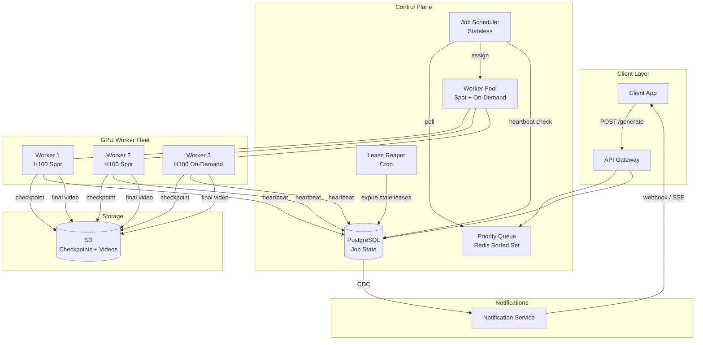
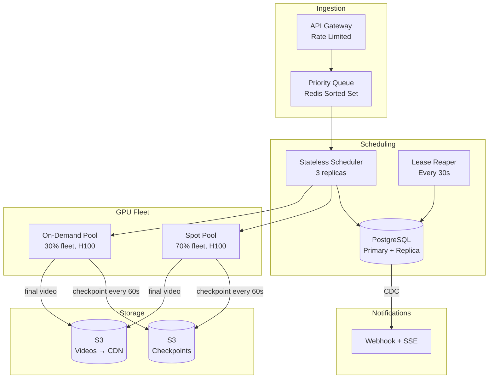
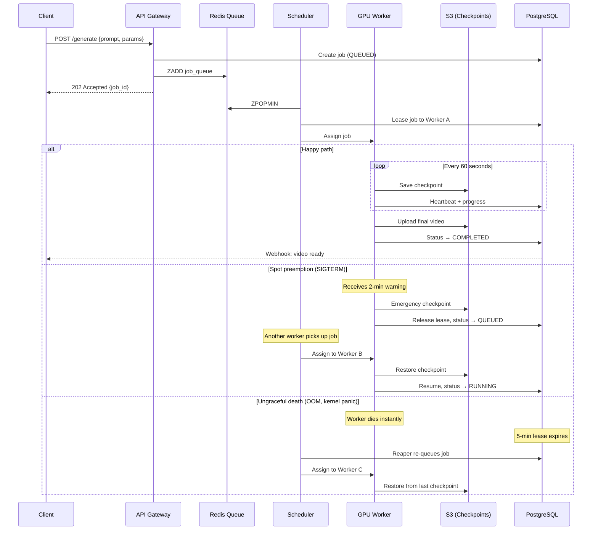

# System Design: Text-to-Video Generation Pipeline (Sora-like)

## From a Single GPU Worker to Preemption-Resilient Distributed Rendering: A Staff Engineer's Guide

---

## Table of Contents

1. [The Problem & Why It's Hard](#1-the-problem--why-its-hard)
2. [Requirements & Scope](#2-requirements--scope)
3. [Phase 1: Single GPU Worker](#3-phase-1-single-gpu-worker)
4. [Why Naive Fails (The Math)](#4-why-naive-fails-the-math)
5. [Phase 2: Distributed Architecture](#5-phase-2-distributed-architecture)
6. [Core Component Deep Dives](#6-core-component-deep-dives)
7. [The Scaling Journey](#7-the-scaling-journey)
8. [Failure Modes & Resilience](#8-failure-modes--resilience)
9. [Data Model & Storage](#9-data-model--storage)
10. [Observability & Operations](#10-observability--operations)
11. [Design Trade-offs](#11-design-trade-offs)
12. [Common Interview Mistakes](#12-common-interview-mistakes)
13. [Interview Cheat Sheet](#13-interview-cheat-sheet)

---

## 1. The Problem & Why It's Hard

You're asked to design the backend job scheduling and processing pipeline for a text-to-video AI service like OpenAI's Sora. Users submit text prompts, and the system generates videos — a process that takes minutes per request, consumes an entire GPU per job, and runs on a fleet of spot instances that can vanish at any moment.

On the surface, it's "just a job queue with GPU workers." The trap is thinking the hard part is execution. The hard part is that your compute infrastructure is **actively hostile** — spot instances get preempted mid-render, each worker can only process one video at a time, and a single 10-second video generation consumes the GPU resources equivalent to thousands of ChatGPT queries ($0.50–$2.00 actual compute cost per video).

> **The interviewer's real question**: Can you design a job scheduling system where workers are unreliable, expensive, and single-threaded — and still guarantee every user's video gets generated exactly once, with graceful handling of preemptions that can kill a 10-minute render at minute 9?

The constraints that make this different from a typical job queue:

1. **One worker = one job**: A GPU worker can only process one video at a time. No batching, no multiplexing. This means your fleet size directly equals your concurrency.
2. **Workers die without warning**: Spot instances get a 2-minute termination notice (AWS) or none at all (some providers). A 10-minute render killed at minute 9 is 9 minutes of GPU time wasted — at $3/hour per H100, that's $0.45 burned.
3. **Jobs are expensive and long-running**: Unlike sub-second API calls, video generation takes 2–15 minutes. A retry doesn't cost milliseconds — it costs dollars and minutes of user wait time.
4. **GPU scarcity is real**: H100s cost $3–4/hour on-demand. Spot instances save 60–70% but have 5–15% interruption rates. Your scheduler must optimize for cost while maintaining throughput.

> **Staff+ Signal:** The deceptively hard part isn't the queue or the workers — it's **checkpoint/resume**. Without checkpointing, a spot preemption at minute 9 of a 10-minute render wastes 90% of the compute. With checkpointing every 30 seconds, you lose at most 30 seconds of work. But checkpointing a diffusion model's intermediate state to S3 takes 5–15 seconds and consumes memory bandwidth — so checkpoint frequency is a direct trade-off between wasted compute on preemption vs. overhead during normal execution. Most candidates never mention this. Staff+ candidates design the checkpoint interval as a function of spot interruption probability.

---

## 2. Requirements & Scope

### Functional Requirements

- **Prompt submission**: Users submit text prompts to generate videos (with optional parameters: duration, resolution, aspect ratio, style)
- **Async processing**: Return a job ID immediately; user polls or receives a webhook when complete
- **Job queue with priority**: Support priority tiers (paid users, free tier, internal)
- **Progress tracking**: Real-time progress updates (percentage complete, current frame)
- **Result delivery**: Generated video stored in object storage, downloadable via signed URL
- **Retry on failure**: Automatic retry on worker crash or spot preemption (with checkpoint resume)
- **Cancellation**: Users can cancel in-progress jobs
- **Rate limiting**: Per-user and per-tier job submission limits

### Non-Functional Requirements

| Requirement | Target | Rationale |
|---|---|---|
| Job pickup latency | < 30s from submission | User should see "processing" quickly, not sit in unknown state |
| Generation throughput | 100K videos/day | Mid-scale service (Sora reportedly handles millions) |
| Availability | 99.9% (job acceptance) | Users must always be able to submit; processing can queue |
| Video generation SLA | < 5 min for 10s video (p95) | Competitive with Sora/Runway |
| Preemption recovery | < 60s to resume from checkpoint | Minimize wasted GPU time |
| Exactly-once generation | No duplicate or lost videos | Double-generation wastes expensive GPU time |

### Scale Estimation (Back-of-Envelope)

```
Videos per day:             100,000
Average generation time:    5 minutes (300 seconds)
GPU-seconds per day:        100K × 300s = 30,000,000 GPU-seconds = 347 GPU-days
Peak multiplier:            3x (business hours, viral prompts)
Peak concurrent jobs:       100K / 86,400 × 300s × 3 = ~1,042 concurrent jobs at peak
GPU fleet size (peak):      ~1,042 GPUs (1 job per GPU)
                            With spot (70% fleet): ~730 spot + ~312 on-demand

Cost per video (H100):      5 min × $3.50/hr = $0.29 (spot) or $0.97 (on-demand)
Daily GPU cost (spot-heavy): ~$29,000/day spot + ~$10,000/day on-demand = ~$39,000/day
Monthly cost:               ~$1.2M/month
Storage per video:          50 MB average (10s, 1080p, H.264)
Storage per day:            100K × 50MB = 5 TB/day
Storage per year:           1.8 PB/year (before tiered lifecycle)

Checkpoint size:            500 MB–2 GB per job (diffusion model intermediate state)
Checkpoint writes/day:      100K jobs × 10 checkpoints = 1M checkpoint writes
Checkpoint storage (peak):  1,042 concurrent × 1GB = ~1 TB hot checkpoint storage

Database writes/sec:        100K jobs × 12 status transitions / 86,400 = ~14 writes/sec
                            (modest — not a bottleneck)
```

**Why these numbers matter for the interview:**
- 1,042 concurrent GPUs means you need a large fleet with autoscaling — not a static pool
- $1.2M/month compute cost means spot instance optimization is a **business-critical** decision, not a nice-to-have
- 1M checkpoint writes/day at 1GB each means S3 is the only viable checkpoint store (not Redis, not local disk)
- 14 writes/sec for job state is manageable for a single PostgreSQL instance — the bottleneck is GPU scheduling, not database

> **Staff+ Signal:** The most important derived number is the **cost of wasted compute from preemptions**. With 730 spot instances at 10% interruption rate, ~73 jobs get preempted per hour. Without checkpointing, each wastes an average of 2.5 minutes of GPU time ($0.15 each). That's $262/day wasted. With 30-second checkpoints, waste drops to $0.03 per preemption — $53/day. The checkpoint system pays for itself in 2 days. This is the kind of math that makes an interviewer's eyes light up.

---

## 3. Phase 1: Single GPU Worker

Start with the simplest thing that works: one machine, one GPU, one job at a time.

```
┌──────────────────────────────────────────────────┐
│              Single GPU Worker                    │
│                                                   │
│  ┌──────────┐    ┌─────────────────────────────┐  │
│  │  HTTP     │    │     Video Generator          │  │
│  │  API      │───▶│                              │  │
│  │  Server   │    │  1. Parse prompt             │  │
│  └──────────┘    │  2. Load model to GPU VRAM   │  │
│       │          │  3. Run diffusion (N steps)   │  │
│       ▼          │  4. Decode latent → frames    │  │
│  ┌──────────┐    │  5. Encode frames → MP4      │  │
│  │  SQLite   │    │  6. Save to disk             │  │
│  │  (jobs)   │    └─────────────────────────────┘  │
│  └──────────┘              │                       │
│                            ▼                       │
│                   ┌─────────────────┐              │
│                   │  /output/*.mp4  │              │
│                   └─────────────────┘              │
└──────────────────────────────────────────────────┘
```

### How It Works

```python
def process_job(job):
    model = load_model_to_gpu()        # ~30s cold start, ~0s if warm

    latents = generate_initial_noise(job.seed, job.resolution)

    for step in range(num_diffusion_steps):
        latents = denoise_step(model, latents, job.prompt, step)

    frames = decode_latents_to_frames(latents)
    video_bytes = encode_frames_to_mp4(frames, job.fps)
    save_to_disk(f"/output/{job.id}.mp4", video_bytes)
    update_status(job.id, "COMPLETED")
```

### What Works at This Scale

- **Dead simple**: No distributed systems. One process, one GPU. Easy to debug.
- **No coordination overhead**: No leases, no heartbeats, no race conditions.
- **Model stays warm**: Since there's only one worker, the model stays loaded in GPU VRAM between jobs. No cold start after the first job.
- **Handles ~288 videos/day**: At 5 min/video, one GPU processes 12/hour × 24 = 288 videos/day.

### When Does Phase 1 Work?

Internal tool, prototype, or very small user base (< 300 videos/day). Perfect for validating the model and API contract before investing in distributed infrastructure.

---

## 4. Why Naive Fails (The Math)

### Problem 1: Throughput Ceiling

```
Single GPU capacity:        288 videos/day (one at a time, 5 min each)
Target:                     100,000 videos/day
Gap:                        347x — need ~350 GPUs minimum
```

Adding more GPUs means distributed scheduling. The moment you have >1 worker, you need a queue, job assignment, and failure handling.

### Problem 2: Spot Preemption Destroys Work

```
Scenario: Job starts at T=0, spot preemption at T=4 min (of 5 min total)

Without checkpointing:
  - 4 minutes of GPU time wasted ($0.23 at spot rates)
  - Job must restart from scratch (5 more minutes)
  - User waited 9 minutes instead of 5
  - Total GPU cost: $0.52 instead of $0.29

With checkpointing every 30 seconds:
  - Lose at most 30 seconds of work
  - Job resumes on new worker in ~60 seconds (30s to acquire + 30s to restore)
  - User waited ~5.5 minutes instead of 5
  - Total GPU cost: $0.32 instead of $0.29
```

At scale with 730 spot instances and 10% hourly interruption rate:

| Metric | No Checkpoint | 30s Checkpoint | 2-min Checkpoint |
|---|---|---|---|
| GPU hours wasted/day | 182 hours | 6 hours | 36 hours |
| Cost wasted/day | $637 | $21 | $126 |
| Extra user wait time (avg) | +4 min | +1 min | +2.5 min |
| Checkpoint overhead | 0% | ~8% (5s save / 60s interval) | ~4% |

### Problem 3: No Priority or Fairness

A free-tier user submitting 100 videos can block a paying customer's single urgent request. Without priority queues, first-come-first-served treats all jobs equally — which is unacceptable for a paid product.

### Problem 4: GPU Cold Starts

When a new GPU worker spins up, it must load the model into VRAM — a process that takes 30–90 seconds for large diffusion models. If you're rapidly scaling up during peak hours, users see an extra minute of delay. This is worse on spot instances, which are provisioned fresh each time.

> **Staff+ Signal:** The checkpoint overhead math is the key insight. Checkpointing every 30 seconds adds ~8% overhead to normal execution (5 seconds to serialize intermediate latents to S3 every 60 seconds of compute). But it reduces wasted compute by 97% during preemptions. The break-even point is: if preemption probability per job exceeds 3% (which it does on spot instances), checkpointing is strictly better. Most candidates either skip checkpointing entirely or add it without quantifying the trade-off.

---

## 5. Phase 2: Distributed Architecture

The key architectural insight: **Treat GPU workers as unreliable, stateless execution units that lease jobs and checkpoint progress to durable storage, so any worker can resume any job from its last checkpoint.**



### How Real Companies Built This

**Runway + Anyscale (Ray)**: Runway built Gen-3 Alpha on Anyscale's managed Ray platform. Their initial approach used KubeRay on Kubernetes, but it broke down when 4–5 researchers ran concurrent jobs — "researchers would accidentally set up their resources incorrectly and accidentally mess up someone else's job." They moved to Anyscale for managed multi-tenancy, achieving 13x faster model loading and 85% reduction in pipeline deployment time. Key insight: they separate preprocessing onto CPU pools and reserve GPUs strictly for inference/training — never mix workloads on the same GPU.

**AMD ROCm Video Generation Serving**: AMD's reference architecture uses Redis as the job queue (`RPUSH` for submission, `BLPOP` for workers) with per-job response queues (`job_resp:<job_id>`). Rank 0 of a Torchrun distributed group fetches jobs from Redis and broadcasts to all ranks. The separation of API server, Redis queue, and Torchrun workers allows independent scaling of each tier — a pattern directly applicable to our design.

**Replicate**: Replicate manages warm/cold model states across their GPU fleet. Popular models are kept "warm" (loaded in VRAM) for instant startup. Less-used models go "cold" and require 30–60 second cold starts. Custom models run in private containers with up to 1-minute cold boots. Their key insight: **model warmth is a scheduling dimension** — route jobs to workers that already have the model loaded.

**AWS Spot Instance Best Practices**: AWS provides a 2-minute interruption notice via EC2 metadata and EventBridge. Best practice is to catch the `SIGTERM` signal, checkpoint immediately, and gracefully shut down. For GPU workloads, AWS recommends checkpointing every 15 minutes for training, but video generation jobs (shorter, higher value per minute) benefit from more frequent checkpoints.

### Key Data Structure: Job State Machine

```
                           ┌─── preempted ───┐
                           ▼                  │
  QUEUED ──acquire──▶ RUNNING ──checkpoint──▶ RUNNING
    ▲                    │                      │
    │                    │                      │
    │              ┌─────┴──────┐               │
    │              ▼            ▼               │
    │          COMPLETED    FAILED              │
    │                       (retries < max?)    │
    │                       yes ──▶ QUEUED ─────┘
    │                       no  ──▶ DEAD
    │
    └── lease expired (reaper) ◀── RUNNING (worker dead)
```

Each job record carries:
- `checkpoint_uri`: S3 path to latest checkpoint (null if none)
- `checkpoint_step`: Diffusion step number at last checkpoint
- `lease_expires_at`: Heartbeat-based TTL
- `worker_id`: Which worker currently holds the lease
- `attempt`: Current attempt number (for idempotency)

---

## 6. Core Component Deep Dives

### 6.1 Priority Queue (Redis Sorted Set)

The queue must support priority ordering, not just FIFO. A paying customer's job should jump ahead of free-tier jobs.

**Implementation**: Redis sorted set with composite score:

```
Score = (priority_tier × 1_000_000_000) + unix_timestamp

ZADD job_queue <score> <job_id>

# Priority tiers:
#   1 = critical (internal, SLA-bound)
#   2 = paid (Pro/Enterprise users)
#   3 = free tier

# Example scores:
#   Paid job at 10:00:00  → 2_000_000_000 + 1709290800 = 3709290800
#   Free job at 09:59:00  → 3_000_000_000 + 1709290740 = 4709290740
#   Paid job has LOWER score → dequeued first (ZPOPMIN)
```

**Worker pulls jobs**: `ZPOPMIN job_queue` atomically removes and returns the highest-priority (lowest-score) job.

**Why not Kafka?** Kafka provides ordering within partitions but not cross-partition priority. You'd need separate topics per priority level with weighted consumption — more complex than a sorted set. Redis is sufficient at our scale (14 writes/sec is trivial for Redis).

### 6.2 Job Scheduler (Lease Manager)

The scheduler is responsible for two things: assigning jobs to workers and detecting dead workers.

**Job acquisition flow:**

```python
def acquire_job(worker_id):
    # Atomically pop highest-priority job from Redis
    job_id = redis.zpopmin("job_queue")
    if not job_id:
        return None  # No work available

    # Claim in database with lease
    rows_updated = db.execute("""
        UPDATE jobs
        SET status = 'RUNNING',
            worker_id = %s,
            lease_expires_at = NOW() + INTERVAL '5 minutes',
            attempt = attempt + 1,
            version = version + 1
        WHERE id = %s AND status = 'QUEUED' AND version = %s
    """, worker_id, job_id, expected_version)

    if rows_updated == 0:
        return None  # Race condition — another worker got it

    return job_id
```

**Lease renewal (heartbeat):**

Workers call `/heartbeat` every 60 seconds:

```python
def renew_lease(job_id, worker_id, progress_pct):
    db.execute("""
        UPDATE jobs
        SET lease_expires_at = NOW() + INTERVAL '5 minutes',
            progress = %s
        WHERE id = %s AND worker_id = %s AND status = 'RUNNING'
    """, progress_pct, job_id, worker_id)
```

**Lease reaper (detects dead workers):**

A cron job runs every 30 seconds:

```python
def reap_expired_leases():
    expired_jobs = db.execute("""
        UPDATE jobs
        SET status = 'QUEUED',
            worker_id = NULL,
            lease_expires_at = NULL
        WHERE status = 'RUNNING'
          AND lease_expires_at < NOW()
          AND attempt < 3
        RETURNING id, checkpoint_uri
    """)
    for job in expired_jobs:
        redis.zadd("job_queue", {job.id: compute_score(job)})
        log.warn(f"Re-queued job {job.id} (checkpoint: {job.checkpoint_uri})")
```

**Why 5-minute lease TTL?** Video generation jobs are long-running (2–15 minutes). A 5-minute TTL with 60-second heartbeats gives 5 missed heartbeats before a job is considered abandoned. This balances fast detection (don't wait 30 minutes) with resilience to transient network issues (don't false-positive on a 2-second blip).

> **Staff+ Signal:** The lease TTL must be tuned to the preemption notice window. AWS gives a 2-minute warning before spot termination. If your lease TTL is 5 minutes and the worker receives a SIGTERM, it has 2 minutes to: (1) checkpoint current state to S3, (2) release the lease explicitly, and (3) shut down gracefully. If the worker uses the full 2 minutes for checkpointing and graceful shutdown, the job is re-queued immediately — no waiting for lease expiry. The 5-minute TTL is the fallback for **ungraceful** deaths (kernel panic, network partition, OOM kill) where no SIGTERM is received.

### 6.3 GPU Worker (Checkpoint/Resume Engine)

The worker is the most complex component. It must:
1. Pull a job from the scheduler
2. Check for existing checkpoint (resume vs. fresh start)
3. Execute diffusion steps with periodic checkpointing
4. Handle SIGTERM gracefully (spot preemption)
5. Upload final video to S3

```python
class GPUWorker:
    def run(self):
        job = self.scheduler.acquire_job(self.worker_id)
        if not job:
            time.sleep(5)  # Back off when no work
            return

        # Resume from checkpoint or start fresh
        if job.checkpoint_uri:
            latents, start_step = self.restore_checkpoint(job.checkpoint_uri)
        else:
            latents = self.generate_initial_noise(job)
            start_step = 0

        model = self.ensure_model_loaded()  # Warm start if already loaded

        for step in range(start_step, total_steps):
            latents = self.denoise_step(model, latents, job.prompt, step)

            # Checkpoint every N steps
            if step % checkpoint_interval == 0:
                uri = self.save_checkpoint(job.id, latents, step)
                self.scheduler.update_checkpoint(job.id, uri, step)

            # Heartbeat with progress
            progress = step / total_steps * 100
            self.scheduler.heartbeat(job.id, self.worker_id, progress)

        # Generate final video
        frames = self.decode_latents(latents)
        video_url = self.upload_video(job.id, frames)
        self.scheduler.complete_job(job.id, video_url)

    def handle_sigterm(self, signum, frame):
        """Called on spot preemption (2-min warning)"""
        uri = self.save_checkpoint(self.current_job.id, self.latents, self.current_step)
        self.scheduler.update_checkpoint(self.current_job.id, uri, self.current_step)
        self.scheduler.release_lease(self.current_job.id)
        sys.exit(0)
```

**Checkpoint format:**

```
s3://checkpoints/{job_id}/attempt-{N}/step-{step}.pt

Contents:
  - latents tensor (500MB–2GB depending on resolution)
  - RNG state (for reproducibility)
  - step number
  - scheduler state (noise schedule position)
```

**Checkpoint interval calculation:**

```
Optimal checkpoint interval = sqrt(2 × checkpoint_cost × mean_time_between_failures)

Where:
  checkpoint_cost = 5 seconds (serialize + upload to S3)
  MTBF for spot = 600 seconds (10% hourly interrupt rate → ~10 min MTBF)

  Optimal = sqrt(2 × 5 × 600) = sqrt(6000) ≈ 77 seconds

Practical: checkpoint every 60 seconds (round down for safety)
           = every ~12 diffusion steps at 5 steps/sec
```

### 6.4 Notification Service (Progress + Completion)

Users need real-time progress updates and completion notifications.

**SSE for progress streaming:**

```
GET /api/v1/jobs/{job_id}/progress
Content-Type: text/event-stream

data: {"progress": 0, "status": "queued", "position": 42}
data: {"progress": 0, "status": "running", "worker": "w-3a8f"}
data: {"progress": 25, "status": "running", "step": 25, "total_steps": 100}
data: {"progress": 50, "status": "running", "step": 50, "total_steps": 100}
data: {"progress": 100, "status": "completed", "video_url": "https://cdn.example.com/v/abc123.mp4"}
```

**Webhook for async consumers:**

```json
POST {customer_webhook_url}
{
  "event": "video.completed",
  "job_id": "job_abc123",
  "video_url": "https://cdn.example.com/v/abc123.mp4",
  "duration_seconds": 10,
  "generation_time_seconds": 287,
  "cost_credits": 50
}
```

**Implementation**: The notification service watches the `jobs` table via CDC (PostgreSQL WAL → Debezium → Kafka topic). When a job status changes, it pushes to connected SSE clients and fires webhooks.

> **Staff+ Signal:** Progress reporting has a subtle UX challenge. During a spot preemption, progress jumps backward — from 85% to "re-queuing" to 0% to 85% (after checkpoint restore). Most candidates design linear progress bars. Staff+ candidates design for **non-monotonic progress** with a state like "resuming from checkpoint at 85%" that explains the discontinuity. Sora's UI shows "processing" without a percentage for exactly this reason — it avoids the jarring backward jump.

---

## 7. The Scaling Journey

### Stage 1: Single Worker (0–300 videos/day)

```
Client → API Server → SQLite Queue → 1 GPU Worker → Local Disk
```

One H100, one process. Model stays warm in VRAM. No checkpointing needed (no spot instances at this scale — use on-demand). Cost: ~$2,500/month.

**Limit**: Throughput ceiling at 288 videos/day. No fault tolerance.

### Stage 2: Worker Pool + Redis Queue (300–10K videos/day)

```
Client → API → Redis Queue → 5-35 GPU Workers (on-demand) → S3
                    ↕
              PostgreSQL (job state)
```

**New capabilities:**
- Redis sorted set for priority queuing
- Multiple GPU workers polling for jobs
- PostgreSQL for job state and audit trail
- S3 for video output storage
- Basic heartbeat (5-min lease TTL)

**Limit**: On-demand GPUs only — cost is $0.97/video. At 10K videos/day, that's $9,700/day ($291K/month). No checkpointing — worker crash means full restart.

### Stage 3: Spot Instances + Checkpoint/Resume (10K–100K videos/day)



**New capabilities at this stage:**
- 70/30 spot/on-demand GPU split (saves ~50% vs. all on-demand)
- Checkpoint/resume: intermediate latents saved to S3 every 60 seconds
- SIGTERM handler: graceful checkpoint on spot preemption (2-min warning)
- Lease reaper: detects ungraceful worker deaths, re-queues with checkpoint
- Priority tiers: paid users jump the queue
- Autoscaling: scale spot fleet based on queue depth

**Cost at this stage:**
```
100K videos/day × $0.32 avg (blended spot + on-demand + checkpoint overhead)
= $32,000/day = $960,000/month
Savings vs. all on-demand: $1.7M/month
```

**Limit**: Single-region. Single PostgreSQL. No model warmth optimization (cold starts on new spot instances).

### Stage 4: Multi-Region Enterprise (100K+ videos/day)

Everything in Stage 3, plus:
- **Model cache layer**: Pre-load model weights on persistent NVMe volumes. New spot instances mount the volume instead of downloading from S3 (cold start drops from 60s to 5s)
- **Multi-region deployment**: GPU fleet in us-east-1, us-west-2, eu-west-1 with geo-routed job assignment
- **Tiered SLA**: Enterprise customers get dedicated on-demand GPU pools with guaranteed capacity
- **Cost optimization**: Predictive spot pricing — shift non-urgent jobs to regions/times with cheapest spot rates
- **A/B model routing**: Route jobs to workers running different model versions for quality comparison

> **Staff+ Signal:** At Stage 4, the team structure matters as much as the architecture. The GPU fleet should be owned by an infrastructure team. The scheduler and job state by a platform team. The model loading and inference by an ML engineering team. The API and user experience by a product team. Drawing these boundaries wrong means four teams coordinate on every spot preemption incident. The scheduler/checkpoint system is the critical interface — it must be owned by a single team with clear SLOs for job completion rate and preemption recovery time.

---

## 8. Failure Modes & Resilience

### Request Flow with Failure Handling



### Failure Scenarios

| Failure | Detection | Recovery | Blast Radius |
|---|---|---|---|
| Spot preemption (graceful) | SIGTERM signal | Checkpoint to S3, release lease, re-queue immediately | Single job; loses ≤2 min of progress |
| Worker OOM kill | Lease expires (5 min) | Reaper re-queues; resumes from last checkpoint | Single job; loses up to 60s of progress + 5 min detection delay |
| Worker network partition | Heartbeat fails; lease expires | Re-queued after 5 min; original worker may still be running (lease check on completion prevents double-write) | Single job; brief duplicate execution possible |
| Redis failure | Connection errors | Workers fall back to polling PostgreSQL directly (degraded mode) | All new job scheduling pauses; running jobs continue |
| PostgreSQL failure | Connection pool errors | Failover to synchronous replica; workers buffer heartbeats in memory | New job creation pauses; running jobs continue (workers have job payload in memory) |
| S3 checkpoint failure | Upload error, timeout | Retry with exponential backoff; if persistent, worker logs warning and continues without checkpoint | Increased risk: if preempted before next successful checkpoint, more progress lost |
| Model corruption in VRAM | NaN outputs, CUDA errors | Worker kills itself, job re-queued from checkpoint | Single job; worker restarts with fresh model load |
| Checkpoint corruption | Restore fails (bad tensor) | Fall back to previous checkpoint; if none valid, restart from scratch | Single job; worst case full restart |

### The Duplicate Execution Problem

The most subtle failure mode: Worker A is running Job #42, experiences a network partition (can't heartbeat), the lease expires, and Worker B picks up the job from checkpoint. Meanwhile, Worker A's network recovers and it finishes the job. Now both workers try to upload the final video.

**Solution**: Optimistic locking on job completion:

```sql
UPDATE jobs
SET status = 'COMPLETED',
    video_url = $1,
    completed_at = NOW()
WHERE id = $2
  AND worker_id = $3  -- Only the worker holding the lease can complete
  AND status = 'RUNNING'
  AND version = $4;   -- Optimistic lock
```

Worker A's completion fails (its `worker_id` no longer matches), and it discards its result. Worker B completes normally.

> **Staff+ Signal:** The most operationally dangerous scenario isn't a single worker failure — it's a **fleet-wide spot reclamation**. Cloud providers sometimes reclaim large numbers of spot instances simultaneously (e.g., when a large customer requests on-demand capacity). If 70% of your fleet disappears in 2 minutes, you have 700+ jobs checkpointing to S3 simultaneously, creating a write storm. Your S3 request rate might spike from 100/sec to 10,000/sec, hitting S3's per-prefix rate limits (3,500 PUT/sec). The fix: partition checkpoints across multiple S3 prefixes (`s3://checkpoints/{job_id_prefix}/{job_id}/`) and use S3 Express One Zone for low-latency writes.

---

## 9. Data Model & Storage

### Core Tables (PostgreSQL)

```sql
CREATE TABLE jobs (
    id              UUID PRIMARY KEY DEFAULT gen_random_uuid(),
    user_id         UUID NOT NULL,
    tier            VARCHAR(20) NOT NULL DEFAULT 'free',  -- 'free', 'pro', 'enterprise'
    prompt          TEXT NOT NULL,
    params          JSONB NOT NULL DEFAULT '{}',           -- resolution, duration, style, seed
    status          VARCHAR(20) NOT NULL DEFAULT 'QUEUED',
    priority        INT NOT NULL DEFAULT 3,                -- 1=critical, 2=paid, 3=free
    worker_id       UUID,
    lease_expires_at TIMESTAMPTZ,
    checkpoint_uri  TEXT,                                  -- s3://checkpoints/{job_id}/...
    checkpoint_step INT DEFAULT 0,
    video_url       TEXT,                                  -- s3://videos/{job_id}.mp4
    progress        INT DEFAULT 0,                         -- 0-100
    attempt         INT DEFAULT 0,
    max_attempts    INT DEFAULT 3,
    version         INT DEFAULT 1,                         -- optimistic locking
    error_message   TEXT,
    created_at      TIMESTAMPTZ DEFAULT NOW(),
    started_at      TIMESTAMPTZ,
    completed_at    TIMESTAMPTZ
);

CREATE INDEX idx_jobs_status ON jobs(status) WHERE status = 'QUEUED';
CREATE INDEX idx_jobs_user ON jobs(user_id, created_at DESC);
CREATE INDEX idx_jobs_lease ON jobs(lease_expires_at)
    WHERE status = 'RUNNING';
CREATE INDEX idx_jobs_tier_status ON jobs(tier, status);

CREATE TABLE job_events (
    id              UUID PRIMARY KEY DEFAULT gen_random_uuid(),
    job_id          UUID NOT NULL REFERENCES jobs(id),
    event_type      VARCHAR(50) NOT NULL,  -- 'created', 'assigned', 'checkpointed',
                                           -- 'preempted', 'resumed', 'completed', 'failed'
    worker_id       UUID,
    metadata        JSONB,                 -- checkpoint_uri, error details, etc.
    created_at      TIMESTAMPTZ DEFAULT NOW()
);

CREATE INDEX idx_events_job ON job_events(job_id, created_at);

CREATE TABLE users (
    id              UUID PRIMARY KEY DEFAULT gen_random_uuid(),
    tier            VARCHAR(20) NOT NULL DEFAULT 'free',
    credits         INT DEFAULT 100,
    rate_limit      INT DEFAULT 10,        -- max concurrent jobs
    created_at      TIMESTAMPTZ DEFAULT NOW()
);
```

### Checkpoint Storage (S3)

```
s3://video-gen-checkpoints/
  ├── {job_id_prefix}/          # First 2 chars of job_id (S3 prefix sharding)
  │   ├── {job_id}/
  │   │   ├── attempt-1/
  │   │   │   ├── step-12.pt    # Latents tensor + RNG state
  │   │   │   ├── step-24.pt
  │   │   │   └── step-36.pt
  │   │   └── attempt-2/
  │   │       └── step-36.pt    # Resumed from attempt-1's last checkpoint
  │   └── ...
  └── ...

Lifecycle policy:
  - Delete checkpoints 24 hours after job completion
  - Delete checkpoints for failed/dead jobs after 7 days
```

### Video Storage (S3 + CDN)

```
s3://video-gen-output/
  ├── {date}/
  │   ├── {job_id}.mp4          # Final rendered video
  │   └── {job_id}_thumb.jpg    # Thumbnail for preview
  └── ...

Lifecycle policy:
  - Standard tier: 30 days
  - Infrequent Access: 30-90 days
  - Glacier: 90+ days (enterprise tier only)
  - Delete (free tier): 7 days
```

### Storage Engine Choice

| Engine | Role | Why |
|---|---|---|
| PostgreSQL | Job state, user accounts, audit log | ACID for job state transitions; optimistic locking for lease management. 14 writes/sec is trivial. |
| Redis | Priority queue (sorted set) | Atomic ZPOPMIN for job acquisition; sub-millisecond latency; simple to operate at this write rate |
| S3 | Checkpoints, final videos, model weights | Virtually unlimited storage; 11 nines durability; S3 Express One Zone for low-latency checkpoint writes |
| S3 + CloudFront | Video delivery to users | CDN-backed signed URLs for fast download; geo-distributed edge caching |

---

## 10. Observability & Operations

### Key Metrics

- `videogen_queue_depth{tier, priority}` — pending jobs per tier; the primary autoscaling signal
- `videogen_queue_wait_seconds{tier, quantile}` — time from submission to worker pickup; the metric users feel most
- `videogen_generation_seconds{resolution, quantile}` — actual GPU generation time; helps capacity planning
- `videogen_checkpoint_duration_seconds{quantile}` — checkpoint save time; if growing, S3 may be throttled
- `videogen_preemptions_total{region}` — spot preemption count; spikes indicate AWS capacity pressure
- `videogen_preemption_recovery_seconds{quantile}` — time from preemption to resumed execution; SLO target < 60s
- `videogen_lease_expirations_total` — ungraceful worker deaths; spikes mean OOM or infrastructure issues
- `videogen_gpu_utilization{worker, gpu_id}` — GPU compute utilization; should be >90% during execution
- `videogen_wasted_gpu_seconds_total` — GPU time lost to preemptions (before checkpoint); the cost metric
- `videogen_estimated_drain_time_seconds{tier}` — (queue_depth × avg_generation_time) / workers; best single health metric

### Distributed Tracing

A full trace for a single video generation:

```
[API Gateway] receive request (2ms)
  └── [PostgreSQL] create job record (5ms)
       └── [Redis] enqueue to priority queue (1ms)
            └── [Scheduler] assign to Worker (50ms avg wait)
                 └── [Worker] acquire job + restore checkpoint (5,000ms cold / 500ms warm)
                      ├── [Worker] diffusion step 1-12 (60,000ms)
                      ├── [S3] checkpoint at step 12 (5,000ms)
                      ├── [Worker] diffusion step 13-24 (60,000ms)
                      ├── [S3] checkpoint at step 24 (5,000ms)
                      ├── [Worker] diffusion step 25-36 (60,000ms)
                      ├── [S3] checkpoint at step 36 (5,000ms)
                      ├── [Worker] decode latents → frames (15,000ms)
                      ├── [Worker] encode MP4 (10,000ms)
                      └── [S3] upload final video (3,000ms)
                 └── [PostgreSQL] mark COMPLETED (5ms)
                      └── [Notification] webhook + SSE push (50ms)
```

### Alerting Strategy

| Alert | Condition | Severity | Action |
|---|---|---|---|
| Queue drain time > 10 min | Sustained for 15 min | P2 | Scale GPU fleet; check spot availability |
| Preemption rate > 20%/hour | Spike detection | P1 | Shift to more on-demand capacity; check AWS spot advisor |
| Checkpoint save > 30s | p95 sustained 10 min | P2 | Check S3 throttling; verify prefix sharding |
| Lease expirations > 5/min | Sustained 5 min | P1 | Worker fleet issue: OOM kills, CUDA errors, or network partition |
| GPU utilization < 50% | Any worker sustained 5 min | P3 | Worker may be stuck; investigate CUDA hang |
| Wasted GPU hours > 20/day | Daily aggregate | P3 | Review checkpoint frequency; investigate preemption patterns |
| Job completion rate < 95% | Per-hour measurement | P1 | Systematic failure; check model, S3, or infrastructure |

> **Staff+ Signal:** The most actionable on-call dashboard isn't per-metric — it's a **cost efficiency heatmap** showing GPU utilization × preemption waste × queue depth per region. A region with high GPU utilization, low waste, and low queue depth is healthy. A region with low utilization means cold start problems (model not loaded). A region with high waste means checkpoint frequency needs tuning. A region with high queue depth means scaling lag. Each combination points to a different root cause and different runbook entry.

---

## 11. Design Trade-offs

| Decision | Option A | Option B | Recommended | Why |
|---|---|---|---|---|
| Queue backend | Redis Sorted Set | Kafka with priority topics | Redis | At 14 writes/sec, Redis is simpler and supports true priority ordering with ZPOPMIN. Kafka would require separate topics per priority with weighted consumption. Two-way door — migrate to Kafka if >10K jobs/sec. |
| Checkpoint storage | S3 Standard | S3 Express One Zone | S3 Express for hot checkpoints | Express One Zone has single-digit ms latency vs. 50ms for Standard. Checkpoints are written every 60s — latency matters. 10x more expensive per GB but checkpoints are short-lived (deleted after 24h). |
| Worker model | Pull (worker polls for jobs) | Push (scheduler dispatches to workers) | Pull | Workers self-register by polling. Scheduler doesn't need to track which workers are alive. Adding capacity = launching more workers. No server-side worker registry. |
| Spot vs. On-demand ratio | 90/10 spot-heavy | 50/50 balanced | 70/30 | 90% spot saves more but increases preemption risk during fleet-wide reclamations. 50/50 wastes money. 70/30 balances cost savings ($640K/month) with resilience. Adjustable per region. |
| Checkpoint frequency | Fixed interval (60s) | Adaptive (based on spot interruption probability) | Fixed 60s for v1 | Fixed is simpler to reason about and debug. Adaptive is better in theory (checkpoint more often when spot market is volatile) but requires real-time spot pricing feeds and adds complexity. Ship fixed, iterate to adaptive. |
| Job assignment | Random worker | Affinity-based (prefer workers with model loaded) | Affinity-based | Avoids 30-60s cold start. If no warm worker is available, assign to any worker. Cold start is better than queue delay. |
| Progress reporting | Polling (client polls GET /status) | Push (SSE/WebSocket) | Both | SSE for interactive users (watching in browser). Polling for API consumers (simpler integration). Webhook for async consumers. |

> **Staff+ Signal:** The spot/on-demand ratio is a **one-way door during peak hours**. If you're running 70% spot and AWS reclaims half your spot fleet, you're suddenly running at 65% capacity with a full queue. Scaling up on-demand takes 2-5 minutes (instance launch + model load). During that window, your queue grows by ~200 jobs. The mitigation is to maintain a **reserve pool** of pre-warmed on-demand instances at 10% of fleet size that can absorb spot reclamation shocks instantly. This costs an extra $120K/month but prevents SLA violations during fleet-wide preemption events — a trade-off that only makes sense at >$500K/month total spend.

---

## 12. Common Interview Mistakes

1. **Treating GPU workers like web servers**: "I'll use a load balancer to distribute requests across GPUs." → GPUs process one job at a time for 5 minutes. This isn't HTTP request routing — it's job scheduling. A load balancer sends the next request to any available server. A job scheduler must track which workers are busy, handle 5-minute leases, and manage checkpoints. Staff+ answer: "This is a job queue pattern, not a request routing pattern. Workers pull from a priority queue when they're free."

2. **Ignoring spot preemption entirely**: "Workers run the job and report results." → What happens when the worker dies at 90% completion? Staff+ answer: "Workers checkpoint intermediate state to S3 every 60 seconds. On preemption, the SIGTERM handler saves one final checkpoint. The re-queued job resumes from the last checkpoint on a new worker."

3. **No priority differentiation**: "All jobs go in one FIFO queue." → A paying customer's job shouldn't wait behind 1,000 free-tier jobs. Staff+ answer: "Redis sorted set with composite score: (priority_tier × 1B) + timestamp. Paid jobs always dequeue before free-tier jobs submitted earlier."

4. **Designing synchronous video generation**: "The API generates the video and returns it in the response." → A 5-minute generation blocks the HTTP connection. Staff+ answer: "Return 202 Accepted with a job_id immediately. Client polls for status or subscribes to SSE/webhook for completion notification."

5. **No cost awareness**: "We'll use on-demand H100s for everything." → At 100K videos/day, that's $2.9M/month vs. $960K/month with spot optimization. Staff+ answer: "70/30 spot/on-demand split with checkpoint/resume saves $1.7M/month. The checkpoint system pays for itself in 2 days."

6. **Forgetting model cold starts**: "A new worker picks up a job and runs it." → Loading a diffusion model into GPU VRAM takes 30-90 seconds. If you're scaling up 100 workers during peak, every user waits an extra minute. Staff+ answer: "Pre-baked container images with model weights on persistent NVMe volumes. New workers mount the volume instead of downloading from S3. Cold start drops from 60s to 5s."

7. **No checkpoint corruption handling**: "If the worker crashes, we restore from checkpoint." → What if the checkpoint itself is corrupted (partial write during crash)? Staff+ answer: "Checkpoint writes are atomic at the S3 object level — either the full object is written or it isn't. Keep the previous checkpoint until the new one is confirmed. On restore failure, fall back to the previous checkpoint or restart from scratch."

---

## 13. Interview Cheat Sheet

### Time Allocation (45-minute interview)

| Phase | Time | What to Cover |
|---|---|---|
| Clarify requirements | 3 min | Scale (100K videos/day), one-worker-one-job constraint, spot preemption, latency SLA |
| API design | 4 min | Submit (202 Accepted + job_id), status polling, SSE progress, webhook |
| High-level design | 8 min | Priority queue (Redis) → Scheduler → GPU workers (spot + on-demand) → S3 (checkpoints + videos) |
| Deep dive: checkpoint/resume | 10 min | Why it matters (cost math), checkpoint format, SIGTERM handler, resume flow, interval optimization |
| Deep dive: scheduling + leases | 8 min | Lease-based acquisition, heartbeat, reaper, optimistic locking, exactly-once guarantees |
| Failure modes + scaling | 8 min | Spot preemption (graceful vs. ungraceful), fleet-wide reclamation, cold starts, scaling journey |
| Trade-offs + wrap-up | 4 min | Spot ratio, checkpoint frequency, pull vs. push, what I'd build next |

### Step-by-Step Answer Guide

1. **Clarify**: "One GPU = one video at a time. Spot instances can die anytime. How many videos/day? What's the latency SLA? Is there priority between users?"
2. **Key insight**: "The hard part isn't the queue — it's that workers can be killed at any time. A 10-minute render killed at minute 9 wastes $0.45 of GPU time without checkpointing."
3. **API**: Submit returns 202 with job_id. Status via polling or SSE. Webhook on completion.
4. **Single machine**: One GPU, one queue, SQLite. Works for 288 videos/day.
5. **Prove it fails**: "100K videos/day needs 350 GPUs. At $0.97/video on-demand, that's $2.9M/month. Spot saves 70% but workers die randomly."
6. **Distributed architecture**: Redis sorted set (priority queue) → stateless scheduler → GPU workers (70% spot, 30% on-demand) → S3 (checkpoints every 60s + final videos).
7. **Checkpoint deep dive**: "Every 60 seconds, the worker serializes intermediate latents to S3 (5 seconds, ~1GB). On SIGTERM, emergency checkpoint before shutdown. Re-queued job resumes from last checkpoint on any worker."
8. **Lease mechanism**: "Worker acquires job via optimistic locking (conditional UPDATE). Heartbeat every 60s extends 5-min lease. Lease reaper re-queues expired jobs. Completion requires matching worker_id to prevent duplicate writes."
9. **Failure handling**: "Graceful preemption: checkpoint + release lease → 0 wait. Ungraceful: 5-min lease expiry → re-queue from last checkpoint. Fleet-wide reclamation: spike on-demand reserve pool."
10. **Scaling**: "Single GPU → pool + Redis → spot + checkpoints → multi-region + model warmth."
11. **Trade-offs**: "Spot ratio (70/30), checkpoint frequency (60s fixed), Redis vs. Kafka (Redis for priority), pull vs. push (pull for self-registering workers)."

### What the Interviewer Wants to Hear

- At **L5/Senior**: Job queue with workers, async API (202 Accepted), basic retry on failure. Mentions spot instances are unreliable.
- At **L6/Staff**: Checkpoint/resume with quantified cost savings, lease-based exactly-once with optimistic locking, priority queues with tier isolation, SIGTERM handling for graceful preemption, cold start mitigation via model warmth routing. References how Runway/Replicate actually built their GPU scheduling.
- At **L7/Principal**: Fleet-wide preemption resilience (reserve pool, S3 prefix sharding for checkpoint write storms), cost modeling as a first-class architectural constraint ($1.7M/month savings drives the checkpoint system), organizational ownership boundaries (infra team owns GPU fleet, platform team owns scheduler, ML team owns model/checkpoint format), multi-region spot arbitrage for cost optimization.

---

*Written as a reference for staff-level system design interviews. The scheduling and checkpoint patterns here apply beyond video generation to any long-running GPU workload: model training, 3D rendering, scientific simulation, and large-scale batch inference.*
