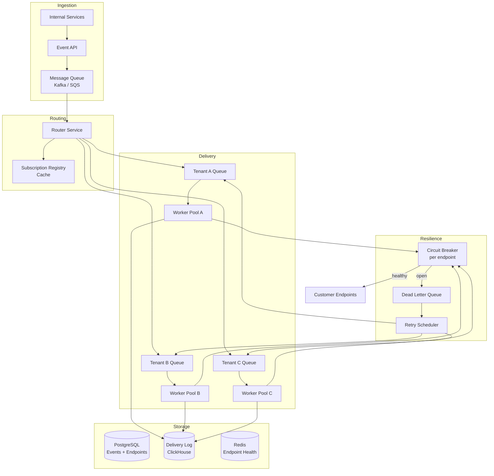
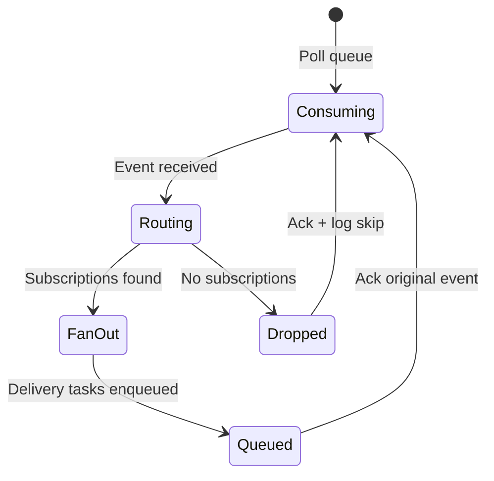
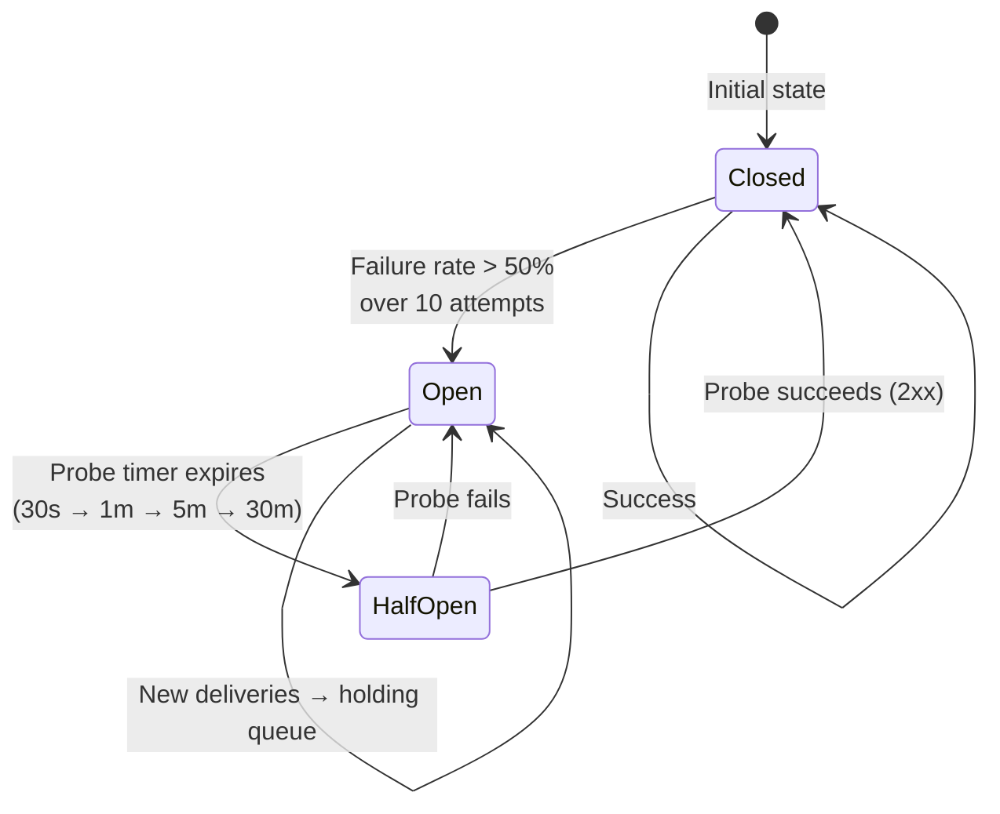
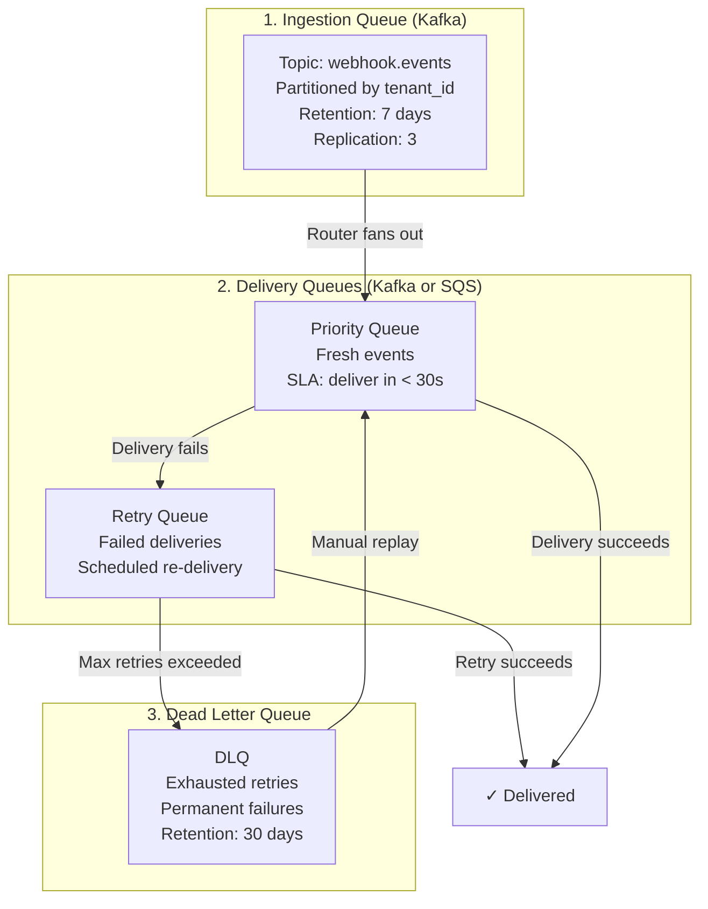
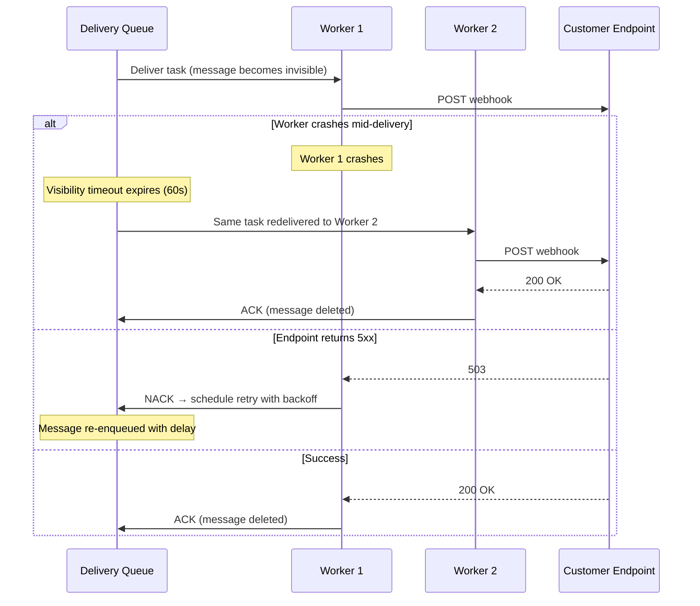
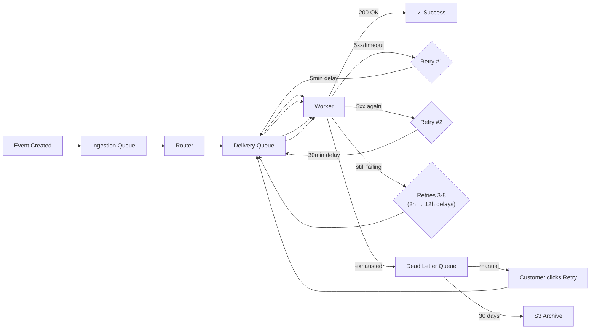
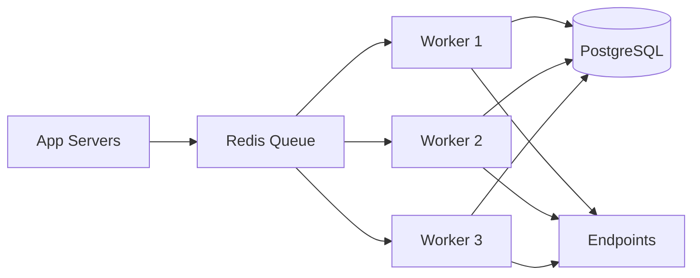
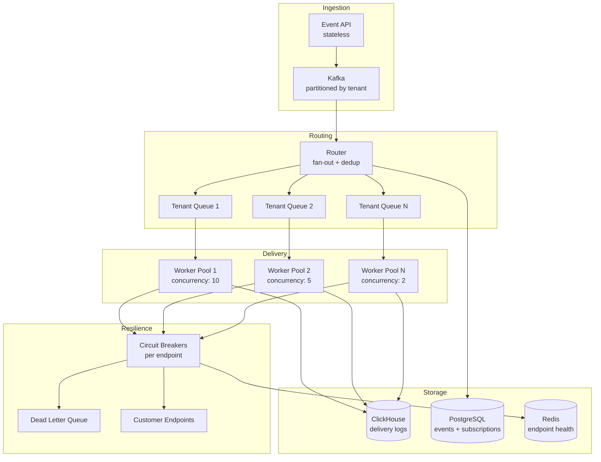
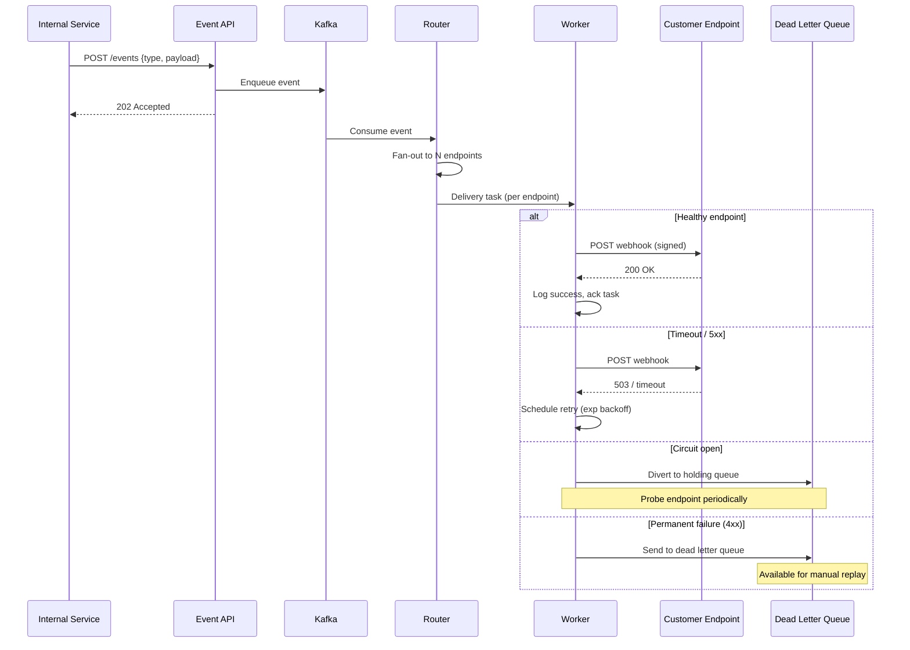

# System Design: Webhook Delivery System

## From a Simple HTTP POST to Delivering Billions of Events — A Staff Engineer's Guide

---

## Table of Contents

1. [The Problem & Why It's Hard](#1-the-problem--why-its-hard)
2. [Requirements & Scope](#2-requirements--scope)
3. [REST API Design](#3-rest-api-design)
4. [Phase 1: Single Machine Webhook Dispatcher](#4-phase-1-single-machine-webhook-dispatcher)
5. [Why the Naive Approach Fails (The Math)](#5-why-the-naive-approach-fails-the-math)
6. [Phase 2: Distributed Webhook Delivery Platform](#6-phase-2-distributed-webhook-delivery-platform)
7. [Core Component Deep Dives](#7-core-component-deep-dives)
8. [Caching Strategy Deep Dive](#8-caching-strategy-deep-dive)
9. [Message Queue & Failure Handling Deep Dive](#9-message-queue--failure-handling-deep-dive)
10. [The Scaling Journey](#10-the-scaling-journey)
11. [Failure Modes & Resilience](#11-failure-modes--resilience)
12. [Data Model & Storage](#12-data-model--storage)
13. [Observability & Operations](#13-observability--operations)
14. [Design Trade-offs](#14-design-trade-offs)
15. [Common Interview Mistakes](#15-common-interview-mistakes)
16. [Interview Cheat Sheet](#16-interview-cheat-sheet)

---

## 1. The Problem & Why It's Hard

You're asked to design a system that delivers webhook events to external customer endpoints. When something happens in your platform (a payment succeeds, a deployment completes, an order ships), you need to reliably POST a JSON payload to a URL the customer registered.

On the surface, it's "just fire an HTTP request." The trap is thinking the hard part is sending. The hard part is what happens when the other side doesn't cooperate.

> **The interviewer's real question**: Can you design a multi-tenant delivery system where one customer's broken endpoint doesn't degrade delivery for everyone else, while maintaining at-least-once guarantees across billions of events?

Your customers' endpoints are servers you don't control. They go down, they respond slowly, they return garbage status codes, they rate-limit you, and they do all of this unpredictably. You're building an outbound delivery system where every "client" is unreliable by definition.

> **Staff+ Signal:** The real challenge isn't throughput — it's tenant isolation. A single misbehaving endpoint that responds in 30 seconds per request can consume your entire worker pool, starving deliveries to every other customer. This is the noisy neighbor problem applied to outbound HTTP.

---

## 2. Requirements & Scope

### Functional Requirements

- **Event ingestion**: Accept events from internal services via API (event type, payload, target endpoint)
- **Subscription management**: CRUD for webhook endpoints with event type filtering
- **Reliable delivery**: At-least-once delivery with configurable retry policies
- **Signature verification**: Sign every payload so customers can verify authenticity
- **Delivery logs**: Full audit trail of every delivery attempt (request, response, latency)
- **Manual replay**: Allow re-delivery of failed events from the UI or API
- **Dead letter queue**: Store events that exhaust all retries for later inspection

### Non-Functional Requirements

| Requirement | Target | Rationale |
|---|---|---|
| Delivery latency (p99) | < 30s from event creation | Near-real-time for payment and order events |
| Throughput | 50,000 events/sec sustained | Supports platform-wide event fan-out |
| Availability | 99.95% | Webhook delivery is not on the critical path of user requests, but extended outages cause data loss |
| Delivery success rate | > 99.9% for healthy endpoints | Measured after retries complete |
| Retry window | Up to 72 hours | Match Stripe's 3-day retry policy |
| Max payload size | 256 KB (with claim check for larger) | Balance between utility and bandwidth |

### Scale Estimation (Back-of-Envelope)

```
Events per day:            1 billion (1B across all tenants)
Peak events per second:    ~40,000 (flash sales, batch jobs — ~3.5x average)
Average events per second: ~11,600 (1B / 86,400)
Average payload size:      5 KB
Registered endpoints:      500,000 across 100,000 tenants
Mapping:                   1 eventId → 1 URL (simplified for this design)
Delivery attempts/day:     ~1.2B (1B + ~20% retries)
Outbound bandwidth:        1B × 5KB = 5 TB/day = ~460 Mbps sustained
Storage for delivery logs: 1.2B × 1KB metadata = 1.2 TB/day → ~438 TB/year
Database reads/day:        1B subscription lookups (before caching)
Database reads/sec:        ~11,600 lookups/sec → MUST be cached
```

**Why these numbers matter for the interview:**
- 11,600 events/sec average means the database cannot handle a lookup per event without caching
- 5 TB/day outbound bandwidth costs ~$450/day on AWS ($164K/year) — claim check pattern becomes a cost decision
- 1.2 TB/day delivery logs means PostgreSQL is out — you need a columnar store like ClickHouse

> **Staff+ Signal:** The bandwidth math reveals why the claim check pattern matters. If average payload grows to 50KB (which happens as APIs mature), outbound bandwidth jumps to 50 TB/day. At that point, you're spending more on egress than compute. Offering "thin events" (just event type + resource ID, customer fetches full data via API) saves 80%+ bandwidth. At 1B events/day, this is a $1.5M/year decision.

---

## 3. REST API Design

An interviewer asking "design the REST API" is testing whether you can define clean resource boundaries, handle authentication, and think about the caller's experience. Here's the full API surface:

### Subscription Management API (Customer-Facing)

```
POST   /api/v1/webhooks/endpoints         — Register a new webhook endpoint
GET    /api/v1/webhooks/endpoints         — List all endpoints for this tenant
GET    /api/v1/webhooks/endpoints/{id}    — Get endpoint details + health status
PUT    /api/v1/webhooks/endpoints/{id}    — Update endpoint URL, events, or secret
DELETE /api/v1/webhooks/endpoints/{id}    — Remove endpoint (stops all deliveries)
POST   /api/v1/webhooks/endpoints/{id}/rotate-secret  — Rotate signing secret
```

**Register Endpoint — Request:**

```json
POST /api/v1/webhooks/endpoints
Authorization: Bearer <api_key>
Content-Type: application/json

{
  "url": "https://customer.com/webhooks",
  "event_types": ["payment.completed", "order.shipped"],
  "description": "Production payment handler",
  "secret": null,
  "metadata": {"env": "production"}
}
```

**Register Endpoint — Response:**

```json
HTTP/1.1 201 Created

{
  "id": "ep_abc123",
  "url": "https://customer.com/webhooks",
  "event_types": ["payment.completed", "order.shipped"],
  "secret": "whsec_MIGfMA0GCSq...",
  "status": "active",
  "created_at": "2026-02-23T10:00:00Z"
}
```

**Key design decisions:**
- **Auto-generate secret** if not provided — never let customers skip signing
- **Return secret only on create and rotate** — never expose it in GET responses
- **Wildcard support**: `order.*` matches `order.created`, `order.shipped`, etc.
- **URL validation**: On register, make a test POST with `event_type: "endpoint.verification"` to confirm the URL is reachable. Fail the registration if it's not.

### Event Ingestion API (Internal Service-Facing)

```
POST   /api/v1/events                    — Publish a new event
GET    /api/v1/events/{id}               — Get event details + delivery status
GET    /api/v1/events/{id}/deliveries    — List all delivery attempts for an event
POST   /api/v1/events/{id}/retry         — Manually retry a failed delivery
```

**Publish Event — Request:**

```json
POST /api/v1/events
Authorization: Bearer <internal_service_key>
Idempotency-Key: evt_20260223_payment_789

{
  "event_type": "payment.completed",
  "payload": {
    "payment_id": "pay_789",
    "amount": 9999,
    "currency": "usd"
  }
}
```

**Publish Event — Response:**

```json
HTTP/1.1 202 Accepted

{
  "event_id": "evt_xyz789",
  "event_type": "payment.completed",
  "status": "pending",
  "matched_endpoints": 1,
  "created_at": "2026-02-23T10:00:01Z"
}
```

**Key design decisions:**
- **202 Accepted** (not 201 Created) — the event is accepted but delivery is async
- **Idempotency-Key header** — prevents duplicate events when internal services retry
- **matched_endpoints count** — caller knows immediately if the event will be delivered
- **Rate limiting**: Per-tenant rate limit using token bucket (stored in Redis). Return `429 Too Many Requests` with `Retry-After` header.

### Delivery Status API (Customer-Facing)

```
GET    /api/v1/webhooks/deliveries                    — List recent deliveries (paginated)
GET    /api/v1/webhooks/deliveries/{id}               — Get delivery attempt details
POST   /api/v1/webhooks/deliveries/{id}/retry         — Manual retry from customer dashboard
```

**Delivery Details — Response:**

```json
{
  "delivery_id": "del_abc123",
  "event_id": "evt_xyz789",
  "endpoint_id": "ep_abc123",
  "event_type": "payment.completed",
  "attempts": [
    {
      "attempt": 1,
      "status_code": 503,
      "latency_ms": 2340,
      "response_body": "Service Unavailable",
      "attempted_at": "2026-02-23T10:00:01Z"
    },
    {
      "attempt": 2,
      "status_code": 200,
      "latency_ms": 120,
      "response_body": "OK",
      "attempted_at": "2026-02-23T10:05:02Z"
    }
  ],
  "status": "delivered",
  "next_retry_at": null
}
```

> **Staff+ Signal:** The API versioning strategy (`/v1/`) is a one-way door. Once customers build against your webhook format, changing the payload structure is a multi-year migration. Stripe versions their webhook payloads separately from their REST API. Consider including an `api_version` field in the endpoint registration so customers can pin their webhook format and upgrade on their own schedule.

### Webhook Payload Format (What Customers Receive)

```
POST https://customer.com/webhooks
Content-Type: application/json
X-Webhook-ID: evt_xyz789
X-Webhook-Timestamp: 1708678801
X-Webhook-Signature: v1=sha256_hmac_of_timestamp_and_body
User-Agent: WebhookService/1.0

{
  "id": "evt_xyz789",
  "type": "payment.completed",
  "created_at": "2026-02-23T10:00:01Z",
  "data": {
    "payment_id": "pay_789",
    "amount": 9999,
    "currency": "usd"
  }
}
```

**Signature verification** (what the customer does):

```python
expected_sig = hmac_sha256(
    key=endpoint_secret,
    message=f"{timestamp}.{raw_body}"
)
if not constant_time_compare(expected_sig, received_sig):
    return 403
if abs(time.now() - timestamp) > 300:  # 5-minute tolerance
    return 403  # Replay attack protection
```

---

## 4. Phase 1: Single Machine Webhook Dispatcher

The simplest approach: an application server that accepts events and delivers them synchronously.

```
┌─────────────┐     ┌──────────────────┐     ┌─────────────────┐
│ Internal     │────▶│  Webhook Server  │────▶│ Customer        │
│ Services     │     │  (single box)    │     │ Endpoints       │
└─────────────┘     │                  │     └─────────────────┘
                    │  - Accept event   │
                    │  - Look up subs   │
                    │  - POST to each   │
                    │  - Log result     │
                    │  - Retry on fail  │
                    └──────────────────┘
                           │
                    ┌──────┴──────┐
                    │  PostgreSQL  │
                    │  (events +   │
                    │   endpoints) │
                    └─────────────┘
```

```python
def handle_event(event):
    endpoints = db.get_subscriptions(event.type)
    for endpoint in endpoints:
        payload = sign(event.payload, endpoint.secret)
        try:
            response = http_post(endpoint.url, payload, timeout=10)
            db.log_delivery(event.id, endpoint.id, response.status)
        except Timeout:
            db.schedule_retry(event.id, endpoint.id, attempt=1)
```

**When does Phase 1 work?** < 1,000 events/day, < 100 endpoints, all endpoints are healthy and fast. Good for an internal tool or early-stage startup.

**When does Phase 1 fail?** See next section.

---

## 5. Why the Naive Approach Fails (The Math)

The synchronous model breaks in two dimensions simultaneously: throughput and isolation.

### Throughput Collapse

```
Events per second:         100
Endpoints per event:       3 (average fan-out)
HTTP calls per second:     300
Average response time:     200ms (healthy endpoint)
Threads needed:            300 × 0.2s = 60 concurrent threads

One slow endpoint at 10s response time:
Threads consumed:          100 × 0.2 + 200 × 10 = 2,020 threads
Thread pool exhausted at:  ~500 threads (typical server)
Result:                    ALL deliveries blocked, including healthy endpoints
```

### The Noisy Neighbor Problem (Quantified)

```
Tenant A: 1 endpoint, responds in 50ms    → consumes 0.05 thread-seconds/event
Tenant B: 1 endpoint, responds in 10,000ms → consumes 10 thread-seconds/event

Tenant B is 200x more expensive than Tenant A.
With a 500-thread pool, Tenant B alone consumes 50 threads at just 5 events/sec.
At 50 events/sec for Tenant B, the entire thread pool is consumed.
Every other tenant gets zero deliveries.
```

| Bottleneck | Single Machine | Distributed Fix |
|---|---|---|
| Thread pool exhaustion | One slow endpoint blocks all | Per-tenant worker pools with timeouts |
| Retry backlog | Retries compete with fresh events | Separate retry queues with lower priority |
| Database writes | Sequential delivery logging | Async batch writes to delivery log |
| No isolation | All tenants share everything | Circuit breakers per endpoint |
| Single point of failure | Server crash = all delivery stops | Horizontally scaled workers with at-least-once queue |

**The tipping point**: A single machine becomes unworkable the moment you have one unreliable endpoint. This isn't a scale problem — it's an isolation problem that manifests at any scale.

---

## 6. Phase 2: Distributed Webhook Delivery Platform

The key architectural insight: **Separate event ingestion from delivery, and isolate delivery per-endpoint so one customer's failure never affects another.**



### How Real Companies Built This

**Stripe** delivers webhooks with at-least-once guarantees using a retry schedule of: immediately → 5min → 30min → 2hr → 5hr → 10hr → then every 12hr for up to 3 days. They recently introduced "thin events" — a claim check pattern where the webhook payload contains just the event type and resource ID, and the customer fetches the full object via API. This dramatically reduces bandwidth and eliminates payload staleness (where a webhook contains outdated data because the resource changed between event creation and delivery).

**Shopify** processes 58 million requests per minute during Black Friday/Cyber Monday. Their webhook system retries failed deliveries up to 8 times over 4 hours. Critically, if an endpoint continues to fail past this window, Shopify *removes the webhook subscription entirely*. This is a deliberate trade-off: they protect system health by shedding load from persistently unhealthy endpoints, at the cost of requiring merchants to re-register.

**Hookdeck** (webhook infrastructure provider) has processed over 100 billion webhooks. During Black Friday 2024, they handled 10x normal traffic without a single timeout. Their key insight: queue depth alone isn't a useful metric — you need "estimated time to drain" (combining queue size, processing rate, and arrival rate) to understand if the system is keeping pace.

### Key Data Structure: Delivery Task

```json
{
  "delivery_id": "del_abc123",
  "event_id": "evt_xyz789",
  "endpoint_id": "ep_456",
  "tenant_id": "tenant_42",
  "url": "https://customer.com/webhooks",
  "payload": "{...}",
  "signature": "sha256=...",
  "attempt": 0,
  "max_attempts": 8,
  "next_retry_at": null,
  "created_at": "2026-02-23T10:00:00Z",
  "timeout_ms": 10000,
  "priority": "standard"
}
```

---

## 7. Core Component Deep Dives

### 7.1 Event Router

**Responsibilities:**
- Consume events from the ingestion queue
- Look up active subscriptions for the event type
- Fan out: create one delivery task per matching endpoint
- Route each task to the correct tenant-partitioned delivery queue



The router is the fan-out amplifier. One inbound event becomes N delivery tasks (one per subscribed endpoint). The subscription registry should be cached in-memory with a TTL (Redis or local cache with pub/sub invalidation) because subscription lookups are on the hot path for every single event.

> **Staff+ Signal:** The router must be idempotent. If the process crashes after enqueuing 3 of 5 delivery tasks, the event will be re-consumed from the ingestion queue. Each delivery task needs a deterministic ID (e.g., `hash(event_id, endpoint_id)`) so re-routing produces deduplicable tasks, not duplicates.

### 7.2 Delivery Worker

**Responsibilities:**
- Pull delivery tasks from the tenant-partitioned queue
- Make the HTTP POST with timeout enforcement
- Classify the response (success, retryable failure, permanent failure)
- Update delivery log and schedule retries as needed

Response classification:

| Status Code | Action | Reasoning |
|---|---|---|
| 2xx | Success, ack task | Delivered |
| 429 | Retry, respect Retry-After header | Consumer is rate-limiting us |
| 408, 5xx | Retry with exponential backoff | Transient server error |
| 3xx | Follow redirect (once), then deliver | Endpoint moved |
| 4xx (except 408, 429) | Permanent failure, send to DLQ | Client-side error, retrying won't help |
| Timeout (>10s) | Retry, increment endpoint latency counter | Slow consumer |
| Connection refused | Retry, check circuit breaker | Endpoint down |

> **Staff+ Signal:** The timeout value is a critical design decision. GitHub uses 10 seconds. Stripe is more generous. Too short and you'll false-positive on healthy-but-slow endpoints. Too long and a single stuck connection consumes a worker thread for the duration. The right answer is adaptive timeouts: start at 10s, and if an endpoint consistently responds in 50ms, tighten the timeout to 5s. If it consistently takes 8s, consider flagging it as degraded.

### 7.3 Circuit Breaker (Per-Endpoint)

**Responsibilities:**
- Track delivery success/failure rates per endpoint
- Trip open when failure rate exceeds threshold (e.g., >50% over 10 attempts)
- Divert new deliveries to a holding queue while open
- Periodically probe the endpoint to detect recovery
- Gradually ramp traffic back after recovery



The gradual recovery ramp is critical. When an endpoint recovers, you can't immediately blast it with the full backlog. Hookdeck uses an exponential ramp: `Rate(t) = H × (1 - e^(-t/τ))` where H is historical throughput and τ is typically 5 minutes. This reaches 63% capacity at τ and 95% at 3τ.

### 7.4 Retry Scheduler

**Responsibilities:**
- Calculate next retry time using exponential backoff with jitter
- Re-enqueue delivery tasks at the scheduled time
- Respect per-endpoint rate limits and circuit breaker state
- Expire retries after the maximum window (72 hours)

Retry schedule (matching Stripe's approach):

| Attempt | Delay | Cumulative |
|---|---|---|
| 1 | Immediate | 0 |
| 2 | 5 min | 5 min |
| 3 | 30 min | 35 min |
| 4 | 2 hours | 2h 35m |
| 5 | 5 hours | 7h 35m |
| 6 | 10 hours | 17h 35m |
| 7 | 12 hours | 29h 35m |
| 8 | 12 hours | 41h 35m |

Formula: `delay = min(base_delay × 2^attempt + jitter, max_delay)` where `jitter = random(0, delay/4)`.

The jitter prevents thundering herd: if 10,000 events fail at the same moment, without jitter they all retry at exactly the same moment, causing another spike.

---

## 8. Caching Strategy Deep Dive

The interviewer asks "how to use caching" because at 1 billion events/day, every database lookup on the hot path is a potential bottleneck. There are three distinct caching layers in this system, each solving a different problem.

### Layer 1: Subscription Lookup Cache (Critical Path)

This is the most important cache. Every incoming event triggers a subscription lookup: "which endpoint(s) are registered for this event_type?" At 11,600 events/sec, hitting PostgreSQL for each lookup is unsustainable.

```
┌────────────┐     ┌──────────────────┐     ┌──────────────┐
│   Router    │────▶│  Redis Cache     │────▶│  PostgreSQL  │
│   Service   │     │  (sub lookup)    │     │  (source of  │
│             │◀────│                  │◀────│   truth)     │
└────────────┘     └──────────────────┘     └──────────────┘

Cache key:    subscription:{event_type}
Cache value:  [{endpoint_id, url, secret, tenant_id, status}, ...]
TTL:          300 seconds (5 minutes)
Invalidation: Publish to Redis Pub/Sub channel "subscription_changes"
              on any endpoint CREATE, UPDATE, or DELETE
```

**Cache lookup flow:**

```python
def get_subscriptions(event_type):
    cache_key = f"subscription:{event_type}"
    cached = redis.get(cache_key)
    if cached:
        return deserialize(cached)

    # Cache miss — query database
    subs = db.query("""
        SELECT id, url, secret, tenant_id
        FROM webhook_endpoints
        WHERE status = 'active'
          AND (event_types @> ARRAY[%s]
               OR event_types @> ARRAY[%s])
    """, event_type, event_type.split('.')[0] + '.*')

    redis.setex(cache_key, 300, serialize(subs))
    return subs
```

**Why not local in-memory cache?** At this scale you have multiple router instances. A local cache means each instance has its own stale copy. Redis gives you a shared cache with O(1) invalidation — when an endpoint is updated, one `PUBLISH` to the invalidation channel clears the cache across all routers.

**Why not cache per-tenant instead of per-event-type?** Because the lookup is always by event_type, not by tenant_id. A tenant might subscribe to 20 event types. Per-tenant caching would require loading all 20 subscriptions when only 1 is needed.

### Layer 2: Endpoint Health Cache (Redis)

Already covered in Section 7.3 (Circuit Breaker), but worth noting the caching angle: the circuit breaker state is itself a cache of recent delivery outcomes. Without it, every delivery decision would require querying the delivery log database.

```
Cache key:    endpoint_health:{endpoint_id}
Cache value:  {state, failure_count, success_count, avg_latency_ms}
TTL:          3600 seconds
Update:       After every delivery attempt (increment counters)
```

### Layer 3: Event Deduplication Cache (Redis)

When internal services retry event publication (due to network issues), the same event can arrive twice. The idempotency key cache prevents duplicate processing.

```
Cache key:    idempotency:{idempotency_key}
Cache value:  event_id (the ID assigned on first receipt)
TTL:          86400 seconds (24 hours)
```

```python
def ingest_event(event_type, payload, idempotency_key):
    existing = redis.get(f"idempotency:{idempotency_key}")
    if existing:
        return {"event_id": existing, "status": "duplicate"}

    event_id = generate_snowflake_id()
    redis.setex(f"idempotency:{idempotency_key}", 86400, event_id)
    kafka.produce("events", key=tenant_id, value=event)
    return {"event_id": event_id, "status": "pending"}
```

### Caching Cost at Scale

```
Subscription cache entries:  ~10,000 event types × 500B avg = 5 MB
Endpoint health entries:     500,000 endpoints × 200B = 100 MB
Idempotency cache entries:   1B/day × 50B × 24hr TTL = ~50 GB peak
────────────────────────────────────────────────────────────────
Total Redis memory:          ~51 GB → fits on a single Redis cluster
Redis read QPS:              ~25,000 (subscription lookups + health checks)
```

> **Staff+ Signal:** The idempotency cache is the hidden memory hog. At 1 billion events/day with 24-hour TTL, you're storing ~1 billion keys. Even at 50 bytes each, that's 50 GB of Redis. Options: (1) shorten TTL to 1 hour (reduces to ~2 GB but risks dedup misses for slow retries), (2) use a Bloom filter for approximate dedup (false positives are safe — they just reject a valid event, which the sender retries), or (3) move dedup to the database layer using a unique constraint on idempotency_key.

---

## 9. Message Queue & Failure Handling Deep Dive

The interviewer asks "how to handle failures using a message queue" because this is the architectural backbone of reliable webhook delivery. Without a message queue, every failure mode — slow endpoints, crashes, network partitions — results in lost events.

### Why a Message Queue Is Non-Negotiable

Without a queue, the failure story looks like this:

```
Synchronous (no queue):
  Internal Service → Webhook Server → Customer Endpoint
                                      ↓ (timeout)
                                    Event LOST
                                    (server was busy, nowhere to store it)

With queue:
  Internal Service → Kafka → Router → Delivery Queue → Worker → Customer
                     ↓                                  ↓ (timeout)
                   DURABLE                            Re-enqueue for retry
                   (event survives any downstream failure)
```

### Queue Architecture: Three Distinct Queues

The system uses three separate queues, each with different guarantees and consumers:



### Queue 1: Ingestion Queue (Kafka)

**Purpose**: Decouple event producers from delivery. Internal services fire-and-forget into Kafka, getting a 202 response immediately.

```
Topic:          webhook.events
Partitions:     64 (allows 64 parallel router consumers)
Partition key:  tenant_id (events from same tenant go to same partition → ordering)
Retention:      7 days (enables replay if router has bugs)
Replication:    3 (survives any single broker failure)
Consumer group: webhook-routers
```

**Why Kafka over SQS/RabbitMQ here?**
- **Replay**: If the router has a bug that drops events, you can rewind the consumer offset and reprocess 7 days of events. SQS deletes messages after consumption.
- **Ordering**: Per-partition ordering ensures events for the same tenant arrive in order.
- **Throughput**: Kafka handles 40K+ messages/sec per partition easily. At 1B events/day (~12K/sec), 64 partitions is comfortable headroom.

### Queue 2: Delivery Queue (Per-Tenant Partitioning)

**Purpose**: Isolate delivery failures per tenant/endpoint. One broken endpoint cannot block another tenant's deliveries.

```
For Kafka-based delivery queues:
  Topic:          webhook.deliveries.{priority}
  Partitions:     256 (hashed by endpoint_id)
  Partition key:  endpoint_id
  Consumer group: webhook-workers-{priority}

For SQS-based delivery queues (simpler ops):
  Queue per priority level: webhook-deliveries-{high|standard|retry}
  Visibility timeout: 60 seconds (if worker crashes, message becomes visible again)
  Max receive count: 3 (after 3 crashes, move to DLQ)
```

**The visibility timeout is the key failure handling mechanism:**



### Queue 3: Dead Letter Queue

**Purpose**: Capture events that exhaust all retries. These are NOT lost — they're available for inspection and manual replay.

```
Trigger:         After 8 delivery attempts over 72 hours
Retention:       30 days
Access:          Customer-facing dashboard (GET /api/v1/webhooks/deliveries?status=failed)
Manual replay:   POST /api/v1/webhooks/deliveries/{id}/retry → re-enqueues to delivery queue
Auto-cleanup:    Events older than 30 days are archived to S3, then deleted from DLQ
```

### Complete Failure Recovery Flow

Here's the full lifecycle of a failed event, showing how the message queue ensures nothing is lost:



### Handling the Retry Backlog After Outage Recovery

When an endpoint recovers after being down for hours, the queue may contain thousands of backed-up events. Blasting them all at once will likely crash the endpoint again.

```python
def recover_endpoint(endpoint_id):
    backlog = queue.get_pending_count(endpoint_id)
    if backlog > 100:
        # Gradual ramp: start at 10% of normal rate, double every 5 min
        rate = max(1, endpoint.normal_rate * 0.1)
        for batch in queue.drain(endpoint_id, batch_size=rate):
            deliver_batch(batch)
            sleep(1)
            rate = min(rate * 1.2, endpoint.normal_rate)  # 20% increase per cycle
    else:
        deliver_all(endpoint_id)
```

> **Staff+ Signal:** The separation of ingestion queue (Kafka, 7-day retention) from delivery queues is a critical architectural decision. If you discover a bug in the router that caused 1 million events to be incorrectly dropped, you can replay from Kafka by resetting the consumer offset. This replay capability is worth the operational cost of running Kafka. With SQS alone, those events would be gone. This is the difference between "we had a bug and recovered in an hour" and "we lost a day of customer webhooks."

---

## 10. The Scaling Journey

### Stage 1: Startup (0–10K events/day)

```
┌──────────┐     ┌──────────────┐     ┌──────────┐
│ App      │────▶│ Webhook      │────▶│ Customer │
│ Server   │     │ Worker       │     │ Endpoint │
└──────────┘     │ (background  │     └──────────┘
                 │  thread pool)│
                 └──────┬───────┘
                        │
                 ┌──────┴──────┐
                 │  PostgreSQL  │
                 │  (everything)│
                 └─────────────┘
```

Background thread pool in your main application. Retries stored as rows in PostgreSQL with a `next_retry_at` column, polled by a cron job. No separate infrastructure.

**Limit**: One slow endpoint blocks the thread pool. No isolation. No monitoring beyond "did it work?"

### Stage 2: Growing (10K–1M events/day)



**New capabilities at this stage:**
- Dedicated worker processes (separated from the app server)
- Redis-backed queue (Sidekiq, Celery, BullMQ) for async delivery
- Basic retry logic with exponential backoff
- Delivery logs in PostgreSQL

**Limit**: Single shared queue. One tenant's slow endpoint consumes workers, blocking everyone. No circuit breaking. Delivery log table grows large and queries slow down.

### Stage 3: Platform Scale (1M–100M events/day)



**New capabilities at this stage:**
- Kafka for ingestion (durability, replay, partitioning by tenant)
- Per-tenant delivery queues with configurable concurrency limits
- Circuit breakers per endpoint with health probing
- ClickHouse for delivery log analytics (replaces PostgreSQL for high-write volume)
- Tiered worker allocation: enterprise tenants get dedicated pools

**Limit**: Operational complexity. Need dedicated on-call rotation. Kafka cluster management. Cross-region delivery adds latency variance.

> **Staff+ Signal:** At this stage, the team structure matters as much as the architecture. The ingestion pipeline should be owned by a platform team, while delivery workers and circuit breakers are owned by a reliability team. The subscription API is a product surface owned by the developer experience team. Drawing these boundaries wrong means three teams coordinate on every incident.

### Stage 4: Enterprise (100M+ events/day)

Everything in Stage 3, plus:
- Multi-region deployment with geo-routed delivery (deliver from the region closest to the customer endpoint)
- Claim check pattern for large payloads (store payload in S3, webhook contains a signed URL)
- Customer-facing delivery dashboard (self-service debugging)
- SLA-backed delivery guarantees with financial penalties
- Automated endpoint health scoring that affects retry aggressiveness

---

## 11. Failure Modes & Resilience

### Delivery Flow with Failure Handling



### Failure Scenarios

| Failure | Detection | Recovery | Blast Radius |
|---|---|---|---|
| Worker crash mid-delivery | Task visibility timeout (Kafka consumer group rebalance) | Another worker picks up the task; at-least-once semantics | Single delivery task; endpoint may receive duplicate |
| Customer endpoint down | HTTP timeout or connection refused | Exponential backoff retries for 72 hours | Only that endpoint; other tenants unaffected due to queue isolation |
| Kafka broker failure | ISR replication; consumer lag alerts | Automatic leader election; consumers reconnect | Brief ingestion delay; no data loss if replication factor ≥ 3 |
| Database (PostgreSQL) down | Connection pool errors; health checks | Failover to read replica; delivery continues from queues | New subscription changes delayed; active deliveries continue from queue state |
| Retry storm after outage | Queue depth spike; "estimated time to drain" metric | Circuit breaker opens; gradual recovery ramp | Contained to affected endpoints; other tenants isolated |
| Poison payload | Worker crashes repeatedly on same event | Dead letter after N crash-retries; alert on-call | Single event; worker restarts on other tasks |
| Clock skew across workers | Signature timestamp validation fails at customer | NTP sync; use event creation timestamp not worker clock | Customer rejects valid webhooks until clocks sync |

> **Staff+ Signal:** The most dangerous failure mode is the "success that isn't." The worker POSTs to the endpoint, the endpoint processes it and returns 200 — but the response is lost due to a network partition. The worker retries, and the customer processes the event twice. You can't prevent this on the sender side. The right approach is to include an idempotency key (`X-Webhook-ID` header) and document that customers must implement deduplication. Stripe, GitHub, and Shopify all do this.

---

## 12. Data Model & Storage

### Core Tables (PostgreSQL)

```sql
CREATE TABLE webhook_endpoints (
    id              UUID PRIMARY KEY DEFAULT gen_random_uuid(),
    tenant_id       UUID NOT NULL,
    url             TEXT NOT NULL,
    secret          TEXT NOT NULL,          -- HMAC signing key
    event_types     TEXT[] NOT NULL,        -- filter: ['payment.completed', 'order.*']
    status          VARCHAR(20) DEFAULT 'active',  -- active, paused, disabled
    rate_limit      INT DEFAULT 100,        -- max deliveries/sec to this endpoint
    created_at      TIMESTAMPTZ DEFAULT NOW(),
    updated_at      TIMESTAMPTZ DEFAULT NOW()
);

CREATE INDEX idx_endpoints_tenant ON webhook_endpoints(tenant_id);
CREATE INDEX idx_endpoints_status ON webhook_endpoints(status) WHERE status = 'active';

CREATE TABLE webhook_events (
    id              UUID PRIMARY KEY DEFAULT gen_random_uuid(),
    tenant_id       UUID NOT NULL,
    event_type      VARCHAR(100) NOT NULL,  -- e.g., 'payment.completed'
    payload         JSONB NOT NULL,
    idempotency_key VARCHAR(255),           -- dedup at ingestion
    created_at      TIMESTAMPTZ DEFAULT NOW()
);

CREATE INDEX idx_events_tenant_type ON webhook_events(tenant_id, event_type);
CREATE INDEX idx_events_created ON webhook_events(created_at);
```

### Delivery Log (ClickHouse — high write volume)

```sql
CREATE TABLE delivery_log (
    delivery_id     UUID,
    event_id        UUID,
    endpoint_id     UUID,
    tenant_id       UUID,
    attempt         UInt8,
    status_code     UInt16,
    response_body   String,             -- truncated to 1KB
    latency_ms      UInt32,
    error_message   Nullable(String),
    created_at      DateTime64(3)
) ENGINE = MergeTree()
ORDER BY (tenant_id, created_at)
PARTITION BY toYYYYMM(created_at)
TTL created_at + INTERVAL 90 DAY;
```

### Endpoint Health State (Redis)

```
Key:    endpoint_health:{endpoint_id}
Value:  {
    "state": "CLOSED",           -- CLOSED / OPEN / HALF_OPEN
    "failure_count": 2,
    "success_count": 148,
    "last_failure_at": "2026-02-23T10:05:00Z",
    "last_success_at": "2026-02-23T10:06:30Z",
    "avg_latency_ms": 120,
    "probe_interval_s": 30
}
TTL:    3600 (auto-expire stale health data)
```

### Database Query Patterns and Indexing Strategy

At 1 billion events/day, database design is not about "what tables do I need" — it's about "which queries are on the hot path and how do I make them fast?"

**Hot-path queries (>10K QPS — must be cached or indexed):**

```sql
-- Q1: Subscription lookup (11,600/sec — CACHED in Redis, fallback to DB)
SELECT id, url, secret, tenant_id
FROM webhook_endpoints
WHERE status = 'active'
  AND event_types @> ARRAY['payment.completed'];
-- Index: GIN index on event_types + partial index on status
CREATE INDEX idx_endpoints_active_events
  ON webhook_endpoints USING GIN (event_types)
  WHERE status = 'active';

-- Q2: Idempotency check (11,600/sec — CACHED in Redis, fallback to DB)
SELECT id FROM webhook_events
WHERE idempotency_key = 'evt_20260223_payment_789';
-- Index: unique constraint serves as index
ALTER TABLE webhook_events
  ADD CONSTRAINT uniq_idempotency UNIQUE (idempotency_key);
```

**Warm-path queries (100-1K QPS — indexed but not cached):**

```sql
-- Q3: List deliveries for a specific event (customer dashboard)
SELECT * FROM delivery_log
WHERE event_id = 'evt_xyz789'
ORDER BY created_at;
-- ClickHouse primary key covers this: ORDER BY (tenant_id, created_at)
-- But event_id lookups need a secondary index:
ALTER TABLE delivery_log ADD INDEX idx_event_id event_id TYPE bloom_filter;

-- Q4: List recent deliveries for a tenant (customer dashboard)
SELECT * FROM delivery_log
WHERE tenant_id = 'tenant_42'
  AND created_at > now() - INTERVAL 24 HOUR
ORDER BY created_at DESC
LIMIT 50;
-- Covered by ClickHouse primary key: ORDER BY (tenant_id, created_at)
```

**Cold-path queries (<10 QPS — full scans acceptable):**

```sql
-- Q5: Count failed deliveries by endpoint (admin analytics)
SELECT endpoint_id, count(*) as failures
FROM delivery_log
WHERE status_code >= 400
  AND created_at > now() - INTERVAL 7 DAY
GROUP BY endpoint_id
ORDER BY failures DESC;
-- ClickHouse handles this with columnar scan — no special index needed

-- Q6: Find all endpoints for a tenant (management API)
SELECT * FROM webhook_endpoints
WHERE tenant_id = 'tenant_42';
-- Covered by idx_endpoints_tenant
```

**Table partitioning strategy:**

| Table | Partition Strategy | Why |
|---|---|---|
| webhook_events | Range by created_at (monthly) | Old events can be dropped; queries are always time-bounded |
| delivery_log (ClickHouse) | Range by created_at (monthly) with 90-day TTL | Auto-expire old logs; most queries are "last 24 hours" |
| webhook_endpoints | None (500K rows total) | Small table; fits in memory |

### Storage Engine Choice

| Engine | Role | Why |
|---|---|---|
| PostgreSQL | Events, endpoints, subscriptions | ACID for subscription changes; complex queries for management API. At 500K endpoints, the full table fits in ~500MB — easily memory-resident |
| Kafka | Event ingestion queue, tenant-partitioned delivery queues | Durable, replayable, ordered within partition; handles burst traffic. 7-day retention enables replay after bugs |
| ClickHouse | Delivery log analytics | Columnar, handles 1.2B+ rows/day writes; efficient time-range aggregation. 90-day TTL auto-manages storage |
| Redis | Subscription cache, endpoint health, idempotency dedup, circuit breaker state | Sub-millisecond reads for hot-path decisions; ~51GB total memory for all cache layers |
| S3 | DLQ archive, large payloads (claim check) | Virtually unlimited storage; 11 nines durability; cheap at $0.023/GB/month |

---

## 13. Observability & Operations

### Key Metrics

- `webhook_events_ingested_total{tenant, event_type}` — inbound event rate; detect traffic spikes
- `webhook_deliveries_total{tenant, endpoint, status}` — delivery outcomes (success/retry/failed/dlq)
- `webhook_delivery_latency_seconds{tenant, quantile}` — time from event creation to successful delivery
- `webhook_queue_depth{tenant}` — pending delivery tasks per tenant; the primary scaling signal
- `webhook_queue_max_age_seconds{tenant}` — age of the oldest undelivered task; stale = falling behind
- `webhook_estimated_drain_time_seconds{tenant}` — (queue_depth × avg_processing_time) / worker_count; the single best metric for system health
- `webhook_circuit_breaker_state{endpoint}` — open/closed/half_open per endpoint
- `webhook_retry_total{attempt_number}` — retry distribution; spikes at high attempt numbers = systemic endpoint issues
- `webhook_dlq_depth` — dead letter queue size; should trend toward zero, growth means unresolved failures

### Distributed Tracing

A full trace for a single webhook delivery:

```
[Event API] receive event (2ms)
  └── [Kafka] produce to ingestion topic (5ms)
       └── [Router] consume + fan-out to 3 endpoints (8ms)
            ├── [Worker A] deliver to endpoint 1 (120ms) ✓ 200
            ├── [Worker B] deliver to endpoint 2 (timeout 10,000ms) ✗ retry
            │    └── [Retry Scheduler] scheduled retry in 5min
            └── [Worker C] deliver to endpoint 3 (85ms) ✓ 200
```

Each delivery task carries a trace ID derived from the original event, so you can follow one event through fan-out to all its delivery attempts.

### Alerting Strategy

| Alert | Condition | Severity | Action |
|---|---|---|---|
| Queue drain time > 5 min | Sustained for 10 min | P2 | Scale workers; investigate slow endpoints |
| DLQ depth growing | > 1,000 new entries/hour | P2 | Check for widespread endpoint outages |
| Circuit breakers opening | > 10 endpoints in 5 min | P1 | Possible outbound network issue; check proxy health |
| Delivery success rate < 95% | Platform-wide for 15 min | P1 | Page on-call; check DNS, TLS cert, or proxy issues |
| Event ingestion lag > 30s | Kafka consumer lag metric | P2 | Scale routers; check for poison messages |

> **Staff+ Signal:** The most useful on-call dashboard isn't per-metric — it's a tenant-level heatmap showing delivery success rate × queue depth. A single red cell means one tenant is having issues (their problem). A full red row means a system-wide outage (your problem). This distinction determines whether you page the customer or yourself.

---

## 14. Design Trade-offs

| Decision | Option A | Option B | Recommended | Why |
|---|---|---|---|---|
| Queue backend | Redis (Sidekiq/BullMQ) | Kafka | Redis < 10M events/day; Kafka above | Redis is simpler to operate. Kafka gives durability, replay, and partitioning at cost of operational complexity. This is a two-way door — you can migrate later. |
| Delivery log storage | PostgreSQL | ClickHouse | ClickHouse at scale | PostgreSQL works to ~10M rows/day. Beyond that, write amplification from indexes becomes painful. ClickHouse handles 100x the write volume with time-range partitioning. |
| Payload strategy | Full payload in webhook | Thin event (claim check) | Thin events for large payloads | Full payloads are simpler but stale on arrival (resource may have changed). Thin events save bandwidth and guarantee freshness but add an API round-trip for the customer. Stripe offers both. |
| Tenant isolation | Shared queue with priority | Per-tenant queues | Per-tenant queues | Shared queues inevitably leak isolation under load. Per-tenant queues have higher overhead but bounded blast radius. |
| Retry policy | Fixed schedule (Stripe-style) | Adaptive (based on endpoint health) | Fixed schedule for v1 | Fixed is predictable and documented. Adaptive is better but harder to explain to customers ("why did my retry timing change?"). Ship fixed, iterate to adaptive. |
| Signature scheme | HMAC-SHA256 (symmetric) | Ed25519 (asymmetric) | HMAC-SHA256 | Svix benchmarks: symmetric is ~50x faster for signing, ~160x faster for verification. Asymmetric only needed if customers must verify without knowing the secret (rare for webhooks). |

> **Staff+ Signal:** The payload strategy decision is a one-way door for your API contract. Once customers build integrations expecting full payloads, switching to thin events is a multi-year migration. Stripe is going through this right now. If you're designing from scratch, support both modes from day one and default to thin events.

---

## 15. Common Interview Mistakes

1. **Designing synchronous delivery**: "The API accepts the event and delivers it before responding." → This couples your API latency to the slowest customer endpoint. Staff+ answer: decouple ingestion from delivery. Return 202 immediately, deliver asynchronously.

2. **Single shared retry queue**: "Failed deliveries go back into the main queue." → Retry traffic competes with fresh events. During an outage, retries can completely crowd out new deliveries. Staff+ answer: separate retry queues with lower priority, or time-bucketed retry scheduling.

3. **Ignoring tenant isolation**: "All deliveries go through one worker pool." → This is the #1 mistake. One slow endpoint degrades everyone. Staff+ answer: per-tenant (or per-endpoint) queue partitioning with circuit breakers.

4. **Treating all errors the same**: "We retry on any non-200 response." → Retrying a 401 Unauthorized is pointless and wastes resources. Staff+ answer: classify responses into retryable (5xx, timeout, 429) and permanent (4xx) with different handling.

5. **No idempotency story**: "We guarantee exactly-once delivery." → You can't. Network partitions make exactly-once impossible in a distributed system. Staff+ answer: guarantee at-least-once delivery and require customers to deduplicate using the webhook ID. Document this explicitly.

6. **Forgetting the recovery thundering herd**: "When the endpoint comes back up, we deliver the backlog." → Blasting the backlog at full speed often crashes the endpoint again immediately. Staff+ answer: gradual recovery ramp with exponential traffic increase.

7. **No payload size strategy**: "We just send the full event data." → Fine at 1KB payloads, catastrophic at 50KB × 500M events/day = 25 TB egress. Staff+ answer: claim check pattern or thin events for payloads above a threshold.

---

## 16. Interview Cheat Sheet

### Time Allocation (45-minute interview)

| Phase | Time | What to Cover |
|---|---|---|
| Clarify requirements | 5 min | 1:1 vs 1:N event-URL mapping, scale (1B events/day), delivery guarantees |
| REST API design | 5 min | Registration endpoints, event ingestion, webhook payload format, idempotency |
| High-level design | 10 min | Ingestion → Kafka → router → per-tenant delivery queues → workers |
| Deep dive: caching + DB | 10 min | Three cache layers (subscription, health, dedup), DB indexing strategy, query patterns |
| Deep dive: MQ + failures | 10 min | Three queues (ingestion/delivery/DLQ), visibility timeout, retry schedule, gradual recovery |
| Trade-offs + wrap-up | 5 min | Kafka vs SQS, full vs thin payloads, tenant isolation strategy |

### Step-by-Step Answer Guide

1. **Clarify**: "Is this 1:1 (one eventId → one URL) or 1:N? 1 billion events/day = ~12K events/sec average, ~40K peak. At-least-once or best-effort?"
2. **REST API**: Show the registration endpoint (`POST /api/v1/webhooks/endpoints`), the event ingestion (`POST /api/v1/events` → 202 Accepted), and the webhook payload format with HMAC signature.
3. **Key insight**: "The hard part isn't sending HTTP requests — it's isolating tenants so one broken endpoint doesn't affect others."
4. **Single machine**: Synchronous delivery from app server, PostgreSQL for state. Works under 1K events/day.
5. **Prove it fails**: "One endpoint responding in 10s consumes 200x more worker capacity than a 50ms endpoint. The thread pool is exhausted. Also, 12K subscription lookups/sec saturates PostgreSQL without caching."
6. **Caching strategy**: Three layers — Redis for subscription lookups (11.6K/sec), endpoint health (circuit breaker state), and idempotency dedup (~50GB at peak). Cache invalidation via Redis Pub/Sub on endpoint changes.
7. **Database design**: Show the schema with indexes. Explain GIN index for event_type array lookup, partial index on active endpoints, ClickHouse for delivery logs with TTL. Partition webhook_events by created_at monthly.
8. **Message queue for failures**: Three queues — Kafka ingestion (7-day replay), delivery queue (visibility timeout for crash recovery), DLQ (30-day retention + manual replay). Explain the visibility timeout mechanism: if worker crashes, message becomes visible again after 60s and another worker picks it up.
9. **Failure handling**: Circuit breaker per endpoint, exponential backoff retries (8 attempts over 72 hours), gradual recovery ramp, idempotency keys for customers.
10. **Scale levers**: Partition queues by tenant, scale workers per queue depth, ClickHouse for delivery logs, thin events for bandwidth.
11. **Trade-offs**: Kafka (replay, ordering) vs SQS (simpler ops). Per-tenant queues (isolation) vs shared (simplicity). Full payload vs thin events ($1.5M/year bandwidth at scale).

### What the Interviewer Wants to Hear

- At **L5/Senior**: Async delivery, retry with backoff, basic queue design. Mentions idempotency.
- At **L6/Staff**: Per-tenant isolation with circuit breakers, quantified noisy neighbor problem, gradual recovery ramp, claim check pattern. References how Stripe or GitHub actually does it.
- At **L7/Principal**: Organizational ownership boundaries (who owns ingestion vs. delivery vs. customer API), multi-region delivery routing, SLA design with blast radius guarantees, migration path from shared queue to per-tenant isolation.

*Written as a reference for staff-level system design interviews.*
