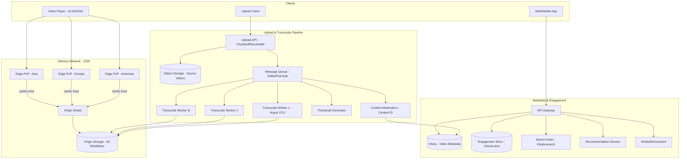
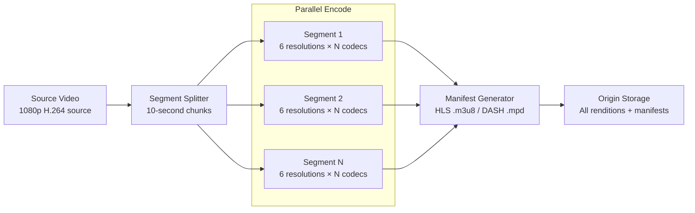
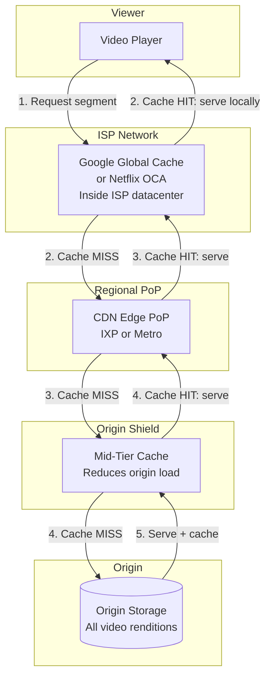
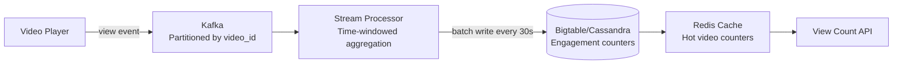
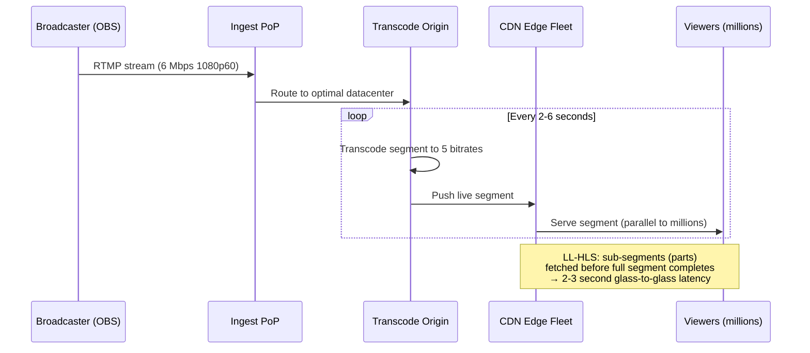
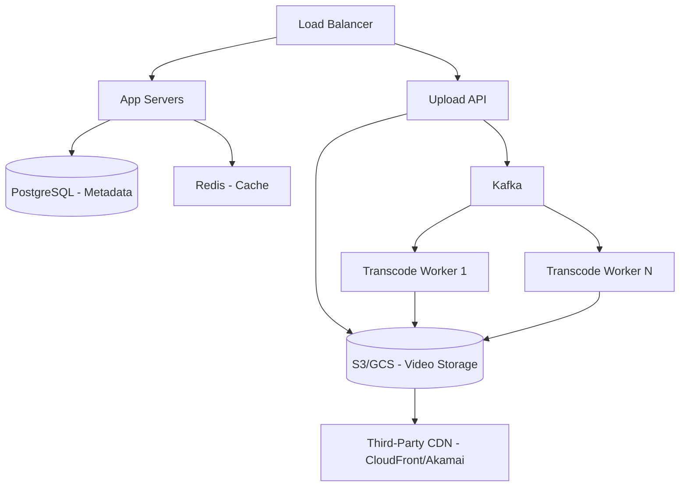
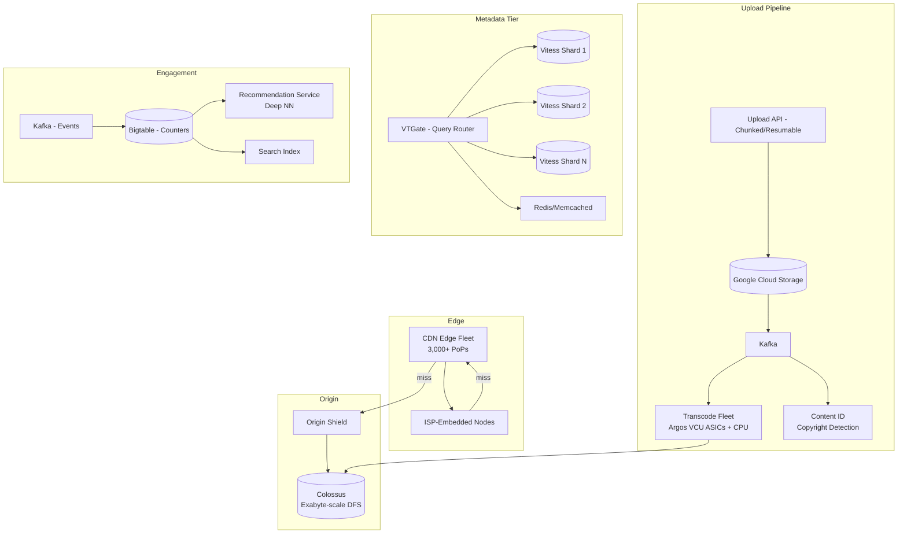
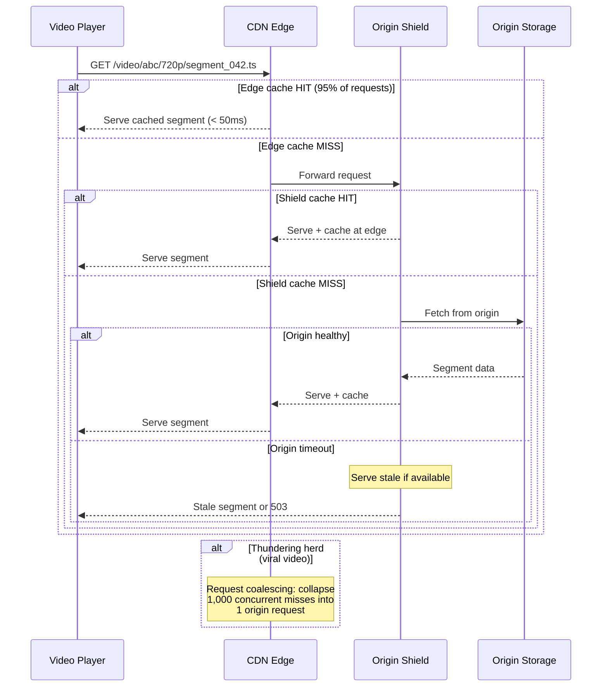

# System Design: YouTube — A Video Streaming Platform at Scale

## A Staff Engineer's Guide to Designing Video Upload, Transcoding, and Delivery Like Google

---

## Table of Contents

1. [The Problem & Why It's Hard](#1-the-problem--why-its-hard)
2. [Requirements & Scope](#2-requirements--scope)
3. [Single Machine / Naive Solution](#3-phase-1-single-server-video-platform)
4. [Why Naive Fails (The Math)](#4-why-the-naive-approach-fails-the-math)
5. [Distributed Architecture](#5-phase-2-distributed-architecture)
6. [Core Component Deep Dives](#6-core-component-deep-dives)
7. [The Scaling Journey](#7-the-scaling-journey)
8. [Failure Modes & Resilience](#8-failure-modes--resilience)
9. [Data Model & Storage](#9-data-model--storage)
10. [Observability & Operations](#10-observability--operations)
11. [Design Trade-offs](#11-design-trade-offs)
12. [Common Interview Mistakes](#12-common-interview-mistakes)
13. [Interview Cheat Sheet](#13-interview-cheat-sheet)

---

## 1. The Problem & Why It's Hard

"Design YouTube" sounds like a file upload service plus a video player. Store videos, serve them over HTTP, add a like button. Ship it.

That instinct misses every hard problem.

> **The interviewer's real question**: Can you design a system that ingests 500+ hours of video per minute, transcodes each upload into 6+ resolutions across multiple codecs, delivers billions of video views per day from edge servers in 200+ countries, adapts playback quality in real-time to the viewer's network conditions, and does all of this while keeping bandwidth costs from bankrupting you?

The fundamental challenge is that video is the heaviest data type in computing. A single 10-minute 4K video at 16 Mbps is ~1.2 GB. Multiply by 500 hours uploaded per minute, 6+ output formats per upload, and 4 billion daily views — and you're looking at exabytes of storage, petabits of bandwidth, and transcoding compute that forced YouTube to build custom silicon because CPUs couldn't keep up.

> **Staff+ Signal:** The real complexity isn't any single component — it's that the system spans three fundamentally different engineering domains that must work in concert: (1) a heavy compute pipeline (transcoding, which is CPU/GPU-bound and latency-tolerant), (2) a massive storage system (exabytes of video files with different access patterns for popular vs. long-tail content), and (3) a real-time delivery network (CDN edge caching with sub-second adaptive bitrate switching). Each domain has different scaling characteristics, failure modes, and team ownership. The staff+ insight is recognizing this separation and designing the interfaces between them.

---

## 2. Requirements & Scope

### Functional Requirements

- **Video upload**: Resumable uploads up to 12 hours / 256 GB; chunked transfer
- **Video transcoding**: Convert to multiple resolutions (144p–8K) and codecs (H.264, VP9, AV1)
- **Adaptive bitrate streaming**: Adjust quality in real-time based on viewer's bandwidth (HLS/DASH)
- **Video playback**: Low-latency start, smooth seeking, subtitles/captions
- **Metadata management**: Title, description, tags, thumbnails, categories
- **Engagement**: Views, likes, comments, subscriptions
- **Recommendations**: Personalized video feed and related videos
- **Search**: Full-text search across video metadata and auto-generated transcripts
- **Live streaming**: Real-time ingest, transcode, and delivery with < 10s latency
- **Content moderation**: Copyright detection (Content ID), policy enforcement

### Non-Functional Requirements

| Requirement | Target | Rationale |
|---|---|---|
| Upload-to-playback latency | < 30 minutes for SD, < 2 hours for 4K | Users expect near-immediate availability |
| Playback start latency | < 2 seconds | Users abandon after 2s of buffering |
| Rebuffer rate | < 1% of sessions | Each rebuffer event risks viewer abandonment |
| Availability | 99.99% for playback | Video unavailability cascades to dependent services (YouTube TV, YouTube Music) |
| Storage durability | 99.999999999% (11 nines) | Video loss is unrecoverable — originals may not exist elsewhere |
| CDN edge hit rate | > 95% for popular content | Origin requests at this scale would be catastrophic |

### Scale Estimation (Back-of-Envelope)

```
Uploads:
  500 hours/minute = 30,000 hours/day
  Average upload: 10 minutes, 500 MB (1080p source)
  Upload data rate: 500 hours × 60 min × (500 MB / 10 min) = 1.5 TB/minute ingested
  Daily ingested: ~2.16 PB

Transcoding:
  Each upload → 6 renditions (144p, 360p, 480p, 720p, 1080p, 4K)
  × 3 codecs (H.264, VP9, AV1 for popular)
  = up to 18 output files per upload
  Total output: ~2.16 PB × 18 × 0.3 (average compression) = ~11.7 PB/day transcoded output
  Transcoding compute: ~500K CPU-hours/day (VP9/AV1 are 5-50x slower than H.264)

Storage:
  Cumulative video storage: multiple exabytes (YouTube has 800M+ videos)
  Daily growth: ~10+ PB/day (source + all renditions)
  Annual growth: ~3.6 EB/year

Playback:
  4 billion views/day = ~46,000 views/second
  Average view: 7 minutes at 3 Mbps average = 157.5 MB
  Total egress: 4B × 157.5 MB = 630 PB/day = ~58 Gbps average
  Peak egress: ~200+ Gbps (3-4x average during prime time)

CDN:
  95% edge hit rate → 5% of 630 PB = 31.5 PB/day hits origin
  Edge cache capacity needed: top 10% of videos = ~80% of views
  Working set: ~500 PB across all edge nodes globally
```

The key derived constraints: **(1)** Transcoding is the compute bottleneck — 500K CPU-hours/day drove YouTube to build custom ASICs. **(2)** Storage grows at ~3.6 EB/year and never shrinks (videos are rarely deleted). **(3)** CDN bandwidth is the primary operating cost — codec efficiency directly translates to dollars saved.

---

## 3. Phase 1: Single Server Video Platform

```
┌──────────────────────────────────────────────────────┐
│                   Video Server                        │
│                                                       │
│  ┌───────────┐  ┌──────────────┐  ┌───────────────┐ │
│  │ HTTP API  │  │ FFmpeg       │  │ NGINX         │ │
│  │ (upload + │  │ (transcode)  │  │ (serve video  │ │
│  │  metadata)│  │              │  │  via HTTP)    │ │
│  └─────┬─────┘  └──────┬───────┘  └───────┬───────┘ │
│        │               │                  │          │
│        └───────┬───────┘                  │          │
│                │                          │          │
│         ┌──────▼──────┐          ┌────────▼────────┐ │
│         │ PostgreSQL  │          │ Local Disk /    │ │
│         │ (metadata)  │          │ NFS (video files)│ │
│         └─────────────┘          └─────────────────┘ │
└──────────────────────────────────────────────────────┘
```

The minimal implementation: accept video uploads via HTTP, shell out to FFmpeg for transcoding, serve video files via NGINX.

```bash
# Transcode uploaded video to multiple resolutions
ffmpeg -i input.mp4 \
  -vf scale=1920:1080 -c:v libx264 -b:v 5000k -c:a aac output_1080p.mp4 \
  -vf scale=1280:720  -c:v libx264 -b:v 2500k -c:a aac output_720p.mp4 \
  -vf scale=854:480   -c:v libx264 -b:v 1000k -c:a aac output_480p.mp4

# Generate HLS segments
ffmpeg -i output_1080p.mp4 -c copy -f hls -hls_time 6 -hls_list_size 0 \
  output_1080p/playlist.m3u8
```

Generate an HLS master playlist pointing to each quality level. The player switches between quality levels based on measured bandwidth.

**When does Phase 1 work?** Internal video hosting, small community platforms (< 1,000 videos, < 100 concurrent viewers). A single machine with FFmpeg can transcode ~2-4 videos simultaneously and serve ~500 concurrent HTTP streams.

**When does Phase 1 fail?** See next section.

---

## 4. Why the Naive Approach Fails (The Math)

### Bottleneck 1: Transcoding Compute

```
Single-machine FFmpeg transcoding time:
  10-minute 1080p video → H.264 at 1080p: ~3 minutes (real-time factor 0.3x)
  Same video → VP9 at 1080p: ~15 minutes (5x slower than H.264)
  Same video → AV1 at 1080p: ~75 minutes (25x slower than H.264)

  6 resolutions × H.264 alone: ~8 minutes per upload
  6 resolutions × 3 codecs: ~90 minutes per upload

YouTube upload rate: 500 hours/minute = 3,000 videos/minute (avg 10 min each)
Sequential processing: 3,000 × 90 minutes = 270,000 CPU-minutes/minute
→ Need 270,000 CPU cores just for transcoding
```

YouTube's solution: custom Argos VCU ASICs that are **20-33x more efficient** than CPU encoding. Each chip has 10 cores encoding 2160p at 60fps. Without custom silicon, YouTube's transcoding bill would be billions of dollars annually in CPU costs.

### Bottleneck 2: Storage Growth

```
Daily storage growth: ~10+ PB/day (source + renditions)
Annual growth: ~3.6 EB/year
Cumulative: multiple exabytes

Local disk RAID array: 100 TB max practical per server
Time to fill: 100 TB / 10 PB/day = ~0.6 minutes
```

A single server fills its storage in under a minute at YouTube's upload rate.

### Bottleneck 3: Bandwidth for Video Delivery

```
630 PB/day egress = 58 Gbps average, 200+ Gbps peak
Single server with 10 Gbps NIC: serves 20 Gbps at most
Servers needed for raw bandwidth: 200 Gbps / 20 Gbps = 10 servers minimum

But this ignores the latency problem:
  User in Mumbai, server in Virginia: ~200ms RTT
  TCP slow start + TLS: ~1.5 seconds before first video segment arrives
  User perceives: 2+ second startup delay → abandonment
```

| Bottleneck | Single Machine | Distributed Fix |
|---|---|---|
| Transcoding compute | 90 min per upload; 270K CPU-minutes/min needed | Parallel workers + custom ASICs (Argos VCU) |
| Storage capacity | Fills 100 TB in < 1 minute | Distributed filesystem (Colossus), exabyte-scale |
| Delivery bandwidth | 10-20 Gbps per server; need 200+ Gbps peak | CDN with 3,000+ edge locations |
| Playback latency | 200ms+ RTT from distant server | Edge caching within ISP networks (GGC) |
| Availability | Single point of failure | Multi-region, edge redundancy |
| Thundering herd | Viral video overwhelms single origin | CDN cache + request coalescing |

**The tipping point**: At ~10,000 concurrent viewers and ~100 uploads per hour, a single server's CPU, disk, and network are all simultaneously exhausted. This happens within the first month of a moderately successful video platform.

---

## 5. Phase 2+: Distributed Architecture

**The key architectural insight**: Split the system into three independent domains — a write-heavy **upload/transcode pipeline** (compute-bound, latency-tolerant), a read-heavy **delivery network** (bandwidth-bound, latency-sensitive), and a **metadata/engagement tier** (OLTP, consistency-sensitive) — each scaling with different strategies and failure modes.



### How Real Companies Built This

**YouTube** evolved through every scaling stage over 18 years. Their database journey alone is a masterclass: single MySQL → master/read-slaves → vertical partitioning → horizontal sharding → Vitess (open-sourced as a CNCF graduated project, now used by Slack, GitHub, Square, Shopify). Their "Prime Cache" innovation pre-loads data into memory, converting disk-bound operations to memory-bound. For transcoding, the transition from H.264 to VP9 (5x more compute-intensive) forced them to build the **Argos VCU** — a custom ASIC where each chip has 10 encoding cores, delivering 20-33x better efficiency than optimized CPU encoding. Their CDN operates through **Google Global Cache (GGC)** nodes deployed inside ISP networks across 1,300+ cities in 200+ countries — Google provides the hardware for free, ISPs provide rack space and power, both benefit from reduced transit costs. For codec strategy, YouTube uses a tiered approach: H.264 for videos with hundreds to low thousands of views, VP9 for millions of views, AV1 for 5M+ views — reflecting the economic trade-off between encoding cost and bandwidth savings.

**Netflix** built the most sophisticated video encoding pipeline in the industry. Their **per-title encoding** (2015) analyzes each title's visual complexity to determine an optimal bitrate ladder — a static animation at 480p might look perfect at 500 kbps, while an action movie with film grain genuinely needs 8-16 Mbps at 4K. This saved 20-50% bandwidth versus fixed ladders. They evolved to **per-shot encoding** (2018), further optimizing at scene boundaries. Their perceptual quality metric **VMAF** (Video Multimethod Assessment Fusion, Emmy Award 2021) became the industry standard for encoding decisions, open-sourced and integrated into FFmpeg. Their CDN, **Open Connect**, deploys custom FreeBSD+NGINX appliances (OCAs) inside ISP networks for free — saving ISPs ~$1.25 billion annually in transit costs. Flash-storage OCAs achieve ~190 Gbps throughput from a single 2U server using `sendfile()` zero-copy networking. Netflix pre-positions content during off-peak hours (midnight-lunchtime) based on predicted viewing patterns — they know 95%+ of tomorrow's traffic in advance because the catalog is curated, not user-generated. As of December 2025, **AV1 powers 30% of Netflix streaming** with AV1 Film Grain Synthesis delivering 36-66% bitrate reduction for film content.

**Twitch** solved the live streaming problem differently from VOD platforms. Streamers connect via RTMP to globally distributed PoPs where a proprietary **Intelligest** system terminates streams and routes them to origin data centers for real-time transcoding into HLS at multiple bitrates. Their Replication Tree — a directed graph of data centers — fans out live segments globally. Traditional HLS latency was 12-30 seconds; **LL-HLS** (Low-Latency HLS) with partial segments achieves 3-second glass-to-glass latency by allowing clients to fetch sub-segment "parts" as they're produced.

**Meta** consolidated Facebook Watch and Instagram Reels into a unified video delivery system (shipped August 2024). Their key encoding insight: ~1/3 of all uploaded videos generate the majority of watch time. Their priority-based encoding uses ML to predict watch time at upload — `Priority = Benefit / Cost` where Benefit = compression efficiency × predicted watch time. High-priority videos get expensive AV1 encoding; low-priority videos stay in hardware-accelerated H.264. For Instagram Reels, AV1 deployment achieved **65% lower bitrates than H.264** and **94% encoding compute reduction** through optimization.

### Key Data Flow: Upload to Playback

```
Upload Phase:
┌────────┐    chunked     ┌──────────┐   store     ┌─────────────┐
│ Client │───upload (10MB──▶│ Upload   │───source──▶│ Object Store│
│        │    chunks, HTTPS)│ Service  │            │ (GCS/S3)    │
└────────┘    resumable     └────┬─────┘            └─────────────┘
                                 │ publish
                                 ▼
                          ┌────────────┐
                          │ Kafka/     │
                          │ Pub-Sub    │
                          └─────┬──────┘
                    ┌───────────┼───────────────┐
                    ▼           ▼               ▼
            ┌──────────┐ ┌──────────┐   ┌──────────┐
            │Transcode │ │Thumbnail │   │Content   │
            │Workers   │ │Generator │   │Moderation│
            │(parallel │ │          │   │(ContentID│
            │ by segment)│          │   │+ policy) │
            └─────┬────┘ └─────┬────┘   └─────┬────┘
                  │            │               │
                  ▼            ▼               ▼
            ┌──────────┐ ┌──────────┐   ┌──────────┐
            │Origin    │ │Thumbnail │   │Metadata  │
            │Storage   │ │CDN       │   │Database  │
            │(renditions)│          │   │(Vitess)  │
            └──────────┘ └──────────┘   └──────────┘

Playback Phase:
┌────────┐   manifest    ┌──────────┐   segments   ┌──────────┐
│ Player │───request────▶│ CDN Edge │◀──cache fill──│ Origin   │
│ (ABR)  │◀──.m3u8/.mpd──│ (GGC/OCA)│              │ Shield   │
│        │◀──segments─────│          │              │          │
└────────┘   (adaptive)   └──────────┘              └──────────┘
```

---

## 6. Core Component Deep Dives

### 6.1 Video Transcoding Pipeline

**Responsibilities:**
- Split source video into segments for parallel processing
- Encode each segment at multiple resolutions and codecs
- Generate HLS/DASH manifests pointing to all renditions
- Optimize encoding parameters per content complexity



The transcoding pipeline exploits video's inherent parallelism: a 10-minute video split into 100 one-second segments can be encoded by 100 workers simultaneously. Each worker is independent — no coordination needed beyond the final manifest generation.

**Codec tiering by economics** (YouTube's approach):

| Video popularity | Codec | Why |
|---|---|---|
| < 10K views | H.264 only | Encoding cost never recouped by bandwidth savings |
| 10K–5M views | + VP9 | 30-50% bandwidth savings × millions of views justifies 5x encode cost |
| 5M+ views | + AV1 | 50%+ savings over H.264 × massive view count; encode cost is negligible per-view |

> **Staff+ Signal:** YouTube's codec tiering is not a technical decision — it's an economic one. AV1 encoding costs 25x more CPU than H.264. For a video with 100 views, spending $1 to encode AV1 saves $0.001 in bandwidth — a terrible ROI. For a video with 100 million views, the same $1 saves $10,000+ in bandwidth. YouTube monitors view velocity and re-encodes rising videos into more efficient codecs. This means the transcoding pipeline must support re-encoding at any time, not just at upload. Netflix's equivalent insight: "1/3 of videos generate the majority of watch time" — encode those aggressively, leave the rest in hardware-accelerated H.264.

### 6.2 Adaptive Bitrate Streaming (ABR)

**Responsibilities:**
- Serve video in small segments (2-10 seconds) at multiple quality levels
- Provide a manifest file listing all available renditions
- Let the client switch between quality levels seamlessly based on network conditions

```
HLS Master Playlist (master.m3u8):
┌──────────────────────────────────────────┐
│ #EXTM3U                                  │
│ #EXT-X-STREAM-INF:BANDWIDTH=800000       │
│   480p/playlist.m3u8                      │
│ #EXT-X-STREAM-INF:BANDWIDTH=2500000      │
│   720p/playlist.m3u8                      │
│ #EXT-X-STREAM-INF:BANDWIDTH=5000000      │
│   1080p/playlist.m3u8                     │
│ #EXT-X-STREAM-INF:BANDWIDTH=16000000     │
│   4k/playlist.m3u8                        │
└──────────────────────────────────────────┘

Media Playlist (720p/playlist.m3u8):
┌──────────────────────────────────────────┐
│ #EXTM3U                                  │
│ #EXT-X-TARGETDURATION:6                  │
│ #EXTINF:6.0,                             │
│   segment_001.ts                          │
│ #EXTINF:6.0,                             │
│   segment_002.ts                          │
│ ...                                       │
└──────────────────────────────────────────┘
```

The player measures download speed of each segment. If segment_001 at 720p downloads in 2 seconds (well under the 6-second duration), the player upgrades to 1080p for segment_002. If the network degrades, it drops to 480p. This happens transparently — the user sees quality improve or degrade smoothly.

**HLS vs DASH:**

| Aspect | HLS (Apple) | DASH (MPEG) |
|---|---|---|
| Manifest format | .m3u8 (text) | .mpd (XML) |
| Segment format | .ts (MPEG-TS) or fMP4 | fMP4 |
| Native support | iOS, macOS, Safari | Chrome, Firefox, Edge via MSE |
| DRM | FairPlay | Widevine, PlayReady, ClearKey |
| Live latency | 6-30s (standard), 2-3s (LL-HLS) | 3-10s (standard), 2-3s (LL-DASH) |
| Industry use | YouTube (DASH), Netflix (both), Apple TV+ (HLS) | YouTube (primary) |

**CMAF** (Common Media Application Format) unifies the segment format: one set of fMP4 segments referenced by both HLS and DASH manifests, eliminating duplicate encoding.

### 6.3 CDN and Edge Delivery

**Responsibilities:**
- Cache video segments at edge locations near viewers
- Fan out live streams from a single origin to millions of concurrent viewers
- Handle cache misses without overwhelming the origin
- Pre-position (fill) popular content during off-peak hours



**Netflix Open Connect hardware** (the most transparent CDN specification publicly available):
- **Storage appliances**: 2U, ~650W, up to 360 TB (HDD + flash mix), ~96 Gbps throughput
- **Flash appliances**: 2U, ~400W, up to 24 TB full-flash, **~190 Gbps throughput** per server
- All run FreeBSD + NGINX with `sendfile()` zero-copy networking
- HDD optimization: high-demand titles placed on outer disk platter edges for faster sequential reads

**Fill windows** (Netflix's predictive caching):
- Average catalog delta: ~7.5 TB/day pushed to each OCA
- New titles pushed days before availability date based on predicted demand
- Fill occurs during off-peak hours (midnight–lunchtime) to avoid read/write contention
- Hierarchical propagation: origin → regional PoP → ISP OCA (prevents S3 origin from being overwhelmed)

> **Staff+ Signal:** Netflix's Open Connect is a business architecture disguised as engineering. Netflix provides hardware free to ISPs and saves them ~$1.25 billion annually in transit costs. The ISP's incentive: free hardware that reduces their backbone spending. Netflix's incentive: last-mile delivery quality that no third-party CDN can match (the video server is literally inside the ISP's network). This is why Netflix handles ~15% of all internet traffic without paying typical CDN rates. YouTube's Google Global Cache operates on the same model — 1,300+ cities in 200+ countries. A staff engineer recognizes that CDN architecture at this scale is as much a business negotiation as a technical design.

### 6.4 View Counting and Engagement

**Responsibilities:**
- Ingest billions of view/like/comment events per day
- Provide eventually-consistent view counts (15-minute delay acceptable)
- Protect against view fraud and bot inflation
- Aggregate metrics for creator analytics



YouTube's approach: events flow into Kafka sharded by `video_id`, stream processors aggregate over time windows (30-second to 15-minute windows), and batch-update counters in Bigtable. Random jitter on cache TTLs (18-30 hours for popular videos) prevents thundering herd when cached counts expire across the fleet simultaneously.

> **Staff+ Signal:** YouTube explicitly adopted "approximate correctness" as a design philosophy. Their engineer Mike Solomon stated that a 300-400ms comment visibility delay is acceptable. View counts are eventually consistent with a 15-minute delay. Writers see their own writes immediately (read-your-writes consistency) but other users see stale data. This is not a compromise — it is a deliberate architecture decision that enables horizontal scaling. A candidate who designs a strongly consistent view counter at YouTube's scale (46K views/second) has chosen the wrong consistency model.

### 6.5 Live Streaming Pipeline

**Responsibilities:**
- Ingest RTMP streams from broadcasters at geographically nearby PoPs
- Real-time transcode to multiple bitrates (HLS/DASH output)
- Distribute live segments globally with minimal latency
- Handle stream failures and broadcaster reconnection gracefully



Live streaming inverts the CDN model. For VOD, edge caches have 95%+ hit rates because content is static. For live, every segment is new — cache hit rate is 0% at the moment of creation. The CDN becomes a **fan-out amplifier**: one 5 Mbps stream enters the origin, and the CDN replicates it to millions of viewers simultaneously.

---

## 7. The Scaling Journey

### Stage 1: Startup (0–100K videos, < 1K concurrent viewers)

```
┌──────────┐     ┌─────────────────────┐     ┌──────────────┐
│ Upload   │────▶│ Single Server       │────▶│ NGINX        │
│ Client   │     │ FFmpeg + PostgreSQL  │     │ (serve HLS)  │
└──────────┘     └─────────────────────┘     └──────────────┘
                          │
                   ┌──────▼──────┐
                   │  Local Disk │
                   │  (videos)   │
                   └─────────────┘
```

Single server with FFmpeg, PostgreSQL for metadata, NGINX serving HLS segments from local disk. Good for internal platforms and video courses.

**Limit**: CPU saturates at ~10 concurrent transcodes. Disk fills at ~50 TB. Single server bandwidth caps at ~500 concurrent streams.

### Stage 2: Growing Platform (100K–10M videos, 1K–100K concurrent)



**New capabilities:**
- Object storage (S3/GCS) replaces local disk — virtually unlimited capacity
- Kafka-driven transcoding workers scale horizontally
- Third-party CDN handles edge delivery
- PostgreSQL with read replicas for metadata

**Limit**: At ~100K concurrent viewers, CDN costs become the dominant expense. Transcoding CPU costs grow linearly with upload volume. PostgreSQL connection limits (~10K) become a bottleneck with microservices.

### Stage 3: Major Platform (10M–1B videos, 100K–10M concurrent)



**New capabilities:**
- Custom ASICs (Argos VCU) for transcoding at 500 hours/minute
- Vitess sharding for metadata (tens of millions of QPS)
- Colossus (exabyte-scale distributed filesystem)
- ISP-embedded edge nodes (GGC/OCA)
- Content ID copyright detection on every upload
- Deep neural network recommendation system
- Codec tiering by view count economics

> **Staff+ Signal:** At this scale, the recommendation system becomes load-bearing infrastructure — not just a feature. YouTube's February 2026 outage was caused by "an issue with our recommendations system" that prevented videos from appearing on the homepage and mobile app. 320,000+ US users reported issues within minutes. The failure cascaded to YouTube Music, YouTube Kids, and YouTube TV. In a system where discovery drives 70%+ of views, the recommendation system is as critical as the CDN. It needs its own availability SLO, circuit breakers, and graceful degradation (fall back to trending/popular videos when personalized recommendations are unavailable).

---

## 8. Failure Modes & Resilience

### Request Flow with Failure Handling



### Failure Scenarios

| Failure | Detection | Recovery | Blast Radius |
|---|---|---|---|
| Transcode worker crash | Job timeout in queue | Another worker picks up the job (idempotent); segment-level retry, not full video | Single video delayed minutes |
| CDN edge node down | Health check failure | DNS removes node; traffic shifts to next-nearest edge | Users in that PoP experience brief quality drop |
| Origin storage unavailable | Health probe + I/O errors | Serve stale cached content from edge/shield; degrade to lower resolution | New uploads not available; existing content continues streaming |
| Thundering herd (viral video) | Origin request spike | Request coalescing at shield (collapse N concurrent misses into 1 origin fetch) | Without coalescing: origin overwhelmed; with coalescing: handled gracefully |
| Recommendation system failure | Empty response / timeout | Fall back to trending, popular, or subscription-based feed | Users see generic recommendations; 70%+ discovery traffic degraded |
| Vitess shard failure | VTOrc heartbeat miss | Automated failover to replica (seconds); VTOrc promotes new primary | Metadata queries for videos on that shard briefly error, then recover |
| Content ID false positive | Creator appeal | Manual review queue; video reinstated if appeal succeeds | Individual video incorrectly blocked |
| Live stream origin overload | Segment delivery latency spike | Shed lowest-bitrate renditions first; reduce segment quality | Live viewers see quality drop; stream stays online |

> **Staff+ Signal:** The most expensive failure in a video platform is not an outage — it's **unnecessary re-encoding**. If a transcoding bug produces incorrect output and the bug is discovered days later, you must re-encode every video processed during that window. At 30,000 hours/day, a 3-day undetected encoding bug means re-encoding 90,000 hours of video — consuming millions of dollars of compute. Detection requires automated quality checks (VMAF scoring on a sample of outputs) and the ability to trigger mass re-encoding at any time. Netflix's encoding pipeline includes automated VMAF validation: if a rendition's quality score falls below threshold, it's flagged before reaching the CDN.

---

## 9. Data Model & Storage

### Core Schema (Vitess-sharded by video_id)

```sql
CREATE TABLE videos (
    id              BIGINT PRIMARY KEY,
    channel_id      BIGINT NOT NULL,
    title           VARCHAR(500) NOT NULL,
    description     TEXT,
    duration_ms     INT NOT NULL,
    upload_status   VARCHAR(20) NOT NULL DEFAULT 'processing',
    visibility      VARCHAR(20) NOT NULL DEFAULT 'private',
    category_id     INT,
    default_language VARCHAR(10),
    view_count      BIGINT DEFAULT 0,
    like_count      BIGINT DEFAULT 0,
    comment_count   BIGINT DEFAULT 0,
    published_at    TIMESTAMP,
    created_at      TIMESTAMP DEFAULT CURRENT_TIMESTAMP,
    updated_at      TIMESTAMP DEFAULT CURRENT_TIMESTAMP
);

CREATE TABLE video_renditions (
    video_id        BIGINT NOT NULL,
    resolution      VARCHAR(10) NOT NULL,
    codec           VARCHAR(10) NOT NULL,
    bitrate_kbps    INT NOT NULL,
    storage_path    VARCHAR(500) NOT NULL,
    file_size_bytes BIGINT NOT NULL,
    vmaf_score      FLOAT,
    status          VARCHAR(20) DEFAULT 'encoding',
    created_at      TIMESTAMP DEFAULT CURRENT_TIMESTAMP,
    PRIMARY KEY (video_id, resolution, codec)
);

CREATE TABLE channels (
    id              BIGINT PRIMARY KEY,
    user_id         BIGINT NOT NULL,
    name            VARCHAR(200) NOT NULL,
    description     TEXT,
    subscriber_count BIGINT DEFAULT 0,
    total_views     BIGINT DEFAULT 0,
    created_at      TIMESTAMP DEFAULT CURRENT_TIMESTAMP
);

CREATE TABLE comments (
    id              BIGINT PRIMARY KEY,
    video_id        BIGINT NOT NULL,
    user_id         BIGINT NOT NULL,
    parent_id       BIGINT,
    text            TEXT NOT NULL,
    like_count      INT DEFAULT 0,
    created_at      TIMESTAMP DEFAULT CURRENT_TIMESTAMP
);

CREATE TABLE subscriptions (
    user_id         BIGINT NOT NULL,
    channel_id      BIGINT NOT NULL,
    created_at      TIMESTAMP DEFAULT CURRENT_TIMESTAMP,
    PRIMARY KEY (user_id, channel_id)
);
```

### Critical Indexes

```sql
CREATE INDEX idx_videos_channel ON videos (channel_id, published_at DESC);

CREATE INDEX idx_videos_category ON videos (category_id, view_count DESC);

CREATE INDEX idx_renditions_status ON video_renditions (video_id, status);

CREATE INDEX idx_comments_video ON comments (video_id, created_at DESC);

CREATE INDEX idx_subscriptions_channel ON subscriptions (channel_id);
```

### Storage Tiers

| Tier | Engine | Data | Access Pattern |
|---|---|---|---|
| Hot video storage | Colossus/S3 (SSD-backed) | Top 1% videos (80% of views) | Random read, high throughput |
| Warm video storage | Colossus/S3 (HDD-backed) | Next 19% of videos | Sequential read, moderate throughput |
| Cold video storage | Archive (tape/deep archive) | Bottom 80% (long tail, < 1 view/day) | Rare access, high latency acceptable |
| Metadata | Vitess (MySQL sharded) | Video metadata, channels, comments | OLTP, tens of millions QPS |
| Engagement counters | Bigtable/Cassandra | Views, likes, watch time | Write-heavy, eventually consistent |
| Cache | Redis/Memcached | Hot metadata, session data, view counts | Sub-ms reads |
| Search index | Elasticsearch | Video metadata, transcripts | Full-text + faceted search |
| Thumbnails | CDN + Bigtable | Thumbnail images (multiple sizes) | Read-heavy, cacheable |

> **Staff+ Signal:** YouTube's early thumbnail crisis is a cautionary tale. When serving millions of small thumbnail images from a filesystem, they hit OS-level inode cache limits and directory listing bottlenecks. The solution: migrate thumbnails to Google Bigtable, which handles small-object access patterns natively. The general lesson: small objects at massive scale (thumbnails, comment data, notification payloads) behave fundamentally differently from large objects (video files). They need different storage engines, different caching strategies, and different CDN configurations.

---

## 10. Observability & Operations

### Key Metrics

**Upload/Transcode pipeline:**
- `video.upload_success_rate` — should be > 99.5%; lower indicates upload API issues
- `video.transcode_queue_depth` — number of pending transcode jobs; sustained growth means capacity shortfall
- `video.upload_to_playable_p95` — time from upload completion to first rendition available; SLO: < 30 min for SD
- `video.vmaf_score_distribution{codec, resolution}` — quality of encoded output; sudden drops indicate encoder bugs

**CDN delivery:**
- `cdn.edge_hit_rate{region}` — should be > 95%; drop indicates cache sizing or fill window issues
- `cdn.origin_request_rate` — should be < 5% of total requests; spikes indicate cache misses or thundering herd
- `cdn.rebuffer_rate{resolution, region}` — percentage of sessions with rebuffering; > 1% triggers investigation
- `cdn.startup_latency_p95` — time to first video frame; SLO: < 2 seconds

**Engagement:**
- `video.view_count_lag_seconds` — delay between view event and counter update; SLO: < 15 minutes
- `video.recommendation_latency_p99` — recommendation service response time; > 200ms degrades homepage load

### Distributed Tracing

A typical video playback trace:

```
[Player] ─── DNS ───▶ [Anycast → nearest PoP] ─── 5ms
                              │
                        [TLS handshake] ─── 20ms
                              │
                        [Manifest request: GET /video/abc/master.mpd]
                        [CDN Edge: cache HIT] ─── 3ms
                              │
                        [First segment: GET /video/abc/720p/seg_001.ts]
                        [CDN Edge: cache HIT] ─── 15ms (2 MB segment)
                              │
                        [Player buffer: 2 segments ahead]
                        [ABR decision: bandwidth = 8 Mbps → upgrade to 1080p]
                              │
                        [Second segment: GET /video/abc/1080p/seg_002.ts]
                        [CDN Edge: cache MISS → shield HIT] ─── 45ms

Total startup latency: ~43ms (DNS + TLS + manifest + first segment)
Steady-state: segment every 6 seconds, prefetched 2 segments ahead
```

### Alerting Strategy

| Alert | Condition | Severity | Action |
|---|---|---|---|
| Rebuffer rate spike | > 2% in any region for 5min | P1 | Check CDN health, origin bandwidth, ISP peering |
| Transcode queue backlog | > 50K pending jobs for 15min | P1 | Scale transcode workers; check VCU health |
| Origin request spike | > 3x normal rate for 5min | P1 | Investigate cache miss pattern; activate request coalescing |
| VMAF quality drop | Average < 80 for any codec/resolution | P2 | Check encoder configuration; halt encoding pipeline if quality regression |
| Recommendation latency | p99 > 500ms for 10min | P2 | Check ML model serving; fall back to non-personalized feed |
| Upload failure rate | > 2% for 10min | P2 | Check upload API, storage backend connectivity |
| View count staleness | Lag > 30 minutes | P3 | Check Kafka consumer lag, Bigtable write path |

---

## 11. Design Trade-offs

| Decision | Option A | Option B | Recommended | Why |
|---|---|---|---|---|
| Streaming protocol | HLS | DASH | **DASH primary, HLS for Apple devices** | YouTube uses DASH. CMAF enables shared fMP4 segments for both. HLS required for iOS (no DASH MSE support in Safari until recently). |
| Transcoding hardware | CPU-only (FFmpeg on EC2) | Custom ASIC (VCU) | **ASIC for high-volume; CPU for flexibility** | YouTube's Argos VCU is 20-33x more efficient than CPU encoding. At 500 hours/min, CPU-only is economically impossible. But CPU encoding handles new codecs and edge cases that ASICs don't support yet. |
| Codec strategy | Single codec (H.264) | Multi-codec tiered by popularity | **Tiered** | H.264 is the universal baseline. VP9 saves 30-50% for popular content. AV1 saves 50%+ for viral content. The encoding cost is only justified when multiplied by enough views. |
| CDN model | Third-party CDN (Akamai/CloudFront) | Own CDN (embedded in ISPs) | **Build own for > 5% internet traffic** | Netflix (15% of internet traffic) saves $1.25B/year with Open Connect. YouTube saves similarly with GGC. Below ~1% of traffic, third-party CDN is more cost-effective. |
| Segment duration | Small (2s) | Large (10s) | **6s segments with LL-HLS partial segments for live** | 6s balances CDN efficiency (fewer requests) with ABR responsiveness (quality switches within 6s). LL-HLS sub-segments enable < 3s live latency without sacrificing VOD efficiency. |
| View counting | Strong consistency | Eventual consistency | **Eventual (15-min lag)** | YouTube explicitly chose this. Strong consistency at 46K views/sec would require distributed transactions — the cost far exceeds the value. No user makes a decision based on whether a video has 1,000,042 vs 1,000,057 views. |
| Content storage | Single tier | Tiered (hot/warm/cold) | **Tiered** | 80% of videos get < 1 view/day. Storing them on SSDs is wasteful. Hot tier (SSD) for top 1%, warm (HDD) for next 19%, cold (archive) for long tail. Migration triggers based on view velocity. |

> **Staff+ Signal:** The build-vs-buy CDN decision is a one-way door with massive organizational implications. Building your own CDN (like Netflix Open Connect or Google GGC) requires hardware engineering, ISP relationship management, firmware teams, field deployment operations, and a global logistics supply chain. This is a 100+ person organization. The ROI only works when you're delivering > 5% of internet traffic in a region. For most companies, CloudFront or Akamai is the right answer. The staff+ insight is knowing where you sit on this curve and resisting the temptation to build what you should buy.

---

## 12. Common Interview Mistakes

1. **Designing the player UI instead of the backend**: Candidates spend time on video player controls, playlists, and recommendations UI. **What staff+ candidates say instead**: "The frontend is a standard ABR player (HLS.js or Shaka Player). Let me focus on the three backend domains: the transcode pipeline, the CDN delivery network, and the metadata tier."

2. **Ignoring the transcode pipeline entirely**: "Users upload a video and it's available." Transcoding a 10-minute video into 18 renditions (6 resolutions × 3 codecs) takes significant compute. **What staff+ candidates say instead**: "The upload triggers an async transcode pipeline. The video is split into segments for parallel encoding across a worker fleet. I'd make the lowest resolution available first for fast time-to-playback."

3. **Serving video directly from origin storage**: "NGINX serves the video files." At 4 billion views/day, origin would need to serve 630 PB/day. **What staff+ candidates say instead**: "A multi-tier CDN with edge nodes inside ISP networks handles 95%+ of traffic. Origin shield prevents cache miss storms. Request coalescing collapses concurrent misses into a single origin fetch."

4. **Fixed bitrate ladder for all content**: "All videos get encoded at 480p/720p/1080p/4K at fixed bitrates." A simple animation needs 500 kbps at 1080p; an action movie needs 8+ Mbps. **What staff+ candidates say instead**: "I'd use per-title or per-shot encoding with VMAF as the quality metric. The bitrate ladder is content-dependent — encode to a target quality, not a target bitrate."

5. **Strongly consistent view counters**: "I'll use a distributed counter with Raft consensus." At 46K views/second, this is absurdly expensive and unnecessary. **What staff+ candidates say instead**: "View counts are eventually consistent with a 15-minute lag. Events flow through Kafka, aggregate in time windows, and batch-update Bigtable counters. Users accept approximate counts."

6. **Single codec for all content**: "Everything in H.264." VP9 saves 30-50% bandwidth and AV1 saves 50%+ over H.264 — for popular videos, this translates to millions of dollars in CDN savings. **What staff+ candidates say instead**: "I'd tier codecs by view count: H.264 baseline for all uploads, VP9 for videos exceeding 10K views, AV1 for 5M+ views. The encoding cost must be justified by bandwidth savings × view count."

7. **No distinction between live and VOD**: "Same architecture handles both." Live streaming has 0% cache hit rate (every segment is new), requires real-time transcoding, and has a fundamentally different CDN model (fan-out, not cache). **What staff+ candidates say instead**: "VOD benefits from pre-positioning and high cache hit rates. Live streaming inverts this — the CDN is a fan-out amplifier, not a cache. They need separate architectures with different SLOs."

---

## 13. Interview Cheat Sheet

### Time Allocation (45-minute interview)

| Phase | Time | What to Cover |
|---|---|---|
| Clarify requirements | 5 min | VOD only or also live? Scale (uploads/min, concurrent viewers)? Codec requirements? |
| High-level design | 10 min | Three domains: transcode pipeline, CDN delivery, metadata tier. Data flow from upload to playback |
| Deep dive #1 | 10 min | Transcode pipeline: segment-parallel encoding, codec tiering, per-title encoding, custom ASICs |
| Deep dive #2 | 8 min | CDN: edge hierarchy, ISP-embedded nodes, fill windows, request coalescing, thundering herd prevention |
| Failure modes + scaling | 7 min | Encoding bugs (mass re-encode), CDN origin overload, recommendation system as load-bearing, live streaming cache inversion |
| Trade-offs + wrap-up | 5 min | HLS vs DASH, build vs buy CDN, codec economics, consistency model for counters |

### Step-by-Step Answer Guide

1. **Clarify**: "Is this VOD, live, or both? What's the upload rate? How many concurrent viewers? Global or single-region? Do we need content moderation?"

2. **The key insight**: "This system has three fundamentally different domains with different scaling characteristics: a compute-heavy transcode pipeline (latency-tolerant, parallelizable), a bandwidth-heavy delivery network (latency-sensitive, cacheable), and an OLTP metadata tier (consistency-sensitive). They should be designed and scaled independently."

3. **Simple version**: "Single server: FFmpeg transcodes uploads, NGINX serves HLS segments, PostgreSQL stores metadata. Works for ~1,000 videos and ~500 concurrent viewers."

4. **Break it**: "At 500 hours/min upload, transcoding needs 270,000 CPU-minutes per minute. At 4B views/day, we need 630 PB/day egress. Single server: impossible."

5. **Upload pipeline**: "Chunked/resumable upload to object storage. Kafka triggers transcode workers that split video into segments for parallel encoding. Each segment encoded at 6 resolutions, starting with lowest for fast availability."

6. **CDN delivery**: "Three-tier cache: ISP-embedded nodes (Google GGC), regional PoPs, origin shield. Edge hit rate > 95%. Request coalescing prevents thundering herd. Fill windows pre-position popular content off-peak."

7. **ABR streaming**: "DASH manifest with multiple renditions. Player measures download speed per segment and switches quality levels. 6-second segments balance CDN efficiency with adaptation speed. CMAF enables shared segments for HLS+DASH."

8. **Failure handling**: "Transcode worker crash → job re-queued (idempotent). CDN edge down → DNS failover. Origin overload → request coalescing + serve stale. Encoding bug → VMAF validation catches quality regression before CDN."

9. **Scale levers**: "Custom encoding ASICs (20-33x efficiency). Codec tiering by view count. Per-title encoding (20-50% bandwidth savings). ISP-embedded CDN nodes. Tiered storage (hot SSD → warm HDD → cold archive)."

10. **Economics**: "At this scale, bandwidth is the dominant cost. Every 1% improvement in codec efficiency saves millions annually. That's why YouTube built custom silicon, Netflix invented per-title encoding, and both invested in AV1."

### What the Interviewer Wants to Hear

- At **L5/Senior**: Working upload + transcode + playback flow. HLS/DASH basics. CDN as a caching layer. FFmpeg for transcoding. PostgreSQL for metadata.

- At **L6/Staff**: Segment-parallel transcoding pipeline. Per-title/per-shot encoding with VMAF. CDN multi-tier hierarchy with request coalescing. Codec tiering by view count economics. Eventual consistency for view counters. Vitess for metadata sharding. Live vs VOD architectural differences.

- At **L7/Principal**: Build-vs-buy CDN as a business decision (ISP partnerships). Custom ASIC economics (Argos VCU). AV1 Film Grain Synthesis as a paradigm shift. Recommendation system as load-bearing infrastructure. Fill windows as predictive caching. Organizational structure: transcode team, CDN team, metadata team, content integrity team — each with independent deploy cycles and SLOs.

### My Take (Michi Meow)

YouTube system design is the ultimate "breadth vs depth" interview filter. The system touches every distributed systems concept: heavy compute (transcoding), massive storage (exabytes), real-time delivery (CDN), eventual consistency (view counting), ML at scale (recommendations), and content safety. No candidate covers everything in 45 minutes — and the interviewer knows that.

The staff+ differentiator is recognizing that **YouTube's hardest problems are economic, not technical**. The transcoding pipeline exists because bandwidth is expensive — every percentage point of codec efficiency saves millions. The CDN exists inside ISP networks because backbone transit is expensive. The codec tiering exists because encoding compute is expensive. YouTube built custom silicon not because CPUs couldn't encode video — they could — but because the CPU cost at 500 hours/minute was unsustainable.

The production evidence tells the story. Netflix's 2008 database corruption triggered a 7-year cloud migration. Their Tyson-Paul fight at 65 million concurrent viewers overwhelmed even their world-class CDN — live events are fundamentally different from VOD. YouTube's February 2026 recommendation system outage took down not just the homepage but YouTube Music, YouTube Kids, and YouTube TV — because discovery is load-bearing infrastructure. Disney+'s launch day failure wasn't the video CDN — it was authentication.

If you remember one thing from this post: **a video streaming platform is a bandwidth cost optimization problem wearing a distributed systems costume.** Every architectural decision — codecs, CDN topology, storage tiering, encoding strategy — is ultimately a trade-off between compute cost, storage cost, and bandwidth cost.

*Written as a reference for staff-level system design interviews.*
