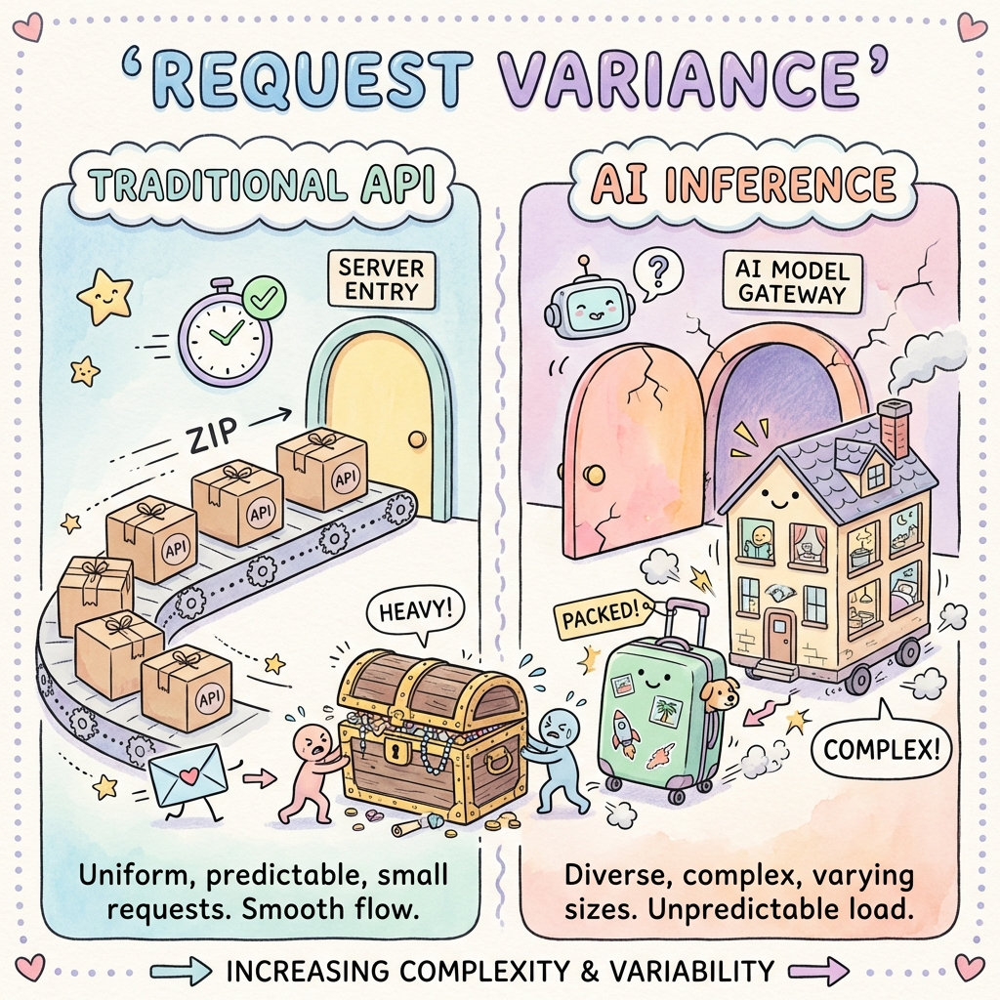
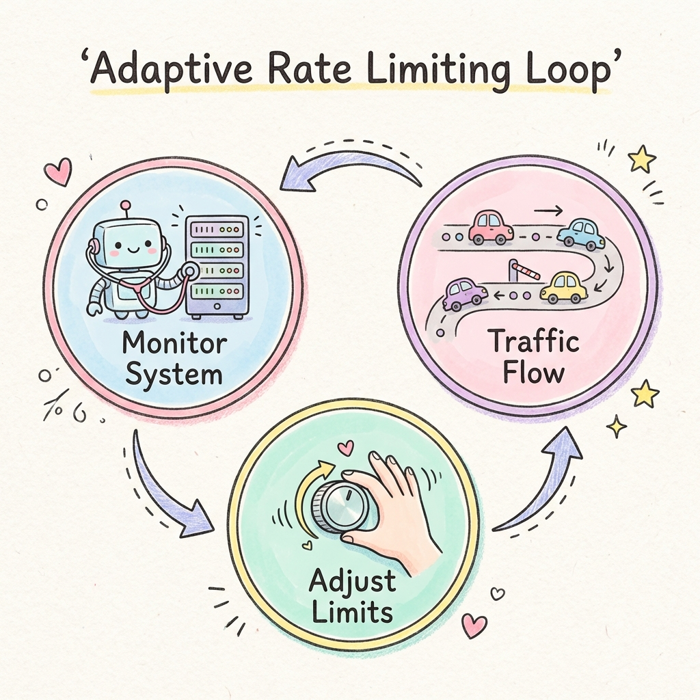

# Dynamic Rate Limiting for AI Inference: Why RPM is Dead

If you're building an AI API today and still relying solely on **Requests Per Minute (RPM)**, you're playing a dangerous game with your GPU resources.

In the world of traditional web services, a request is a request. Fetching a user profile takes roughly the same amount of time whether it's User A or User B. But in the world of Large Language Models (LLMs), one request might be a 5-token "Hello", and another might be a 10,000-token summarization task.

Treating these two requests as equal is the quickest way to uneven latency, frustrated users, and burning money on underutilized (or crashing) GPUs.

This post dives deep into **Dynamic Rate Limiting**—the strategy used by industry giants like OpenAI and Anthropic to keep their diverse workloads flowing smoothly.

---

## The Problem: It's Not About Count, It's About weight

Imagine you run a moving company.
*   **Traditional API Traffic**: Every customer hands you a standard shoebox. You can easily say "We handle 10 boxes per minute."
*   **AI Inference Traffic**: One customer hands you a shoebox. The next hands you a grand piano. The third hands you a literal house.

If you tell your customers "We handle 10 items per minute," the guy with 10 houses is going to crush your team, while the guy with 10 shoeboxes will wonder why you're working so slowly.



### The "Compute Unit" Shift

In AI inference, resource consumption correlates strongly with **tokens** (both input and output), not request count.
*   **Pre-fill (Input)**: Consumes compute to process the prompt. Memory bandwidth bound.
*   **Decode (Output)**: Consumes compute to generate token-by-token. Very sensitive to total request duration.

A 4,000 token request takes significantly longer and occupies more GPU memory (KV Cache) than a 50 token request.

---

## Strategy 1: Token-Aware Rate Limiting

The first step to sanity is tracking **Tokens Per Minute (TPM)** alongside RPM.

### How It Works
Instead of simply decrementing a counter by 1 for each request, you decrement it by the **estimated cost** of the request.

> **But wait!** We don't know the output tokens before we run the model!

Correct. This is why we use **Token Estimation Heuristics**:
1.  **Count Input Tokens**: Exact calculation (easy with tokenizers).
2.  **Estimate Output Tokens**: 
    *   Use `max_tokens` param if provided.
    *   Or use a fixed overhead multiplier (e.g., `input_tokens * 1.5` for chat).
    *   Or charge a "base fee" and refund the difference later (complex but accurate).

### Implementation: The Weighted Token Bucket

Here is a Python example of a Token Bucket that accepts a variable `cost`:

```python
import time
import math

class TokenBucket:
    def __init__(self, capacity, refill_rate):
        self.capacity = capacity
        self.tokens = capacity
        self.refill_rate = refill_rate # tokens per second
        self.last_refill = time.time()

    def _refill(self):
        now = time.time()
        delta = now - self.last_refill
        refill_amount = delta * self.refill_rate
        self.tokens = min(self.capacity, self.tokens + refill_amount)
        self.last_refill = now

    def allow_request(self, cost):
        self._refill()
        if self.tokens >= cost:
            self.tokens -= cost
            return True
        return False

# Setup: Client has 100,000 TPM limit
limiter = TokenBucket(capacity=100000, refill_rate=1666) # ~100k/min

def handle_request(user_prompt):
    # 1. Calculate Cost
    input_tokens = len(user_prompt.split()) * 1.3 # Rough heuristic
    estimated_output = 500 
    total_cost = input_tokens + estimated_output

    # 2. Check Limit
    if not limiter.allow_request(total_cost):
        return 429, "Rate Limit Exceeded. Please slow down."
    
    # 3. Process Request...
    return 200, "Response..."
```

---

## Strategy 2: Adaptive Resource-Based Limiting

Even with TPM, static limits can be wasteful. If your GPUs are sitting idle at 3 AM, why artificially limit a power user? Conversely, if a viral event hits, even your standard limits might overwhelm the system.

**Adaptive Rate Limiting** adjusts the limits dynamically based on the *actual health* of your infrastructure.

### The Feedback Loop



1.  **Monitor Metrics**:
    *   **KV Cache Utilization**: How full is GPU memory?
    *   **Global Queue Depth**: How many requests are waiting?
    *   **P99 Latency**: Are responses getting sluggish?

2.  **Adjust Limits**:
    *   **Green State (Load < 50%)**: Multiplier = 1.5x (Relax limits).
    *   **Yellow State (Load > 70%)**: Multiplier = 1.0x (Standard limits).
    *   **Red State (Load > 90%)**: Multiplier = 0.5x (Aggressive shedding).

### Code Snippet: Redis + Lua for Adaptive Limits

Using Redis is standard for distributed rate limiting. We can store a global `system_health` key that our limiters read before making decisions.

```python
REDIS_SCRIPT = """
local tokens_key = KEYS[1]
local timestamp_key = KEYS[2]
local health_key = KEYS[3]

local capacity = tonumber(ARGV[1])
local rate = tonumber(ARGV[2])
local cost = tonumber(ARGV[3])
local now = tonumber(ARGV[4])

-- 1. Check System Health (Multiplier)
local health = redis.call("get", health_key)
local multiplier = 1.0
if health == "CRITICAL" then
    multiplier = 0.1
elif health == "BUSY" then
    multiplier = 0.5
end

-- Effective capacity shrinks when system is stressed
local effective_capacity = capacity * multiplier

-- ... (Classic Token Bucket Logic) ...
"""
```

### Implementing "Shedding" with Priority Queues

When the system enters **Red State**, don't just drop everyone randomly. Preferentially serve your VIPs.

*   **Tier 1 (Enterprise)**: Guaranteed Access.
*   **Tier 2 (Pro)**: Rate limited in Red State.
*   **Tier 3 (Free)**: Dropped immediately in Yellow/Red State.

This ensures that your highest-value workloads (or your own internal system calls) survive the traffic spike.

---

## Best Practices for AI Gateways

1.  **Expose Headers**: Be transparent. Send `x-ratelimit-remaining-tokens` and `x-ratelimit-reset` so smart clients can back off automatically.
2.  **Global vs. Local**: Use a tiered approach. A local in-memory limiter (tokenbucket.py) handles fast rejection for obvious spam, while a Redis backend manages the precise global state.
3.  **Graceful 429s**: Don't just error out. Providing a `Retry-After` header is crucial for compliant clients to recover gracefully.

## Conclusion

Building resilient AI infrastructure means respecting the hardware. By shifting your mental model from "Requests" to "Compute Units" and "System Health," you build an API that feels robust, fair, and incredibly professional.

Don't let a "house-sized" request crush your "shoebox" logistics. Switch to dynamic, token-aware rate limiting today.
