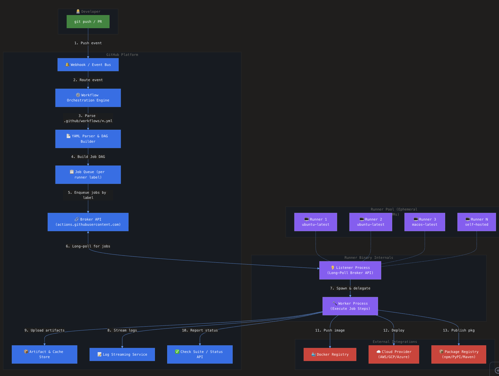
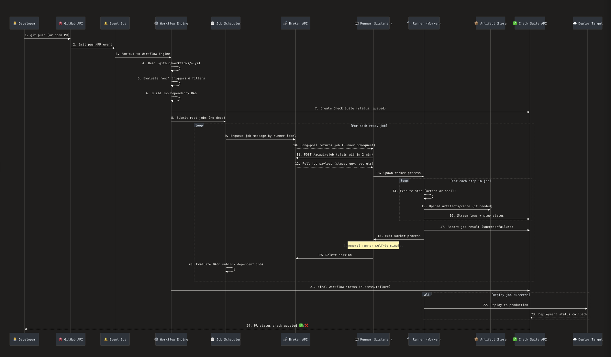
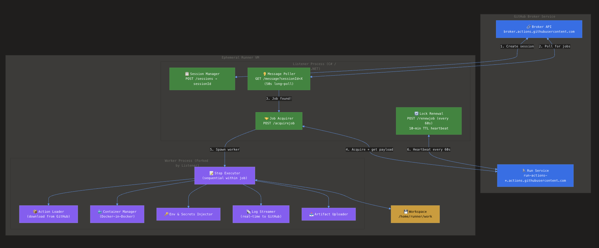
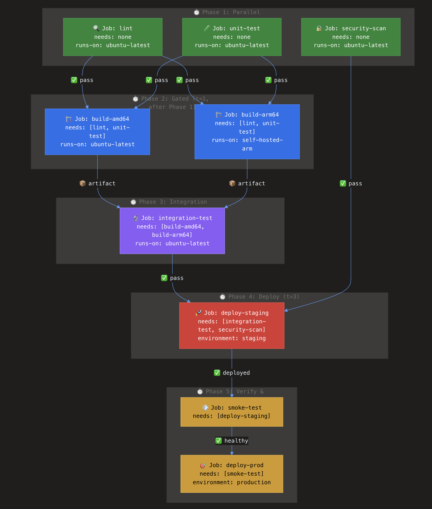
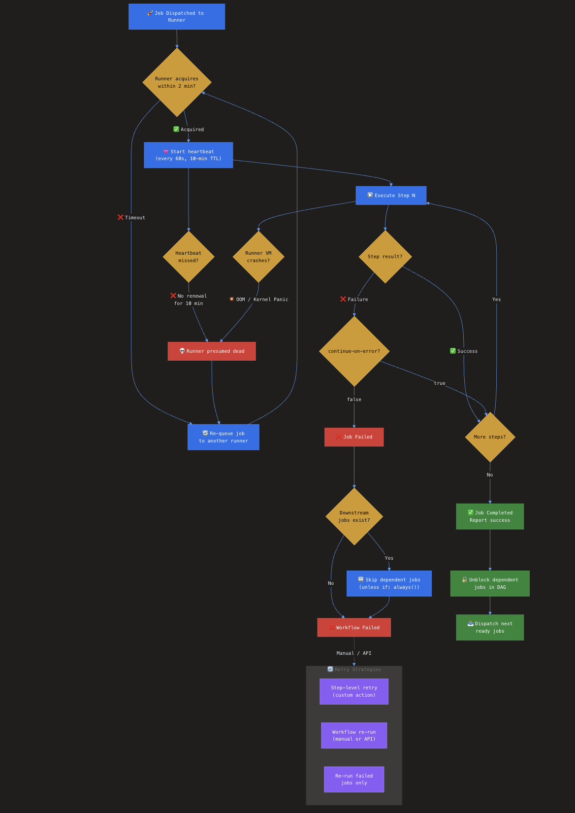

# Designing a CI/CD System Like GitHub Actions: From Single-Machine to Enterprise-Scale Distributed Architecture

> A deep technical dive into how GitHub Actions works under the hood — from a single `git push` to production deployment — and the architectural patterns that make it scale to millions of workflow runs per day.

---

## Table of Contents

1. [Introduction: Why Study CI/CD Architecture?](#1-introduction)
2. [The Full Request Lifecycle: git push → Production](#2-full-lifecycle)
3. [How GitHub Actions Works on a Single Machine](#3-single-machine)
4. [The Runner Binary: Listener and Worker Architecture](#4-runner-internals)
5. [Job Dependency DAG: How `needs:` Creates Execution Order](#5-job-dag)
6. [Scaling to Enterprise: Distributed Architecture](#6-enterprise-scale)
7. [Speed Optimizations: Caching, Parallelism, and Image Building](#7-speed)
8. [Failure Handling and Reliability](#8-failures)
9. [Design Choices and Trade-offs](#9-design-choices)
10. [Comparison with Alternative Systems](#10-comparison)
11. [Conclusion: Key Takeaways for System Designers](#11-conclusion)

---

## 1. Introduction: Why Study CI/CD Architecture? {#1-introduction}

Every modern software team relies on CI/CD, yet few engineers understand the distributed systems engineering behind platforms like GitHub Actions. At its core, a CI/CD system must solve several hard problems simultaneously: it must react to events in real time, parse declarative configurations into executable plans, schedule work across a heterogeneous fleet of machines, manage complex dependency graphs, handle failures gracefully, and do all of this at massive scale while maintaining strong isolation guarantees.

GitHub Actions processes millions of workflow runs daily across hundreds of thousands of repositories. Understanding how it achieves this — and the design trade-offs involved — gives senior engineers a blueprint for designing any large-scale task orchestration system, not just CI/CD.

This post dissects the entire architecture: from what happens the instant you `git push`, through how jobs are scheduled and executed, to how the system recovers when runners crash mid-build.

High-level architecture diagram:



---

## 2. The Full Request Lifecycle: git push → Production {#2-full-lifecycle}

Let's trace the complete journey of a code change from push to deployment. This is the single most important flow to understand in any CI/CD system.



Here is every step, in detail:

### Step 1–3: Event Detection and Routing

When a developer runs `git push`, GitHub's API server processes the Git objects and refs update. Once the push is persisted, the system emits an **internal event** — a structured message containing the event type (`push`), the repository ID, the commit SHA, the branch name, and the actor. This event enters a high-throughput **event bus** (conceptually similar to Kafka or a pub/sub system).

The event bus fans out the event to all subscribed internal services. The **Workflow Engine** is one such subscriber. It receives the raw event and begins evaluating whether any workflows should be triggered.

### Step 4–6: Workflow Parsing and DAG Construction

The Workflow Engine reads every `.yml` file under `.github/workflows/` in the repository at the push's HEAD commit. For each file, it evaluates the `on:` trigger section against the incoming event. Filters are checked: branch names (`branches:`), path filters (`paths:`), and activity types.

For each matching workflow, the engine parses the `jobs:` section and constructs a **Directed Acyclic Graph (DAG)** of job dependencies. Jobs without a `needs:` key become root nodes (no dependencies) and can execute immediately. Jobs with `needs: [job-a, job-b]` become downstream nodes that wait for their parents to complete.

The DAG is topologically sorted to determine execution phases. Matrix strategies (`strategy.matrix`) expand a single job definition into multiple concrete jobs — for example, a test job with `matrix.os: [ubuntu, macos, windows]` becomes three independent jobs.

### Step 7–8: Job Scheduling and Queuing

The engine creates a **Check Suite** via the GitHub Status API, marking the workflow as "queued." It then submits all root-level jobs (those with no unmet dependencies) to the **Job Scheduler**.

The scheduler places each job into a **queue partitioned by runner label**. A job with `runs-on: ubuntu-latest` goes into the Ubuntu queue; `runs-on: self-hosted-arm64` goes to a separate queue. This is a critical architectural decision: queues are organized by the compute capability required, not by repository or workflow.

### Step 9–12: Runner Long-Polling and Job Acquisition

This is where the **pull-based architecture** shines. Runner machines (whether GitHub-hosted ephemeral VMs or self-hosted machines) each run a **Listener process** that continuously long-polls the **Broker API** at `broker.actions.githubusercontent.com`.

The long-poll request includes the runner's labels (e.g., `ubuntu-latest`, `self-hosted`), session ID, and runner version. The Broker service holds the HTTP connection open for up to 50 seconds. If a matching job exists in the queue, the Broker returns a `RunnerJobRequest` message immediately. If not, it returns `202 Accepted` with an empty body, and the Listener loops.

When the Listener receives a job message, it extracts a `runner_request_id` and a `run_service_url`. It then has approximately **2 minutes** to `POST /acquirejob` to the Run Service to claim the job. The Run Service returns the full job payload: every step's definition, environment variables, secrets (encrypted), and action references.

### Step 13–18: Job Execution

The Listener spawns a **Worker process**, passing the job payload via IPC. The Worker executes each step sequentially:

1. **Checkout**: Downloads the repository at the specified commit SHA.
2. **Action Resolution**: For `uses:` steps, downloads the action from GitHub (or a Docker image from a registry).
3. **Step Execution**: Runs shell commands or action entrypoints inside the job's environment. Environment variables and secrets are injected. Output variables are captured via special `::set-output` or `$GITHUB_OUTPUT` commands written to stdout.
4. **Log Streaming**: Every line of stdout/stderr is streamed in real-time to GitHub's Log Service, which persists it and makes it available in the UI.
5. **Artifact Upload**: If steps use `actions/upload-artifact`, files are uploaded to GitHub's Artifact Store (backed by Azure Blob Storage).

Meanwhile, the Listener runs a **heartbeat loop** that calls `POST /renewjob` every 60 seconds. The lock has a 10-minute TTL. If the Broker doesn't receive a renewal within 10 minutes, it assumes the runner is dead and re-queues the job.

### Step 19–24: Completion and DAG Progression

When all steps finish (or a step fails without `continue-on-error: true`), the Worker reports the job result to the Check Suite API. The Listener cleans up the session and — if the runner is ephemeral — the VM self-terminates.

Back in the Workflow Engine, the **DAG Scheduler** evaluates whether any downstream jobs are now unblocked. If Job C has `needs: [A, B]` and both A and B have succeeded, Job C transitions from "blocked" to "queued" and is submitted to the Job Scheduler. This evaluation continues until all jobs are complete or the workflow is cancelled.

The final workflow status is reported to the Check Suite, which updates the PR's merge status check.

---

## 3. How GitHub Actions Works on a Single Machine {#3-single-machine}

Before scaling horizontally, let's understand the simplest case: a single self-hosted runner executing jobs from a small repository.

In this model, you install the runner binary on a machine (Linux, macOS, or Windows). The binary registers itself with GitHub's API, receiving a configuration containing its pool ID, agent ID, and RSA credentials. You start the runner, and it enters its long-poll loop.

The key architectural properties at the single-machine level are:

**Jobs run on the same machine, steps share a filesystem.** Each job gets a workspace directory (typically `/home/runner/work/<repo>/<repo>`). Steps within a job execute sequentially on the same runner, which means they share the filesystem. A build step can produce a binary, and the next test step can find it on disk. This is by design — it eliminates the need for artifact passing between steps within the same job.

**Jobs are isolated from each other.** Different jobs may run on the same machine (if using a persistent, non-ephemeral runner), but they get separate workspace directories. There is no filesystem sharing between jobs. If Job B depends on Job A's output, you must explicitly use `actions/upload-artifact` and `actions/download-artifact`.

**The runner can only execute one job at a time.** This is a fundamental constraint. Each runner runs one Listener, which spawns one Worker, which processes one job. If you want parallelism on a single machine, you must run multiple runner instances (each bound to a different work directory).

**Container-based isolation is optional.** If a step uses `container:` or a job defines `container:`, Docker is used to isolate execution. Otherwise, steps run directly on the host OS with full access to installed tooling. This is why ephemeral VMs are strongly preferred for security.

---

## 4. The Runner Binary: Listener and Worker Architecture {#4-runner-internals}



The GitHub Actions runner is an open-source C# codebase, forked from the **Azure Pipelines Agent**. It consists of two processes:

### The Listener

The Listener is the long-lived orchestrator. Its responsibilities are:

1. **Session Management**: On startup, it creates a session with the Broker API, sending the runner's agent ID, name, version, and OS info. The Broker returns a `sessionId` used for all subsequent requests. If the runner version is too old, the Broker rejects with `400 Bad Request`.

2. **Message Polling**: The Listener makes `GET /message?sessionId=X&status=Online` requests in a tight loop. Each request uses a 50-second long-poll timeout. The Broker either responds with a `RunnerJobRequest` message or returns `202 Accepted` (no work).

3. **Job Acquisition**: When a message arrives, the Listener extracts the `runner_request_id` and calls `POST /acquirejob` on the Run Service URL. This is a recent architectural change — previously, this endpoint was on the Azure DevOps API. The response is the full job definition, often tens of kilobytes of JSON.

4. **Lock Renewal**: A background task runs every 60 seconds, calling `POST /renewjob` with the `planId` and `jobId`. The lock expires after 10 minutes. This is the runner's heartbeat — if it stops, the job is considered abandoned.

5. **Worker Lifecycle**: The Listener spawns the Worker as a child process, passing the job payload. It monitors the Worker for exit, crash, or timeout.

### The Worker

The Worker is a short-lived process spawned per job. Its responsibilities are:

1. **Step Execution**: Iterates through the job's step definitions. For `uses:` steps, it downloads the action (from GitHub or Docker Hub). For `run:` steps, it shells out to bash/sh/powershell.

2. **Environment and Secrets**: Injects environment variables, GitHub context (`github.sha`, `github.ref`, etc.), and decrypted secrets. Secrets are masked in log output.

3. **Log Streaming**: Captures stdout/stderr from each step and sends batched log lines to GitHub's Log Service in real-time.

4. **Artifact and Cache Management**: Handles `actions/cache` and `actions/upload-artifact` by communicating with GitHub's Cache API and Artifact API.

5. **Output Variables**: Monitors stdout for special `::set-output` commands (deprecated) or writes to `$GITHUB_OUTPUT` file, making variables available to subsequent steps.

### Recent Migration: Azure DevOps → GitHub Broker API

A critical architectural shift has been underway: the runner is migrating from Azure DevOps backend APIs to GitHub's own **Broker API**. The `UseV2Flow` boolean in the runner configuration enables this. The Broker API at `broker.actions.githubusercontent.com` replaces the old Azure Pipeline API for session management and message polling, while the Run Service at `run-actions-*.actions.githubusercontent.com` handles job acquisition and lock renewal.

The data formats remain largely compatible (the Azure heritage is visible in field names like `planId`, `agentId`), but the Broker API returns less data in its responses — a sign of a purpose-built replacement stripping away Azure-specific fields.

---

## 5. Job Dependency DAG: How `needs:` Creates Execution Order {#5-job-dag}



One of the most powerful features of any CI/CD orchestrator is managing dependencies between jobs. GitHub Actions uses the `needs:` keyword to construct a DAG (Directed Acyclic Graph) that determines execution order.

### How the DAG is Built

When the Workflow Engine parses a workflow YAML, it creates a node for each job and an edge for each `needs:` entry. Consider this example:

```yaml
jobs:
  lint:
    runs-on: ubuntu-latest
    steps: [...]

  unit-test:
    runs-on: ubuntu-latest
    steps: [...]

  build:
    runs-on: ubuntu-latest
    needs: [lint, unit-test]
    steps: [...]

  deploy:
    runs-on: ubuntu-latest
    needs: [build]
    steps: [...]
```

This produces a DAG with four nodes and three edges. The engine performs cycle detection (since circular dependencies would cause deadlock) and topological sorting to identify execution phases:

- **Phase 0**: `lint` and `unit-test` start in parallel (no dependencies)
- **Phase 1**: `build` starts only after both `lint` and `unit-test` complete successfully
- **Phase 2**: `deploy` starts only after `build` completes successfully

### Scheduling Algorithm

The DAG scheduler operates as follows:

1. **Initialization**: All root nodes (no `needs:`) are marked "ready" and dispatched to the job queue.
2. **Completion Callback**: When a job completes, the scheduler iterates over all jobs that list the completed job in their `needs:`. For each downstream job, it checks whether **all** parents have completed.
3. **Unblocking**: If all parents of a downstream job have completed successfully, that job transitions to "ready" and is dispatched.
4. **Failure Propagation**: If a parent job fails, all downstream jobs are **skipped** by default. This prevents wasted compute. However, the `if: always()` conditional on a downstream job overrides this behavior, allowing cleanup jobs to run regardless.
5. **Status Aggregation**: The workflow status is "success" only if all jobs succeed. If any job fails (and is not marked `continue-on-error: true`), the workflow fails.

### Matrix Expansion and the DAG

Matrix strategies interact with the DAG in an important way. A matrix job like:

```yaml
build:
  strategy:
    matrix:
      os: [ubuntu-latest, macos-latest]
      arch: [amd64, arm64]
```

expands into 4 concrete jobs. If another job has `needs: [build]`, it waits for **all 4 matrix instances** to complete. This is because `build` is a single logical job; the matrix just creates parallel instances of it.

### Data Passing Between Dependent Jobs

Jobs that depend on each other often need to pass data. GitHub Actions provides two mechanisms:

1. **Artifacts**: `actions/upload-artifact` in the upstream job and `actions/download-artifact` in the downstream job. Artifacts are stored in GitHub's cloud and have size limits (configurable, up to 10 GB per repository on paid plans).

2. **Output Variables**: A job can set outputs that are available to downstream jobs via the `needs` context: `${{ needs.build.outputs.image_tag }}`. These are limited to 1 MB of string data per output.

---

## 6. Scaling to Enterprise: Distributed Architecture {#6-enterprise-scale}


Scaling a CI/CD system from a handful of repos to thousands of concurrent workflows introduces several architectural challenges. Let's examine how this is done.

### The Pull-Based Runner Model

The single most important design decision in GitHub Actions' scalability story is the **pull-based model**. Runners poll for work; the central system never pushes jobs to runners. This has profound implications:

- **No runner registry needed on the server side**: The server doesn't need to track which runners are online, healthy, or available. It simply places jobs in queues. Runners that poll get work; runners that don't poll get nothing.
- **Horizontal scaling is trivial**: Adding capacity means launching more runners. No configuration change on the server. Each new runner independently connects and starts polling.
- **Fault tolerance for free**: If a runner dies, it simply stops polling. The server notices (via the heartbeat/lock mechanism) and re-queues the job. No complex health-check infrastructure needed.
- **Multi-tenancy through queue partitioning**: Jobs are queued by runner labels (`ubuntu-latest`, `self-hosted-gpu`, etc.), not by repository or user. Any runner with matching labels can pick up any job.

### Autoscaling Runners

For GitHub-hosted runners, GitHub manages the VM fleet internally. For self-hosted setups, organizations need to build their own autoscaling:

**Webhook-Driven Autoscaling**: GitHub emits `workflow_job` webhook events with actions `queued`, `in_progress`, and `completed`. An autoscaler controller subscribes to these webhooks and maintains a mapping of pending jobs per runner label.

The scaling algorithm is typically:

```
desired_runners = pending_jobs + active_jobs - available_idle_runners
if desired_runners > current_runners:
    scale_up(desired_runners - current_runners)
if idle_runners > min_idle && cooldown_elapsed:
    scale_down(idle_runners - min_idle)
```

**Ephemeral Runners**: Each VM is configured as a Just-In-Time (JIT) runner. On boot, it registers with GitHub, executes exactly one job, and self-terminates. This provides perfect isolation (no cross-job contamination) and simplifies lifecycle management.

**Pre-Baked VM Images**: To minimize startup time, organizations bake custom AMIs/images with the runner binary, common tools (Docker, Node.js, Python), and pre-warmed caches. Boot-to-first-step time is critical — the difference between a 15-second VM boot and a 90-second one directly impacts developer experience.

**Spot/Preemptible Instances**: Since CI jobs are typically short-lived and fault-tolerant (they can be retried), spot instances offer 60-90% cost savings. The autoscaler falls back to on-demand instances when spot capacity is unavailable.

### Runner Pool Architecture

Enterprise deployments typically segment runners into pools by capability:

| Pool | Label | Instance Type | Use Case |
|------|-------|--------------|----------|
| General Linux | `ubuntu-latest` | c5.2xlarge spot | Most CI jobs |
| ARM Builds | `self-hosted-arm64` | m6g.2xlarge | ARM container images |
| GPU Testing | `gpu-runner` | p3.2xlarge | ML model training/testing |
| Secure Builds | `sox-compliant` | Isolated VPC | Compliance-sensitive builds |
| Large Monorepo | `xlarge` | c5.4xlarge, 500GB SSD | Builds requiring > 14GB RAM |

Each pool has its own autoscaling group with independent min/max counts, cooldown periods, and instance types.

### Multi-Tenancy and Isolation

At enterprise scale, isolation becomes critical. GitHub Actions provides several levels:

1. **VM-Level Isolation**: Each GitHub-hosted job runs in a fresh VM that is destroyed after use. No state leaks between jobs.
2. **Network Isolation**: Self-hosted runners can be placed in private VPCs with restricted egress, important for SOX/HIPAA compliance.
3. **Secret Scoping**: Secrets are scoped to repository, environment, or organization level. They are encrypted at rest and injected into the runner only at job execution time, masked in logs.
4. **Runner Groups**: Organizations can create runner groups with access control — restricting which repositories can use which runner pools.

---

## 7. Speed Optimizations: Caching, Parallelism, and Image Building {#7-speed}

Speed is the single most impactful metric in CI/CD. A 10-minute build that drops to 3 minutes means developers stay in flow instead of context-switching.

### Dependency Caching

GitHub Actions provides `actions/cache` which stores and restores directories (like `node_modules/`, `.m2/`, `~/.cache/pip`) between workflow runs. The cache is keyed by a hash of the lockfile:

```yaml
- uses: actions/cache@v4
  with:
    path: node_modules
    key: ${{ runner.os }}-node-${{ hashFiles('**/package-lock.json') }}
    restore-keys: |
      ${{ runner.os }}-node-
```

**How it works under the hood**: The cache API stores compressed tarballs in Azure Blob Storage, keyed per repository and per branch (with fallback to the default branch). The 10 GB repository limit and LRU eviction policy mean you must be strategic about what you cache.

**Architectural insight**: The `restore-keys` fallback mechanism is essentially a **prefix-match search** over cache keys. It allows partial cache hits — restoring a slightly stale cache that still saves significant rebuild time. This is a key pattern: in distributed caching, a stale cache is almost always better than no cache.

### Docker Layer Caching

Docker image builds are one of the slowest steps in CI. Three caching strategies exist, each with trade-offs:

**1. GitHub Actions Cache Backend (`type=gha`)**:
```yaml
- uses: docker/build-push-action@v6
  with:
    cache-from: type=gha
    cache-to: type=gha,mode=max
```
Uses the same GitHub Cache API as `actions/cache`. Limited to 10 GB, and saving/loading layers over the network often negates the caching benefit for simple images.

**2. Registry-Based Cache (`type=registry`)**:
```yaml
cache-from: type=registry,ref=myregistry/myimage:cache
cache-to: type=registry,ref=myregistry/myimage:cache,mode=max
```
Stores layers in a Docker registry alongside the image. No GitHub-specific size limits. Can be shared across CI providers and local development. The `mode=max` option caches all intermediate layers (critical for multi-stage builds), not just the final image layers.

**3. Local NVMe Cache (third-party runners)**:
Services like Depot persist layer cache on fast NVMe SSDs co-located with the runner. Eliminates network overhead entirely. This is the fastest approach but requires dedicated infrastructure.

**Design lesson**: The optimal caching topology depends on the read/write ratio and data locality. Caches that require network transfers (GHA, registry) are beneficial when the cached data is large and the rebuild is slow. For small images with fast builds, the transfer overhead can exceed the rebuild time — making caching counterproductive.

### Matrix Strategy for Parallelism

The matrix strategy is the primary mechanism for parallel execution:

```yaml
strategy:
  matrix:
    os: [ubuntu-latest, windows-latest, macos-latest]
    node: [18, 20, 22]
  fail-fast: false
  max-parallel: 6
```

This creates 9 jobs (3 × 3) running in parallel (up to `max-parallel`). The `fail-fast: false` setting prevents a single failure from cancelling all other matrix jobs — important for understanding which combinations actually fail.

### Incremental Builds

For large monorepos, the biggest speedup comes from **not building unchanged code**. Techniques include:

- **Path filters in workflow triggers**: `on: push: paths: ['services/payment/**']` — only trigger the payment service build when payment code changes.
- **Build tools with built-in incrementality**: Bazel, Gradle, and Nx can detect unchanged modules and skip them.
- **Shallow clones**: `actions/checkout` with `fetch-depth: 1` avoids downloading full Git history (which can be gigabytes for large repos).

---

## 8. Failure Handling and Reliability {#8-failures}



Failures in CI/CD are inevitable. The system's reliability is defined not by whether failures occur, but by how gracefully it recovers.

### Runner Failure (Crash, OOM, Network Loss)

When a runner crashes mid-job, the **heartbeat mechanism** is the safety net. The Listener sends `POST /renewjob` every 60 seconds, extending the lock by 10 minutes. If the Broker doesn't receive a renewal for 10 minutes, it assumes the runner is dead and transitions the job to a "failed" state.

**Why 10 minutes?** This is a trade-off. A shorter TTL (say, 2 minutes) would detect dead runners faster but would cause false positives during network blips or GC pauses. A longer TTL (say, 30 minutes) wastes time when runners genuinely crash. Ten minutes balances detection speed with reliability.

**What about the "stuck job" problem?** If a runner acquires a job but fails before starting the heartbeat loop, the job may be stuck in "in_progress" for up to 10 minutes with no work being done. Some CI systems solve this with a secondary "acquire confirmation" mechanism — requiring the runner to confirm it has started executing within 30 seconds.

### Step-Level Failure

When a step fails (exit code != 0), the default behavior is to skip all subsequent steps in the job and report the job as failed. Two mechanisms modify this:

1. **`continue-on-error: true`**: Marks the step's failure as "allowed." The job continues, and the overall job status can still be "success." Useful for optional quality checks (like linting warnings).

2. **`if: failure()`**: Conditional steps that only run when a previous step has failed. Useful for cleanup, notifications, or diagnostic data collection.

### Job-Level Failure and DAG Propagation

When a job fails, the DAG scheduler propagates the failure to all downstream jobs. By default, downstream jobs are **skipped**, not failed. This distinction matters: "skipped" means "not attempted because a dependency failed," while "failed" means "attempted and produced an error."

The `if: always()` conditional on a downstream job overrides this, allowing it to run regardless of parent status. A common pattern:

```yaml
cleanup:
  needs: [build, test, deploy]
  if: always()
  runs-on: ubuntu-latest
  steps:
    - run: echo "Running cleanup regardless of prior results"
```

### Workflow-Level Recovery

GitHub Actions provides three recovery mechanisms:

1. **Re-run all jobs**: Re-executes the entire workflow from scratch. Simple but wasteful if only one job failed.
2. **Re-run failed jobs**: Only re-executes jobs that failed, plus their dependents. Efficient, but requires that the previously-successful jobs' outputs (artifacts, caches) are still available.
3. **Concurrency groups with `cancel-in-progress`**: Automatically cancels stale runs when new commits are pushed. Prevents resource waste on outdated code.

### Idempotency Considerations

A well-designed CI/CD pipeline must be **idempotent** — running it twice on the same commit should produce the same result. Common pitfalls:

- **Non-deterministic tests**: Tests that depend on wall-clock time, random seeds, or external services.
- **Mutable deployment targets**: Deploying to an environment that was modified by a concurrent pipeline.
- **Cache poisoning**: A corrupted cache entry that causes all subsequent builds to fail until the cache expires.

---

## 9. Design Choices and Trade-offs {#9-design-choices}

Every architectural decision in a CI/CD system involves trade-offs. Let's examine the critical ones:

### Pull-Based vs. Push-Based Runner Model

| Aspect | Pull-Based (GitHub Actions) | Push-Based (Jenkins) |
|--------|-----------------------------|----------------------|
| **Scaling** | Runners self-register; no server config change | Server must know about and manage agents |
| **Failure Detection** | Passive (heartbeat timeout) | Active (server pings agents) |
| **Latency** | Long-poll delay (0-50s) | Near-instant dispatch |
| **Server Complexity** | Lower (just a queue) | Higher (agent registry, health checks) |
| **Network** | Runner initiates connections (firewall-friendly) | Server must reach agents (NAT/firewall issues) |

**Verdict**: Pull-based wins for cloud-native, auto-scaled environments. Push-based wins for low-latency, fixed-fleet setups where agents are on a trusted network.

### Ephemeral vs. Persistent Runners

| Aspect | Ephemeral (one job per VM) | Persistent (long-running) |
|--------|---------------------------|---------------------------|
| **Isolation** | Perfect (fresh VM per job) | Weak (state leaks between jobs) |
| **Startup Time** | Slower (boot + setup) | Instant (already running) |
| **Cache Locality** | No local cache persistence | Excellent local cache |
| **Cost** | Pay only when executing | Pay for idle time |
| **Security** | Strong (no credential persistence) | Risky (secrets may linger) |

**Verdict**: Ephemeral is the industry standard for hosted CI. Persistent runners still make sense for specialized hardware (GPUs, custom silicon) or when cache locality is critical.

### Centralized vs. Distributed Scheduling

| Aspect | Centralized Scheduler | Distributed Scheduling |
|--------|-----------------------|------------------------|
| **Consistency** | Single source of truth for job state | Requires consensus protocol |
| **Throughput** | Single bottleneck | Higher aggregate throughput |
| **Failure** | Single point of failure (needs HA) | More resilient |
| **Complexity** | Simpler to reason about | Harder to debug |

**GitHub's approach**: Centralized scheduling with high-availability via the Broker API (replicated across regions). This is pragmatic — CI scheduling doesn't require the throughput of, say, a stock exchange, so a well-replicated centralized scheduler handles the load.

### Workflow Definition: Declarative YAML vs. Imperative Code

GitHub Actions uses declarative YAML. Alternatives like Dagger use imperative code (Go, Python, TypeScript) for pipeline definitions. The trade-off:

- **YAML**: Easy to learn, easy to lint and validate statically, easy to visualize. But limited expressiveness for complex logic (hence the proliferation of `if:` conditionals and expression syntax).
- **Code**: Full programming language power. Type safety, unit-testable pipelines, reusable abstractions. But harder to audit, visualize, and enforce governance.

**GitHub's bet**: YAML with a powerful expression language and composable actions (reusable units of work). The action marketplace provides the "standard library" that YAML lacks.

---

## 10. Comparison with Alternative Systems {#10-comparison}

| Feature | GitHub Actions | GitLab CI | Jenkins | CircleCI | Buildkite |
|---------|---------------|-----------|---------|----------|-----------|
| **Runner Model** | Pull (Broker API) | Pull (GitLab API) | Push (JNLP/SSH) | Pull (API) | Pull (API) |
| **Default Runners** | Hosted ephemeral VMs | Shared or self-hosted | Self-hosted only | Hosted Docker/VM | Self-hosted only |
| **DAG Support** | `needs:` keyword | `needs:` + `stages:` | Plugins (Pipeline) | `requires:` | `depends_on:` |
| **Config Format** | YAML | YAML | Groovy (Jenkinsfile) | YAML | YAML |
| **Marketplace** | 20K+ actions | CI templates | 1800+ plugins | Orbs | Plugins |
| **Caching** | actions/cache (10GB) | Built-in (S3-backed) | Plugin-based | Built-in | Plugin-based |
| **Container Support** | Docker-in-Docker | Docker/K8s executor | Docker agent | Docker executor | Docker/K8s |
| **Autoscaling** | Managed (hosted) or webhook-based (self-hosted) | Docker Machine / K8s executor | Cloud plugins | Built-in | Elastic CI Stack |

**Key differentiators**:

- **GitHub Actions** excels at developer experience: zero-config for GitHub-hosted repos, massive action marketplace, tight integration with PR checks. Its weakness is limited customization of hosted runners and the 10 GB cache limit.
- **GitLab CI** offers a more integrated DevOps platform with built-in container registry, security scanning, and Kubernetes deployment. Its `stages:` concept (in addition to `needs:`) provides an alternative DAG model.
- **Jenkins** remains the most flexible but operationally heaviest. Its plugin ecosystem is unmatched but quality varies wildly. The Groovy-based Jenkinsfile is powerful but has a steep learning curve.
- **Buildkite** is the "bring your own compute" option — it provides the orchestration layer while you host all runners. Best for organizations with specific infrastructure requirements.

---

## 11. Conclusion: Key Takeaways for System Designers {#11-conclusion}

If you're designing a CI/CD system — or any large-scale task orchestration platform — here are the architectural principles that emerge from studying GitHub Actions:

1. **Pull-based work distribution scales better than push-based.** It decouples the scheduler from the worker fleet, making horizontal scaling trivial and failure recovery implicit.

2. **DAG-based scheduling is essential for complex pipelines.** Simple linear stages aren't enough. Supporting arbitrary dependency graphs with parallel execution, matrix expansion, and conditional logic unlocks significant developer productivity.

3. **Ephemeral execution environments are the gold standard for isolation.** The slight startup cost is far outweighed by the security and reliability benefits of a clean environment per job.

4. **Heartbeat-based failure detection is the pragmatic choice.** Active health checking adds complexity and network overhead. A heartbeat with a reasonable TTL (10 minutes for GitHub Actions) catches dead workers without generating false positives.

5. **Caching is the #1 speed lever, but it's hard to get right.** Dependency caching, Docker layer caching, and build result caching each have different optimal topologies (local NVMe > registry > network cache). The cache key design (exact match vs. prefix fallback) determines hit rates.

6. **Autoscaling needs to be event-driven, not metric-driven.** Webhook-based autoscaling (scaling on `workflow_job.queued` events) reacts in seconds, while metric-based autoscaling (watching CPU usage) reacts in minutes. For bursty CI workloads, the difference is critical.

7. **Design for failure at every level.** Steps fail, jobs fail, runners crash, networks partition. Each layer needs its own failure handling: `continue-on-error` for steps, `if: always()` for cleanup jobs, heartbeat-based re-queuing for runner failures, and workflow re-runs for transient issues.

8. **YAML is good enough for workflow definition.** Despite its limitations, declarative YAML with a composable action marketplace provides the right balance of simplicity, auditability, and power for most CI/CD use cases.

---

## Diagrams Reference

This post is accompanied by six detailed Mermaid diagrams:

1. **High-Level Architecture** — All major components and data flow from push to deploy
2. **End-to-End Request Flow** — Sequence diagram of the complete lifecycle  
3. **Job Dependency DAG Execution** — How `needs:` creates phased parallel execution
4. **Runner Internal Architecture** — Listener and Worker process internals
5. **Failure Handling and Recovery** — Decision tree for every failure mode
6. **Enterprise Autoscaling Architecture** — Webhook-driven autoscaling with runner pools

---

*Written for senior engineers who build, evaluate, or operate CI/CD infrastructure at scale. The architectural patterns described here apply beyond CI/CD to any distributed task orchestration system.*
