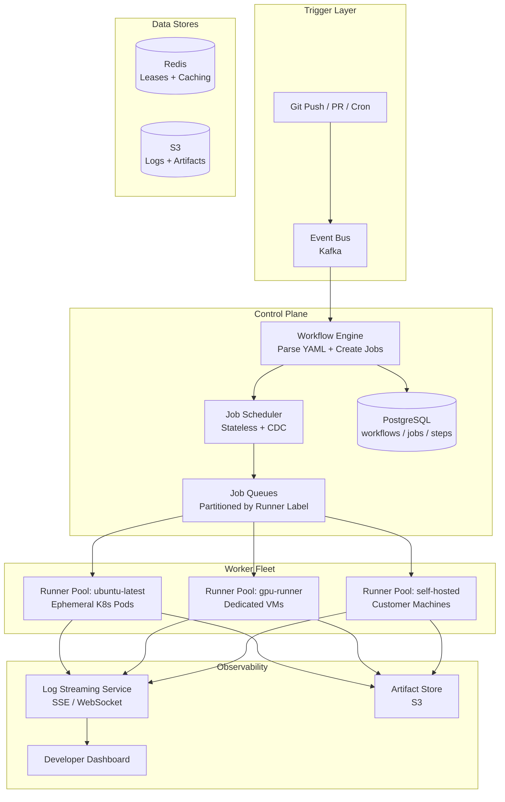
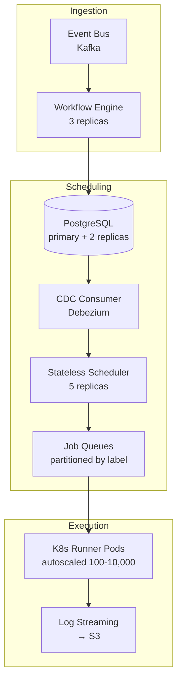
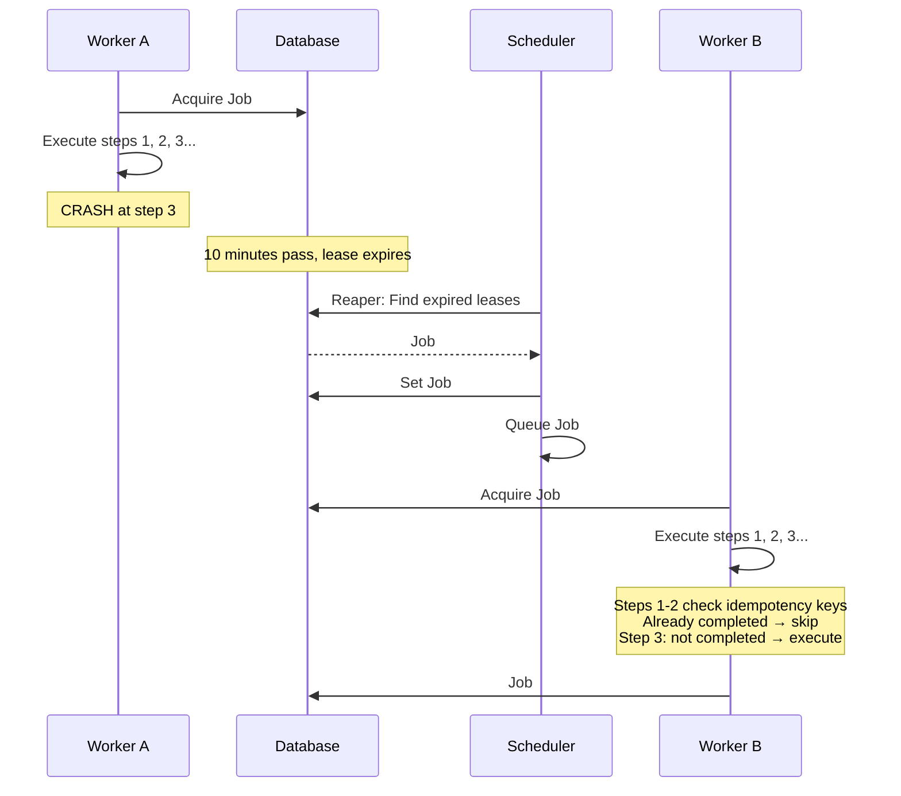

# System Design: CI/CD Pipeline Like GitHub Actions

## From a Single Runner to Enterprise-Scale Distributed Execution: A Staff Engineer's Guide

---

## Table of Contents

1. [The Problem & Why It's Hard](#1-the-problem--why-its-hard)
2. [Clarifying Questions](#2-clarifying-questions)
3. [Requirements & Scope](#3-requirements--scope)
4. [REST API Design](#4-rest-api-design)
5. [Phase 1: Single Machine CI Runner](#5-phase-1-single-machine-ci-runner)
6. [Why the Naive Approach Fails (The Math)](#6-why-the-naive-approach-fails-the-math)
7. [Phase 2: Distributed Architecture](#7-phase-2-distributed-architecture)
8. [Core Component Deep Dives](#8-core-component-deep-dives)
9. [Exactly-Once Execution Deep Dive](#9-exactly-once-execution-deep-dive)
10. [Database Design Deep Dive](#10-database-design-deep-dive)
11. [The Scaling Journey](#11-the-scaling-journey)
12. [Failure Modes & Resilience](#12-failure-modes--resilience)
13. [Observability & Operations](#13-observability--operations)
14. [Design Trade-offs](#14-design-trade-offs)
15. [Common Interview Mistakes](#15-common-interview-mistakes)
16. [Interview Cheat Sheet](#16-interview-cheat-sheet)

---

## 1. The Problem & Why It's Hard

You're asked to design a CI/CD execution system like GitHub Actions. When a developer pushes code, the system must parse a workflow definition (YAML), execute a series of steps (build, test, deploy) on isolated compute, and report results in real time. Millions of workflow runs per day across hundreds of thousands of repositories.

On the surface, it's "just run some shell commands when code is pushed." The trap is thinking the hard part is execution. The hard part is guaranteeing that every job runs **exactly once** — even when workers crash, networks partition, and thousands of jobs are queued simultaneously.

> **The interviewer's real question**: Can you design a multi-tenant job execution system that guarantees exactly-once semantics, scales horizontally, and recovers gracefully from worker crashes — while explaining the state machine that makes it all work?

The interviewer isn't asking you to build GitHub Actions. They're testing whether you understand:
1. How to turn a declarative workflow into an executable plan
2. How to distribute that plan across unreliable workers
3. How to ensure no job is skipped or double-executed
4. How to provide real-time feedback to users watching their builds

> **Staff+ Signal:** "Exactly-once execution" is mentioned in 3 out of 5 interview stories for this question. Most candidates hand-wave it. The staff-level answer is: exactly-once is impossible in a distributed system — what you actually build is **at-least-once delivery + idempotent execution**. The lease-based job acquisition pattern (heartbeat + TTL) is the mechanism. If you can explain why this works and where it breaks, you've answered the core question.

---

## 2. Clarifying Questions

Before drawing a single box, ask these questions. Each one narrows the design space and shows the interviewer you think before you build.

### Questions to Ask

| Question | Why It Matters | What Changes |
|---|---|---|
| "Are jobs in a workflow independent, or do they have dependencies?" | Determines whether you need a DAG scheduler or a simple linear executor | Most interviewers say **linear first** — jobs run sequentially. This is a gift: it simplifies scheduling enormously. Offer DAG as an extension. |
| "How many concurrent workflows do we need to support?" | Drives queue depth, worker fleet size, and database throughput | If the answer is "many customers, like GitHub" → design for multi-tenancy from the start |
| "Do users need real-time log streaming, or is post-completion sufficient?" | Determines whether you need WebSocket/SSE infrastructure | Real-time is almost always required — it's table stakes for CI/CD UX |
| "What's the isolation model? Containers? VMs? Bare metal?" | Affects security boundaries and startup latency | Docker containers for cost efficiency, ephemeral VMs for security-critical workloads |
| "Do we need to support self-hosted runners, or only managed compute?" | Determines whether runners pull work or the system pushes to them | Pull-based is the industry standard — it's firewall-friendly and scales independently |
| "What's the maximum workflow duration?" | Affects heartbeat TTL and resource reservation | GitHub Actions caps at 6 hours. This bounds your lease duration. |

### The Key Simplification

Interviewers often say: **"Start with linear execution — jobs run one after another, not as a complex graph."** This is intentional. They want to see:
1. You can build a working system with simple sequential execution
2. You know that DAG scheduling is the natural extension
3. You don't over-engineer from the start

> **Staff+ Signal:** The best candidates ask about linear vs. DAG upfront, then say: "I'll design for linear execution first, then show how the same state machine extends to DAG with the `needs:` keyword." This demonstrates progressive complexity — the hallmark of a senior system designer.

---

## 3. Requirements & Scope

### Functional Requirements

- **Workflow registration**: Users define workflows in YAML (trigger events, jobs, steps)
- **Event-driven triggering**: `git push`, pull request, schedule (cron), manual dispatch
- **Job execution**: Run steps (shell commands, Docker containers, reusable actions) in isolated environments
- **Step sequencing**: Steps within a job execute sequentially, sharing a filesystem
- **Job dependencies**: Support `needs:` for job ordering (linear first, DAG as extension)
- **Real-time status**: Live log streaming and status updates (pending → running → success/failed)
- **Artifact management**: Upload/download build artifacts between jobs
- **Secret management**: Encrypted secrets injected at runtime, masked in logs
- **Multi-tenancy**: Complete isolation between organizations/repositories

### Non-Functional Requirements

| Requirement | Target | Rationale |
|---|---|---|
| Job pickup latency (p99) | < 30s from trigger event | Developer experience — fast feedback loop |
| Throughput | 1 billion jobs/day | GitHub Actions scale (millions of repos, matrix expansion) |
| Availability | 99.95% | CI/CD is critical but not user-facing; brief queuing delays are acceptable |
| Job execution guarantee | Exactly-once semantics | No skipped jobs, no double deployments |
| Max workflow duration | 6 hours | Bound resource consumption; force efficient pipelines |
| Log delivery latency | < 2s from step output | Real-time streaming is expected by developers |

### Scale Estimation (Back-of-Envelope)

```
Jobs per day:              1 billion (1B across all tenants)
Peak jobs per second:      ~40,000 (merge queues, business hours — ~3.5x average)
Average jobs per second:   ~11,600 (1B / 86,400)
Average steps per job:     5
Step executions per day:   5 billion
Average job duration:      3 minutes
Concurrent running jobs:   ~11,600 × 180s = ~2.1M concurrent (at average)
Peak concurrent jobs:      ~40K × 180s = ~7.2M concurrent
Log lines per job:         500 lines × 200 bytes = 100 KB
Log storage per day:       1B × 100KB = 100 TB/day
Worker machines needed:    7.2M peak / 1 job per worker = 7.2M ephemeral containers
                           (with 4 containers/machine = 1.8M machines at peak)
Database writes per sec:   ~58,000 (5 step state transitions × 11,600 jobs/sec)
```

**Why these numbers matter for the interview:**
- 2.1M concurrent jobs means you cannot schedule from a single machine — you need distributed, stateless schedulers
- 58K DB writes/sec for step state transitions means PostgreSQL needs sharding or you use CDC (Change Data Capture) to avoid hot writes
- 100 TB/day of logs means PostgreSQL is out for log storage — you need object storage (S3) with a streaming layer
- 7.2M peak containers means autoscaling must be event-driven (not metric-based) to react in seconds

> **Staff+ Signal:** The derived number most candidates miss is **concurrent running jobs**. They estimate throughput (jobs/sec) but forget to multiply by duration. At 3 minutes average duration, 11,600 jobs/sec means 2.1 million jobs running simultaneously. This single number drives fleet sizing, database connection pooling, and determines whether your scheduler can be centralized or must be distributed.

---

## 4. REST API Design

### Workflow Registration & Triggering

```
POST   /api/v1/workflows                    — Register a workflow (YAML definition)
GET    /api/v1/workflows                    — List workflows for a repository
GET    /api/v1/workflows/{id}              — Get workflow definition and status
PATCH  /api/v1/workflows/{id}              — Enable/disable a workflow
DELETE /api/v1/workflows/{id}              — Remove a workflow

POST   /api/v1/workflows/{id}/dispatches   — Manually trigger a workflow run
```

### Workflow Runs & Jobs

```
GET    /api/v1/runs                        — List workflow runs (filterable by status, branch)
GET    /api/v1/runs/{run_id}              — Get run details (status, timing, trigger info)
POST   /api/v1/runs/{run_id}/cancel       — Cancel a running workflow
POST   /api/v1/runs/{run_id}/rerun        — Re-run all jobs in a workflow

GET    /api/v1/runs/{run_id}/jobs         — List jobs in a run (with status, timing)
GET    /api/v1/jobs/{job_id}              — Get job details (steps, runner info)
GET    /api/v1/jobs/{job_id}/logs         — Get job logs (full text, paginated)
```

### Real-Time Log Streaming

```
GET    /api/v1/jobs/{job_id}/logs/stream  — SSE endpoint for live log streaming
                                            Content-Type: text/event-stream

WebSocket /api/v1/ws/runs/{run_id}        — WebSocket for run status updates
                                            Pushes: job status changes, step progress
```

### Webhook Payload (Git Push Trigger)

```json
{
  "event": "push",
  "repository": {
    "id": "repo_abc123",
    "full_name": "acme/web-app",
    "default_branch": "main"
  },
  "ref": "refs/heads/main",
  "head_commit": {
    "sha": "a1b2c3d4e5f6",
    "message": "Fix payment flow",
    "author": "alice@acme.com"
  },
  "sender": { "id": "user_42", "login": "alice" }
}
```

### Key API Design Decisions

| Decision | Choice | Rationale |
|---|---|---|
| Trigger response | `202 Accepted` with `run_id` | Workflow execution is async; don't block the push |
| Log streaming | SSE over WebSocket | Simpler, HTTP-compatible, works through proxies. WebSocket for bidirectional status updates. |
| Pagination | Cursor-based | Job lists grow; offset pagination degrades on large datasets |
| Idempotency | `Idempotency-Key` header on POST endpoints | Prevents duplicate workflow triggers on network retries |
| Versioning | `/v1/` path prefix | One-way door — webhook consumers depend on these formats |

> **Staff+ Signal:** The log streaming endpoint is the most technically interesting. You're streaming output from a container running on a worker machine, through a log aggregation service, to an SSE endpoint the browser consumes. The challenge is backpressure: a build generating 10,000 lines/sec must not overwhelm the browser. The solution is server-side buffering with configurable flush intervals (e.g., batch every 100ms or 100 lines, whichever comes first).

---

## 5. Phase 1: Single Machine CI Runner

Start simple. One machine, one runner binary, sequential job execution.

```
┌──────────────────────────────────────────────┐
│              Single CI Runner                │
│                                              │
│  ┌──────────┐    ┌────────────────────────┐  │
│  │  Webhook  │    │     Job Executor       │  │
│  │ Receiver  │───▶│                        │  │
│  │ (HTTP)    │    │  for step in steps:    │  │
│  └──────────┘    │    run(step.command)   │  │
│                  │    capture(stdout)     │  │
│                  │    check(exit_code)    │  │
│                  └────────────────────────┘  │
│       │                    │                 │
│       ▼                    ▼                 │
│  ┌──────────┐    ┌────────────────────────┐  │
│  │  SQLite   │    │   Workspace Dir        │  │
│  │  (state)  │    │   /work/<repo>/<repo>  │  │
│  └──────────┘    └────────────────────────┘  │
└──────────────────────────────────────────────┘
```

### How It Works

1. **Webhook arrives**: An HTTP server receives the `push` event payload
2. **YAML parsing**: Read `.github/workflows/*.yml`, evaluate `on:` triggers against the event
3. **Step execution**: For each matching workflow, iterate through jobs and steps sequentially:

```python
def execute_workflow(workflow, event):
    for job in workflow.jobs:
        workspace = create_workspace(event.repo, event.sha)
        checkout(workspace, event.sha)

        for step in job.steps:
            result = run_step(step, workspace, job.env)
            log_output(result.stdout)

            if result.exit_code != 0:
                mark_job_failed(job)
                break

        cleanup_workspace(workspace)
```

4. **Status reporting**: Update a SQLite database with job/step status. Serve a simple dashboard.

### What Works at This Scale

- **Simple and correct**: No distributed systems complexity. Easy to debug.
- **Steps share a filesystem**: Build step produces binary → test step finds it on disk. No artifact passing needed within a job.
- **One job at a time**: The runner processes one job, finishes, then picks up the next. No concurrency bugs.

### Architectural Properties (preserved in the distributed version)

- **Jobs are isolated from each other**: Different jobs get separate workspace directories
- **Steps within a job share state**: Same filesystem, same environment
- **Container-based isolation is optional**: `container:` in the YAML triggers Docker; otherwise steps run on the host

This single-machine model is exactly how a self-hosted GitHub Actions runner works. You install the runner binary, register it with GitHub, and it processes jobs sequentially. GitHub's open-source runner is a C# codebase forked from the Azure Pipelines Agent.

---

## 6. Why the Naive Approach Fails (The Math)

The single-machine runner works perfectly for a small team. Here's where it breaks:

### Problem 1: Throughput Ceiling

```
Single runner capacity:    1 job at a time
Average job duration:      3 minutes
Max throughput:            20 jobs/hour = 480 jobs/day
Target:                    1 billion jobs/day
Gap:                       2,083,333x
```

Even with multiple runners on one machine, you're limited by CPU, memory, and I/O. A beefy 96-core machine running 20 parallel containers handles ~10,000 jobs/day. You need **100,000 machines** to hit 1B jobs/day — you need distributed scheduling.

### Problem 2: Single Database Bottleneck

```
Step state transitions:    5 steps/job × 11,600 jobs/sec = 58,000 writes/sec
SQLite max writes:         ~5,000/sec (WAL mode, SSD)
PostgreSQL single node:    ~20,000 writes/sec (with connection pooling)
Gap at target scale:       3-12x over single-node capacity
```

### Problem 3: No Isolation Between Tenants

One user's `npm install` pulling 2GB of dependencies starves other users' builds of disk I/O. One user's infinite loop consumes 100% CPU. There's no resource boundary between tenants.

### Problem 4: The Exactly-Once Problem Emerges

```
Scenario: Runner starts Job #42, executes the "deploy to production" step,
          then crashes before reporting completion.

With single machine:  Easy — job is either done or not. Check the deploy target.
With 1000 machines:   Which machine had Job #42? Did the deploy succeed?
                      If we re-queue it, will we deploy twice?
                      If we don't re-queue it, the job is silently lost.
```

This is where the real system design begins. At scale, you need:
- A **stateless scheduler** that can crash and restart without losing state
- A **lease-based job acquisition** protocol so workers can claim jobs without conflicts
- A **step-level state machine** so crashed jobs can be resumed, not restarted
- **Per-tenant resource isolation** so noisy neighbors can't degrade the platform

---

## 7. Phase 2: Distributed Architecture


### Architecture Overview



### How Real Companies Built This

The architecture above isn't theoretical — it's derived from how GitHub Actions, GitLab CI, and Buildkite actually work.


**GitHub Actions** uses a pull-based model where runners long-poll a **Broker API** (`broker.actions.githubusercontent.com`). Each runner's Listener process makes `GET /message` requests with a 50-second long-poll timeout. When a job is available, the runner calls `POST /acquirejob` to claim it within a 2-minute window. A heartbeat loop calls `POST /renewjob` every 60 seconds with a 10-minute TTL — this is the lease mechanism that enables exactly-once semantics.

**GitLab CI** uses a similar pull model with its own runner binary. Runners register with the GitLab instance and poll for jobs. GitLab's unique contribution is the `stages:` concept (in addition to `needs:`), providing a simpler mental model for linear pipelines.

**Buildkite** takes the "bring your own compute" approach — Buildkite provides orchestration, you host all runners. Their Elastic CI Stack for AWS auto-scales runners using CloudFormation.

| Feature | GitHub Actions | GitLab CI | Buildkite |
|---------|---------------|-----------|-----------|
| Runner model | Pull (Broker API) | Pull (GitLab API) | Pull (API) |
| Default runners | Hosted ephemeral VMs | Shared or self-hosted | Self-hosted only |
| Job dependency | `needs:` keyword | `needs:` + `stages:` | `depends_on:` |
| Autoscaling | Webhook-driven (`workflow_job` events) | Docker Machine / K8s executor | Elastic CI Stack |
| Isolation | Fresh VM per job (hosted) | Docker/K8s (configurable) | Customer-managed |

### Key Data Structure: Job/Step State Machine

Every job and step moves through a strict state machine. This is the foundation of crash recovery and exactly-once semantics:

```
Job States:     QUEUED → ACQUIRED → RUNNING → COMPLETED / FAILED / CANCELLED
Step States:    PENDING → RUNNING → COMPLETED / FAILED / SKIPPED

Transitions are one-way (no going back to QUEUED from RUNNING).
Each transition is a database write with optimistic locking.
```

> **Staff+ Signal:** The state machine is the single most important data structure in the system. If you get this right, crash recovery and exactly-once semantics fall out naturally. If you get it wrong, you'll spend months debugging ghost jobs and double deployments. The key insight is that **state transitions are idempotent** — writing `COMPLETED` twice has no effect, but transitioning from `QUEUED` to `RUNNING` must happen exactly once (via a conditional UPDATE with version check).

---

## 8. Core Component Deep Dives

### 8.1 Workflow Engine (Event → Parse YAML → Create Steps)

The Workflow Engine is the first component in the pipeline. It receives events from the event bus and turns them into executable job records.

**Responsibilities:**
1. **Event matching**: Read every `.yml` file under `.github/workflows/` at the push's HEAD commit. Evaluate `on:` triggers (branch filters, path filters, event types) against the incoming event.
2. **YAML parsing**: Extract jobs, steps, matrix strategies, environment variables, and secrets references.
3. **Job record creation**: For each matching workflow, create job records in the database with status `QUEUED`. For linear execution, jobs are ordered by sequence number. For DAG execution, jobs record their `needs:` dependencies.
4. **Matrix expansion**: A matrix strategy like `{os: [ubuntu, macos], node: [18, 20]}` expands one job definition into 4 concrete jobs.

**Design choice**: The Workflow Engine is **stateless**. It reads the event, writes job records to the database, and moves on. If it crashes mid-processing, the event is re-consumed from Kafka and the engine re-creates the same jobs (idempotent via `idempotency_key = hash(event_id, workflow_file, commit_sha)`).

### 8.2 Job Scheduler (Stateless, CDC-Based)

The scheduler is the brain of the system. It determines which jobs are ready to run and places them in the appropriate queue.

**The CDC Pattern (from real interview feedback — Story 2):**

Instead of the scheduler actively polling the database for ready jobs, use **Change Data Capture**:

1. Workflow Engine creates all steps with status `PENDING` in the database
2. Scheduler queues the **first step** (or all root jobs in DAG mode)
3. When a step completes, the database triggers a CDC event
4. CDC event is consumed by the scheduler, which evaluates whether the **next step** is now ready
5. If ready, scheduler queues the next step

```
Step 1 COMPLETED → CDC event → Scheduler checks Step 2 dependencies → Step 2 QUEUED
```

**Why CDC instead of polling?**
- Polling at 58K state transitions/sec requires aggressive database queries
- CDC is event-driven — zero wasted reads
- Decouples the scheduler from the database's read capacity
- The scheduler becomes truly stateless — its entire state is "read CDC events, write to queue"

**Why stateless?**
- If the scheduler crashes, restart it. It reads from the CDC stream (which has a durable offset) and resumes.
- No in-memory state to lose. No failover election. No split-brain.
- Multiple scheduler instances can run concurrently, partitioned by tenant or event stream partition.

> **Staff+ Signal:** The stateless scheduler with CDC is the pattern that separates L5 from L6 answers. An L5 candidate designs a scheduler that polls the database. An L6 candidate uses CDC to make the scheduler event-driven and stateless. The key phrase: "The scheduler has no state of its own — it's a pure function from CDC events to queue operations."

### 8.3 Worker/Runner (K8s Pods + Docker)


The worker is the component that actually executes code. In GitHub Actions, this is the open-source runner binary, which consists of two processes:

**The Listener (long-lived orchestrator):**
1. **Session management**: Creates a session with the Broker API, sending runner agent ID, name, version, and OS info
2. **Message polling**: Long-polls `GET /message?sessionId=X&status=Online` with 50-second timeout. Returns a `RunnerJobRequest` or `202 Accepted` (no work)
3. **Job acquisition**: Extracts `runner_request_id`, calls `POST /acquirejob` on the Run Service. Has ~2 minutes to claim the job (the lease window)
4. **Lock renewal (heartbeat)**: Background task calls `POST /renewjob` every 60 seconds. Lock TTL is 10 minutes. If heartbeat stops, the job is considered abandoned.

**The Worker (short-lived, spawned per job):**
1. **Checkout**: Download repository at the specified commit SHA
2. **Action resolution**: For `uses:` steps, download the action from GitHub or Docker Hub
3. **Step execution**: Run shell commands or action entrypoints. Inject environment variables and decrypted secrets. Mask secrets in log output.
4. **Log streaming**: Capture stdout/stderr and stream to the Log Service in real-time (batched every 100ms)
5. **Artifact upload**: Handle `actions/upload-artifact` by uploading to S3-compatible artifact store
6. **Output variables**: Monitor `$GITHUB_OUTPUT` file for variables passed to subsequent steps

**Kubernetes-Based Execution (production pattern):**

For managed runners at scale, each job runs in an ephemeral K8s pod:
- Pod spec is generated from the `runs-on:` label (maps to a node pool with matching resources)
- Pod lifecycle: create → pull image → execute steps → upload logs → terminate
- Resource limits enforced by K8s: CPU, memory, disk, network
- Each pod gets a unique workspace volume (ephemeral storage or PVC)
- Pod is deleted after job completion — perfect isolation, no state leaks

### 8.4 Real-Time Status Service (SSE/WebSocket)

Developers expect to watch their builds in real time. This requires a streaming infrastructure:

**Architecture:**
```
Worker → Log Service (gRPC) → Log Aggregator → SSE/WebSocket Gateway → Browser
                                    ↓
                              S3 (persistent storage)
```

**SSE for log streaming:**
```
GET /api/v1/jobs/{job_id}/logs/stream
Content-Type: text/event-stream

data: {"line": 1, "text": "Checking out repository...", "timestamp": "2026-03-01T10:00:01Z"}
data: {"line": 2, "text": "Installing dependencies...", "timestamp": "2026-03-01T10:00:03Z"}
data: {"line": 3, "text": "npm install completed in 12.3s", "timestamp": "2026-03-01T10:00:15Z"}
```

**WebSocket for status updates:**
```json
{
  "type": "job_status_changed",
  "job_id": "job_42",
  "status": "running",
  "step": 3,
  "total_steps": 7,
  "timestamp": "2026-03-01T10:00:15Z"
}
```

**Key design decisions:**
- **Backpressure**: Server-side buffering batches log lines (100ms or 100 lines, whichever first) to prevent overwhelming the browser
- **Reconnection**: SSE has built-in reconnection. Client sends `Last-Event-ID` header to resume from where it left off
- **Fan-out**: Multiple users watching the same build share a single log subscription (pub/sub at the gateway layer)
- **Persistence**: Logs are simultaneously streamed to S3 for permanent storage and served from a time-windowed buffer for live viewing

---

## 9. Exactly-Once Execution Deep Dive

This is the core question in 3 out of 5 interview stories for CI/CD system design. Dedicate 5 minutes of your interview to this.

### Why It's Hard

```
Timeline of a worker crash:

T=0:    Worker A acquires Job #42 (lease granted, TTL = 10 min)
T=30s:  Worker A starts "deploy to production" step
T=45s:  Worker A's deploy command succeeds (production is updated)
T=46s:  Worker A crashes before reporting step completion
T=10m:  Lease expires. Scheduler re-queues Job #42.
T=10m5s: Worker B acquires Job #42.
T=10m30s: Worker B runs "deploy to production" step again.
         → Double deployment. Possible data corruption.
```

### The Solution: Lease-Based Acquisition + Idempotent Execution

**1. Lease-based job acquisition (prevents concurrent execution):**

```sql
-- Worker tries to acquire a job (atomic conditional update)
UPDATE jobs
SET status = 'ACQUIRED',
    worker_id = 'worker-a-uuid',
    lease_expires_at = NOW() + INTERVAL '10 minutes',
    version = version + 1
WHERE id = 'job-42'
  AND status = 'QUEUED'
  AND version = 5;  -- optimistic locking

-- Returns 1 row affected = acquired
-- Returns 0 rows affected = someone else got it (no conflict, just retry another job)
```

**2. Heartbeat renewal (extends the lease while working):**

```
Every 60 seconds:
  UPDATE jobs
  SET lease_expires_at = NOW() + INTERVAL '10 minutes'
  WHERE id = 'job-42'
    AND worker_id = 'worker-a-uuid'
    AND status = 'RUNNING';
```

**3. Lease expiry (detects dead workers):**

```sql
-- Reaper process runs every 30 seconds
UPDATE jobs
SET status = 'QUEUED',
    worker_id = NULL,
    lease_expires_at = NULL,
    retry_count = retry_count + 1
WHERE status IN ('ACQUIRED', 'RUNNING')
  AND lease_expires_at < NOW()
  AND retry_count < 3;
```

**4. Idempotency keys for step execution:**

Each step execution gets a deterministic idempotency key:

```
idempotency_key = hash(job_id + step_index + attempt_number)
```

For deployment steps, this key is passed to the deployment system, which checks:
- Has this exact deployment already been applied?
- If yes, return the cached result without re-executing
- If no, execute and record the key

### What "Exactly-Once" Really Means

Exactly-once execution is impossible in a distributed system (proven by the Two Generals Problem). What we actually implement:

```
Exactly-once = At-least-once delivery + Idempotent execution

At-least-once:   The lease mechanism ensures a crashed job is always retried.
                  A job may be delivered to 2+ workers (lease expired, original worker recovers).

Idempotent:      Each step checks its idempotency key before executing.
                  Running the same step twice produces the same result.

Together:         Every job runs at least once, but re-execution is a no-op.
                  The user observes exactly-once behavior.
```

### The State Machine That Makes It Work

```
Job State Machine:
                                    ┌──── timeout ────┐
                                    ▼                  │
  QUEUED ──acquire──▶ ACQUIRED ──start──▶ RUNNING ─────┤
    ▲                                        │         │
    │                                        ▼         │
    └── lease expired ◀─────── RUNNING (crashed) ──────┘
                                        │
                                   retry < max?
                                   yes → QUEUED
                                   no  → FAILED

Step State Machine:
  PENDING ──start──▶ RUNNING ──complete──▶ COMPLETED
                        │                      │
                        ▼                      ▼
                      FAILED              (trigger next
                        │                  step via CDC)
                        ▼
                   continue-on-error?
                   yes → next step
                   no  → job FAILED
```

> **Staff+ Signal:** The 10-minute heartbeat TTL is a critical design trade-off. Shorter TTL (2 min) detects dead workers faster but causes false positives during GC pauses or network blips. Longer TTL (30 min) wastes time when workers genuinely crash. GitHub Actions uses 10 minutes. The right answer in an interview is to state the trade-off, pick a number, and explain when you'd adjust it.

---

## 10. Database Design Deep Dive

### Core Tables (PostgreSQL)

```sql
CREATE TABLE workflows (
    id              UUID PRIMARY KEY DEFAULT gen_random_uuid(),
    tenant_id       UUID NOT NULL,
    repo_id         UUID NOT NULL,
    name            VARCHAR(255) NOT NULL,
    yaml_content    TEXT NOT NULL,
    trigger_events  TEXT[] NOT NULL,        -- ['push', 'pull_request']
    status          VARCHAR(20) DEFAULT 'active',
    created_at      TIMESTAMPTZ DEFAULT NOW(),
    updated_at      TIMESTAMPTZ DEFAULT NOW()
);

CREATE INDEX idx_workflows_repo ON workflows(repo_id);
CREATE INDEX idx_workflows_tenant ON workflows(tenant_id);

CREATE TABLE workflow_runs (
    id              UUID PRIMARY KEY DEFAULT gen_random_uuid(),
    workflow_id     UUID NOT NULL REFERENCES workflows(id),
    tenant_id       UUID NOT NULL,
    trigger_event   VARCHAR(50) NOT NULL,   -- 'push', 'pull_request', 'schedule'
    commit_sha      VARCHAR(40) NOT NULL,
    branch          VARCHAR(255),
    status          VARCHAR(20) NOT NULL DEFAULT 'QUEUED',
    idempotency_key VARCHAR(255) UNIQUE,    -- hash(event_id, workflow_id, commit_sha)
    started_at      TIMESTAMPTZ,
    completed_at    TIMESTAMPTZ,
    created_at      TIMESTAMPTZ DEFAULT NOW()
);

CREATE INDEX idx_runs_workflow ON workflow_runs(workflow_id, created_at DESC);
CREATE INDEX idx_runs_tenant_status ON workflow_runs(tenant_id, status);
CREATE INDEX idx_runs_idempotency ON workflow_runs(idempotency_key);

CREATE TABLE jobs (
    id              UUID PRIMARY KEY DEFAULT gen_random_uuid(),
    run_id          UUID NOT NULL REFERENCES workflow_runs(id),
    tenant_id       UUID NOT NULL,
    name            VARCHAR(255) NOT NULL,
    runner_label    VARCHAR(100) NOT NULL,  -- 'ubuntu-latest', 'self-hosted-arm64'
    status          VARCHAR(20) NOT NULL DEFAULT 'QUEUED',
    worker_id       UUID,
    lease_expires_at TIMESTAMPTZ,
    needs           UUID[],                 -- job IDs this depends on (DAG)
    sequence_num    INT NOT NULL DEFAULT 0, -- for linear ordering
    retry_count     INT DEFAULT 0,
    version         INT DEFAULT 1,          -- optimistic locking
    started_at      TIMESTAMPTZ,
    completed_at    TIMESTAMPTZ,
    created_at      TIMESTAMPTZ DEFAULT NOW()
);

CREATE INDEX idx_jobs_run ON jobs(run_id);
CREATE INDEX idx_jobs_status_label ON jobs(status, runner_label)
    WHERE status = 'QUEUED';               -- partial index for scheduler queries
CREATE INDEX idx_jobs_lease ON jobs(lease_expires_at)
    WHERE status IN ('ACQUIRED', 'RUNNING');  -- for reaper process
CREATE INDEX idx_jobs_tenant ON jobs(tenant_id);

CREATE TABLE steps (
    id              UUID PRIMARY KEY DEFAULT gen_random_uuid(),
    job_id          UUID NOT NULL REFERENCES jobs(id),
    tenant_id       UUID NOT NULL,
    name            VARCHAR(255) NOT NULL,
    step_index      INT NOT NULL,
    command         TEXT,                   -- shell command for 'run:' steps
    action_ref      VARCHAR(255),           -- 'actions/checkout@v4' for 'uses:' steps
    status          VARCHAR(20) NOT NULL DEFAULT 'PENDING',
    exit_code       INT,
    idempotency_key VARCHAR(255),           -- hash(job_id, step_index, attempt)
    started_at      TIMESTAMPTZ,
    completed_at    TIMESTAMPTZ,
    created_at      TIMESTAMPTZ DEFAULT NOW()
);

CREATE INDEX idx_steps_job ON steps(job_id, step_index);
CREATE INDEX idx_steps_status ON steps(status) WHERE status = 'PENDING';
```

### Step State Machine with CDC

The key insight: instead of the scheduler polling for ready steps, use CDC to react to state changes.

```
                          ┌─────────────────────┐
                          │    PostgreSQL        │
                          │                      │
  Step 1 → COMPLETED ────▶│  WAL (Write-Ahead   │──▶ CDC Consumer
                          │       Log)           │     (Debezium)
                          │                      │        │
                          └─────────────────────┘        │
                                                          ▼
                                                   Scheduler evaluates:
                                                   "Is step 2 ready?"
                                                   If yes → queue step 2
                                                   If no  → wait for more
                                                            CDC events
```

**CDC tool**: Debezium connected to PostgreSQL's WAL (logical replication). Publishes step status changes to Kafka. Scheduler consumes from this topic.

**Why this matters**: At 58K step transitions/sec, polling the database every 100ms would generate 10 queries/sec per scheduler instance. With 100 scheduler instances, that's 1,000 queries/sec just for scheduling — wasted read capacity. CDC makes it zero.

### Indexing Strategy and Query Patterns

**Hot-path queries (>10K QPS — must be cached or indexed):**

```sql
-- Q1: Find queued jobs for a runner label (scheduler, 40K/sec at peak)
SELECT id, run_id, tenant_id FROM jobs
WHERE status = 'QUEUED' AND runner_label = 'ubuntu-latest'
ORDER BY created_at LIMIT 10;
-- Covered by: idx_jobs_status_label (partial index)

-- Q2: Update job status on acquisition (worker, 40K/sec at peak)
UPDATE jobs SET status = 'ACQUIRED', worker_id = $1,
    lease_expires_at = NOW() + '10 min', version = version + 1
WHERE id = $2 AND status = 'QUEUED' AND version = $3;
-- Uses primary key + optimistic lock
```

**Warm-path queries (100-1K QPS):**

```sql
-- Q3: Get all jobs for a workflow run (dashboard, ~1K/sec)
SELECT * FROM jobs WHERE run_id = $1 ORDER BY sequence_num;
-- Covered by: idx_jobs_run

-- Q4: Get all steps for a job (log viewer, ~1K/sec)
SELECT * FROM steps WHERE job_id = $1 ORDER BY step_index;
-- Covered by: idx_steps_job
```

### Sharding Strategy

At 1B jobs/day, a single PostgreSQL instance can't handle the write volume. Shard by `tenant_id`:

```
Shard key:  tenant_id (UUID, high cardinality)
Strategy:   Hash-based (tenant_id % num_shards)
Shards:     16 → 64 → 256 (grow with traffic)

Why tenant_id?
- All queries include tenant_id (natural partition key)
- No cross-tenant queries needed
- Hot tenants can be migrated to dedicated shards
- Matches multi-tenancy isolation requirements
```

> **Staff+ Signal:** The partial indexes on `jobs` are critical for scheduler performance. Without the `WHERE status = 'QUEUED'` filter, the index includes all 1B+ historical jobs. With the partial index, it only includes the ~100K currently queued jobs — orders of magnitude smaller, fitting entirely in memory. This is the difference between a 1ms and a 100ms scheduler query.

---

## 11. The Scaling Journey

### Stage 1: Single Runner (0–1K jobs/day)

The Phase 1 architecture. One machine, one runner binary, SQLite for state.

```
Developer → git push → Webhook → Single Runner → Execute → Report Status
```

**Capability**: Sequential job execution. No parallelism. No isolation.
**Limit**: One job at a time. One machine's resources.

### Stage 2: Multiple Runners + Queue (1K–100K jobs/day)

```
Event Bus → Workflow Engine → Job Queue (Redis) → Runner Pool (10-50 machines)
                                                        │
                                                   PostgreSQL (state)
```

**New capabilities at this stage:**
- Multiple runners poll from a shared Redis queue
- Pull-based model: runners self-register and poll for work
- Basic heartbeat (60s) with lease renewal
- PostgreSQL replaces SQLite for shared state
- Ephemeral containers (Docker) for job isolation

**Limit**: Single queue becomes bottleneck. No tenant isolation. Single PostgreSQL node limits write throughput.

### Stage 3: K8s-Based with Autoscaling (100K–10M jobs/day)




**New capabilities at this stage:**
- Kafka for event ingestion (durability, replay, partitioning)
- CDC-based stateless scheduler (no polling)
- K8s pods for job execution (ephemeral, auto-scaled)
- Webhook-driven autoscaling: `workflow_job.queued` events trigger pod creation
- Runner pools segmented by label (capability-based routing)
- Per-tenant queue partitioning begins

**Runner Pool Architecture (enterprise pattern):**

| Pool | Label | Instance Type | Use Case |
|------|-------|--------------|----------|
| General Linux | `ubuntu-latest` | c5.2xlarge spot | Most CI jobs |
| ARM Builds | `self-hosted-arm64` | m6g.2xlarge | ARM container images |
| GPU Testing | `gpu-runner` | p3.2xlarge | ML model training/testing |
| Secure Builds | `sox-compliant` | Isolated VPC | Compliance-sensitive builds |
| Large Monorepo | `xlarge` | c5.4xlarge, 500GB SSD | Builds requiring > 14GB RAM |

**Autoscaling algorithm:**
```
desired_runners = pending_jobs + active_jobs - available_idle_runners
if desired_runners > current_runners:
    scale_up(desired_runners - current_runners)
if idle_runners > min_idle && cooldown_elapsed:
    scale_down(idle_runners - min_idle)
```

**Limit**: Single-region. Single PostgreSQL cluster. Need dedicated ops team for Kafka + K8s.

### Stage 4: Multi-Tenant Enterprise (10M+ jobs/day)

Everything in Stage 3, plus:
- **Database sharding** by tenant_id (16 → 256 shards)
- **Multi-region deployment** with geo-routed job queues
- **Dedicated runner pools** for enterprise tenants (SLA-backed)
- **Spot/preemptible instances** for 60-90% cost savings on non-critical jobs
- **Pre-baked VM images** with runner binary + common tools pre-installed (boot-to-first-step < 15 seconds)
- **Multi-level caching**: dependency cache (per repo), Docker layer cache (per runner pool), build cache (Bazel/Gradle)

> **Staff+ Signal:** Autoscaling must be event-driven, not metric-driven. Webhook-based autoscaling (scaling on `workflow_job.queued` events) reacts in seconds. Metric-based autoscaling (watching CPU) reacts in minutes. For bursty CI workloads — merge queues, business-hours spikes, monorepo matrix expansions — the difference between 5-second and 5-minute scaling is the difference between "builds are fast" and "builds are queued."

---

## 12. Failure Modes & Resilience


### Failure Scenarios

| Failure | Detection | Recovery | Blast Radius |
|---|---|---|---|
| Worker crash mid-job | Heartbeat timeout (10 min) | Lease expires → job re-queued → another worker picks up | Single job; idempotency keys prevent double execution |
| Worker crash mid-deploy step | Heartbeat timeout | Re-queued; deploy step checks idempotency key before re-executing | Single job; deployment system must support idempotent deploys |
| Scheduler crash | Process monitor / K8s restart | Stateless restart; resumes from CDC stream offset | Zero — scheduler has no state. Brief scheduling delay while restarting. |
| Database failure (PostgreSQL) | Connection pool errors, health checks | Failover to synchronous replica (RDS Multi-AZ) | All new job scheduling pauses; running jobs continue unaffected (workers have job payload in memory) |
| Kafka broker failure | ISR replication; consumer lag alerts | Automatic leader election; producers retry | Brief event ingestion delay; no data loss if replication factor ≥ 3 |
| Log streaming service down | Health checks; SSE connection drops | Workers buffer logs locally; flush to S3 on reconnection | Developers can't watch live logs but builds continue normally |
| Network partition (worker ↔ control plane) | Heartbeat fails to reach server | Worker continues executing (optimistic); if lease expires before reconnection, job is re-queued | May cause duplicate execution — mitigated by idempotency keys |
| Poison YAML (workflow causes OOM) | Container OOM-killed signal | K8s restarts pod; job marked FAILED with OOM error | Single job in single tenant; K8s resource limits contain blast radius |

### Worker Crash Recovery Flow



### Multi-Tenancy Isolation

At enterprise scale, isolation is the difference between a P1 and a P4 incident:

1. **VM-level isolation**: Each GitHub-hosted job runs in a fresh VM destroyed after use. No state leaks between jobs.
2. **Network isolation**: Self-hosted runners can be placed in private VPCs with restricted egress (SOX/HIPAA).
3. **Secret scoping**: Secrets are scoped to repository, environment, or organization level. Encrypted at rest, injected at runtime, masked in logs.
4. **Runner groups**: Organizations create runner groups with access control — restricting which repositories can use which runner pools.
5. **Resource limits**: K8s enforces CPU, memory, and disk limits per pod. One tenant's build can't starve another.

> **Staff+ Signal:** The most dangerous failure mode is the "silent success." Worker A deploys to production, then crashes before recording success. Worker B re-deploys. If the deployment isn't idempotent (e.g., it runs database migrations), you get data corruption. The fix isn't in the CI/CD system — it's in requiring deployment targets to support idempotent operations. This is a cross-system design constraint that most candidates miss.

---

## 13. Observability & Operations

### Key Metrics

- `cicd_jobs_queued_total{tenant, runner_label}` — inbound job rate; primary scaling signal
- `cicd_jobs_running_gauge{runner_label}` — current concurrent jobs; capacity indicator
- `cicd_job_wait_time_seconds{tenant, quantile}` — time from QUEUED to RUNNING; the metric developers care about most
- `cicd_job_duration_seconds{tenant, quantile}` — execution time; helps identify slow builds
- `cicd_step_failures_total{tenant, step_name}` — step failure rate; catch flaky tests
- `cicd_lease_expirations_total` — dead worker detection; spikes mean infrastructure issues
- `cicd_queue_depth{runner_label}` — pending jobs per label; the primary autoscaling signal
- `cicd_estimated_drain_time_seconds{runner_label}` — (queue_depth × avg_duration) / workers; best single metric for system health
- `cicd_scheduler_cdc_lag_seconds` — CDC consumer lag; if growing, scheduler is falling behind

### Distributed Tracing

A full trace for a single workflow run:

```
[Event Bus] receive push event (1ms)
  └── [Workflow Engine] parse YAML + create jobs (15ms)
       └── [Scheduler] queue first job (2ms)
            └── [Runner] acquire + execute (180,000ms = 3 min)
                 ├── [Step 1] checkout (5,000ms) ✓
                 ├── [Step 2] install deps (45,000ms) ✓
                 ├── [Step 3] build (60,000ms) ✓
                 ├── [Step 4] test (65,000ms) ✓
                 └── [Step 5] deploy (5,000ms) ✓
            └── [Log Service] stream 500 lines (180,000ms, concurrent)
       └── [Scheduler] CDC → queue next job (2ms)
```

### Alerting Strategy

| Alert | Condition | Severity | Action |
|---|---|---|---|
| Queue drain time > 5 min | Sustained for 10 min | P2 | Scale runners; investigate slow builds |
| Lease expirations > 10/min | Spike detection | P1 | Worker fleet issue; check node health, OOM kills |
| Job wait time p99 > 60s | Sustained for 5 min | P2 | Scale runners for affected label |
| CDC lag > 30s | Growing trend | P1 | Scheduler is falling behind; scale scheduler instances |
| Step failure rate > 20% | Platform-wide for 15 min | P1 | Possible infrastructure issue (Docker registry down, network) |
| Database replication lag > 5s | Any replica | P2 | Investigate replica health; may affect read-after-write consistency |

> **Staff+ Signal:** The most actionable dashboard isn't per-metric — it's a tenant-level heatmap showing job wait time × failure rate. A single red cell means one tenant has a broken pipeline (their problem). A full red column means a platform-wide outage (your problem). This distinction determines whether you page the customer or yourself.

---

## 14. Design Trade-offs

| Decision | Option A | Option B | Recommended | Why |
|---|---|---|---|---|
| Runner model | Pull-based (runners poll for work) | Push-based (server dispatches to runners) | Pull-based | Runners self-register; no server-side runner registry needed. Firewall-friendly (outbound connections only). Horizontal scaling is trivial. Trade-off: 0-50s polling latency. |
| Execution environment | Ephemeral (fresh VM/container per job) | Persistent (long-running runners) | Ephemeral for hosted; persistent for self-hosted | Ephemeral gives perfect isolation and security. Persistent gives cache locality and instant startup. Use ephemeral by default, allow persistent for specialized hardware. |
| Job dependencies | Linear (sequential) | DAG (`needs:` keyword) | Linear first, DAG as extension | Linear is simpler to implement and debug. Most workflows are effectively linear. DAG adds topological sort, cycle detection, and complex failure propagation. Ship linear, iterate to DAG. |
| Step progression | Polling scheduler | CDC-based scheduler | CDC | CDC is event-driven (zero wasted reads) and makes the scheduler stateless. Polling works at small scale but wastes DB read capacity at 58K transitions/sec. |
| Scheduling | Centralized scheduler | Distributed scheduling | Centralized with HA | CI scheduling doesn't need stock-exchange throughput. A well-replicated centralized scheduler handles the load and is simpler to reason about. |
| Workflow definition | Declarative YAML | Imperative code (Go/Python) | YAML | Easy to learn, lint, validate, and visualize. Limited expressiveness is offset by composable actions (the "standard library"). Code-based (like Dagger) offers more power but harder governance. |
| Log storage | PostgreSQL | S3 + streaming layer | S3 + streaming | 100 TB/day of logs rules out PostgreSQL. S3 for persistence, SSE for live streaming. Buffer recent logs in Redis for fast retrieval. |

> **Staff+ Signal:** The pull vs. push decision is the most consequential architectural choice. Pull-based wins for cloud-native, auto-scaled environments because it decouples the control plane from the worker fleet. The server doesn't need to know which workers are online — it just puts jobs in queues. Workers that poll get work; workers that don't, don't. This makes horizontal scaling, failure recovery, and multi-tenancy almost free. The only cost is latency (0-50s poll interval), which is acceptable for CI/CD.

---

## 15. Common Interview Mistakes

1. **Starting with DAG when the interviewer wants linear**: "First, I'll build a topological sort for the job dependency graph..." → The interviewer explicitly said jobs run sequentially. You just spent 5 minutes on something they told you to skip. Staff+ answer: "I'll design for linear execution first. Each job runs after the previous one completes. The state machine extends naturally to DAG by adding a `needs:` field — I can show that if we have time."

2. **Ignoring exactly-once execution**: "The worker picks up a job and runs it." → What happens when the worker crashes? What if two workers pick up the same job? This is THE core question. Staff+ answer: lease-based acquisition with heartbeat, optimistic locking on state transitions, idempotency keys on steps.

3. **No multi-tenancy from the start**: "All jobs go in one queue." → One tenant's 10,000-job matrix expansion blocks everyone else's single-job PR check. Staff+ answer: queues partitioned by runner label, with per-tenant fair scheduling or priority tiers.

4. **Not mentioning Kubernetes/Docker**: "Jobs run on the machine." → How are they isolated? How do you limit CPU/memory? How do you prevent a malicious workflow from reading another tenant's secrets? Staff+ answer: ephemeral K8s pods with resource limits, network policies, and destroyed after completion.

5. **No real-time status UI**: "Results are available after the workflow completes." → Developers stare at CI for minutes. They need live log streaming. Staff+ answer: SSE for log streaming, WebSocket for status updates, with backpressure handling.

6. **Waiting to be asked about crash recovery**: "If the worker crashes... hmm, I hadn't thought about that." → Bring this up proactively. It's the whole point of the question. Staff+ answer: "The lease mechanism handles worker crashes. Let me walk through the timeline: worker acquires job, starts heartbeat, crashes at step 3, lease expires after 10 minutes, scheduler re-queues, another worker picks it up, idempotency keys prevent double-execution of completed steps."

7. **Designing a monolithic scheduler with in-memory state**: "The scheduler keeps track of all running jobs in a HashMap." → When this process crashes, all state is lost. Staff+ answer: stateless scheduler that reads from CDC stream. All state lives in the database. Scheduler can crash and restart without losing anything.

---

## 16. Interview Cheat Sheet

### Time Allocation (45-minute interview)

| Phase | Time | What to Cover |
|---|---|---|
| Clarify requirements | 3 min | Linear vs DAG, scale (1B jobs/day), isolation model, real-time requirements |
| REST API design | 5 min | Trigger endpoint (202 Accepted), job status, log streaming (SSE), webhook payload |
| High-level design | 10 min | Event bus → workflow engine → stateless scheduler (CDC) → job queues → K8s runner pods |
| Deep dive: exactly-once | 7 min | Lease-based acquisition, heartbeat + TTL, optimistic locking, idempotency keys, state machine |
| Deep dive: database + scaling | 10 min | Schema (workflows/jobs/steps), CDC for step progression, sharding by tenant_id, partial indexes |
| Failure modes + trade-offs | 7 min | Worker crash → lease expiry → re-queue, scheduler crash → stateless restart, pull vs push |
| Wrap-up | 3 min | Scaling journey summary, what I'd build next (DAG, caching, multi-region) |

### Step-by-Step Answer Guide

1. **Clarify**: "Are jobs linear or DAG-based? I'll start with linear. How many jobs/day? 1 billion = ~12K/sec average, ~40K peak. Do we need real-time log streaming?"
2. **REST API**: Show trigger endpoint (`POST /workflows/{id}/dispatches` → `202 Accepted` with `run_id`), job status (`GET /runs/{run_id}/jobs`), and log streaming (`GET /jobs/{job_id}/logs/stream` via SSE).
3. **Key insight**: "The hard part isn't running shell commands — it's guaranteeing every job executes exactly once even when workers crash."
4. **Single machine**: One runner, sequential execution, SQLite. Works under 1K jobs/day.
5. **Prove it fails**: "58K step transitions/sec overwhelms a single database. One tenant's matrix expansion blocks everyone. A crashed worker leaves a job in limbo — did it complete? Do we re-run?"
6. **Distributed architecture**: Event bus (Kafka) → stateless workflow engine → CDC-based scheduler → job queues (partitioned by label) → K8s runner pods. Show the mermaid diagram.
7. **Exactly-once deep dive**: "Worker acquires job via conditional UPDATE with optimistic locking. Heartbeat every 60s extends 10-min lease. If worker crashes, lease expires, reaper re-queues. Steps have idempotency keys — re-execution of completed steps is a no-op."
8. **Database design**: Show the schema with partial indexes. Explain CDC from PostgreSQL WAL via Debezium. Sharding by tenant_id for write distribution.
9. **Failure handling**: Walk through worker crash timeline. Scheduler crash is a non-event (stateless, restarts from CDC offset). DB failover via synchronous replication.
10. **Scaling journey**: Single runner → runner pool + Redis queue → K8s + Kafka + CDC → sharded multi-region.
11. **Trade-offs**: Pull vs push (pull wins for scale), linear vs DAG (linear first), CDC vs polling (CDC at scale), ephemeral vs persistent runners.

### What the Interviewer Wants to Hear

- At **L5/Senior**: Pull-based runners, job queue, basic heartbeat, container isolation. Mentions exactly-once as a concern.
- At **L6/Staff**: Stateless scheduler with CDC, lease-based acquisition with optimistic locking, idempotency keys for steps, partial indexes, sharding by tenant_id. References how GitHub Actions actually works (Broker API, 10-min TTL, runner binary architecture).
- At **L7/Principal**: Organizational boundaries (who owns the workflow engine vs. scheduler vs. runner fleet), multi-region job routing, tenant-level SLA design with blast radius guarantees, migration path from linear to DAG scheduling, cost modeling (spot instances, pre-baked images, cache hit rates).


### Advanced Extension: DAG Scheduling

Once you've covered linear execution, extend to DAG with the `needs:` keyword:

```yaml
jobs:
  lint:
    runs-on: ubuntu-latest
    steps: [...]

  unit-test:
    runs-on: ubuntu-latest
    steps: [...]

  build:
    needs: [lint, unit-test]    # waits for both
    runs-on: ubuntu-latest
    steps: [...]

  deploy:
    needs: [build]              # waits for build
    runs-on: ubuntu-latest
    steps: [...]
```

The DAG scheduler extends the linear model:
1. **Root jobs** (no `needs:`) are queued immediately
2. **Completion callback**: When a job completes, iterate all jobs listing it in `needs:`. If all parents completed, queue the downstream job.
3. **Failure propagation**: If a parent fails, downstream jobs are **skipped** (not failed). `if: always()` overrides this.
4. **Matrix expansion**: A matrix job like `{os: [ubuntu, macos]}` expands into 2 jobs. `needs: [build]` waits for **all** matrix instances.

The state machine is identical — only the "when to queue next" logic changes. This is why designing for linear first is correct: DAG is a natural extension, not a rewrite.

---

*Written as a reference for staff-level system design interviews. The architectural patterns described here apply beyond CI/CD to any distributed task orchestration system — job schedulers, data pipelines, deployment platforms, and batch processing systems.*
