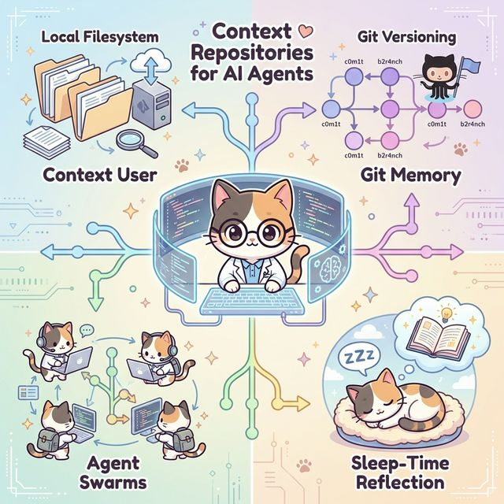

# Letta's Context Repositories: Git-based Memory for Coding Agents

Letta has introduced a fascinating new concept called **Context Repositories**, which reimagines how coding agents handle memory. Instead of relying on traditional vector databases or simple file appends, they represent agent memory as a **Local Git Repository**.

> "We're introducing Context Repositories, a rebuild of how memory works in Letta Code based on programmable context management and git-based versioning." - [Letta Blog](https://www.letta.com/blog/context-repositories)

Here are the key takeaways from their announcement:

## 1. Memory as a Local Filesystem
The core idea is simple but powerful: give the agent a local folder that represents its memory.
- **Standard Tools**: Agents can use standard CLI tools (like `grep`, `find`, or custom scripts) to search and manipulate their own memory.
- **System Prompt Integration**: The file structure itself acts as a signal. A `system/` directory automatically loads its contents into the agent's system prompt, allowing the agent to "pin" important context by simply moving files.

## 2. Git-Backed Versioning
Because the memory is a git repository, every change is versioned.
- **Commit History**: Every memory update comes with a commit message, creating a clear audit trail of the agent's thought process and memory evolution.
- **Rollback**: If an agent goes down a wrong path, it can revert its memory state to a previous commit.

## 3. Multi-Agent "Swarms" with Git Branches
This is where it gets really interesting. Git allows for branching and merging, which enables concurrent multi-agent workflows.
- **Parallel Processing**: Multiple sub-agents can branch off from the main memory, explore different tasks or summarize different documents, and then merge their findings back into the main branch.
- **Conflict Resolution**: Standard git merge conflict resolution strategies can be applied to reconcile different agent experiences.

## 4. "Sleep-Time" Reflection
Letta introduces the concept of background maintenance for memory, similar to garbage collection or defragmentation.
- **Reflection**: A background process can review recent conversations and summarize them into long-term memory files.
- **Defragmentation**: Another process can reorganize the file structure, merge small files, or split large ones to keep the "memory filesystem" clean and efficient.

## Why This Matters
Treating memory as code (via Git) aligns perfectly with how developers already work. It turns the abstract problem of "context management" into a concrete engineering problem of "file management," which is much easier to reason about and debug.

