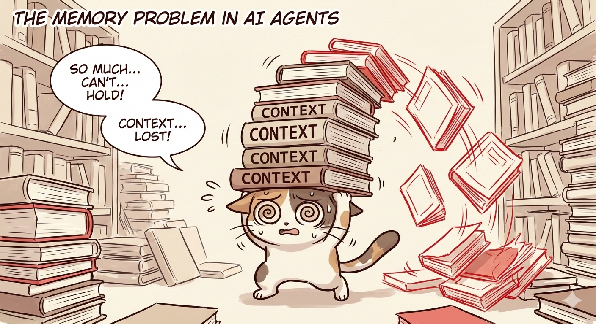
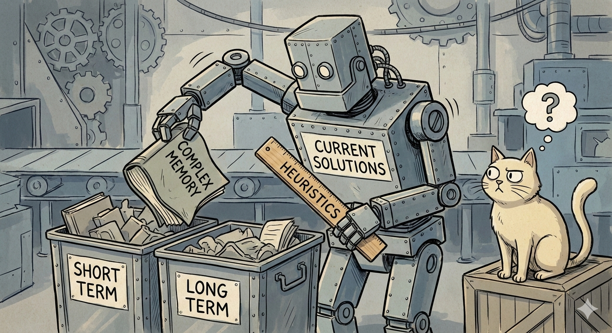
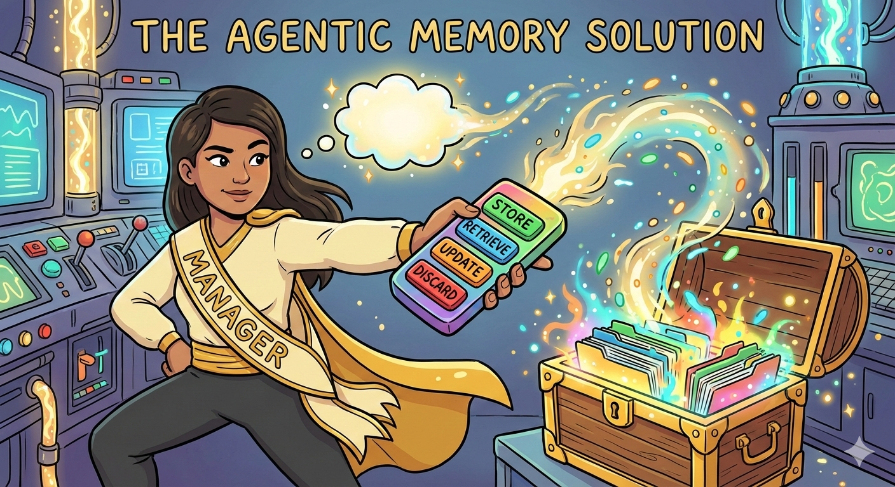
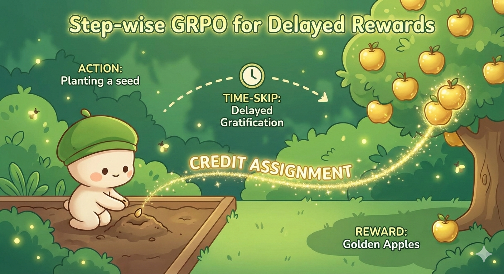
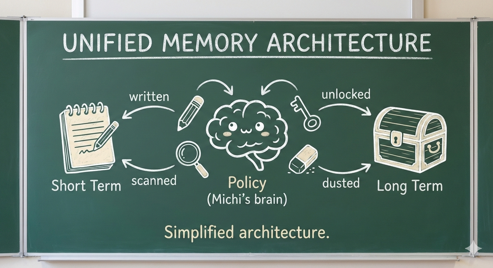
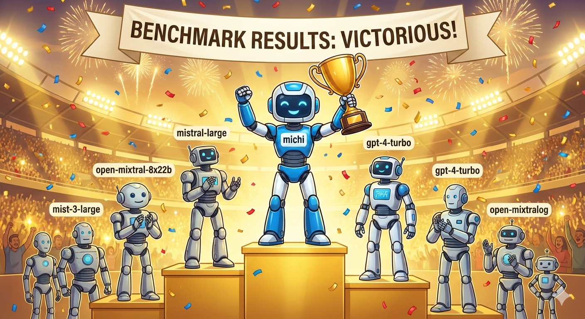

# Agentic Memory (AgeMem)

> **Paper**: [Agentic Memory: Learning Unified Long-Term and Short-Term Memory Management for LLM Agents](https://arxiv.org/abs/2601.01885)  
> **Authors**: Yi Yu, Liuyi Yao, Yuexiang Xie, Qingquan Tan, Jiaqi Feng, Yaliang Li, Libing Wu  
> **Date**: January 2026

## Summary

This paper introduces **AgeMem**, a unified framework that teaches LLM agents to manage their own memory. Instead of relying on separate systems or heuristics for long-term and short-term memory, AgeMem exposes memory operations (store, retrieve, update, summarize, discard) as **tool-based actions** that the agent learns to use autonomously through reinforcement learning.

---

## 1. The Memory Problem



**Key Takeaway**: LLM agents struggle with long-horizon tasks because of finite context windows. When conversations or tasks span many turns, critical information gets lost.

**The Challenge**:
- Context windows have limits (even 100k+ tokens run out)
- Important early information gets "pushed out"
- Heuristic approaches to memory don't generalize well

---

## 2. Current Solutions Fall Short



**Key Takeaway**: Existing memory systems treat Long-Term Memory (LTM) and Short-Term Memory (STM) as separate components with hardcoded rules.

**Problems with Current Approaches**:
- Separate controllers for LTM and STM
- Heuristic-based decisions ("save if it seems important")
- No end-to-end optimization
- Poor adaptability to new domains

---

## 3. The AgeMem Solution



**Key Takeaway**: AgeMem unifies LTM and STM management by making memory operations **actions** the agent can take.

**Memory Operations as Tools**:
- `store(info)` - Save to long-term memory
- `retrieve(query)` - Fetch from memory
- `update(key, new_value)` - Modify existing memory
- `summarize()` - Compress short-term memory
- `discard(key)` - Remove obsolete information

The agent learns *when* and *what* to remember through training.

---

## 4. Three-Stage Training


**Key Takeaway**: AgeMem uses progressive reinforcement learning with three stages.

**Training Stages**:
1. **Stage 1**: Basic task completion (no memory)
2. **Stage 2**: Memory-augmented training (with reward shaping)
3. **Stage 3**: End-to-end optimization with step-wise GRPO

**Key Innovation**: Step-wise GRPO addresses the challenge of sparse and discontinuous rewards that memory operations create.

---

## 5. Why Step-wise GRPO?



**Key Takeaway**: Memory actions often have delayed rewards, making standard RL difficult.

**The Problem**:
- Storing information now may only help 10 turns later
- Standard reward signals don't capture this

**The Solution**:
- Step-wise Group Relative Policy Optimization (GRPO)
- Assigns intermediate credit to memory operations
- Enables learning long-term dependencies between actions

---

## 6. Unified Memory Architecture



**Key Takeaway**: Both LTM and STM are managed through the same policy.

**Architecture Components**:
- **Short-Term Memory**: Recent context window content
- **Long-Term Memory**: Vector database of stored information
- **Policy Network**: LLM that decides memory operations
- **Tool Interface**: Memory ops exposed as callable tools

---

## 7. Benchmark Results



**Key Takeaway**: AgeMem outperforms strong baselines across 5 long-horizon benchmarks.

**Key Findings**:
- Consistent improvement over memory-augmented baselines
- Works with multiple LLM backbones
- Better task performance + higher-quality memory
- More efficient context usage

---

## 8. Practical Implications


**Key Takeaway**: This approach enables truly autonomous agents that manage their own cognitive resources.

**Why It Matters**:
- Agents can handle arbitrarily long conversations
- Memory decisions are learned, not hardcoded
- Generalizes across different task types
- Foundation for more human-like AI memory

---

## Key Takeaways

1. **Unified Memory**: LTM and STM should be managed together, not separately
2. **Memory as Actions**: Expose store/retrieve/update/summarize/discard as tools
3. **Learned Decisions**: Let the agent learn *what* to remember through RL
4. **Step-wise GRPO**: Novel RL technique handles delayed memory rewards
5. **End-to-End**: No heuristics—the whole system is optimized together

---

## Citation

```bibtex
@article{yu2026agentic,
  title={Agentic Memory: Learning Unified Long-Term and Short-Term Memory Management for Large Language Model Agents},
  author={Yu, Yi and Yao, Liuyi and Xie, Yuexiang and Tan, Qingquan and Feng, Jiaqi and Li, Yaliang and Wu, Libing},
  journal={arXiv preprint arXiv:2601.01885},
  year={2026}
}
```
