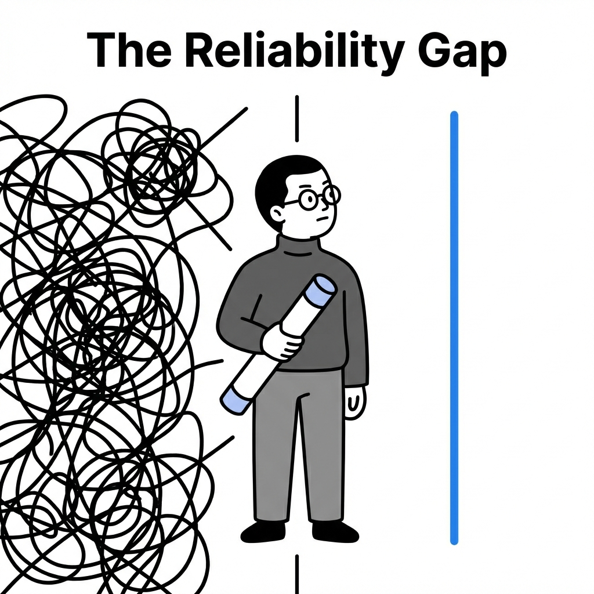
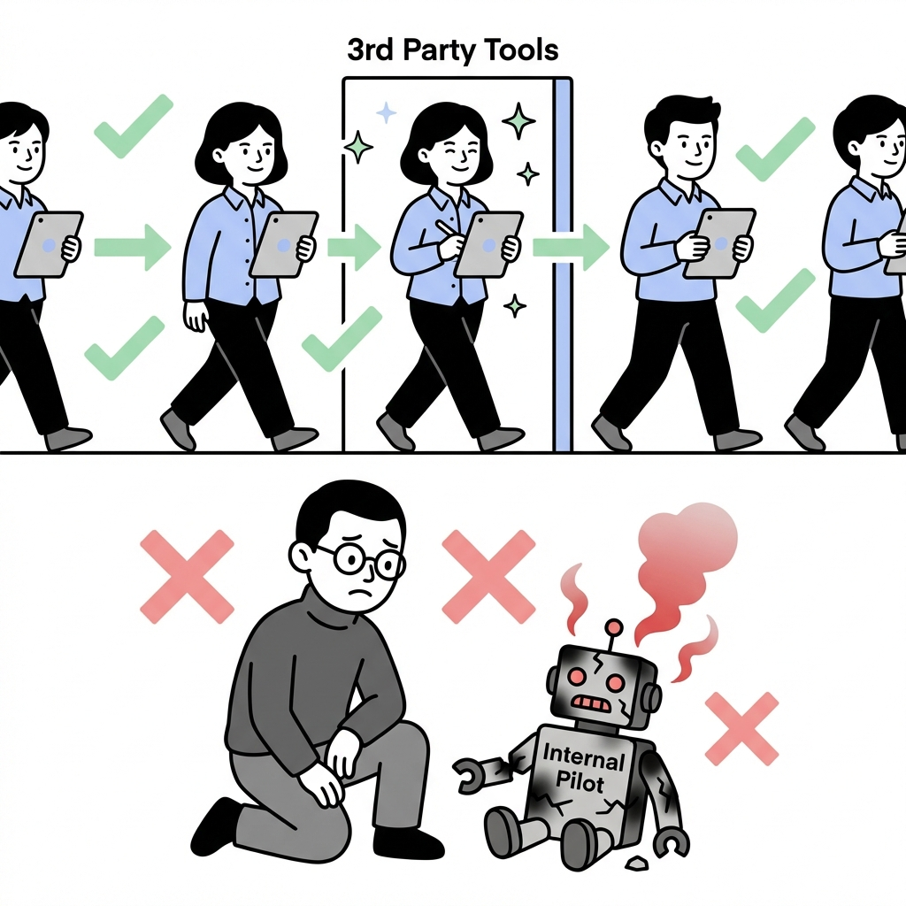
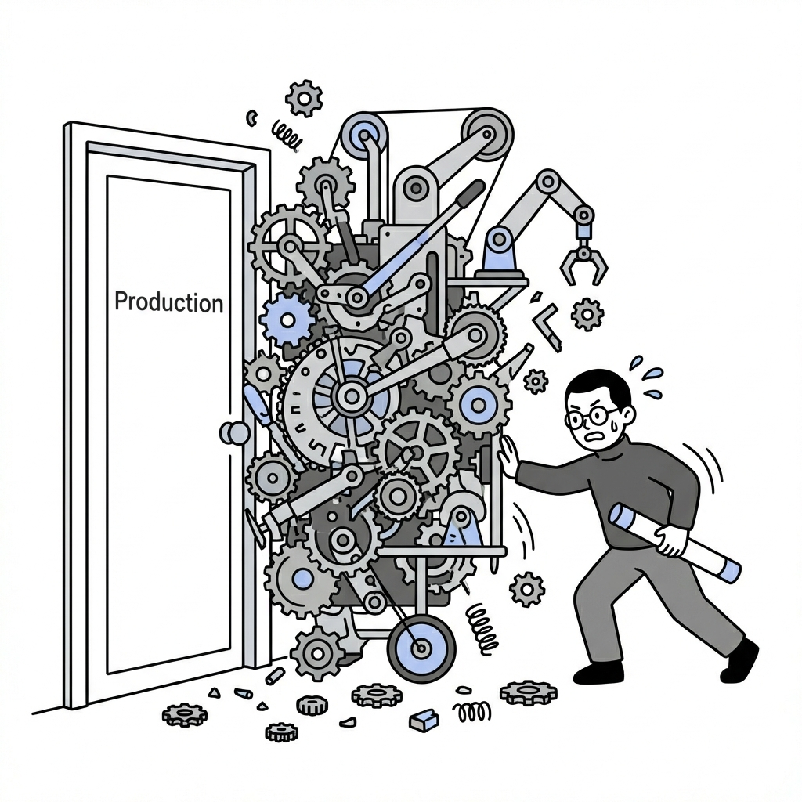
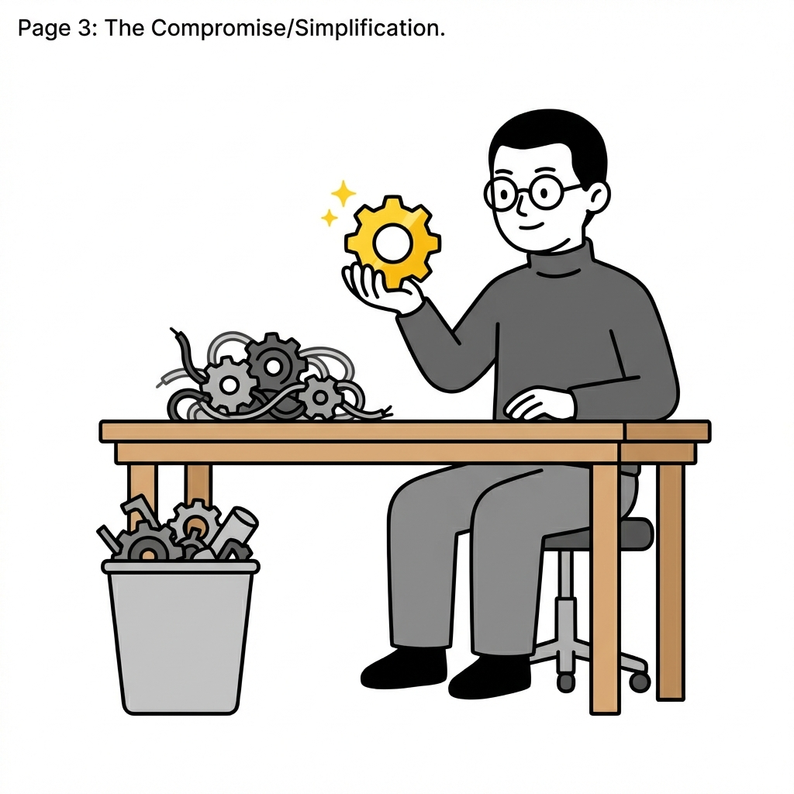

# The State of Agents: The Reliability Gap

Throughout 2025, a consistent story has emerged from enterprise AI reports: while adoption of 3rd party AI apps (like ChatGPT and Claude) is booming, internal "Pilot" agents are struggling to survive.

## The Usage Paradox

If you look at the headlines, AI adoption is everywhere. But dig deeper, and you find a stark contrast. Off-the-shelf tools are widely retained and valued. In contrast, internal AI pilots—tools built specifically *by* and *for* an organization—have a pilot failure rate as high as 95%.

*Employees happily adopt external tools that work, while internal pilots often crash and burn.*

## The Reliability Barrier

Why is it so hard for enterprises to build their own AI tools? The answer is **Reliability**.

Unlike a chat with a creative writing bot, enterprise agents often need to perform complex sequences of actions. As these sequences grow longer, the probability of error compounds. Most "autonomous" agents simply cannot maintain correctness over long run-times. They hit a wall.

*Complex agents struggle to fit through the door of Production. They are often too fragile and unpredictable.*

## The Fix: Scaling Back Ambitions

Successful teams are reacting to this reality not by building bigger, more complex brains, but by **simplifying**.

Research shows that successful production agents are "scaling back ambitions":
1.  **Shorter Run-times**: 68% of agents execute fewer than 10 steps.
2.  **Human-in-the-Loop**: 92.5% of agents hand off their output to a human, not another machine.
3.  **Constrained Scope**: Developers are polishing simple, reliable workflows rather than building "do-it-all" machines.

*Builders are learning that a simple, reliable component is more valuable than a complex, broken machine.*

## Rational Rejection

There is a narrative that enterprise employees are "unwilling" to adopt new tools. The data suggests otherwise. Employees aren't stubborn; they are **rational**.

If a tool is unreliable, glitchy, or unpredictable, a rational worker *should* reject it. They will always prefer the simple tool that works (the "hammer") over the magic box that might explode.

*Users make the rational choice: they choose reliability.*

## Conclusion: Building Trust

The path forward for enterprise agents isn't about massive autonomous systems (yet). It's about building trust.

By delivering small, constrained, and reliable agents that actually solve problems, developers can earn the trust of their users. Once that foundation is set, we can slowly expand the scope. But reliability must come first.

*Trust is the foundation. Start small and reliable to climb the ladder of adoption.*

---
*Generated by Michi Manga*
