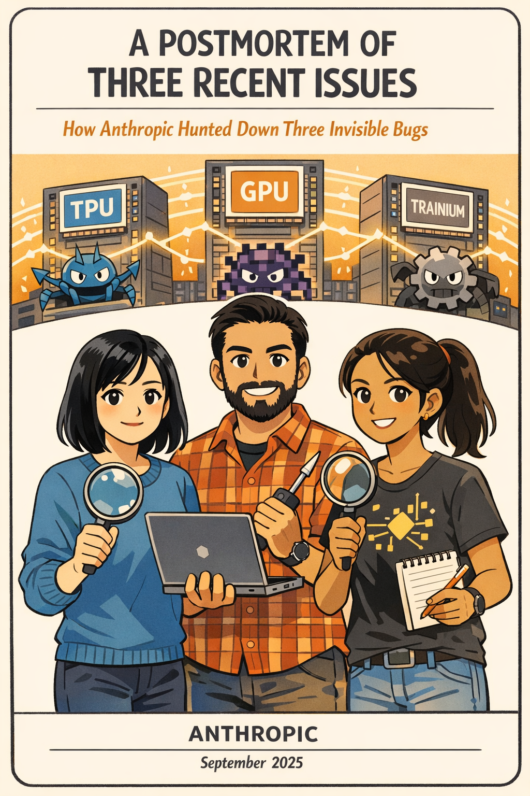
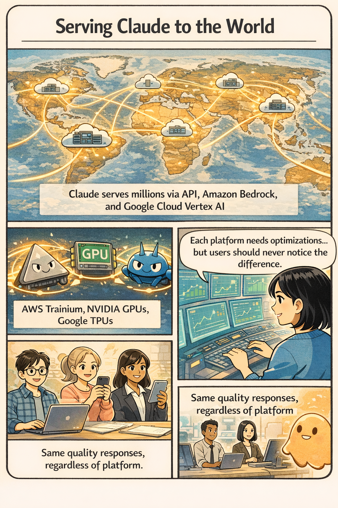
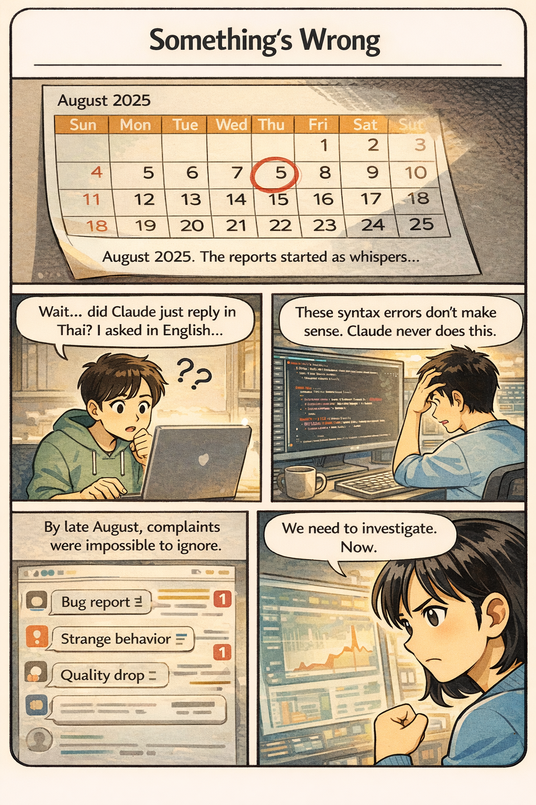
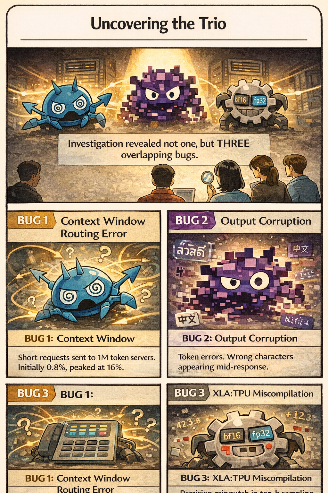
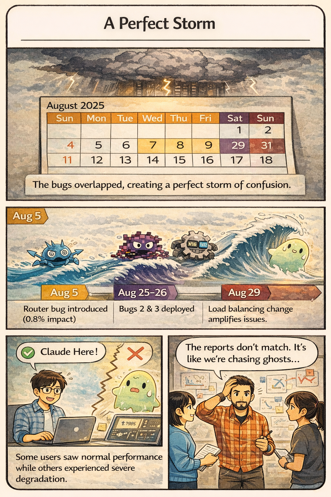
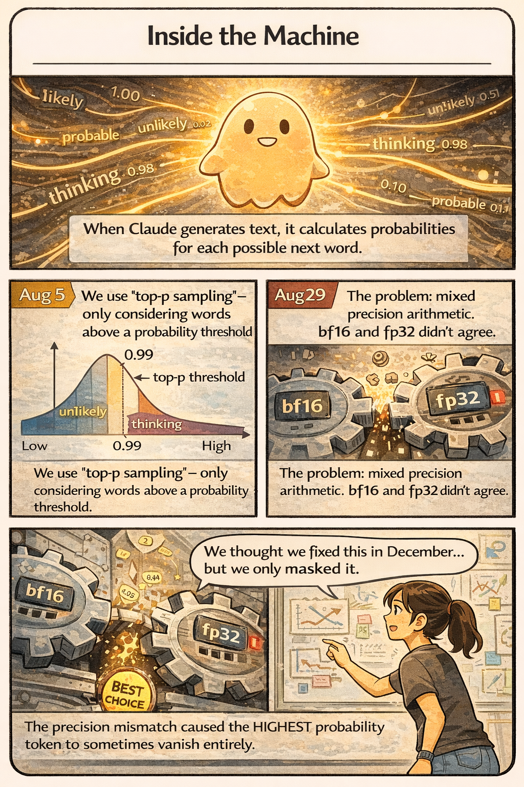
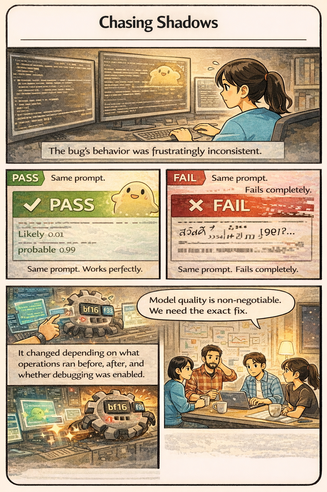
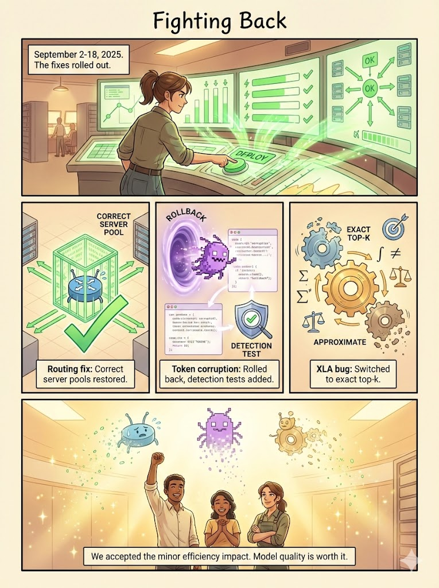
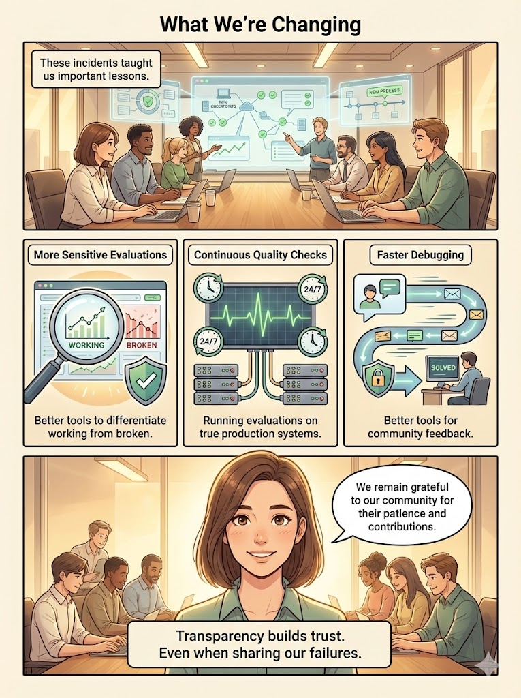
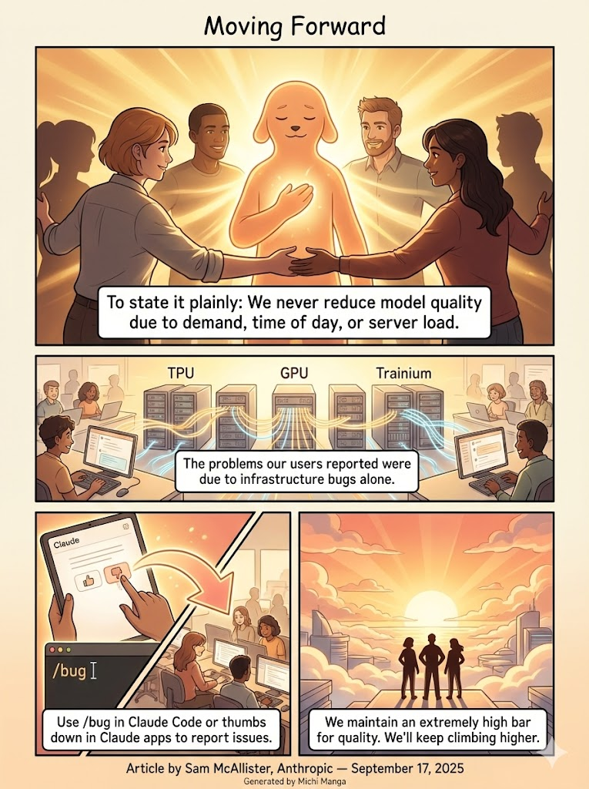

# A Postmortem of Three Recent Issues

> *A visual story of how Anthropic's engineering team hunted down three invisible bugs that affected Claude's response quality*

---

## Executive Summary

Between August and early September 2025, three infrastructure bugs intermittently degraded Claude's response quality. This transparent technical postmortem from Anthropic explains what happened, why detection and resolution took time, and what changes are being implemented to prevent similar issues.

**Key Statement from Anthropic:**
> "To state it plainly: We never reduce model quality due to demand, time of day, or server load. The problems our users reported were due to infrastructure bugs alone."

---

## The Scale of Claude

Claude serves millions of users worldwide through multiple platforms:
- **First-party API** (claude.ai)
- **Amazon Bedrock**
- **Google Cloud's Vertex AI**

The infrastructure runs across three different hardware platforms:
- **AWS Trainium**
- **NVIDIA GPUs**
- **Google TPUs**

Each platform has different characteristics and requires specific optimizations. Despite these variations, Anthropic maintains **strict equivalence standards** — users should get the same quality responses regardless of which platform serves their request.

---

## The First Signs of Trouble

### Timeline: August 2025

In early August, users began reporting unusual behavior:
- **Thai or Chinese characters** appearing in English responses ("สวัสดี" mid-sentence)
- **Obvious syntax errors** in generated code
- **Inconsistent response quality** across sessions

These initial reports were difficult to distinguish from normal variation in user feedback. By late August, the increasing frequency and persistence prompted a full investigation.

---

## Three Overlapping Bugs

Investigation revealed not one, but **THREE** overlapping bugs:

### Bug 1: Context Window Routing Error
- Some Sonnet 4 requests were **misrouted** to servers configured for 1M token context windows
- Initially affected **0.8%** of requests
- Peaked at **16%** on August 31
- "Sticky" routing meant affected users continued experiencing issues

### Bug 2: Output Corruption
- Misconfiguration on TPU servers caused **token generation errors**
- Runtime performance optimization occasionally assigned high probability to wrong tokens
- Result: Thai/Chinese characters in English, syntax errors in code

### Bug 3: XLA:TPU Miscompilation
- Code change triggered a **latent bug** in the XLA:TPU compiler
- Related to mixed precision arithmetic (bf16 vs fp32)
- The most elusive and inconsistent of the three

---

## A Perfect Storm

### How the Bugs Compounded

| Date | Event | Impact |
|------|-------|--------|
| **Aug 5** | Bug 1 introduced | 0.8% of Sonnet 4 requests affected |
| **Aug 25-26** | Bugs 2 & 3 deployed | Multiple models affected |
| **Aug 29** | Load balancing change | Amplified affected traffic |
| **Aug 31** | Peak impact | 16% of Sonnet 4 requests affected |

The overlapping nature created **confusing, contradictory reports**:
- Some users saw normal performance
- Others experienced severe degradation
- Same user, different results at different times

---

## Inside the Machine: The Precision Bug

### How Claude Generates Text

1. **Probability Calculation**: Claude calculates probabilities for each possible next word
2. **Top-p Sampling**: Only considers words whose cumulative probability reaches a threshold (0.99 or 0.999)
3. **Distributed Sorting**: On TPUs, probability calculations happen across multiple chips

### The Root Cause: Mixed Precision Arithmetic

- Models compute probabilities in **bf16** (16-bit floating point)
- TPU's vector processor is **fp32-native** (32-bit)
- The XLA compiler can optimize by converting some operations to fp32
- **Precision mismatch** meant operations didn't agree on which token had highest probability
- Result: The **highest probability token sometimes vanished entirely**

---

## Chasing Shadows

### Why Detection Was Difficult

The bug's behavior was **frustratingly inconsistent**:
- Same prompt: Works perfectly → PASS ✅
- Same prompt: Fails completely → FAIL ❌

It changed depending on:
- What operations ran before or after
- Whether debugging tools were enabled
- Batch size and model configuration

### The Investigation Challenge

- **Evaluations didn't capture** the degradation users reported
- **Privacy practices** limited access to user interactions
- Each bug produced **different symptoms on different platforms**
- Contradictory reports didn't point to any single cause

---

## Fighting Back: The Resolution

### September 2-18, 2025: Fixes Roll Out

| Bug | Fix | Completion |
|-----|-----|------------|
| **Routing Error** | Fixed routing logic to direct requests to correct server pools | Sept 16-18 |
| **Output Corruption** | Rolled back misconfiguration, added detection tests | Sept 2 |
| **XLA Miscompilation** | Switched from approximate to exact top-k sampling | Sept 4-12 |

### Key Engineering Decision

> "Model quality is non-negotiable, so we accepted the minor efficiency impact."

The team switched from **approximate top-k** (faster but buggy) to **exact top-k** (slower but correct) and standardized operations on fp32 precision.

---

## What Anthropic Is Changing

### Three Key Improvements

1. **More Sensitive Evaluations**
   - Better tools to differentiate between working and broken implementations
   - Evaluations that can more reliably detect subtle degradation

2. **Continuous Production Quality Checks**
   - Running evaluations continuously on true production systems
   - Catching issues like the context window load balancing error earlier

3. **Faster Debugging Tooling**
   - Infrastructure to better debug community-sourced feedback
   - Tools to reduce remediation time while preserving user privacy

### The Role of User Feedback

> "We remain grateful to our community for their patience and contributions."

User reports helped isolate the issues:
- Specific changes observed
- Examples of unexpected behavior
- Patterns across different use cases

**How to report issues:**
- Use `/bug` command in Claude Code
- Use the "thumbs down" button in Claude apps
- Contact [feedback@anthropic.com](mailto:feedback@anthropic.com)

---

## Moving Forward: The Commitment

Anthropic's closing statement encapsulates their commitment to users:

> **"We never reduce model quality due to demand, time of day, or server load."**

The engineering team stands united around Claude, committed to:
- Maintaining the highest quality bar
- Continuous improvement of monitoring and evaluation
- Transparent communication when issues occur
- Valuing user feedback as an essential signal

---

## Key Takeaways

### For Engineers & Practitioners

1. **Overlapping bugs are harder to diagnose** — Consider that multiple issues may be compounding each other
2. **Mixed precision arithmetic is tricky** — bf16/fp32 mismatches can cause subtle, inconsistent bugs
3. **Approximate algorithms have hidden costs** — Performance optimizations can mask or introduce bugs
4. **User feedback is invaluable** — Real-world usage patterns complement internal testing

### On Transparency

This postmortem exemplifies engineering transparency:
- Detailed technical explanation of root causes
- Honest acknowledgment of detection gaps
- Clear commitment to improvement

> "We don't typically share this level of technical detail about our infrastructure, but the scope and complexity of these issues justified a more comprehensive explanation."

---

## Acknowledgments

**Article by:** Sam McAllister, Anthropic  
**With thanks to:** Stuart Ritchie, Jonathan Gray, Kashyap Murali, Brennan Saeta, Oliver Rausch, Alex Palcuie, and many others.

**Published:** September 17, 2025

---

*This visual story was generated using the Michi Manga skill*  
*Original source: [Anthropic Engineering Blog](https://www.anthropic.com/engineering/a-postmortem-of-three-recent-issues)*
