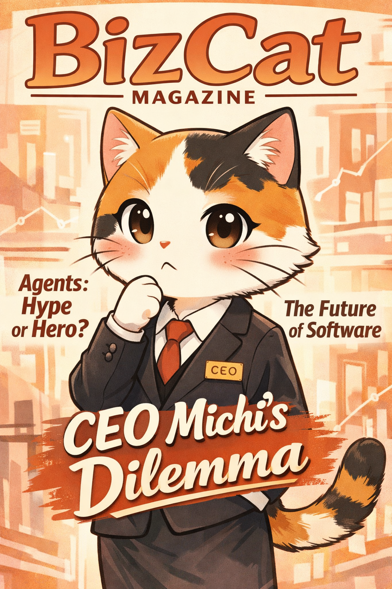
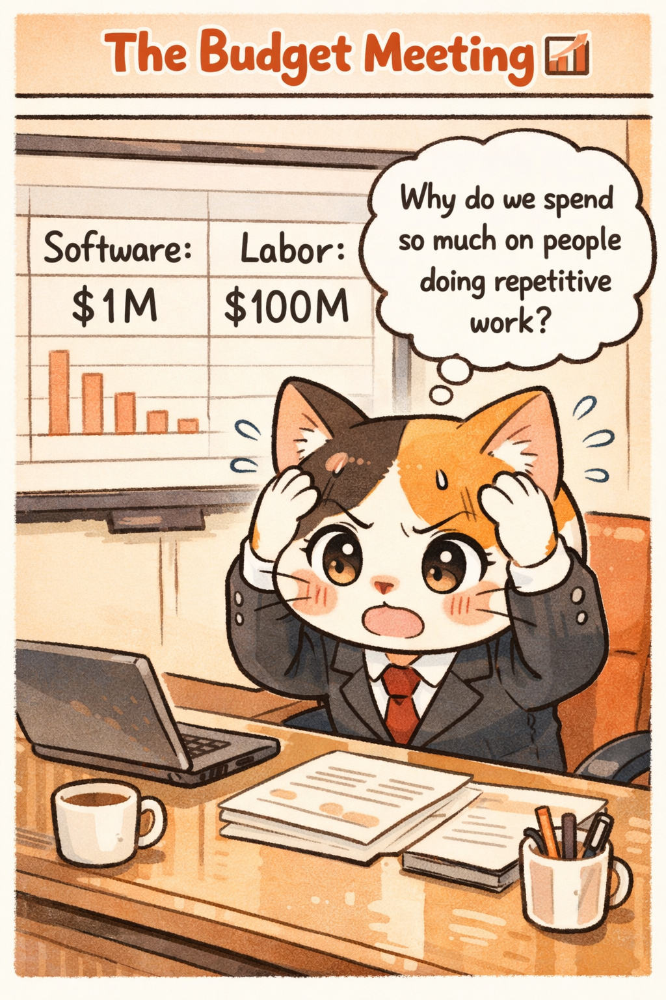
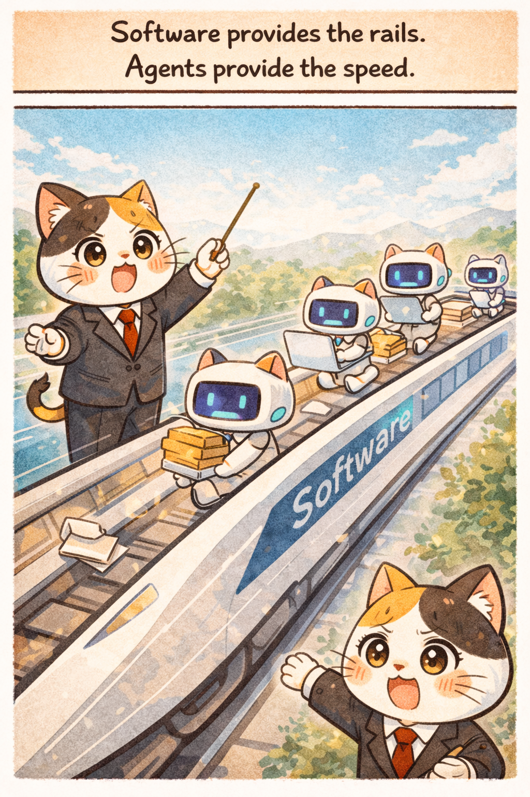
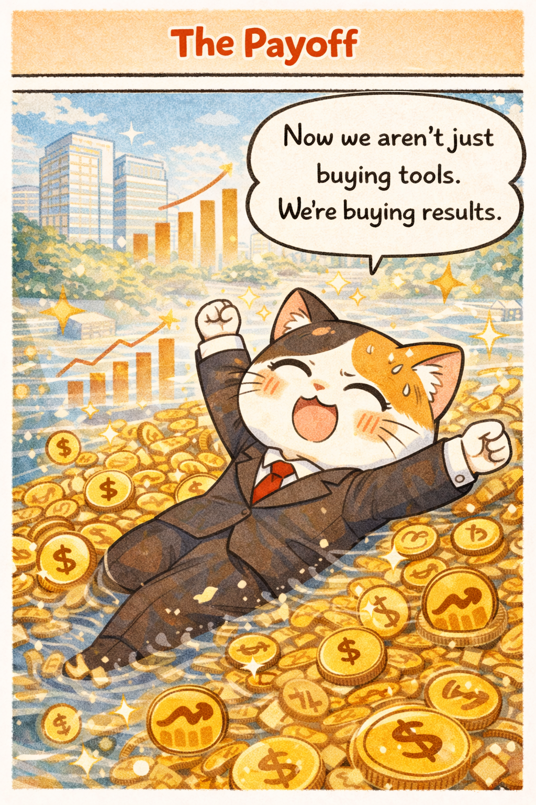
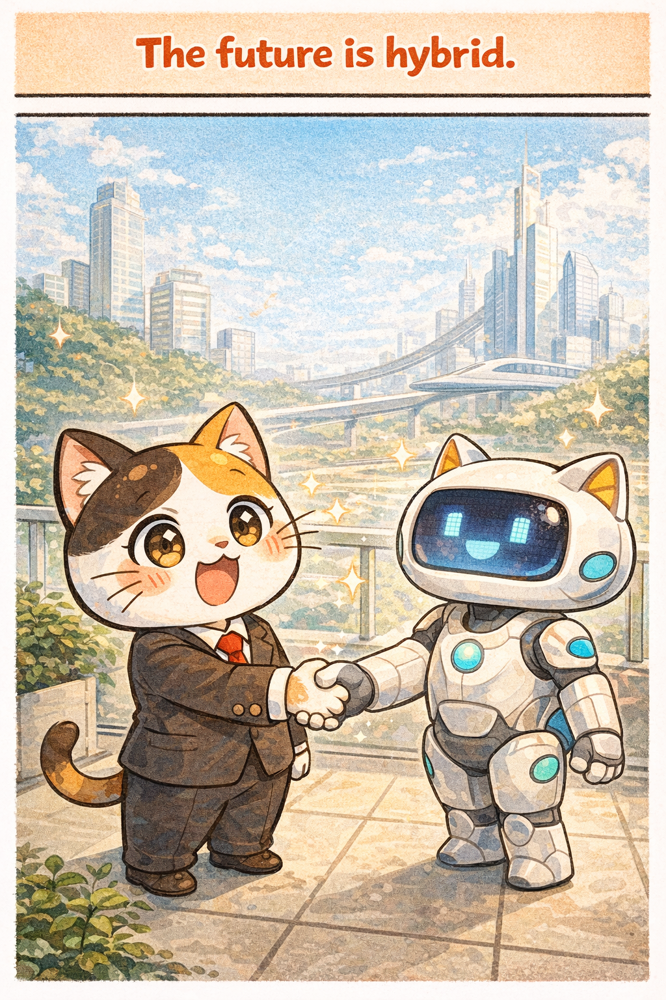

# CEO Michi and the Agent Army

> Adapted from: [The future of enterprise software](https://x.com/levie/status/2013018817610518642) by Aaron Levie

## Summary
In this comic adaptation of Aaron Levie's analysis, we follow CEO Michi as she navigates the "Agent Revolution". Levie argues that while AI agents are transforming work, they won't replace enterprise software. Instead, they will expand the market by taking over labor tasks, provided they have the "deterministic" guardrails of traditional software to guide them.

---

## 1. CEO Michi's Dilemma

The tech world is buzzing with questions: Will agents replace software? Will they write their own code? CEO Michi finds herself on the cover of "BizCat Magazine", representing every leader trying to figure out if this is just hype or a true hero moment for productivity.

---

## 2. The Budget Meeting

Traditionally, software budgets have been constrained to about 3-7% of revenue (IT spend). However, the real cost for companies is the "work" itself—the labor budget. Michi realizes that while she spends $1M on software, she spends $100M on people doing repetitive tasks that agents could theoretically handle.

---

## 3. The Bad Idea

Michi tries the radical approach: "Fire the software! Let Agents do it all!" This illustrates the difference between **deterministic** systems (software) and **non-deterministic** systems (agents). Without the rigid rules of software, the agents create chaos, inconsistent results, and operational failure.

---

## 4. The Realization

A wise consultant (Levi-san) explains why companies buy software in the first place: to **codify process**. Software manages the "Core" (what makes a company unique) and the "Context" (necessary operations like payroll/ERP) in a reliable way. You *need* the structure of software to tell the agents what to do.

---

## 5. The Harmony

The solution isn't Software OR Agents, but Software AND Agents. Software provides the "rails"—the determinism, security, and workflow definitions. Agents provide the "speed" and flexibility to operate on those rails. By combining them, Michi creates a high-velocity enterprise.

---

## 6. The Payoff

This shift changes the business model of software. Since "seats" don't make sense for a billion agents, the industry will move toward consumption and usage-based models. By tapping into the massive labor market (the "unconstrained market"), the value potential for software explodes.

---

## 7. Conclusion

We are entering the most dynamic period in software history. The winners will be those who can build the complex workflows (moats) that allow humans and agents to collaborate. The future is hybrid.

