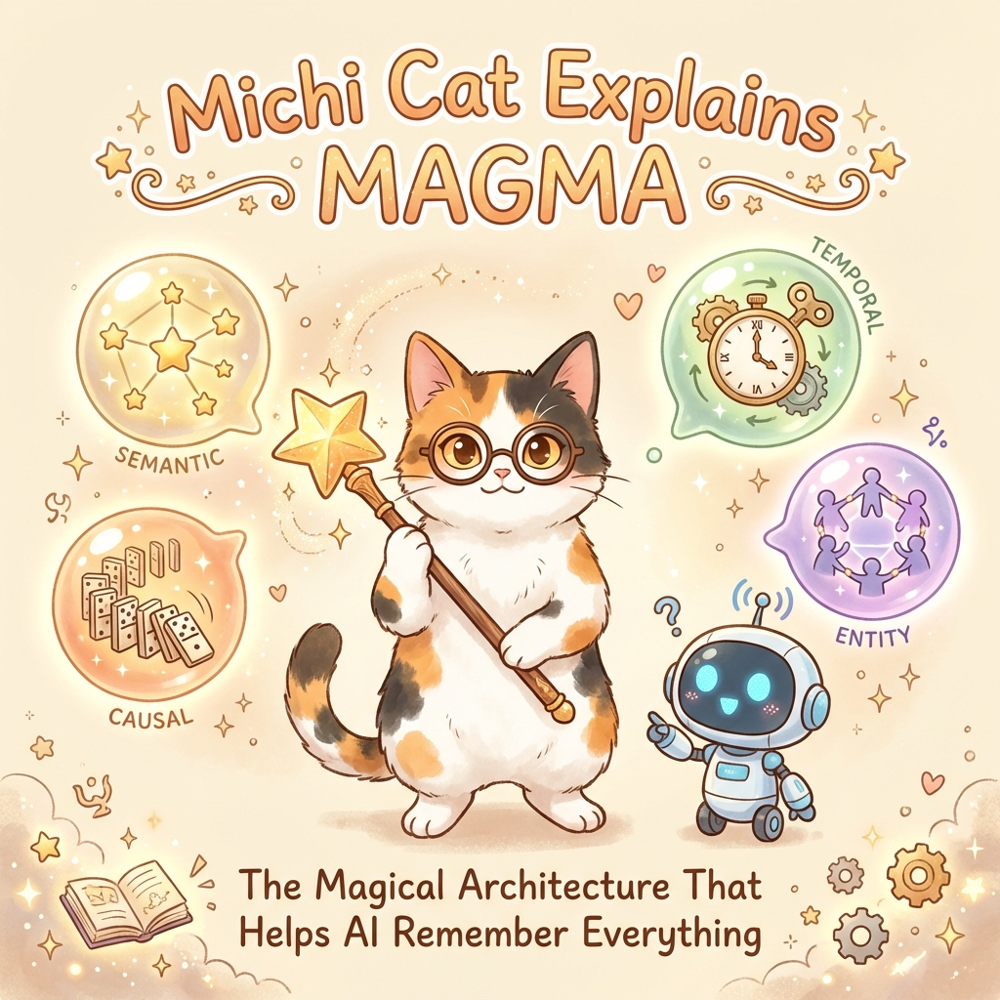
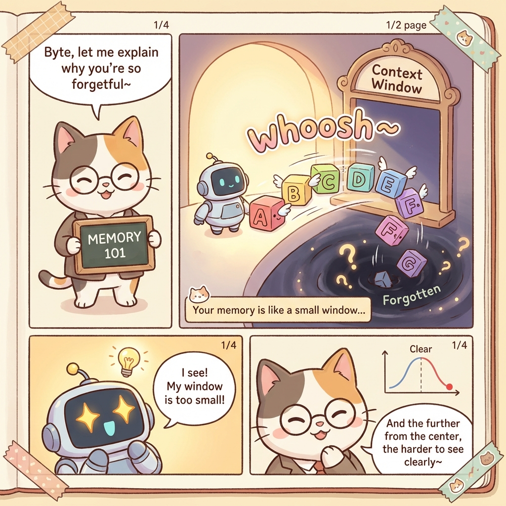
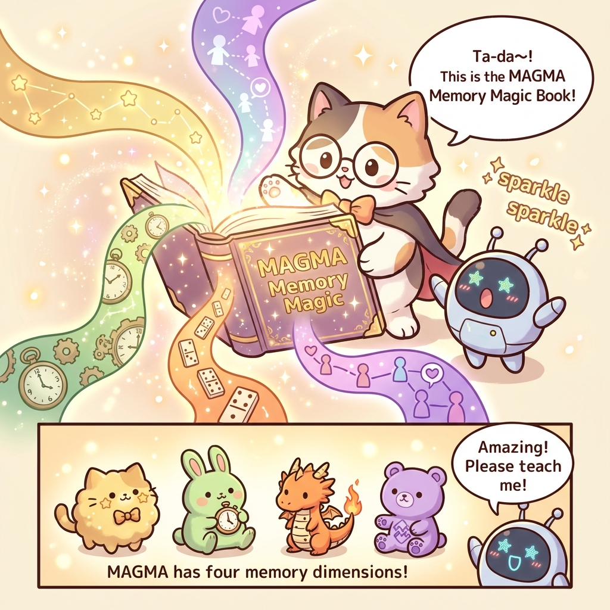
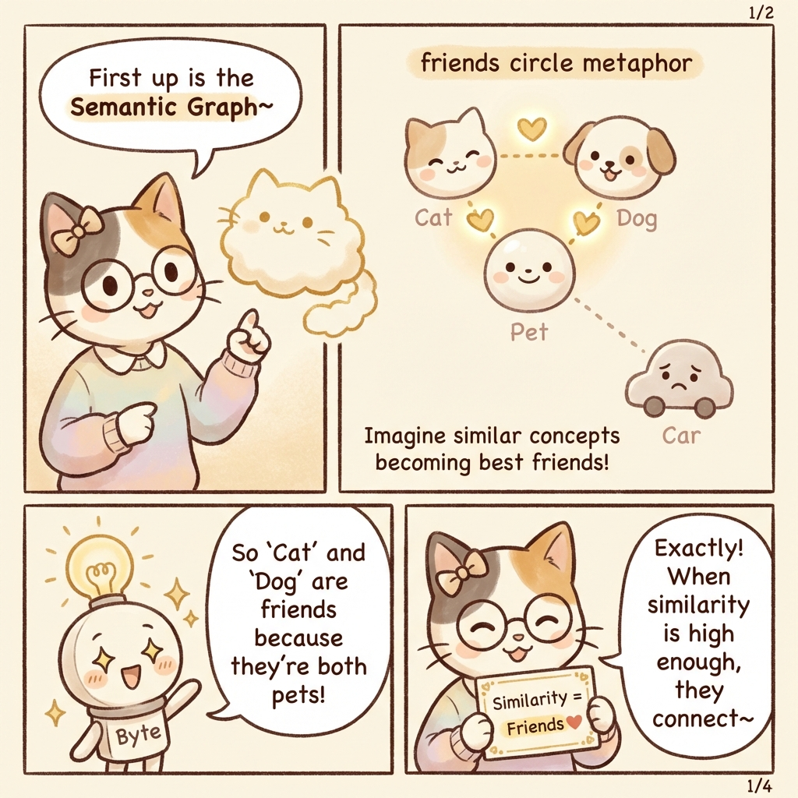
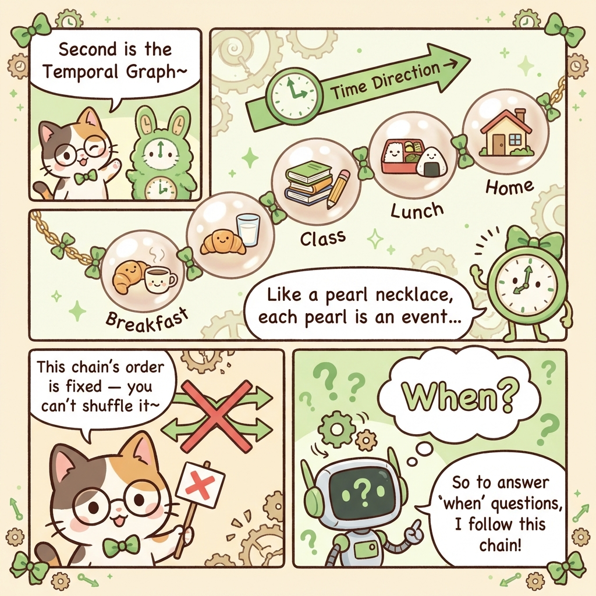
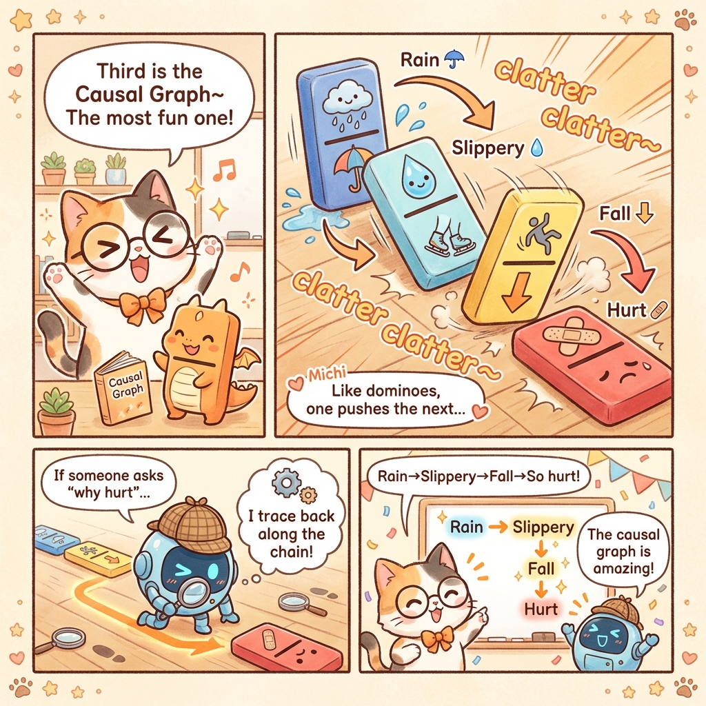
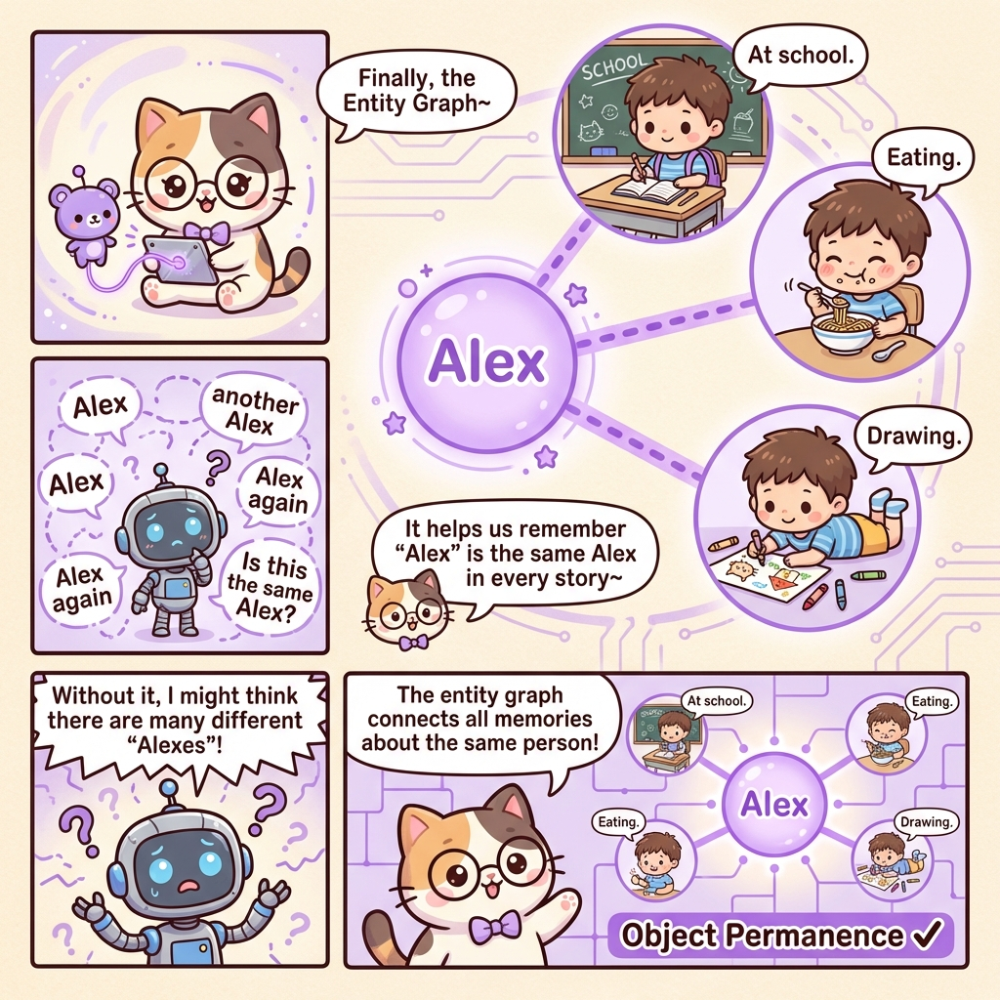
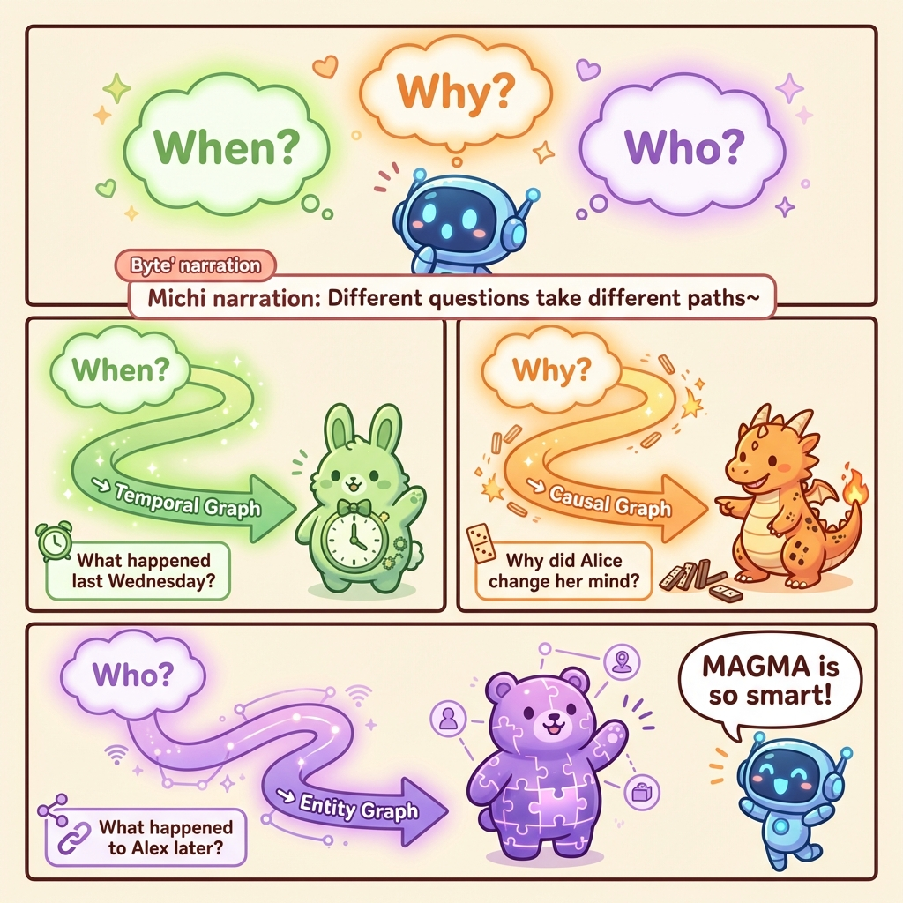
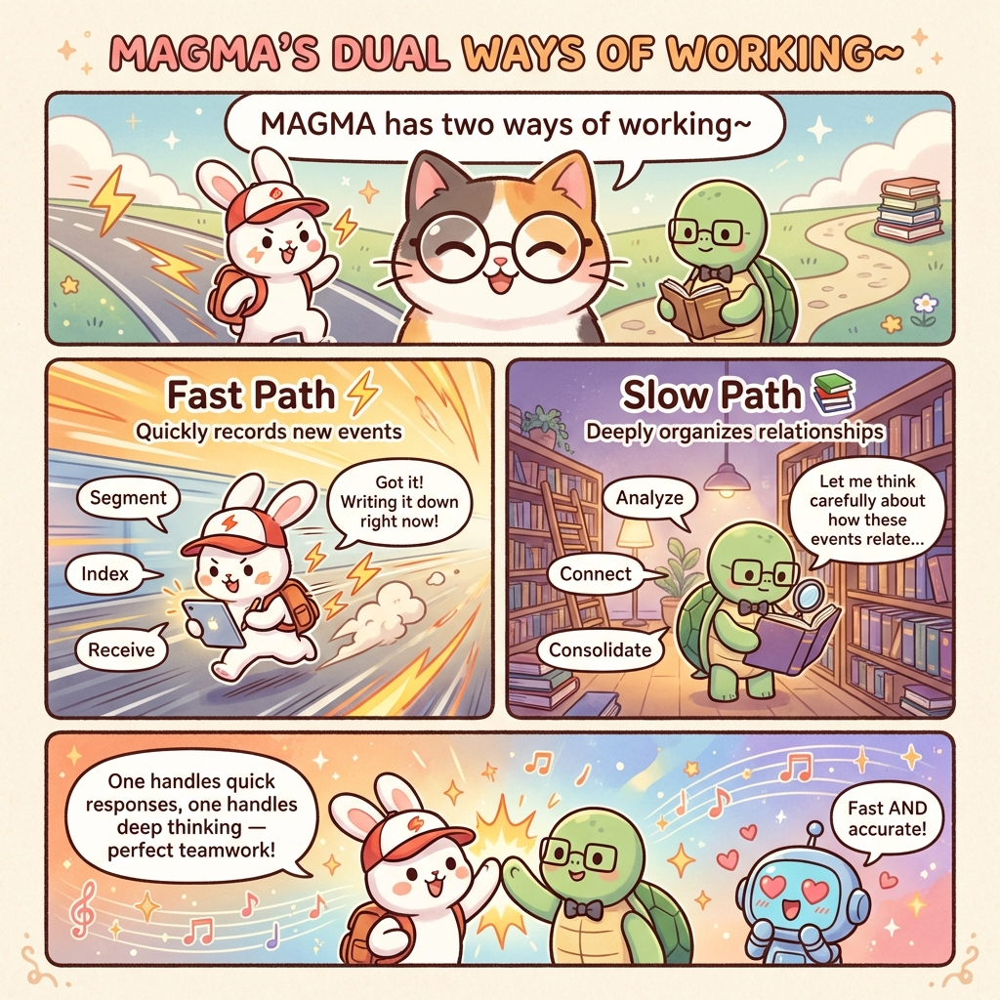

# Michi Cat Explains MAGMA: AI Memory Magic

**Source**: [MAGMA Paper](https://arxiv.org/abs/2601.03236)  
**Summary**: Michi Cat takes you on a journey to explore MAGMA — a magical architecture that gives AI Agents super memory powers. Through adorable character interactions, we'll learn how four "memory dimensions" (semantic, temporal, causal, entity) help AI remember important information and retrieve it intelligently.

---

## Cover

## Meet Byte
Michi Cat introduces her assistant, Byte. Byte is a cute robot but has a problem: it keeps forgetting what users said before. This shows that AI Agents need better memory systems to interact effectively.

## The Memory Window Problem
Why does Byte forget? Because LLMs have a limited "memory window". Like a small window frame, information that slides out of view is lost forever. The further from the center (current focus), the harder it is to see.

## Introducing MAGMA
Michi reveals the solution: MAGMA! It's a Multi-Graph based Agentic Memory Architecture. It organizes memory into four specific dimensions: Semantic, Temporal, Causal, and Entity.

## Semantic Graph
The Semantic Graph is like a circle of friends. Concepts that are similar (like "Cat" and "Dog") are close together, while different ones (like "Car") are far apart. This helps the AI find related memories based on meaning.

## Temporal Graph
The Temporal Graph is like a pearl necklace of time. It connects events in the order they happened. This chain is fixed and tells the story of "what happened when".

## Causal Graph
The Causal Graph explains "Why". Like dominoes falling, it tracks cause-and-effect relationships (Rain → Slippery → Fall). This allows the AI to reason about why things happened.

## Entity Graph
The Entity Graph solves the "Object Permanence" problem. It knows that "Alex" at school and "Alex" eating lunch are the same person. It connects all memories about a specific entity together.

## Smart Retrieval
MAGMA is smart about how it retrieves information. It routes questions to the right graph: "When?" goes to the Temporal Graph, "Why?" to the Causal Graph, and "Who?" to the Entity Graph.

## Dual-Stream Processing
MAGMA works in two ways, like a fast bunny and a wise turtle. The "Fast Path" quickly records new events, while the "Slow Path" deeply organizes and connects them in the background. It's the perfect team!

## Upgrade Complete!
With MAGMA, Byte now has super memory powers! It can remember everything and help users much better. You can check out the open-source code to give your agents these powers too.

