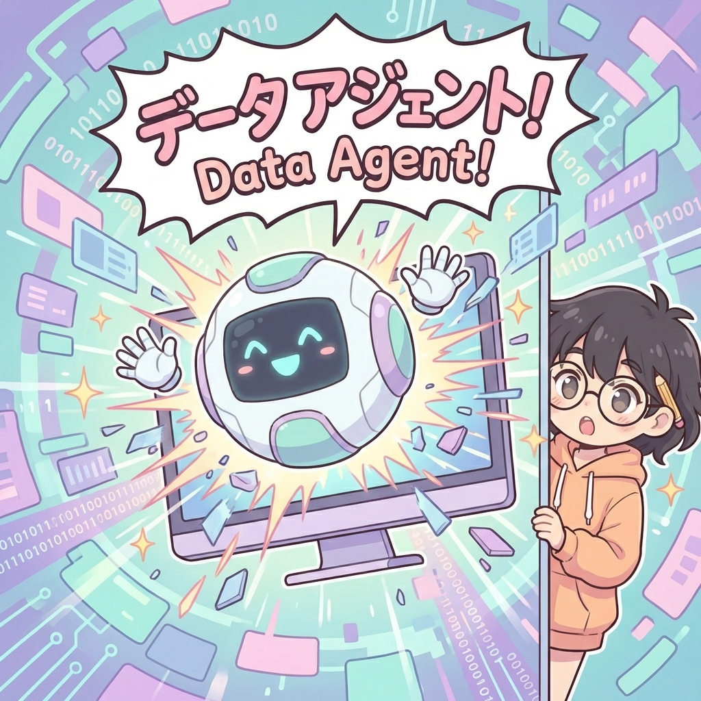
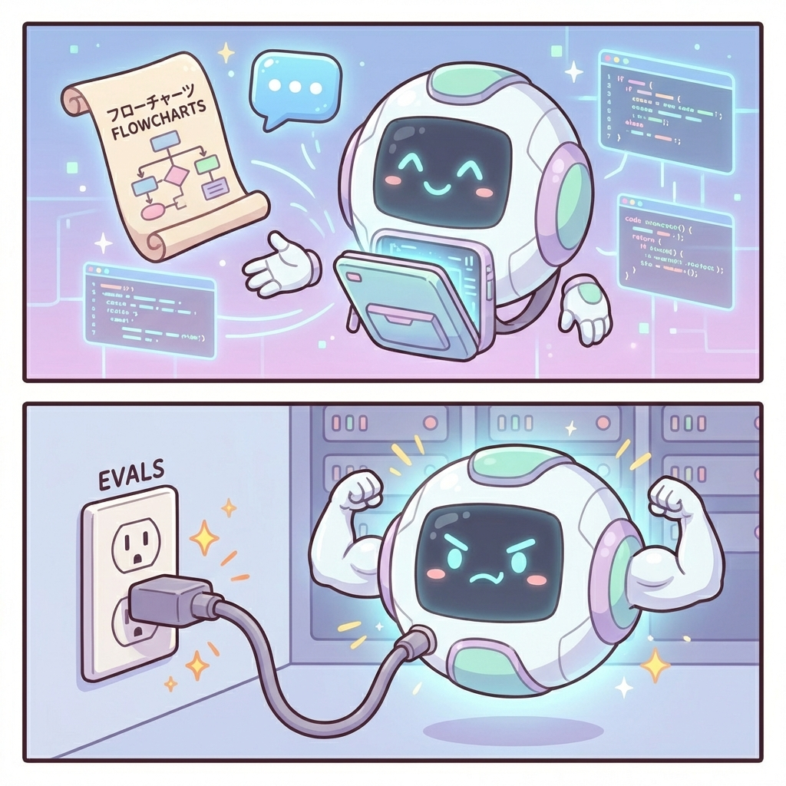
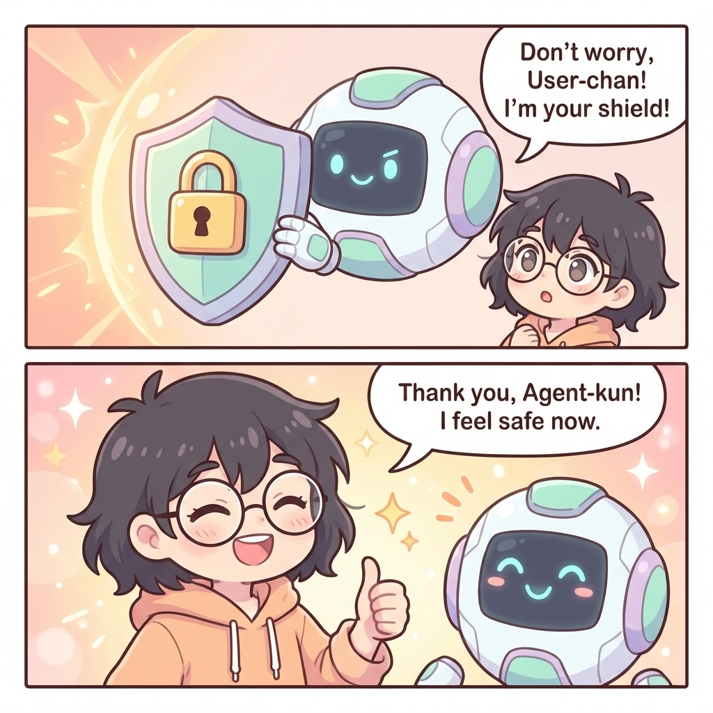

# Inside OpenAI’s in-house data agent

## Article Summary

OpenAI has built a bespoke **internal data agent** powered by **GPT-5.2** to help their employees explore and reason over 600PB of data.

**The Problem:**
With 70,000 datasets and massive scale, simply finding the right data table was time-consuming. Analysts spent too much time debugging SQL and filtering logic instead of focusing on metrics and decisions.

**The Solution:**
A "conversational companion" agent that lives where employees work (Slack, IDE, Web). It allows users to ask questions in natural language and get answers in minutes.

**Key Features:**
1.  **Self-Correction**: The agent doesn't just give up on errors; it investigates, adjusts its approach, and retries (closed-loop learning).
2.  **Context Aware**: It uses multiple context layers including table lineage, human annotations, and code definitions to understand the "meaning" of data.
3.  **Trust & Security**: It inherits OpenAI's existing security model and uses Evals to unit-test its own answers against golden sets.

**Impact:**
Teams across Engineering, Finance, and Research use it to answer high-impact questions instantly, democratizing access to data insights.

---

## Visual Story

### Cover

OpenAI's internal data agent is a bespoke tool built to democratize data access. It serves as a conversational bridge between employees and the company's massive 600PB data platform.

### Page 1: The Haystack Problem

**The Challenge:** OpenAI's data platform contains over 70,000 datasets. For analysts and engineers, simply finding the correct table is a time-consuming "needle in a haystack" problem. Navigating this complexity manually often leads to frustration and lost productivity.

### Page 2: Enter the Agent

**The Solution:** Powered by GPT-5.2, the data agent allows users to ask questions in natural language. It acts as an intelligent teammate that can explore data, run queries, and synthesize findings in minutes, lowering the barrier to entry for non-data experts.

### Page 3: Self-Correction Loop

**Closed-Loop Learning:** Unlike rigid scripts, the agent evaluates its own progress. If a query fails or returns suspicious results, the agent investigates the error, adjusts its approach, and retries. This "self-correction" shifts the burden of iteration from the human user to the AI.

### Page 4: Context is King

**Deep Context:** The agent achieves high accuracy by using multiple context layers. It doesn't just look at table names; it understands "Table Usage" (lineage), "Human Annotations" (intent), and "Codex Enrichment" (code-level definitions) to grasp the true meaning of the data.

### Page 5: Safe & Secure

**Security & Trust:** The agent operates strictly within OpenAI's existing security model. It acts as an interface layer, ensuring users can only access data they are already authorized to see. It also uses the Evals API to "unit test" its answers against golden sets to prevent regressions.

### Page 6: Everyone Wins

**Impact:** The agent has transformed how teams work. From Engineering to Finance/Go-To-Market, employees can now answer high-impact questions instantly. By handling the "grunt work" of SQL debugging, the agent frees up humans to focus on defining metrics and making strategic decisions.

---
*Generated by Michi Manga Style*
