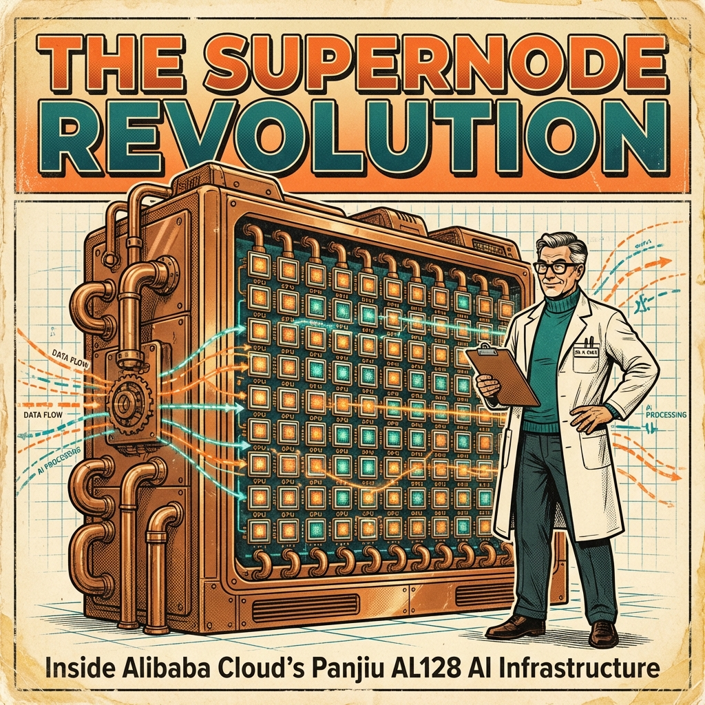
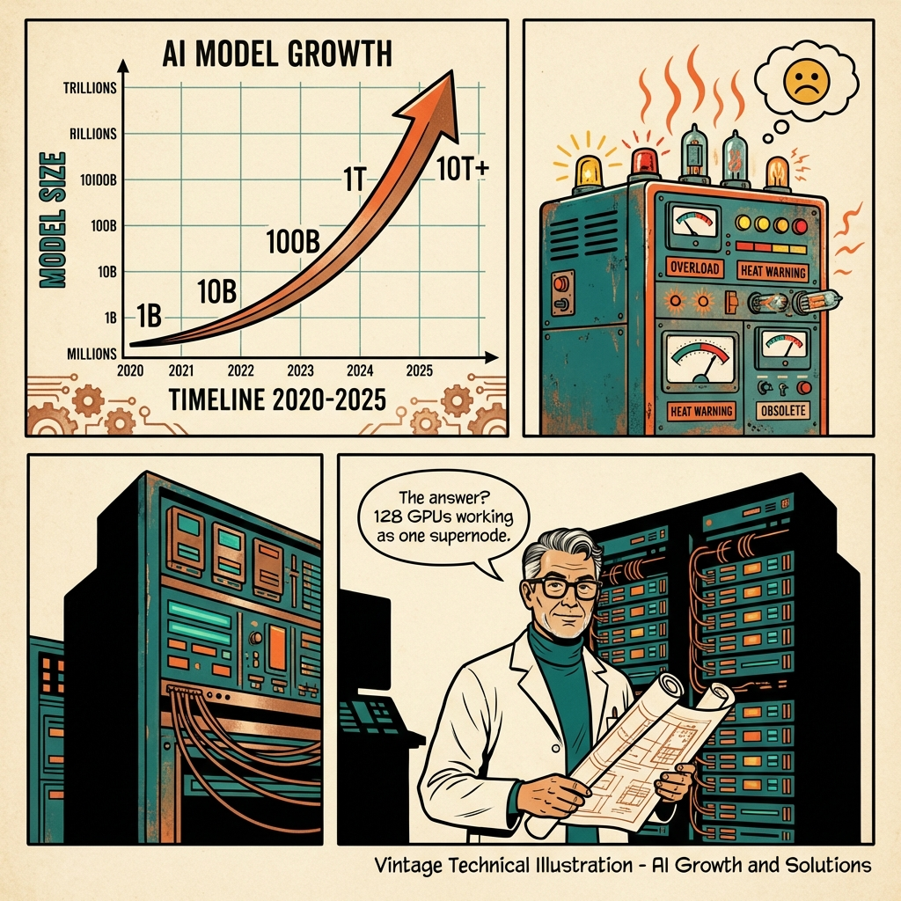
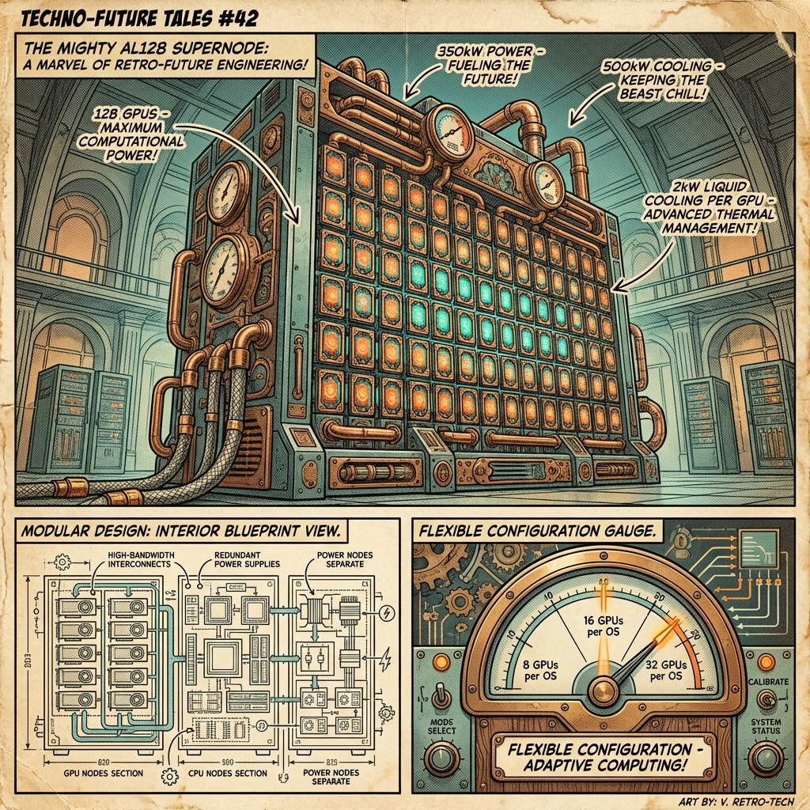
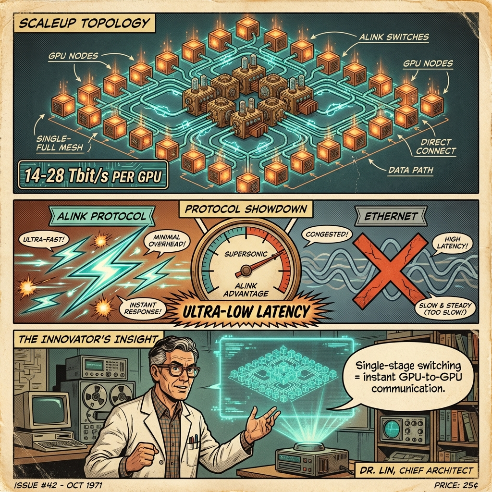
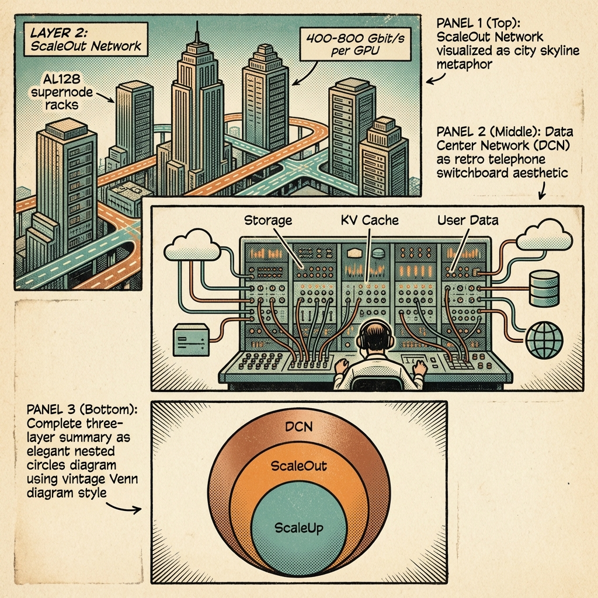
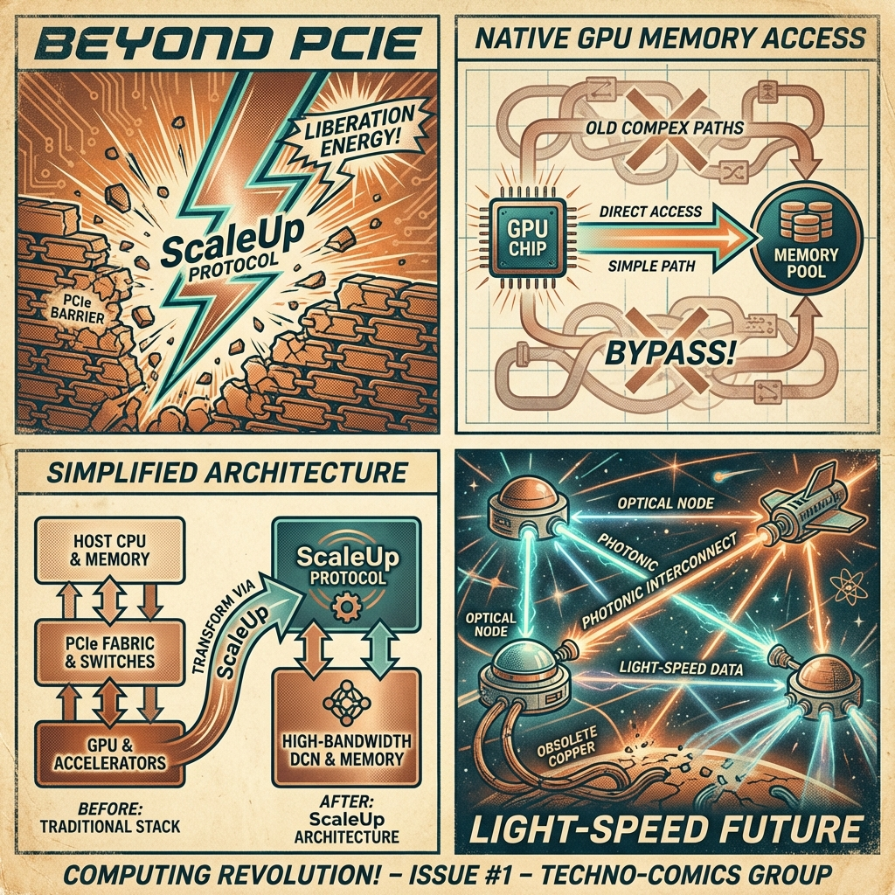
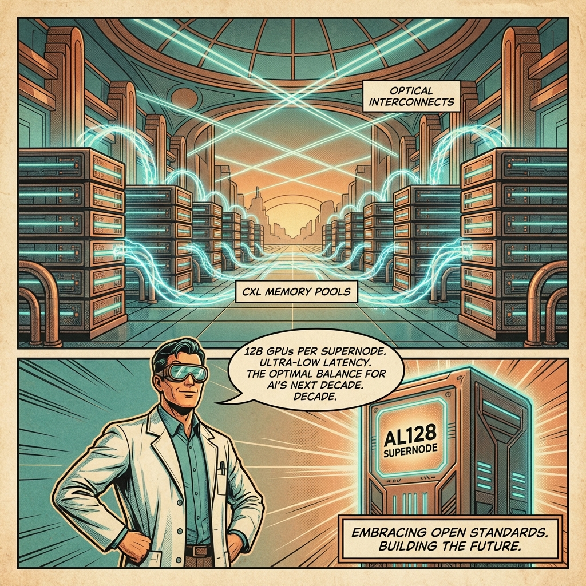

# In-depth Analysis of Alibaba Cloud Panjiu AL128 Supernode AI Servers

## Article Summary

At the **Apsara Conference 2025**, Alibaba Cloud unveiled its new-generation **Panjiu AI Infra 2.0 AL128 supernode AI servers** - a fundamental shift from traditional CPU-centric to **GPU-centric architectures** designed for foundation model training and inference.

### Key Innovations

1. **Supernode Architecture**
   - 128-144 GPUs per double-wide rack
   - 350kW power supply, 500kW heat dissipation
   - 2kW liquid cooling per GPU
   - Modular design: decoupled CPU, GPU, and power nodes
   - Flexible configuration: 8, 16, or 32 GPUs per OS

2. **Three-Layer Interconnect Architecture**
   - **Layer 1 (ScaleUp)**: Single-stage switching within supernode using non-Ethernet ALink protocol (UALink, NVLink, xLink compatible). Up to 14-28 Tbit/s bandwidth per GPU with ultra-low latency.
   - **Layer 2 (ScaleOut)**: Network between supernodes with 400-800 Gbit/s per GPU via high-performance NICs.
   - **Layer 3 (DCN)**: Data center network for storage, databases, KV caches, and external communication.

3. **GPU-Centric Evolution (4 Directions)**
   - Connect peripherals via ScaleUp protocol to break PCIe limits
   - Reshape access modes to support GPU native memory semantics
   - Simplify from 3-layer to 2-layer architecture (ScaleUp + High-bandwidth DCN)
   - Apply optical interconnection (NPO, CPO) for 256+ GPU ScaleUp domains

4. **CXL Protocol for Memory**
   - Enables larger memory pools with hundreds of ns latency
   - KV cache performance improved by **4.79x**
   - Time to first token (TTFT) reduced by **82.7%**

### Core Message

> As AI model scales grow to 10+ trillion parameters, supernode servers with 128 interconnected GPUs provide the optimal balance of performance, latency, and cost for inference workloads.

---

## Visual Story

### Cover: The Supernode Revolution

---

### Page 1: The Growing Challenge

---

### Page 2: Meet the AL128 Supernode

---

### Page 3: ScaleUp Interconnection

---

### Page 4: Three-Layer Architecture

---

### Page 5: Future Directions

---

### Page 6: Conclusion

