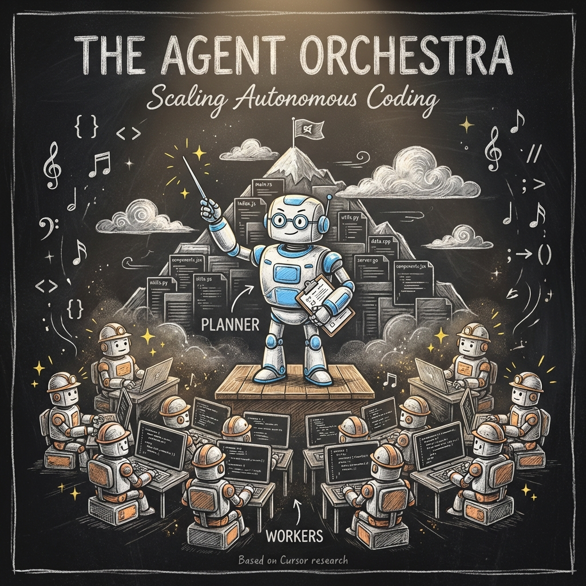
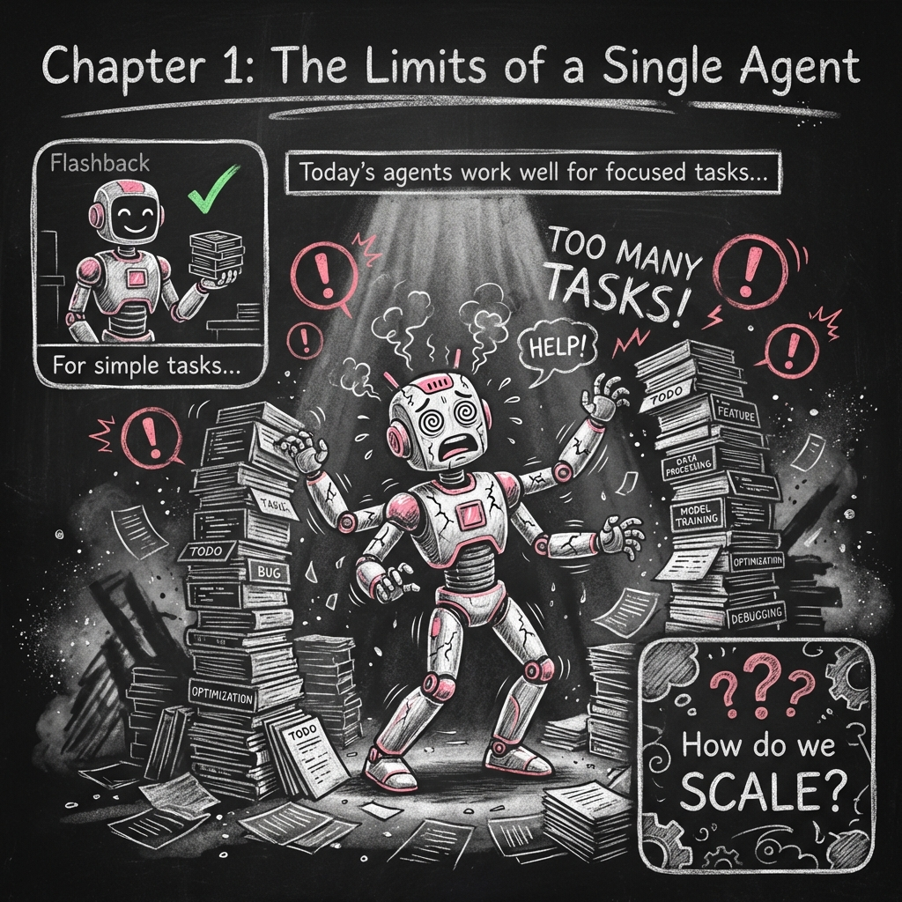
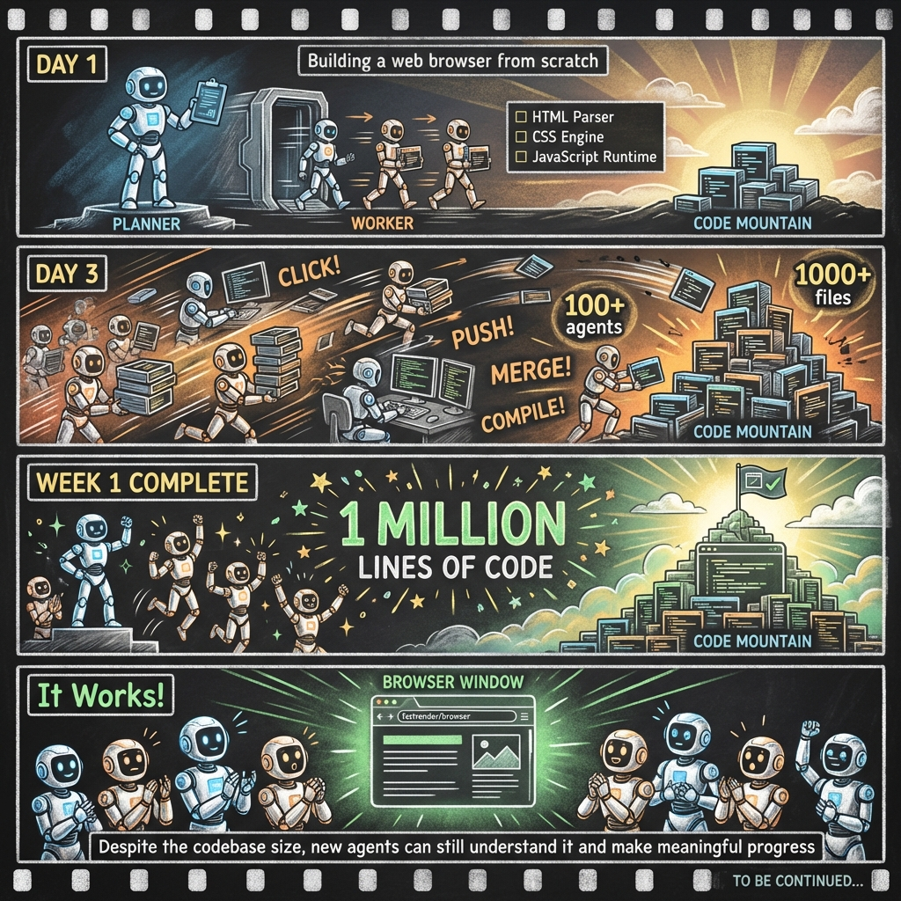
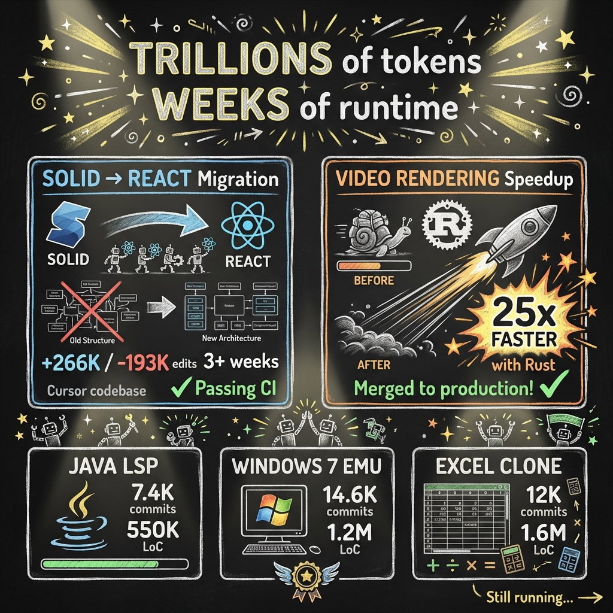
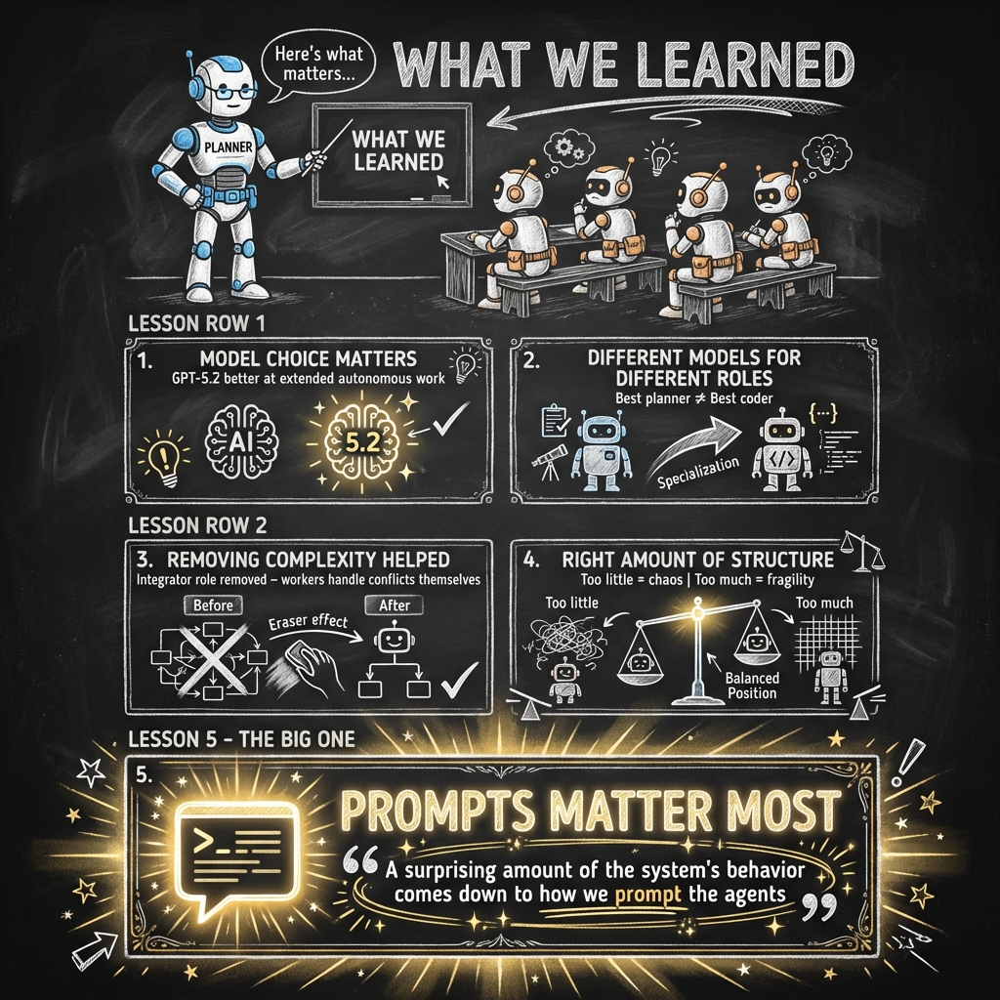
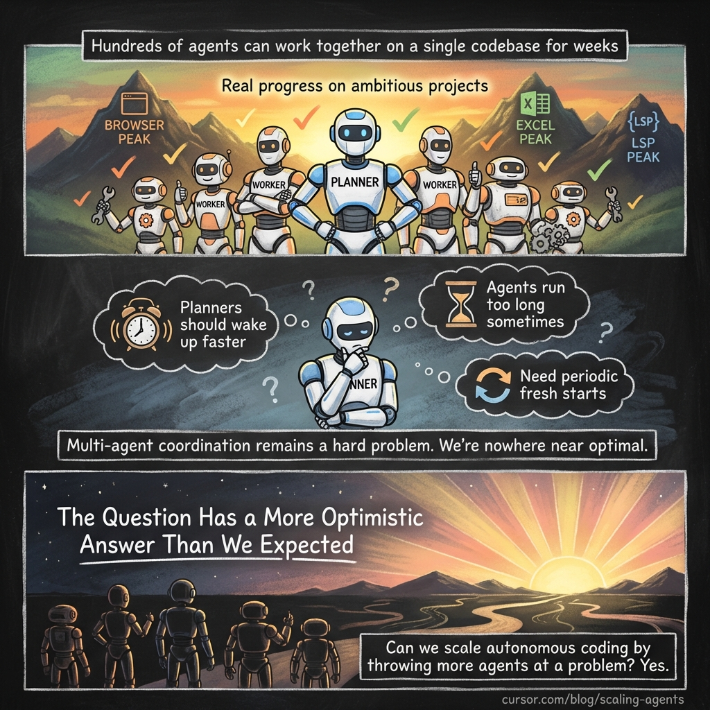
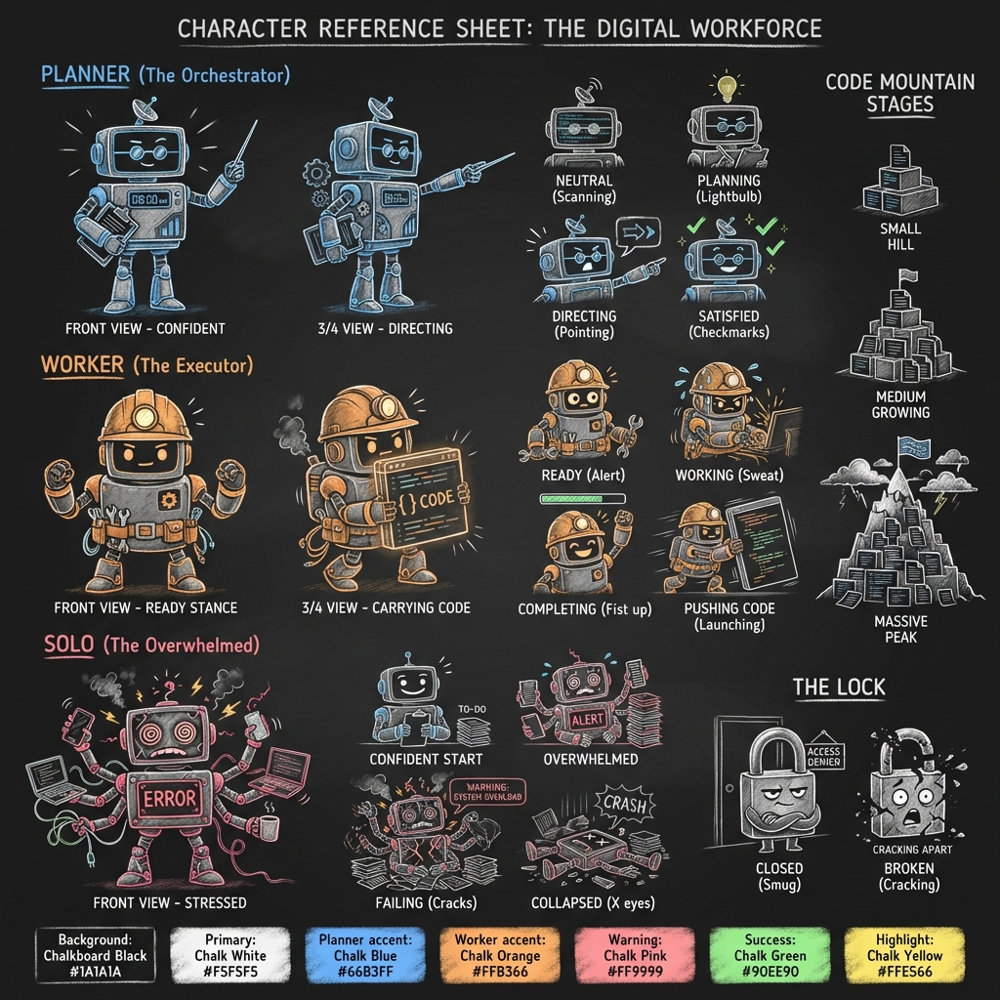

# The Agent Orchestra: Scaling Autonomous Coding

> A knowledge comic adaptation of Cursor's research on multi-agent coordination

---

## Source Information

| Field | Value |
|-------|-------|
| **Title** | Scaling Long-Running Autonomous Coding |
| **Author** | Wilson Lin |
| **Source** | [Cursor Blog](https://cursor.com/blog/scaling-agents) |
| **Date** | 2026 |
| **Comic Style** | Chalkboard (chalk) with neutral tone |
| **Created** | January 25, 2026 |

---

## Article Summary

Cursor's research team has been experimenting with running coding agents autonomously for weeks at a time, pushing the frontier of agentic coding for projects that typically take human teams months to complete.

### Key Findings

**1. The Limits of Single Agents**
Today's AI agents work well for focused tasks but struggle with complex projects. The natural solution—running multiple agents in parallel—introduces challenging coordination problems.

**2. Failed Coordination Attempts**
- **Lock-based coordination** caused bottlenecks: 20 agents would slow to the throughput of 2-3
- **Optimistic concurrency** was simpler but still had problems
- **Flat hierarchies** led to risk-averse behavior where no agent took responsibility for hard problems

**3. The Breakthrough: Planner-Worker Pattern**
The solution was separating roles:
- **Planners**: Continuously explore the codebase and create tasks, can spawn sub-planners
- **Workers**: Focus entirely on completing assigned tasks, then push changes
- **Judge agents**: Determine whether to continue at the end of each cycle

**4. Running for Weeks**
Using this system, agents accomplished remarkable feats:
- Built a web browser from scratch (1M+ lines of code in ~1 week)
- Migrated Solid to React in Cursor codebase (+266K/-193K edits over 3+ weeks)
- Made video rendering 25x faster with Rust
- Built Java LSP (550K LoC), Windows 7 emulator (1.2M LoC), Excel clone (1.6M LoC)

**5. Key Lessons Learned**
1. **Model choice matters** - GPT-5.2 excels at extended autonomous work
2. **Different models for different roles** - Best planner ≠ Best coder
3. **Removing complexity helped** - Simpler systems often work better
4. **Right amount of structure** - Too little = chaos, too much = fragility
5. **PROMPTS MATTER MOST** - The system's behavior comes down to how agents are prompted

### Conclusion
Multi-agent coordination remains hard, but hundreds of agents CAN work together on a single codebase for weeks, making real progress on ambitious projects.

---

## Knowledge Comic

### Cover


*The conductor (PLANNER) leads an orchestra of WORKERS, all working together on the massive CODE MOUNTAIN. Musical notes and code symbols float through the air as the team works in harmony.*

---

### Chapter 1: The Limits of a Single Agent


*A single agent (SOLO) becomes overwhelmed by the mountain of tasks. While simple tasks are manageable, complex projects require a different approach. The question emerges: "How do we SCALE?"*

---

### Chapter 2: Lock-Based Coordination Chaos


*First attempt: Let agents self-coordinate through a shared file with locks. THE LOCK character blocks progress, creating bottlenecks. Twenty agents slow to the throughput of two or three. Eventually, the system crashes spectacularly.*

---

### Chapter 3: Risk-Averse Behavior


*With no hierarchy, agents become risk-averse. Everyone points at someone else for the hard tasks: "Not my job!" "You do it!" "Too risky!" Days pass with only small, safe changes while the hard problems remain untouched, gathering cobwebs.*

---

### Chapter 4: The Breakthrough


*The eureka moment! Separate roles create distinct responsibilities. PLANNER declares: "I plan. You execute." WORKERS respond: "Clear tasks. Got it!" The new architecture provides no coordination overhead, clear ownership, and parallel scaling.*

---

### Chapter 5: Running for Weeks


*A timeline from Day 1 to Week 1:*
- *Day 1: Building a web browser from scratch begins*
- *Day 3: 100+ agents, 1000+ files, momentum building*
- *Week 1 Complete: 1 MILLION LINES OF CODE*
- *It Works! The browser renders actual webpages*

---

### Chapter 6: Project Showcase


*TRILLIONS of tokens. WEEKS of runtime. The achievements:*
- *Solid → React migration: +266K/-193K edits*
- *Video Rendering: 25x faster with Rust*
- *Java LSP: 7.4K commits, 550K LoC*
- *Windows 7 Emulator: 14.6K commits, 1.2M LoC*
- *Excel Clone: 12K commits, 1.6M LoC*

---

### Chapter 7: What We Learned


*PLANNER teaches the key lessons:*
1. *Model choice matters*
2. *Different models for different roles*
3. *Removing complexity helped*
4. *Right amount of structure*
5. ***PROMPTS MATTER MOST** - The biggest takeaway!*

---

### Chapter 8: The Future


*Three perspectives:*
- *Achievement: Hundreds of agents working together for weeks*
- *Honesty: Challenges remain - coordination is still hard*
- *Hope: "The Question Has a More Optimistic Answer Than We Expected"*

*Can we scale autonomous coding by throwing more agents at a problem? Yes.*

---

## Character Reference Sheet


*The digital workforce:*
- **PLANNER** (The Orchestrator): Blue accents, clipboard, conductor baton
- **WORKER** (The Executor): Orange accents, work helmet, tools
- **SOLO** (The Overwhelmed): Pink warning accents, spiral stressed eyes
- **CODE MOUNTAIN**: Growing pile of code files
- **THE LOCK**: Anthropomorphized obstacle

---

## Files in This Project

```
comic/scaling-agents/
├── scaling-agents.md          # This file
├── scaling-agents.pdf         # Full comic PDF (9 pages)
├── source-scaling-agents.md   # Original article content
├── analysis.md                # Content analysis
├── storyboard.md              # Full storyboard with prompts
├── characters/
│   ├── characters.md          # Character definitions
│   └── characters.png         # Character reference sheet
├── prompts/
│   ├── 00-cover-agent-orchestra.md
│   ├── 01-page-single-agent.md
│   ├── ... (all page prompts)
│   └── 08-page-future.md
├── 00-cover-agent-orchestra.png
├── 01-page-single-agent.png
├── ... (all page images)
└── 08-page-future.png
```

---

## Credits

- **Original Article**: Wilson Lin, Cursor Team
- **Comic Adaptation**: Generated using baoyu-comic skill
- **Art Style**: Chalkboard (chalk) aesthetic with hand-drawn warmth
- **Source**: https://cursor.com/blog/scaling-agents
