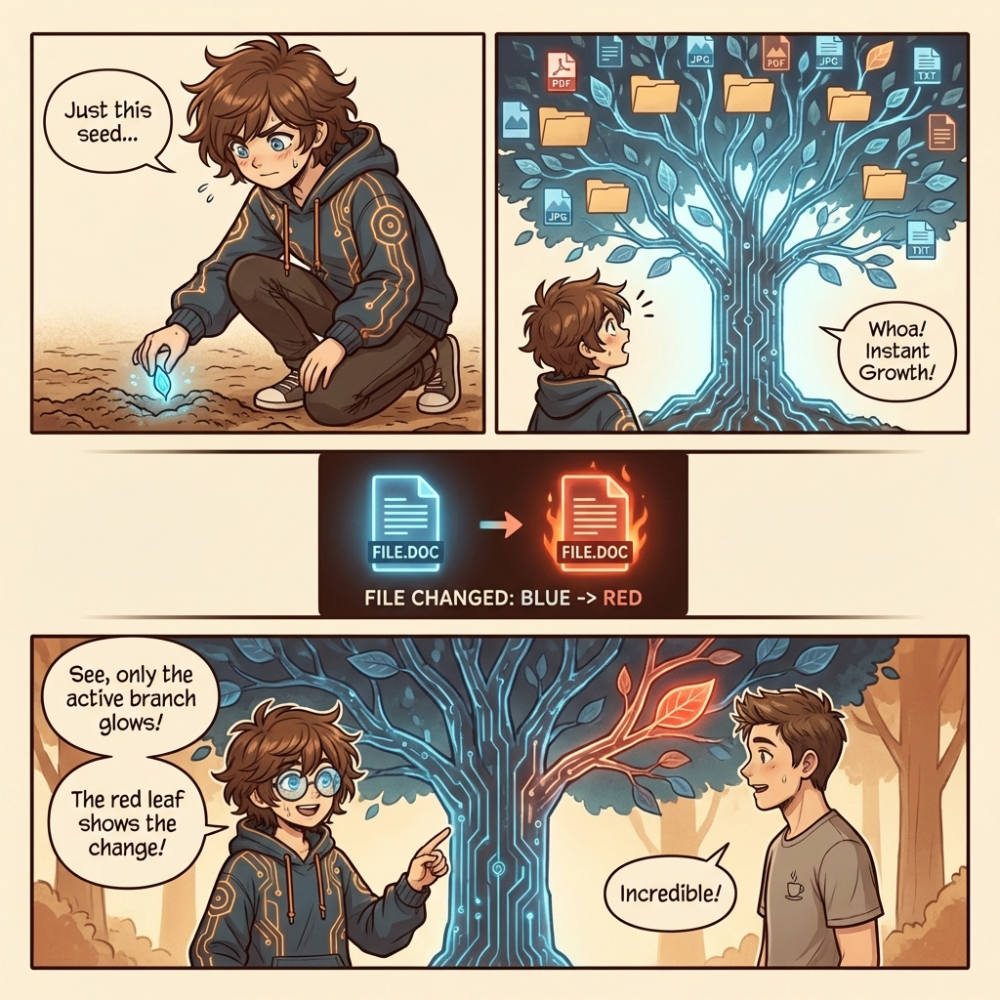

# Securely indexing large codebases

## Article Summary

Indexing large codebases efficiently and securely is a major challenge. Cursor addresses this with a multi-layered approach involving **Merkle Trees** for tracking granular file changes, **Simhashes** for finding matching indexes from teammates to reuse, and cryptographic **Content Proofs** to ensure that data is never leaked to a client that doesn't already possess the underlying files. This combination reduces indexing time from hours to seconds for new users while maintaining strict security boundaries.

## Visual Story

### Cover

A split-screen composition contrasting the overwhelming task of manual indexing (The Mountain of Code) with the streamlined, glowing efficiency of Cursor's automated system (The Merkle Tree).

### Page 1: The Mountain of Code

Our developer protagonist, Dev, is overwhelmed by the sheer volume of code in a new project. Dr. Index appears to introduce a better way, revealing the core concept: the Merkle Tree.

### Page 2: The Merkle Tree

Dr. Index demonstrates how the Merkle Tree works. Instead of re-scanning everything, the system tracks cryptographic hashes. When a single file changes (the red leaf), only that branch needs updating, making syncs incredibly fast.

### Page 3: The Shortcut (Simhash)

Dev worries about the initial download time. Dr. Index introduces "Simhash", a digital fingerprint that finds an existing index from a teammate to reuse, saving massive amounts of time.

### Page 4: Content Proofs

Addressing security concerns, Dr. Index shows how "Content Proofs" act as keys. The server only releases index data if the client can prove it already has the corresponding file content, preventing leaks.

### Page 5: Fast & Secure

The result: Instant onboarding. Dev is coding happily with full intelligence support in seconds, celebrating the victory of speed and security with Dr. Index.

---

*Generated by Michi Manga*
