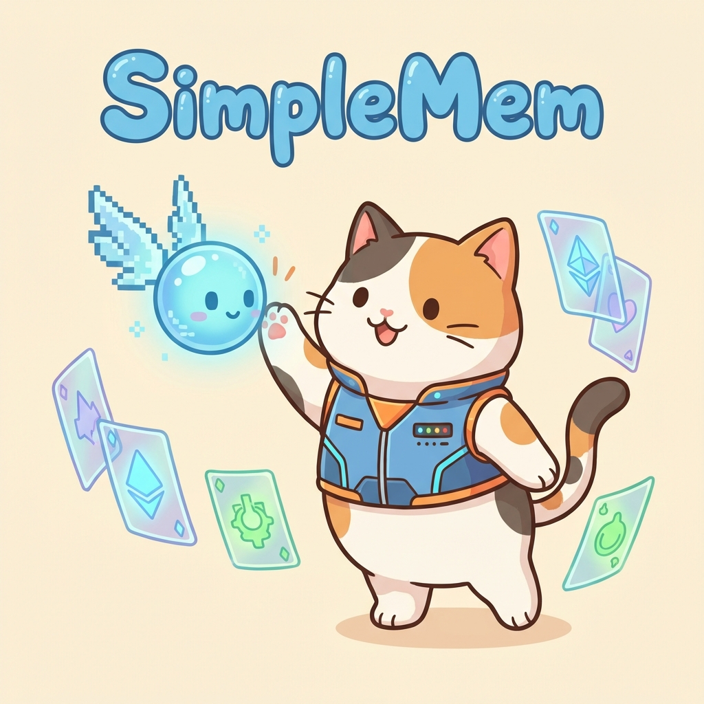
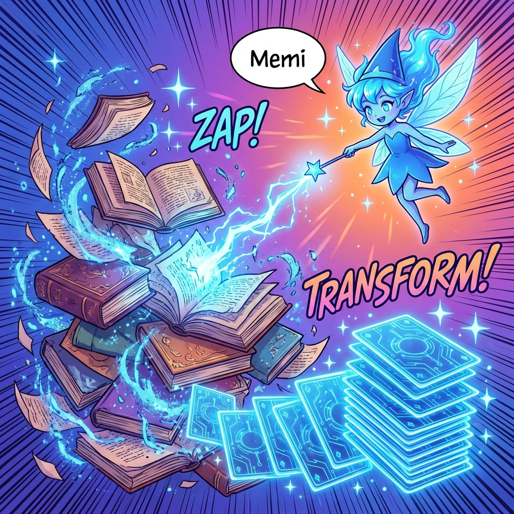

# SimpleMem: Efficient Lifelong Memory for LLM Agents

> **Source**: [arXiv:2601.02553](https://arxiv.org/abs/2601.02553)  
> **Code**: [github.com/aiming-lab/SimpleMem](https://github.com/aiming-lab/SimpleMem)

---

## Abstract

LLM agents require memory systems that efficiently manage historical experiences for reliable long-term interaction. Existing approaches suffer from two problems:
1. **Passive Context Extension**: Retaining full interaction histories leads to substantial redundancy.
2. **Iterative Reasoning Filtering**: Relying on repeated inference to filter noise incurs high token costs.

**SimpleMem** introduces an efficient memory framework based on **Semantic Lossless Compression** with a three-stage pipeline that achieves:
- **26.4% F1 improvement** over baselines
- **30x reduction** in inference-time token consumption

---

## Page 0: Cover

---

## Page 1: The Problem — Context Overload

### Key Insight
> *"During long-horizon interactions, user inputs and model responses accumulate substantial low-entropy noise (e.g., repetitive logs, non-task-oriented dialogue), which degrades the effective information density of the memory buffer."*

### The Challenge
LLM agents are constrained by **fixed context windows**. When engaging in long-context and multi-turn interactions, they face significant limitations:

| Approach | Problem |
|----------|---------|
| **Full-Context Extension** | Accumulates redundant information, causes "middle-context degradation" |
| **Iterative Reasoning Filters** | Reduces noise but requires repeated inference cycles, increasing latency and token usage |

Neither paradigm achieves efficient allocation of memory and computation resources.

### Paper Analysis
The paper identifies the **"Lost-in-the-Middle" effect** — reasoning performance degrades as context length increases. Traditional RAG methods are optimized for static knowledge bases and struggle with dynamic, time-sensitive episodic memory.

---

## Page 2: Stage 1 — Semantic Structured Compression

### Key Insight
> *"We apply an entropy-aware filtering mechanism that preserves information with high semantic utility while discarding redundant or low-value content."*

### How It Works

**Step 1: Sliding Window Segmentation**
- Incoming dialogue is segmented into overlapping sliding windows of fixed length.
- Each window is evaluated for information density.

**Step 2: Entropy-Aware Filtering**
- Compute an **information score** that captures:
  - Introduction of new entities (ℰ_new)
  - Semantic novelty relative to recent history
- Windows below a redundancy threshold (τ_redundant) are excluded from memory.

**Step 3: Context Normalization**
Informative windows are decomposed into **self-contained memory units** via:
- **Coreference Resolution (Φ_coref)**: Replaces "He agreed" → "Bob agreed"
- **Temporal Anchoring (Φ_time)**: Converts "next Friday" → "2025-10-24"

### Why It Matters
Without this normalization, the retriever struggles to disambiguate events. The ablation study shows removing this stage causes a **56.7% drop in Temporal F1** (58.62 → 25.40).

---

## Page 3: Stage 2 — Recursive Memory Consolidation

### Key Insight
> *"Inspired by biological consolidation, we introduce an asynchronous process that incrementally reorganizes stored memory. Related memory units are recursively integrated into higher-level abstract representations."*

### How It Works

**Multi-View Indexing**
Each memory unit is indexed through three complementary representations:
| Layer | Function | Example |
|-------|----------|---------|
| **Semantic** | Dense vector embeddings for fuzzy matching | "latte" matches "hot drink" |
| **Lexical** | Sparse representation for exact keyword/entity matches | Proper nouns not diluted |
| **Symbolic** | Structured metadata (timestamps, entity types) | Deterministic filtering |

**Affinity-Based Clustering**
- Memory units are grouped by **semantic similarity** and **temporal proximity**.
- When a cluster exceeds a threshold (τ_cluster), consolidation occurs.

**Abstraction**
- Individual records are synthesized into higher-level patterns:
  - *Before*: 20 entries of "user ordered latte at 8:00 AM"
  - *After*: 1 abstract entry: "user regularly drinks coffee in the morning"
- Original fine-grained entries are archived.

### Why It Matters
The ablation study shows disabling consolidation causes a **31.3% decrease in multi-hop reasoning performance**. Without it, the system retrieves fragmented entries that exhaust the context window.

---

## Page 4: Stage 3 — Adaptive Query-Aware Retrieval

### Key Insight
> *"Standard retrieval approaches typically fetch a fixed number of context entries, which often results in either insufficient information or token wastage."*

### How It Works

**Hybrid Scoring Function**
For a given query `q`, relevance is computed by aggregating signals from all three index layers:
- Semantic similarity (dense embeddings)
- Lexical relevance (exact keyword matches)
- Symbolic constraints (entity-based filters)

**Query Complexity Estimation**
A lightweight classifier predicts **query complexity (C_q ∈ [0,1])**:
- **Low complexity (C_q → 0)**: Simple fact lookup → Retrieve only top-k_min abstract entries
- **High complexity (C_q → 1)**: Multi-step reasoning → Expand to top-k_max with fine-grained details

### Why It Matters
The ablation study shows removing adaptive retrieval causes a **26.6% drop in open-domain tasks** and **19.4% drop in single-hop tasks**. Fixed-depth retrieval either under-retrieves or over-retrieves.

---

## Page 5: Results — Efficiency & Accuracy

### Key Results

| Metric | SimpleMem | Baseline (Mem0) | Improvement |
|--------|-----------|-----------------|-------------|
| **Avg F1 (GPT-4.1-mini)** | 43.24 | 34.20 | +26.4% |
| **Temporal Reasoning F1** | 58.62 | 48.91 | +19.8% |
| **Tokens per Query** | ~530 | ~980 | **~2x fewer** |
| **vs Full-Context** | ~530 | ~16,900 | **30x fewer** |

### Efficiency Analysis (LoCoMo-10 Dataset)
| Phase | SimpleMem | Mem0 | A-Mem |
|-------|-----------|------|-------|
| Memory Construction | 92.6s | 1350.9s (14x slower) | 5140.5s (50x slower) |
| Retrieval Latency | 388.3s | ~580s | — |
| **Total Time** | **1x** | **4x slower** | **12x slower** |

### Scaling to Smaller Models
SimpleMem enables smaller models to outperform larger ones:
- **Qwen2.5-3B + SimpleMem** (F1: 17.98) beats **Qwen2.5-3B + Mem0** (F1: 13.03)
- A 3B model with SimpleMem approaches the performance of much larger models.

---

## Key Takeaways

1. **Memory is Metabolic**: Treat memory as a continual process of compression, consolidation, and retrieval — not static storage.

2. **Entropy-Aware Filtering is Critical**: Low-entropy noise (chit-chat, confirmations) must be filtered at the source. Coreference resolution and temporal anchoring are essential for disambiguation.

3. **Consolidation Reduces Fragmentation**: Merging related memories into abstract representations prevents context window exhaustion during complex reasoning.

4. **Adaptive Retrieval Balances Cost and Accuracy**: Query complexity should dynamically modulate retrieval scope — simple queries need less context.

5. **Structured Indexing Enables Flexibility**: Combining semantic (dense), lexical (sparse), and symbolic (metadata) layers provides both fuzzy matching and precise filtering.

---

## Related Concepts

- **Complementary Learning Systems (CLS) Theory**: Biological inspiration for separating fast episodic learning from slow semantic consolidation.
- **"Lost-in-the-Middle" Effect**: Performance degradation when relevant information is buried in the middle of a long context.
- **RAG Limitations**: Traditional retrieval-augmented generation is optimized for static knowledge, not dynamic episodic memory.
