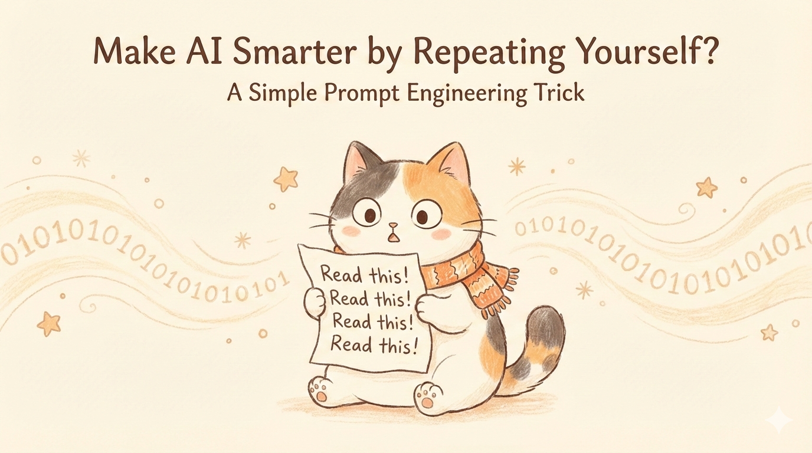
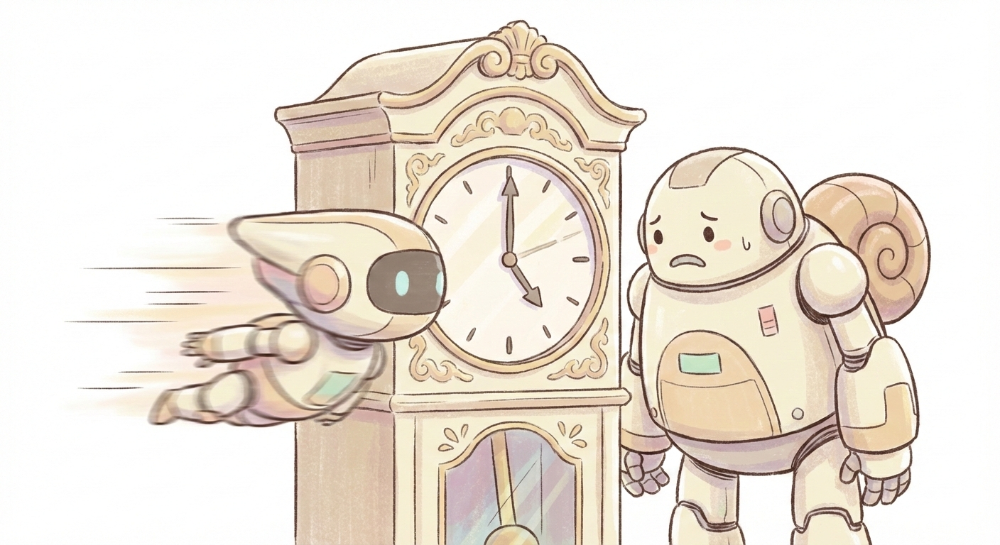
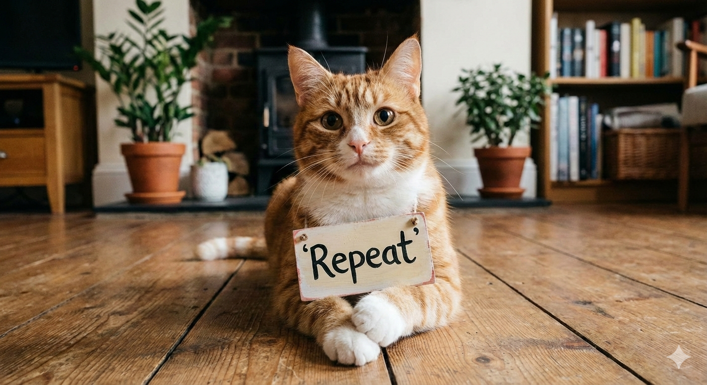
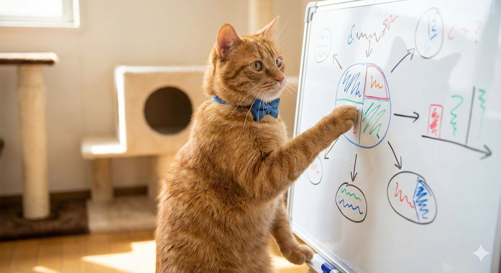
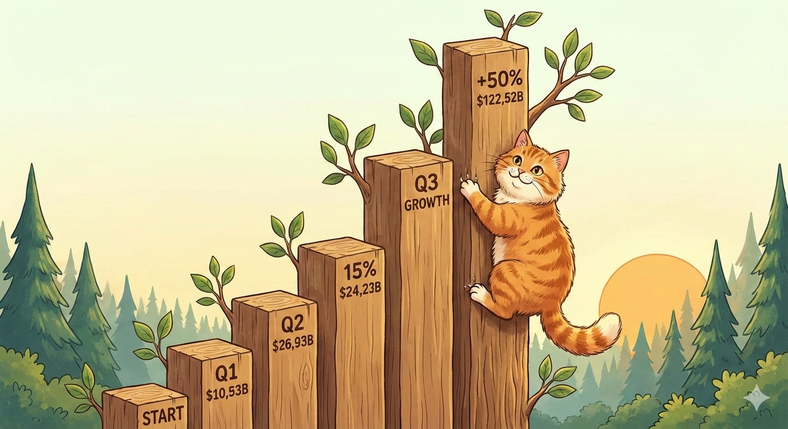
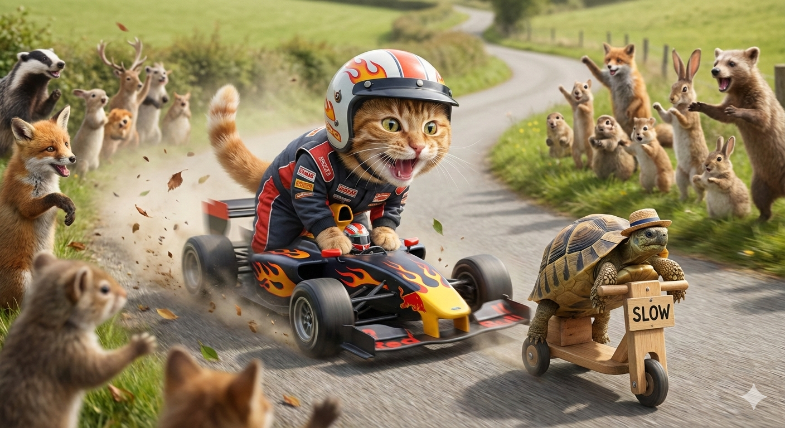
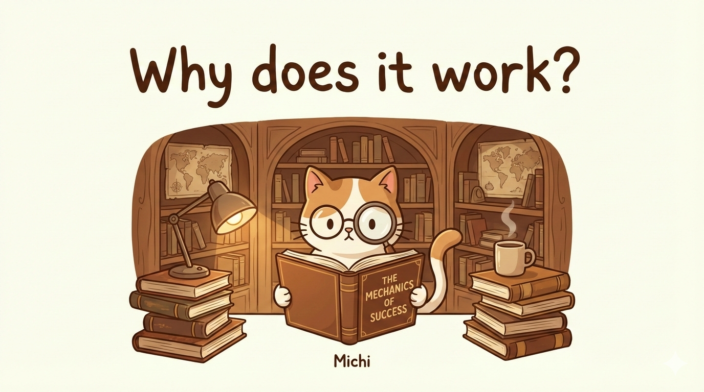

> Source: [Prompt Repetition Improves Non-Reasoning LLMs](https://arxiv.org/abs/2512.14982)

## Slide 1: Cover
**Style**: michi
**Visual**: Michi (the cat) looks confused but excited, holding a paper that says "Read this! Read this!". Background has faint binary code.
**Title**: Make AI Smarter by Repeating Yourself?
**Subtitle**: A Simple Prompt Engineering Trick

---

## Slide 2: The "Reasoning" Gap
**Style**: michi
**Visual**: A regular robot (Standard LLM) looking sad next to a big-brain robot (Reasoning Model like o1). The big-brain robot is thinking hard (clock ticking).

**Content**:
- "Reasoning" models (like o1) are smart but slow.
- Standard models (like GPT-4, Claude) are fast but sometimes miss details.
- Can we make standard models smarter *without* slowing them down?

---

## Slide 3: The Magic Trick
**Style**: michi
**Visual**: Michi holding a magic wand. The text "Prompt" appears, then duplicates into "Prompt Prompt".

**Content**:
- The answer is surprisingly simple:
- **Prompt Repetition!**
- Just repeat the user query in the input.

---

## Slide 4: How it Works
**Style**: michi
**Visual**: Diagram showing Input -> Model -> Output.
- **Normal**: "Solve this" -> Model -> ...
- **Repetition**: "Solve this. Solve this." -> Model -> !!!

**Content**:
- Instead of just asking once...
- Feed the prompt to the model twice.
- That's it. That's the whole trick.

---

## Slide 5: The Results
**Style**: michi
**Visual**: A bar chart growing taller. Michi is climbing the bar chart like a tree.

**Content**:
- Works on Gemini, GPT, Claude, and Deepseek.
- Significant improvements on math and logic tasks.
- It's like the model "pays more attention" when you say it twice.

---

## Slide 6: Fast vs. Slow
**Style**: michi
**Visual**: A race. A "Repetition" car zooms past a "Chain of Thought" car.

**Content**:
- **Reasoning Models**: Generate "thinking" tokens (Slow!)
- **Prompt Repetition**: Only adds *input* tokens.
- **Result**: No extra latency for the answer!

---

## Slide 7: Why does it work?
**Style**: michi
**Visual**: Michi looking at a book with a magnifying glass.

**Content**:
- It's like "re-reading" the question.
- Helps the model focus on key instructions.
- Overcomes the "lost in the middle" phenomenon?

---

## Slide 8: Try it out!
**Style**: michi
**Visual**: Michi winking, giving a thumbs up. Phone screen showing a chat app.

**Content**:
- Next time your AI gets stuck...
- **Say it again!**
- A simple, free boost for your prompts.

