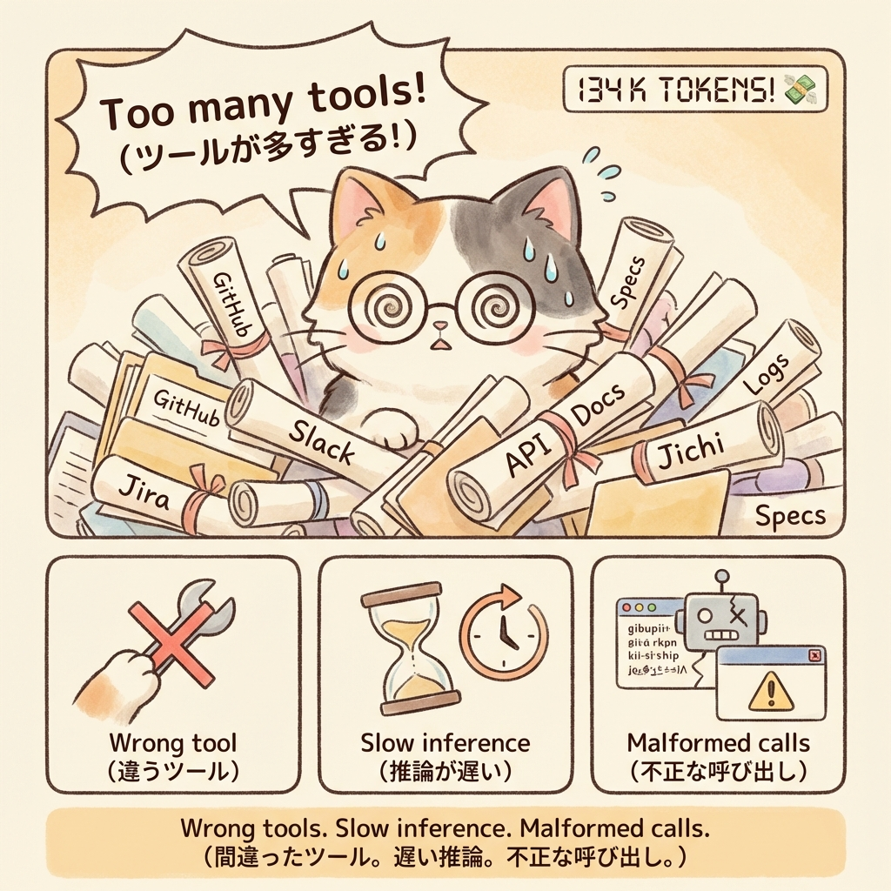
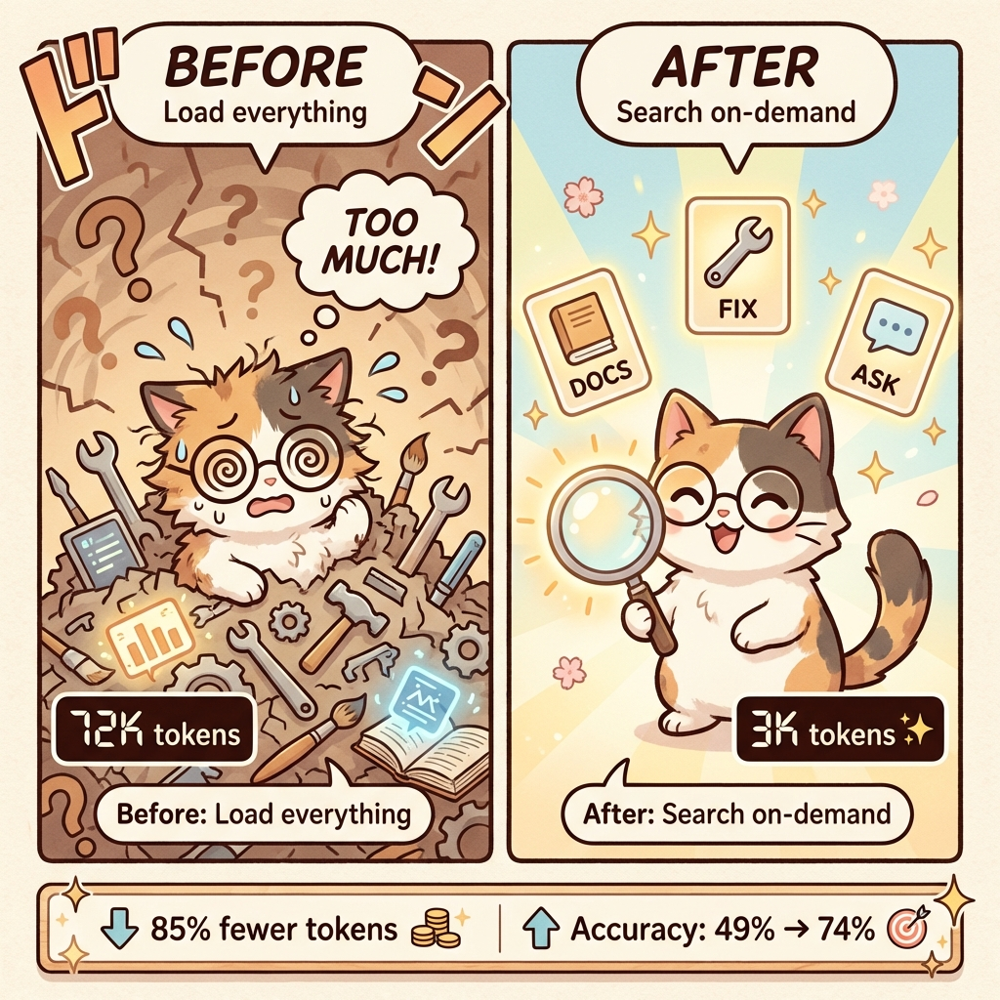
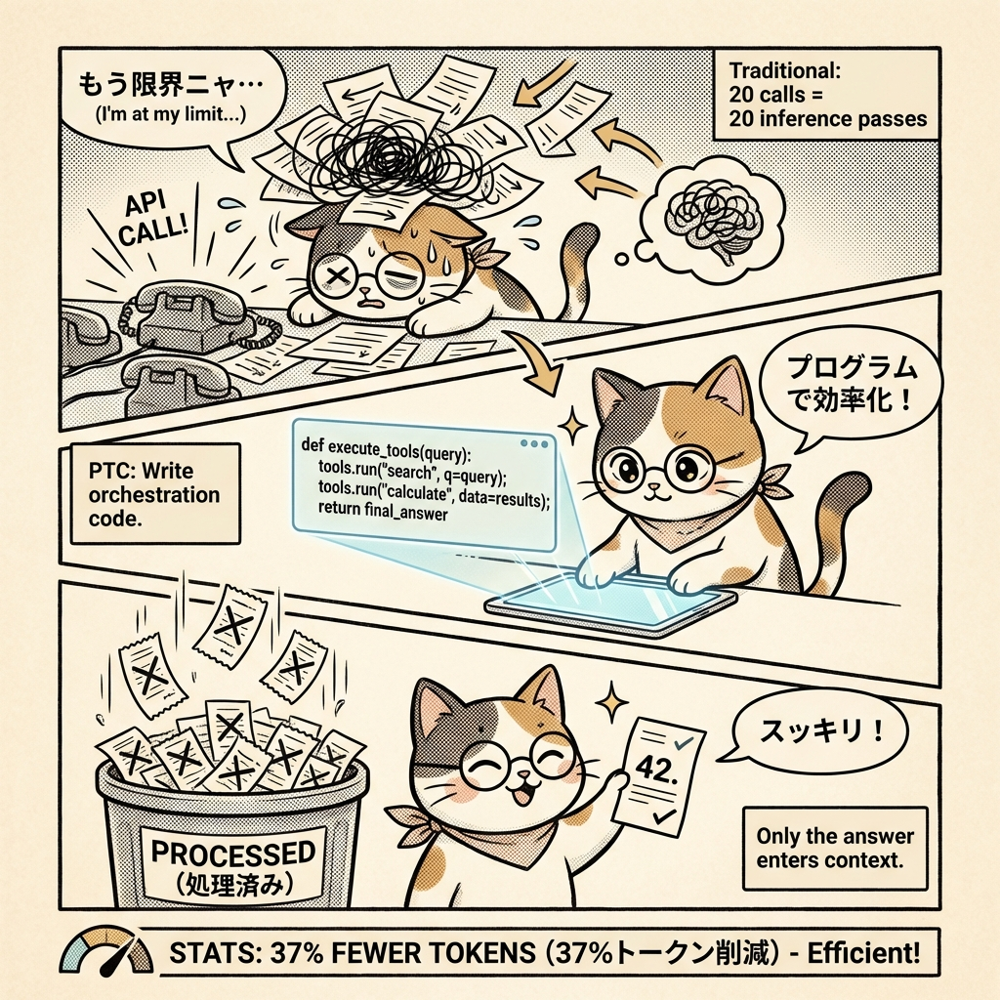

# Comic: Claude's Three Tool Superpowers

> **Source Article**: [Introducing advanced tool use on the Claude Developer Platform](https://www.anthropic.com/engineering/advanced-tool-use)  
> **Published**: November 24, 2025 | **Company**: Anthropic

---

## Page 0: Cover

**Title**: "Claude's Three Tool Superpowers"  
**Subtitle**: "Discover, Execute, Learn"

Michi the calico cat confidently juggling three glowing magical orbs representing the three new features: Tool Search (magnifying glass), Programmatic Tool Calling (code block), and Tool Use Examples (notebook with checkmarks).

---

## Page 1: The Problem

**Theme**: Context Overload

When you connect multiple MCP servers, tool definitions can consume 100K+ tokens before the conversation even starts. This leads to:
- Wrong tool selection
- Slow inference (latency)
- Malformed API calls

Michi is overwhelmed by an avalanche of 100+ tool scrolls, with a token counter showing "134K TOKENS! 💸"

---

## Page 2: Superpower #1 - Tool Search

**Theme**: On-Demand Discovery

| Before | After |
|--------|-------|
| All 72K tokens loaded upfront | Only 3K tokens loaded on-demand |
| Confused, overwhelmed | Happy, efficient |

**Key Metrics**:
- 85% fewer tokens
- Accuracy improved: 49% → 74%

Michi uses a magnifying glass to search for exactly the tools needed, instead of loading everything.

---

## Page 3: Superpower #2 - Programmatic Tool Calling

**Theme**: Code-Based Orchestration

Traditional approach: 20 API calls = 20 inference passes, all results pile into context.

With PTC: Claude writes Python orchestration code, processes data in sandbox, only final result enters context.

**Key Metrics**:
- 37% fewer tokens
- 19 fewer inference passes
- 2000 expense records → 3 names in output

Michi writes Python code on a tablet, then receives just one clean result slip while 2000 receipts go to "processed" bin.

---

## Page 4: Superpower #3 - Tool Use Examples

**Theme**: Learning by Example

JSON Schema defines WHAT is structurally valid, but can't express:
- Date format conventions
- ID patterns (USR-12345 vs UUID)
- When to include optional parameters

Tool Use Examples show HOW to use the tool correctly with 1-5 realistic examples.

**Key Metrics**:
- Accuracy improved: 72% → 90% on complex parameters

*[Image pending generation]*

---

## Page 5: Putting It Together

**Theme**: Best Practices

1. **Layer strategically** - Start with your biggest bottleneck:
   - Context bloat → Tool Search
   - Large intermediate results → PTC
   - Parameter errors → Examples

2. **Quick tips**:
   - 🔍 Keep 3-5 core tools always loaded
   - 💻 Document return formats for PTC
   - 📝 1-5 examples per tool

3. **Call to Action**: Try it at anthropic.com/engineering/advanced-tool-use

*[Image pending generation]*

---

## Character Reference

### Michi (Protagonist)
| Attribute | Description |
|-----------|-------------|
| Species | Calico cat (cream, orange, gray patches) |
| Accessory | Round glasses, blue bow/ribbon |
| Expression Arc | Overwhelmed → Curious → Triumphant |

### Visual Style: michi
- Warm cream backgrounds (#FFF8E7)
- Soft hand-drawn lines, manga aesthetic
- Speech bubbles with rounded corners
- Stats bars with clean modern design
- Studio Ghibli-inspired warmth
