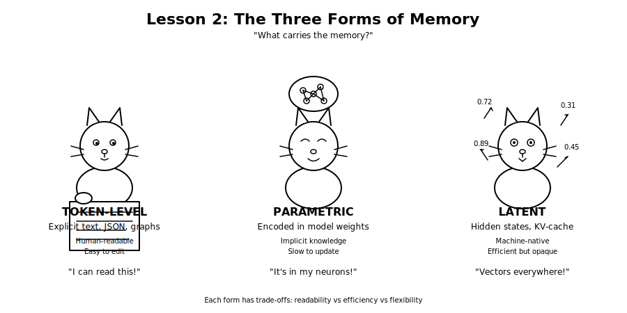
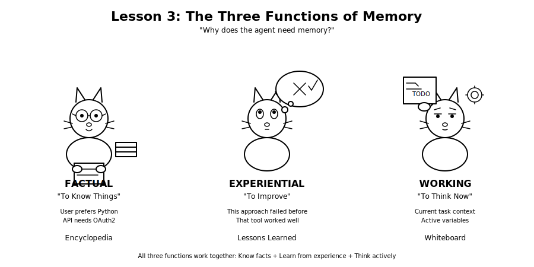
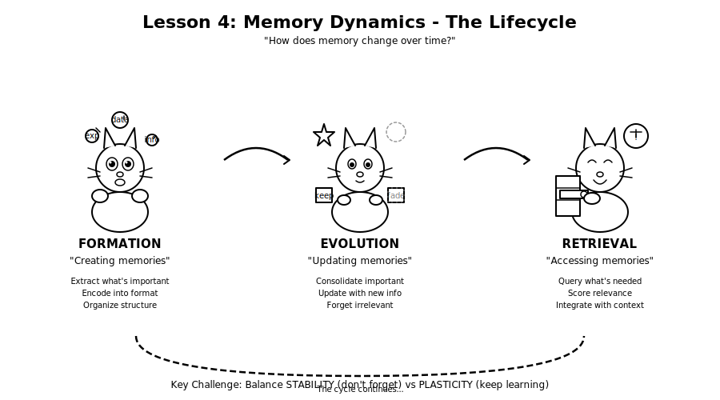
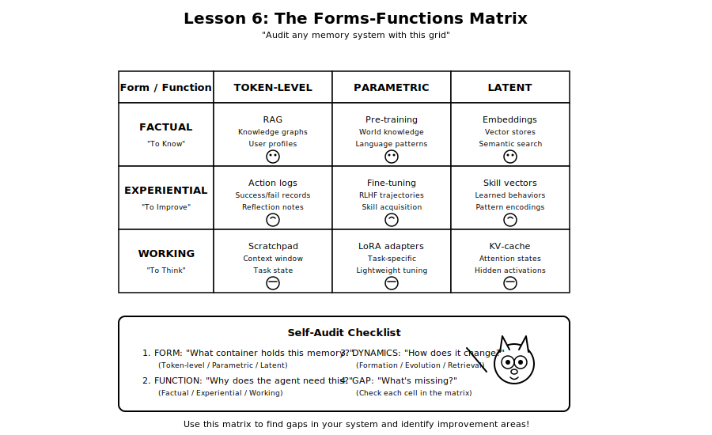
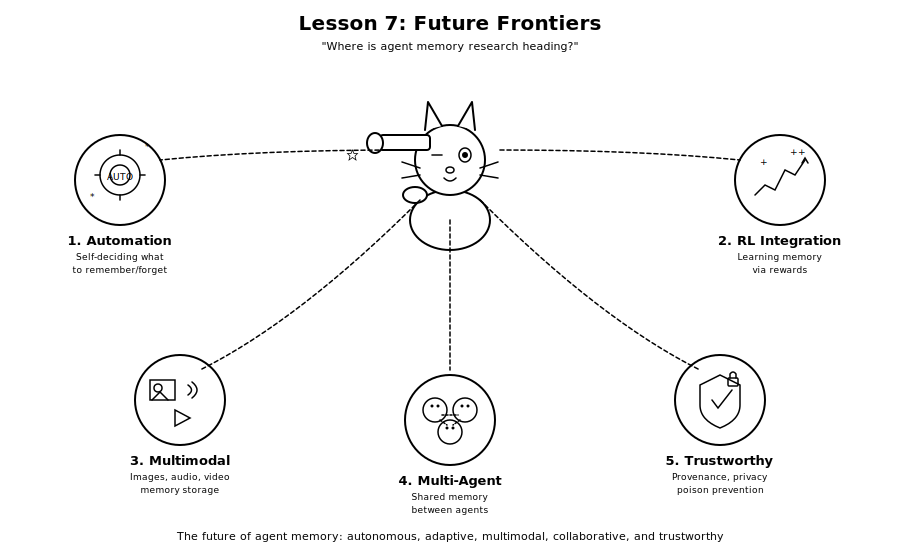

# Memory in the Age of AI Agents: A Learning Series

**Paper:** [Memory in the Age of AI Agents: A Survey](https://arxiv.org/abs/2512.13564) ([PDF](https://arxiv.org/pdf/2512.13564))
**Authors:** Yuyang Hu et al. (47 researchers from NUS, OPPO, and others)
**Published:** December 2025

---

## Table of Contents

1. [Why Memory Matters for AI Agents](#lesson-1-why-memory-matters-for-ai-agents)
2. [The Three Forms of Memory](#lesson-2-the-three-forms-of-memory)
3. [The Three Functions of Memory](#lesson-3-the-three-functions-of-memory)
4. [Memory Dynamics - The Lifecycle](#lesson-4-memory-dynamics---the-lifecycle)
5. [Practical Architecture Patterns](#lesson-5-practical-architecture-patterns)
6. [The Forms-Functions Matrix](#lesson-6-the-forms-functions-matrix)
7. [Future Frontiers](#lesson-7-future-frontiers)
8. [Key Takeaways](#key-takeaways)

---

## Series Overview

This learning series breaks down one of the most comprehensive surveys on AI agent memory into digestible lessons. Each lesson includes visual aids featuring our manga-style guide cat to help you remember key concepts.


---

## Lesson 1: Why Memory Matters for AI Agents

### The Problem

As AI agents become more capable, they face a fundamental challenge: **how to remember and learn from experience without expensive retraining**.

Traditional LLMs are "stateless" - they process each conversation fresh, forgetting everything between sessions. This is like having a brilliant assistant with amnesia.

### The Solution: Agent Memory

Agent Memory transforms static LLMs into **adaptive, evolving systems** that can:
- Remember user preferences across sessions
- Learn from past mistakes
- Build knowledge over time
- Manage complex, long-running tasks

### Key Distinction

| Concept | What It Is | Limitation |
|---------|-----------|------------|
| **RAG** | Retrieval from external database | Passive storage, no learning |
| **LLM Memory** | Context window contents | Ephemeral, resets each session |
| **Agent Memory** | Dynamic system with persistence, evolution, cross-trial adaptation | Complex to implement |


---

## Lesson 2: The Three Forms of Memory

Memory needs a **container**. The paper identifies three forms that carry memory in AI agents:

### Form 1: Token-Level Memory

**What:** Explicit, discrete data stored as text, JSON, or graphs
**Where:** Context window, external databases, knowledge graphs

```
Example: "User prefers Python over JavaScript"
         "Last meeting was on Tuesday at 3pm"
```

**Characteristics:**
- Transparent and human-readable
- Easy to edit and update
- Symbolic and interpretable
- Limited by context window size

**Best For:** Personalization, chatbots, high-stakes domains (legal, medical)

### Form 2: Parametric Memory

**What:** Knowledge encoded directly into model weights through training/fine-tuning
**Where:** Inside the neural network itself

**Characteristics:**
- Implicit and compressed
- Highly generalizable
- Slow and expensive to update
- Cannot be easily inspected

**Best For:** Role-playing, reasoning-intensive tasks, permanent skill acquisition

### Form 3: Latent Memory

**What:** Continuous vector representations or hidden states (KV-cache, embeddings)
**Where:** Model's internal activations

**Characteristics:**
- Machine-native format
- Highly efficient for retrieval
- Not human-readable
- Good middle ground between token and parametric

**Best For:** Multimodal tasks, on-device deployment, privacy-sensitive apps



---

## Lesson 3: The Three Functions of Memory

Memory needs a **purpose**. The paper defines three functional categories:

### Function 1: Factual Memory - "To Know Things"

**Purpose:** Store declarative knowledge about the world and user

```
Examples:
- "The user's name is Alice"
- "The latest stable Python version is 3.13"
- "This API requires OAuth2 authentication"
```

**Analogy:** An encyclopedia or database of facts

### Function 2: Experiential Memory - "To Improve"

**Purpose:** Learn from past successes and failures

```
Examples:
- "Last time I used approach X, it failed because of Y"
- "This type of bug usually comes from Z"
- "The user prefers detailed explanations"
```

**Analogy:** A journal of lessons learned

### Function 3: Working Memory - "To Think Now"

**Purpose:** Temporary scratchpad for active reasoning during a task

```
Examples:
- Current task context and goals
- Intermediate calculation results
- Active variables and state
```

**Analogy:** A whiteboard for current problem-solving



---

## Lesson 4: Memory Dynamics - The Lifecycle

Memory isn't static. It follows a lifecycle of **Formation → Evolution → Retrieval**:

### Stage 1: Formation (Writing)

How memories are created and extracted from experience:
- **Extraction:** Identifying what's worth remembering
- **Encoding:** Converting experience into storable format
- **Organization:** Structuring memories (flat logs, graphs, hierarchies)

### Stage 2: Evolution (Updating)

How memories change over time - the "Stability-Plasticity Dilemma":

| Process | Description |
|---------|-------------|
| **Consolidation** | Strengthening important memories |
| **Updating** | Modifying memories with new information |
| **Forgetting** | Removing outdated or irrelevant memories |

**Key Challenge:** Balance between:
- **Stability:** Not forgetting important things (catastrophic forgetting)
- **Plasticity:** Ability to learn new things and update beliefs

### Stage 3: Retrieval (Reading)

How memories are accessed when needed:
- **Query formulation:** What to search for
- **Relevance scoring:** Which memories matter most
- **Context integration:** Blending retrieved memories with current task



---

## Lesson 5: Practical Architecture Patterns

### Pattern 1: Simple RAG (Token-Level + Factual)

```
┌─────────────┐     ┌─────────────┐     ┌─────────────┐
│   Query     │────▶│  Retriever  │────▶│     LLM     │
└─────────────┘     └─────────────┘     └─────────────┘
                           │
                    ┌──────▼──────┐
                    │  Vector DB  │
                    │  (Facts)    │
                    └─────────────┘
```

**Use Case:** Knowledge-based Q&A, customer support

### Pattern 2: Reflective Agent (+ Experiential)

```
┌─────────────┐     ┌─────────────┐     ┌─────────────┐
│   Task      │────▶│    Agent    │────▶│   Action    │
└─────────────┘     └─────────────┘     └─────────────┘
                           │                   │
                    ┌──────▼──────┐     ┌──────▼──────┐
                    │  Fact DB    │     │  Success?   │
                    └─────────────┘     └──────┬──────┘
                                               │
                                        ┌──────▼──────┐
                                        │ Experience  │
                                        │    Log      │
                                        └─────────────┘
```

**Use Case:** Coding agents, autonomous assistants

### Pattern 3: MemGPT-Style (+ Working Memory Management)

```
┌───────────────────────────────────────────────────┐
│                  Virtual Context                   │
├─────────────────┬─────────────────┬───────────────┤
│  Working Memory │  Retrieved Facts │  Recent Exp.  │
│   (Active)      │   (On-demand)    │  (Relevant)   │
└────────┬────────┴────────┬────────┴───────┬───────┘
         │                 │                │
         ▼                 ▼                ▼
┌─────────────────────────────────────────────────────┐
│              Hierarchical Memory Store              │
│  ┌─────────┐  ┌─────────┐  ┌─────────┐             │
│  │ Archive │  │ Facts   │  │ Skills  │             │
│  │ (Cold)  │  │ (Warm)  │  │ (Hot)   │             │
│  └─────────┘  └─────────┘  └─────────┘             │
└─────────────────────────────────────────────────────┘
```

**Use Case:** Long-horizon tasks, life simulation agents


---

## Lesson 6: The Forms-Functions Matrix

Use this matrix to audit any agent memory system:

|  | Token-Level | Parametric | Latent |
|--|-------------|------------|--------|
| **Factual** | RAG, Knowledge graphs | Pre-training knowledge | Embedding vectors |
| **Experiential** | Success/failure logs | Fine-tuning on trajectories | Skill embeddings |
| **Working** | Scratchpad, context | LoRA adapters | KV-cache |

### Self-Audit Questions

When designing or evaluating an agent memory system, ask:

1. **Form:** "What container holds this memory?" (Token/Parametric/Latent)
2. **Function:** "Why does the agent need this?" (Fact/Experience/Working)
3. **Dynamics:** "How does it change over time?" (Formation/Evolution/Retrieval)



---

## Lesson 7: Future Frontiers

The paper identifies emerging research directions:

### 1. Memory Automation
- Automatically deciding what to remember vs. forget
- Self-organizing memory systems

### 2. Reinforcement Learning Integration
- Learning memory strategies through reward signals
- Optimizing retrieval policies

### 3. Multimodal Memory
- Storing and retrieving images, audio, video
- Cross-modal memory associations

### 4. Multi-Agent Memory
- Shared memory between cooperating agents
- Memory synchronization protocols

### 5. Trustworthiness
- Memory provenance and attribution
- Preventing memory poisoning attacks
- Privacy-preserving memory systems



---

## Key Takeaways

### The Mental Model Shift

**Before:** Memory = "Storage bin" (passive)
**After:** Memory = "Digestive system" (active)

Stop asking: "How do I save this?"
Start asking: "How does the agent metabolize this experience into wisdom?"

### The Framework

```
         ┌─────────────────────────────────────┐
         │     FORMS (What carries it?)        │
         │   Token │ Parametric │ Latent       │
         └─────────────────────────────────────┘
                          │
         ┌────────────────┼────────────────┐
         │                │                │
         ▼                ▼                ▼
    ┌─────────┐    ┌───────────┐    ┌─────────┐
    │ FACTUAL │    │EXPERIENTIAL│   │ WORKING │
    │ To Know │    │ To Improve │   │To Think │
    └─────────┘    └───────────┘    └─────────┘
              FUNCTIONS (Why is it needed?)
                          │
         ┌────────────────┼────────────────┐
         │                │                │
         ▼                ▼                ▼
    ┌─────────┐    ┌───────────┐    ┌─────────┐
    │FORMATION│    │ EVOLUTION │    │RETRIEVAL│
    │ Create  │    │  Update   │    │ Access  │
    └─────────┘    └───────────┘    └─────────┘
              DYNAMICS (How does it change?)
```

### One-Liner Summary

> Agent memory is a dynamic cognitive primitive with **three forms** (token/parametric/latent), **three functions** (factual/experiential/working), and **three lifecycle stages** (formation/evolution/retrieval).

---

## Resources

- **Paper:** [arXiv:2512.13564](https://arxiv.org/abs/2512.13564) - The full survey with 200+ references
- **Paper List:** [Agent-Memory-Paper-List](https://github.com/Shichun-Liu/Agent-Memory-Paper-List) - Curated collection of agent memory research papers
- **Related Systems:**
  - **MemGPT** - OS-inspired memory management for LLMs with virtual context
  - **Generative Agents** - Stanford's "Smallville" simulation with memory streams
  - **TiM (Think-in-Memory)** - Episodic memory for multi-turn reasoning

---

*Learning series created: January 2026*
