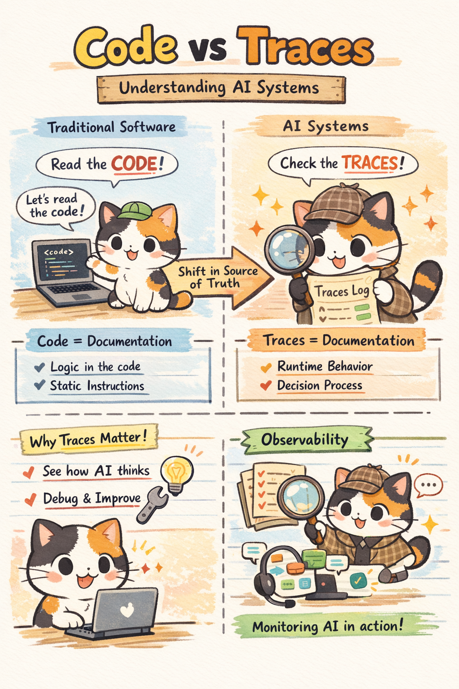
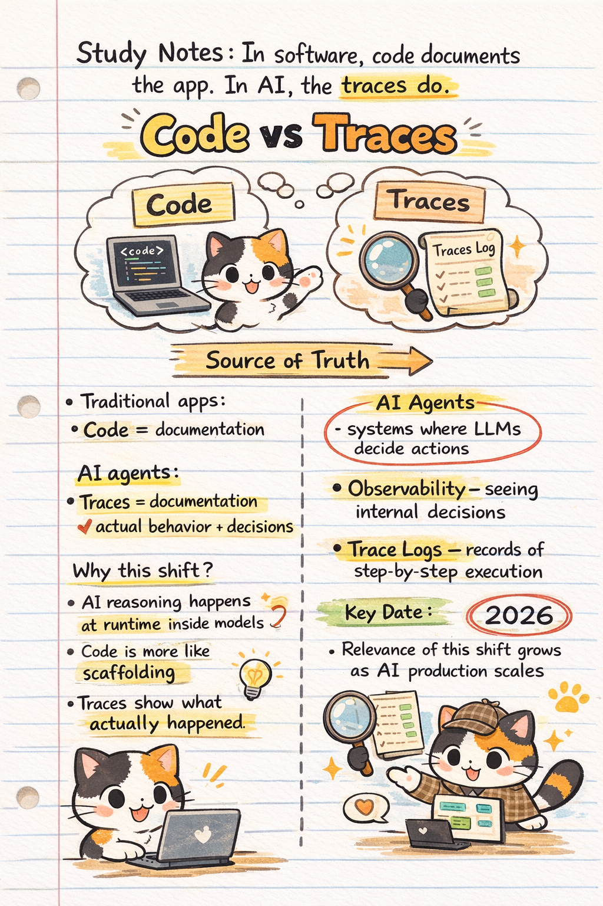

## 📌 Summary of the Post
Langchain CEO Harrison Chase Post on [In software, the code documents the app. In AI, the traces do.](https://x.com/hwchase17/status/2010044779225329688)
 

The core idea of this post is a fundamental shift in how we understand and reason about software systems:

- In **traditional software development**, understanding a system means reading the **source code**. The logic, control flow, and behavior are explicitly defined in files and functions.
- In **modern AI-powered systems**, especially **AI agents** (LLMs combined with tools, memory, and reasoning), behavior is no longer fully encoded in static code.
- Instead, the system’s true logic emerges **at runtime**, through prompts, model reasoning, tool calls, intermediate states, and outputs.
- As a result, **execution traces** — records of what actually happened during a run — become the **true documentation** of system behavior and decision-making.

---

## 🔍 Key Takeaways

### ✔️ Shift in the Source of Truth
- **Traditional applications:**  
  → *Code documents behavior*
- **AI systems:**  
  → *Traces document behavior and reasoning*

### ✔️ Why This Matters
- AI decisions are made **inside models at runtime**, not fully determined by scaffold code.
- Without traces, it is impossible to reliably answer *why* an AI agent took a specific action.
- For debugging, auditing, monitoring, and improvement, **traces replace static code** as the most trustworthy evidence of system logic.

### ✔️ Implications for AI Engineering
- **Observability and trace storage** become foundational infrastructure, not optional tooling.
- Developers must design systems to **capture, store, and visualize traces** of agent behavior.
- Testing and optimization must evolve from **code-level validation** to **trace-level analysis** of real executions.

---

## 🧠 Commentary: Why This Insight Is Important

Harrison Chase’s post highlights a quiet but profound transition in software engineering:

> **In traditional software, the code documents the app.  
> In AI systems, especially agents, the traces do.**

As AI agents increasingly rely on LLM reasoning, the “logic” of the system no longer lives entirely in source code. Code increasingly acts as **scaffolding** — a framework that enables behavior — while the actual decisions emerge dynamically at runtime.

This reframes how we should **build, debug, and trust** AI systems:

- Code alone is insufficient to explain behavior
- Tracing and observability become **first-class engineering concerns**
- Understanding “what the AI did” and “why it did it” requires examining **what actually happened**, not what was intended in code

This is why tooling for **tracing, agent logs, replay, and behavior inspection** (e.g., LangSmith-style systems) is **foundational**, not optional, for production AI.

**In short:**  
➡️ **AI engineering is shifting from _reading code_ to _reading behavior_.**

