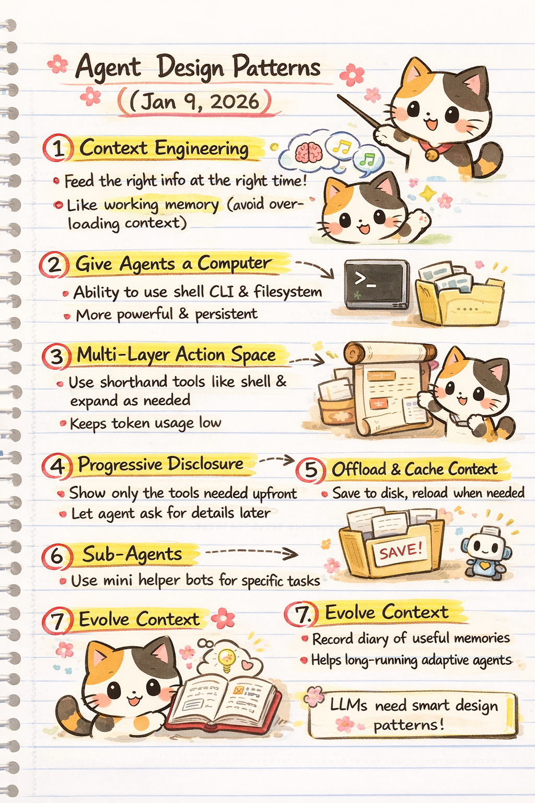

# Agent Design Patterns — Summary & Study Notes

**Source:** Lance Martin  
**Post:** *Agent design patterns*  
**Date:** Jan 9, 2026  
**URL:** https://rlancemartin.github.io/2026/01/09/agent_design/

---

## 1. Core Idea

Modern AI agents are limited less by model capability and more by **how context, tools, and actions are structured**.

The post argues that **agent design patterns**—especially around context management and tool usage—are now the primary lever for building effective, scalable agentic systems.

---

## 2. Key Design Patterns

### 2.1 Context Engineering (First-Class Concern)

- LLMs degrade when overloaded with context
- Agents need *the right information at the right time*
- Context should behave like **working memory**, not long-term storage

**Key Insight:**  
> More context ≠ better performance

---

### 2.2 Give Agents a Computer

- Agents become far more capable when they can:
  - Run shell commands
  - Execute code
  - Read/write files
- This provides:
  - Persistent state
  - External memory
  - Tool composability

**Examples mentioned:**
- Claude Code
- Manus-style systems
- OS / filesystem-backed agents

---

### 2.3 Multi-Layer Action Space

- Do **not** dump every tool into the prompt
- Use **hierarchical or shorthand actions**
  - e.g., shell commands instead of dozens of APIs
- Expand details only when needed

**Result:**  
- Lower token usage
- Higher reasoning accuracy

---

### 2.4 Progressive Disclosure of Tools

- Initially expose:
  - Minimal tool descriptions
- Allow agents to:
  - Request more details on demand

**Benefits:**
- Reduces distraction
- Improves decision quality
- Keeps prompts compact

---

### 2.5 Offload and Cache Context

- Move large or stable information out of the prompt
- Store in:
  - Files
  - Databases
  - Cached artifacts
- Reload only when needed

**Pattern:**  
Prompt = *pointer*, not *storage*

---

### 2.6 Sub-Agents with Isolated Context

- Spawn sub-agents for:
  - Parallel tasks
  - Specialized reasoning
- Each sub-agent gets:
  - A clean, isolated context window

**Advantages:**
- Reduced interference
- Better modularity
- Easier debugging

---

### 2.7 Evolving Context Over Time

- Agents can maintain:
  - Memory logs
  - Diary entries
  - Summarized experience snapshots
- Enables:
  - Long-running agents
  - Learning from prior executions

**Direction:**  
Toward adaptive, stateful agents

---

## 3. High-Level Takeaways

- Agent performance is now dominated by **architecture**, not prompting tricks
- Context is a scarce resource and must be engineered deliberately
- Tools and memory should live *outside* the LLM whenever possible
- Effective agents resemble:
  - Operating systems
  - Not chatbots

---

## 4. Mental Model

> **LLM = Reasoning Core**  
> **Context = Working Memory**  
> **Filesystem / Tools = Long-Term Memory & Actuators**

---

## 5. Why This Matters

These patterns explain why systems like Claude Code and Manus feel dramatically more capable than vanilla chat agents.

The future of agent design is:
- Context-aware
- Tool-native
- Memory-augmented
- Modular by default

---

