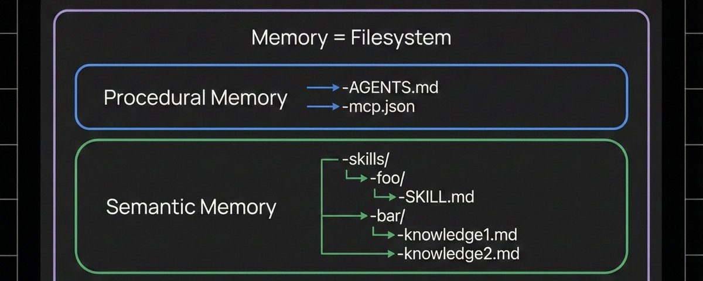
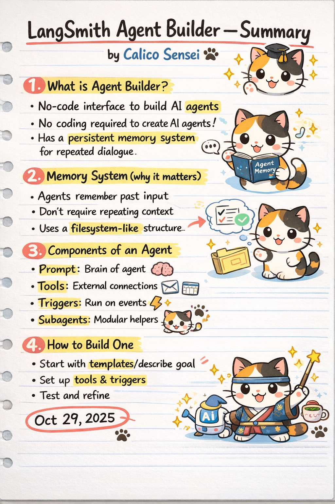

# LangSmith Agent Builder — Summary
**Source:** **Harrison Chase**   
**Post:** **How we built Agent Builder’s memory system**  
**Date:** Jan 15, 2026  
**URL:** [How we built Agent Builder’s memory system](https://x.com/hwchase17/status/2011814697889316930?s=42)

---

---

## 1. What is Agent Builder?

- A **no-code interface** to build AI agents  
- No programming required to create agents  
- Designed for both developers and non-developers  
- Supports **persistent memory** for repeated, long-running dialogue  

---

## 2. Memory System (Why It Matters)

- Agents **remember past inputs and interactions**
- Users do **not need to repeat context**
- Enables long-running, stateful agents
- Uses a **filesystem-like structure** for memory
- Memory persists across sessions

---

## 3. Components of an Agent

### Prompt
- Defines the agent’s role and behavior  
- Acts as the “brain” of the agent  

### Tools
- External integrations (email, calendar, APIs, etc.)
- Allow agents to take real-world actions  

### Triggers
- Automatically run agents based on events
- Can be time-based or event-driven  

### Subagents
- Modular helper agents
- Each subagent specializes in a specific task  

---

## 4. How to Build an Agent

1. Start with a **template** or describe the goal in natural language  
2. Configure **tools and triggers**  
3. Test the agent’s behavior  
4. Refine prompts, tools, and logic iteratively  

---

## Key Takeaways

- No-code agent building lowers the barrier to entry
- **Memory is a first-class feature** - Memory is implemented using a filesystem-like structure (built on Postgres behind the scenes) so agents can store and recall state. 
- Agents can operate beyond chat via triggers
- Modular design improves scalability
- Represents a shift toward **practical, production-ready AI agents**

---

## Important Date

- **October 29, 2025** — Agent Builder announcement / preview launch

---

