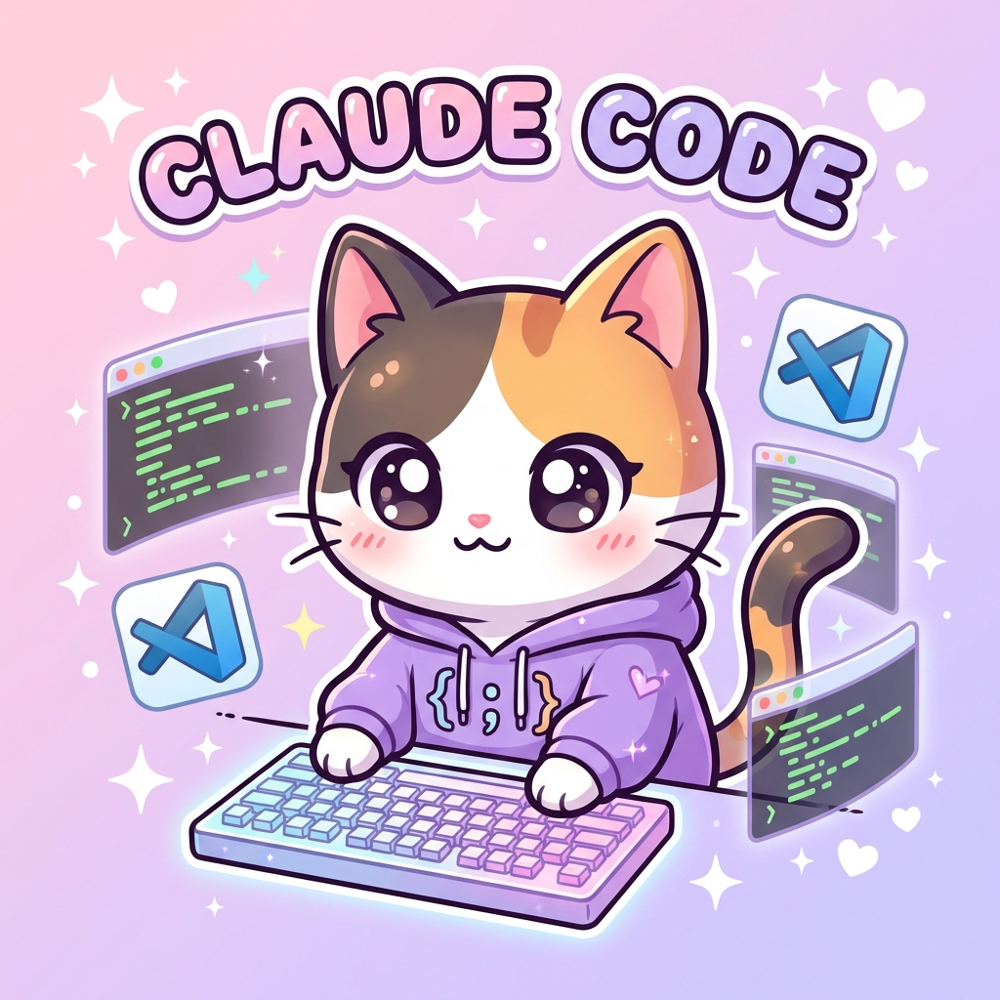
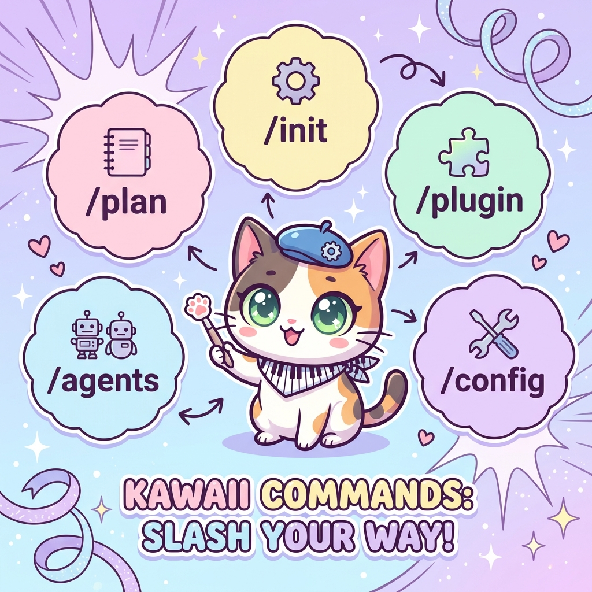
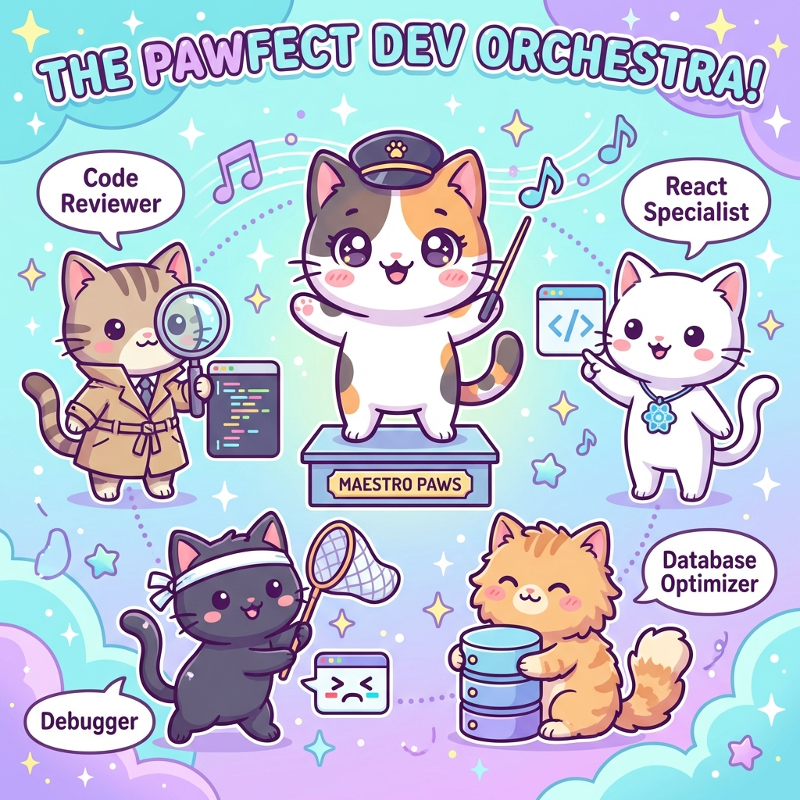
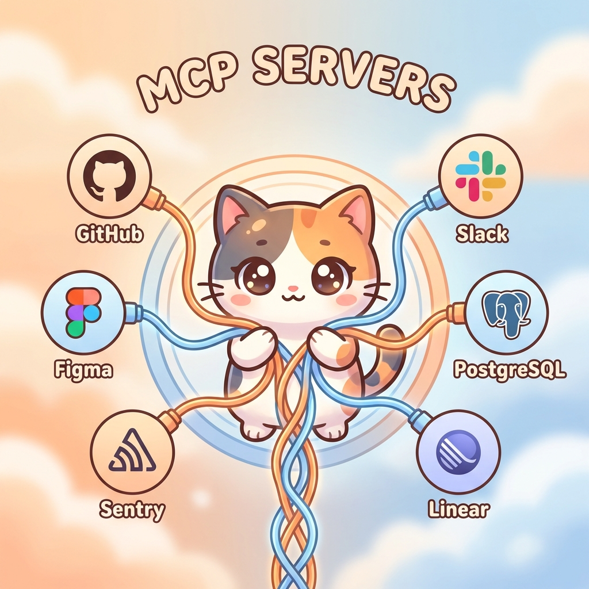
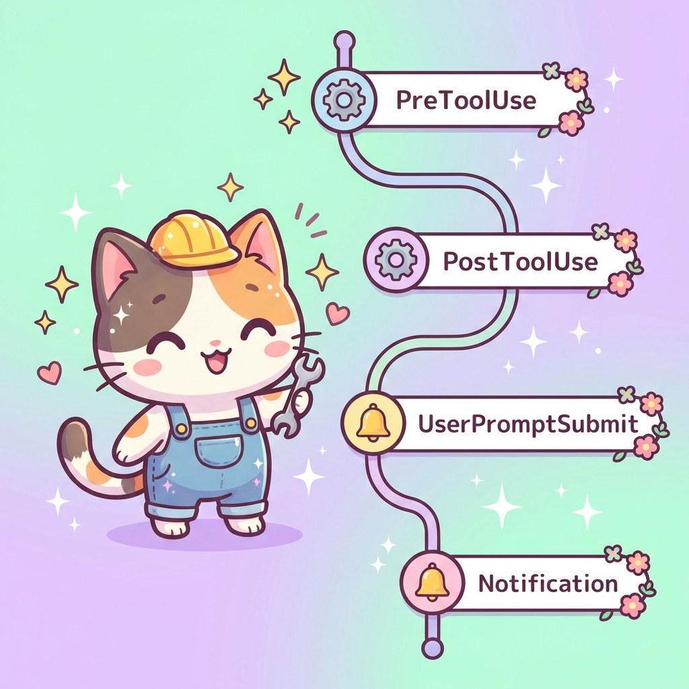
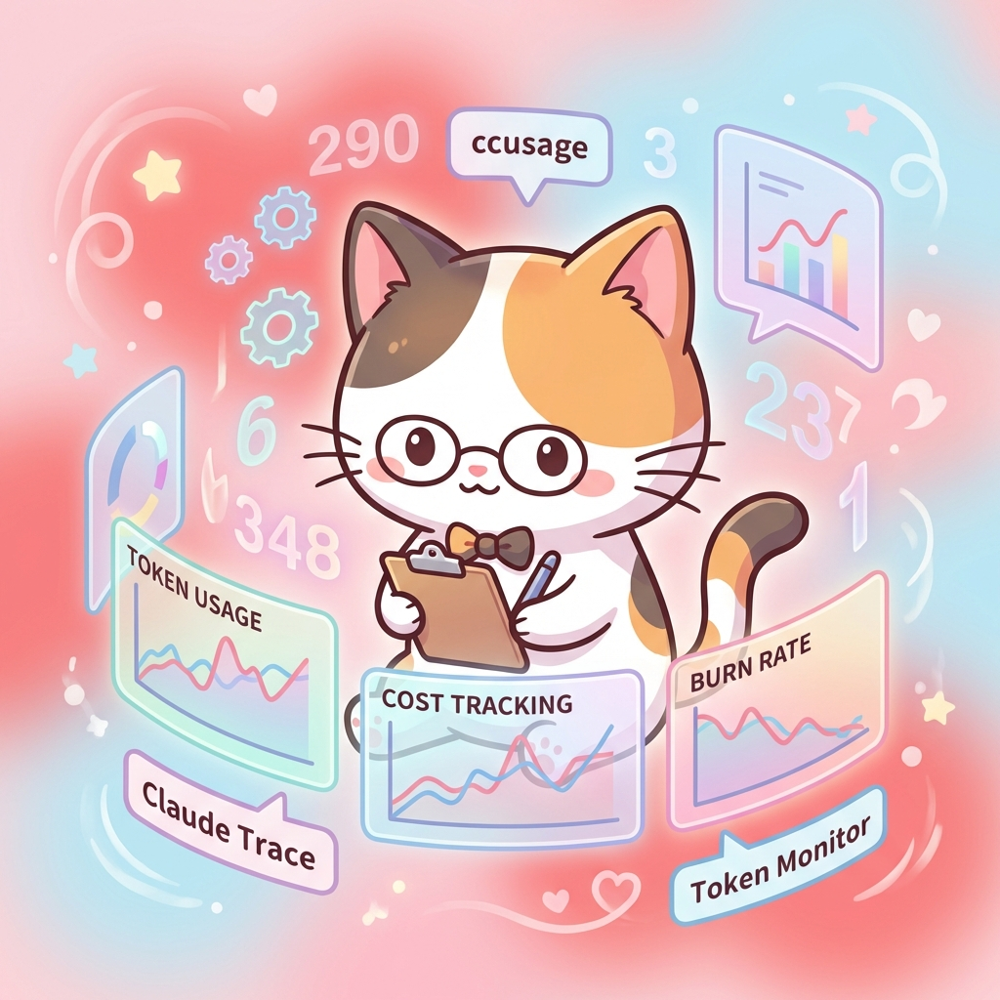
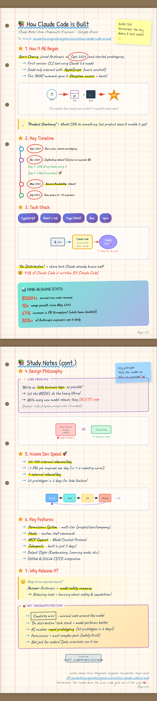

# 🚀 Claude Code Ultimate Resource Collection

> **The definitive guide to Claude Code skills, plugins, subagents, commands, and best practices for 2025**

*Last Updated: January 2026*

---

## 📑 Table of Contents

1. [Overview](#overview)
2. [Slash Commands](#-slash-commands)
3. [Subagents](#-subagents)
4. [MCP Servers & Integrations](#-mcp-servers--integrations)
5. [Plugins & Marketplace](#-plugins--marketplace)
6. [Hooks & Lifecycle Events](#-hooks--lifecycle-events)
7. [CLAUDE.md Configuration](#-claudemd-configuration)
8. [Monitoring & Usage Tools](#-monitoring--usage-tools)
9. [GitHub Resources & Awesome Lists](#-github-resources--awesome-lists)
10. [Best Practices & Pro Tips](#-best-practices--pro-tips)
11. [IDE Extensions](#-ide-extensions)

---

## Overview

Claude Code is Anthropic's agentic AI coding assistant that operates directly in your terminal and IDE. It understands project structures, navigates codebases, executes multi-step tasks, and integrates with external tools through the Model Context Protocol (MCP). This resource collection curates the best skills, plugins, and practices for maximizing productivity with Claude Code.

---

## 💻 Slash Commands

Slash commands are shortcuts for executing predefined tasks directly from the Claude Code interface.

### 1. `/plan` - Plan Mode

| **Source** | [Anthropic Docs](https://docs.anthropic.com/en/docs/claude-code/slash-commands) |
|------------|----------------------------------------------------------------------------------|
| **Description** | Enters structured planning mode for complex problem-solving. Claude analyzes requirements, explores solutions, and formulates a detailed implementation plan before writing any code. |
| **Why Important** | Prevents costly mistakes by thinking before coding. Results in better architecture decisions and fewer rewrites. |
| **Recommendation** | ⭐⭐⭐⭐⭐ |

---

### 2. `/init` - Project Initialization

| **Source** | [Anthropic Docs](https://docs.anthropic.com/en/docs/claude-code) |
|------------|------------------------------------------------------------------|
| **Description** | Initializes a project by creating a `CLAUDE.md` file with project-specific context, tech stack, and conventions. |
| **Why Important** | Creates the foundation for Claude to understand your project. Essential first step for any codebase. |
| **Recommendation** | ⭐⭐⭐⭐⭐ |

---

### 3. `/plugin` - Plugin Management

| **Source** | [Claude Code Plugins Docs](https://docs.anthropic.com/en/docs/claude-code/plugins) |
|------------|------------------------------------------------------------------------------------|
| **Description** | Manages Claude Code plugins - install, uninstall, and configure plugins from official and community marketplaces. |
| **Why Important** | Extends Claude's capabilities with specialized tools for your workflow. |
| **Recommendation** | ⭐⭐⭐⭐ |

---

### 4. `/agents` - Subagent Management

| **Source** | [Claude Code Agents Docs](https://docs.anthropic.com/en/docs/claude-code/agents) |
|------------|----------------------------------------------------------------------------------|
| **Description** | Manages custom AI subagents with specialized capabilities. Create, configure, and deploy domain-specific assistants. |
| **Why Important** | Enables team-of-specialists approach for complex development tasks. |
| **Recommendation** | ⭐⭐⭐⭐⭐ |

---

### 5. `/config` - Settings Configuration

| **Source** | [Anthropic Docs](https://docs.anthropic.com/en/docs/claude-code) |
|------------|------------------------------------------------------------------|
| **Description** | Opens Claude Code settings for configuration. Manage permissions, model selection, and tool behaviors. |
| **Why Important** | Fine-tune Claude's behavior to match your development style and security requirements. |
| **Recommendation** | ⭐⭐⭐⭐ |

---

### 6. `/model` - Model Selection

| **Source** | [Anthropic Docs](https://docs.anthropic.com/en/docs/claude-code) |
|------------|------------------------------------------------------------------|
| **Description** | Selects or changes the AI model (Sonnet, Opus, Haiku) for different task requirements. |
| **Why Important** | Optimize cost vs. capability - use Haiku for quick tasks, Opus for complex reasoning. |
| **Recommendation** | ⭐⭐⭐⭐ |

---

### 7. `/clear` - Context Reset

| **Source** | [Builder.io Claude Code Guide](https://www.builder.io/blog/claude-code-tips) |
|------------|------------------------------------------------------------------------------|
| **Description** | Clears conversation history to reset Claude's context. Preferred over compacting for fresh starts. |
| **Why Important** | Improves performance and prevents confusion from old conversation context. |
| **Recommendation** | ⭐⭐⭐⭐⭐ |

---

### 8. `/cost` - Token Usage

| **Source** | [Claude Code Usage Docs](https://docs.anthropic.com/en/docs/claude-code/usage) |
|------------|--------------------------------------------------------------------------------|
| **Description** | Displays detailed token usage statistics for the current session including cost breakdown. |
| **Why Important** | Essential for managing budget and optimizing prompt efficiency. |
| **Recommendation** | ⭐⭐⭐⭐ |

---

### 9. Custom Slash Commands

| **Source** | [Medium - Claude Code Custom Commands](https://medium.com/@pavanraj.kiran/claude-code-8-months-of-real-world-experience-d8e6a9c58a4c) |
|------------|--------------------------------------------------------------------------------------------------------------------------------------|
| **Description** | Create custom commands by adding Markdown files to `.claude/commands/` directory. Use `$ARGUMENTS` for dynamic inputs. |
| **Why Important** | Automate repetitive workflows - any task repeated more than twice should become a command. |
| **Recommendation** | ⭐⭐⭐⭐⭐ |

---

## 🤖 Subagents

Subagents are specialized AI assistants with their own context windows, custom prompts, and scoped tool access.

### 10. Code Reviewer Subagent

| **Source** | [Awesome Claude Code Subagents](https://github.com/VoltAgent/awesome-claude-code-subagents) |
|------------|----------------------------------------------------------------------------------------------|
| **Description** | Specialized agent for code review - identifies bugs, suggests optimizations, ensures coding standards compliance, and spots security vulnerabilities. |
| **Why Important** | Catches issues before they reach production. Acts as a tireless, consistent code reviewer. |
| **Recommendation** | ⭐⭐⭐⭐⭐ |

---

### 11. Debugger Subagent

| **Source** | [Dev.to - Claude Code Subagents](https://dev.to/devaneyj3/awesome-claude-code-subagents-1b8l) |
|------------|----------------------------------------------------------------------------------------------|
| **Description** | Expert debugging agent that eliminates bugs through systematic analysis of errors, test failures, and unexpected behaviors. |
| **Why Important** | Transforms debugging from frustrating to methodical. Uses structured detective approach. |
| **Recommendation** | ⭐⭐⭐⭐⭐ |

---

### 12. Test Automator Subagent

| **Source** | [Awesome Claude Code Subagents](https://github.com/vijaythecoder/awesome-claude-agents) |
|------------|-----------------------------------------------------------------------------------------|
| **Description** | Architects testing frameworks and writes comprehensive unit, integration, and e2e tests automatically. |
| **Why Important** | Dramatically increases test coverage without manual effort. |
| **Recommendation** | ⭐⭐⭐⭐⭐ |

---

### 13. React Specialist Subagent

| **Source** | [Dev.to - Claude Code Subagents](https://dev.to/devaneyj3/awesome-claude-code-subagents-1b8l) |
|------------|----------------------------------------------------------------------------------------------|
| **Description** | Up-to-date with React 18+ patterns, Server Components, advanced hooks, and modern state management. |
| **Why Important** | Ensures React code follows current best practices and leverages latest features. |
| **Recommendation** | ⭐⭐⭐⭐ |

---

### 14. Database Optimizer Subagent

| **Source** | [Awesome Claude Code Subagents](https://github.com/VoltAgent/awesome-claude-code-subagents) |
|------------|----------------------------------------------------------------------------------------------|
| **Description** | Query performance wizard for SQL/NoSQL operations, schema design, and database optimization. |
| **Why Important** | Prevents slow queries from degrading application performance. |
| **Recommendation** | ⭐⭐⭐⭐⭐ |

---

### 15. Security Engineer Subagent

| **Source** | [eesel.ai - Claude Code Guide](https://www.eesel.ai/blog/claude-code-subagents) |
|------------|---------------------------------------------------------------------------------|
| **Description** | Vulnerability shield that scans for security issues, enforces secure coding practices, and identifies potential attack vectors. |
| **Why Important** | Proactive security is far cheaper than reactive fixes after a breach. |
| **Recommendation** | ⭐⭐⭐⭐⭐ |

---

### 16. API Designer Subagent

| **Source** | [Dev.to - Claude Code Subagents](https://dev.to/devaneyj3/awesome-claude-code-subagents-1b8l) |
|------------|----------------------------------------------------------------------------------------------|
| **Description** | Architecting RESTful and GraphQL APIs with proper schemas, documentation, and error handling. |
| **Why Important** | Well-designed APIs are easier to maintain and consume. |
| **Recommendation** | ⭐⭐⭐⭐ |

---

## 🔌 MCP Servers & Integrations

The Model Context Protocol (MCP) is an open standard that connects Claude Code with external tools, databases, and APIs.

### 17. GitHub MCP Server

| **Source** | [Anthropic MCP Docs](https://docs.anthropic.com/en/docs/claude-code/mcp) |
|------------|-------------------------------------------------------------------------|
| **Description** | Full GitHub integration for creating issues, PRs, code reviews, investigating problems, and managing repositories. |
| **Why Important** | Eliminates context switching between Claude Code and GitHub. Enables true end-to-end development. |
| **Recommendation** | ⭐⭐⭐⭐⭐ |

---

### 18. Sentry MCP Server

| **Source** | [Sentry MCP Integration](https://docs.sentry.io/product/mcp/) |
|------------|---------------------------------------------------------------|
| **Description** | Connects directly to error monitoring. Triage and fix exceptions with full context, stack traces, and performance data. |
| **Why Important** | Error context comes directly into development chat - no dashboard switching needed. |
| **Recommendation** | ⭐⭐⭐⭐⭐ |

---

### 19. Linear MCP Server

| **Source** | [Linear MCP Integration](https://linear.app/docs/integrations/mcp) |
|------------|-------------------------------------------------------------------|
| **Description** | Direct access to project issues for managing tasks, projects, and team workflows. |
| **Why Important** | Seamless issue-to-code workflow without leaving the terminal. |
| **Recommendation** | ⭐⭐⭐⭐⭐ |

---

### 20. Figma MCP Server

| **Source** | [Figma Developers](https://www.figma.com/developers) |
|------------|-------------------------------------------------------|
| **Description** | Fetch design data, generate code from designs, and update components based on Figma changes. |
| **Why Important** | Bridges the design-development gap - implement designs accurately and quickly. |
| **Recommendation** | ⭐⭐⭐⭐ |

---

### 21. PostgreSQL MCP Server

| **Source** | [Awesome MCP Servers](https://github.com/punkpeye/awesome-mcp-servers) |
|------------|------------------------------------------------------------------------|
| **Description** | Query databases, find specific data, and manage database operations using natural language. |
| **Why Important** | Database exploration and debugging through conversation rather than complex SQL. |
| **Recommendation** | ⭐⭐⭐⭐⭐ |

---

### 22. Slack MCP Server

| **Source** | [Awesome MCP Servers](https://github.com/punkpeye/awesome-mcp-servers) |
|------------|------------------------------------------------------------------------|
| **Description** | Integration with Slack for communication and collaboration. Send messages, read channels, and create notifications. |
| **Why Important** | Keeps you connected with your team while deep in development. |
| **Recommendation** | ⭐⭐⭐⭐ |

---

## 🧩 Plugins & Marketplace

Plugins extend Claude Code with custom commands, subagents, MCP servers, and hooks.

### 23. Superpowers Plugin

| **Source** | [GitHub - obra/superpowers](https://github.com/obra/superpowers) |
|------------|------------------------------------------------------------------|
| **Description** | Development toolkit with `/brainstorm`, `/write-plan`, and `/execute-plan` commands for structured development workflow. |
| **Why Important** | Enforces best practices through structured development phases. |
| **Recommendation** | ⭐⭐⭐⭐⭐ |

---

### 24. Rube MCP Connector

| **Source** | [Composio MCP](https://composio.dev/mcp) |
|------------|------------------------------------------|
| **Description** | Single server connecting to numerous applications - Slack, GitHub, Notion, and more. |
| **Why Important** | Simplifies MCP setup by consolidating multiple integrations. |
| **Recommendation** | ⭐⭐⭐⭐ |

---

### 25. Document Suite Plugin

| **Source** | [GitHub - anthropics/anthropic-skills](https://github.com/anthropics/anthropic-skills) |
|------------|-----------------------------------------------------------------------------------------|
| **Description** | Create and interact with Word, Excel, PowerPoint, and PDF documents with proper formatting. |
| **Why Important** | Generate professional documentation without leaving Claude Code. |
| **Recommendation** | ⭐⭐⭐⭐ |

---

### 26. Webapp Testing Plugin (Playwright)

| **Source** | [GitHub - microsoft/playwright](https://github.com/microsoft/playwright) |
|------------|--------------------------------------------------------------------------|
| **Description** | Automated web application testing using Playwright for e2e testing. |
| **Why Important** | Ensures frontend functionality works as expected across browsers. |
| **Recommendation** | ⭐⭐⭐⭐⭐ |

---

### 27. Claude Code Marketplace (Official)

| **Source** | [Claude Plugins Official](https://github.com/anthropics/claude-plugins-official) |
|------------|----------------------------------------------------------------------------------|
| **Description** | Official Anthropic marketplace with curated plugins automatically available in Claude Code. |
| **Why Important** | Trusted source for high-quality, maintained plugins. |
| **Recommendation** | ⭐⭐⭐⭐⭐ |

---

## ⚙️ Hooks & Lifecycle Events

Hooks are shell commands that run automatically at specific points in Claude Code's lifecycle.

### 28. PreToolUse Hook

| **Source** | [Claude Code Hooks Docs](https://docs.anthropic.com/en/docs/claude-code/hooks) |
|------------|--------------------------------------------------------------------------------|
| **Description** | Executes before any tool call - validate, block, or modify actions before they happen. |
| **Why Important** | Prevent dangerous operations by validating tool calls before execution. |
| **Recommendation** | ⭐⭐⭐⭐⭐ |

---

### 29. PostToolUse Hook

| **Source** | [Claude Code Hooks Docs](https://docs.anthropic.com/en/docs/claude-code/hooks) |
|------------|--------------------------------------------------------------------------------|
| **Description** | Runs after tool calls complete - perfect for automated formatting (Prettier), linting, or logging. |
| **Why Important** | Ensures consistent code style without manual intervention. |
| **Recommendation** | ⭐⭐⭐⭐⭐ |

---

### 30. UserPromptSubmit Hook

| **Source** | [eesel.ai Hooks Guide](https://www.eesel.ai/blog/claude-code-hooks) |
|------------|---------------------------------------------------------------------|
| **Description** | Triggers when a user submits a prompt, before Claude processes it. |
| **Why Important** | Modify or validate prompts before processing (e.g., add context automatically). |
| **Recommendation** | ⭐⭐⭐⭐ |

---

### 31. Notification Hook

| **Source** | [Claude Code Hooks Docs](https://docs.anthropic.com/en/docs/claude-code/hooks) |
|------------|--------------------------------------------------------------------------------|
| **Description** | Fires when Claude Code sends a notification - customize alerts and integrate with external systems. |
| **Why Important** | Get alerted on your preferred channels (Slack, SMS, desktop notifications). |
| **Recommendation** | ⭐⭐⭐⭐ |

---

## 📋 CLAUDE.md Configuration

The `CLAUDE.md` file is Claude's "permanent brain" for your project - providing persistent context across sessions.

### 32. Project-Level CLAUDE.md

| **Source** | [Anthropic Best Practices](https://docs.anthropic.com/en/docs/claude-code/best-practices) |
|------------|-------------------------------------------------------------------------------------------|
| **Description** | Root-level configuration file containing tech stack, conventions, build commands, and project structure. |
| **Why Important** | Claude understands your project from the first interaction - no repeated explanations needed. |
| **Recommendation** | ⭐⭐⭐⭐⭐ |

---

### 33. Global CLAUDE.md

| **Source** | [Anthropic Docs](https://docs.anthropic.com/en/docs/claude-code) |
|------------|------------------------------------------------------------------|
| **Description** | Located at `~/.claude/CLAUDE.md` - applies to all Claude sessions with personal preferences and common patterns. |
| **Why Important** | Your coding style follows you across all projects. |
| **Recommendation** | ⭐⭐⭐⭐⭐ |

---

### 34. Modular CLAUDE.md Files

| **Source** | [HumanLayer - CLAUDE.md Best Practices](https://humanlayer.dev/blog/claude-code-best-practices) |
|------------|--------------------------------------------------------------------------------------------------|
| **Description** | Use subdirectory-specific CLAUDE.md files and reference external docs from `agent_docs/` folder. |
| **Why Important** | Keeps main CLAUDE.md lean while providing detailed context when needed. |
| **Recommendation** | ⭐⭐⭐⭐⭐ |

---

## 📊 Monitoring & Usage Tools

Tools for tracking token usage, costs, and debugging Claude Code sessions.

### 35. ccusage CLI Tool

| **Source** | [GitHub - ryoppippi/ccusage](https://github.com/ryoppippi/ccusage) |
|------------|--------------------------------------------------------------------|
| **Description** | Local CLI tool that analyzes `.jsonl` log files for real-time monitoring of token consumption and cost analysis. |
| **Why Important** | Understand exactly where your tokens are going and optimize accordingly. |
| **Recommendation** | ⭐⭐⭐⭐⭐ |

---

### 36. claude-trace

| **Source** | [GitHub - mariozechner/claude-trace](https://github.com/mariozechner/claude-trace) |
|------------|------------------------------------------------------------------------------------|
| **Description** | Logs everything during Claude Code sessions - prompts, tool definitions, outputs, thinking blocks, and token usage. |
| **Why Important** | Deep visibility into Claude's internal reasoning and decision-making. Essential for debugging complex issues. |
| **Recommendation** | ⭐⭐⭐⭐⭐ |

---

### 37. Claude Token Monitor (VS Code Extension)

| **Source** | [VS Code Marketplace](https://marketplace.visualstudio.com/items?itemName=claude-token-monitor) |
|------------|--------------------------------------------------------------------------------------------------|
| **Description** | Real-time token tracking, burn rate calculations, session management, and financial reports. |
| **Why Important** | Visual dashboard for monitoring costs without leaving your IDE. |
| **Recommendation** | ⭐⭐⭐⭐ |

---

### 38. Usage & Cost API

| **Source** | [Claude Admin API](https://docs.anthropic.com/en/api/usage-api) |
|------------|----------------------------------------------------------------|
| **Description** | Programmatic API for near real-time visibility into Claude usage with granular historical data. |
| **Why Important** | Build custom dashboards and alerts for enterprise cost management. |
| **Recommendation** | ⭐⭐⭐⭐ |

---

## 📚 GitHub Resources & Awesome Lists

Essential GitHub repositories for Claude Code users.

### 39. awesome-claude-code

| **Source** | [GitHub - hesreallyhim/awesome-claude-code](https://github.com/hesreallyhim/awesome-claude-code) |
|------------|--------------------------------------------------------------------------------------------------|
| **Description** | Curated list of slash-commands, CLAUDE.md examples, CLI tools, and workflows. |
| **Why Important** | One-stop resource for discovering community best practices and tools. |
| **Recommendation** | ⭐⭐⭐⭐⭐ |

---

### 40. awesome-claude-code-subagents

| **Source** | [GitHub - VoltAgent/awesome-claude-code-subagents](https://github.com/VoltAgent/awesome-claude-code-subagents) |
|------------|---------------------------------------------------------------------------------------------------------------|
| **Description** | Over 110 specialized subagents for various development tasks. |
| **Why Important** | Don't reinvent the wheel - leverage pre-built specialists for common tasks. |
| **Recommendation** | ⭐⭐⭐⭐⭐ |

---

### 41. awesome-mcp-servers

| **Source** | [GitHub - punkpeye/awesome-mcp-servers](https://github.com/punkpeye/awesome-mcp-servers) |
|------------|------------------------------------------------------------------------------------------|
| **Description** | Comprehensive list of MCP servers for extending Claude's capabilities. |
| **Why Important** | Discover integrations you didn't know existed. |
| **Recommendation** | ⭐⭐⭐⭐⭐ |

---

### 42. awesome-claude-prompts

| **Source** | [GitHub - langgptai/awesome-claude-prompts](https://github.com/langgptai/awesome-claude-prompts) |
|------------|--------------------------------------------------------------------------------------------------|
| **Description** | Collection of effective prompts for Claude across various use cases. |
| **Why Important** | Learn from proven prompt patterns to improve your interactions. |
| **Recommendation** | ⭐⭐⭐⭐ |

---

## 💡 Best Practices & Pro Tips

### 43. Plan Mode First

| **Source** | [Creator Economy - Claude Code](https://www.creatoreconomy.so/p/claude-code-tips) |
|------------|----------------------------------------------------------------------------------|
| **Description** | Always activate plan mode (Shift+Tab twice) before coding. Let Claude research, analyze, and formulate a plan before execution. |
| **Why Important** | Dramatically reduces errors and rewrites. Better architecture from the start. |
| **Recommendation** | ⭐⭐⭐⭐⭐ |

---

### 44. Clear Don't Compact

| **Source** | [Medium - Claude Code Tips](https://medium.com/@pavanraj.kiran/claude-code-tips-tricks-d8e6a9c58a4c) |
|------------|-----------------------------------------------------------------------------------------------------|
| **Description** | When performance degrades, use `/clear` instead of compacting. Gives Claude a fresh start. |
| **Why Important** | Significantly improves responsiveness and accuracy. |
| **Recommendation** | ⭐⭐⭐⭐⭐ |

---

### 45. Headless Mode for CI/CD

| **Source** | [Anthropic Docs](https://docs.anthropic.com/en/docs/claude-code) |
|------------|------------------------------------------------------------------|
| **Description** | Run Claude in headless mode with `-p` flag to execute prompts from scripts in CI/CD pipelines. |
| **Why Important** | Enables automated code review, documentation generation, and testing in pipelines. |
| **Recommendation** | ⭐⭐⭐⭐⭐ |

---

### 46. Parallel Sessions

| **Source** | [DevGenius - Claude Code Power User](https://blog.devgenius.io/claude-code-power-user-tips) |
|------------|----------------------------------------------------------------------------------------------|
| **Description** | Run multiple Claude instances concurrently - one for API, one for frontend, one for tests. |
| **Why Important** | Multiply productivity by parallelizing independent tasks. |
| **Recommendation** | ⭐⭐⭐⭐⭐ |

---

### 47. Progressive Context Disclosure

| **Source** | [ProductTalk - Claude Code Best Practices](https://www.producttalk.org/claude-code-best-practices/) |
|------------|-----------------------------------------------------------------------------------------------------|
| **Description** | Store task-specific details in separate files (e.g., `agent_docs/`) and reference only when needed. |
| **Why Important** | Prevents context window bloat. Keeps CLAUDE.md lean and focused. |
| **Recommendation** | ⭐⭐⭐⭐⭐ |

---

### 48. Test-Driven Development with Claude

| **Source** | [Anthropic Best Practices](https://docs.anthropic.com/en/docs/claude-code/best-practices) |
|------------|-------------------------------------------------------------------------------------------|
| **Description** | Ask Claude to write tests first, then implement code to pass them. Iterate until all tests pass. |
| **Why Important** | Built-in verification loop ensures correctness. |
| **Recommendation** | ⭐⭐⭐⭐⭐ |

---

## 🔧 IDE Extensions

### 49. Claude Code for VS Code

| **Source** | [VS Code Marketplace](https://marketplace.visualstudio.com/items?itemName=anthropic.claude-code) |
|------------|---------------------------------------------------------------------------------------------------|
| **Description** | Official VS Code extension bringing Claude Code directly into your IDE with inline assistance. |
| **Why Important** | Seamless integration without terminal switching. Context-aware suggestions. |
| **Recommendation** | ⭐⭐⭐⭐⭐ |

---

### 50. Claude for JetBrains

| **Source** | [JetBrains Marketplace](https://plugins.jetbrains.com/plugin/claude) |
|------------|----------------------------------------------------------------------|
| **Description** | Official plugin for JetBrains IDEs (IntelliJ, PyCharm, WebStorm, etc.). |
| **Why Important** | Native integration for Java/Kotlin/Python developers who prefer JetBrains. |
| **Recommendation** | ⭐⭐⭐⭐⭐ |

---

## 🎯 Quick Reference

### Essential Commands Cheat Sheet

| Command | Purpose |
|---------|---------|
| `/plan` | Enter planning mode |
| `/init` | Initialize project with CLAUDE.md |
| `/clear` | Clear conversation history |
| `/cost` | View token usage |
| `/model` | Switch AI model |
| `/plugin` | Manage plugins |
| `/agents` | Manage subagents |
| `Escape` | Stop current process |
| `Shift+Enter` | New line (VS Code) |

### Hook Events Quick Reference

| Event | Trigger Point |
|-------|--------------|
| `PreToolUse` | Before tool execution |
| `PostToolUse` | After tool execution |
| `UserPromptSubmit` | When user submits prompt |
| `Notification` | When notification is sent |
| `Stop` | When Claude finishes responding |
| `SubagentStop` | When subagent finishes |

### Star Rating Legend

| Stars | Meaning |
|-------|---------|
| ⭐⭐⭐⭐⭐ | Essential - Must use |
| ⭐⭐⭐⭐ | Highly recommended |
| ⭐⭐⭐ | Good to have |
| ⭐⭐ | Situational |
| ⭐ | Niche use case |

---

## 📖 Additional Resources

### Official Documentation
- [Claude Code Documentation](https://docs.anthropic.com/en/docs/claude-code)
- [MCP Specification](https://modelcontextprotocol.io)
- [Anthropic Blog](https://www.anthropic.com/blog)

### Community Resources
- [r/ClaudeCode](https://www.reddit.com/r/ClaudeCode)
- [Claude Code Discord](https://discord.gg/anthropic)
- [Hacker News - Claude Code](https://hn.algolia.com/?q=claude+code)

### Learning Resources
- [DeepLearning.AI - Claude Code Course](https://www.deeplearning.ai/courses/claude-code)
- [Claude Code 101](https://claudecode101.com)

---

## 🏆 How Claude Code Is Built

---

*This resource collection is continuously updated. Contributions welcome!*

**Created by:** AI Resources Collection  
**License:** MIT
