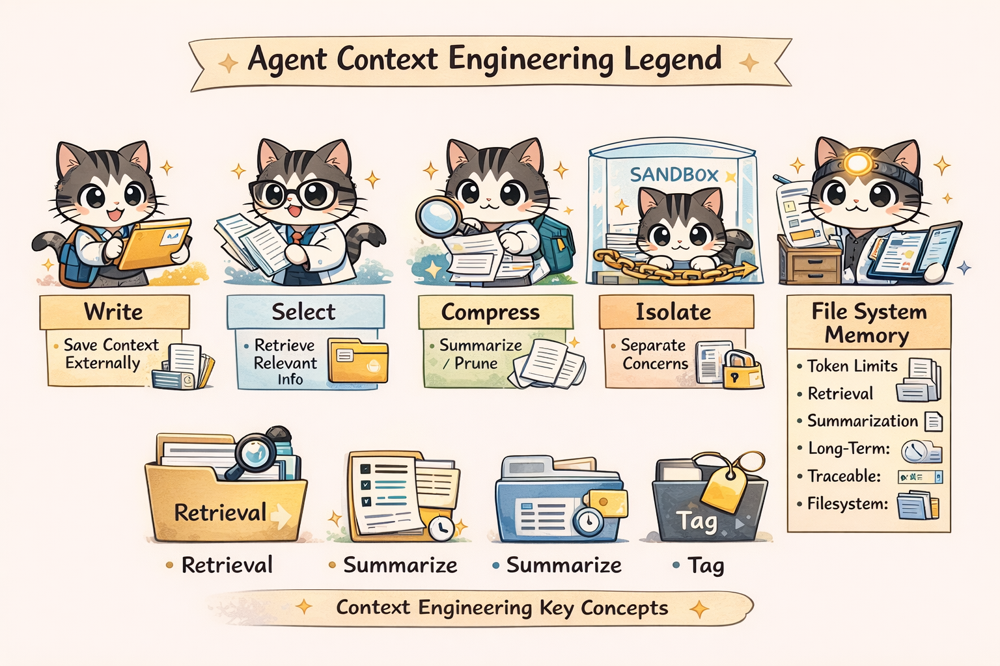
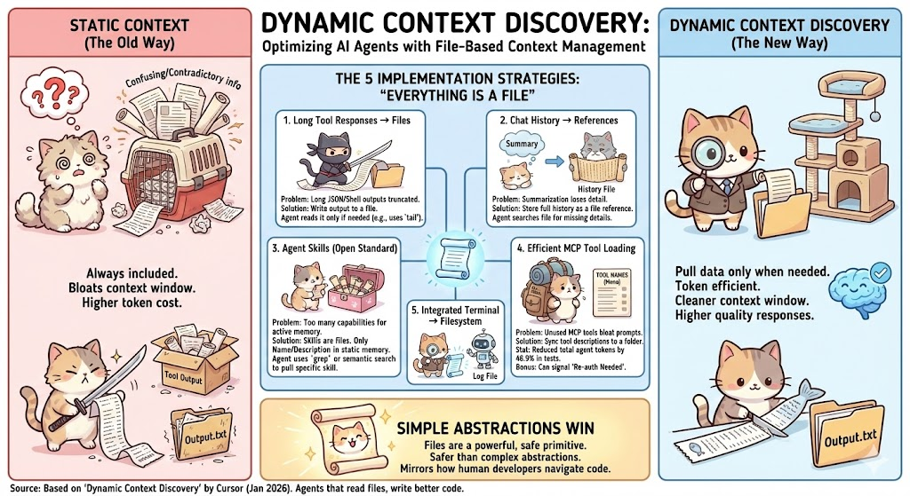

# Agent Context Engineering with File Systems  
*A Deep Research Summary*

---

## What Is Agent Context Engineering?

**Agent context engineering** is the discipline of deliberately managing what information an AI agent sees at each step of its reasoning and action loop.

It goes beyond prompt engineering and includes:
- External memory (files, databases, vector stores)
- Retrieval and selection strategies
- Compression and summarization
- Context isolation and lifecycle management

The goal is to ensure the agent always has **the right context, at the right time, in the right format**.

---

## Why Context Engineering Matters (5 Reasons)

1. **Limited Token Context**
   - LLMs have bounded context windows.
   - Poor context selection leads to truncation or confusion.

2. **Performance & Cost**
   - Smaller, relevant context = faster inference + lower cost.
   - Avoids dumping large tool outputs directly into prompts.

3. **Avoiding Context Rot**
   - Too much irrelevant or outdated information degrades reasoning quality.
   - Common failure mode observed in long-running agents.

4. **Persistent Memory**
   - File systems allow cross-step and cross-session memory.
   - Enables agents to “remember” without bloating the prompt.

5. **Traceability & Debugging**
   - Externalized context (files, artifacts) is inspectable and reproducible.
   - Critical for debugging agent failures and auditing behavior.

---

## Key Sources & Insights

### Manus — Context Engineering Lessons
**Source:** https://manus.im/blog/Context-Engineering-for-AI-Agents-Lessons-from-Building-Manus

**Key Ideas:**
- Context engineering is more impactful than model tuning.
- Treat the **filesystem as unbounded memory**.
- Write large observations to files; load selectively.
- Reuse stable prefixes and cache-friendly context.

**Filesystem Role:**
- Store long tool outputs, documents, and intermediate results.
- Retrieve only what is needed for the next step.

---

### Anthropic — Effective Context Engineering
**Source:** https://www.anthropic.com/engineering/effective-context-engineering-for-ai-agents

**Key Ideas:**
- Context is a finite, valuable resource.
- Focus on holistic context optimization, not just prompts.
- Carefully curate instructions, tool outputs, memory, and history.

---

### LangChain — Context Engineering for Agents
**Source:** https://blog.langchain.com/context-engineering-for-agents/

**Four Core Strategies:**
- **Write:** Save context externally
- **Select:** Retrieve relevant information
- **Compress:** Summarize or prune
- **Isolate:** Separate concerns and states



---

### LangChain — Filesystems for Agents
**Source:** https://blog.langchain.com/how-agents-can-use-filesystems-for-context-engineering/

**Key Ideas:**
- Filesystems act as flexible external memory.
- Agents write structured artifacts (search results, plans, logs).
- Files can be indexed, summarized, or selectively reloaded.

---

### Cursor — Dynamic Context Discovery
**Source:** https://cursor.com/blog/dynamic-context-discovery

**Key Ideas:**
- Do not preload all context.
- Discover and load context **just in time**.
- Convert tool outputs into file artifacts.
- Pull relevant slices only when needed.



---

## Academic Research

### “Everything is Context: Agentic File System Abstraction for Context Engineering”
**Paper:** https://arxiv.org/abs/2512.05470

**Contributions:**
- Proposes a Unix-like filesystem abstraction for agent context.
- All context artifacts become governed files.
- Enables:
  - Metadata-aware access
  - Traceability
  - Reproducibility
  - Structured context pipelines

---

### “Agent READMEs: An Empirical Study”
**Paper:** https://arxiv.org/abs/2511.12884

**Insights:**
- Context files behave like evolving configuration and instruction artifacts.
- They strongly influence agent behavior over time.

---

## Community Insights (Reddit / Hacker News)

**Recurring Themes:**
- “Context rot” is a real and common problem.
- More tokens ≠ better reasoning.
- Just-in-time retrieval beats static context dumps.
- Files unify large tool outputs into manageable artifacts.

**Relevant Discussions:**
- Reddit: r/AI_Agents, r/ContextEngineering
- Hacker News: Agent memory, tool output handling, long-running agents

---

## Timeline: Evolution of Context Engineering

### 2023–2024: Prompt Engineering Era
- Static prompts dominate.
- Minimal external memory usage.

### 2025 Q1–Q2: Context Engineering Defined
- Anthropic & LangChain formalize the discipline.
- Token budget awareness becomes mainstream.

### 2025 Q2–Q3: Filesystems & Practical Lessons
- Manus demonstrates filesystem-based memory.
- Practitioners identify context rot issues.

### 2025 Q4: Dynamic Context Discovery
- Cursor introduces just-in-time context loading.
- File-based artifact discovery gains popularity.

### Dec 2025: Academic Formalization
- “Everything is Context” paper introduces agentic file systems.

### 2026: Adaptive Memory Agents
- Layered memory
- Self-curating context
- Learning what context to retrieve

---

## Core Pattern: Filesystem-Based Context Engineering

```text
Agent Step
  ↓
Tool Call / Observation
  ↓
Write to File (Artifact)
  ↓
Index / Tag / Summarize
  ↓
Selective Retrieval
  ↓
Inject into Context Window