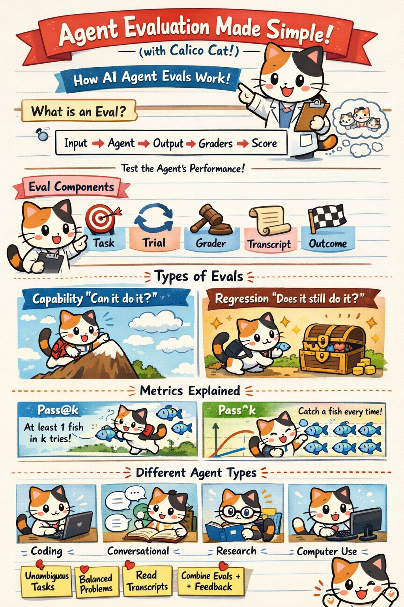
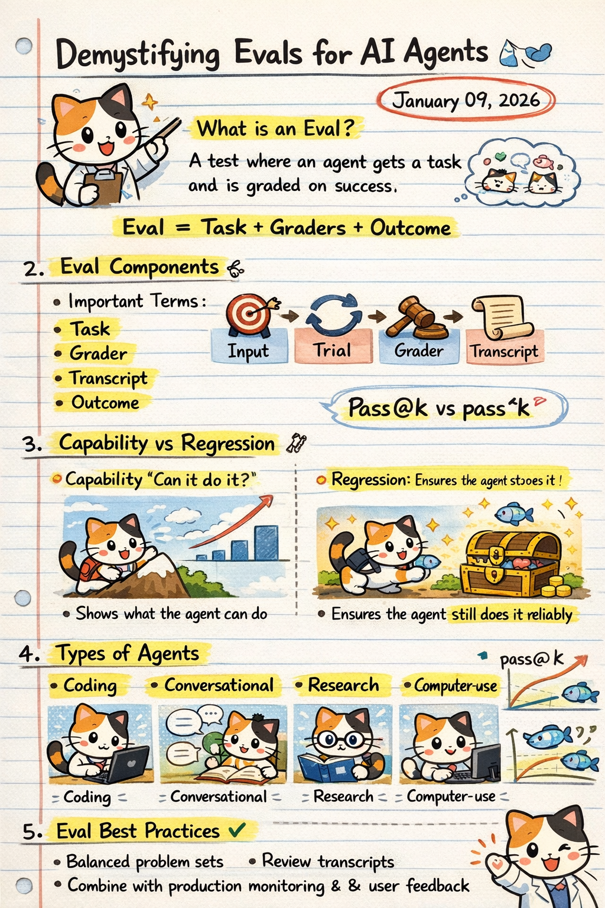

# Demystifying Evals for AI Agents

> Source: Anthropic Engineering  
> Article: *Demystifying evals for AI agents*  
> Date: **January 09, 2026**
> URL: [demystifying-evals-for-ai-agents](https://www.anthropic.com/engineering/demystifying-evals-for-ai-agents)

---

 

## 1. What is an Eval?

An **evaluation (eval)** is a structured test where an AI agent is given a task and is **graded on whether it succeeds**.

**Core idea:**
Eval = Task + Graders + Outcome

Evals help turn vague notions of “agent quality” into **measurable, repeatable signals**.

---

## 2. Why Agent Evals Are Hard

Traditional single-turn benchmarks fail for agents because agents:

- Operate over **multiple steps**
- Use **tools** and external systems
- Maintain **state and memory**
- Adapt strategies mid-task

As a result, evaluation must consider **entire interaction transcripts**, not just final answers.

---

## 3. Eval Components

Every agent eval is composed of the following building blocks:

### 3.1 Task
- A clearly defined goal for the agent
- Must be **unambiguous** and realistic

### 3.2 Trial
- One execution attempt of the task
- Often run multiple times to measure consistency

### 3.3 Grader
- Determines whether the agent succeeded
- Can be:
  - Deterministic (rules, scripts)
  - LLM-based (judgment calls)
  - Human (for edge cases)

### 3.4 Transcript
- Full record of the agent’s actions:
  - Prompts
  - Tool calls
  - Intermediate reasoning
  - Outputs

### 3.5 Outcome
- Pass / fail
- Or a scalar score

---

## 4. Types of Evals

### 4.1 Capability Evals — “Can it do it?”

- Measure **what the agent is capable of**
- Used early in development
- Often have **low initial pass rates**

Examples:
- Can the agent write correct code?
- Can it complete a multi-step research task?

---

### 4.2 Regression Evals — “Does it still do it?”

- Ensure previously working behaviors **do not break**
- Used continuously during iteration
- Focus on **stability and reliability**

Key role: **catch regressions before users do**

---

## 5. Metrics Explained

### 5.1 pass@k

> Probability that the agent succeeds **at least once** in `k` attempts

- Measures *best-case capability*
- Useful when retries are allowed

Example:
- Did the agent solve the task in any of 5 tries?

---

### 5.2 pass^k

> Probability that the agent succeeds **every time** across `k` attempts

- Measures **consistency**
- Critical for production reliability

Example:
- Did the agent succeed in all 5 runs?

---

## 6. Agent Types and Evaluation Focus

Different agents require different eval designs:

### Coding Agents
- Correctness
- Edge cases
- Determinism

### Conversational Agents
- Coherence
- Goal completion
- User satisfaction

### Research Agents
- Information accuracy
- Source usage
- Reasoning quality

### Computer-Use Agents
- Correct UI actions
- Error recovery
- End-to-end task completion

---

## 7. Eval Best Practices

- Write **clear and unambiguous tasks**
- Use **balanced problem sets**
- Avoid overly brittle graders
- **Review transcripts regularly**
- Combine evals with:
  - Production monitoring
  - A/B testing
  - User feedback

> Automated evals are powerful, but they never replace human judgment — they **augment it**.

---

## 8. Big Picture Takeaway

Evals are not just tests — they are **core infrastructure** for building AI agents.

Well-designed evals:
- Accelerate development
- Prevent regressions
- Enable confident iteration
- Make agent behavior measurable and explainable

**No evals → no reliable agents.**

