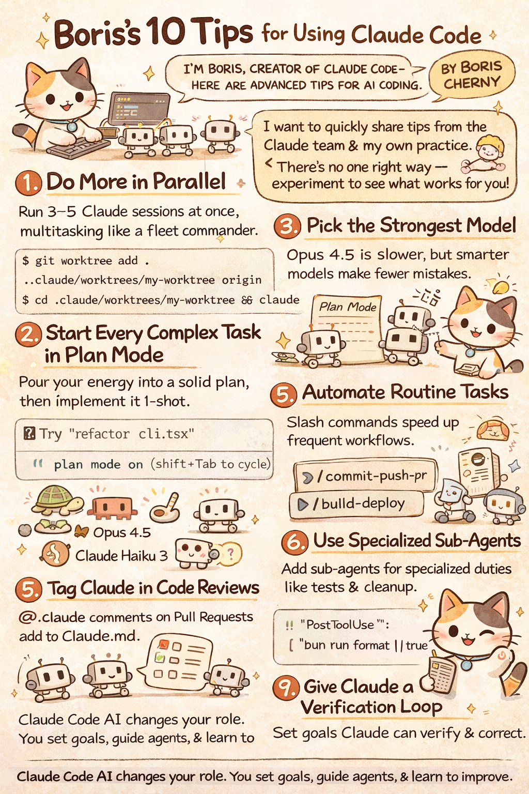

# 10 Tips for Using Claude Code from Its Creator, Boris Cherny

*Tips sourced directly from the Claude Code team — January 31, 2026*




---

Boris Cherny, the creator of Claude Code, recently shared a thread of practical tips for getting the most out of the tool. These insights come directly from how the Claude Code team uses their own product daily.

As Boris notes in his opening:

> "I'm Boris and I created Claude Code. I wanted to quickly share a few tips for using Claude Code, sourced directly from the Claude Code team. The way the team uses Claude is different than how I use it. Remember: there is no one right way to use Claude Code — everyone's setup is different. You should experiment to see what works for you!"

Here are the 10 key tips from the thread:

---

## 1. Do More in Parallel

The single biggest productivity unlock from the Claude Code team is running multiple Claude sessions simultaneously.

> "Spin up 3–5 git worktrees at once, each running its own Claude session in parallel. It's the single biggest productivity unlock, and the top tip from the team. Personally, I use multiple git checkouts, but most of the Claude Code team prefers worktrees — it's the reason @amorriscode built native support for them into the Claude Desktop app!"

**Pro tips from the team:**
- Name your worktrees and set up shell aliases (za, zb, zc) to hop between them in one keystroke
- Create a dedicated "analysis" worktree that's only for reading logs and running BigQuery

```bash
$ git worktree add .claude/worktrees/my-worktree origin/main
$ cd .claude/worktrees/my-worktree && claude
```

---

## 2. Start Every Complex Task in Plan Mode

Before diving into implementation, invest your energy into planning.

> "Start every complex task in plan mode. Pour your energy into the plan so Claude can 1-shot the implementation."

**How the team uses plan mode:**

> "One person has one Claude write the plan, then they spin up a second Claude to review it as a staff engineer."

> "Another says the moment something goes sideways, they switch back to plan mode and re-plan. Don't keep pushing. They also explicitly tell Claude to enter plan mode for verification steps, not just for the build."

Use `shift+Tab` to cycle into plan mode.

---

## 3. Invest in Your CLAUDE.md

Your CLAUDE.md file is Claude's persistent memory for your project. Treat it as a living document.

> "Invest in your CLAUDE.md. After every correction, end with: 'Update your CLAUDE.md so you don't make that mistake again.' Claude is eerily good at writing rules for itself."

> "Ruthlessly edit your CLAUDE.md over time. Keep iterating until Claude's mistake rate measurably drops."

**Team practice:**

> "One engineer tells Claude to maintain a notes directory for every task/project, updated after every PR. They then point CLAUDE.md at it."

---

## 4. Create Your Own Skills and Commit Them to Git

Build reusable skills that you can share across all your projects.

> "Create your own skills and commit them to git. Reuse across every project."

**Tips from the team:**
- If you do something more than once a day, turn it into a skill or command
- Build a `/techdebt` slash command and run it at the end of every session to find and kill duplicated code
- Set up a slash command that syncs 7 days of Slack, GDrive, Asana, and GitHub into one context dump
- Build analytics-engineer-style agents that write dbt models, review code, and test changes in dev

Learn more: [Extend Claude with skills – Claude Code Docs](https://code.claude.com/docs/en/common...)

---

## 5. Let Claude Fix Bugs By Itself

Claude is surprisingly capable at autonomous bug fixing when given the right context.

> "Claude fixes most bugs by itself. Here's how we do it:"

> "Enable the Slack MCP, then paste a Slack bug thread into Claude and just say 'fix.' Zero context switching required."

> "Or, just say 'Go fix the failing CI tests.' Don't micromanage how."

> "Point Claude at docker logs to troubleshoot distributed systems — it's surprisingly capable at this."

---

## 6. Level Up Your Prompting

Small changes to how you prompt Claude can dramatically improve output quality.

> "Level up your prompting"

**a. Challenge Claude as a reviewer:**

> "Challenge Claude. Say 'Grill me on these changes and don't make a PR until I pass your test.' Make Claude be your reviewer. Or, say 'Prove to me this works' and have Claude diff behavior between main and your feature branch."

**b. Push for elegance:**

> "After a mediocre fix, say: 'Knowing everything you know now, scrap this and implement the elegant solution'"

**c. Be specific:**

> "Write detailed specs and reduce ambiguity before handing work off. The more specific you are, the better the output."

---

## 7. Optimize Your Terminal & Environment Setup

Your terminal configuration matters for managing multiple Claude sessions effectively.

> "The team loves Ghostty! Multiple people like its synchronized rendering, 24-bit color, and proper unicode support."

> "For easier Claude-juggling, use /statusline to customize your status bar to always show context usage and current git branch. Many of us also color-code and name our terminal tabs, sometimes using tmux — one tab per task/worktree."

**Voice dictation tip:**

> "Use voice dictation. You speak 3x faster than you type, and your prompts get way more detailed as a result. (hit fn x2 on macOS)"

More tips: [Terminal Configuration – Claude Code Docs](https://code.claude.com/docs/en/terminal-config)

---

## 8. Use Subagents

Subagents let you throw more compute at problems while keeping your main context clean.

> "Use subagents"

**a. Scale up compute:**

> "Append 'use subagents' to any request where you want Claude to throw more compute at the problem"

**b. Keep context clean:**

> "Offload individual tasks to subagents to keep your main agent's context window clean and focused"

**c. Auto-approve safely:**

> "Route permission requests to Opus 4.5 via a hook — let it scan for attacks and auto-approve the safe ones"

Example: `use 5 subagents to explore the codebase` will launch 5 parallel explore agents investigating entry points, React components, tools implementation, state management, and testing infrastructure simultaneously.

---

## 9. Use Claude for Data & Analytics

Let Claude handle your SQL and data queries directly.

> "Use Claude for data & analytics"

> "Ask Claude Code to use the 'bq' CLI to pull and analyze metrics on the fly. We have a BigQuery skill checked into the codebase, and everyone on the team uses it for analytics queries directly in Claude Code. Personally, I haven't written a line of SQL in 6+ months."

> "This works for any database that has a CLI, MCP, or API."

---

## 10. Learning with Claude

Claude Code isn't just for building — it's a powerful learning tool.

> "Learning with Claude"

**a. Enable explanatory mode:**

> "Enable the 'Explanatory' or 'Learning' output style in /config to have Claude explain the *why* behind its changes"

**b. Generate visual presentations:**

> "Have Claude generate a visual HTML presentation explaining unfamiliar code. It makes surprisingly good slides!"

**c. Use ASCII diagrams:**

> "Ask Claude to draw ASCII diagrams of new protocols and codebases to help you understand them"

**d. Build spaced repetition:**

> "Build a spaced-repetition learning skill: you explain your understanding, Claude asks follow-ups to fill gaps, stores the result"

---

## Key Takeaways

1. **Parallelism is king** — Multiple worktrees with separate Claude sessions is the #1 productivity tip
2. **Plan before you build** — Invest in plan mode for complex tasks
3. **Evolve your CLAUDE.md** — Let Claude write its own rules after mistakes
4. **Build reusable skills** — Automate repetitive workflows
5. **Trust Claude with bugs** — Give it context and let it work autonomously
6. **Prompt with intention** — Challenge Claude, demand elegance, be specific
7. **Optimize your environment** — Good tooling amplifies everything
8. **Leverage subagents** — Throw compute at problems, keep context clean
9. **Offload analytics** — Let Claude write your SQL
10. **Learn actively** — Use Claude as a teaching tool, not just a coding tool

---

*Remember Boris's advice: experiment to find what works for you. Everyone's setup is different.*

---

**Original thread:** [@bcherny on X](https://x.com/bcherny/status/2017742741636321619) — January 31, 2026
