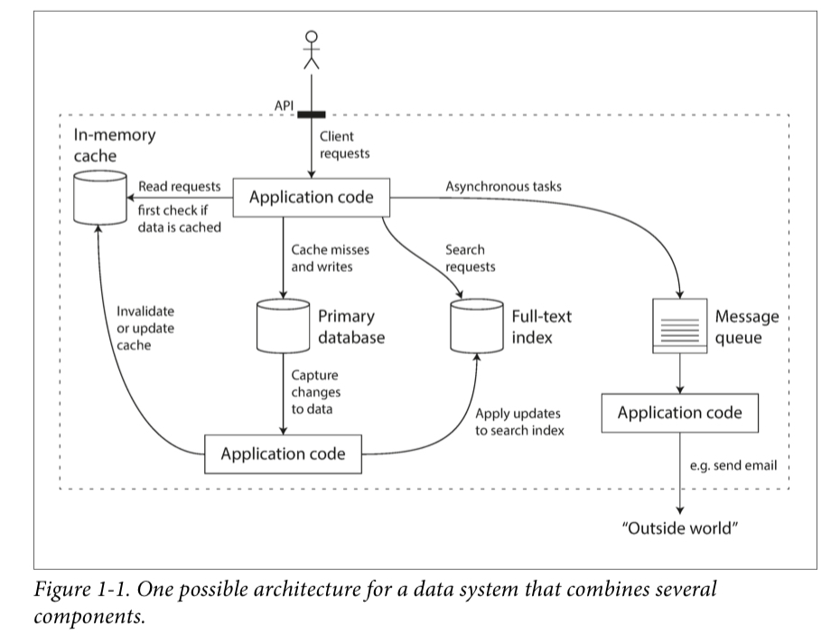

# 第一章 — 可靠性，可扩展性，可维护性的应用程序(Reliable, Scalable, and Maintainable Applications)

| The Internet was done so well that most people think of it as a natural resource like the Pacific Ocean, rather than something that was man-made. When was the last time a technology with a scale like that was so error-free?
| —Alan Kay, in interview with Dr Dobb’s Journal (2012)

现今很多应用程序都是数据密集型（data-intensive），跟计算密集型（compute-intensive）相反。原始CPU （raw CPU）基本不能成为这些应用的限制因素 — 更大的问题常常是大量的数据（data）和这些数据改变的速度。

数据密集型应用程序通常由提供常用功能的标准构建块构建。例如，许多应用程序需要：

- 存储数据，所以应用程序本身或者其他应用程序可以再次访问存储的数据（数据库（database））
- 记录昂贵操作的结果，以加快读取数据的结果（缓存（caches））
- 允许用户用不同方式以关键字或过滤器搜索数据（搜索索引（search indexes））
- 发送一条信息到另一个要异步处理的进程（流处理（stream processing））
- 定期处理大量的累积数据（批处理（batch processing））

如果这听起来很痛苦，那仅仅是因为这些数据系统是如此成功的抽象：我们一直都在不加思索的使用他们。当构建一个应用程序的时候，大部分程序员不会想着重头开始写一个新的数据存储引擎，因为数据库是完成这项工作的非常完美的工具。

其实现实并不是那样简单。有许多具有不同特性的数据库系统，因为不同的应用程序具有不同的要求。有很多不同的方法处理缓存，不同的方式创建搜索索引，等等。当创建一个应用程序时，我们仍然需要找出最适合手头工作的工具和方法。当一个工具不能单独完成项目时，组合工具可能变得很难。

本书是对数据系统的原理和实用性以及如何使用它们来构建数据密集型应用程序的一次旅程。 我们将探讨不同工具的共同点，它们的区别以及如何实现其特性。

在本章中，我们将从探索我们要实现的基础知识开始：可靠，可扩展和可维护的数据系统。 我们将弄清这些含义是什么，概述一些思考方法，并讲解后面几章中所需要的基础。 在以下各章中，我们将逐层继续，研究在处理数据密集型应用程序时需要考虑的不同设计决策。

##思考数据系统

我们通常认为数据库，队列，缓存等是非常不同的工具类别。 尽管数据库和消息队列在表面上有一些相似之处 — 都存储数据一段时间，但是它们具有非常不同的访问模式，这意味着不同的性能特征，因此实现也非常不同。

那么，为什么要像数据系统这样的总括术语般将它们全部放在一起呢？

近年来，出现了许多用于数据存储和处理的新工具。 它们针对各种不同的用例进行了优化，不再适合传统类别[1]。 例如，有些数据存储也可用作消息队列（Redis），有些消息队列具有类似数据库的持久性保证（Apache Kafka）。 类别之间的界限变得越来越模糊。

其次，现在越来越多的应用程序具有如此苛刻或广泛的要求，以至于单个工具无法再满足其所有数据处理和存储需求。 取而代之的是，工作被分解为可以在单个工具上有效执行的任务，然后使用应用程序代码将这些不同的工具缝合在一起。

例如，如果你有一个应用程序管理的缓存层（使用Memcached或类似的缓存），或者是一个与主数据库分开的全文本搜索服务器（例如Elasticsearch或Solr），则通常由应用程序代码负责保留这些缓存和索引与主数据库同步。 图1-1给出了这样的系统的大概框架（我们将在后面的章节中详细介绍。）

当你组合多个工具以提供一个服务时，这个服务的接口或应用程序编程接口（API）通常会向客户端隐藏这些详细实现。 现在，你已经从较小的通用组件中创建了一个新的专用数据系统。 你的复合数据系统可以提供确定的保证：例如，缓存将在数据写入时，正确地使无效或进行更新，以使外部客户端看到一致的结果。 你现在不仅是应用程序开发员，还是数据系统设计员。

如果你正在设计一个数据系统或服务，则越来越多棘手的问题将会出现： 即使内部出现问题，如何确保数据保持正确和完整？ 即使系统的某些部分性能下降，如何为客户提供始终如一的良好性能？ 如何扩展以应对负载的增加？ 好的服务API该如何设计？

有许多因素可能会影响数据系统的设计，包括相关人员的技能和经验，旧系统的依赖关系，交付的时间范围，组织对各种风险的承受能力，法规约束等。这些因素很大程度取决于环境。

- 可靠性（Reliability）
                                即使面对逆境（硬件或软件故障，甚至是人为错误），系统也应继续正确运行（在所需的性能水平上执行正确的功能）。 请参阅第6页“可靠性”。

- 可扩展性（Scalability）
    随着时间的流逝，许多不同的人将工作在同一系统上（工程师和操作师（SRE），既要维持当前的行为，又要使系统适应新的用例），他们都应该能够高效地工作。 请参阅第18页“可维护性”。

- 可维护性（Maintainability）
    随着时间的流逝，许多不同的人将工作在同一系统上（工程师和操作师（SRE），既要维持当前的行为，又要使系统适应新的用例），他们都应该能够高效地工作。 请参阅第18页“可维护性”。

这些词经常在没有清楚理解其含义的情况下出现。 为了进行周到的工程设计，我们将在本章的其余部分中探讨有关可靠性，可伸缩性和可维护性的思考方式。 然后，在接下来的章节中，我们将研究用于实现这些目标的各种技术，体系结构和算法。

###可靠性（Reliability）
对某事可靠或不可靠意味着什么，每个人都有一个直觉的想法。 对于软件，通常包括：
- 应用程序执行用户期望的功能。
- 可以容忍用户犯错误或以不预期的方式使用软件。
- 在预期的负载和数据量下，其性能足以满足所需用例。
- 系统可防止任何未经授权的访问和滥用。

如果以上加在一起都意味着“正确工作”，那么我们可以将可靠性大致理解为“即使出现问题也可以继续正确工作”。

可能出错的事物称为故障，而预见到故障并可以对其进行处理的系统称为容错性或有弹性的系统。 前一个术语略有误导性：它表明我们可以使系统能够容忍每种可能的故障，但实际上这是不可行的。 如果整个地球（及其上的所有服务器）都被一个黑洞吞没，那么要容忍该故障将需要在空间站中建服务器 — 祝你好运能在预算案获得批准。 因此，仅讨论容忍某些类型的故障才有意义。

请注意，故障与失败[2]不同。 故障通常被定义为偏离其规格的系统的一个组成部分，而失败则是指整个系统停止向用户提供所需的服务时。 不可能将故障的可能性降低到零。 因此，通常最好设计容错机制，以防止故障引起失败。 在本书中，我们介绍了使用不可靠零件构建可靠系统的几种技术。

与直觉相反，在这样的容错系统中，通过有意触发故障来提高故障率是有意义的，例如，在没有警告的情况下随机杀死单个进程。 许多严重的错误实际上是由于不良的错误处理[3]所致； 通过故意诱发故障，可以确保容错机制得到不断地练习和测，从而更有自信在自然故障发生时可以对其进行正确地处理。 Netflix Chaos Monkey [4]是这种方法的一个例子。

尽管我们通常更喜欢容忍错误而不是预防错误，但在某些情况下，预防胜于治疗（例如，因为治愈方法不存在）。 例如，安全问题就是这种情况：如果攻击者破坏了系统并获得了对敏感数据的访问权，则该事件无法撤消。 但是，这本书主要涉及可以解决的各种故障，如以下各节所述。

