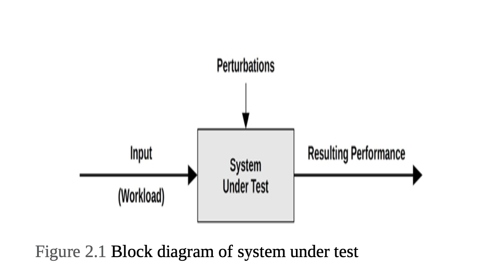

# Chapter 2: Methodologies
The Learning objectives of this chapter:
- Understand key performance metrics: latency, utilization, and saturation
- Develop a sense for the scale of measured time, down to nanoseconds
- Learn tuning trade-offs, targets, and when to stop analysis
- Identify problems of workload versus architecture
- Consider resource versus workload analysis
- Follow different performance methodologies, including: the USE method, workload characterization, latency analysis, static performance tuning, and performance mantras
- Understand the basics of statistics and queueing theory

## Terminology
- **IOPS**: Input/output operations per second is a measure of the rate of data transfer operations. For disk I/O, IPOS refers to reads and writes per second.
- **Throughput**: The rate of work performed. It can refer to the data rate (bytes per second or bits per second), or the operation rate (operations per second or transactions per second)
- **Response time**: The time for an operation to complete.
- **Latency**: A measure of time an operation spends waiting to be serviced. It also refers to the entire time for an operation. 
- **Utilization**: For resources that service request, utilization is a measure of how busy a resource is, based on how much time in a given interval it was actively performing work. (disk I/O, CPU, Memory, storage etc)
- **Saturation**: The degree to which a resource has queued work it cannot service.
- **Bottleneck**: it is a resource that limits the performance of the system.
- **Workload**: The input to the system or the load applied is the workload. For a database, the workload consists of the database queries and commmands send by the clients.
- **Cache**: A fast storage area that can duplicate or buffer a imited amount of data, to avoid communicating directly with a slower tier of storage, thereby improving performance.

## Models
### System Under Test

