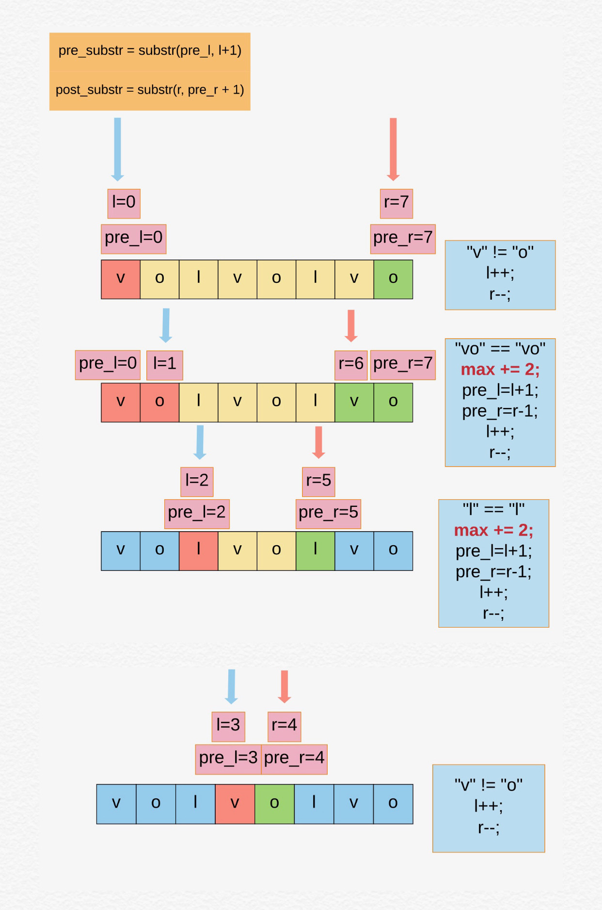
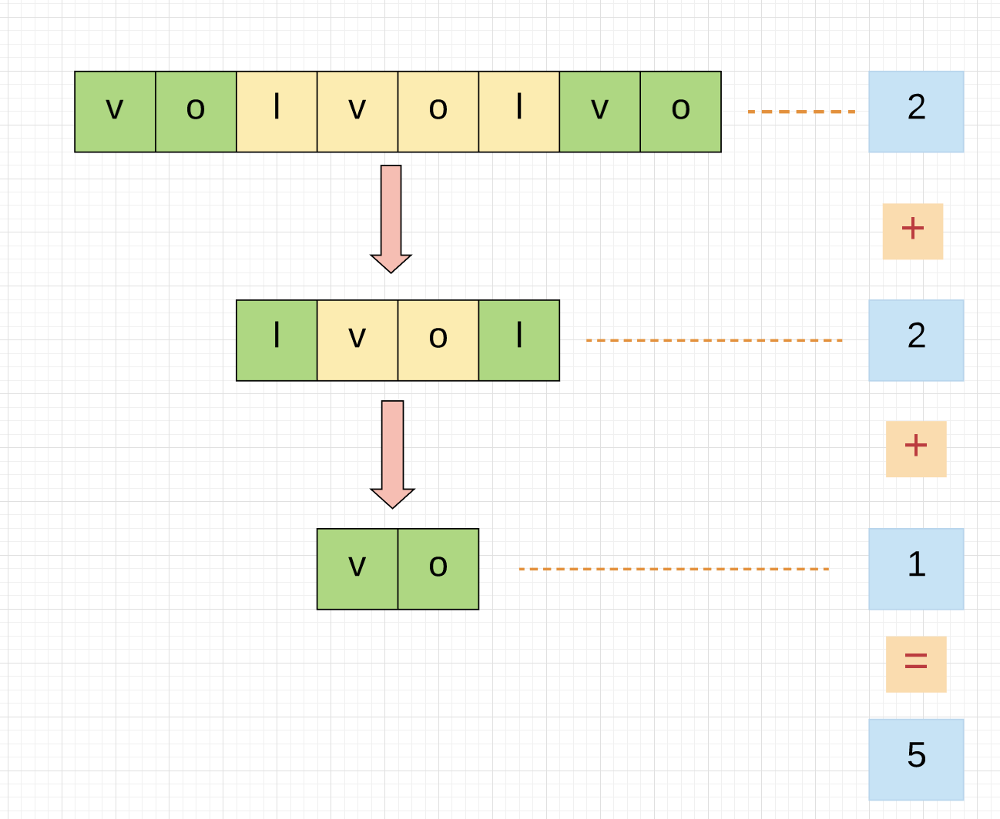

## Chunked Palindrome

### 题目描述
```
Normal palindrome is defined as a string that reads the same backwards as forwards, for example "abccba".
Chunked palindrome is defined as a string that you can split into chunks and it will form a palindrome.
For example, "volvo". You can split it into (vo)(l)(vo). Let A = "vo", B = "l", so the original string is ABA which is a palindrome.

Given a string str, find the maximum number of chunks we can split that string to get a chuncked palindrome.

Example 1:

Input: "valve"
Output: 1
Explanation: You can't split it into multiple chunks so just return 1 (valve)
Example 2:

Input: "voabcvo"
Output: 3
Explanation: (vo)(abc)(vo)
Example 3:

Input: "vovo"
Output: 2
Explanation: (vo)(vo)
Example 4:

Input: "volvolvo"
Output: 5
Explanation: (vo)(l)(vo)(l)(vo)
Example 5:

Input: "volvol"
Output: 2
Explanation: (vol)(vol)
Example 6:

Input: "aaaaaa"
Output: 6
Explanation: We can split it into (aaa)(aaa), but the optimal split should be (a)(a)(a)(a)(a)(a)
Questions from the same interview:

Product of K consecutive numbers
```

## 思路
给定一个字符串，让求出最多可以切成分块的回文，每一个切分可以是一个子字符串，或者单个字符。

例如， `"aaaaaa"`， 可以切分成 `"aaa)(aaa)" - 2`， 但是这里要求最多分块， 这样就是最多的`"(a)(a)(a)(a)(a)(a)" - 6`

#### 解法一，
分析， 满足回文字符串的要求是，从前读和从后读是一样的， 例如， `"aba"， "anna"，"madam"` 等

那么这里就可以分别从前`（l）`和从后`（r）`扫描，`l` 和 `r` 记录前后扫描的`index`， 然后用`pre_l` and `pre_r` 记录前一次扫描到的可以分块的回文位置，

如果子字符串相同（substr（pre_l, l + 1) 这里包含边界），结果 +2，继续扫描。

如果最后剩余一个（奇数个chunk）， 那么直接结果 +1， 否则偶数个chunk， 直接返回结果

例如：`"volvolvo"`



#### 复杂度分析

**时间复杂度：`O(N^2) - N is the s length, s.substring()时间复杂度是O(n)`**

**空间复杂度：`O(1) - 没有额外的空间`**

#### 解法二

从解法一中我们可以看到`palindome` 左右对称， 所以可以从左和右，用递归求解。

如下图例子， 可以从左起子字符串匹配最右起的子字符串。绿色框框，如果匹配， 递归的计算最长的回文，即每次碰到回文就计算 +2，
直到最后字符串中没有匹配的回文，或者是匹配到最后， 退出， 返回结果。

例如：`"volvolvo"`



## 代码 （Java）

**解法一**
```java
class ChunkedPalindrom {
    public static int maxChunkedPalindrome2(String s) {
        if (s == null || s.length() == 0) return 0;
        int l = 0;
        int r = s.length() - 1;
        int max = 0;
        int preL = l;
        int preR = r;
        while (l < r) {
          String prefix = s.substring(preL, l + 1); // include right
          String sufix = s.substring(r, preR + 1);
          if (prefix.equals(sufix)) {
            preL = l + 1;
            preR = r - 1;
            max += 2;
          }
          l++;
          r--;
        }
        if (preL <= preR) max++;
        System.out.println("max chunk palindrom: " + max);
        return max;
      }
  }
```

**解法二**
```java
class ChunkedPalindrome {
    public static int maxChunkedPalindrome(String s) {
        if (s == null || s.length() == 0) return 0;
        return helper(s, 0, 0, s);
      }
    
      private static int helper(String curr, int count, int len, String s) {
        // no substring left, return current count
        if (curr == null || curr.isEmpty()) return count;
        if (curr.length() <= 1) {
          if (count != 0 && s.length() - len <= 1) {
            return count + 1;
          } else return 1;
        }
        int currLen = curr.length();
        // get left and right substring and compare
        for (int i = 0; i < currLen / 2; i++) {
          String left = curr.substring(0, i + 1);
          String right = curr.substring(currLen - 1 - i, currLen);
          if (left.equals(right)) {
            // if left and right match, then continue match the rest substring (s - left - right)
            return helper(curr.substring(i + 1, currLen - 1 - i),
                count + 2, len + (i + 1) * 2, s);
          }
        }
        return count + 1;
      }
  }
```

## 参考（References）
1. [Longest Possible Chunked Palindrome](https://www.geeksforgeeks.org/longest-possible-chunked-palindrome/)