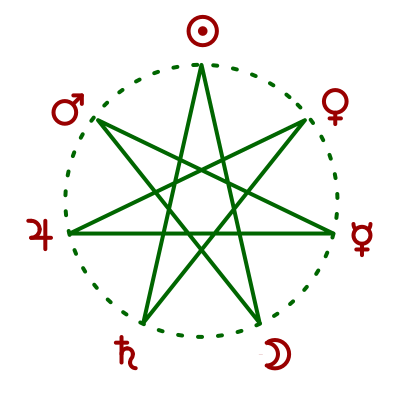
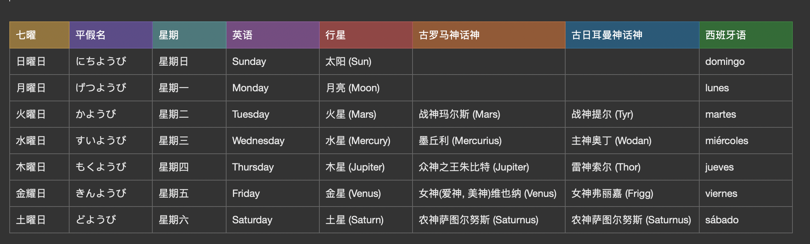

## 日语中星期的起源

这周学习了日语的星期，发现跟现在中国用的星期不太一样，所以就去了解了一下日语中星期的起源，然后顺便了解一下星期的起源。

现代中文中星期的是：一二三四五六七（日），星期七也叫做星期日。

日语中星期是：月火水木金土日

### 星期起源
>星期又作周或者礼拜，是一个时间单位，每星期有7日。

日语中星期是延用从中国传入的七曜，利用七曜在纪日是从西方传入中国的，大约发生在唐朝，然后传入日本，朝鲜半岛等。

在光绪三十一年（1905年）由袁嘉谷所定用“星期”代替“曜日”，到了民国以后星期被广泛使用。然而日本继续延用了曜日纪日法。

“七曜”就是日、月、火星、水星、木星、金星、土星七星。

[图片来源于维基百科]

- 日曜日 - 星期日 - Sunday - Sun（太阳）之日

- 月曜日 - 星期一 - Monday - Moon （月亮）之日

- 火曜日 - 星期二 - Tuesday - 战神 （Tyr）之日

- 水曜日 - 星期三 - Wednesday - 主神奥丁（Wodan）之日

- 木曜日 - 星期四 - Thursday - 雷神（Thor）之日

- 金曜日 - 星期五 - Friday - 女神（Frigg）之日

- 土曜日 - 星期六 - Saturday - 农神（Saturnus）之日

## 参考
- [维基百科星期](https://www.wikiwand.com/zh-hans/%E6%98%9F%E6%9C%9F)
