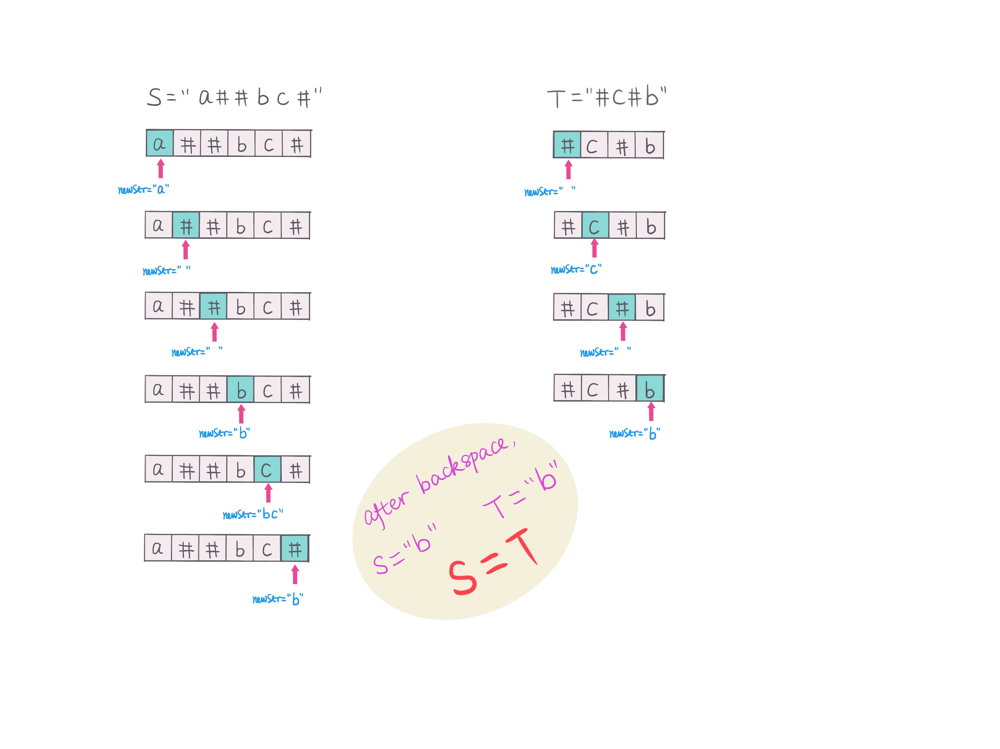
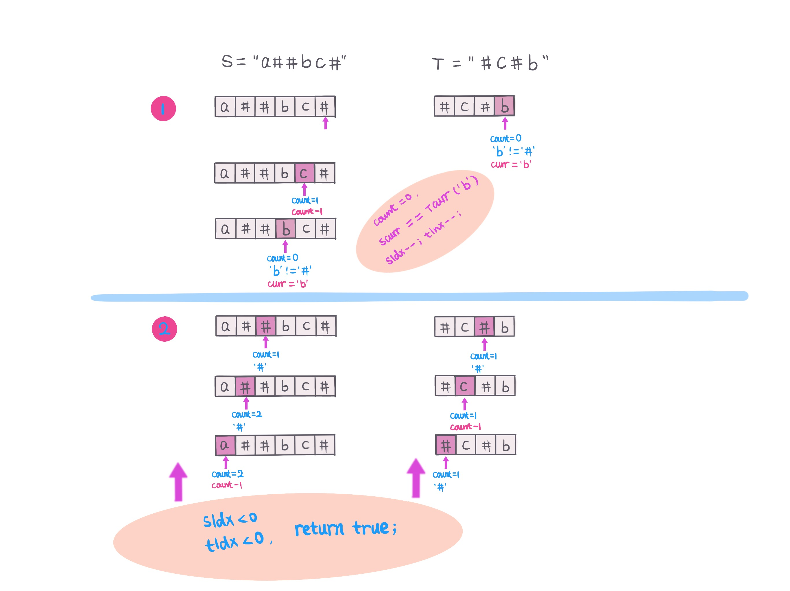

## Problem
[Backspace String Compare](https://leetcode.com/explore/challenge/card/30-day-leetcoding-challenge/529/week-2/3291/)

## Problem Description
```
Given two strings S and T, return if they are equal when both are typed into empty text editors. # means a backspace character.

Example 1:

Input: S = "ab#c", T = "ad#c"
Output: true
Explanation: Both S and T become "ac".
Example 2:

Input: S = "ab##", T = "c#d#"
Output: true
Explanation: Both S and T become "".
Example 3:

Input: S = "a##c", T = "#a#c"
Output: true
Explanation: Both S and T become "c".
Example 4:

Input: S = "a#c", T = "b"
Output: false
Explanation: S becomes "c" while T becomes "b".
Note:

1 <= S.length <= 200
1 <= T.length <= 200
S and T only contain lowercase letters and '#' characters.

Follow up:
Can you solve it in O(N) time and O(1) space?
```

## Solution 1

In this solution, we build a new string after backspace.
- From left to right, if curr char != '#', append to newString.
- If curr char == '#', check newString is null?
    - if newString is null, do nothing, continue
    - if newString is not null, delete last char.
- return newString.
- Compare new build string from S and T.

For example as pic: 


#### Complexity Analysis

**Time Complexity:** `O(N + M)`

**Space Complexity:** `O(N + M)`

- N - length of String S

- M - length of String T

#### Code
```java
class Solution {
    public boolean backspaceCompare(String S, String T) {
        return buildStr(S).equals(buildStr(T)); 
    }

    private String buildStr(String s) {
        StringBuilder sb = new StringBuilder();
        int idx = 0;
        int len = s.length();
        while (idx < len) {
            char curr = s.charAt(idx);
            if (curr != '#') {
                sb.append(curr);
            } else if (sb.length() > 0) {
                sb.deleteCharAt(sb.length() - 1);
            }
            idx++;
        }
        return sb.toString();
    } 
}
```

## Solution 2 (follow up)
This solution is to compare char on the fly.
- Scan both String S and T from right to left
- Define '#' count and index: sIdx, tIdx, if encounter '#', count++, else count--.
- Until count = 0, and curr char != '#', check current position char
    - if out of string(S/T) index, then `s = *, t = *`
    - else `s = S.charAt(sIdx), t = T.charAt(tIdx)`
- compare current `s == t?` 
    - if `s != t`, return false
    - else continue
- If complete loop S and T, return true.

for example:



####Complexity Analysis

**Time Complexity:** `O(N + M)`

**Space Complexity:** `O(1)`

- N - length of String S

- M - length of String T

```java
class Solution {
    public boolean backspaceCompare(String S, String T) {
        int sIdx = S.length() - 1;
        int tIdx = T.length() - 1;
        int sCount = 0;
        int tCount = 0;
        while (sIdx >= 0 || tIdx >= 0) {
            // scan S until count == 0 and current char != '#'
            while (sIdx >= 0 && (sCount > 0 || S.charAt(sIdx) == '#')) {
                sCount += S.charAt(sIdx) == '#' ? 1 : -1;
                sIdx--;
            }
            // get current S index char
            char s = sIdx < 0 ? '*' : S.charAt(sIdx);
            // scan T until count == 0 and current char != '#'
            while (tIdx >= 0 && (tCount > 0 || T.charAt(tIdx) == '#')) {
                tCount += T.charAt(tIdx) == '#' ? 1 : -1;
                tIdx--;
            }
            // get current T index char
            char t = tIdx < 0 ? '*' : T.charAt(tIdx);
            if (s != t) return false;
            sIdx--;
            tIdx--;
        }
        return true;
    }
}
```
