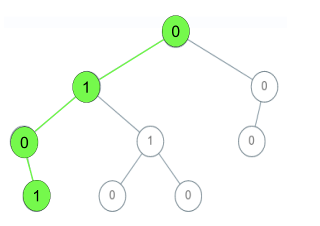
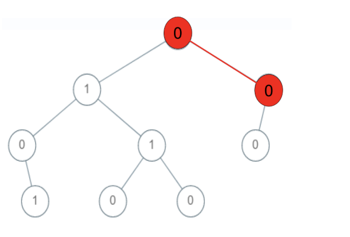
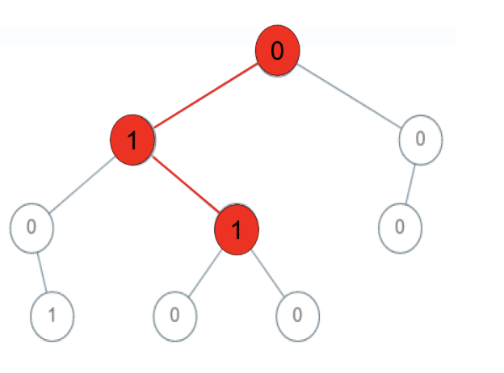
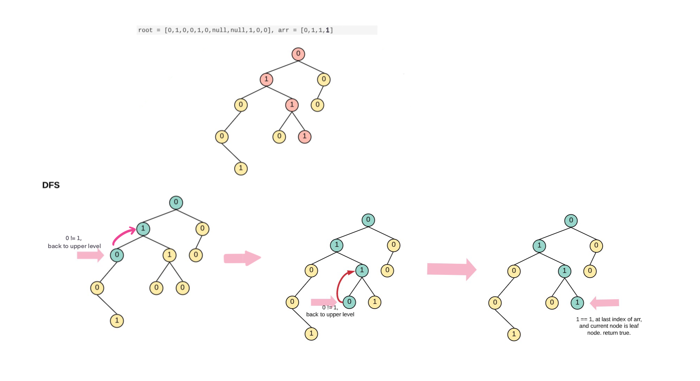
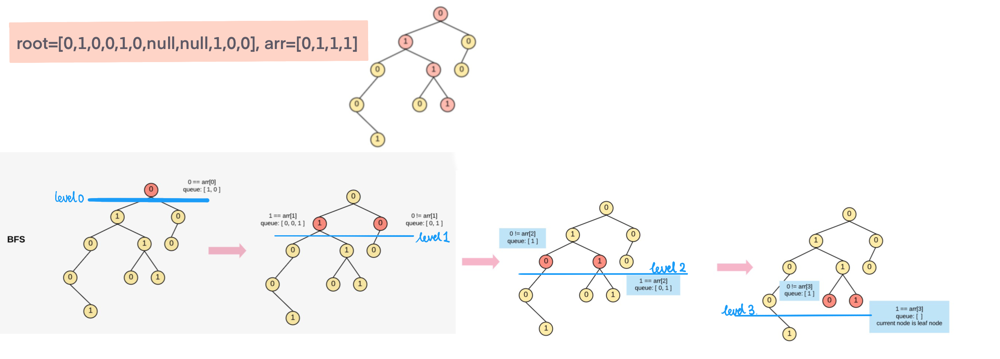

## Problem
[Check If a String Is a Valid Sequence from Root to Leaves Path in a Binary Tree](https://leetcode.com/explore/challenge/card/30-day-leetcoding-challenge/532/week-5/3315/)

## Problem Description
```
Given a binary tree where each path going from the root to any leaf form a valid sequence, check if a given string is a valid sequence in such binary tree. 

We get the given string from the concatenation of an array of integers arr and the concatenation of all values of the nodes along a path results in a sequence in the given binary tree.

 
Example 1:
```


```
Input: root = [0,1,0,0,1,0,null,null,1,0,0], arr = [0,1,0,1]
Output: true
Explanation: 
The path 0 -> 1 -> 0 -> 1 is a valid sequence (green color in the figure). 
Other valid sequences are: 
0 -> 1 -> 1 -> 0 
0 -> 0 -> 0
```
Example 2:



```
Input: root = [0,1,0,0,1,0,null,null,1,0,0], arr = [0,0,1]
Output: false 
Explanation: The path 0 -> 0 -> 1 does not exist, therefore it is not even a sequence.

Example 3:
```



```
Input: root = [0,1,0,0,1,0,null,null,1,0,0], arr = [0,1,1]
Output: false
Explanation: The path 0 -> 1 -> 1 is a sequence, but it is not a valid sequence.
 
```

Constraints:

- 1 <= arr.length <= 5000
- 0 <= arr[i] <= 9
- Each node's value is between [0 - 9].

## Solution


####Complexity Analysis

**Time Complexity:** `O(N)`

- N - Number of nodes 

#### Code
DFS, check root to leaf every path, compare with arr, if found return true. otherwise return false.

for example: 



**DFS Java code**

```
class Solution {
    public boolean isValidSequence(TreeNode root, int[] arr) {
        if (arr == null || arr.length == 0) return true;
        if (root == null) return false;
        return dfs(root, 0, arr);
    }
    
    private boolean dfs(TreeNode node, int idx, int[] arr) {
        // node is null or already reached to end of arr, false
        if (node == null || idx == arr.length) return false;
        // reach to end of arr and equal to current node value
        if (idx == arr.length - 1 && arr[idx] == node.val) {
            // check whether it is leaf
            return node.left == null && node.right == null;
        }
        // not reach to leaf or end of arr, continue check left or right
        return idx < arr.length && node.val == arr[idx]
            && (dfs(node.left, idx + 1, arr) || dfs(node.right, idx + 1, arr));
    }
}
```

**BFS Java Code**

Using BFS, sweep each level and compare with arr[idx], if idx at last index of arr and current node is leaf, then found valid sequence. otherwise continue. 

For example:




```
class Solution {
    public boolean isValidSequence(TreeNode root, int[] arr) {
        if (arr == null || arr.length == 0) return true;
        if (root == null) return false;
        Queue<TreeNode> queue = new LinkedList<>();
        queue.offer(root);
        int idx = 0;
        int len = arr.length;
        while (!queue.isEmpty() && idx < len) {
            int size = queue.size();
            int num = arr[idx];
            while (size-- > 0) {
                TreeNode node = queue.poll();
                if (num != node.val) continue;
                // last index of arr, and current node is leaf, return true
                if (idx == len - 1 && node.left == null && node.right == null) return true;
                if (node.left != null) queue.offer(node.left);
                if (node.right != null) queue.offer(node.right);
            }
            idx++;
        }
        
        // not found
        return false;
    }
}
```

