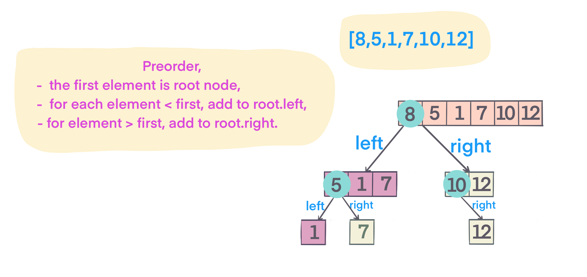

## Problem
[Construct Binary Search Tree from Preorder Traversal](https://leetcode.com/explore/challenge/card/30-day-leetcoding-challenge/530/week-3/3305/)

## Problem Description
```
Return the root node of a binary search tree that matches the given preorder traversal.

(Recall that a binary search tree is a binary tree where for every node, any descendant of node.left has a value < node.val, and any descendant of node.right has a value > node.val.  Also recall that a preorder traversal displays the value of the node first, then traverses node.left, then traverses node.right.)

Example 1:

Input: [8,5,1,7,10,12]
Output: [8,5,10,1,7,null,12]
```

```
Note: 

1 <= preorder.length <= 100
The values of preorder are distinct.
```

## Solution
Binary Search Tree, `left.val < root.val < right.val`
preorder (root -> left -> right) means the first is root value, recursively traverse array:
 - if smaller than root value, left tree
 - if bigger than root value, right tree

For example: 
 



####Complexity Analysis

**Time Complexity:** `O(N)`

- N - the length of array nums

#### Code

```java
class Solution {
    public TreeNode bstFromPreorder(int[] preorder) {
        return buildBST(preorder, Integer.MAX_VALUE);
    }

    int idx = 0;
    private TreeNode buildBST(int[] preorder, int limit) {
        if (idx == preorder.length || preorder[idx] > limit) return null;
        TreeNode root = new TreeNode(preorder[idx++]);
        // element value < root.val, add to root.left, limit set to root.val 
        root.left = buildBST(preorder, root.val);
        root.right = buildBST(preorder, limit);
        return root;
    }
}
```
