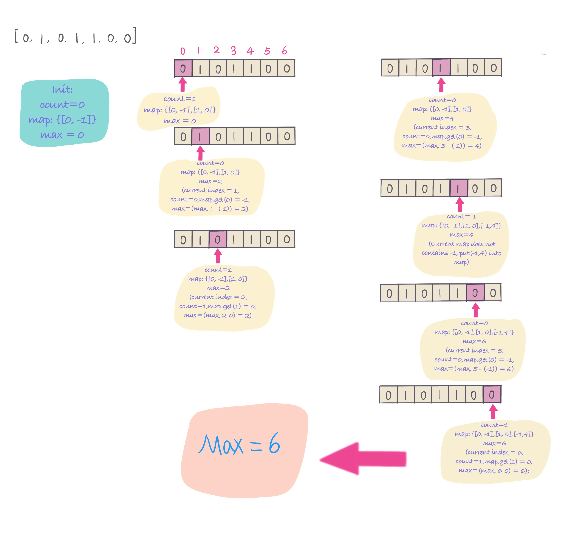

## Problem
[Contiguous Array](https://leetcode.com/explore/challenge/card/30-day-leetcoding-challenge/529/week-2/3298/)

## Problem Description
```
Given a binary array, find the maximum length of a contiguous subarray with equal number of 0 and 1.

Example 1:

Input: [0,1]
Output: 2
Explanation: [0, 1] is the longest contiguous subarray with equal number of 0 and 1.
Example 2:

Input: [0,1,0]
Output: 2
Explanation: [0, 1] (or [1, 0]) is a longest contiguous subarray with equal number of 0 and 1.
Note: The length of the given binary array will not exceed 50,000.
```

## Solution

Continuous subarray with equal 0 and 1, here counting 0s and 1s. 
- if 0s, count + 1,
- if 1s, count - 1. 
if encounter count = 0, then 0s and 1s are equal. then how to find the longest contiguous subarray? 
using map to keep track of count as key and index as value, if we encounter count = 0, keep the first count = 0 index, 
len = current index - map.get(count), max = max(max, len). 
and if encounter the same count, the meaning between previous same count and current count has equal number of 0s and 1s.

1. init HashMap<count, index> map, and count = 0, map.put(0, -1), why put(0, -1)? because for index 0, we need to init, otherwise
cannot count index 0 number. for example, [0,1] max = 2.
2. if 0s, count + 1, if 1s, count - 1
3. check whether map already contains count?
    - if not, put current count and current index into map. map.put(count, idx)
    - if yes, then check current length of equal number of 0s and 1s, len = idx - map.get(count). and compare max and len.
    max = max(max, len)
4. continue count 0s and 1s, until the end of array
5. return max


For example: 
 


####Complexity Analysis

**Time Complexity:** `O(N)`

**Space Complexity:** `O(N)`

- N - the length of array nums.

#### Code
**Java code**
```java
class Solution {
    public int findMaxLength(int[] nums) {
        if (nums == null || nums.length < 2) return 0;
        int max = 0;
        Map<Integer, Integer> map = new HashMap();
        map.put(0, -1);
        int count = 0;
        int len = nums.length;
        for (int i = 0; i < len; i++) {
            // if num == 0, count + 1, num = 1, count - 1
            count = nums[i] == 0 ? count + 1 : (count - 1);
            // if count already exit in map, means encounter equal number of 0s and 1s from previous index to current index
            if (map.containsKey(count)) {
                max = Math.max(max, i - map.get(count));
            } else {
               map.put(count, i); 
            }
        }
        return max;
    }
}
```

