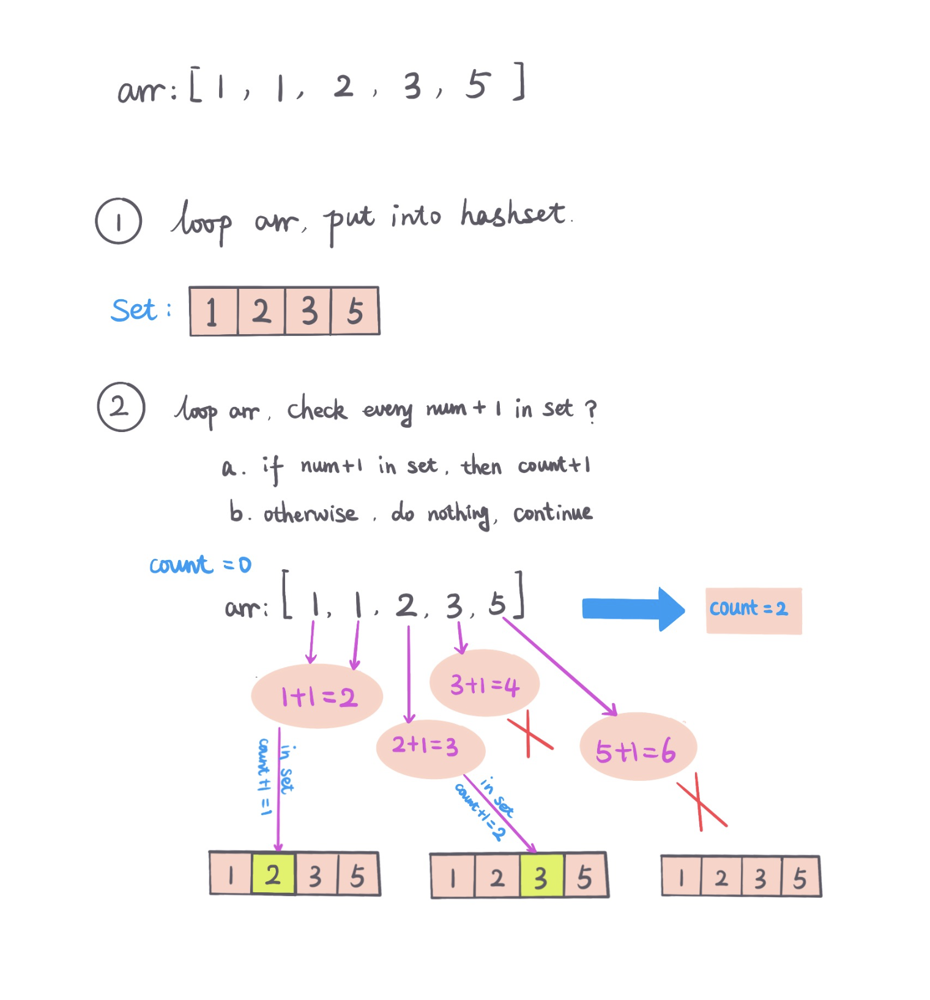

## Problem
[Counting Elements](https://leetcode.com/explore/challenge/card/30-day-leetcoding-challenge/528/week-1/3289/)

## Problem Description
```
Given an integer array arr, count element x such that x + 1 is also in arr.

If there're duplicates in arr, count them seperately.


Example 1:

Input: arr = [1,2,3]
Output: 2
Explanation: 1 and 2 are counted cause 2 and 3 are in arr.
Example 2:

Input: arr = [1,1,3,3,5,5,7,7]
Output: 0
Explanation: No numbers are counted, cause there's no 2, 4, 6, or 8 in arr.
Example 3:

Input: arr = [1,3,2,3,5,0]
Output: 3
Explanation: 0, 1 and 2 are counted cause 1, 2 and 3 are in arr.
Example 4:

Input: arr = [1,1,2,2]
Output: 2
Explanation: Two 1s are counted cause 2 is in arr.
 

Constraints:

1 <= arr.length <= 1000
0 <= arr[i] <= 1000
```

## Solution



**Time complexity**: 
```
    O(N)
    N - the length of array length
```

```java
class Solution {
    public int countElements(int[] arr) {
        if (arr == null || arr.length < 2) return 0;
        int count = 0;
        Set<Integer> set = new HashSet<>();
        for (int num : arr) {
            set.add(num);
        }
        for (int num : arr) {
            count += set.contains(num + 1) ? 1 : 0;
        }
        return count;
    }
}
```

