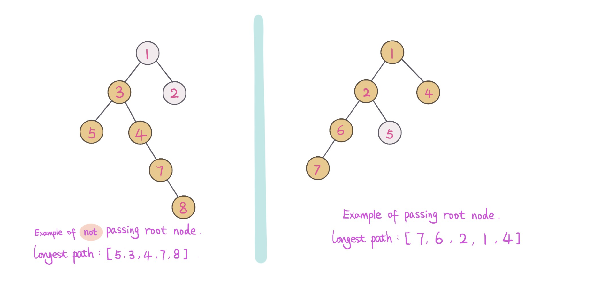

## Problem
[Diameter of Binary Tree](https://leetcode.com/explore/challenge/card/30-day-leetcoding-challenge/529/week-2/3293/)

## Problem Description
```
Given a binary tree, you need to compute the length of the diameter of the tree. 
The diameter of a binary tree is the length of the longest path between any two nodes in a tree. 
This path may or may not pass through the root.

Example:
Given a binary tree 

          1
         / \
        2   3
       / \     
      4   5    
Return 3, which is the length of the path [4,2,1,3] or [5,2,1,3].

Note: The length of path between two nodes is represented by the number of edges between them.
```

## Solution

From problem description, longest path mah or may not pass through the root. 

For example: 



The idea is to calculate the longest path from left subtree, and right subtree,
and record longest path (left, right, (left + right)). 

Using helper class Depth to record each node depth and max diameter.
This way we can optimize the time complexity to `O(n)`.

1. Recursively find the height of left subtree
2. Recursively find the height of right subtree
3. Calculate max diameter max(left diameter, right diameter, (left.height + right.height))
4. Return max depth and max diameter. 

####Complexity Analysis

**Time Complexity:** `O(n)`
- n - number of tree nodes.

#### Code
```java
class Solution {
    public int diameterOfBinaryTree(TreeNode root) {
        return getDepth(root).max;
    }
      
    private Depth getDepth(TreeNode node) {
        if (node == null) return new Depth(0, 0);
        Depth left = getDepth(node.left);
        Depth right = getDepth(node.right);
        // calculate diameter of current node
        int max = Math.max(Math.max(left.max, right.max), left.depth + right.depth);
        // calculate max depth
        int depth = 1 + Math.max(left.depth, right.depth);
        return new Depth(max, depth);
    }
    
    class Depth {
        int max;
        int depth;
        public Depth(int max, int depth) {
            this.max = max;
            this.depth = depth;
        }
    }
```

