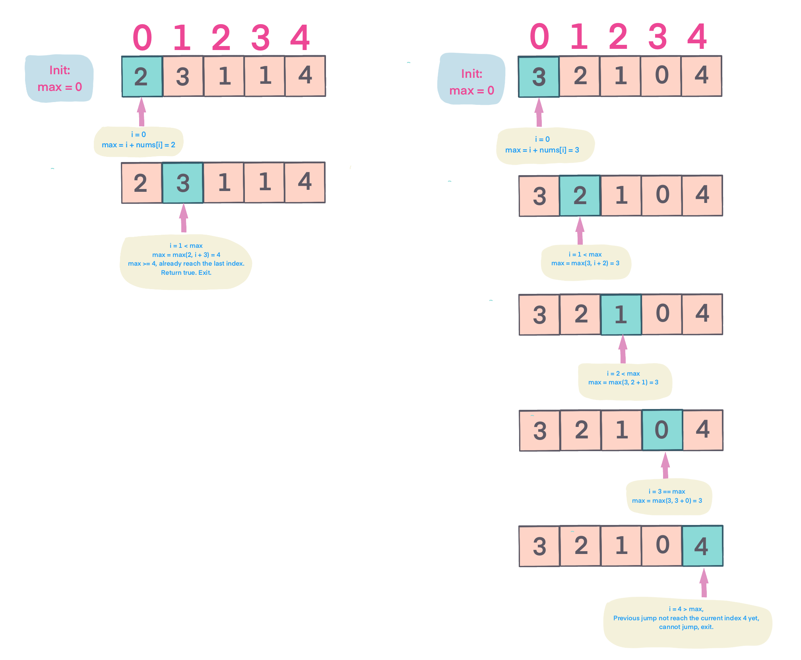

## Problem
[Jump Game](https://leetcode.com/explore/challenge/card/30-day-leetcoding-challenge/531/week-4/3310/)

## Problem Description
```
Given an array of non-negative integers, you are initially positioned at the first index of the array.

Each element in the array represents your maximum jump length at that position.

Determine if you are able to reach the last index.

Example 1:

Input: [2,3,1,1,4]
Output: true
Explanation: Jump 1 step from index 0 to 1, then 3 steps to the last index.
Example 2:

Input: [3,2,1,0,4]
Output: false
Explanation: You will always arrive at index 3 no matter what. Its maximum
             jump length is 0, which makes it impossible to reach the last index.
```

## Solution


For example: 
 



####Complexity Analysis

**Time Complexity:** `O(N)`

**Space Complexity:** `O(1)`

- N - the length of array nums

#### Code

```java
class Solution {
    public boolean canJump(int[] nums) {
        if (nums == null || nums.length == 0) return true;
        int len = nums.length;
        int max = 0;
        for (int i = 0; i < len; i++) {
            if (i > max) return false;
            max = Math.max(max, i + nums[i]);
            if (max >= len - 1) return true;
        }
        return max >= len - 1;
    }
}
```
